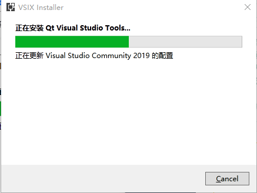

# 1. QWidget

QWidget类是所有可视控件的基类，控件是用户界面的最小元素，用于接受各种事件(如：鼠标、键盘等)并且绘制出来给用户观看。

每个控件都是矩形的，他们按照Z轴顺序排列。

如果控件没有父控件，则称之为窗口，窗口会被一个框架包裹(包含标题栏，边框等)，可以通过某些函数来修改边框属性。

# 2. QDialog

对话框窗口是一个顶级窗口，主要用于短期任务和与用户的简短通信。对话框可以是模态的也可以是非模态的。QDialog可以提供返回值，并且它们可以具有默认按钮。

注意QDialog(以及任何其他Qt::Dialog类型的小部件)使用父小部件与Qt中的其他类略有不同。对话框始终是顶级小部件，但如果它有父部件，它的默认位置将位于父部件的顶级小部件的顶部中心。它还将共享父任务栏条目(也就是说不会出现在任务栏)。

对话框有两种模式：模态对话框、非模态对话框。

## 模态对话框

模态对话框是阻止输入到同一应用程序中其他可见窗口的对话框，直到对话框被关闭。用于向用户请求文件名或用于设置应用程序首选项的对话框通常是模态的。对话框可以是**应用程序模式**(默认)或**窗口模式**。

当打开应用程序模态对话框时，用户必须完成与对话框的交互并关闭它，然后才能访问应用程序中的任何其他窗口。窗口模态对话框只阻止访问与对话框关联的窗口，允许用户继续使用应用程序中的其他窗口。

显示模态对话框最常用的方法是调用它的exec()函数。当用户关闭对话框时，exec()将提供一个有用的返回值。要关闭对话框并返回适当的值，必须连接一个默认按钮，例如，一个OK按钮连接到accept()槽，一个Cancel按钮连接到reject()槽。或者，您可以使用Accepted或Rejected调用done()槽。

使用open()函数，以窗口模式显示对话框。窗口模式的对话框会阻塞窗口的响应，但是不会影响后续代码的执行。

## 非模态对话框

非模态对话框是在同一应用程序中独立于其他窗口运行的对话框。文字处理程序中的查找和替换对话框通常是非模态的，允许用户与应用程序的主窗口和对话框进行交互。

非模态对话框使用show()显示，它会立即将控制权返回给调用者。


## 默认按钮

对话框的默认按钮是用户按Enter(返回)键时按下的按钮。此按钮用于表示用户接受对话框的设置并希望关闭对话框。使用QPushButton::setDefault()， QPushButton::isDefault()和QPushButton::autoDefault()来设置和控制对话框的默认按钮。

## ESC键

如果用户在对话框中按Esc键，QDialog::reject()将被调用。这将导致窗口关闭:关闭事件不能被忽略。

## 展开性

可扩展性是以两种方式显示对话框的能力:显示最常用选项的部分对话框和显示所有选项的完整对话框。通常，可扩展的对话框最初会以部分对话框的形式出现，但带有More切换按钮。如果用户按下More按钮，对话框将展开。


# 3. 设置exe图标

设置完窗口图标之后，我们可能需要设置可执行程序exe文件的图标，这个稍微麻烦一点点，但是也是三步搞定，走起！

+ 1，创建一个图标格式(ico)的文件，`可以将一个普通的图片转成.ico格式的图标文件`，[图片格式在线转换](https://convertio.co/zh/) 

+ 2，将转换好的ico文件放到源文件所在目录，即和CMakeLists.txt文件同级目录，并创建名为`icon.rc`的文件，写入如下内容。

  ```cpp
  IDI_ICON1 ICON DISCARDABLE "zay.ico"
  ```

+ 3，最后在CMakeLists.txt中添加如下命令

  ```cmake
  aux_source_directory(. MY_SCOURCES)
  add_executable(QtTest ${MY_SCOURCES} "icon.rc")
  ```

最后重新运行程序，找到exe，完成！     


# 3. Qt部署应用程序发布包

## windeployqt

windeployqt.exe是Qt自带的工具，用于创建应用程序发布包。 简单来说，这个工具可以自动地将某程序依赖的库、资源拷贝到其所在目录，防止程序在其他电脑上运行报找不到库的错误。

### 原理

windeployqt.exe工作原理很简单，它会到当前的环境变量PATH配置的搜索路径中，查找应用程序所需要的库和资源，拷贝到应用程序目录中。

### 使用

+ 先从开始菜单中打开**「对应版本的Qt」**的命令行终端界面，如下图：


+ 然后再命令行中输入`windeployqt AppName` ，AppName表示应用程序完整路径；

  我们知道，Qt项目路径不能包含中文，所以为了保险起见，应用程序路径中不要包含中文。另外，如果应用程序路径中包含空格，需要用双引号将整个路径字符串包裹起来。

### 注意坑

大体上的流程只有这两步。 整个发布过程看似比较简单，但是其中还是存在一些坑的。

**坑点一：未使用Qt的命令行终端执行发布命令，导致库版本拷贝错误**

**坑点二：未使用与Qt版本对应的windeployqt.exe**

**坑点三：发布时，默认文件不会覆盖**

如果已经存在同名的文件，则不会自动覆盖，可以通过添加强制覆盖参数--force强制覆盖已存在的文件。

```sh
windeployqt --force D:\test\maye.exe
```

**注意点：**命令行在启动是，会有一行提示,`记得调用vcvarsall.bat来完成环境设置!`


意思是说，我们还没有运行vcvarsall.bat，所以VS的环境变量没有配置好，因此不会拷贝VS相关的依赖库。

vcvarsall.bat是VS自带的配置环境变量的批处理文件。它的位置取决你的安装位置，我的在`D:\MySoftWare\Microsoft Visual Studio\2022\Professional\VC\Auxiliary\Build`下，接下来就尝试运行vcvarsall.bat来配置一下VS的环境。

```css
maye> D:\MySoftWare\\"Microsoft Visual Studio\"\2022\Professional\VC\Auxiliary\Build\vcvarsall.bat

maye>windeployqt F:\MyCode\QtTest.exe
```


这样发布出来的目录就带上了VS的依赖库，拷贝到没有安装VS的电脑上亦可以运行。


## Inno Setup

### 把发布包打包成安装程序

https://jrsoftware.org/isinfo.php


进入[Inno Setup]([Inno Setup Downloads (jrsoftware.org)](https://jrsoftware.org/isdl.php))官网，点击下载。


下载完成后，双击打开。


可恶，没有中文版本的，那就英文吧！


安装过程很简单，不赘述了，轻松即可安装完成！


### Inno Setup程序打包

1、创建新脚本


2、欢迎界面，点击下一步即可


3、程序信息填写：程序名称、版本号、公司名称、网站，填写完后，点击下一步


4、安装目录


5、添加需要打包的程序及依赖文件


6、应用程序文件关联，如果你的程序用打开某个后缀文件的功能，而且你希望用你的程序打开，则可以勾选关联，并指定关联的文件后缀名


7、快捷方式


这里默认勾选了开始菜单、桌面快捷方式。

8、程序文档：在安装过程中会打开文档展示给用户看


8、安装模式(默认是管理员模式)


9、安装语言，很遗憾没有中文


10、编译设置


11、使用Inno Setup 处理器


12、脚本创建完成


完成之后，会询问是否立即编译脚本！是！！！


还会问你，是否保存脚本？点击是，然后选择一个位置保存即可！


13、编译完成，会自动打开安装程序。


在前面选择的输出目录中就可以找到安装程序了。


### 卸载程序

如果想要方便的卸载已经安装好的程序，可以生成卸载程序。

```shell
[Setup]
;卸载程序
Uninstallable=yes
UninstallDisplayName=uninstall_YelloRiverManagerSystem
UninstallDisplayIcon=C:\Users\Maye\Desktop\黄河管理系统 2.0.2\logo.ico
```

### 让安装程序支持中文

首先，获得[中文翻译文件](./assets/software/)`ChineseSimple.isl`，然后放入Inno Setup的安装目录下的Languages目录下。


最后，还需要修改脚本重新编译。

```shell
[Setup]
;安装程序时，显示选择语言对话框
ShowLanguageDialog = yes

[Languages]
Name: "english"; MessagesFile: "compiler:Default.isl"
Name: "ChineseSimple"; MessagesFile: "compiler:Languages\ChineseSimple.isl"
```

### 安装一次之后，不能选择安装路径

如果程序安装一次之后，无论如何都不能选择安装路径了，则需要在[Setup]下添加如下语句。

```shell
UsePreviousAppDir=no
```


# 4. 资源系统qrc

> Qt助手参考：The Qt Resource System

Qt资源系统是一种平台无关的机制，用于在应用程序中传输资源文件。如果您的应用程序总是需要一组特定的文件(如图标、翻译文件、图像)，并且您不想使用特定于系统的方法来打包和定位这些资源，请使用它。

**优势：**

1. 将图片资源放到资源文件，可以方便管理
2. 当程序编译的时候, 资源文件中的图片会被转换为二进制, 打包到exe中
3. 直接发布exe就可以, 不需要额外提供图片资源了

## 4.1 Qt Creator

在Qt Creator中只需要添加一个新文件，选择Qt Resource File即可！


## 4.2 Vs

而在Vs中，是没有办法创建资源文件的，我们可以手动创建一个空的.qrc文件，然后打开。

但不幸的是，并没有单独打开qrc文件的程序，不过有带打开qrc文件的插件，另外为了方便，我直接已经下载好了程序[qrceditor.exe](assets/software/qrceditor.exe)。

然后把他拷贝到你的msvc套件的bin目录中吧，最后把它设置为qrc文件的默认打开方式即可。


**1. 打开VS**

选择菜单栏->扩展->管理扩展


**2.VS安装Qt插件**

选择菜单栏的 扩展->管理扩展，输入Qt搜索，然后下载Qt Visual Studio Tools（下载灰常的银杏，慢的死~还不一定能下载）


**如果实在不能忍受这龟速，咱们来别的办法**

先到Qt官网下载对于版本的插件，我这里是VS2022：

[Qt官网插件下载](https://download.qt.io/official_releases/vsaddin/2.8.1/)


如果跳到如下页面，选择清华大学镜像源下载即可。


3.安装VSIX(即上面下载的那个插件)

如果是通过Vs下载的，会自动安装。

如果是手动下载的，需要双击自己安装。

打开安装包之后，点击Install等待安装完成即可。


安装之前，请先关掉Vs`没有关掉会出现如下界面，点击end tasks即可`


关闭Vs之后，一秒安装完成



安装完成，关掉程序。

然后找到qrceditor.exe就可以了。


