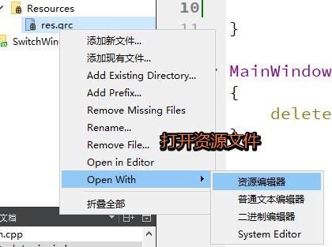
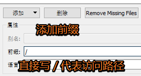

# 1. QWidget

> QWidget类是所有窗口类的父类(控件类是也属于窗口类), 并且QWidget类的父类的QObject, 也就意味着所有的窗口类对象只要指定了父对象, 都可以实现内存资源的自动回收。这里给大家介绍一下关于这个类常用的一些API函数。


## 父对象

```cpp
// 构造函数
QWidget::QWidget(QWidget *parent = nullptr, Qt::WindowFlags f = Qt::WindowFlags());

// 公共成员函数
// 给当前窗口设置父对象
void QWidget::setParent(QWidget *parent);
void QWidget::setParent(QWidget *parent, Qt::WindowFlags f);
// 获取当前窗口的父对象, 没有父对象返回 nullptr
QWidget *QWidget::parentWidget() const;
```


## 位置和尺寸

```cpp
//------------- 窗口位置 -------------
// 得到相对于当前窗口父窗口的几何信息, 边框也被计算在内
QRect QWidget::frameGeometry() const;
// 得到相对于当前窗口父窗口的几何信息, 不包括边框
const QRect& geometry() const;
// 设置当前窗口的几何信息(位置和尺寸信息), 不包括边框
void setGeometry(int x, int y, int w, int h);
void setGeometry(const QRect &);
//此属性保存小部件的内部几何形状，不包括任何窗口框架,等于QRect(0,0, width()， height()) 
QRect rect();
//获取小控件在父控件中的位置
QPoint pos() const
    
// 移动窗口, 重新设置窗口的位置
void move(int x, int y);
void move(const QPoint &);

//------------- 窗口尺寸 -------------
// 获取当前窗口的尺寸信息
QSize size() const
// 重新设置窗口的尺寸信息
void resize(int w, int h);
void resize(const QSize &);
// 获取当前窗口的最大尺寸信息
QSize maximumSize() const;
// 获取当前窗口的最小尺寸信息
QSize minimumSize() const;
// 设置当前窗口固定的尺寸信息
void QWidget::setFixedSize(const QSize &s);
void QWidget::setFixedSize(int w, int h);
// 设置当前窗口的最大尺寸信息
void setMaximumSize(const QSize &);
void setMaximumSize(int maxw, int maxh);
// 设置当前窗口的最小尺寸信息
void setMinimumSize(const QSize &);
void setMinimumSize(int minw, int minh);


// 获取当前窗口的高度    
int height() const;
// 获取当前窗口的最小高度
int minimumHeight() const;
// 获取当前窗口的最大高度
int maximumHeight() const;
// 给窗口设置固定的高度
void QWidget::setFixedHeight(int h);
// 给窗口设置最大高度
void setMaximumHeight(int maxh);
// 给窗口设置最小高度
void setMinimumHeight(int minh);

// 获取当前窗口的宽度
int width() const;
// 获取当前窗口的最小宽度
int minimumWidth() const;
// 获取当前窗口的最大宽度
int maximumWidth() const;
// 给窗口设置固定宽度
void QWidget::setFixedWidth(int w);
// 给窗口设置最大宽度
void setMaximumWidth(int maxw);
// 给窗口设置最小宽度
void setMinimumWidth(int minw);
```

## 窗口可见性/状态

```cpp
// 判断窗口是否可用
bool isEnabled() const;
// 设置窗口是否可用, 不可用窗口无法接收和处理窗口事件
void setEnabled(bool);

//------------- 窗口显示 -------------
// 关闭当前窗口
[slot] bool QWidget::close();
// 隐藏当前窗口
[slot] void QWidget::hide();
// 显示当前创建以及其子窗口
[slot] void QWidget::show();
//设置窗口是否可见
virtual void setVisible(bool visible)

// 全屏显示当前窗口, 只对windows有效
[slot] void QWidget::showFullScreen();
// 窗口最大化显示, 只对windows有效
[slot] void QWidget::showMaximized();
// 窗口最小化显示, 只对windows有效
[slot] void QWidget::showMinimized();
// 将窗口回复为最大化/最小化之前的状态, 只对windows有效
[slot] void QWidget::showNormal();
```


## 光标

### QCursor

这个类主要用于创建与特定小部件关联的鼠标光标，以及获取和设置鼠标光标的位置。

Qt有许多标准的游标形状，但您也可以基于QBitmap、掩码和热点定制游标形状。

要将游标与小部件关联，请使用QWidget::setCursor()。要将游标与所有小部件关联(通常是短时间内)，请使用QGuiApplication::setOverrideCursor()。

要设置游标形状，可以使用QCursor::setShape()或使用QCursor构造函数，它以游标的形状作为参数，或者您可以使用Qt::CursorShape枚举中定义的预定义游标之一。

如果你想用你自己的位图创建一个游标，使用QCursor构造函数，它接受一个位图和一个掩码，或者使用一个像素图作为参数的构造函数。

要设置或获取鼠标光标的位置，请使用静态方法QCursor::pos()和QCursor::setPos()。

#### Public Functions

```cpp
 QCursor(QCursor &&other)
 QCursor(const QCursor &c)
 QCursor(const QPixmap &pixmap, int hotX = -1, int hotY = -1)
 QCursor(const QBitmap &bitmap, const QBitmap &mask, int hotX = -1, int hotY = -1)
 QCursor(Qt::CursorShape shape)
 QCursor()
 QCursor &operator=(QCursor &&other)
 QCursor &operator=(const QCursor &c)
 ~QCursor()
 QBitmap bitmap() const
 QPoint hotSpot() const
 QBitmap mask() const
 QPixmap pixmap() const
 void setShape(Qt::CursorShape shape)
 Qt::CursorShape shape() const
 void swap(QCursor &other)
 QVariant operator QVariant() const
```

#### Static Public Members

```cpp
//获取鼠标的全局坐标
[static] QPoint pos()
[static] QPoint pos(const QScreen *screen)
//将鼠标移动到全局的指定坐标    
[static] void setPos(int x, int y)
[static] void setPos(QScreen *screen, int x, int y)
[static] void setPos(const QPoint &p)
[static] void setPos(QScreen *screen, const QPoint &p)
//QScreen在多屏幕的时候可用    
```

### 设置光标样式

通过QWidget的`setCursor`函数设置光标，Qt给我们内置了常见的光标，如果需要还可以自定义光标样式~

+ 以下代码可以通过点击按钮切换并查看所有内置光标的形状

```cpp
QPushButton*btn = new QPushButton("切换鼠标形状",this);
connect(btn,&QPushButton::clicked,this,[=]()
	{
    	static int i = 0;
    	this->setCursor(Qt::CursorShape(i));
    	i = (i+1)%25;
        qDebug()<<"切换成功"<<Qt::CursorShape(i);
    });

```

+ 下面我们将学习如何自定义光标形状，推荐一个下载图标的网站[iconfont图标下载网站](https://www.iconfont.cn/)

```cpp
QPixmap* cursorPixmaps[2]={new QPixmap("://images/cursor_one.png"),
                              new QPixmap("://images/cursor_two.png")};
QPushButton*btn = new QPushButton("切换鼠标样式",this);
connect(btn,&QPushButton::clicked,this,[=]()
{
    static int i = 0;
    setCursor(QCursor(*cursorPixmaps[i]));
    i = (i+1)%2;
});
```

## 帮助系统

在QWidget和子类中可以使用`setToolTip`设置提示信息，使用`toolTip`获取提示信息。

```cpp
 QString toolTip() const
 void setToolTip(const QString &)
```

当鼠标移动到控件上的时候，会显示提示信息！


除了提示信息之外，还有一个“这是什么”帮助系统，使用setWhatsThis设置"这是什么"信息。

+ 先创建三个按钮

  ```cpp
  QPushButton*btn1 = new QPushButton("open",this);  
  QPushButton*btn2 = new QPushButton("new",this);   
  QPushButton*btn3 = new QPushButton("look",this);  
  btn2->move(100,0);                                
  btn3->move(200,0);                                
                                                    
  btn1->setToolTip("打开文件");                         
  btn1->setWhatsThis("open a new file");            
                                                    
  btn2->setToolTip("新建文件");                         
  btn2->setWhatsThis("create a new file");          
                                                    
  btn3->setToolTip("查看");                           
  btn3->setWhatsThis("查看其他按钮的详细信息");                
                                                    
  connect(btn3,&QPushButton::clicked,this,[=]()     
  {                                                 
      QWhatsThis::enterWhatsThisMode();                
  });                                               
  ```

+ 运行程序后按Shift + F1会出现当前获得焦点的widget的whatsThis信息

+ 调用QWhatsThis的静态函数enterWhatsThisMode进入whatsThis模式，此时当鼠标移动到设置了whatsThis的widget上光标会出现一个问号，再点击则会出现whatsThis的窗口。


## 设置标题/图标

### 设置窗口标题

> windowTitle : QString

这个属性只对顶级小部件有意义，比如窗口和对话框。如果没有设置标题，则标题基于windowFilePath。如果两者都没有设置，则标题为空字符串。

如果您使用windowModified机制，窗口标题必须包含一个“[\*]”占位符，它指示'\*'应该出现在哪里。通常，它应该出现在文件名之后(例如，"document1.txt[*] -文本编辑器")。如果windowModified属性为false(默认值)，占位符就会被删除。

在某些桌面平台上(包括Windows和Unix)，如果设置了，应用程序名称(来自QGuiApplication::applicationDisplayName)会添加在窗口标题的末尾。这是由QPA插件完成的，所以它显示给用户，但不是windowTitle字符串的一部分。

Access functions:

```cpp
 QString windowTitle() const
 void setWindowTitle(const QString &)
```

Notifier signal:

```cpp
 void windowTitleChanged(const QString &title)
```

### 设置窗口图标

> windowIcon : QIcon

这个属性只对窗口有意义。如果没有设置图标，windowIcon()返回应用程序图标(QApplication::windowIcon())。

+ 修改窗口和任务栏显示的图标

```cpp
this->setWindowIcon(QIcon("://images/snowBall.png"));
```

Access functions:

```cpp
QIcon windowIcon() const
void setWindowIcon(const QIcon &icon)
```

Notifier signal:

```cpp
void windowIconChanged(const QIcon &icon)
```

QWidget类的`setWindowIcon`只能设置本窗口的图标，如果想要把所有的窗口图标都设置为同一个，需要使用`qApp->setWindowIcon()`;

### 设置exe图标

设置完窗口图标之后，我们可能需要设置可执行程序exe文件的图标，这个稍微麻烦一点点，但是也是三步搞定，走起！

+ 1，创建一个图标格式(ico)的文件，`可以将一个普通的图片转成.ico格式的图标文件`，[图片格式在线转换](https://convertio.co/zh/) 

+ 2，将转换好的ico文件放到源文件所在目录，即和CMakeLists.txt文件同级目录，并创建名为`icon.rc`的文件，写入如下内容。

  ```cpp
  IDI_ICON1 ICON DISCARDABLE "zay.ico"
  ```

+ 3，最后在CMakeLists.txt中添加如下命令

  ```cmake
  aux_source_directory(. MY_SCOURCES)
  add_executable(QtTest ${MY_SCOURCES} "icon.rc")
  ```

最后重新运行程序，找到exe，完成！

​           

## 坐标系统转换

```cpp
QPoint mapFrom(const QWidget *parent, const QPoint &pos) const
QPoint mapFromGlobal(const QPoint &pos) const
QPoint mapFromParent(const QPoint &pos) const
QPoint mapTo(const QWidget *parent, const QPoint &pos) const
QPoint mapToGlobal(const QPoint &pos) const
QPoint mapToParent(const QPoint &pos) const
```

+ 这几个函数都是转换相对坐标系用的. **用另一个坐标系统的坐标值, 来表达当前坐标系统中某个坐标所指向的某个点,**

  记住: 一定要先确**两个坐标系统**再确定**一个点**

+ **相对坐标**：获取自己相对于父控件的位置 QWidget::pos()

+ **绝对坐标**：将当前控件的相对位置转换为屏幕绝对位置 QWidget::mapToGlobal()

+ **绝对坐标转为相对坐标**：将屏幕绝对位置对应到控件的相对位置 QWidget::mapFromGlobal()

  

## 设置窗口状态

+ 将窗口状态设置为windowState。 窗口状态是[附录二](#附录二)中状态的组合。
+  如果窗口不可见(即isVisible()返回false)，窗口状态将在调用show()时生效。 对于可见窗口，更改是立即的。 例如，要在全屏模式和普通模式之间切换，请使用以下代码:  

```cpp
 w->setWindowState(w->windowState() ^ Qt::WindowFullScreen);
```

+ 为了恢复和激活最小化的窗口(同时保持其最大化和/或全屏状态)，使用以下方法:  

```cpp
w->setWindowState((w->windowState() & ~Qt::WindowMinimized) | Qt::WindowActive);
```

+ 调用这个函数将隐藏小部件。 必须调用show()使小部件再次可见，在某些窗口系统中，Qt::WindowActive不是立即的，在某些情况下可能会被忽略。  

## 设置窗口标志

+ 用Qt写一个窗口，如果继承QDialog，那窗口就只有关闭按钮，如果继承QWidget，那么就有关闭，最大化，最小化三个按钮，怎样才能让关闭按钮可用，而最大化和最小化按钮不可用呢？

```cpp
//仅仅显示关闭按钮，添加一个帮助按钮?
this->setWindowFlags(Qt::WindowType::WindowCloseButtonHint | Qt::WindowContextHelpButtonHint);
//从窗口标志中移除帮助按钮标志
this->setWindowFlags(windowFlags() & ~Qt::WindowContextHelpButtonHint);
//移除标志或单纯添加一个标志，可以用一下简单的函数	true为设置，false为移除
this->setWindowFlag(Qt::WindowContextHelpButtonHint,false);
```

+ 更多标志详见[附录一 ](#附录一 )

## 设置窗口属性

+ setAttribute用来设置小部件的属性，testAttribute查看是否设置了某种属性。

**常用属性**

| 枚举                         | 值(十进制) | 描述                                                         |
| ---------------------------- | ---------- | ------------------------------------------------------------ |
| Qt::WA_AcceptDrops           | 78         | 允许来自拖放操作的数据被拖放到小部件上(参见QWidget::setAcceptDrops()) |
| Qt::WA_AlwaysShowToolTips    | 84         | 为非活动窗口启用工具提示                                     |
| Qt::WA_CustomWhatsThis       | 47         | 表示小部件希望在“这是什么?”模式下继续正常运行。 这是由小部件的作者设置的。 |
| Qt::WA_DeleteOnClose         | 55         | 使Qt在小部件接受关闭事件时删除该小部件                       |
| Qt::WA_MouseTracking         | 2          | 指示小部件启用了鼠标跟踪。 参见QWidget:: mouseTracking       |
| Qt::WA_TranslucentBackground | 120        | 指示小部件应该有一个半透明的背景，也就是说，小部件的任何非透明区域都将是半透明的，因为小部件将有一个alpha通道。 设置此标志将导致设置WA_NoSystemBackground。 在Windows上，小部件还需要设置Qt:: framesswindowhint窗口标志。 该标志由小部件的作者设置或清除。 |

## 右键菜单

在桌面右击鼠标会出现菜单，这个我们一般叫做右键菜单，那么在Qt中我们如何使用右键菜单呢？

首先需要给控件设置上下文菜单策略 setContextMenuPolicy(Qt::CustomContextMenu) ；设置该策略后当我们右键点击控件时qt会发送一个信号 customContextMenuRequested(const QPoint &pos) ，其中参数pos用来传递右键点击时的鼠标的坐标，这个坐标一般是相对于控件左上角而言的；最后给这个信号设置相应的槽函数，在槽函数中将菜单展示出来就行了。

+ 设置上下文菜单策略

```css
setContextMenuPolicy(Qt::ContextMenuPolicy::CustomContextMenu);
```

+ 连接上下文菜单触发的信号

```cpp
connect(btn,&QPushButton::customContextMenuRequested,this,[=](const QPoint&pos)
{
    //在指定位置弹出菜单
    //contextMenu->exec(btn->mapToParent(this->mapToParent(pos)));
    contextMenu->exec(QCursor::pos());
});
```

+ 创建的菜单

```cpp
QMenu contextMenu = new QMenu;
QAction* copyAct = contextMenu->addAction("复制");
QAction* pasteAct= contextMenu->addAction("粘贴");
```


## Qt部署应用程序发布包

windeployqt.exe是Qt自带的工具，用于创建应用程序发布包。 简单来说，这个工具可以自动地将某程序依赖的库、资源拷贝到其所在目录，防止程序在其他电脑上运行报找不到库的错误。

### 原理

windeployqt.exe工作原理很简单，它会到当前的环境变量PATH配置的搜索路径中，查找应用程序所需要的库和资源，拷贝到应用程序目录中。

### 使用

+ 先从开始菜单中打开**「对应版本的Qt」**的命令行终端界面，如下图：


+ 然后再命令行中输入`windeployqt AppName` ，AppName表示应用程序完整路径；

  我们知道，Qt项目路径不能包含中文，所以为了保险起见，应用程序路径中不要包含中文。另外，如果应用程序路径中包含空格，需要用双引号将整个路径字符串包裹起来。

### 注意坑

大体上的流程只有这两步。 整个发布过程看似比较简单，但是其中还是存在一些坑的。

**坑点一：未使用Qt的命令行终端执行发布命令，导致库版本拷贝错误**

**坑点二：未使用与Qt版本对应的windeployqt.exe**

**坑点三：发布时，默认文件不会覆盖**

如果已经存在同名的文件，则不会自动覆盖，可以通过添加强制覆盖参数--force强制覆盖已存在的文件。

```sh
windeployqt --force D:\test\maye.exe
```

**注意点：**命令行在启动是，会有一行提示,`记得调用vcvarsall.bat来完成环境设置!`


意思是说，我们还没有运行vcvarsall.bat，所以VS的环境变量没有配置好，因此不会拷贝VS相关的依赖库。

vcvarsall.bat是VS自带的配置环境变量的批处理文件。它的位置取决你的安装位置，我的在`D:\MySoftWare\Microsoft Visual Studio\2022\Professional\VC\Auxiliary\Build`下，接下来就尝试运行vcvarsall.bat来配置一下VS的环境。

```css
maye> D:\MySoftWare\\"Microsoft Visual Studio\"\2022\Professional\VC\Auxiliary\Build\vcvarsall.bat

maye>windeployqt F:\MyCode\QtTest.exe
```


这样发布出来的目录就带上了VS的依赖库，拷贝到没有安装VS的电脑上亦可以运行。


# 2. 资源文件 .qrc

> 需要我们给窗口设置图标

```c++
// 弊端: 发布的exe 必须要加载 d:\\pic\\1.ico 如果对应的目录中么有图片, 图标就无法被加载
//			发布exe 需要额外发布图片, 将其部署到某个目录中
setWindowIcon(QIcon("d:\\pic\\1.ico"));
```

使用资源文件解决上述的弊端:

> 优势: 
>
> 1. 将图片资源放到资源文件
> 2. 当程序编译的时候, 资源文件中的图片会被转换为二进制, 打包到exe中
> 3. 直接发布exe就可以, 不需要额外提供图片资源了

在VS中使用资源文件，需要安装Vs的Qt插件，具体操作如下。

**2.1.打开VS**

选择菜单栏->扩展->管理扩展


**2.VS安装Qt插件**

选择菜单栏的 扩展->管理扩展，输入Qt搜索，然后下载Qt Visual Studio Tools（下载灰常的银杏，慢的死~还不一定能下载）


**如果实在不能忍受这龟速，咱们来别的办法**

先到Qt官网下载对于版本的插件，我这里是VS2022：

[Qt官网插件下载](https://download.qt.io/official_releases/vsaddin/2.8.1/)


如果跳到如下页面，选择清华大学镜像源下载即可。


3.安装VSIX(即上面下载的那个插件)

如果是通过Vs下载的，会自动安装。

如果是手动下载的，需要双击自己安装。

打开安装包之后，点击Install等待安装完成即可。


安装之前，请先关掉Vs`没有关掉会出现如下界面，点击end tasks即可`


关闭Vs之后，一秒安装完成


安装完成，关掉程序


资源文件的创建


- 资源文件的使用

  - 打开资源文件

  

  - 添加前缀

  

  - 添加文件

    

    - 弹出以文件选择对话框, 选择资源文件

      - 资源文件放到什么地方?
        - 放到和 项目文件  .pro 同一级目录或者更深的目录中
        - `错误的做法: 将资源文件放到 .pro文件的上级目录, 这样资源文件无法被加载到`

    - 资源文件中添加的图片资源

      

  - 如何在程序中使用资源文件中的图片

    


# 附录一 

+ 此枚举类型用于为小部件指定各种窗口系统属性。 它们相当不寻常，但在少数情况下是必要的。 其中一些标志取决于底层窗口管理器是否支持它们。

| 枚举              | 值(十六进制)        | 描述                                                         |
| ----------------- | ------------------- | ------------------------------------------------------------ |
| Qt::Widget        | 0x00000000          | 这是QWidget的默认类型。 这种类型的小部件如果有父部件，则为子部件，如果没有父部件，则为独立窗口。 |
| Qt::Window        | 0x00000001          | 指示小部件是一个窗口，通常带有窗口系统框架和标题栏，而不管小部件是否有父窗口。 |
| Qt::Dialog        | 0x00000002\| Window | 指示小部件是一个窗口，应该装饰为一个对话框(即，通常在标题栏中没有最大化或最小化按钮)。 |
| Qt::Sheet         | 0x00000004\| Window | 指示窗口是macOS上的工作表。 由于使用工作表意味着窗口模式，推荐的方法是使用QWidget::setWindowModality()，或QDialog::open() |
| Qt::Drawer        | Sheet \| Dialog     | 指示小部件是macOS上的一个抽屉                                |
| Qt::Popup         | 0x00000008\| Window | 指示小部件是弹出式顶级窗口，即它是模态窗口，但具有适合于弹出式菜单的窗口系统框架。 |
| Qt::Tool          | Popup \| Dialog     | 指示小部件是工具窗口。 工具窗口通常是一个小窗口，比通常的标题栏和装饰更小，通常用于工具按钮集合 |
| Qt::ToolTip       | Popup \| Sheet      | 指示小部件是一个工具提示。 这在内部用于实现工具提示          |
| Qt::SplashScreen  | ToolTip \| Dialog   | 表示该窗口为启动画面。 这是QSplashScreen的默认类型           |
| Qt::Desktop       | 0x00000010\| Window | 指示此小部件是桌面。 这是QDesktopWidget(此类已经过时)的类型  |
| Qt::SubWindow     | 0x00000012          | 指示此小部件是子窗口，例如QMdiSubWindow小部件                |
| Qt::ForeignWindow | 0x00000020\| Window | 表示此窗口对象是一个句柄，表示由另一个进程或手动使用本机代码创建的本机平台窗口。 |
| Qt::CoverWindow   | 0x00000040\| Window | 指示该窗口表示覆盖窗口，该窗口在某些平台上最小化应用程序时显示。 |

+ 窗口提示可以有多个(不一定会生效，看平台是否支持)

| 枚举                            | 值(十六进制)                                        | 描述                                                         |
| ------------------------------- | --------------------------------------------------- | ------------------------------------------------------------ |
| Qt::FramelessWindowHint         | 0x00000800                                          | 产生一个无边框的窗口。 用户不能通过窗口系统移动或调整无边框窗口的大小 |
| Qt::NoDropShadowWindowHint      | 0x40000000                                          | 去掉窗口阴影                                                 |
| Qt::CustomizeWindowHint         | 0x02000000                                          | 关闭默认的窗口标题提示                                       |
| Qt::WindowTitleHint             | 0x00001000                                          | 给窗口一个标题栏                                             |
| Qt::WindowSystemMenuHint        | 0x00002000                                          | 添加一个窗口系统菜单，可能还有一个关闭按钮(例如在Mac上)。 如果你需要隐藏或显示关闭按钮，使用WindowCloseButtonHint更便于移植。 |
| Qt::WindowMinimizeButtonHint    | 0x00004000                                          | 添加一个最小化按钮                                           |
| Qt::WindowMaximizeButtonHint    | 0x00008000                                          | 添加一个最大化按钮                                           |
| Qt::WindowMinMaxButtonsHint     | WindowMinimizeButtonHint \|WindowMaximizeButtonHint | 添加最小化和最大化按钮                                       |
| Qt::WindowCloseButtonHint       | 0x08000000                                          | 添加一个关闭按钮                                             |
| Qt::WindowContextHelpButtonHint | 0x00010000                                          | 向对话框添加上下文帮助按钮                                   |
| Qt::WindowStaysOnTopHint        | 0x00040000                                          | 通知窗口系统该窗口应该位于所有其他窗口的顶部                 |
| Qt::WindowStaysOnBottomHint     | 0x04000000                                          | 通知窗口系统该窗口应位于所有其他窗口的底部                   |

# 附录二

+ 窗口状态 `Qt::WindowState`

| 枚举                 | 值         | 描述                                 |
| -------------------- | ---------- | ------------------------------------ |
| Qt::WindowNoState    | 0x00000000 | 窗口没有状态设置(正常状态)           |
| Qt::WindowMinimized  | 0x00000001 | 窗口被最小化(即图标化)               |
| Qt::WindowMaximized  | 0x00000002 | 窗户周围有一个框架，使其最大化       |
| Qt::WindowFullScreen | 0x00000004 | 窗口填充了整个屏幕，周围没有任何边框 |
| Qt::WindowActive     | 0x00000008 | 该窗口是活动窗口，即它有键盘焦点     |

