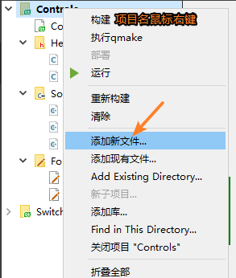

# 1. QWidget

> QWidget类是所有窗口类的父类(控件类是也属于窗口类), 并且QWidget类的父类的QObject, 也就意味着所有的窗口类对象只要指定了父对象, 都可以实现内存资源的自动回收。这里给大家介绍一下关于这个类常用的一些API函数。


```c++
// 构造函数
QWidget::QWidget(QWidget *parent = nullptr, Qt::WindowFlags f = Qt::WindowFlags());

// 公共成员函数
// 给当前窗口设置父对象
void QWidget::setParent(QWidget *parent);
void QWidget::setParent(QWidget *parent, Qt::WindowFlags f);
// 获取当前窗口的父对象, 没有父对象返回 nullptr
QWidget *QWidget::parentWidget() const;

//------------- 窗口位置 -------------
// 得到相对于当前窗口父窗口的几何信息, 边框也被计算在内
QRect QWidget::frameGeometry() const;
// 得到相对于当前窗口父窗口的几何信息, 不包括边框
const QRect& geometry() const;
// 设置当前窗口的几何信息(位置和尺寸信息), 不包括边框
void setGeometry(int x, int y, int w, int h);
void setGeometry(const QRect &);
//此属性保存小部件的内部几何形状，不包括任何窗口框架,等于QRect(0,0, width()， height()) 
QRect rect();
//获取小控件在父控件中的位置
QPoint pos() const
    
// 移动窗口, 重新设置窗口的位置
void move(int x, int y);
void move(const QPoint &);

//------------- 窗口尺寸 -------------
// 获取当前窗口的尺寸信息
QSize size() const
// 重新设置窗口的尺寸信息
void resize(int w, int h);
void resize(const QSize &);
// 获取当前窗口的最大尺寸信息
QSize maximumSize() const;
// 获取当前窗口的最小尺寸信息
QSize minimumSize() const;
// 设置当前窗口固定的尺寸信息
void QWidget::setFixedSize(const QSize &s);
void QWidget::setFixedSize(int w, int h);
// 设置当前窗口的最大尺寸信息
void setMaximumSize(const QSize &);
void setMaximumSize(int maxw, int maxh);
// 设置当前窗口的最小尺寸信息
void setMinimumSize(const QSize &);
void setMinimumSize(int minw, int minh);


// 获取当前窗口的高度    
int height() const;
// 获取当前窗口的最小高度
int minimumHeight() const;
// 获取当前窗口的最大高度
int maximumHeight() const;
// 给窗口设置固定的高度
void QWidget::setFixedHeight(int h);
// 给窗口设置最大高度
void setMaximumHeight(int maxh);
// 给窗口设置最小高度
void setMinimumHeight(int minh);

// 获取当前窗口的宽度
int width() const;
// 获取当前窗口的最小宽度
int minimumWidth() const;
// 获取当前窗口的最大宽度
int maximumWidth() const;
// 给窗口设置固定宽度
void QWidget::setFixedWidth(int w);
// 给窗口设置最大宽度
void setMaximumWidth(int maxw);
// 给窗口设置最小宽度
void setMinimumWidth(int minw);


//------------- 窗口图标 -------------
// 得到当前窗口的图标
QIcon windowIcon() const;
// 构造图标对象, 参数为图片的路径
QIcon::QIcon(const QString &fileName);
// 设置当前窗口的图标
void setWindowIcon(const QIcon &icon);

/*--Slots--*/
//------------- 窗口标题 -------------
// 得到当前窗口的标题
QString windowTitle() const;
// 设置当前窗口的标题
void setWindowTitle(const QString &);

void setWindowModified(bool)


// 判断窗口是否可用
bool isEnabled() const;
// 设置窗口是否可用, 不可用窗口无法接收和处理窗口事件
void setEnabled(bool);

//------------- 窗口显示 -------------
// 关闭当前窗口
[slot] bool QWidget::close();
// 隐藏当前窗口
[slot] void QWidget::hide();
// 显示当前创建以及其子窗口
[slot] void QWidget::show();
//设置窗口是否可见
virtual void setVisible(bool visible)

// 全屏显示当前窗口, 只对windows有效
[slot] void QWidget::showFullScreen();
// 窗口最大化显示, 只对windows有效
[slot] void QWidget::showMaximized();
// 窗口最小化显示, 只对windows有效
[slot] void QWidget::showMinimized();
// 将窗口回复为最大化/最小化之前的状态, 只对windows有效
[slot] void QWidget::showNormal();


//------------- 信号 -------------
// QWidget::setContextMenuPolicy(Qt::ContextMenuPolicy policy);
// 窗口的右键菜单策略 contextMenuPolicy() 参数设置为 Qt::CustomContextMenu, 按下鼠标右键发射该信号
[signal] void QWidget::customContextMenuRequested(const QPoint &pos);
// 窗口图标发生变化, 发射此信号
[signal] void QWidget::windowIconChanged(const QIcon &icon);
// 窗口标题发生变化, 发射此信号
[signal] void QWidget::windowTitleChanged(const QString &title);
```

## 设置鼠标样式

### Qcursor

```cpp
//获取鼠标的全局坐标
[static] QPoint pos()
[static] QPoint pos(const QScreen *screen)
//将鼠标移动到全局的指定坐标    
[static] void setPos(int x, int y)
[static] void setPos(QScreen *screen, int x, int y)
[static] void setPos(const QPoint &p)
[static] void setPos(QScreen *screen, const QPoint &p)
//QScreen在多屏幕的时候可用    
```


[iconfont图标下载网站](https://www.iconfont.cn/)

+ 以下代码可以通过点击按钮切换并查看所有鼠标的(内置)形状

```cpp
QPushButton*btn = new QPushButton("切换鼠标形状",this);
connect(btn,&QPushButton::clicked,this,[=]()
{
    static int i = 0;
    this->setCursor(Qt::CursorShape(i));
    qDebug()<<"切换成功"<<Qt::CursorShape(i);
    i = (i+1)%25;
    });
}
```

+ 除了内置形状之外，还可以自定义鼠标形状

```cpp
QPixmap* cursorPixmaps[2]={new QPixmap("://images/cursor_one.png"),
                              new QPixmap("://images/cursor_two.png")};
QPushButton*btn = new QPushButton("切换鼠标样式",this);
connect(btn,&QPushButton::clicked,this,[=]()
{
    static int i = 0;
    setCursor(QCursor(*cursorPixmaps[i]));
    i = (i+1)%2;
});
```

## setWhatsThis

setToolTip用来设置提示信息，那么setWhatsThis是用来干嘛的呢？顾名思义就是用来说明这是啥玩意的

+ 先创建三个按钮

  ```cpp
  QPushButton*btn1 = new QPushButton("open",this);  
  QPushButton*btn2 = new QPushButton("new",this);   
  QPushButton*btn3 = new QPushButton("look",this);  
  btn2->move(100,0);                                
  btn3->move(200,0);                                
                                                    
  btn1->setToolTip("打开文件");                         
  btn1->setWhatsThis("open a new file");            
                                                    
  btn2->setToolTip("新建文件");                         
  btn2->setWhatsThis("create a new file");          
                                                    
  btn3->setToolTip("查看");                           
  btn3->setWhatsThis("查看其他按钮的详细信息");                
                                                    
  connect(btn3,&QPushButton::clicked,this,[=]()     
  {                                                 
      QWhatsThis::enterWhatsThisMode();                
  });                                               
  ```

+ 运行程序后按Shift + F1会出现当前获得焦点的widget的whatsThis信息

+ 调用QWhatsThis的静态函数enterWhatsThisMode进入whatsThis模式，此时当鼠标移动到设置了whatsThis的widget上光标会出现一个问号，再点击则会出现whatsThis的窗口。


## 设置窗口图标

+ 修改窗口和任务栏显示的图标

```cpp
this->setWindowIcon(QIcon("://images/snowBall.png"));
```

## 设置应用程序图标

简单三步，搞定~

+ 1，创建一个图标格式(ico)的文件，`可以将一个普通的图片转成.ico格式的图标文件`

  [图片格式在线转换](https://convertio.co/zh/) 

+ 2，将转换好的ico文件放到源文件所在目录，即和.pro文件同级目录

+ 3，在.pro项目文件中添加如下代码`zay.ico 即图标名`

```cpp
RC_ICONS += zay.ico
```

## QWidget槽函数

**show,hide,setVisible,setHidden,close 小结**

+ 0，在Qt中如果一定要自己释放对象，官方推荐使用`[slot] void QObject::deleteLater()`来释放对象
+ 1，`[slot] void setVisible(bool visible)` 设置Widget可见或不可见

+ 2，`slot] void QWidget::setHidden(bool *hidden*)` 1号的马甲
+ 3，`[slot] void QWidget::show()` 1号的马甲
+ 4，`[slot] void QWidget::hide()`  1号的马甲
+ 5，`[slot] bool QWidget::close()` 看情况调用4号或者0号(该部件是否有父部件)

```cpp
呵呵，show()、hide()、setVisible()、setHidden() 这4个函数让人看得眼花缭乱。怎么办？
看看代码吧：
virtual void setVisible(bool visible);
inline void setHidden(bool hidden) { setVisible(!hidden); }
inline void show() { setVisible(true); }
inline void hide() { setVisible(false); }
```

代码很清楚：这四个东西之中，只有 setVisible 是独立的，其他三个都是它的马甲！
setVisible 的作用是什么呢？顾名思义，使得一个Widget可见或不可见。
**要点**：不可见，是Widget不在界面上显示，但不代表对象被析构！

```cpp
//[1]创建关闭自己的按钮
QPushButton* closeBtn = new QPushButton("closeSelf",this);
connect(closeBtn,&QPushButton::clicked,this,&Widget::close);
//点击右上角关闭按钮会销毁窗口
connect(this,&QObject::destroyed,this,[](){qDebug()<<"this destroyed";});

//[2]创建子窗口
QWidget* subWidget = new QWidget;
subWidget->setWindowTitle("subWidget");
subWidget->show();
//subWidget->setAttribute(Qt::WidgetAttribute::WA_DeleteOnClose);   //点击关闭按钮时销毁窗口        
connect(subWidget,&QWidget::destroyed,this,[=](){qDebug()<<"subWidget destroyed";});
//[3]创建关闭子窗口的按钮
QPushButton*closeSubWidgetBtn = new QPushButton("closeSubWidget",this);
closeSubWidgetBtn->move(100,0);
connect(closeSubWidgetBtn,&QPushButton::clicked,subWidget,[=](){
    subWidget->close();
    subWidget->deleteLater();   //推荐这样销毁对象
    qDebug()<<subWidget;
});
//[4]创建显示子窗口的按钮
QPushButton*showSubWidgetBtn = new QPushButton("showSubWidget",this);
showSubWidgetBtn->move(200,0);
connect(showSubWidgetBtn,&QPushButton::clicked,subWidget,&QWidget::show);             
```

## 坐标转换

```cpp
QPoint mapFrom(const QWidget *parent, const QPoint &pos) const
QPoint mapFromGlobal(const QPoint &pos) const
QPoint mapFromParent(const QPoint &pos) const
QPoint mapTo(const QWidget *parent, const QPoint &pos) const
QPoint mapToGlobal(const QPoint &pos) const
QPoint mapToParent(const QPoint &pos) const
```

+ 这几个函数都是转换相对坐标系用的. **用另一个坐标系统的坐标值, 来表达当前坐标系统中某个坐标所指向的某个点,**

  记住: 一定要先确**两个坐标系统**再确定**一个点**

+ **相对坐标**：获取自己相对于父控件的位置 QWidget::pos()

+ **绝对坐标**：将当前控件的相对位置转换为屏幕绝对位置 QWidget::mapToGlobal()

+ **绝对坐标转为相对坐标**：将绝对位置对应到控件的相对位置 QWidget::mapFromGlobal()

  

## 设置窗口标志

+ 用Qt写一个窗口，如果继承QDialog，那窗口就只有关闭按钮，如果继承QWidget，那么就有关闭，最大化，最小化三个按钮，怎样才能让关闭按钮可用，而最大化和最小化按钮不可用呢？

```cpp
//仅仅显示关闭按钮，添加一个帮助按钮?
this->setWindowFlags(Qt::WindowType::WindowCloseButtonHint | Qt::WindowContextHelpButtonHint);
//从窗口标志中移除帮助按钮标志
this->setWindowFlags(windowFlags() & ~Qt::WindowContextHelpButtonHint);
//移除标志或单纯添加一个标志，可以用一下简单的函数	true为设置，false为移除
this->setWindowFlag(Qt::WindowContextHelpButtonHint,false);
```

+ 更多标志详见[附录一 ](#附录一 )

## 设置窗口状态

+ 将窗口状态设置为windowState。 窗口状态是[附录二](#附录二)中状态的组合。
+  如果窗口不可见(即isVisible()返回false)，窗口状态将在调用show()时生效。 对于可见窗口，更改是立即的。 例如，要在全屏模式和普通模式之间切换，请使用以下代码:  

```cpp
 w->setWindowState(w->windowState() ^ Qt::WindowFullScreen);
```

+ 为了恢复和激活最小化的窗口(同时保持其最大化和/或全屏状态)，使用以下方法:  

```cpp
w->setWindowState((w->windowState() & ~Qt::WindowMinimized) | Qt::WindowActive);
```

+ 调用这个函数将隐藏小部件。 必须调用show()使小部件再次可见，在某些窗口系统中，Qt::WindowActive不是立即的，在某些情况下可能会被忽略。  


## 设置属性

+ setAttribute用来设置小部件的属性，testAttribute查看是否设置了某种属性。

**常用属性**

| 枚举                         | 值(十进制) | 描述                                                         |
| ---------------------------- | ---------- | ------------------------------------------------------------ |
| Qt::WA_AcceptDrops           | 78         | 允许来自拖放操作的数据被拖放到小部件上(参见QWidget::setAcceptDrops()) |
| Qt::WA_AlwaysShowToolTips    | 84         | 为非活动窗口启用工具提示                                     |
| Qt::WA_CustomWhatsThis       | 47         | 表示小部件希望在“这是什么?”模式下继续正常运行。 这是由小部件的作者设置的。 |
| Qt::WA_DeleteOnClose         | 55         | 使Qt在小部件接受关闭事件时删除该小部件                       |
| Qt::WA_MouseTracking         | 2          | 指示小部件启用了鼠标跟踪。 参见QWidget:: mouseTracking       |
| Qt::WA_TranslucentBackground | 120        | 指示小部件应该有一个半透明的背景，也就是说，小部件的任何非透明区域都将是半透明的，因为小部件将有一个alpha通道。 设置此标志将导致设置WA_NoSystemBackground。 在Windows上，小部件还需要设置Qt:: framesswindowhint窗口标志。 该标志由小部件的作者设置或清除。 |

## 发布程序

Qt 官方开发环境使用的动态链接库方式，在发布生成的exe程序时，需要复制一大堆 dll，如果自己去复制dll，很可能丢三落四，导致exe在别的电脑里无法正常运行。因此 Qt 官方开发环境里自带了一个工具：windeployqt.exe(这个文件在Qt安装目录的bin文件下可以找到)

不同的编译器和版本需要使用不同的windeployqt版本打包

以官方 Qt 5.14.2+MinGW32 开发环境为例：

+ 1，通过Qt命令行运行windeployqt工具，开始菜单->Qt 5.14.2->5.4->MinGW 4.9 (32-bit)->Qt 5.14.2 (MinGW 7.3.0 32-bit)
+ 把需要打包的Qt可执行程序拷贝到一个单独的文件夹里面，然后再把命令行工作目录切换到该文件夹
+ 最后执行命令`windeployqt maye.exe`

# 2. 资源文件 .qrc

> 需要我们给窗口设置图标

```c++
// 创建图标对象
QIcon::QIcon(const QString &fileName)
// QWidget类的 公共成员函数
void setWindowIcon(const QIcon &icon)

// 给窗口设置图标
// 弊端: 发布的exe 必须要加载 d:\\pic\\1.ico 如果对应的目录中么有图片, 图标就无法被加载
//			发布exe 需要额外发布图片, 将其部署到某个目录中
setWindowIcon(QIcon("d:\\pic\\1.ico"));
```

使用资源文件解决上述的弊端:

> 优势: 
>
> 1. 将图片资源放到资源文件
> 2. 当程序编译的时候, 资源文件中的图片会被转换为二进制, 打包到exe中
> 3. 直接发布exe就可以, 不需要额外提供图片资源了

资源文件的创建




- 资源文件的使用

  - 打开资源文件

  

  - 添加前缀

  

  - 添加文件

    

    - 弹出以文件选择对话框, 选择资源文件

      - 资源文件放到什么地方?
        - 放到和 项目文件  .pro 同一级目录或者更深的目录中
        - `错误的做法: 将资源文件放到 .pro文件的上级目录, 这样资源文件无法被加载到`

    - 资源文件中添加的图片资源

      

  - 如何在程序中使用资源文件中的图片

    


# 附录一 

+ 此枚举类型用于为小部件指定各种窗口系统属性。 它们相当不寻常，但在少数情况下是必要的。 其中一些标志取决于底层窗口管理器是否支持它们。

| 枚举              | 值(十六进制)        | 描述                                                         |
| ----------------- | ------------------- | ------------------------------------------------------------ |
| Qt::Widget        | 0x00000000          | 这是QWidget的默认类型。 这种类型的小部件如果有父部件，则为子部件，如果没有父部件，则为独立窗口。 |
| Qt::Window        | 0x00000001          | 指示小部件是一个窗口，通常带有窗口系统框架和标题栏，而不管小部件是否有父窗口。 |
| Qt::Dialog        | 0x00000002\| Window | 指示小部件是一个窗口，应该装饰为一个对话框(即，通常在标题栏中没有最大化或最小化按钮)。 |
| Qt::Sheet         | 0x00000004\| Window | 指示窗口是macOS上的工作表。 由于使用工作表意味着窗口模式，推荐的方法是使用QWidget::setWindowModality()，或QDialog::open() |
| Qt::Drawer        | Sheet \| Dialog     | 指示小部件是macOS上的一个抽屉                                |
| Qt::Popup         | 0x00000008\| Window | 指示小部件是弹出式顶级窗口，即它是模态窗口，但具有适合于弹出式菜单的窗口系统框架。 |
| Qt::Tool          | Popup \| Dialog     | 指示小部件是工具窗口。 工具窗口通常是一个小窗口，比通常的标题栏和装饰更小，通常用于工具按钮集合 |
| Qt::ToolTip       | Popup \| Sheet      | 指示小部件是一个工具提示。 这在内部用于实现工具提示          |
| Qt::SplashScreen  | ToolTip \| Dialog   | 表示该窗口为启动画面。 这是QSplashScreen的默认类型           |
| Qt::Desktop       | 0x00000010\| Window | 指示此小部件是桌面。 这是QDesktopWidget(此类已经过时)的类型  |
| Qt::SubWindow     | 0x00000012          | 指示此小部件是子窗口，例如QMdiSubWindow小部件                |
| Qt::ForeignWindow | 0x00000020\| Window | 表示此窗口对象是一个句柄，表示由另一个进程或手动使用本机代码创建的本机平台窗口。 |
| Qt::CoverWindow   | 0x00000040\| Window | 指示该窗口表示覆盖窗口，该窗口在某些平台上最小化应用程序时显示。 |

+ 窗口提示可以有多个(不一定会生效，看平台是否支持)

| 枚举                            | 值(十六进制)                                        | 描述                                                         |
| ------------------------------- | --------------------------------------------------- | ------------------------------------------------------------ |
| Qt::FramelessWindowHint         | 0x00000800                                          | 产生一个无边框的窗口。 用户不能通过窗口系统移动或调整无边框窗口的大小 |
| Qt::NoDropShadowWindowHint      | 0x40000000                                          | 去掉窗口阴影                                                 |
| Qt::CustomizeWindowHint         | 0x02000000                                          | 关闭默认的窗口标题提示                                       |
| Qt::WindowTitleHint             | 0x00001000                                          | 给窗口一个标题栏                                             |
| Qt::WindowSystemMenuHint        | 0x00002000                                          | 添加一个窗口系统菜单，可能还有一个关闭按钮(例如在Mac上)。 如果你需要隐藏或显示关闭按钮，使用WindowCloseButtonHint更便于移植。 |
| Qt::WindowMinimizeButtonHint    | 0x00004000                                          | 添加一个最小化按钮                                           |
| Qt::WindowMaximizeButtonHint    | 0x00008000                                          | 添加一个最大化按钮                                           |
| Qt::WindowMinMaxButtonsHint     | WindowMinimizeButtonHint \|WindowMaximizeButtonHint | 添加最小化和最大化按钮                                       |
| Qt::WindowCloseButtonHint       | 0x08000000                                          | 添加一个关闭按钮                                             |
| Qt::WindowContextHelpButtonHint | 0x00010000                                          | 向对话框添加上下文帮助按钮                                   |
| Qt::WindowStaysOnTopHint        | 0x00040000                                          | 通知窗口系统该窗口应该位于所有其他窗口的顶部                 |
| Qt::WindowStaysOnBottomHint     | 0x04000000                                          | 通知窗口系统该窗口应位于所有其他窗口的底部                   |

# 附录二

+ 窗口状态 `Qt::WindowState`

| 枚举                 | 值         | 描述                                 |
| -------------------- | ---------- | ------------------------------------ |
| Qt::WindowNoState    | 0x00000000 | 窗口没有状态设置(正常状态)           |
| Qt::WindowMinimized  | 0x00000001 | 窗口被最小化(即图标化)               |
| Qt::WindowMaximized  | 0x00000002 | 窗户周围有一个框架，使其最大化       |
| Qt::WindowFullScreen | 0x00000004 | 窗口填充了整个屏幕，周围没有任何边框 |
| Qt::WindowActive     | 0x00000008 | 该窗口是活动窗口，即它有键盘焦点     |

