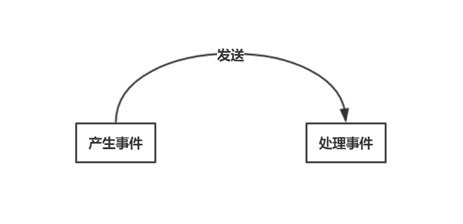
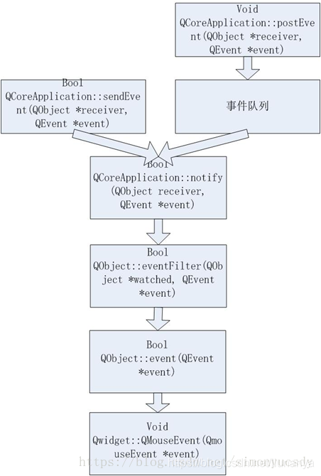
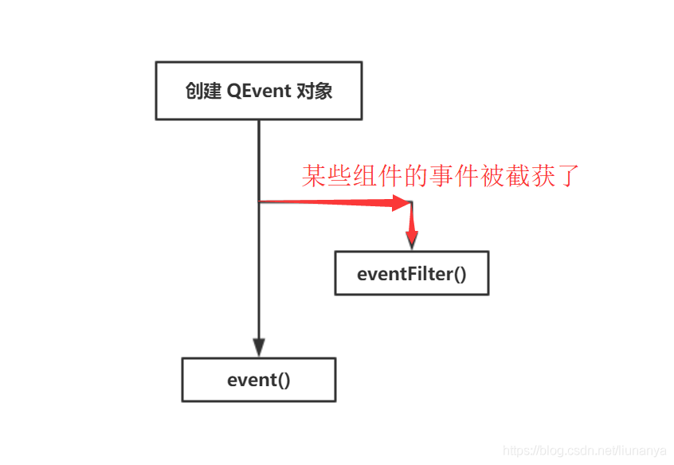

# 事件系统

> The Event System

在Qt中，事件是派生自抽象QEvent类的对象，它表示应用程序内发生的事情或应用程序需要知道的外部活动的结果。事件可以由QObject子类的任何实例接收和处理，但它们与小部件尤其相关。

Qt程序需要在main()函数创建一个QApplication对象，然后调用它的exec()函数。这个函数就是开始Qt的事件循环。在执行exec()函数之后，程序将进入事件循环来监听应用程序的事件，当事件发生时，Qt将创建一个**事件对象**。

## 事件是如何传递的？

当事件发生时，Qt通过构造适当的QEvent子类的实例来创建一个事件对象来表示它，并通过调用它的event()函数将它交付给QObject的一个特定实例(或它的一个子类)。

这个函数`event()`不处理事件本身；根据交付的事件类型，它为该特定类型的事件调用事件处理程序，并根据事件是被接受还是被忽略发送响应。

一些事件，如QMouseEvent和QKeyEvent，来自窗口系统；还有一些，比如QTimerEvent，来自其他来源；有些来自应用程序本身。

## 事件类型

大多数事件类型都有特殊的类，特别是QResizeEvent、QPaintEvent、QMouseEvent、QKeyEvent和QCloseEvent。每个类都是QEvent的子类，并添加特定于事件的函数。例如，QResizeEvent添加了size()和oldSize()，以使小部件能够发现它们的尺寸是如何被更改的。

有些类支持多个实际事件类型。QMouseEvent支持按下鼠标按钮、双击、移动和其他相关操作。

每个事件都有一个关联的类型，在QEvent:: type中定义，这可以用作运行时类型信息的方便来源，以快速确定给定事件对象是从哪个子类构建的。

由于程序需要以各种复杂的方式进行响应，Qt的事件传递机制非常灵活。

+ QCoreApplication::notify()的文档简洁地讲述了整个故事;
+ Qt季刊(Qt Quarterly)的文章《另一个看事件》[(Another Look at Events)](https://doc.qt.io/archives/qq/qq11-events.html)对它进行了重新梳理，但没有那么简洁。这里我们将对95%的应用程序进行足够的解释。

## 事件处理

传递事件的通常方式是调用虚函数。例如，QPaintEvent通过调用QWidget::paintEvent()来传递。这个虚函数负责进行适当的响应，通常是重新绘制小部件。如果在虚函数的实现中不执行所有必要的工作，则可以调用基类的实现。

### 事件处理函数

例如，下面的代码处理自定义按钮控件上的鼠标左键单击，同时将所有其他按钮单击传递给基本QPushButton类:

```cpp
void CustomButton::mousePressEvent(QMouseEvent* ev)override
{
	if (ev->button() == Qt::MouseButton::LeftButton)
	{
		//在这里处理鼠标左键
		qInfo() << "left buttondown";
	}
	else
	{
		//将其他案件传递给基类处理
		QPushButton::mousePressEvent(ev);
	}
}
```

注意：如果这样做了，按钮的clicked()和pressed()信号将不能被触发！

```cpp
class CustomButton : public QPushButton
{
public:
	CustomButton(QWidget* parent = nullptr)
		:QPushButton(parent)
	{
		//不能触发信号            
		connect(this, &QPushButton::clicked, this, []() {qInfo() << "clicked"; });
		connect(this, &QPushButton::pressed, this, []() {qInfo() << "pressed"; });
	}
	void mousePressEvent(QMouseEvent* ev)override
	{
		if (ev->button() == Qt::MouseButton::LeftButton)
		{
			//在这里处理鼠标左键
			qInfo() << "left buttondown";
		}
		else
		{
			//将其他案件传递给基类处理
			QPushButton::mousePressEvent(ev);
		}
	}
};
```

想要让父类也能够处理左键消息，可以把父类的mousePressEvent放在最后调用(不放在else中)。

```cpp
void CustomButton::mousePressEvent(QMouseEvent* ev)override
{
	if (ev->button() == Qt::MouseButton::LeftButton)
	{
		//在这里处理鼠标左键
		qInfo() << "left buttondown";
	}
	//将其他案件传递给基类处理
	QPushButton::mousePressEvent(ev);
}
```

#### 鼠标事件

##### 鼠标按下

```cpp
void CustomButton::mousePressEvent(QMouseEvent* ev)override
{
	//获取鼠标按键 类型为枚举:Qt::MouseButton::
	qInfo() << ev->button();

	//如果同时有多个鼠标按键按下,需要判断左键是否按下
	qInfo() << (ev->buttons() & Qt::MouseButton::LeftButton);

	//获取鼠标坐标 position()返回浮点坐标，可以使用pos()获取整型坐标
	qInfo() << ev->position();			//鼠标在本控件上的坐标
	qInfo() << ev->scenePosition();		//鼠标在本控件所在的窗口位置
	qInfo() << ev->globalPosition();	//鼠标相对于屏幕的坐标

	//将其他案件传递给基类处理
	QPushButton::mousePressEvent(ev);
}
```

##### 鼠标释放

```cpp
void CustomButton::mouseReleaseEvent(QMouseEvent*ev)override
{
	QPushButton::mouseReleaseEvent(ev);
}
```

##### 鼠标双击

```cpp
void CustomButton::mouseDoubleClickEvent(QMouseEvent*ev)override
{
	qInfo() << __FUNCTION__;
}
```

##### 鼠标移动

如果关闭了鼠标跟踪，则只有在移动鼠标时按下鼠标按钮时才会发生鼠标移动事件。如果打开了鼠标跟踪，即使没有按下鼠标按钮，也会发生鼠标移动事件。

按钮是自动追踪鼠标的，但是QWidget是不会的，如果要给QWidget的子类重写鼠标移动，需要使用` void setMouseTracking(bool enable)`启用鼠标追踪。

```cpp
void CustomButton::mouseMoveEvent(QMouseEvent* ev)override
{
	qInfo() << __FUNCTION__ << ev->pos();
}
```

##### 鼠标滚轮

返回轮子旋转的相对量，单位为八分之一度。正值表示转轮向前旋转，远离用户；负值表示转轮向后向用户旋转。angleDelta().y()提供自上一个事件以来旋转普通垂直鼠标滚轮的角度。如果鼠标有水平滚轮，angleDelta().x()提供水平鼠标滚轮旋转的角度，否则就是0。有些鼠标允许用户倾斜滚轮来进行水平滚动，有些触摸板支持水平滚动手势；它也会出现在angleDelta().x()中。

大多数鼠标类型的工作步长为15度，在这种情况下，delta值是120的倍数；即120单位* 1/8 = 15度。

然而，有些鼠标的滚轮分辨率更高，发送的delta值小于120单位(小于15度)。为了支持这种可能性，可以累计添加来自事件的增量值，直到达到120的值，然后滚动小部件，或者可以部分滚动小部件以响应每个轮事件。但是为了提供更原生的感觉，您应该更喜欢在有pixelDelta()的平台上使用它。

```cpp
void CustomButton::wheelEvent(QWheelEvent* ev)override
{
	//获取滚轮滚动方向
	QPoint numDegrees = ev->angleDelta();
	qInfo() <<"水平:" << numDegrees.x()/8 <<"垂直:" << numDegrees.y()/8;
}
```

##### Example：无边框窗口拖动

在做窗口应用程序时，为了使窗口更简洁，有时候会将窗口setWindowFlag();属性设置为“Qt::WindowType::FramelessWindowHint”，这时，窗口将不可拖动，但我们可以通过以下代码尝试解决无边框窗体的拖动问题。

**效果：**


**代码：**

```cpp
class Widget : public QWidget
{
    Q_OBJECT
public:
    Widget(QWidget* parent = nullptr)
        :QWidget(parent)
    {
        setWindowFlag(Qt::WindowType::FramelessWindowHint);
        //setMouseTracking(true);       //test
    }
    void mousePressEvent(QMouseEvent*ev)override
    {
        pressPos = ev->pos();
    }
    void mouseMoveEvent(QMouseEvent* ev)override
    {
        if (ev->buttons() & Qt::MouseButton::LeftButton)
        {
            move(ev->globalPosition().toPoint() - pressPos);
        }
        //qInfo() << __FUNCTION__;
    }
private:
    QPoint pressPos;
};
```

#### 键盘事件

##### 按键按下

```cpp
void keyPressEvent(QKeyEvent* ev)override
{
    //获取按键
    qInfo() <<"key:" << Qt::Key(ev->key());
    //返回此键生成的Unicode文本。不同平台按下Shift、Control、Alt和Meta等修饰键时的返回值不同，可能返回空字符串。
    qInfo() << "text:" << ev->text();

    //获取按下了什么键盘修饰符(shift、control、alt、meta(windows键)、keypad(小键盘，即数字键))
    qInfo() << ev->modifiers();
    //1,判断是否按下了组合键(快捷键、加速键)
    if (ev->modifiers() & Qt::KeyboardModifier::ControlModifier && ev->key() == Qt::Key::Key_S)
    {
        qInfo() << "1 保存，保存";
    }

    //2,判断是否按下了组合键，方便的函数
    if (ev->matches(QKeySequence::StandardKey::Save))
    {
        qInfo() <<"2 保存、保存";
    }
}
```

##### 按键释放

```cpp
void keyReleaseEvent(QKeyEvent* ev)override
{
	//同按下
}
```

##### Example：按钮移动

```cpp
class Widget : public QWidget
{
    Q_OBJECT
public:
    Widget(QWidget* parent = nullptr)
        :QWidget(parent)
    {
        setWindowFlag(Qt::WindowType::FramelessWindowHint);
        resize(640, 480);
        button = new QPushButton("玩蛇", this);
        button->setFocusPolicy(Qt::FocusPolicy::NoFocus);
    }
    void keyPressEvent(QKeyEvent* ev)override
    {
        switch (ev->key())
        {       
        case Qt::Key::Key_Up:
            button->move(button->pos() + QPoint(0, -1));
            break;
        case Qt::Key::Key_Down:
            button->move(button->pos() + QPoint(0, 1));
            break;
        case Qt::Key::Key_Left:
            button->move(button->pos() + QPoint(-1, 0));
            break;
        case Qt::Key::Key_Right:
            button->move(button->pos() + QPoint(1, 0));
            break;
        }
    }
private:
    QPushButton* button = nullptr;
};
```


#### 窗口事件

##### 窗口关闭

当Qt从窗口系统接收到一个顶级小部件的窗口关闭请求时，将用给定的事件调用此事件处理程序。

默认情况下，接受事件并关闭小部件。您可以重新实现此函数，以更改小部件响应窗口关闭请求的方式。例如，您可以通过在所有事件上调用ignore()来防止窗口关闭。

主窗口应用程序通常使用该函数的重新实现来检查用户的工作是否已保存，并在关闭前请求权限。

```CPP
void Widget::closeEvent(QCloseEvent* ev)override
{
    auto ret = QMessageBox::question(this, "温馨提示", "你有未保存的操作，是否保存并关闭？");
    if (ret == QMessageBox::StandardButton::Yes)
    {
        //保存并关闭
        ev->accept();
        //ev->setAccepted(true);
    }
    else
    {
        //不保存也不关闭
        ev->ignore();
        //ev->setAccepted(false);
    }
}
```

##### 窗口隐藏、显示

除隐藏和显示窗口外，窗口最小化会发送窗口隐藏事件，正常显示会发送窗口显示事件。

```cpp
void Widget::showEvent(QShowEvent* ev)override
{
    qInfo() << "我显示啦~";
}
void Widget::hideEvent(QHideEvent* ev)override
{
    qInfo() << "我隐藏啦~";
}

```

##### 窗口移动

```cpp
void Widget::moveEvent(QMoveEvent* ev)override
{
    qInfo() << "Widget moved" << "oldPos" << ev->oldPos() << "newPos" << ev->pos();
}

```

##### 窗口大小改变

```cpp
void  Widget::resizeEvent(QResizeEvent* ev)override
{
    qInfo() << "Widget SizeChanged" << "oldSize" << ev->oldSize() << "newSize" << ev->size();
}
```

##### 窗口焦点

这个事件处理程序可以在子类中重新实现，以接收小部件的键盘焦点事件(焦点接收)。

小部件通常必须将focuspolicy()设置为Qt::NoFocus以外的东西，以便接收焦点事件。(注意，程序员可以在任何小部件上调用setFocus()，即使是那些通常不接受焦点的小部件。)

默认实现更新小部件(不指定focusPolicy()的窗口除外)。

```cpp
void  Widget::focusInEvent(QFocusEvent* event)override
{
    qInfo() << "我有焦点啦？";
}
void  Widget::focusOutEvent(QFocusEvent* event)override
{
    qInfo() << "我有焦点没啦？";
}
```

##### 右键菜单

```cpp
 void  Widget::contextMenuEvent(QContextMenuEvent* ev)
 {
     qInfo() << "报告长官，请求弹出上下文菜单，也就是右键菜单！"
             << "请弹出在\n"
             << "全局坐标:"<<ev->globalPos()
             << "局部坐标:"<<ev->pos() << "位置";     
 }
```

#### 定时器事件

```cpp
class Widget : public QWidget
{
    Q_OBJECT
public:
    Widget(QWidget* parent = nullptr)
        :QWidget(parent)
    {
         //启动一个定时器，并返回定时器ID
        _timerID = startTimer(1000);
    } 
    void timerEvent(QTimerEvent* ev)override
    {
        if (ev->timerId() == _timerID)
        {
            //把控件往右移动5个像素
            move(this->pos() + QPoint(5, 0));
        }
    }
private:
    int _timerID;
};
```


#### 拖拽事件

> Drag and Drop

### 事件分发函数

如果希望替换基类的函数，则必须自己实现所有内容。但是，如果您只想扩展基类的功能，那么您可以实现您想要的功能，并调用基类来获得您不想处理的任何情况的默认行为。

有时，没有这样一个特定于事件的函数，或者特定于事件的函数是不够的。最常见的例子是按Tab键。通常情况下，QWidget会拦截这些来移动键盘焦点，但也有一些小部件本身需要Tab键。

这些对象可以重新实现QObject::event()(通用事件处理程序)，并在通常处理之前或之后执行它们的事件处理，或者它们可以完全替换函数。一个非常不寻常的小部件既解释Tab又具有特定于应用程序的自定义事件，它可能包含以下event()函数:


## 事件过滤


## 发送事件


# QWidget事件

## 鼠标事件

首先请注意，Qt中的QMouseEvent一般只涉及鼠标左键或右键的单击、释放等操作，而对鼠标滚轮的响应则通过QWheeEvent来处理。

QMouseEvent类包含了用于描述鼠标事件的参数。

当在一个窗口里按住鼠标按键、或移动、或释放就会产生鼠标事件QMouseEvent。

鼠标移动事件只会在按下鼠标按键的情况下才会发生，除非通过显式调用QWidget::setMouseTracking()函数来开启鼠标轨迹，这种情况下只要鼠标指针在移动，就会产生一系列的Qt鼠标事件；

在一个窗口中，当鼠标按键被按下时，Qt会自动捕捉鼠标轨迹，鼠标所在的窗口会继续接受鼠标事件，直到最后一个鼠标按键被释放。

需要对鼠标事件进行处理时，通常要重新实现以下几个鼠标事件处理函数

**事件处理**

鼠标事件使用的时候，加头文件

```cpp
#include <QMouseEvent>
```

### 1.鼠标按下事件

```cpp
void Widget::mousePressEvent(QMouseEvent *event)
{
    // 如果是鼠标左键按下
    if(event->button() == Qt::LeftButton)
   {
        ···
    }
    // 如果是鼠标右键按下
    else if(event->button() == Qt::RightButton)
   {
       ···
    }
}
```

### 2.鼠标移动事件 

默认情况下，触发事件需要点击一下，才能触发。可设置为自动触发:setMouseTracking(true); 

```cpp
this->setMouseTracking(true);
void Widget::mouseMoveEvent(QMouseEvent *event)
{
    //必须使用buttons()判断，鼠标当前所有状态都通过这个函数返回
    if(ev->buttons() & Qt::MouseButton::LeftButton)
    {
        qDebug()<<"左键按下并移动";
    }
}
```

### 3.鼠标释放事件

```cpp
void Widget::mouseReleaseEvent(QMouseEvent *event)
{
   ···
}
```


### 4.鼠标双击事件

```cpp
void Widget::mouseDoubleClickEvent(QMouseEvent *event)
{
    if(ev->button() == Qt::MouseButton::LeftButton)
    {
        qDebug()<<"左键双击";
    }
}
```

### 5.滚轮事件

```cpp
void Widget::wheelEvent(QWheelEvent *event)
{
    if(ev->angleDelta().y()>0)
    {
        qDebug()<<"向远离用户的方向";
    }else
    {
        qDebug()<<"向靠近用户的方向";
    }
}
```

### 6.鼠标移入事件

当鼠标进入小部件时产生

```cpp
void Widget::enterEvent(QEvent *ev)
{
   ...
}
```


### 7.鼠标移出事件

当鼠标移出小部件时产生

```cpp
void Widget::leaveEvent(QEvent *ev)
{
    ...
}
```

### Example：无边框窗口拖动

+ framelessWindow.h

```cpp
#include <QWidget>
#include<QPoint>
class framelessWindow : public QWidget
{
    Q_OBJECT

public:
    framelessWindow(QWidget *parent = Q_NULLPTR);
    void mousePressEvent(QMouseEvent* ev)override;
    void mouseMoveEvent(QMouseEvent* ev)override;

private:
    QPoint disPos;			//鼠标距离窗口左上角的距离(x y方向一起存储)
};
```

+ framelessWindow.cpp

```cpp
#include "framelessWindow.h"
#include<QEvent>
#include<QMouseEvent>
framelessWindow::framelessWindow(QWidget *parent)
    : QWidget(parent)
{
    setWindowFlags(Qt::WindowType::FramelessWindowHint);
    this->setMouseTracking(true);
    resize(430, 330);
}

void framelessWindow::mousePressEvent(QMouseEvent* ev)
{
    disPos = ev->pos();
}

void framelessWindow::mouseMoveEvent(QMouseEvent* ev)
{
    if(ev->buttons() & Qt::MouseButton::LeftButton == Qt::MouseButton::LeftButton)
        this->move(ev->globalPos() - disPos);
}
```


## 键盘事件

键盘按键事件通过QKeyEvent处理，包含了用于描述键盘事件的参数。

当在一个窗口里按住鼠标按键、或移动、或释放就会产生鼠标事件QMouseEvent。

+ int key()  返回按下或释放的键的代码
+ Qt::KeyboardModifiers modifiers()  返回事件发生后立即存在的键盘修饰符标志

需要对键盘事件进行处理时，通常要重新实现以下两个事件处理函数

### 1，按键按下事件

```cpp
void Widget::keyPressEvent(QKeyEvent *event)
{
    //单个键
    if(event->key() == Qt::Key::Key_Up)
    {
        qDebug()<<"上键按下";
    }
    else if(event->key() == Qt::Key::Key_Down)
    {
        qDebug()<<"下键按下";
    }
    else if(event->key() == Qt::Key::Key_Left)
    {
        qDebug()<<"左键按下";
    }
    else if(event->key() == Qt::Key::Key_Right)
    {
        qDebug()<<"右键按下";
    }
    //组合键 Ctrl + A
    if(event->modifiers() == Qt::KeyboardModifier::ControlModifier &&
            event->key() == Qt::Key::Key_A)
    {
        qDebug()<<"Ctrl + A";
    }
}
```


### 2，按键弹起事件

```cpp
void Widget::keyReleaseEvent(QKeyEvent *event)
{
    //单个键
    if(event->key() == Qt::Key::Key_Up)
    {
        qDebug()<<"上键释放";
    }
    else if(event->key() == Qt::Key::Key_Down)
    {
        qDebug()<<"下键释放";
    }
    else if(event->key() == Qt::Key::Key_Left)
    {
        qDebug()<<"左键释放";
    }
    else if(event->key() == Qt::Key::Key_Right)
    {
        qDebug()<<"右键释放";
    }

    if(event->modifiers() == Qt::KeyboardModifier::ControlModifier &&
            event->key() == Qt::Key::Key_A)
    {
        qDebug()<<"Ctrl + A 释放";
    }
}
```


## 窗口关闭事件

当Qt从窗口系统接收到一个顶级小部件的窗口关闭请求时，该事件处理程序将与给定的事件一起调用。  

默认情况下，接受事件并关闭小部件。 您可以重新实现这个函数，以更改小部件响应窗口关闭请求的方式。 例如，您可以通过对所有事件调用ignore()来防止窗口关闭。  

主窗口应用程序通常使用此函数的重新实现来检查用户的工作是否已被保存，并在关闭前请求许可。 

```cpp
void Widget::closeEvent(QCloseEvent *ev)
{
    this->hide();   //隐藏窗口
    ev->ignore();   //忽略关闭事件，窗口不会被关闭
    //ev->accept(); //接受关闭事件，窗口会被关闭或者隐藏(是不是最后一个窗口，或者有没有设置Qt::WA_DeleteOnClose属性)
}
```

## 程序状态改变事件

可以通过提供的事件检索该事件中正在更改的状态。  

```cpp
void Widget::changeEvent(QEvent *ev)
{
    if(ev->type() == QEvent::WindowStateChange)
    {
        if(this->windowState() == Qt::WindowState::WindowMinimized)
        {
            qDebug()<<"窗口最小化啦";
        }
        if(this->windowState() == Qt::WindowState::WindowNoState)
        {
            qDebug()<<"窗口正常显示啦";
        }
        if(this->windowState() == Qt::WindowState::WindowMaximized)
        {
            qDebug()<<"窗口最大化啦";
        }
    }
}
```


## 右键菜单事件

当小部件的contextMenuPolicy为Qt::DefaultContextMenu时，该处理程序被调用。  

```cpp
void Widget::contextMenuEvent(QContextMenuEvent *event)
{
    menu->popup(event->globalPos());
}
```


## 拖拽事件

当正在进行拖动并鼠标进入此小部件时，将调用此事件处理程序。 

+ 要想处理拖拽事件，必须调用函数this->setAcceptDrops(true);   接受拖拽
+ 在dragEnterEvent中接受事件：event->accept();

### 1，拖拽进入

```cpp
void DragArea::dragEnterEvent(QDragEnterEvent *event)
{
    auto *mdata = event->mimeData();
    if(mdata->hasUrls())
    {
        QString str;
       foreach(auto &url, mdata->urls())
       {
           str.append(url.path());
           qDebug()<<url.path();
       }
       this->setText(str);
    }

    event->accept();
}
```

### 2，拖拽移动

```cpp
void DragArea::dragMoveEvent(QDragMoveEvent *event)
{
    qDebug()<<"dragMove"<<event->mimeData()->text();
}
```


### 3，拖拽离开

```cpp
void DragArea::dragLeaveEvent(QDragLeaveEvent *event)
{
    qDebug()<<"dragLeave";
}
```


### 4，拖拽放开

```cpp
void DragArea::dropEvent(QDropEvent *event)
{
    qDebug()<<"drop"<<event->mimeData()->text();
}
```


## 焦点事件

小部件获得和失去键盘焦点事件。 将调用此事件处理程序。 

```cpp
virtual void focusInEvent(QFocusEvent *event)
virtual void focusOutEvent(QFocusEvent *event)
```


## 窗口隐藏、显示事件  

注意:当窗口系统改变窗口的映射状态时，窗口小部件会收到自发的显示和隐藏事件，例如，当用户最小化窗口时，会收到自发的隐藏事件，当窗口再次恢复时，会收到自发的显示事件。

```cpp
void Widget::hideEvent(QHideEvent *event)
{
    qDebug()<<"窗口隐藏啦~";
}

void Widget::showEvent(QShowEvent *event)
{
    qDebug()<<"窗口显示啦~";
}
```


## 窗口移动事件

```cpp
void Widget::moveEvent(QMoveEvent *event)
{
     qDebug()<<"原来的pos"<<event->oldPos()<<"现在的pos"<<event->pos();
}
```


## 窗口大小改变事件

```cpp
void Widget::resizeEvent(QResizeEvent *event)
{
    qDebug()<<"原来的大小"<<event->oldSize()<<"现在大小"<<event->size();
}
```


# QObject事件

## 定时器事件

```cpp
Widget::Widget(QWidget *parent)
    : QWidget(parent)
{
    oneTimer = startTimer(1000);	//开启定时器，并保存定时器Id
}
void Widget::timerEvent(QTimerEvent *event)
{

    if(event->timerId() == oneTimer)
    {
        static int i = 0;
        qDebug()<<"定时器 oneTimer"<<i++;
        if(i == 10)
        {
            killTimer(oneTimer);	//杀死定时器
        }
    }
}
```


# 自定义事件

首先要明白的是：“**在 Qt 里，一个事件就是一个对象，所有事件的祖先都来自于 QEvent**”。意思就是说，只要有一个事件发生（如鼠标单击事件），此时就会有一个 QEvent 对象被创建出来，然后开始各种传送。由于 Qt 事件系统是依托于元对象系统的，所以所有的 QObject 类都可以接收/处理 QEvent 事件。

说起事件，其实无非就是围绕着“产生-发送-处理”这个基本流程来说的。



## 如何产生一个事件？

这是最简单的知识点了，当然是创建一个对象啦。这问题和“如何创建一个整数”一样简单。所以我们先看下事件是什么样的一个类。

事件类就是分装了事件的一些信息，其中有一个每个事件类都独有的事件类型：QEvent::Type type

+ 这个 type 值的作用就是我们在处理事件时用于识别事件类的代号
+ **不能和系统值冲突**

我们在官方文档可以看到，Qt 自带的事件类的 type 值都已经在 QEvent::type 中有了，数值范围在 0 - 999 之间。

- **自定义的不能冲突**

而我自己定义的事件类也有个 type 值，如上文的代码“static const Type type”。为了保证我的这个值不和 Qt 的冲突，所以数值要大于 999。Qt 给我们规定了两个边界值：QEvent::User 和 QEvent::MaxUser，即 1000 - 65535。

但这也太难记了，怎么办？Qt 提供了一个函数 registerEventType() 专门用于自定义事件的注册。如下：

```text
const QEvent::Type MyEvent::type = (QEvent::Type)QEvent::registerEventType()
```

自定义事件类

```cpp
class MyEvent : public QEvent
{
public:
    MyEvent(const QString&name,int age);
    ~MyEvent();

    friend QDebug operator<<(QDebug&debug,const MyEvent& myEvent);
    friend QDebug operator<<(QDebug&debug,const MyEvent* myEvent);

    QString name;
    int age;
    //保存自定义事件的类型，所有自定义MyEvent事件对象共享
    inline static QEvent::Type myType = (QEvent::Type)QEvent::registerEventType();
};
```

```cpp
MyEvent::MyEvent(const QString&name,int age)
    :QEvent(myType)
    ,name(name)
    ,age(age)
{}

MyEvent::~MyEvent()
{
    qDebug()<<"~MyEvent";
}

QDebug operator<<(QDebug &debug, const MyEvent *myEvent)
{
    debug<<*myEvent;
}

QDebug operator<<(QDebug &debug, const MyEvent &myEvent)
{
    debug<<"("<<myEvent.name<<myEvent.age<<")";
    return debug;
}
```


好了，现在我们已经认识了 Qt 事件类长什么样了。接下来就是怎么把它发送出去了。

## 如何发送一个事件？

Qt 提供了三个 static 事件发送函数：**sendEvent、postEvent、sendPostedEvents**。函数原型如下：

```cpp
void postEvent(QObject *receiver, QEvent *event, int priority = Qt::NormalEventPriority)
bool sendEvent(QObject *receiver, QEvent *event)
```

**直接发送：sendEvent**

这是最好理解的，两个参数中一个是要发给谁，另一个是发送什么事件。使用notify()函数将事件直接发送给接收方，返回从事件处理程序返回的值(阻塞式)，因此事件被发送的时候，event 对象并不会被销毁，因此**我们要在栈上创建 event 对象**。

```cpp
MyEvent ev("顽石",18);
QApplication::sendEvent(this,&ev);
```


**发到队列：postEvent**

我们创建一个 Qt 程序的时候，一般在 main 下面会看到 QCoreApplication a(argc, argv) 以及 return a.exec() 的字样。这其实就是开启了 Qt 事件循环来维护一个事件队列，exec 的本质就是不停的调用 processEvent() 函数从队列中获取事件来处理。而 postEvent() 的作用就是把事件发送到这个队列中去。

 这种方式不需要等待处理结果，只要把事件发到队列中就可以了，所以返回值是 void。由于事件队列会持有发送的事件对象，在事件被处理后会自动 delete 掉，所以**我们必须在堆上创建 event 对象**。

```cpp
MyEvent *pev = new MyEvent("maye",20);
QApplication::postEvent(this,pev);
```

**在队列中立即处理：sendPostedEvents**

看参数我们就可以知道，这个函数的作用就是立刻、马上将队列中的 event_type 类型的事件立马交给 receiver 进行处理。需要注意的是，来自窗口系统的事件并不由这个函数进行处理，而是 processEvent()。

## 如何处理一个事件？

event() 函数本身不会去处理事件，而是根据事件类型（type值）调用不同的**事件处理函数**。

创建了事件，发送了事件，接下来就是怎么接收处理事件了。

+ 系统事件通过`virtual void event(QEvent *event)`处理
+ 自定义事件通过`virtual void customEvent(QEvent *event)`处理，当然也可以通过event来处理

```cpp
void Widget::customEvent(QEvent *ev)
{
    if(ev->type() == MyEvent::myType)
    {
        MyEvent *myEvent = static_cast<MyEvent*>(ev);
        qDebug()<<"customEvent"<<myEvent;
    }
}

bool Widget::event(QEvent *ev)
{
    if(ev->type() == MyEvent::myType)
    {
        MyEvent *myEvent = static_cast<MyEvent*>(ev);
        qDebug()<<"event"<<myEvent;
        return true;
    }
    return QWidget::event(ev);
}
```

需要注意的是，重写事件处理器函数时，如果不实现任何功能，最好调用基类的实现。就像上面的那段代码，Qt 本身就已经写了一大堆的实现了，你要是不写上 QWidget::event(ev)这个代码，那你写的这个继承于 QWidget类的 Widget就不会对鼠标点击产生任何反应。正所谓“你要不会干这事，叫你爸爸来做吧”。

至此，一个完整的事件处理过程已经说完了。此时的你应该不仅了解了 Qt 自带的类是如何处理事件的，而且写个自定义事件也是应该是能下手了。接下来我们对事件处理再说说其他方便的功能：过滤、接收/忽略。


# 事件传播机制

## 事件分发机制

[事件传递顺序以及监听特定控件是否接收某个事件](https://blog.csdn.net/liunanya/article/details/102650938)



1.事件首先由Qt的ServerApplication去接收来自于外部或内部的一些行为，鼠标点击，键盘输入，时钟事件等，分析并决定送往对应 的对象去处理(内部管理机制，如有机会另文分析)，最后会调用[virtual] bool QCoreApplication::notify ( QObject * receiver, QEvent * event ) 去处理，当然这个是虚函数，你可以在子类去重新实现它 。

2.在notify(…)中，在发给对应的接收者前，会先把消息送给QApplication。所以如果想在你界面的Widget前先处理那些事 件，那么你可以给QApplication对象installEventFilter,然后在对应的eventFilter()里先把这些事件都给过一 遍，然后你可以过滤一些不必要事件·。

3.如果QApplication没有处理那些事件，然后就是交给事件接收对象了。在这个对象接收前，也可以为这对象加一个事件过滤器，同样是 installEventFilter，不过它的调用者是事件接收者(也就是前面那个reveiver参数)，而不是 QApplication/QCoreApplication.

4.如果你写了具体的mouseEvent()，或者keyEvent()等具体实现句柄实现后，接收处理该事件，那么该事件不会再传递了，然后就会进入接收者的event()函数（你可以里面根据事件的不同类型尽情处理），如果event事件在接受者处理后，也不会上传给父类的event，否则会上传进入父类的event。

5.默认event()函数根据事件类型会调用不同的事件处理函数,类似mouseEvent(),keyEvent()去分别处理他们。

## 事件传递

QEvent有 accept()函数 和 ignore()函数

**accept():**本组件处理该事件，这个事件就不会被继续传播给其父组件；

**ignore():**本组件不想要处理这个事件。这个事件会被继续传播给其父组件；

注意：**这里事件的传播是在组件层次上面的，而不是依靠类继承机制(父对象而不是父类)。**

+ 如果想要调用父类的处理函数，直接调用即可

```cpp
class Button : public QPushButton
{
    Q_OBJECT
public:
    Button(QWidget*parent=nullptr);
    void mousePressEvent(QMouseEvent*ev)override;
};
Button::Button(QWidget*parent)
    :QPushButton(parent)
{

}

void Button::mousePressEvent(QMouseEvent *ev)
{
    if(event->button() == Qt::LeftButton)
    {
        ....//点击左键后实现的功能
    } else {
        QPushButton::mousePressEvent(event); //交给父类处理
    }
}
```

如果重写了mousePressEvent但是不调用父类的mousePressEvent，鼠标点击按钮时，将不会触发任何信号。

+ 组件传播

```cpp
#include"button.h"
class Widget : public QWidget
{
    Q_OBJECT
public:
    Widget(QWidget *parent = nullptr);
    ~Widget();
    void mousePressEvent(QMouseEvent *event) override;
};

Widget::Widget(QWidget *parent)
    : QWidget(parent)
{
    resize(640,480);

    Button *btn= new Button(this);
    btn->setText("hello");
    connect(btn,&Button::clicked,this,[](){qDebug()<<"clicked";});
}

Widget::~Widget()
{
}

void Widget::mousePressEvent(QMouseEvent *event)
{
    qDebug()<<"Widget~";
}
```

由于事件处理函数都是默认接受的，所以先把Button中的QPushButton::mousePressEvent(ev)去掉，代码如下

```cpp
void Button::mousePressEvent(QMouseEvent *ev)
{
  	ev->ignore();		//Widget::mousePressEvent会被调用
    //ev->accept();   	//Widget::mousePressEvent不会被调用 (如果都不写，默认就是这个)
    //QPushButton::mousePressEvent(ev);
}
```


## 事件过滤

看完了事件的传播流程，如果说我们想屏蔽某些事件，或者对某些事件进行特殊的处理，就需要用到事件过滤了



+ 任意的**QObject对象**都可以作为事件过滤器使用
+ 事件过滤器的实现,需要重写**eventFilter()**函数
+ 组件要想被监控,则需要通过**installEventFilter()**安装事件过滤器
+ 事件过滤器能够决定是否将事件转发给组件对象

```cpp
 //如果已经安装此对象，则此对象作为被监视对象的事件过滤器。
[virtual] bool QObject::eventFilter(QObject *watched, QEvent *event)
//在此对象上安装事件筛选器filterObj
void QObject::installEventFilter(QObject *filterObj)
//从该对象中移除事件筛选器对象obj。    
void QObject::removeEventFilter(QObject *obj)
```

+ 下面案例演示了如何过滤按键按下事件

```cpp
bool Widget::eventFilter(QObject *watched, QEvent *ev)
{
    if(ev->type()==QEvent::KeyPress)
    {
        return true;	//返回true表示事件已处理，不会继续传递了
    }
    return false;
}
installEventFilter(this);	//必须安装过滤器
```


# 事件类型

QEvent 类是所有事件类的基类，事件对象包含事件参数。

Qt 的主事件循环（QCoreApplication::exec()）从事件队列中获取本地窗口系统事件，将它们转化为 QEvents，然后将转换后的事件发送给 QObjects。

一般来说，事件来自底层窗口系统（spontaneous() 返回 true），但也可以使用 QCoreApplication::sendEvent() 和 QCoreApplication::postEvent()（spontaneous() 返回 false）来手动发送事件。

基本的 QEvent 只包含了一个事件类型参数。QEvent 的子类包含了额外的描述特定事件的参数。

## QEvent::Type

这个枚举类型定义了Qt中有效的事件类型。事件类型和每个类型的专门类如下：

| 常量                                     | 值                  | 描述                                                         |
| :--------------------------------------- | :------------------ | :----------------------------------------------------------- |
| QEvent::None                             | 0                   | 不是一个事件                                                 |
| QEvent::ActionAdded                      | 114                 | 一个新 action 被添加（QActionEvent）                         |
| QEvent::ActionChanged                    | 113                 | 一个 action 被改变（QActionEvent）                           |
| QEvent::ActionRemoved                    | 115                 | 一个 action 被移除（QActionEvent）                           |
| QEvent::ActivationChange                 | 99                  | Widget 的顶层窗口激活状态发生了变化                          |
| QEvent::ApplicationActivate              | 121                 | 这个枚举已被弃用，使用 ApplicationStateChange 代替           |
| QEvent::ApplicationActivated             | ApplicationActivate | 这个枚举已被弃用，使用 ApplicationStateChange 代替           |
| QEvent::ApplicationDeactivate            | 122                 | 这个枚举已被弃用，使用 ApplicationStateChange 代替           |
| QEvent::ApplicationFontChange            | 36                  | 应用程序的默认字体发生了变化                                 |
| QEvent::ApplicationLayoutDirectionChange | 37                  | 应用程序的默认布局方向发生了变化                             |
| QEvent::ApplicationPaletteChange         | 38                  | 应用程序的默认调色板发生了变化                               |
| QEvent::ApplicationStateChange           | 214                 | 应用程序的状态发生了变化                                     |
| QEvent::ApplicationWindowIconChange      | 35                  | 应用程序的图标发生了变化                                     |
| QEvent::ChildAdded                       | 68                  | 一个对象获得孩子（QChildEvent）                              |
| QEvent::ChildPolished                    | 69                  | 一个部件的孩子被抛光（QChildEvent）                          |
| QEvent::ChildRemoved                     | 71                  | 一个对象时区孩子（QChildEvent）                              |
| QEvent::Clipboard                        | 40                  | 剪贴板的内容发生改变                                         |
| QEvent::Close                            | 19                  | Widget 被关闭（QCloseEvent）                                 |
| QEvent::CloseSoftwareInputPanel          | 200                 | 一个部件要关闭软件输入面板（SIP）                            |
| QEvent::ContentsRectChange               | 178                 | 部件内容区域的外边距发生改变                                 |
| QEvent::ContextMenu                      | 82                  | 上下文弹出菜单（QContextMenuEvent）                          |
| QEvent::CursorChange                     | 183                 | 部件的鼠标发生改变                                           |
| QEvent::DeferredDelete                   | 52                  | 对象被清除后将被删除（QDeferredDeleteEvent）                 |
| QEvent::DragEnter                        | 60                  | 在拖放操作期间鼠标进入窗口部件（QDragEnterEvent）            |
| QEvent::DragLeave                        | 62                  | 在拖放操作期间鼠标离开窗口部件（QDragLeaveEvent）            |
| QEvent::DragMove                         | 61                  | 拖放操作正在进行（QDragMoveEvent）                           |
| QEvent::Drop                             | 63                  | 拖放操作完成（QDropEvent）                                   |
| QEvent::DynamicPropertyChange            | 170                 | 动态属性已添加、更改或从对象中删除                           |
| QEvent::EnabledChange                    | 98                  | 部件的 enabled 状态已更改                                    |
| QEvent::Enter                            | 10                  | 鼠标进入部件的边界（QEnterEvent）                            |
| QEvent::EnterEditFocus                   | 150                 | 编辑部件获得焦点进行编辑，必须定义 QT_KEYPAD_NAVIGATION      |
| QEvent::EnterWhatsThisMode               | 124                 | 当应用程序进入“What’s This?”模式，发送到 toplevel 顶层部件   |
| QEvent::Expose                           | 206                 | 当其屏幕上的内容无效，发送到窗口，并需要从后台存储刷新       |
| QEvent::FileOpen                         | 116                 | 文件打开请求（QFileOpenEvent）                               |
| QEvent::FocusIn                          | 8                   | 部件或窗口获得键盘焦点（QFocusEvent）                        |
| QEvent::FocusOut                         | 9                   | 部件或窗口失去键盘焦点（QFocusEvent）                        |
| QEvent::FocusAboutToChange               | 23                  | 部件或窗口焦点即将改变（QFocusEvent）                        |
| QEvent::FontChange                       | 97                  | 部件的字体发生改变                                           |
| QEvent::Gesture                          | 198                 | 触发了一个手势（QGestureEvent）                              |
| QEvent::GestureOverride                  | 202                 | 触发了手势覆盖（QGestureEvent）                              |
| QEvent::GrabKeyboard                     | 188                 | Item 获得键盘抓取（仅限 QGraphicsItem）                      |
| QEvent::GrabMouse                        | 186                 | 项目获得鼠标抓取（仅限 QGraphicsItem）                       |
| QEvent::GraphicsSceneContextMenu         | 159                 | 在图形场景上的上下文弹出菜单（QGraphicsScene ContextMenuEvent） |
| QEvent::GraphicsSceneDragEnter           | 164                 | 在拖放操作期间，鼠标进入图形场景（QGraphicsSceneDragDropEvent） |
| QEvent::GraphicsSceneDragLeave           | 166                 | 在拖放操作期间鼠标离开图形场景（QGraphicsSceneDragDropEvent） |
| QEvent::GraphicsSceneDragMove            | 165                 | 在场景上正在进行拖放操作（QGraphicsSceneDragDropEvent）      |
| QEvent::GraphicsSceneDrop                | 167                 | 在场景上完成拖放操作（QGraphicsSceneDragDropEvent）          |
| QEvent::GraphicsSceneHelp                | 163                 | 用户请求图形场景的帮助（QHelpEvent）                         |
| QEvent::GraphicsSceneHoverEnter          | 160                 | 鼠标进入图形场景中的悬停项（QGraphicsSceneHoverEvent）       |
| QEvent::GraphicsSceneHoverLeave          | 162                 | 鼠标离开图形场景中一个悬停项（QGraphicsSceneHoverEvent）     |
| QEvent::GraphicsSceneHoverMove           | 161                 | 鼠标在图形场景中的悬停项内移动（QGraphicsSceneHoverEvent）   |
| QEvent::GraphicsSceneMouseDoubleClick    | 158                 | 鼠标在图形场景中再次按下（双击）（QGraphicsSceneMouseEvent） |
| QEvent::GraphicsSceneMouseMove           | 155                 | 鼠标在图形场景中移动（QGraphicsSceneMouseEvent）             |
| QEvent::GraphicsSceneMousePress          | 156                 | 鼠标在图形场景中按下（QGraphicsSceneMouseEvent）             |
| QEvent::GraphicsSceneMouseRelease        | 157                 | 鼠标在图形场景中释放（QGraphicsSceneMouseEvent）             |
| QEvent::GraphicsSceneMove                | 182                 | 部件被移动（QGraphicsSceneMoveEvent）                        |
| QEvent::GraphicsSceneResize              | 181                 | 部件已调整大小（QGraphicsSceneResizeEvent）                  |
| QEvent::GraphicsSceneWheel               | 168                 | 鼠标滚轮在图形场景中滚动（QGraphicsSceneWheelEvent）         |
| QEvent::Hide                             | 18                  | 部件被隐藏（QHideEvent）                                     |
| QEvent::HideToParent                     | 27                  | 子部件被隐藏（QHideEvent）                                   |
| QEvent::HoverEnter                       | 127                 | 鼠标进入悬停部件（QHoverEvent）                              |
| QEvent::HoverLeave                       | 128                 | 鼠标留离开悬停部件（QHoverEvent）                            |
| QEvent::HoverMove                        | 129                 | 鼠标在悬停部件内移动（QHoverEvent）                          |
| QEvent::IconDrag                         | 96                  | 窗口的主图标被拖走（QIconDragEvent）                         |
| QEvent::IconTextChange                   | 101                 | 部件的图标文本发生改变（已弃用）                             |
| QEvent::InputMethod                      | 83                  | 正在使用输入法（QInputMethodEvent）                          |
| QEvent::InputMethodQuery                 | 207                 | 输入法查询事件（QInputMethodQueryEvent）                     |
| QEvent::KeyboardLayoutChange             | 169                 | 键盘布局已更改                                               |
| QEvent::KeyPress                         | 6                   | 键盘按下（QKeyEvent）                                        |
| QEvent::KeyRelease                       | 7                   | 键盘释放（QKeyEvent）                                        |
| QEvent::LanguageChange                   | 89                  | 应用程序翻译发生改变                                         |
| QEvent::LayoutDirectionChange            | 90                  | 布局的方向发生改变                                           |
| QEvent::LayoutRequest                    | 76                  | 部件的布局需要重做                                           |
| QEvent::Leave                            | 11                  | 鼠标离开部件的边界                                           |
| QEvent::LeaveEditFocus                   | 151                 | 编辑部件失去编辑的焦点，必须定义 QT_KEYPAD_NAVIGATION        |
| QEvent::LeaveWhatsThisMode               | 125                 | 当应用程序离开“What’s This?”模式，发送到顶层部件             |
| QEvent::LocaleChange                     | 88                  | 系统区域设置发生改变                                         |
| QEvent::NonClientAreaMouseButtonDblClick | 176                 | 鼠标双击发生在客户端区域外                                   |
| QEvent::NonClientAreaMouseButtonPress    | 174                 | 鼠标按钮按下发生在客户端区域外                               |
| QEvent::NonClientAreaMouseButtonRelease  | 175                 | 鼠标按钮释放发生在客户端区域外                               |
| QEvent::NonClientAreaMouseMove           | 173                 | 鼠标移动发生在客户区域外                                     |
| QEvent::MacSizeChange                    | 177                 | 用户更改了部件的大小（仅限 OS X）                            |
| QEvent::MetaCall                         | 43                  | 通过 QMetaObject::invokeMethod() 调用异步方法                |
| QEvent::ModifiedChange                   | 102                 | 部件修改状态发生改变                                         |
| QEvent::MouseButtonDblClick              | 4                   | 鼠标再次按下（QMouseEvent）                                  |
| QEvent::MouseButtonPress                 | 2                   | 鼠标按下（QMouseEvent）                                      |
| QEvent::MouseButtonRelease               | 3                   | 鼠标释放（QMouseEvent）                                      |
| QEvent::MouseMove                        | 5                   | 鼠标移动（QMouseEvent）                                      |
| QEvent::MouseTrackingChange              | 109                 | 鼠标跟踪状态发生改变                                         |
| QEvent::Move                             | 13                  | 部件的位置发生改变（QMoveEvent）                             |
| QEvent::NativeGesture                    | 197                 | 系统检测到手势（QNativeGestureEvent）                        |
| QEvent::OrientationChange                | 208                 | 屏幕方向发生改变（QScreenOrientationChangeEvent）            |
| QEvent::Paint                            | 12                  | 需要屏幕更新（QPaintEvent）                                  |
| QEvent::PaletteChange                    | 39                  | 部件的调色板发生改变                                         |
| QEvent::ParentAboutToChange              | 131                 | 部件的 parent 将要更改                                       |
| QEvent::ParentChange                     | 21                  | 部件的 parent 发生改变                                       |
| QEvent::PlatformPanel                    | 212                 | 请求一个特定于平台的面板                                     |
| QEvent::PlatformSurface                  | 217                 | 原生平台表面已创建或即将被销毁（QPlatformSurfaceEvent）      |
| QEvent::Polish                           | 75                  | 部件被抛光                                                   |
| QEvent::PolishRequest                    | 74                  | 部件应该被抛光                                               |
| QEvent::QueryWhatsThis                   | 123                 | 如果部件有“What’s This?”帮助，应该接受事件                   |
| QEvent::ReadOnlyChange                   | 106                 | 部件的 read-only 状态发生改变                                |
| QEvent::RequestSoftwareInputPanel        | 199                 | 部件想要打开软件输入面板（SIP）                              |
| QEvent::Resize                           | 14                  | 部件的大小发生改变（QResizeEvent）                           |
| QEvent::ScrollPrepare                    | 204                 | 对象需要填充它的几何信息（QScrollPrepareEvent）              |
| QEvent::Scroll                           | 205                 | 对象需要滚动到提供的位置（QScrollEvent）                     |
| QEvent::Shortcut                         | 117                 | 快捷键处理（QShortcutEvent）                                 |
| QEvent::ShortcutOverride                 | 51                  | 按下按键，用于覆盖快捷键（QKeyEvent）                        |
| QEvent::Show                             | 17                  | 部件显示在屏幕上（QShowEvent）                               |
| QEvent::ShowToParent                     | 26                  | 子部件被显示                                                 |
| QEvent::SockAct                          | 50                  | Socket 激活，用于实现 QSocketNotifier                        |
| QEvent::StateMachineSignal               | 192                 | 信号被传递到状态机（QStateMachine::SignalEvent）             |
| QEvent::StateMachineWrapped              | 193                 | 事件是一个包装器，用于包含另一个事件（QStateMachine::WrappedEvent） |
| QEvent::StatusTip                        | 112                 | 状态提示请求（QStatusTipEvent）                              |
| QEvent::StyleChange                      | 100                 | 部件的样式发生改变                                           |
| QEvent::TabletMove                       | 87                  | Wacom 写字板移动（QTabletEvent）                             |
| QEvent::TabletPress                      | 92                  | Wacom 写字板按下（QTabletEvent）                             |
| QEvent::TabletRelease                    | 93                  | Wacom 写字板释放（QTabletEvent）                             |
| QEvent::OkRequest                        | 94                  | Ok 按钮在装饰前被按下，仅支持 Windows CE                     |
| QEvent::TabletEnterProximity             | 171                 | Wacom 写字板进入接近事件（QTabletEvent），发送到 QApplication |
| QEvent::TabletLeaveProximity             | 172                 | Wacom 写字板离开接近事件（QTabletEvent），发送到 QApplication |
| QEvent::ThreadChange                     | 22                  | 对象被移动到另一个线程。这是发送到此对象的最后一个事件在上一个线程中，参见：QObject::moveToThread() |
| QEvent::Timer                            | 1                   | 定时器事件（QTimerEvent）                                    |
| QEvent::ToolBarChange                    | 120                 | 工具栏按钮在 OS X 上进行切换                                 |
| QEvent::ToolTip                          | 110                 | 一个 tooltip 请求（QHelpEvent）                              |
| QEvent::ToolTipChange                    | 184                 | 部件的 tooltip 发生改变                                      |
| QEvent::TouchBegin                       | 194                 | 触摸屏或轨迹板事件序列的开始（QTouchEvent）                  |
| QEvent::TouchCancel                      | 209                 | 取消触摸事件序列（QTouchEvent）                              |
| QEvent::TouchEnd                         | 196                 | 触摸事件序列结束（QTouchEvent）                              |
| QEvent::TouchUpdate                      | 195                 | 触摸屏事件（QTouchEvent）                                    |
| QEvent::UngrabKeyboard                   | 189                 | Item 失去键盘抓取（QGraphicsItem）                           |
| QEvent::UngrabMouse                      | 187                 | Item 失去鼠标抓取（QGraphicsItem、QQuickItem）               |
| QEvent::UpdateLater                      | 78                  | 部件应该排队在以后重新绘制                                   |
| QEvent::UpdateRequest                    | 77                  | 部件应该被重绘                                               |
| QEvent::WhatsThis                        | 111                 | 部件应该显示“What’s This”帮助（QHelpEvent）                  |
| QEvent::WhatsThisClicked                 | 118                 | 部件的“What’s This”帮助链接被点击                            |
| QEvent::Wheel                            | 31                  | 鼠标滚轮滚动（QWheelEvent）                                  |
| QEvent::WinEventAct                      | 132                 | 发生了 Windows 特定的激活事件                                |
| QEvent::WindowActivate                   | 24                  | 窗口已激活                                                   |
| QEvent::WindowBlocked                    | 103                 | 窗口被模态对话框阻塞                                         |
| QEvent::WindowDeactivate                 | 25                  | 窗户被停用                                                   |
| QEvent::WindowIconChange                 | 34                  | 窗口的图标发生改变                                           |
| QEvent::WindowStateChange                | 105                 | 窗口的状态（最小化、最大化或全屏）发生改变（QWindowStateChangeEvent） |
| QEvent::WindowTitleChange                | 33                  | 窗口的标题发生改变                                           |
| QEvent::WindowUnblocked                  | 104                 | 一个模态对话框退出后，窗口将不被阻塞                         |
| QEvent::WinIdChange                      | 203                 | 本地窗口的系统标识符发生改变                                 |
| QEvent::ZOrderChange                     | 126                 | 部件的 z 值发生了改变，该事件不会发送给顶层窗口              |

用户事件的值应该介于 QEvent:: 和 QEvent::MaxUser之间。

| 常量            | 值    | 描述              |
| --------------- | ----- | ----------------- |
| QEvent::User    | 1000  | 用户定义的事件    |
| QEvent::MaxUser | 65535 | 最后的用户事件 ID |

为方便起见，可以使用 ` [static] int QEvent::registerEventType(int *hint* = -1)` 函数来注册和存储一个自定义事件类型，这样做会避免意外地重用一个自定义事件类型。


## 属性文档

+ accepted : bool

设置 accept 标志意味着接收器需要该事件，不需要的事件可能会被传递给它的父窗口。默认情况下，isAccepted() 设置为 true。不能依赖于此，因为子类可能会在子类构造器中清除该标志。

出于简便考虑，accept 标志可以通过 accept() 设置，ignore() 清除。

访问函数：

```cpp
bool isAccepted() const
void setAccepted(bool accepted)
```

## 成员函数文档

```cpp
void QEvent::accept()
```


设置事件对象的 accept 标志，等价于 setAccepted(true)。

设置 accept 标志意味着接收器需要该事件，不需要的事件可能会被传递给它的父窗口。


```cpp
void QEvent::ignore()
```


清除事件对象的 accept 标志，等价于 setAccepted(false)。

清除 accept 标志意味着事件接收器不需要该事件，不需要的事件可能会被传递给它的父窗口。


```cpp
[static] int QEvent::registerEventType(int hint = -1)
```


注册并返回一个自定义事件类型。如果 hint 是合法的，则会返回这个值；否则，会返回介于 QEvent::User 和 QEvent::MaxUser 之间的一个尚未被注册的值。如果其值不在 QEvent::User 和 QEvent::MaxUser 之间，hint 值将被忽略。

如果可用的值被使用或程序关闭，将返回 -1


```cpp
bool QEvent::spontaneous() const
```

如果事件由应用程序之外产生的，比如一个系统事件，返回 true，否则返回 false。


```cpp
Type QEvent::type() const
```

返回事件的类型


# 事件处理5种级别

1. 重写控件的事件处理函数：如重写keyPressEvent()，mousePressEvent()和paintEvent()，这是最常用的事件处理方法，我们已经看到过很多这样的例子了。


2.  重写QObject::event()，在事件到达事件处理函数时处理它。在需要改变Tab键的惯用法时这样做。也可以处理那些没有特定事件处理函数的比较少见的事件类型（例如，QEvent::HoverEnter）。我们重写event()时，必须要调用基类的event()，由基类处理我们不需要处理的那些情况。

```cpp
bool Button::event(QEvent *ev)
{
    //对鼠标点击和双击进行处理，返回true表示已处理，事件不会往下分发
    if(ev->type() == QEvent::Type::MouseButtonPress ||
            ev->type() == QEvent::Type::MouseButtonDblClick)
    {
        QMouseEvent* mouseEv = static_cast<QMouseEvent*>(ev);
        qDebug()<<mouseEv->pos()<<mouseEv->globalPos();
        return true;
    }
    return QPushButton::event(ev);	//其他事件交给父类处理
}
```


3.  给QObject对象安装事件过滤器：对象用installEventFilter()后，所有达到目标控件的事件都首先到达监视对象的eventFilter()函数。如果一个对象有多个事件过滤器，过滤器按顺序激活，先到达最近安装的监视对象，最后到达最先安装的监视对象。


4. 给QApplication安装事件过滤器，如果qApp（唯一的QApplication对象）安装了事件过滤器，程序中所有对象的事件都要送到eventFilter()函数中。这个方法在调试的时候非常有用，在处理非活动状态控件的鼠标事件时这个方法也很常用。


5.  继承QApplication，重写notify()。Qt调用QApplication::nofity()来发送事件。重写这个函数是在其他事件过滤器处理事件前得到所有事件的唯一方法。通常事件过滤器是最有用的，因为在同一时间，可以有任意数量的事件过滤器，但是notify()函数只有一个。

`例如点击按钮时，你想滴滴滴的一声，你不可能每一个按钮对应槽函数设置，重写QCoreApplication::notify即可`

```cpp
class IApplication:public QApplication
{
public:
    using QApplication::QApplication;
    bool notify(QObject *obj, QEvent *ev) override
    {
        if(ev->type() == QEvent::Type::MouseButtonPress)
        {
            if(obj->inherits("QAbstractButton"))
            {
                qDebug()<<"IApplication";
                QApplication::beep();	//响铃
                return true;			//返回true 所有继承自QAbstractButton的类都接收不到鼠标按下事件了
            }
        }
        return QApplication::notify(obj,ev);
    }
};
```

许多事件类型，包括鼠标，键盘事件，是能够传播的。如果事件在到达目标对象的途中或者由目标对象处理掉，事件处理的过程会重新开始，不同的是这时的目标对象是原目标对象的父控件。这样从父控件再到父控件，知道有控件处理这个事件或者到达了最顶级的那个控件。


# 事件和信号的区别

|                 | 事件（QEvent）                               | 信号（SIGNAL）                               |
| --------------- | -------------------------------------------- | -------------------------------------------- |
| 与QObject的关系 | 由具体对象**进行处理**                       | 由具体对象**主动产生**                       |
| 对程序影响      | **改写事件处理函数可能导致**程序行为发生改变 | 信号**是否存在对应的槽函数不会改变**程序行为 |
| 两者的联系      | 一般而言，信号在具体的事件处理函数中产生|

信号和事件是两个不同层面的东西，发出者不同，作用不同。Qt中，所有的QObject的子类实例均可对事件接收和处理！ 

#  自定义按钮


[知乎-Qt 中的事件系统 ](https://zhuanlan.zhihu.com/p/50053079)

[QGraphicsView](https://www.cnblogs.com/aiguona/category/1347051.html)