## Qt绘图

> Paint System

Qt的绘制系统支持在屏幕和打印设备上使用相同的API进行绘制，主要基于QPainter、QPaintDevice和QPaintEngine类。

QPainter用于执行绘图操作，QPaintDevice是二维空间的抽象，可以使用QPainter在其上绘图，而QPaintEngine提供了绘图器用于在不同类型的设备上绘图的接口。QPaintEngine类在内部由QPainter和QPaintDevice使用，并且对应用程序程序员隐藏，除非他们创建自己的设备类型。

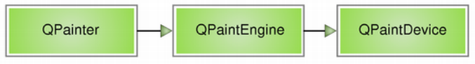

这种方法的主要好处是，所有的绘制都遵循相同的绘制管道，从而很容易添加对新特性的支持，并为不支持的特性提供默认实现。

## 基本绘制和填充

QPainter中提供了一些便捷函数来绘制常用的图形，还可以设置线条、边框的**画笔**以及进行填充的**画刷**。

所有对控件的绘图操作都要放进函数 paintEvent() 中，否则绘图无法显示。

### 绘制图形

在paintEvent中写如下代码哟~

```cpp
void Widget::paintEvent(QPaintEvent *event)
{
    QPainter painter(this);
    painter.drawLine(0,0,20,200);

    QPoint p[4] = {{0,0},{50,50},{0,100},{ width(),height()}};
    //把多个点一对一对的连接起来，不是每两个点相连
    painter.drawLines(p,2);	//第二个参数是一对点的数量(简单说就是要绘制几条线)   
}
```

这里先创建了一个QPainter对象，使用了QPainter: :QPainter ( QPaintDevice *device )构造函数,并指定了this为绘图设备，即表明在 Widget部件上进行绘制。使用这个构造函数创建的对象会立即开始在设备上进行绘制，自动调用begin()函数，然后在QPainter的析构函数中调用end()函数结束绘制。如果构建QPainter对象时不想指定绘制设备，那么可以使用不带参数的构造函数，然后使用QPainter: : begin(QPaintDevice * device)在开始绘制时指定绘制设备，等绘制完成后再调用end()函数结束绘制。上面函数中的代码等价于:

```cpp
QPainter painter;
painter.begin(this);
/*绘图...*/
painter.end();
```

这两种方式都可以完成绘制，无论使用哪种方式，都要指定绘图设备，否则无法进行绘制。

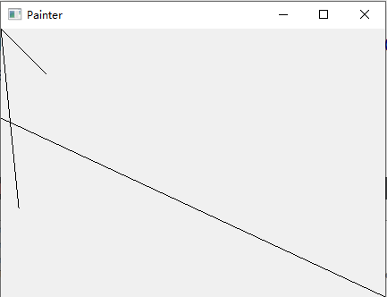

这里简单的绘制了几根线条，除了绘制简单的线条以外，QPainter还提供了一些绘制其他常用图形的函数,其中最常用的几个如下标所示。

| 函数              | 功能         | 函数            | 功能         |
| ----------------- | ------------ | --------------- | ------------ |
| drawArc           | 绘制圆弧     | drawPoint       | 绘制点       |
| drawChord         | 绘制弦       | drawPolygon     | 绘制多边形   |
| drawConvexPolygon | 绘制凸多边形 | drawPolyline    | 绘制折线     |
| drawElipse        | 绘制椭圆     | drawRect        | 绘制矩形     |
| drawLine          | 绘制线条     | drawRoundedRect | 绘制圆角矩形 |
| drawPie           | 绘制扇形     | fillRect        | 绘制填充矩形 |

### 使用画笔（QPen）

如果需要对绘制的线条设置不同的颜色，那么我们就需要给painter设置一个画笔QPen。

Pen有样式(style)，宽度(width)， 颜色(brush)， 笔帽样式(capStyle)和(连接样式)joinStyle。  

+ style使用Qt::PenStyle定义线条类型。默认是Qt::PenStyle::SolidLine

+ brush用于填充画笔笔生成的笔触。 使用QBrush类来指定画笔的颜色。 
+ capStyle帽样式决定了可以使用QPainter绘制的线结束帽，
+ joinStyle连接样式描述了如何绘制两条线之间的连接。 

通过使用相应的setStyle()， settwidth ()， setBrush()， setCapStyle()和setJoinStyle()函数，可以很容易地修改各种设置(注意，当改变画笔的属性时，画家的画笔必须重置)。  

```cpp
void setPen(const QPen &pen)
void setPen(const QColor &color)
void setPen(Qt::PenStyle style)
```

#### 线条样式

style使用Qt::PenStyle定义线条类型，默认是Qt::PenStyle::SolidLine。

**效果**

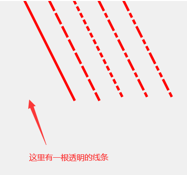

**代码**

```cpp
void penStyle()
{
	QPainter painter(this);
	painter.setRenderHint(QPainter::RenderHint::Antialiasing);

	for (int i = 0; i < 6; i++)
	{
		painter.setPen(QPen(Qt::red, 5, Qt::PenStyle(i)));
		painter.drawLine(i * 50, 0, i * 50 + 100, 200);
	}
}
```

#### 笔帽样式

capStyle帽样式决定了可以使用QPainter绘制的线结束帽。

**效果**

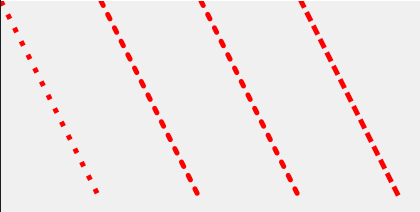

**代码**

```cpp
void capStyle()
{
		QPainter painter(this);
		painter.setRenderHint(QPainter::RenderHint::Antialiasing);

		painter.setPen(QPen(QBrush(Qt::red), 5, Qt::PenStyle::DotLine, Qt::PenCapStyle::FlatCap));
		painter.drawLine(0, 0, 100, 200);

		painter.setPen(QPen(QBrush(Qt::red), 5, Qt::PenStyle::DotLine, Qt::PenCapStyle::MPenCapStyle));
		painter.drawLine(100, 0, 100 + 100, 200);

		painter.setPen(QPen(QBrush(Qt::red), 5, Qt::PenStyle::DotLine, Qt::PenCapStyle::RoundCap));
		painter.drawLine(200, 0, 100 + 200, 200);

		painter.setPen(QPen(QBrush(Qt::red), 5, Qt::PenStyle::DotLine, Qt::PenCapStyle::SquareCap));
		painter.drawLine(300, 0, 100 + 300, 200);
}
```
#### 连接样式

joinStyle连接样式描述了如何绘制两条线之间的连接。 

**效果**

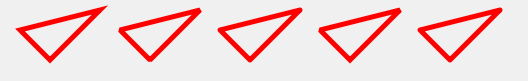

**代码**

```cpp
void joinSytle()
{
	QPainter painter(this);
	painter.setRenderHint(QPainter::RenderHint::Antialiasing);

	int s[] = { Qt::MiterJoin, Qt::BevelJoin, Qt::RoundJoin , Qt::SvgMiterJoin, Qt::MPenJoinStyle};
	for (int i = 0; i < 5; i++)
	{
		painter.setPen(QPen(QBrush(Qt::red), 5, Qt::SolidLine, Qt::PenCapStyle::SquareCap, Qt::PenJoinStyle(s[i])));
		QPoint points[] = { {20 + i * 100,30},{50 + i * 100,60},{100 + i * 100,10} };
		painter.drawPolygon(points, 3);
	}
}

```


### **使用画刷（QBrush）**

QBrush类提供了画刷来对图形进行填充，一个画刷使用它的颜色和风格(比如它的填充模式)来定义。

Brush有样式(style)、颜色(color)、渐变gradient和纹理(texture)。  

+ style使用Qt::BrushStyle定义填充模式。 默认的笔刷样式是Qt::NoBrush

+ color定义填充图形的颜色

+ gradient()定义当前样式为Qt::LinearGradientPattern, Qt::RadialGradientPattern或Qt::ConicalGradientPattern时使用的渐变填充。 当创建QBrush时，通过给QGradient作为构造函数参数来创建渐变笔刷。 Qt提供三个不同的梯度:QLinearGradient, QConicalGradient，和QRadialGradient -所有继承QGradient。  

```cpp
void setBrush(const QBrush &brush)
void setBrush(Qt::BrushStyle style)
```

#### 填充样式


#### 颜色填充


#### 纹理填充


#### 渐变填充

Qt目前支持三种类型的渐变填充:  

+ **线性渐变(QLinearGradient)**在开始点和结束点之间插入颜色。  

+ **径向渐变(QRadialGradient)**在围绕它的圆上的焦点和端点之间插入颜色。  

+ **锥形渐变(QConicalGradient)**在中心点周围插值颜色。  

可以使用type()函数检索渐变的类型。 每一种类型都由QGradient的一个子类表示

##### QLinearGradient

QLinearGradient 显示从起点到终点的渐变

| QGradient::PadSpread                                         | QGradient::RepeatSpread                                      | QGradient::ReflectSpread                                     |
| ------------------------------------------------------------ | ------------------------------------------------------------ | ------------------------------------------------------------ |
|  |  |  |

```cpp
void Widget::paintEvent(QPaintEvent *event)
{
     QPainter painter(this);

     //创建线性渐变，并设置开始点和结束点
     QLinearGradient gradient(QPoint(100,100),QPoint(250,50));

     //用给定的位置(比例：0~1)和颜色设置过度点，在哪里切换颜色
     gradient.setColorAt(0,Qt::blue);
     gradient.setColorAt(0.3,Qt::green);
     gradient.setColorAt(0.6,Qt::yellow);
     gradient.setColorAt(1,Qt::cyan);

     //设置显示模式:指定这个渐变应该使用的扩展方法。只对线性和径向渐变有效
     gradient.setSpread(QLinearGradient::Spread::PadSpread);

     //把渐变色设置给画刷
     painter.setBrush(gradient);

     //绘制矩形
     painter.drawRect(100,100,250,50);
}
```

QLinearGradient 构造函数的第一个参数指定起点，第二个参数指定终点，然后显示渐变。函数setColorAt() 用于设置起点和终点之间要显示的颜色，setSpread() 可以设置起点和终点区域之外的显示模式。

##### QRadialGradient

QRadialGradient 类以圆心为中心显示渐变。(cx, cy) 是中点，半径（radius）是以中点为圆心的圆的半径，(fx, fy) 是渐变的起点。

| QGradient::PadSpread                                         | QGradient::RepeatSpread                                      | QGradient::ReflectSpread                                     |
| ------------------------------------------------------------ | ------------------------------------------------------------ | ------------------------------------------------------------ |
|  |  |  |

```cpp
void MainWindow::paintEvent(QPaintEvent *event)
{
    QPainter painter(this);

    // 反走样
    painter.setRenderHint(QPainter::Antialiasing, true);

    // 设置渐变色
    QRadialGradient radial(110, 110, 50, 130, 130);
    radial.setColorAt(0, Qt::black);
    radial.setColorAt(1, Qt::white);

    // 设置显示模式
    radial.setSpread(QGradient::ReflectSpread );

    // 设置画笔颜色、宽度
    painter.setPen(QPen(QColor(0, 160, 230), 2));

    // 设置画刷填充
    painter.setBrush(radial);

    // 绘制矩形
    painter.drawRect(QRect(40, 40, 180, 180));
}
```

QRadialGradient 构造函数的第一个参数和第二个参数是 (cx, cy) 坐标，第三个参数是半径，第四个和第五个参数是 (fx, fy) 坐标。

##### QConicalGradient

QConicalGradient 在 (cx, cy) 坐标上以角度 (angle) 为中心显示渐变


```cpp
void MainWindow::paintEvent(QPaintEvent *event)
{
    QPainter painter(this);

    // 反走样
    painter.setRenderHint(QPainter::Antialiasing, true);

    // 设置渐变色
    QConicalGradient conical(110, 110, 45);
    conical.setColorAt(0, Qt::black);
    conical.setColorAt(1, Qt::white);

    // 设置画笔颜色、宽度
    painter.setPen(QPen(QColor(0, 160, 230), 2));

    // 设置画刷填充
    painter.setBrush(conical);

    // 绘制矩形
    painter.drawRect(QRect(40, 40, 180, 180));
}
```

## 坐标变换

QTransform 用于指定坐标系的 2D 转换 - 平移、缩放、扭曲（剪切）、旋转或投影坐标系。绘制图形时，通常会使用。

QTransform 与 QMatrix 不同之处在于，它是一个真正的 3x3 矩阵，允许视角转换，QTransform 的 toAffine() 方法允许将 QTransform 转换到 QMatrix。如果视角转换已在矩阵指定，则转换将导致数据丢失。

### 正常

先来看下正常的使用(`可用void QTransform::reset() 重置所有设置`)

```cpp
void Widget::paintEvent(QPaintEvent *event)
{
    QPainter painter(this);

    painter.drawPixmap(QPoint(0,0),QPixmap("://images/zay.png"));
}
```

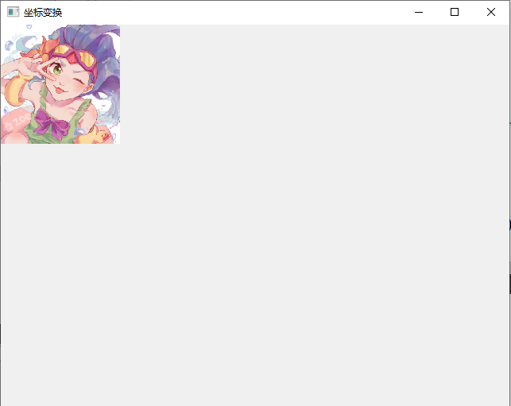

### 平移

translate(qreal dx, qreal dy)：平移 - 对坐标系沿着 x 轴移动 dx、沿 y 轴移动 dy 

```cpp
void Widget::paintEvent(QPaintEvent *event)
{
    QPainter painter(this);

    //平移
    painter.translate(120,50);

    painter.drawPixmap(QPoint(0,0),QPixmap("://images/zay.png").scaled(150,150));
}
```

这里，将坐标原点由 (0, 0) 变为 (120, 50)。

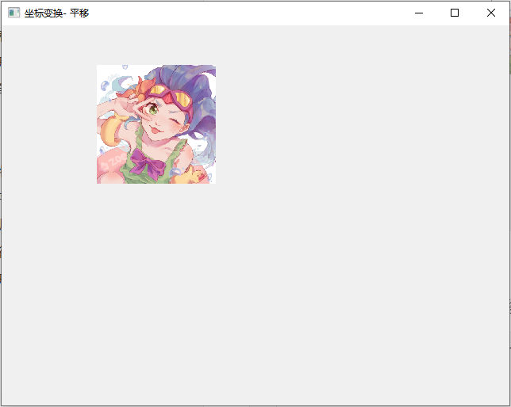

### 缩放

scale(qreal sx, qreal sy)：缩放 - 通过水平的 sx 和垂直的 sy 缩放坐标系

```cpp
void Widget::paintEvent(QPaintEvent *event)
{
    QPainter painter(this);

    painter.setRenderHint(QPainter::RenderHint::Antialiasing);
    //平移
    painter.translate(120,50);
    //缩放
    painter.scale(1.3,1.3);
    
    painter.drawPixmap(QPoint(0,0),QPixmap("://images/zay.png").scaled(150,150));
}
```

这里，使绘制的图像缩小到原来的1.3倍。

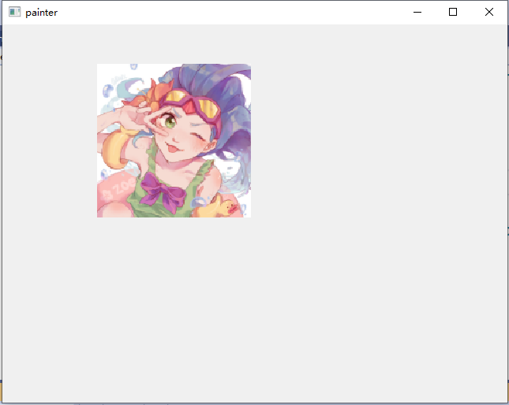

### 旋转

rotate(qreal angle, Qt::Axis axis = Qt::ZAxis)：旋转 - 对指定的轴用给定的角度逆时针旋转坐标系统

```cpp
void Widget::paintEvent(QPaintEvent* event)
{
    QPainter painter(this);

    painter.setRenderHint(QPainter::RenderHint::Antialiasing);
    static double angle = 0;
    QTransform transform;
    //平移
    transform.translate(120, 50);
    //缩放
    transform.scale(1.3, 1.3);
    //旋转
    //transform.rotate(angle++,Qt::Axis::ZAxis);
    //transform.rotate(angle++,Qt::Axis::XAxis);
    transform.rotate(angle--,Qt::Axis::YAxis);

    //图像中心旋转 1
    //transform.translate(-75, 0);	//75为图片宽度的一半
    
    painter.setTransform(transform);

    painter.drawPixmap(QPoint(0, 0), QPixmap("./images/zay.png").scaled(150, 150));
    
    //图像中心旋转 2
    //QPixmap pixmap = QPixmap("./images/zay.png").scaled(150, 150);
    //painter.drawPixmap(QPoint(-pixmap.width()/2, 0), pixmap);
}
```

|                          Qt::XAxis                           |                          Qt::YAxis                           |                          Qt::ZAxis                           |
| :----------------------------------------------------------: | :----------------------------------------------------------: | :----------------------------------------------------------: |
| 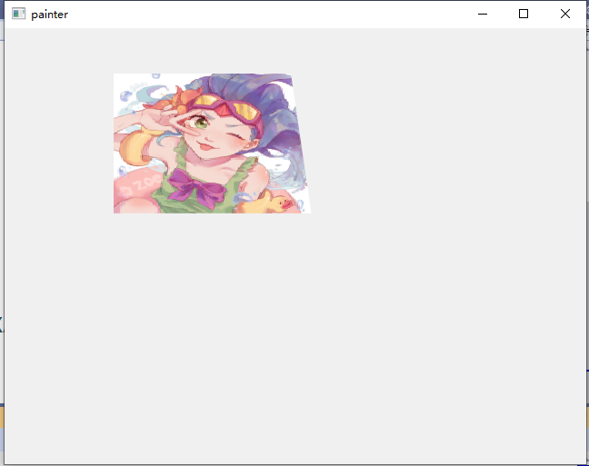 | 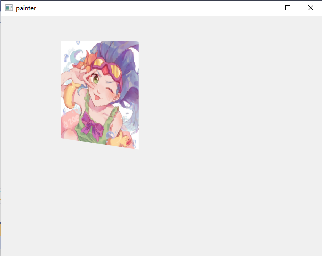 | 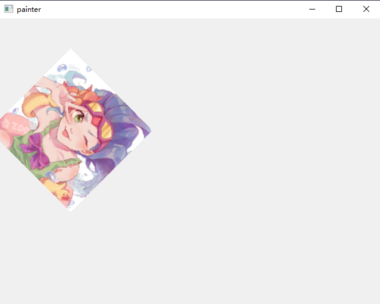 |


### 扭曲

shear(qreal sh, qreal sv)：扭曲 - 通过水平的 sh 和垂直的 sv 扭曲坐标系，前面的参数实现横向变形，后面的参数实现纵向变形。当它们的值为 0 时，表示不扭曲。

```cpp
void Widget::paintEvent(QPaintEvent* event)
{
    QPainter painter(this);

    painter.setRenderHint(QPainter::RenderHint::Antialiasing);
    
    QTransform transform;
    //平移
    transform.translate(120, 50);

    transform.shear(0.5, 0);

    painter.setTransform(transform);

    painter.drawPixmap(QPoint(0,0), QPixmap("./images/zay.png").scaled(150, 150));
}
```

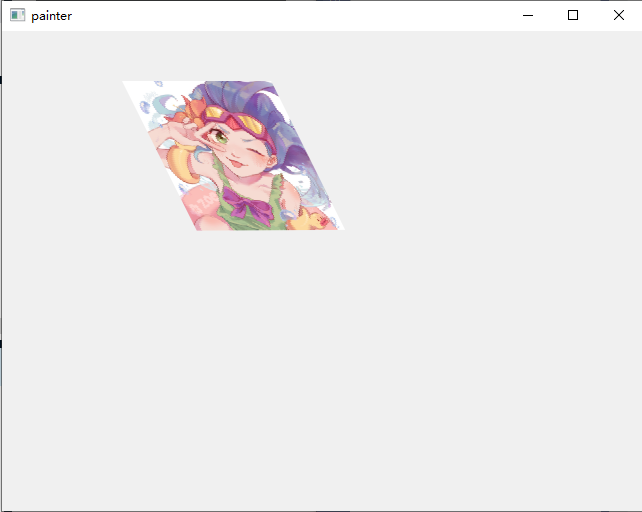


## 绘图函数

### 绘制形状

#### 绘制线条

```cpp
void drawLine(const QLineF &line)
void drawLine(const QLine &line)
void drawLine(int x1, int y1, int x2, int y2)
void drawLine(const QPoint &p1, const QPoint &p2)
void drawLine(const QPointF &p1, const QPointF &p2)
 
void drawLines(const QLineF *lines, int lineCount)
void drawLines(const QVector<QLineF> &lines)
void drawLines(const QPointF *pointPairs, int lineCount)	//注意：lineCount是线的数量，不是点的数量 两个点绘制一条线
void drawLines(const QVector<QPointF> &pointPairs)
void drawLines(const QLine *lines, int lineCount)
void drawLines(const QVector<QLine> &lines)
void drawLines(const QPoint *pointPairs, int lineCount)
void drawLines(const QVector<QPoint> &pointPairs)		
```

#### 绘制点

```cpp
void drawPoint(const QPointF &position)
void drawPoint(const QPoint &position)
void drawPoint(int x, int y)
void drawPoints(const QPointF *points, int pointCount)
void drawPoints(const QPolygonF &points)
void drawPoints(const QPoint *points, int pointCount)
void drawPoints(const QPolygon &points)
```

#### 绘制矩形

##### 普通矩形

给定矩形左上角的坐标和矩形的长、宽就可以绘制矩形了

```cpp
void drawRect(const QRectF &rectangle)
void drawRect(int x, int y, int width, int height)
void drawRect(const QRect &rectangle)
void drawRects(const QRectF *rectangles, int rectCount)
void drawRects(const QVector<QRectF> &rectangles)
void drawRects(const QRect *rectangles, int rectCount)
void drawRects(const QVector<QRect> &rectangles)
```

##### 圆角矩形

绘制圆角矩形使用 `drawRoundedRect()`，需要给定圆角矩形左上角的坐标、长、宽、圆角的半径。

当最后一个个参数Qt::SizeMode mode 为 Qt::AbsoluteSize (默认)时，表示圆角半径的单位是像素。为 Qt::RelativeSize 时，表示圆角半径的单位是百分比，取值范围是 [0, 100]，其实底层是用这个百分比和对应边长的一半相乘得到圆角的半径（单位是像素）。

有意思的是，在 QSS 中圆角半径大于对应边长的一半，圆角效果就没了，但是使用 drawRoundedRect() 时，圆角的半径大于对应边长的一半时，圆角效果仍然有效，个人认为这个是 QSS 的 bug，但是已经存在很久了。

```cpp
void drawRoundedRect(const QRectF &rect, qreal xRadius, qreal yRadius, Qt::SizeMode mode = Qt::AbsoluteSize)
void drawRoundedRect(int x, int y, int w, int h, qreal xRadius, qreal yRadius, Qt::SizeMode mode = ...)
void drawRoundedRect(const QRect &rect, qreal xRadius, qreal yRadius, Qt::SizeMode mode = ...)
```


##### 填充矩形

```cpp
void fillRect(const QRectF &rectangle, const QBrush &brush)
void fillRect(int x, int y, int width, int height, const QBrush &brush)
void fillRect(const QRect &rectangle, const QBrush &brush)
void fillRect(const QRectF &rectangle, const QColor &color)
void fillRect(int x, int y, int width, int height, const QColor &color)
void fillRect(const QRect &rectangle, const QColor &color)
void fillRect(int x, int y, int width, int height, Qt::GlobalColor color)
void fillRect(const QRect &rectangle, Qt::GlobalColor color)
void fillRect(const QRectF &rectangle, Qt::GlobalColor color)
void fillRect(int x, int y, int width, int height, Qt::BrushStyle style)
void fillRect(const QRect &rectangle, Qt::BrushStyle style)
void fillRect(const QRectF &rectangle, Qt::BrushStyle style)
void fillRect(int x, int y, int width, int height, QGradient::Preset preset)
void fillRect(const QRect &rectangle, QGradient::Preset preset)
void fillRect(const QRectF &rectangle, QGradient::Preset preset)
```

#### 绘制椭圆

```cpp
void drawEllipse(const QRectF &rectangle)
void drawEllipse(const QRect &rectangle)
void drawEllipse(int x, int y, int width, int height)
void drawEllipse(const QPointF &center, qreal rx, qreal ry)
void drawEllipse(const QPoint &center, int rx, int ry)
```

#### 绘制扇形、圆弧、弦

把这三个函数放在一起介绍，因为它们的参数都一样，而且 arc, chord, pie 外形也有很多相似之处

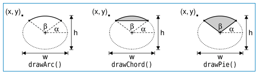

- rectangle: 包围矩形
- startAngle: 开始的角度，单位是十六分之一度(即弧度)，如果要从 45 度开始画，则 startAngle 为 45 * 16
- spanAngle: 跨越的角度，单位是十六分之一度
- 绘制圆心为包围矩形的正中心，0 度在圆心的 X 轴正方向上
- 角度的正方向为逆时针方向

##### 绘制扇形

```cpp
void drawPie(const QRectF &rectangle, int startAngle, int spanAngle)
void drawPie(const QRect &rectangle, int startAngle, int spanAngle)
void drawPie(int x, int y, int width, int height, int startAngle, int spanAngle)
```

##### 绘制圆弧

```cpp
void drawArc(const QRectF &rectangle, int startAngle, int spanAngle)
void drawArc(const QRect &rectangle, int startAngle, int spanAngle)
void drawArc(int x, int y, int width, int height, int startAngle, int spanAngle)
```

##### 绘制弦

```cpp
void drawChord(const QRectF &rectangle, int startAngle, int spanAngle)
void drawChord(const QRect &rectangle, int startAngle, int spanAngle)
void drawChord(int x, int y, int width, int height, int startAngle, int spanAngle)
```

#### 绘制多边形

使用当前画笔和画刷绘制由第一个点定义的多边形。第一个点隐式连接到最后一个点，多边形用当前Brush填充。    

##### 绘制凸起的多边形

如果提供的多边形不是凸的，即它包含至少一个大于180度的角，结果是未定义的 (测试过也能画出来) 

```cpp
void drawConvexPolygon(const QPointF *points, int pointCount)
void drawConvexPolygon(const QPolygonF &polygon)
void drawConvexPolygon(const QPoint *points, int pointCount)
void drawConvexPolygon(const QPolygon &polygon)
```

##### 绘制多边形

```cpp
void drawPolygon(const QPointF *points, int pointCount, Qt::FillRule fillRule = Qt::OddEvenFill)
void drawPolygon(const QPolygonF &points, Qt::FillRule fillRule = Qt::OddEvenFill)
void drawPolygon(const QPoint *points, int pointCount, Qt::FillRule fillRule = Qt::OddEvenFill)
void drawPolygon(const QPolygon &points, Qt::FillRule fillRule = Qt::OddEvenFill)
```

Example

```cpp
QPolygon polygon;
polygon1<<QPoint(50,50)<<QPoint(100,50)<<QPoint(70,100)
           <<QPoint(150,100)<<QPoint(150,130)<<QPoint(40,130);
painter.drawConvexPolygon(polygon);
painter.translate(200,0);			//平移坐标系,把200,0设置为坐标原点
painter.drawPolygon(polygon);
```

#### 绘制折线

和绘制多边形类型，就是最后没有连接起来，形成封闭的形状

```cpp
void drawPolyline(const QPointF *points, int pointCount)
void drawPolyline(const QPolygonF &points)
void drawPolyline(const QPoint *points, int pointCount)
void drawPolyline(const QPolygon &points)
```

### 绘制文字

```cpp
void drawStaticText(const QPointF &topLeftPosition, const QStaticText &staticText)
void drawStaticText(const QPoint &topLeftPosition, const QStaticText &staticText)
void drawStaticText(int left, int top, const QStaticText &staticText)
void drawText(const QRectF &rectangle, int flags, const QString &text, QRectF *boundingRect = nullptr)
void drawText(const QPointF &position, const QString &text)
void drawText(const QPoint &position, const QString &text)
void drawText(int x, int y, const QString &text)
//把文字绘制在矩形区域，boundingRect返回实际包含文本的矩形区域    
void drawText(const QRect &rectangle, int flags, const QString &text, QRect *boundingRect = nullptr)
void drawText(int x, int y, int width, int height, int flags, const QString &text, QRect *boundingRect = nullptr)
void drawText(const QRectF &rectangle, const QString &text, const QTextOption &option = QTextOption())
```

### 绘制图片

#### Pixmap

+ 将给定像素映射的矩形部分源绘制到绘图设备中的给定目标中。  如果像素映射和矩形大小不一致，像素映射将缩放以适应矩形。  

```cpp
void drawPixmap(const QRectF &target, const QPixmap &pixmap, const QRectF &source)
void drawPixmap(const QRect &target, const QPixmap &pixmap, const QRect &source)
void drawPixmap(int x, int y, int w, int h, const QPixmap &pixmap, int sx, int sy, int sw, int sh)
void drawPixmap(int x, int y, const QPixmap &pixmap, int sx, int sy, int sw, int sh)
void drawPixmap(const QPointF &point, const QPixmap &pixmap, const QRectF &source)
void drawPixmap(const QPoint &point, const QPixmap &pixmap, const QRect &source)
```

Example

```cpp
QPixmap pixmap("://images/shoot.jpg");
static int i = 0;
QRect rectArea(i*20,0,20,50);
painter.drawPixmap(QRect(0,0,20,50),pixmap,rectArea);
painter.drawPixmap(QPoint(30,0),pixmap,rectArea);
painter.drawPixmap(60,0,30,60,pixmap,i*20,0,20,50);
i = (i+1)%10;
```

+ 将给定像素映射绘制到指定位置

```cpp
void drawPixmap(const QPointF &point, const QPixmap &pixmap)
void drawPixmap(const QPoint &point, const QPixmap &pixmap)
void drawPixmap(int x, int y, const QPixmap &pixmap)
void drawPixmap(const QRect &rectangle, const QPixmap &pixmap)
void drawPixmap(int x, int y, int width, int height, const QPixmap &pixmap)
```

+ 绘制pixmap，或pixmap的子矩形，在不同的比例，旋转和不透明度的多个位置。 fragments是一个fragmentCount元素数组，指定用于绘制每个像素映射片段的参数。 hint参数可用于传递绘图提示。 这个函数可能比多次调用drawPixmap()更快，因为后端可以优化状态更改。  

```cpp
void drawPixmapFragments(const QPainter::PixmapFragment *fragments, int fragmentCount, const QPixmap &pixmap, QPainter::PixmapFragmentHints hints = PixmapFragmentHints())
```

Example

```cpp
QPainter::PixmapFragment fragment[3]={
    	QPainter::PixmapFragment::create(QPoint(90,0),QRect(0,0,20,50)),                       QPainter::PixmapFragment::create(QPoint(120,0),QRect(20,0,20,50)),                     QPainter::PixmapFragment::create(QPoint(150,0),QRect(40,0,20,50))};
painter.drawPixmapFragments(fragment,3,pixmap);
```

+ 在给定的矩形内绘制一个平铺的像素地图。  调用drawTiledPixmap()类似于多次调用drawPixmap()来填充(平铺)一个区域。      

```cpp
void drawTiledPixmap(const QRectF &rectangle, const QPixmap &pixmap, const QPointF &position = QPointF())
void drawTiledPixmap(int x, int y, int width, int height, const QPixmap &pixmap, int sx = 0, int sy = 0)
void drawTiledPixmap(const QRect &rectangle, const QPixmap &pixmap, const QPoint &position = ...)
```

Example:

```cpp
painter.drawTiledPixmap(this->rect(),pixmap);
```

#### Image

```cpp
void drawImage(const QRectF &target, const QImage &image, const QRectF &source, Qt::ImageConversionFlags flags = Qt::AutoColor)
void drawImage(const QRect &target, const QImage &image, const QRect &source, Qt::ImageConversionFlags flags = Qt::AutoColor)
void drawImage(const QPointF &point, const QImage &image, const QRectF &source, Qt::ImageConversionFlags flags = ...)
void drawImage(const QPoint &point, const QImage &image, const QRect &source, Qt::ImageConversionFlags flags = ...)
void drawImage(const QRectF &rectangle, const QImage &image)
void drawImage(const QRect &rectangle, const QImage &image)
void drawImage(const QPointF &point, const QImage &image)
void drawImage(const QPoint &point, const QImage &image)
void drawImage(int x, int y, const QImage &image, int sx = 0, int sy = 0, int sw = -1, int sh = -1, Qt::ImageConversionFlags flags = Qt::AutoColor)
```

#### Picture

Picture以独立于平台的格式将画家命令序列化到 IO 设备。 它们有时被称为元文件。
Qt Picture使用专有的二进制格式。 与许多窗口系统上的原生图片（元文件）格式不同，Qt Picture对其内容没有限制。 可以在小部件或像素图上绘制的所有内容（例如，字体、像素图、区域、转换后的图形等）也可以存储在Picture中。

```cpp
void drawPicture(const QPointF &point, const QPicture &picture)
void drawPicture(int x, int y, const QPicture &picture)
void drawPicture(const QPoint &point, const QPicture &picture)
```

### 绘制路径

```cpp
void drawPath(const QPainterPath &path)							//绘制轮廓，也可以绘制填充颜色(设置画刷就可以)
void strokePath(const QPainterPath &path, const QPen &pen)		//只绘制轮廓
void fillPath(const QPainterPath &path, const QBrush &brush)	//只绘制填充色，不绘制轮廓
```

### 清除矩形区域

```cpp
void eraseRect(const QRectF &rectangle)
void eraseRect(int x, int y, int width, int height)
void eraseRect(const QRect &rectangle)
```

# QPixmap、QImage、QBitmap和QPicture的区别

Qt提供了四种处理图像数据的类:QImage, QPixmap, QBitmap和QPicture。 

**QImage**是为I/O和直接像素访问和操作而设计和优化的，而**QPixmap**是为在屏幕上显示图像而设计和优化的。 QBitmap只是一个继承了QPixmap的方便类，确保深度为1。 如果QPixmap对象是位图，则isQBitmap()函数返回true，否则返回false。 最后，**QPicture**类是一个记录和回放QPainter命令的绘图设备。  

## QPixmap

在pixmap上绘图

```cpp
QPixmap pixmap(size());
//pixmap.fill();

QPainter painter(&pixmap);
painter.translate(width()/2,height()/2);
painter.setBrush(Qt::green);
painter.drawEllipse(0,0,20,20);

pixmap.save("./aa.png");
```

## QImage

```cpp
QImage image(size(),QImage::Format_RGBA64);
//pixmap.fill();

QPainter painter(&image);
painter.translate(width()/2,height()/2);
painter.setBrush(Qt::green);
painter.drawEllipse(0,0,20,20);

image.save("./image.png");
```

## QPicture

保存

```cpp
QPicture picture;                       
                                        
QPainter painter;                       
painter.begin(&picture);                
painter.translate(width()/2,height()/2);
painter.setBrush(Qt::green);            
painter.drawEllipse(0,0,20,20);         
painter.end();                          
picture.save("./image.pic");            
```

重演

```cpp
    QPainter painter(this);
    QPicture picture;
    picture.load("./image.pic");
    picture.play(&painter);
```

