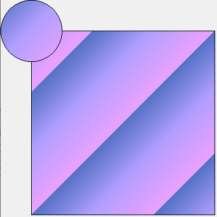
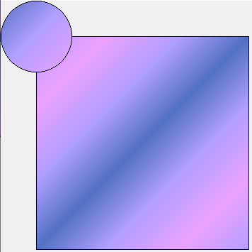

# Qt绘图

> Paint System

Qt的绘制系统支持在屏幕和打印设备上使用相同的API进行绘制，主要基于QPainter、QPaintDevice和QPaintEngine类。

QPainter用于执行绘图操作，QPaintDevice是二维空间的抽象，可以使用QPainter在其上绘图，而QPaintEngine提供了绘图器用于在不同类型的设备上绘图的接口。QPaintEngine类在内部由QPainter和QPaintDevice使用，并且对应用程序程序员隐藏，除非他们创建自己的设备类型。


这种方法的主要好处是，所有的绘制都遵循相同的绘制管道，从而很容易添加对新特性的支持，并为不支持的特性提供默认实现。

## 基本绘制和填充

QPainter中提供了一些便捷函数来绘制常用的图形，还可以设置线条、边框的**画笔**以及进行填充的**画刷**。

所有对控件的绘图操作都要放进函数 paintEvent() 中，否则绘图无法显示。

### 绘制图形

在paintEvent中写如下代码哟~

```cpp
void Widget::paintEvent(QPaintEvent *event)
{
    QPainter painter(this);
    painter.drawLine(0,0,20,200);

    QPoint p[4] = {{0,0},{50,50},{0,100},{ width(),height()}};
    //把多个点一对一对的连接起来，不是每两个点相连
    painter.drawLines(p,2);	//第二个参数是一对点的数量(简单说就是要绘制几条线)   
}
```

这里先创建了一个QPainter对象，使用了QPainter: :QPainter ( QPaintDevice *device )构造函数,并指定了this为绘图设备，即表明在 Widget部件上进行绘制。使用这个构造函数创建的对象会立即开始在设备上进行绘制，自动调用begin()函数，然后在QPainter的析构函数中调用end()函数结束绘制。如果构建QPainter对象时不想指定绘制设备，那么可以使用不带参数的构造函数，然后使用QPainter: : begin(QPaintDevice * device)在开始绘制时指定绘制设备，等绘制完成后再调用end()函数结束绘制。上面函数中的代码等价于:

```cpp
QPainter painter;
painter.begin(this);
/*绘图...*/
painter.end();
```

这两种方式都可以完成绘制，无论使用哪种方式，都要指定绘图设备，否则无法进行绘制。


这里简单的绘制了几根线条，除了绘制简单的线条以外，QPainter还提供了一些绘制其他常用图形的函数,其中最常用的几个如下标所示。

| 函数              | 功能         | 函数            | 功能         |
| ----------------- | ------------ | --------------- | ------------ |
| drawArc           | 绘制圆弧     | drawPoint       | 绘制点       |
| drawChord         | 绘制弦       | drawPolygon     | 绘制多边形   |
| drawConvexPolygon | 绘制凸多边形 | drawPolyline    | 绘制折线     |
| drawElipse        | 绘制椭圆     | drawRect        | 绘制矩形     |
| drawLine          | 绘制线条     | drawRoundedRect | 绘制圆角矩形 |
| drawPie           | 绘制扇形     | fillRect        | 绘制填充矩形 |

### 使用画笔（QPen）

如果需要对绘制的线条设置不同的颜色，那么我们就需要给painter设置一个画笔QPen。

Pen有样式(style)，宽度(width)， 颜色(brush)， 笔帽样式(capStyle)和(连接样式)joinStyle。  

+ style使用Qt::PenStyle定义线条类型。默认是Qt::PenStyle::SolidLine

+ brush用于填充画笔笔生成的笔触。 使用QBrush类来指定画笔的颜色。 
+ capStyle帽样式决定了可以使用QPainter绘制的线结束帽，
+ joinStyle连接样式描述了如何绘制两条线之间的连接。 

通过使用相应的setStyle()， settwidth ()， setBrush()， setCapStyle()和setJoinStyle()函数，可以很容易地修改各种设置(注意，当改变画笔的属性时，画家的画笔必须重置)。  

```cpp
void setPen(const QPen &pen)
void setPen(const QColor &color)
void setPen(Qt::PenStyle style)
```

#### 线条样式

style使用Qt::PenStyle定义线条类型，默认是Qt::PenStyle::SolidLine。

**效果**


**代码**

```cpp
void penStyle()
{
	QPainter painter(this);
	painter.setRenderHint(QPainter::RenderHint::Antialiasing);

	for (int i = 0; i < 6; i++)
	{
		painter.setPen(QPen(Qt::red, 5, Qt::PenStyle(i)));
		painter.drawLine(i * 50, 0, i * 50 + 100, 200);
	}
}
```

#### 笔帽样式

capStyle帽样式决定了可以使用QPainter绘制的线结束帽。

**效果**


**代码**

```cpp
void capStyle()
{
		QPainter painter(this);
		painter.setRenderHint(QPainter::RenderHint::Antialiasing);

		painter.setPen(QPen(QBrush(Qt::red), 5, Qt::PenStyle::DotLine, Qt::PenCapStyle::FlatCap));
		painter.drawLine(0, 0, 100, 200);

		painter.setPen(QPen(QBrush(Qt::red), 5, Qt::PenStyle::DotLine, Qt::PenCapStyle::MPenCapStyle));
		painter.drawLine(100, 0, 100 + 100, 200);

		painter.setPen(QPen(QBrush(Qt::red), 5, Qt::PenStyle::DotLine, Qt::PenCapStyle::RoundCap));
		painter.drawLine(200, 0, 100 + 200, 200);

		painter.setPen(QPen(QBrush(Qt::red), 5, Qt::PenStyle::DotLine, Qt::PenCapStyle::SquareCap));
		painter.drawLine(300, 0, 100 + 300, 200);
}
```
#### 连接样式

joinStyle连接样式描述了如何绘制两条线之间的连接。 

**效果**


**代码**

```cpp
void joinSytle()
{
	QPainter painter(this);
	painter.setRenderHint(QPainter::RenderHint::Antialiasing);

	int s[] = { Qt::MiterJoin, Qt::BevelJoin, Qt::RoundJoin , Qt::SvgMiterJoin, Qt::MPenJoinStyle};
	for (int i = 0; i < 5; i++)
	{
		painter.setPen(QPen(QBrush(Qt::red), 5, Qt::SolidLine, Qt::PenCapStyle::SquareCap, Qt::PenJoinStyle(s[i])));
		QPoint points[] = { {20 + i * 100,30},{50 + i * 100,60},{100 + i * 100,10} };
		painter.drawPolygon(points, 3);
	}
}

```


### **使用画刷（QBrush）**

QBrush类提供了画刷来对图形进行填充，一个画刷使用它的颜色和风格(比如它的填充模式)来定义。

Brush有样式(style)、颜色(color)、渐变gradient和纹理(texture)。  

+ style使用Qt::BrushStyle定义填充模式。 默认的笔刷样式是Qt::NoBrush

+ color定义填充图形的颜色

+ gradient()定义当前样式为Qt::LinearGradientPattern, Qt::RadialGradientPattern或Qt::ConicalGradientPattern时使用的渐变填充。 当创建QBrush时，通过给QGradient作为构造函数参数来创建渐变笔刷。 Qt提供三个不同的梯度:QLinearGradient, QConicalGradient，和QRadialGradient -所有继承QGradient。  

```cpp
void setBrush(const QBrush &brush)
void setBrush(Qt::BrushStyle style)
```

#### 填充样式

**效果**


**代码**

```cpp
void brushStyle()
{
    QPainter painter(this);
    painter.setBrush(Qt::red);

    int w = 150;
    int h = 150;
    for (int r = 0; r < 3; r++)
    {
        for (int c = 0; c < 5; c++)
        {
             painter.setBrush(Qt::BrushStyle(r * 5 + c));
             painter.drawRect(c * w, r * h, w, h);
        }
    }
}
```


#### 颜色填充

**效果**


**代码**

```cpp
void brushStyle()
    {
        QPainter painter(this);
        painter.setBrush(Qt::red);

        int w = 150;
        int h = 150;
        for (int r = 0; r < 3; r++)
        {
            for (int c = 0; c < 5; c++)
            {
                painter.setBrush(QBrush(QColor(58, 118, 198), Qt::BrushStyle(r * 5 + c)));
                painter.drawRect(c * w, r * h, w, h);
            }
        }
    }
```


#### 纹理填充

**效果**


**代码**

```cpp
void brushStyle()
{
    QPainter painter(this);
    painter.setBrush(Qt::red);
    painter.setBrush(QBrush(QColor(58, 118, 198), QPixmap(PIXMAP_PATH)));
    int w = 150;
    int h = 150;
    for (int r = 0; r < 3; r++)
    {
        for (int c = 0; c < 5; c++)
        {
            painter.drawRect(c * (w + 10), r * h, w, h);
        }
    }
}
```


#### 渐变填充

Qt目前支持三种类型的渐变填充:  

+ **线性渐变(QLinearGradient)**在开始点和结束点之间插入颜色。  

+ **径向渐变(QRadialGradient)**在围绕它的圆上的焦点和端点之间插入颜色。  

+ **锥形渐变(QConicalGradient)**在中心点周围插值颜色。  

可以使用type()函数检索渐变的类型。 每一种类型都由QGradient的一个子类表示。

##### 线性渐变(QLinearGradient)

QLinearGradient 显示从起点到终点的渐变。

| QGradient::PadSpread                                         | QGradient::RepeatSpread                                      | QGradient::ReflectSpread                                     |
| ------------------------------------------------------------ | ------------------------------------------------------------ | ------------------------------------------------------------ |
|  |  |  |

```cpp
void Widget::linearGradient()
{
    //指定在那两个点之间线性渐变(开始坐标和结束坐标)
    QLinearGradient lgra(0, 0, 100, 100);
    //也可以在构造对象后通过函数，设置开始点和结束点
    //lgra.setStart(0, 0);
    //lgra.setFinalStop(100, 100);
    
    //用给定的位置(比例：0~1)和颜色设置过度点，在哪里切换颜色
    lgra.setColorAt(0, qRgb(82, 113 ,196));
    lgra.setColorAt(0.48, qRgb(177, 159, 255));
    lgra.setColorAt(1, qRgb(236, 161 ,254));
    
    //指定如何填充渐变区域之外的区域。
    lgra.setSpread(QGradient::RepeatSpread);

    QPainter painter(this);
    //把渐变色设置给画刷
    painter.setBrush(lgra);
    //绘制矩形，观察渐变区域之外的区域的填充
    painter.drawRect(50, 50, 500, 500);
    //绘制圆形(这里一般和开始点和结束点的坐标对应)
    painter.drawEllipse(0, 0, 100, 100);
}
```

QLinearGradient 构造函数的第一个参数指定起点，第二个参数指定终点，然后显示渐变。函数setColorAt() 用于设置起点和终点之间要显示的颜色，setSpread() 可以设置起点和终点区域之外的显示模式。

##### 径向渐变(QRadialGradient)

###### 正常

QRadialGradient 类以圆心为中心显示渐变。(cx, cy) 是中点，半径（radius）是以中点为圆心的圆的半径，(fx, fy) 是渐变的起点。

| QGradient::PadSpread                                         | QGradient::RepeatSpread                                      | QGradient::ReflectSpread                                     |
| ------------------------------------------------------------ | ------------------------------------------------------------ | ------------------------------------------------------------ |
|  |  |  |

```cpp
void radialGradient()
{
    //指定以圆心和半径，以圆心为中心渐变
    QRadialGradient rgra(50,50,50);
    //也可以在构造对象后通过函数，设置开始点和结束点
    //rgra.setCenter(50, 50);
    //下面两个设置半径的功能一样 
    //rgra.setRadius(50);
    //rgra.setCenterRadius(50);

    //用给定的位置(比例：0~1)和颜色设置过度点，在哪里切换颜色
    rgra.setColorAt(0, qRgb(82, 113, 196));
    rgra.setColorAt(0.48, qRgb(177, 159, 255));
    rgra.setColorAt(1, qRgb(236, 161, 254));

    //指定如何填充渐变区域之外的区域。
    rgra.setSpread(QGradient::ReflectSpread);

    QPainter painter(this);
    //把渐变色设置给画刷
    painter.setBrush(rgra);
    //绘制矩形，观察渐变区域之外的区域的填充
    painter.drawRect(50, 50, 250, 250);
    //绘制圆形(这里一般和开始指定的渐变坐标一样)
    painter.drawEllipse(0, 0, 100, 100);
}

```

QRadialGradient 构造函数的第一个参数和第二个参数是 (cx, cy) 坐标，第三个参数是半径，第四个和第五个参数是 (fx, fy) 坐标。

###### 焦点

Qt支持简单的和扩展的径向渐变。

简单的径向渐变在围绕它的圆的焦点和端点之间插入颜色。扩展径向梯度在焦点圆和中心圆之间插入颜色。两个圆定义的圆锥体外的点将是透明的。对于简单的径向渐变，焦点被调整到位于中心圆内，而焦点可以在扩展的径向渐变中的任何位置。

| 正常(圆心和焦点重合)                                         | setFocalPoint(50,70);                                        | setFocalPoint(25,25);                                        |
| ------------------------------------------------------------ | ------------------------------------------------------------ | ------------------------------------------------------------ |
|  |  |  |


##### 锥形渐变(QConicalGradient)

QConicalGradient圆锥渐变在一个中心点周围逆时针插入颜色， 在 (cx, cy) 坐标上以角度 (angle) 为中心显示渐变。

角度必须在0到360度之间指定。


```cpp
void conicalGradient()
{
    //指定以圆心和角度进行渐变
    QConicalGradient cgra(50, 50, 0);
    //也可以在构造对象后通过函数，设置圆心和角度
    //cgra.setAngle(0);
    //cgra.setCenter(50, 50);
    
    //用给定的位置(比例：0~1)和颜色设置过度点，在哪里切换颜色
    cgra.setColorAt(0, qRgb(82, 113, 196));
    cgra.setColorAt(0.48, qRgb(177, 159, 255));
    cgra.setColorAt(1, qRgb(236, 161, 254));

    QPainter painter(this);
    //把渐变色设置给画刷
    painter.setBrush(cgra);
    //绘制矩形，观察渐变区域之外的区域的填充
    painter.drawRect(50, 50, 250, 250);
    //绘制圆形(这里一般和开始指定的渐变坐标一样)
    painter.drawEllipse(0, 0, 100, 100);
}
```

##### 渐变坐标模式

通过`setCoordinateMode()`可以设置渐变坐标模式化，此枚举指定渐变坐标如何映射到使用渐变的绘制设备。

###### QGradient::LogicalMode

这是默认模式。渐变坐标和对象坐标一样是指定的逻辑空间。


```cpp
void coordinateMode()
{
    QLinearGradient lgra(0, 0, 100, 100);

    //用给定的位置(比例：0~1)和颜色设置过度点，在哪里切换颜色
    lgra.setColorAt(0, qRgb(82, 113, 196));
    lgra.setColorAt(0.48, qRgb(177, 159, 255));
    lgra.setColorAt(1, qRgb(236, 161, 254));

    QPainter painter(this);
    painter.setBrush(lgra);

    painter.drawEllipse(0, 0, 100, 100);
    painter.drawEllipse(100, 0, 100, 100);
    painter.drawEllipse(200, 0, 100, 100);
}
```

###### QGradient::ObjectMode

在这种模式下，渐变坐标相对于被绘制对象的边界矩形，(0,0)在左上角，(1,1)在对象的边界矩形的右下角。


```cpp
void linearGradient()
{
    //这里要改成对象的相对位置
    QLinearGradient lgra(0, 0, 1, 1);
    //设置对象模式
    lgra.setCoordinateMode(QGradient::CoordinateMode::ObjectMode);	...
}
```

###### QGradient::StretchToDeviceMode

在这种模式下，渐变坐标相对于油漆设备的边界矩形，(0,0)在左上角，(1,1)在油漆设备的右下角。

```cpp
    void linearGradient()
    {
        //这里要改成对象的相对位置
        QLinearGradient lgra(0, 0, 1, 1);
        //设置对象模式
        lgra.setCoordinateMode(QGradient::CoordinateMode::StretchToDeviceMode);

        //用给定的位置(比例：0~1)和颜色设置过度点，在哪里切换颜色
        lgra.setColorAt(0, qRgb(82, 113, 196));
        lgra.setColorAt(0.48, qRgb(177, 159, 255));
        lgra.setColorAt(1, qRgb(236, 161, 254));
       

        QPainter painter(this);
        painter.setBrush(lgra);
        //测试整个窗口的渐变
        painter.drawRect(0, 0, width(), height());
        painter.drawEllipse(0, 0, 100, 100);
        painter.drawEllipse(100, 0, 100, 100);
        painter.drawEllipse(200, 0, 100, 100);
    }
```


## 坐标变换

QTransform 用于指定坐标系的 2D 转换 - 平移、缩放、扭曲（剪切）、旋转或投影坐标系。通常在渲染现图形时使用。

可以使用setMatrix()、scale()、rotate()、translate()和shear()函数来构建QTransform对象。或者，也可以通过应用基本的矩阵操作来构建它。矩阵也可以在构造时定义，并且可以使用reset()函数将其重置为单位矩阵(默认值)。

QPainter具有平移、缩放、剪切和旋转坐标系统的功能，无需使用QTransform。

### 正常

先来看下正常的使用(`可用void QTransform::reset() 重置所有设置`)

```cpp
void Widget::paintEvent(QPaintEvent *event)
{
    QPainter painter(this);

    painter.drawPixmap(QPoint(0,0),QPixmap("://images/zay.png"));
}
```


### 平移

translate(qreal dx, qreal dy)：平移 - 对坐标系沿着 x 轴移动 dx、沿 y 轴移动 dy 

```cpp
void Widget::paintEvent(QPaintEvent *event)
{
    QPainter painter(this);

    //平移
    painter.translate(120,50);

    painter.drawPixmap(QPoint(0,0),QPixmap("://images/zay.png").scaled(150,150));
}
```

这里，将坐标原点由 (0, 0) 变为 (120, 50)。


### 缩放

scale(qreal sx, qreal sy)：缩放 - 通过水平的 sx 和垂直的 sy 缩放坐标系

```cpp
void Widget::paintEvent(QPaintEvent *event)
{
    QPainter painter(this);

    painter.setRenderHint(QPainter::RenderHint::Antialiasing);
    //平移
    painter.translate(120,50);
    //缩放
    painter.scale(1.3,1.3);
    
    painter.drawPixmap(QPoint(0,0),QPixmap("://images/zay.png").scaled(150,150));
}
```

这里，使绘制的图像缩小到原来的1.3倍。


### 旋转

rotate(qreal angle, Qt::Axis axis = Qt::ZAxis)：旋转 - 对指定的轴用给定的角度逆时针旋转坐标系统

```cpp
void Widget::paintEvent(QPaintEvent* event)
{
    QPainter painter(this);

    painter.setRenderHint(QPainter::RenderHint::Antialiasing);
    static double angle = 0;
    QTransform transform;
    //平移
    transform.translate(120, 50);
    //缩放
    transform.scale(1.3, 1.3);
    //旋转
    //transform.rotate(angle++,Qt::Axis::ZAxis);
    //transform.rotate(angle++,Qt::Axis::XAxis);
    transform.rotate(angle--,Qt::Axis::YAxis);

    //图像中心旋转 1
    //transform.translate(-75, 0);	//75为图片宽度的一半
    
    painter.setTransform(transform);

    painter.drawPixmap(QPoint(0, 0), QPixmap("./images/zay.png").scaled(150, 150));
    
    //图像中心旋转 2
    //QPixmap pixmap = QPixmap("./images/zay.png").scaled(150, 150);
    //painter.drawPixmap(QPoint(-pixmap.width()/2, 0), pixmap);
}
```

|                          Qt::XAxis                           |                          Qt::YAxis                           |                          Qt::ZAxis                           |
| :----------------------------------------------------------: | :----------------------------------------------------------: | :----------------------------------------------------------: |
|  |  |  |


### 错切

图像错切变换也称为图像剪切、错位或错移变换。

shear(qreal sh, qreal sv)：错切 - 通过水平的 sh 和垂直的 sv 扭曲坐标系，前面的参数实现横向变形，后面的参数实现纵向变形。当它们的值为 0 时，表示不扭曲。

```cpp
void Widget::paintEvent(QPaintEvent* event)
{
    QPainter painter(this);

    painter.setRenderHint(QPainter::RenderHint::Antialiasing);
    
    QTransform transform;
    //平移
    transform.translate(120, 50);

    transform.shear(0.5, 0);

    painter.setTransform(transform);

    painter.drawPixmap(QPoint(0,0), QPixmap("./images/zay.png").scaled(150, 150));
}
```


## 绘图函数

[绘图 API](assets/xmind/绘图.xmind)

# QPixmap、QImage、QBitmap和QPicture的区别

Qt提供了四种处理图像数据的类:QImage, QPixmap, QBitmap和QPicture。 

**QImage**是为I/O和直接像素访问和操作而设计和优化的，而**QPixmap**是为在屏幕上显示图像而设计和优化的。 QBitmap只是一个继承了QPixmap的方便类，确保深度为1。 如果QPixmap对象是位图，则isQBitmap()函数返回true，否则返回false。 最后，**QPicture**类是一个记录和回放QPainter命令的绘图设备。  

## QPixmap

在pixmap上绘图

```cpp
QPixmap pixmap(size());
//pixmap.fill();

QPainter painter(&pixmap);
painter.translate(width()/2,height()/2);
painter.setBrush(Qt::green);
painter.drawEllipse(0,0,20,20);

pixmap.save("./aa.png");
```

## QImage

```cpp
QImage image(size(),QImage::Format_RGBA64);
//pixmap.fill();

QPainter painter(&image);
painter.translate(width()/2,height()/2);
painter.setBrush(Qt::green);
painter.drawEllipse(0,0,20,20);

image.save("./image.png");
```

## QPicture

保存

```cpp
QPicture picture;                       
                                        
QPainter painter;                       
painter.begin(&picture);                
painter.translate(width()/2,height()/2);
painter.setBrush(Qt::green);            
painter.drawEllipse(0,0,20,20);         
painter.end();                          
picture.save("./image.pic");            
```

重演

```cpp
    QPainter painter(this);
    QPicture picture;
    picture.load("./image.pic");
    picture.play(&painter);
```

