# Qt控件

## 1. 按钮

### QAbstractButton(抽象类)

#### **描述**

QAbstractButton类实现了一个抽象按钮，并且让它的子类来指定如何处理用户的动作，并指定如何绘制按钮。

QAbstractButton提供了点击和勾选按钮。

+ QRadioButton和QCheckBox类只提供了勾选按钮;
+ QPushButton和QToolButton提供了点击按钮，如果需要的话，它们还可以提供切换行为。

要子类化QAbstractButton，您至少必须重新实现paintEvent()来绘制按钮的轮廓及其文本或像素图。通常建议也重新实现sizeHint()，有时也实现hitButton()(以确定按钮按下是否在按钮内)。对于有两个以上状态的按钮(如三状态按钮)，还必须重新实现checkStateSet()和nextCheckState()。

#### 功能

##### 文本

```cpp
void setText(const QString &text)	//设置按钮文本
QString text() const				//获取按钮文本
```

**案例**

创建一个按钮，初始文本为1，要求每点击一次，让文本数字增加1。


##### 图标

```cpp
void setIcon(const QIcon &icon) 
QIcon icon() const
void setIconSize(const QSize &size)
QSize iconSize() const
```


##### 快捷键

````cpp
void setShortcut(const QKeySequence &key)
QKeySequence shortcut() const
````


##### 自动重复

```cpp
 bool autoRepeat() const
 int autoRepeatDelay() const
 int autoRepeatInterval() const
```


##### 状态

+ 按钮按下

```cpp
bool isDown() const
 void setDown(bool)
```

+ 按钮选中

```cpp
//如果可以选中，是否已经选中了
void setChecked(bool)
bool isChecked() const
//是否可以选中
void setCheckable(bool)
bool isCheckable() const 
//切换选中/非选中状态    
void toggle()    
```


##### 排他性

如果同时存在多个按钮, 而此时所有按钮又设置了排他性，则在同一时刻只能选中一个按钮。一般按钮都是false, 只有单选按钮是true

```cpp
bool autoExclusive() const
void setAutoExclusive(bool)
```


##### 点击

在需要通过代码触发按钮点击时，可以通过以下API

```cpp
//普通点击
void click()		
//动画点击    
void animateClick()
```

##### 设置有效区域

设置有效区域，需要重下`hitButton`函数，默认情况下鼠标在按钮矩形区域有效，可以设置只点击按钮中心的圆形区域才有效。

```cpp
 virtual bool hitButton(const QPoint &pos) const
```


#### 信号

##### clicked

鼠标点击按钮并释放触发

```cpp
connect(btn,&QPushButton::clicked,this,[](){qDebug()<<"clicked";});
```

##### pressed

鼠标点击按钮触发

```cpp
connect(btn,&QPushButton::pressed,this,[](){qDebug()<<"pressed";});
```

##### released

鼠标点击之后释放触发

```cpp
connect(btn,&QPushButton::released,this,[](){qDebug()<<"released";});
```

##### tooggled

如果按钮能被选中，状态切换时触发

```cpp
btn->setCheckable(true);	//设置按钮可选中
connect(btn,&QPushButton::toggled,this,[=](bool checked){qDebug()<<"toggled"<<checked;});
```


### PushButton(按钮)

#### 描述

最常用的控件之一，应用场景十分广泛。

#### 功能

##### 菜单

可以设置点击按钮是弹出的菜单， 供用户选择

```cpp
void setMenu(QMenu *menu)
QMenu *menu() const
[slots] void showMenu()   
```


  

##### 常用函数
| 序号 | 函数&描述                                                    |
| :--: | ------------------------------------------------------------ |
|  1   | <span style = "font-size:18px;color:rgb(0,102,0)" >int void setAutoDefault(bool)</span><br /><span style="font-size:13px">设为自动默认按钮，按下Enter键时会自动按下按钮</span> |
|  2   | <span style = "font-size:18px;color:rgb(0,102,0)" >void setDefault(bool)</span><br />[doc](https://blog.csdn.net/dbzhang800/article/details/6308308)<span style="font-size:13px">设为自动默认按钮，按下Enter键时会自动按下按钮</span> |
|  3   | <span style = "font-size:18px;color:rgb(0,102,0)" >void setFlat(bool)</span><br /><span style="font-size:13px">去掉按钮的边框，让PushButton按钮跟背景色融为一体，在点击按钮时，会出现原来按钮背景。  </span> |
|  4   | <span style = "font-size:18px;color:rgb(0,102,0)" >void setMenu(QMenu *menu)</span><br /><span style="font-size:13px">设置菜单。 这将把按钮变成一个菜单按钮，在某些样式中，它将在按钮文本的右侧产生一个小三角形。  </span> |

```cpp
QMenu* menu = new QMenu("Menu");
menu->addAction("大家好");
menu->addAction("我是顽石老师");

btn->setMenu(menu);
connect(menu,&QMenu::triggered,this,[=](QAction*act)
{
    btn->setText(act->text());
});
```

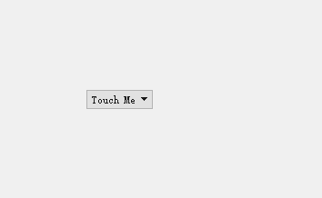


#### 2，工具按钮(ToolButton)

QToolButton是一个特殊的Button, 提供快速访问特定的命令或选项。与普通命令按钮不同, QToolButton通常不显示文本标签, 而是显示图标。一般用在toolBar上

##### 信号与槽

**signals**

`Inherits:QAbstractButton 继承自父类`

`void triggered(QAction *action) 按钮绑定的菜单动作被触发 ` 

**slots**

`void setDefaultAction(QAction *action)	如果有菜单，弹出菜单，否则啥也不做(这个槽貌似没啥用)`

`void setToolButtonStyle(Qt::ToolButtonStyle style) 设置工具按钮是否仅显示图标、仅显示文本，还是图标旁边/下面的文本。 `

`void showMenu()`

```cpp
QToolButton*toolbtn = new QToolButton(this);
toolbtn->move(200,100);
toolbtn->setText("hello");
//设置图标
toolbtn->setIcon(style()->standardIcon
                 (QStyle::StandardPixmap::SP_FileIcon));
//设置文字显示位置
toolbtn->setToolButtonStyle
    (Qt::ToolButtonStyle::ToolButtonTextUnderIcon);
```

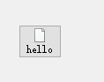

##### 常用函数

| 序号 | 函数&描述                                                    |
| :--: | ------------------------------------------------------------ |
|  1   | <span style = "font-size:18px;color:rgb(0,102,0)" >int void setArrowType(Qt::ArrowType type)</span><br />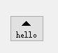<span style="font-size:13px">此属性用于保存按钮是否显示箭头而不是普通图标</span> |
|  2   | <span style = "font-size:18px;color:rgb(0,102,0)" >void setAutoRaise(bool enable)</span><br />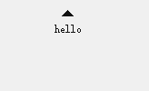<span style="font-size:13px">去掉边框和背景，鼠标在按钮上面时，显示选中效果，按下时有下沉效果</span> |
|  3   | <span style = "font-size:18px;color:rgb(0,102,0)" >void setMenu(QMenu *menu)</span><br /><span style="font-size:13px">设置弹出菜单  </span> |
|  4   | <span style = "font-size:18px;color:rgb(0,102,0)" >void setPopupMode(QToolButton::ToolbuttonPopupMode mode)</span><br /><span style="font-size:13px">描述如何将弹出菜单与工具按钮一起使用，默认设置为DelayedPopup </span> |

###### 弹出菜单

```cpp
QMenu*menu = new QMenu;
menu->addAction("C语言");
menu->addAction("C++");

toolbtn->setMenu(menu);
//设置弹出模式，DelayedPopup延时弹出 MenuButtonPopup在右侧显示一个箭头  InstantPopup立即弹出
toolbtn->setPopupMode(QToolButton::DelayedPopup);
//设置按钮菜单之后，右下角有一个小箭头，去掉箭头
toolbtn->setStyleSheet("QToolButton::menu-indicator {image: none;}");
```


#### 3，单选按钮(RadioButton)

QRadioButton部件提供了一个带有文本标签的单选按钮。

QRadioButton是一个可以切换选中（checked）或未选中（unchecked）状态的选项按钮。单选框通常呈现给用户一个“多选一”的选择。也就是说，在一组单选框中，一次只能选中一个单选框。

##### 信号与槽

**signals**

`Inherits:QAbstractButton 继承自父类`

**slots**

`Inherits:QAbstractButton 继承自父类`


##### 常用函数
| 序号 | 函数&描述                                                    |
| :--: | ------------------------------------------------------------ |
|  1   | <span style = "font-size:18px;color:rgb(0,102,0)" >void setCheckState(Qt::CheckState state)</span><br /><span style="font-size:13px"> 将复选框的复选状态设置为state。 如果不需要三状态支持，还可以使用QAbstractButton::setChecked()，它接受布尔值。   </span> |
|  2   | <span style = "font-size:18px;color:rgb(0,102,0)" >void setTristate(bool)</span><br /><span style="font-size:13px">该属性保存复选框是否是三状态复选框，默认为false，即复选框只有两个状态</span> |


##### 使用方法

+ 同一组(同一父对象)的单选按钮一次只能选中一个

```cpp
QRadioButton*radiobtn = new QRadioButton("男",this);
QRadioButton*radiobtn1 = new QRadioButton("女",this);
//设置默认选中
radiobtn->setChecked(true);
```

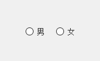

+ 同一组同时选中多个

```cpp
QGroupBox* exampleGroup = new QGroupBox("esample",this);
QLabel*label = new QLabel("你喜欢以下哪些宠物？");
exampleGroup->move(300,300);
QRadioButton *dogbtn =  new QRadioButton("狗");
QRadioButton *catbtn =  new QRadioButton("猫");
QRadioButton *snakebtn =  new QRadioButton("蛇");
QRadioButton *pigbtn =  new QRadioButton("猪");

dogbtn->setAutoExclusive(false);
catbtn->setAutoExclusive(false);
snakebtn->setAutoExclusive(false);
pigbtn->setAutoExclusive(false);

QVBoxLayout* layout = new QVBoxLayout;
layout->addWidget(label);
layout->addWidget(dogbtn);
layout->addWidget(catbtn);
layout->addWidget(snakebtn);
layout->addWidget(pigbtn);

exampleGroup->setLayout(layout);
```

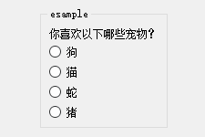


+ 不同组的单选按钮可以同时选中

```cpp
QGroupBox* sexGroup = new QGroupBox("性别",this);
QGroupBox* viewpointGroup = new QGroupBox("观点",this);
sexGroup->move(200,300);
viewpointGroup->move(300,300);

QRadioButton*radiobtn = new QRadioButton("男",sexGroup);
QRadioButton*radiobtn1 = new QRadioButton("女",sexGroup);

QRadioButton*radiobtn2 = new QRadioButton("好",viewpointGroup);
QRadioButton*radiobtn3 = new QRadioButton("坏",viewpointGroup);

QHBoxLayout* sexLayout = new QHBoxLayout;
sexLayout->addWidget(radiobtn);
sexLayout->addWidget(radiobtn1);

QHBoxLayout* viewpointLayout = new QHBoxLayout;
viewpointLayout->addWidget(radiobtn2);
viewpointLayout->addWidget(radiobtn3);

sexGroup->setLayout(sexLayout);
viewpointGroup->setLayout(viewpointLayout);
```

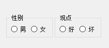


#### 4，复选框(CheckBox)

QCheckBox提供了一个带文本标签的复选框。

QCheckBox（复选框）和QRadioButton（单选框）都是选项按钮。这是因为它们都可以在开（选中）或者关（未选中）之间切换。区别是对用户选择的限制：单选框定义了“多选一”的选择，而复选框提供的是“多选多”的选择。

尽管在技术上可以通过复选框来实现单选框的行为，反之亦然，但还是强烈建议使用众所周知的约定。

##### 信号与槽

**signals**

`Inherits:QAbstractButton 继承自父类 `

`void stateChanged(int state)` 当复选框的状态发生变化时，即当用户选中或取消选中它时，就会发出这个信号。  

**slots**

`Inherits:QAbstractButton 继承自父类`

##### 使用方法

```cpp
QGroupBox* exampleGroup = new QGroupBox(this);
exampleGroup->move(300,300);

QLabel*label = new QLabel("你喜欢以下哪些宠物？");
QCheckBox *dogbtn =  new QCheckBox("狗");
QCheckBox *catbtn =  new QCheckBox("猫");
QCheckBox *snakebtn =  new QCheckBox("蛇");
QCheckBox *pigbtn =  new QCheckBox("猪");

QVBoxLayout* layout = new QVBoxLayout;
layout->addWidget(label);
layout->addWidget(dogbtn);
layout->addWidget(catbtn);
layout->addWidget(snakebtn);
layout->addWidget(pigbtn);

exampleGroup->setLayout(layout);
```

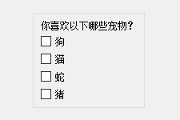


#### 5，行编辑器(LineEdit)

##### 信号与槽

**signals**

`Inherits:QAbstractButton 继承自父类`

```cpp
void clear()					//清除行编辑的内容
void copy() const				//将选中的文本复制到剪贴板(如果有的话)，并且echoMode()是Normal
void cut()						//剪切
void paste()					//粘贴
void redo()						//撤销
void selectAll()				//选中所有
void setText(const QString &)
void undo()						//反撤销
```

**slots**

`void showMenu()	如果有菜单，弹出菜单，否则啥也不做(这个槽貌似没啥用)`

```cpp
//这个信号在光标移动时发出。前一个位置由oldPos给出，新位置由newPos给出
void cursorPositionChanged(int oldPos, int newPos)
//编辑完成，按下Return或Enter键或行编辑失去焦点时将发出此信号
void editingFinished()
//当用户按下一个不被认为是可接受输入的键时，就会发出这个信号。 例如，如果一个按键导致验证器的validate()调用返回Invalid。 另一种情况是试图输入超过行编辑的最大长度的字符。    
void inputRejected()
//编不编辑，当按下Return或Enter键时都发出此信号，失去焦点不会发
void returnPressed()
//这个信号在选择改变时发出  
void selectionChanged()
//每当文本发生变化时，就会发出这个信号。与texttedited()不同，调用setText()改变文本，此信号也会发出。  
void textChanged(const QString &text)
//只要文本被编辑，就会发出这个信号。     
void textEdited(const QString &text)
```

##### 设置显示模式

```cpp
edit->setEchoMode(QLineEdit::EchoMode::Password);
QLineEdit::Normal				//显示输入的字符，这是默认值。  
QLineEdit::NoEcho				//不要显示任何东西
QLineEdit::Password				//显示与平台相关的密码掩码字符，而不是实际输入的字符。  
QLineEdit::PasswordEchoOnEdit	//在编辑时显示已输入的字符，完成显示掩码字符
    
edit->setClearButtonEnabled(true);	//启用清除按钮
```

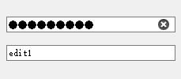

##### 设置输入掩码

| 掩码字符  | 含义                 |
| ---- | -------------------------------------------------------- |
| A   | ASCII字母字符是必须的，A-Z，a-z                |
| a   | ASCII 字母字符是允许的但不是必须的                      |
| N   | ASCII字母字符是必须的，A-Z，a-z， 0-9               |
| n  | ASCII 字母字符是允许的但不是必须的                      |
| X  | 任何字符都可以，是必须需要的                            |
| x  | 任何字符都允许的，但不是必须需要的                      |
| 9  | ASCII 数字是必须要的，0-9                              |
| 0  | ASCII 数字是允许的，但不是必须要的                      |
| D  | ASCII  数字是必须要的，1-9                             |
| d  | ASCII 数字是允许的，但不是必须要的   |
| #  | ASCII 数字是或加减符号允许的，但不是必须要的            |
| H  | 十六进制数据字符是必须要的，A-F, a-f, 0-9              |
| h  | 十六进制数据字符是允许的，但不是必须要的                |
| B  | 二进制数据字符是必须要的，0-1                         |
| b  | 二进制数据字符是允许的，但不是必须要的                  |
| >  | 所有的字符字母都都大写的                                |
| <  | 所有的字符字幕都是小写的                                |
| !  | 关闭大小写                                              |
| ;c | 终止输入掩码并将空白字符设置为c |
| \  | 使用 `\` 去转义上面的字符，如果再需要显示上述字符的时候 |

+ 输入日期

```cpp
edit->setText(QDate::currentDate().toString("yyyy-MM-dd"));
edit->setInputMask("9999-99-99");
```

+ 输入秘钥

```cpp
edit->setInputMask(">AAAAA-AAAAA-AAAAA-AAAAA-AAAAA");
```


##### 设置验证器

+ 只能输入整数

```cpp
edit->setValidator(new QIntValidator(-90,90,this));
```

+ 只能输入浮点数，但是浮点数验证器不能限制范围，可以随便输入

```cpp
edit->setValidator(new QDoubleValidator(-90.0,90.0,3,this));
```

##### 添加动作

```cpp
void QLineEdit::addAction(QAction *action, QLineEdit::ActionPosition position)
QAction *QLineEdit::addAction(const QIcon &icon, QLineEdit::ActionPosition position)
```

```cpp
QLineEdit *edit = new QLineEdit(this);
edit->addAction(QIcon("://images/user.png"),QLineEdit::ActionPosition::LeadingPosition);
QAction *delAct = edit->addAction(QIcon("://images/delete.png"),QLineEdit::ActionPosition::TrailingPosition);
connect(delAct,&QAction::triggered,[]()
{
    qDebug()<<"delAct";
});
```


#### 6，标签(Label)

QLabel小部件提供文本或图像显示

###### 信号与槽

**signals**

```cpp
//当用户点击链接时会发出此信号。
void linkActivated(const QString &link)
//当用户将鼠标悬停在链接上时会发出此信号。    
void linkHovered(const QString &link)
```

**slots**

```cpp
void clear()
void setMovie(QMovie *movie)
void setNum(double num)
void setNum(int num)
void setPicture(const QPicture &picture)
void setPixmap(const QPixmap &)
void setText(const QString &)
```

###### 公有函数
| 序号 | 函数&描述                                                    |
| :--: | ------------------------------------------------------------ |
|  1   | <span style = "font-size:18px;color:rgb(0,102,0)" >void setAlignment(*Qt::Alignment*)</span><br /><span style="font-size:13px">设置对齐方式   </span> |
|  2   | <span style = "font-size:18px;color:rgb(0,102,0)" >void setBuddy(QWidget **buddy*)</span><br /><span style="font-size:13px">将此标签的好友设置为buddy。当用户按下此标签指示的快捷键时，键盘焦点将转移到标签的好友小部件。伙伴机制仅适用于包含文本的 QLabel，其中一个字符以与号“&”为前缀。  </span> |
|  3   | <span style = "font-size:18px;color:rgb(0,102,0)" >void setIndent(*int*)</span><br /><span style="font-size:13px">设置label的文本缩进，以像素为单位   </span> |
|  4   | <span style = "font-size:18px;color:rgb(0,102,0)" >void setMargin(*int*)</span><br /><span style="font-size:13px">设置边距     </span> |
|  5   | <span style = "font-size:18px;color:rgb(0,102,0)" >void setOpenExtrenalLinks(*bool open*)</span><br /><span style="font-size:13px">设置是否自动打开超链接   </span> |
|  6   | <span style = "font-size:18px;color:rgb(0,102,0)" >void setScaledContents(*bool*)</span><br /><span style="font-size:13px">设置内容缩放，确定标签是否将其内容缩放以填充所有可用空间。    </span> |
|  7   | <span style = "font-size:18px;color:rgb(0,102,0)" >void setSelection(*int start,int len*)</span><br /><span style="font-size:13px">设置对齐方式   </span> |
|  8   | <span style = "font-size:18px;color:rgb(0,102,0)" >void setTextFormat(*Qt::TextFormat*)</span><br /><span style="font-size:13px">设置标签文本格式   </span> |
|  9   | <span style = "font-size:18px;color:rgb(0,102,0)" >void setTextInteractionFlags(*Qt::TextInteractionFlags flag*)</span><br /><span style="font-size:13px">设置对齐方式   </span> |
|  10  | <span style = "font-size:18px;color:rgb(0,102,0)" >void setWordWrap(*bool on*)</span><br />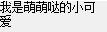<span style="font-size:13px">设置是否在需要时自动换行   </span> |

###### Example:

+ 显示文本

```cpp
QLabel* label = new QLabel("我是萌萌哒的小可爱",this);
label->setAlignment(Qt::AlignmentFlag::AlignCenter);
label->setFixedWidth(100);  //设置固定的宽度
label->setWordWrap(true);   //当文本超过固定的宽度之后，自动换行
```

+ 设置超链接：QLabel支持html文本

```cpp
label->setText("<a href=\"www.baidu.com\">百度一下</a>");
connect(label,&QLabel::linkHovered,this,[=](const QString& link){qDebug()<<"linkHovered"<<link;});    
connect(label,&QLabel::linkActivated,this,[=](const QString& link){qDebug()<<"linkActivated"<<link;});
//设置自动打开超链接，而不是发出信号自己处理，这个设置之后会自动在浏览器打开连接
label->setOpenExternalLinks(true);
```

+ 设置伙伴

```cpp
QLabel* nameLabel = new QLabel("&Name",this);   
QLineEdit * nameEdit = new QLineEdit;           
nameLabel->setBuddy(nameEdit);                  
                                                
QLabel* phoneLabel = new QLabel("电话(&P)",this); 
QLineEdit* phoneEdit = new QLineEdit;           
phoneLabel->setBuddy(phoneEdit);                
                                                
QGridLayout* layout = new QGridLayout;          
layout->addWidget(nameLabel,0,0);               
layout->addWidget(nameEdit,0,1);                
layout->addWidget(phoneLabel,1,0);              
layout->addWidget(phoneEdit,1,1);               
                                                
setLayout(layout);                              
```

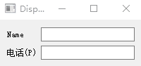

+ 显示图片

```cpp
QLabel* label = new QLabel(this);
label->setPixmap(QPixmap("://images/label_img.jpg"));
//如上所示，显示的图片是固定的大小，如何让图片按我们想要的大小显示呢？
//1，设置Label的大小，如果有布局，会随着布局动态变化
label->setFixedSize(340,180);
//2，设置内容缩放
label->setScaledContents(true);
```

+ 显示Gif动图

```cpp
QLabel* label = new QLabel(this);
QMovie *movie = new QMovie("F:/MyCode/QtCode/QtCourse/DisplayWidgets/images/label_gif.gif");
label->setMovie(movie);
movie->start();
```

#### 7，分组框(GroupBox)

###### 信号与槽

**signals**

```cpp
void clicked(bool checked = false)
void toggled(bool on)
```

**slots**

```cpp
void setChecked(bool checked)
```

###### 公有函数

| 序号 | 函数&描述                                                    |
| :--: | ------------------------------------------------------------ |
|  1   | <span style = "font-size:18px;color:rgb(0,102,0)" >void setAlignment(*Qt::Alignment*)</span><br /><span style="font-size:13px">设置对齐方式   </span> |
|  2   | <span style = "font-size:18px;color:rgb(0,102,0)" >void setCheckAble(bool *checkable*)</span><br /><span style="font-size:13px">该分组框是否可以被选择  </span> |
|  3   | <span style = "font-size:18px;color:rgb(0,102,0)" >void setflat(bool *flat*)</span><br /><span style="font-size:13px">分组框通常由顶部有标题的包围框组成。 如果启用此属性，则大多数样式只绘制框架的顶部部分; 否则，将绘制整个框架。     </span> |
|  4   | <span style = "font-size:18px;color:rgb(0,102,0)" >void setTitle(const QString& *title*)</span><br /><span style="font-size:13px">设置分组框的标题   </span> |

```cpp
QGroupBox* groupBox = new QGroupBox(this);
groupBox->move(100,100);
groupBox->resize(320,320);
groupBox->setTitle("我是分组框");
//groupBox->setAlignment(Qt::AlignCenter);
//groupBox->setFlat(true);

groupBox->setCheckable(true);

connect(groupBox,&QGroupBox::clicked,this,[](){qDebug()<<"clicked";});
connect(groupBox,&QGroupBox::toggled,this,[](){qDebug()<<"toggled";});

QList<QCheckBox*> checkBoxs;
for (int i = 0;i<5;i++)
{
    checkBoxs.push_back(new QCheckBox(QString("checkBox%1").arg(i),groupBox));
    checkBoxs[i]->move(10,i*40+20);
}
groupBox->setChecked(true);
```

