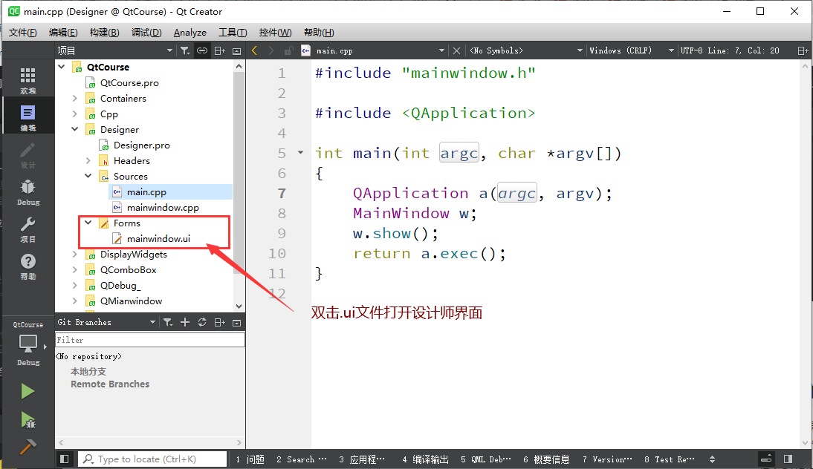
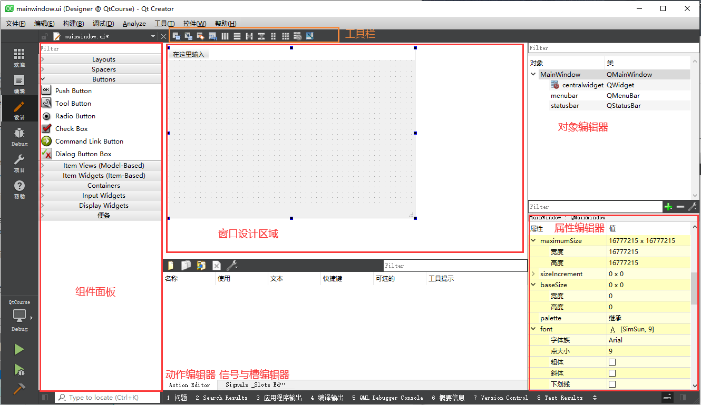
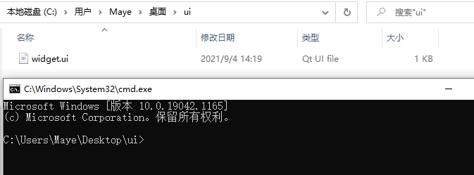

# Designer设计师的使用

在前面的课程中中，我们学习了怎么样用代码来把Qt的界面写出来，代码控制界面，控制力确实比较好，但是免不了复杂的代码，而且需要丰富的想象力。

很多时候运行时的样子，并不是我们想要的，所以说我们可以用Qt给我们提供的`Qt Designer`（界面设计师），拖拖拽拽就可以直观的创建出程序大体的界面。

### 1.1 创建带UI文件的项目

+ 双击.ui文件打开设计师界面



+ 设计师面板介绍
  + 组件面板：窗口左侧是界面设计组件面板，分为多个组，如Layouts、Buttons、Display Widgets等，界面设计的常见组件都可以在组件面板里找到。
  + 中间主要区域是待设计的窗体。如果要将某个组件放置到窗体上时，从组件面板上拖放一个组件到窗体上即可。例如，先放一个 Label 和一个 Push Button 到窗体上。
  + Signals 和 Slots 编辑器与 Action 编辑器是位于待设计窗体下方的两个编辑器。Signals 和Slots 编辑器用于可视化地进行信号与槽的关联，Action 编辑器用于可视化设计 Action。
  + 布局和界面设计工具栏：窗口上方的一个工具栏，工具栏上的按钮主要实现布局和界面设计。
  + 对象浏览器（Object Inspector）：窗口右上方是 Object Inspector，用树状视图显示窗体上各组件之间的布局包含关系，视图有两列，显示每个组件的对象名称（ObjectName）和类名称。
  + 属性编辑器（Property Editor）：窗口右下方是属性编辑器，是界面设计时最常用到的编辑器。属性编辑器显示某个选中的组件或窗体的各种属性及其取值，可以在属性编辑器里修改这些属性的值。



### 1.2 UI设计器使用

#### 1，转到槽

+ 递归搜索给定对象的所有子对象，并将来自它们的匹配信号连接到遵循以下形式的对象槽：

  ```css
  void on_<object name>_<signal name>(<signal parameters>);
  ```

  让我们假设我们的对象有一个 QPushButton 类型的子对象，对象名为 button1。 捕捉按钮的 clicked() 信号的插槽是：

     ```css
     void on_button1_clicked();
     ```

  如果对象本身具有正确设置的对象名称，则其自身的信号也连接到其各自的插槽。

#### 2，自定义控件(提升为)


### 1.3 UI设计师原理

就算我们不编写一行程序语句，都能实现界面功能，Qt 是怎么实现的呢？

为了搞清楚Widget类的定义，以及界面功能的实现原理，先将项目进行编译。编译后在项目目录下会自动生成一个文件 ui_widget.h，这样对于一个窗口，就有 4 个文件了，各文件的功能说明见下表。

| 文件名      | 描述                                                         |
| ----------- | ------------------------------------------------------------ |
| widget.h    | 定义Widget类的头文件                                         |
| widget.cpp  | Widget 类的功能实现源文件                                    |
| widget.ui   | 界面文件，由UI设计器自动生成，存储了窗体上各个组件的属性设置和布局 |
| ui_widget.h | 编译后，根据窗体上的组件及其属性、信号与槽的关联等自动生成的一个类的定义文件，类的名称是Ui_Widget |

下面分别分析各个文件的内容及其功能，以及它们是如何联系在一起工作，实现界面的创建与显示的。

#### Widget.h

```cpp
#ifndef WIDGET_H
#define WIDGET_H

#include <QWidget>

QT_BEGIN_NAMESPACE
namespace Ui { class Widget; }
QT_END_NAMESPACE

class Widget : public QWidget
{
    Q_OBJECT

public:
    Widget(QWidget *parent = nullptr);
    ~Widget();

private:
    Ui::Widget *ui;
};
#endif // WIDGET_H
```

+ **namespace申明**

  代码中有如下的一个 namespace 声明：

  ```cpp
  namespace Ui { class Widget; }
  ```

  这是声明了一个名为 Ui 的命名空间（namespace），包含一个类 Widget。但是这个类 Widget 并不是本文件里定义的类 Widget，而是 ui_widget.h 文件里定义的类，用于描述界面组件的。这个声明相当于一个外部类型声明（具体要看完 ui_widget.h 文件内的解释之后才能搞明白）。

+ **private指针定义**

  ```cpp
  Ui::Widget *ui;
  ```

  这个指针是用前面声明的 namespace Ui 里的 Widget 类定义的，所以指针 ui 是指向可视化设计的界面，后面会看到要访问界面上的组件，都需要通过这个指针 ui。


#### Widget.cpp

```cpp
#include "widget.h"
#include "ui_widget.h"

Widget::Widget(QWidget *parent)
    : QWidget(parent)
    , ui(new Ui::Widget)
{
    ui->setupUi(this);
}

Widget::~Widget()
{
    delete ui;
}
```

+ 注意到，在这个文件的头文件包含部分自动加入了如下一行内容

  ```cpp
  #include "ui_widget.h"
  ```

  这个就是 Qt 编译生成的与 UI 文件 widget.ui 对应的类定义文件。

+ 在构造函数初始化参数列表里有这么一段代码

  ```cpp
  ui(new Ui::Widget)
  ```

  其意义是：执行父类 QWidget 的构造函数，创建一个 Ui::Widget 类的对象 ui。这个 ui 就是 Widget 的 private 部分定义的指针变量 ui。

+ 构造函数里只有一行代码

  ```cpp
  ui->setupUi(this);
  ```

  它是执行了 Ui::Widget 类的 setupUi() 函数，这个函数实现窗口的生成与各种属性的设置、信号与槽的关联（后面会具体介绍）。

+ 析构函数只是简单地delete用 new 创建的指针 ui。

+ 所以，在 ui_widget.h 文件里有一个 namespace 名称为 Ui，里面有一个类 Widget 是用于描述可视化设计的窗体，且与 widget.h 里定义的类同名。在 Widget 类里访问 Ui::Widget 类的成员变量或函数需要通过 Widget 类里的 ui 指针，如同构造函数里执行 ui->setupUi( this) 函数那样。

#### Widget.ui

widget.ui 是界面定义文件，是一个 XML 文件，定义了窗口上的所有组件的属性设置、布局，及其信号与槽函数的关联等。用UI设计器可视化设计的界面都由 Qt 自动解析，并以 XML 文件的形式保存下来。在设计界面时，只需在 UI 设计器里进行可视化设计即可，而不用管 widget.ui 文件是怎么生成的。

```cpp
<?xml version="1.0" encoding="UTF-8"?>
<ui version="4.0">
 <class>Widget</class>
 <widget class="QWidget" name="Widget">
  <property name="geometry">
   <rect>
    <x>0</x>
    <y>0</y>
    <width>800</width>
    <height>600</height>
   </rect>
  </property>
  <property name="windowTitle">
   <string>Widget</string>
  </property>
 </widget>
 <resources/>
 <connections/>
</ui>
```


#### ui_Widget.h

ui_widget.h 是在对 widget.ui 文件编译后生成的一个文件，ui_widget.h 会出现在编译后的目录下，或与 widget.ui 同目录（与项目的 shadow build 编译设置有关）。

文件 ui_widget.h 并不会出现在 Qt Creator 的项目文件目录树里，当然，可以手工将 ui_widget.h 添加到项目中。方法是在项目文件目录树上，右击项目名称节点，在调出的快捷菜单中选择“Add Existing Files…”，找到并添加 ui_widget.h 文件即可。

注意，ui_widget.h 是对 widget.ui 文件编译后自动生成的，widget.ui 又是通过 UI 设计器可视化设计生成的。所以，对 ui_widget.h 手工进行修改没有什么意义，所有涉及界面的修改都应该直接在UI 设计器里进行。所以，ui_widget.h 也没有必要添加到项目里。

```cpp
#ifndef UI_WIDGET_H
#define UI_WIDGET_H

#include <QtCore/QVariant>
#include <QtWidgets/QApplication>
#include <QtWidgets/QWidget>

QT_BEGIN_NAMESPACE

class Ui_Widget
{
public:

    void setupUi(QWidget *Widget)
    {
        if (Widget->objectName().isEmpty())
            Widget->setObjectName(QString::fromUtf8("Widget"));
        Widget->resize(800, 600);

        retranslateUi(Widget);

        QMetaObject::connectSlotsByName(Widget);
    } // setupUi

    void retranslateUi(QWidget *Widget)
    {
        Widget->setWindowTitle(QCoreApplication::translate("Widget", "Widget", nullptr));
    } // retranslateUi

};

namespace Ui {
    class Widget: public Ui_Widget {};
} // namespace Ui

QT_END_NAMESPACE

#endif // UI_WIDGET_H
```

+ 查看 ui_widget.h 文件的内容，发现它主要做了以下的一些工作：

  + 1，定义了一个类 Ui_Widget，用于封装可视化设计的界面。

  + 2，自动生成了界面各个组件的类成员变量定义。在 public 部分为界面上每个组件定义了一个指针变量，变量的名称就是设置的 objectName。比如，在窗体上放置了一个 QLabel 和一个 QPushButton 并命名后，自动生成的定义是：

    ```cpp
    QLabel *LabDemo;
    QPushButton *btnClose;
    ```

  + 定义了 setupUi() 函数，这个函数用于创建各个界面组件，并设置其位置、大小、文字内容、字体等属性，设置信号与槽的关联。setupUi() 函数体的第一部分是根据可视化设计的界面内容，用 C++ 代码创建界面上各组件，并设置其属性。

    接下来，setupUi() 调用了函数 retranslateUi(Widget)，用来设置界面各组件的文字内容属性，如标签的文字、按键的文字、窗体的标题等。将界面上的文字设置的内容独立出来作为一个函数 retranslateUi()，在设计多语言界面时会用到这个函数。

    setupUi() 函数的第三部分是设置信号与槽的关联：

    ```cpp
    QMetaObject::connectSlotsByName(Widget);
    ```

    该代码是设置槽函数的关联方式，用于将 UI 设计器自动生成的组件信号的槽函数与组件信号相关联。

    所以，在Widget 的构造函数里调用 ui->setupUI(this)，就实现了窗体上组件的创建、属性设置、信号与槽的关联。

  + 定义 namespace Ui，并定义一个从Ui_Widget 继承的类Widget。

    ```cpp
    namespace Ui {
      class Widget: public Ui_Widget {};
    }
    ```

提示：ui_widget.h 文件里实现界面功能的类是 Ui_Widget。再定义一个类 Widget 从 Ui_Widget 继承而来，并定义在 namespace Ui 里，这样 Ui:: Widget 与 widget.h 里的类 Widget 同名，但是用 namespace 区分开来。所以，界面的 Ui:: Widget 类与文件 widget.h 里定义的 Widget 类实际上是两个类，但是 Qt 的处理让用户感觉不到 Ui:: Widget 类的存在，只需要知道在 Widget 类里用 ui 指针可以访问可视化设计的界面组件就可以了


### 1.4 用Ui文件生成头文件

+ 1，打开终端，并切换工作目录到.ui文件所在的目录



+ 2，输入如下命令，可以看到ui_widget.h文件就生成出来了

  ```css
  uic widget.ui -o ui_widget.h
  ```

  

### 1.5 使用ui_widget.h

一句话，要让ui designer设计出来的界面显示出来，只要能设法调用Ui_widget类的setupUi函数就行了。

**三步即可完成**

+ 1，前置声明

  ```cpp
  //widget.h
  namespace Ui 
  {
      class widget;
  }
  ```

+ 2，类中定义

  ```cpp
  //widget.h
  private:
      Ui::widget* ui;
  ```

+ 3，申请内存，设置ui

  ```cpp
  //widget.cpp
  Widget::Widget(QWidget *parent)
      : QWidget(parent)
      ,ui(new Ui::widget)	//给ui指针分配内存
  {
          ui->setupUi(this);	//给当前窗口this，设置ui界面
  }
  ```

  
