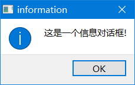
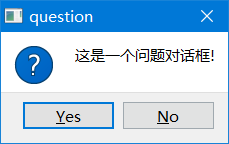
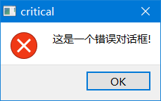
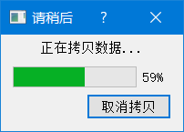

## QDialog

Qt中使用QDialog来实现对话框，QDialog继承自QWidget，对话框分为两种，一种是模态对话框、 另一种是非模态对话框。即阻塞和非阻塞对话框，而模态对话框又有两种：应用程序级别的和窗口级别的，分别指完成对话框之前阻塞整个应用和阻塞关联窗口。exec() 和  open() 分别为应用程序级别和窗口级别的模态对话框，show（）则为非模态对话框。

+ **模态对话框**：在弹出模态对话框时，除了该对话框整个应用程序窗口都无法接受用户响应，处于等待状态，直到模态对话框被关闭
+ **半模态对话框**：又叫做无模式对话框，即弹出非模态对话框时，用户仍然可以对其他窗口进行操作，不会因为这个对话框未关闭就不能操作其他窗口。
+ **非模态对话框**：半模态对话框区别于模态与非模态对话框，或者说是介于两者之间，也就是说半模态对话框会阻塞窗口的响应，但是不会影响后续代码的执行。

```c++
// 构造函数
QDialog::QDialog(QWidget *parent = nullptr, Qt::WindowFlags f = Qt::WindowFlags());

void setSizeGripEnabled(bool)	//设置启用大小手柄


[virtual slot] void open()					// 半模态显示窗口
[virtual slot] int QDialog::exec();			// 模态显示窗口

// 隐藏模态窗口, 并且解除模态窗口的阻塞, 将 exec() 的返回值设置为 QDialog::Accepted
[virtual slot] void QDialog::accept();
// 隐藏模态窗口, 并且解除模态窗口的阻塞, 将 exec() 的返回值设置为 QDialog::Rejected
[virtual slot] void QDialog::reject();
// 关闭对话框并将其结果代码设置为r。finished()信号将发出r;如果r是QDialog::Accepted 或 QDialog::Rejected，则还将分别发出accept()或Rejected()信号。
[virtual slot] void QDialog::done(int r);
```

+ signals

  ```cpp
  void QDialog::accepted();
  void QDialog::rejected();
  void QDialog::finished(int result);
  ```

+ 示例

  ```cpp
  dialog->show();
  dialog->exec();
  dialog->open();
  qDebug()<<"大老虎，嗷嗷嗷~";
  
  connect(dialog,&QDialog::finished,this,[](int res){qDebug()<<QDialog::DialogCode(res);});
  connect(dialog,&QDialog::rejected,this,[](){qDebug()<<"rejected";});
  connect(dialog,&QDialog::accepted,this,[](){qDebug()<<"accept";});
  ```

  

## QDialogButtonBox

QDialogButtongBox类是一个包含很多按钮的控件，在对话框中有多个按钮需要分组排列的按钮时，可以使用QDialogButtongBox类。

+ 添加按钮

  ```cpp
  void addButton(QAbstractButton *button, QDialogButtonBox::ButtonRole role)
  QPushButton *addButton(const QString &text, QDialogButtonBox::ButtonRole role)
  QPushButton *addButton(QDialogButtonBox::StandardButton button)
  void setStandardButtons(QDialogButtonBox::StandardButtons buttons)
  ```

  示例：

  ```cpp
  auto *yesBtn =  dialogBtnBox->addButton(QDialogButtonBox::StandardButton::Yes);
  yesBtn->setText("确定");
  dialogBtnBox->addButton(QDialogButtonBox::StandardButton::Close)->setText("关闭");    
  dialogBtnBox->addButton("查看帮助",QDialogButtonBox::ButtonRole::HelpRole);
  ```

+ sngnals

  ```cpp
  void accepted()		//当单击按钮框中的按钮时将发出此信号，只要该按钮是用AcceptRole或YesRole定义的。  
  void clicked(QAbstractButton *button)	//当单击按钮框中的按钮时，将发出此信号,具体按钮由button指定
  void helpRequested() //当按钮框中的按钮被单击时，这个信号就会发出，只要它是用HelpRole定义的。
  void rejected()	     //当单击按钮框中的按钮时，此信号将被触发，只要它是用RejectRole或NoRole定义的
  ```

  示例：

  ```cpp
  //dialog 为按钮组所在的对话框
  connect(dialogBtnBox,&QDialogButtonBox::accepted,this,[=](){qDebug()<<"btnaccepted";
                                                              dialog->accept();});
  connect(dialogBtnBox,&QDialogButtonBox::clicked,this,[=](){qDebug()<<"clicked";});
  connect(dialogBtnBox,&QDialogButtonBox::rejected,this,[=](){qDebug()<<"rejected";
                                                                      dialog->reject();});
  connect(dialogBtnBox,&QDialogButtonBox::helpRequested,this,[=](){qDebug()<<"helpRequested";});
  ```


## 2.1 QMessageBox

> QMessageBox 对话框类是 QDialog 类的子类, 通过这个类可以显示一些简单的提示框, 用于展示警告、错误、问题等信息。关于这个类我们只需要掌握一些静态方法的使用就可以了。

```c++
// 显示一个模态对话框, 将参数 text 的信息展示到窗口中
[static] void QMessageBox::about(QWidget *parent, const QString &title, const QString &text);

/*
参数:
- parent: 对话框窗口的父窗口
- title: 对话框窗口的标题
- text: 对话框窗口中显示的提示信息
- buttons: 对话框窗口中显示的按钮(一个或多个)
- defaultButton
    1. defaultButton指定按下Enter键时使用的按钮。
    2. defaultButton必须引用在参数 buttons 中给定的按钮。
    3. 如果defaultButton是QMessageBox::NoButton, QMessageBox会自动选择一个合适的默认值。
*/

//显示带有标题标题和文本文本的简单关于框。
void about(QWidget *parent, const QString &title, const QString &text)
void aboutQt(QWidget *parent, const QString &title = QString())


// 显示一个信息模态对话框
[static] QMessageBox::StandardButton QMessageBox::information(QWidget *parent, const QString &title, const QString &text, QMessageBox::StandardButtons buttons = Ok, QMessageBox::StandardButton defaultButton = NoButton);

// 显示一个错误模态对话框
[static] QMessageBox::StandardButton QMessageBox::critical(QWidget *parent, const QString &title, const QString &text, QMessageBox::StandardButtons buttons = Ok, QMessageBox::StandardButton defaultButton = NoButton);

// 显示一个问题模态对话框
[static] QMessageBox::StandardButton QMessageBox::question(QWidget *parent, const QString &title, const QString &text, QMessageBox::StandardButtons buttons = StandardButtons(Yes | No), QMessageBox::StandardButton defaultButton = NoButton);

// 显示一个警告模态对话框
[static] QMessageBox::StandardButton QMessageBox::warning(QWidget *parent, const QString &title, const QString &text, QMessageBox::StandardButtons buttons = Ok, QMessageBox::StandardButton defaultButton = NoButton);
```

​                                       

​                                       

+ **示例**

  ```cpp
  QMessageBox::about(this,"关于Maye","我叫<font style=\"color:red\">严炯强</font>，今年十岁了。是一个内向而又聪明的女孩。\
                             <br>我的爱好有:运动、画画、看书、做游戏、科学课和语文课。\
                             <br>去年，我一共得了两张奖状。一张是运动小健将的奖状，另一张是百里路小学冬锻跳绳比赛二年级段女子组第一名的奖状。我明白:只要努力，必须会有收获的。\
                             <br>每次我考到一百分的时候，爸爸妈妈就会奖励我，我也十分高兴。有一次我考了一百分，妈妈买了一个有轮子的书包给我。我考了一百分，爸爸总会带我去吃肯德基。\
                             <br>所以，在新学期里，我要更加努力，再创佳绩!\
                             <br><a href=\"www.bilibili.com\">我的个人主页</a>");
  ```

  

## 2.2 QFileDialog

> QFileDialog 对话框类是 QDialog 类的子类, 通过这个类可以选择要打开/保存的文件或者目录。关于这个类我们只需要掌握一些静态方法的使用就可以了。

```c++
/*
通用参数:
	- parent: 当前对话框窗口的父对象也就是父窗口
	- caption: 当前对话框窗口的标题
	- dir: 当前对话框窗口打开的默认目录
	- options: 当前对话框窗口的一些可选项,枚举类型, 一般不需要进行设置, 使用默认值即可
	- filter: 过滤器, 在对话框中只显示满足条件的文件, 可以指定多个过滤器, 使用 ;; 分隔
		- 样式举例: 
			- Images (*.png *.jpg)
			- Images (*.png *.jpg);;Text files (*.txt)
	- selectedFilter: 如果指定了多个过滤器, 通过该参数指定默认使用哪一个, 不指定默认使用第一个过滤器
*/
// 打开一个目录, 得到这个目录的绝对路径
[static] QString QFileDialog::getExistingDirectory(QWidget *parent = nullptr, const QString &caption = QString(), const QString &dir = QString(), QFileDialog::Options options = ShowDirsOnly);

// 打开一个文件, 得到这个文件的绝对路径
[static] QString QFileDialog::getOpenFileName(QWidget *parent = nullptr, const QString &caption = QString(), const QString &dir = QString(), const QString &filter = QString(), QString *selectedFilter = nullptr, QFileDialog::Options options = Options());

// 打开多个文件, 得到这多个文件的绝对路径
[static] QStringList QFileDialog::getOpenFileNames(QWidget *parent = nullptr, const QString &caption = QString(), const QString &dir = QString(), const QString &filter = QString(), QString *selectedFilter = nullptr, QFileDialog::Options options = Options());

// 打开一个目录, 使用这个目录来保存指定的文件
[static] QString QFileDialog::getSaveFileName(QWidget *parent = nullptr, const QString &caption = QString(), const QString &dir = QString(), const QString &filter = QString(), QString *selectedFilter = nullptr, QFileDialog::Options options = Options());

```


## 2.3 QFontDialog

- QFont 字体类

  ```c++
  QFont::QFont();
  /*
  参数:
  	- family: 本地字库中的字体名, 通过 office 等文件软件可以查看
  	- pointSize: 字体的字号
  	- weight: 字体的粗细, 有效范围为 0 ~ 99
  	- italic: 字体是否倾斜显示, 默认不倾斜
  */
  QFont::QFont(const QString &family, int pointSize = -1, int weight = -1, bool italic = false);
  
  // 设置字体
  void QFont::setFamily(const QString &family);
  // 根据字号设置字体大小
  void QFont::setPointSize(int pointSize);
  // 根据像素设置字体大小
  void QFont::setPixelSize(int pixelSize);
  // 设置字体的粗细程度, 有效范围: 0 ~ 99
  void QFont::setWeight(int weight);
  // 设置字体是否加粗显示
  void QFont::setBold(bool enable);
  // 设置字体是否要倾斜显示
  void QFont::setItalic(bool enable);
  
  // 获取字体相关属性(一般规律: 去掉设置函数的 set 就是获取相关属性对应的函数名)
  QString QFont::family() const;
  bool QFont::italic() const;
  int QFont::pixelSize() const;
  int QFont::pointSize() const;
  bool QFont::bold() const;
  int QFont::weight() const;
  ```

  

  

- QFontDialog类的静态API

  ```c++
  [static] QFont QFontDialog::getFont(bool *ok, const QFont &initial, QWidget *parent = nullptr, const QString &title = QString(), QFontDialog::FontDialogOptions options = FontDialogOptions());
  
  [static] QFont QFontDialog::getFont(bool *ok, QWidget *parent = nullptr);
  ```

- 窗口字体的设置

  ```c++
  // QWidget 类
  // 得到当前窗口使用的字体
  const QWidget::QFont& font() const;
  // 给当前窗口设置字体, 只对当前窗口类生效
  void QWidget::setFont(const QFont &);
  
  // QApplication 类
  // 得到当前应用程序对象使用的字体
  [static] QFont QApplication::font();
  // 给当前应用程序对象设置字体, 作用于当前应用程序的所有窗口
  [static] void QApplication::setFont(const QFont &font, const char *className = nullptr);
  ```

  

## 2.4 QColorDialog

- 颜色类 QColor

  ```c++
  // 构造函数
  QColor::QColor(Qt::GlobalColor color);
  QColor::QColor(int r, int g, int b, int a = ...);
  QColor::QColor();
  
  // 参数 red, green, blue, alpha 取值范围是 0-255
  void QColor::setRed(int red);
  void QColor::setGreen(int green);
  void QColor::setBlue(int blue);
  void QColor::setAlpha(int alpha);
  void QColor::setRgb(int r, int g, int b, int a = 255);
  
  int QColor::red() const;
  int QColor::green() const;
  int QColor::blue() const;
  int QColor::alpha() const;
  void QColor::getRgb(int *r, int *g, int *b, int *a = nullptr) const;
  ```

- QFontDialog类的静态API

  ```c++
  // 弹出颜色选择对话框, 并返回选中的颜色信息
  [static] QColor QColorDialog::getColor(const QColor &initial = Qt::white, QWidget *parent = nullptr, const QString &title = QString(), QColorDialog::ColorDialogOptions options = ColorDialogOptions());
  ```

  

## 2.5 QInputDialog

```c++
[static] double QInputDialog::getDouble(QWidget *parent, const QString &title, const QString &label, double value = 0, double min = -2147483647, double max = 2147483647, int decimals = 1, bool *ok = nullptr, Qt::WindowFlags flags = Qt::WindowFlags());

[static] int QInputDialog::getInt(QWidget *parent, const QString &title, const QString &label, int value = 0, int min = -2147483647, int max = 2147483647, int step = 1, bool *ok = nullptr, Qt::WindowFlags flags = Qt::WindowFlags());

[static] QString QInputDialog::getItem(QWidget *parent, const QString &title, const QString &label, const QStringList &items, int current = 0, bool editable = true, bool *ok = nullptr, Qt::WindowFlags flags = Qt::WindowFlags(), Qt::InputMethodHints inputMethodHints = Qt::ImhNone)
    
[static] QString QInputDialog::getMultiLineText(QWidget *parent, const QString &title, const QString &label, const QString &text = QString(), bool *ok = nullptr, Qt::WindowFlags flags = Qt::WindowFlags(), Qt::InputMethodHints inputMethodHints = Qt::ImhNone);


[static] QString QInputDialog::getText(QWidget *parent, const QString &title, const QString &label, QLineEdit::EchoMode mode = QLineEdit::Normal, const QString &text = QString(), bool *ok = nullptr, Qt::WindowFlags flags = Qt::WindowFlags(), Qt::InputMethodHints inputMethodHints = Qt::ImhNone);
```


## 2.6 QProgressDialog



```c++
// 构造函数
/*
参数:
	- labelText: 对话框中显示的提示信息
	- cancelButtonText: 取消按钮上显示的文本信息
	- minimum: 进度条最小值
	- maximum: 进度条最大值
	- parent: 当前窗口的父对象
	- f: 当前进度窗口的flag属性, 使用默认属性即可, 无需设置
*/
QProgressDialog::QProgressDialog(QWidget *parent = nullptr, Qt::WindowFlags f = Qt::WindowFlags());
QProgressDialog::QProgressDialog(const QString &labelText, const QString &cancelButtonText, int minimum, int maximum, QWidget *parent = nullptr, Qt::WindowFlags f = Qt::WindowFlags());


// 设置取消按钮显示的文本信息
[slot] void QProgressDialog::setCancelButtonText(const QString &cancelButtonText);

// 公共成员函数和槽函数
QString QProgressDialog::labelText() const;
void QProgressDialog::setLabelText(const QString &text);

// 得到进度条最小值
int QProgressDialog::minimum() const;
// 设置进度条最小值
void QProgressDialog::setMinimum(int minimum);

// 得到进度条最大值
int QProgressDialog::maximum() const;
// 设置进度条最大值
void QProgressDialog::setMaximum(int maximum);

// 设置进度条范围(最大和最小值)
[slot] void QProgressDialog::setRange(int minimum, int maximum);

// 得到进度条当前的值
int QProgressDialog::value() const;
// 设置进度条当前的值
void QProgressDialog::setValue(int progress);


bool QProgressDialog::autoReset() const;
// 当value() = maximum()时，进程对话框是否调用reset()，此属性默认为true。
void QProgressDialog::setAutoReset(bool reset);


bool QProgressDialog::autoClose() const;
// 当value() = maximum()时，进程对话框是否调用reset()并且隐藏，此属性默认为true。
void QProgressDialog::setAutoClose(bool close);

// 判断用户是否按下了取消键, 按下了返回true, 否则返回false
bool wasCanceled() const;


// 重置进度条
// 重置进度对话框。wascancelled()变为true，直到进程对话框被重置。进度对话框被隐藏。
[slot] void QProgressDialog::cancel();
// 重置进度对话框。如果autoClose()为真，进程对话框将隐藏。
[slot] void QProgressDialog::reset();   

// 信号
// 当单击cancel按钮时，将发出此信号。默认情况下，它连接到cancel()槽。
[signal] void QProgressDialog::canceled();

// 设置窗口的显示状态(模态, 非模态)
/*
参数:
	Qt::NonModal  -> 非模态
	Qt::WindowModal	-> 模态, 阻塞父窗口
	Qt::ApplicationModal -> 模态, 阻塞应用程序中的所有窗口
*/
void QWidget::setWindowModality(Qt::WindowModality windowModality);
```

## 2.7 QErrorMessage

## 2.8 QColorDialog中文翻译不全？

[QColorDialog翻译方法](https://blog.csdn.net/weixin_43791013/article/details/103774823)