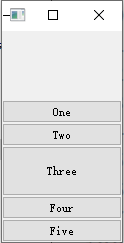

# 布局管理组(Layouts)

什么是布局管理器？你一个窗口里面一般有很多widgets对吧，你如果要自己调它们的位置，大小的话会比较麻烦，而且当窗口变大的时候它里面的widgets又不会跟着变大，就很烦恼。所以，我们有这个东西，布局管理器，相当于一个小管家，你只要把widgets丢进去，他自己会帮你排好它的。

**方法：**

首先，创建好我们想要布局的widgets。 

然后，我们创建 QBoxLayout 对象并将小部件添加到布局中。 

最后，我们调用 QWidget::setLayout() 将 QBoxLayout 对象安装到小部件上。

此时，布局中的小部件将重新设置父对象，为上面调用setLayout()的窗口。

## 1，盒子布局(BoxLayout)

[一去二三里](https://blog.csdn.net/liang19890820/article/details/51537246)

QBoxLayout可以在水平方向或垂直方向上排列控件，分别派生了QHBoxLayout、QVBoxLayout子类。

+ QHBoxLayout：水平布局，在水平方向上排列控件，即：左右排列。
+ QVBoxLayout：垂直布局，在垂直方向上排列控件，即：上下排列。

水平布局、垂直布局除了构造时的方向（LeftToRight、TopToBottom）不同外，其它均相同。

##### 公有函数

| 序号 | 函数&描述                                                    |
| :--: | ------------------------------------------------------------ |
|  1   | <span style = "font-size:18px;color:rgb(0,102,0)" >void addLayout(QLayout* *layout*,int *stretch = 0*)</span><br /><span style="font-size:13px">将layout添加到框的末端，使用连续拉伸因子拉伸。  </span> |
|  2   | <span style = "font-size:18px;color:rgb(0,102,0)" >void addSpacerItem(QSpacerItem * *spacerItem*)</span><br /><span style="font-size:13px">将spaceeritem添加到该盒子布局的末尾，通常不使用这个函数，请使用addSpacing(int size)</span> |
|  3   | <span style = "font-size:18px;color:rgb(0,102,0)" >void addSpacing(int *size*)</span><br /><span style="font-size:13px">添加一个大小为size的不可伸缩空间(QSpacerItem)到这个框布局的末尾</span> |
|  4   | <span style = "font-size:18px;color:rgb(0,102,0)" >void addStretch(int *stretch = 0*)</span><br /><span style="font-size:13px">添加一个可伸缩空间(一个QSpacerItem)，最小尺寸为零，拉伸因子stretch到这个框布局的末尾。  </span> |
|  5   | <span style = "font-size:18px;color:rgb(0,102,0)" >void addStrut(int *size*)</span><br /><span style="font-size:13px">限制盒子的垂直尺寸最小为size</span> |
|  6   | <span style = "font-size:18px;color:rgb(0,102,0)" >void addWidget(QWidget* *widget*,int *stretch = 0*,Qt::Alignment *alignment = 0*)</span><br /><span style="font-size:13px">将小部件添加到此框布局的末尾，并使用拉伸因子拉伸和对齐对齐。</span> |
|  7   | <span style = "font-size:18px;color:rgb(0,102,0)" >void setDirection(QBoxLayout::Direction *direction*)</span><br /><span style="font-size:13px">设置此布局的方向为direction。  </span> |
|  8   | <span style = "font-size:18px;color:rgb(0,102,0)" >void setSpacing(int *spacing*)</span><br /><span style="font-size:13px">设置小部件之间的间距 </span> |
|  9   | <span style = "font-size:18px;color:rgb(0,102,0)" >void setStretch(int *index*,int *stretch*)</span><br /><span style="font-size:13px">给index位置的控件设置拉伸因子stretch</span> |
|  10  | <span style = "font-size:18px;color:rgb(0,102,0)" >bool setStretchFactor(QWidget* *widget*,int *stretch*)<br>bool setStretchFactor(QWidget* *widget*,int *stretch*)</span><br /><span style="font-size:13px">设置小部件的拉伸因子，如果在布局中发现小部件(不包括子布局)，则返回true; 否则返回false。</span> |

下面我们以QHBoxLayout为例，来讲解QBoxLayout的常用功能。


+ 简单布局

```cpp
//创建需要布局的小部件
QLabel* nameLabel = new QLabel("name");
QLineEdit* nameEdit = new QLineEdit;
//创建布局
QBoxLayout* hlayout = new QBoxLayout(QBoxLayout::Direction::LeftToRight);
//把小部件添加到布局
hlayout->addWidget(nameLabel);
hlayout->addWidget(nameEdit);
//给当前窗口设置布局
this->setLayout(hlayout);
```


+ 布局嵌套

```cpp
//姓名                         
QLabel* nameLabel = new QLabel("Name");
QLineEdit* nameEdit = new QLineEdit;

QBoxLayout* nameHlayout = new QBoxLayout(QBoxLayout::Direction::LeftToRight);     
nameHlayout->addWidget(nameLabel);
nameHlayout->addWidget(nameEdit);
//电话
QLabel* phoneLabel = new QLabel("Phone");
QLineEdit* phoneEdit = new QLineEdit;

QBoxLayout* phoneHlayout = new QBoxLayout(QBoxLayout::Direction::LeftToRight);    
phoneHlayout->addWidget(phoneLabel);
phoneHlayout->addWidget(phoneEdit);
//布局嵌套
QBoxLayout* mainlayout = new QBoxLayout(QBoxLayout::Direction::TopToBottom);      
mainlayout->addLayout(nameHlayout);
mainlayout->addLayout(phoneHlayout);
this->setLayout(mainlayout);
```


##### 基本使用

+ 创建五个按钮，添加到水平布局

```cpp
QPushButton *btn1 = new QPushButton("One");
QPushButton *btn2 = new QPushButton("Two");
QPushButton *btn3 = new QPushButton("Three");
QPushButton *btn4 = new QPushButton("Four");
QPushButton *btn5 = new QPushButton("Five");

QHBoxLayout* hlayout = new QHBoxLayout;
hlayout->addWidget(btn1);
hlayout->addWidget(btn2);
hlayout->addWidget(btn3);
hlayout->addWidget(btn4);
hlayout->addWidget(btn5);

this->setLayout(hlayout);
```


+ 设置边距

```cpp
void setMargin(int margin);
void setContentsMargins(int left,int top,int right,int bottom);
```

这里我使用setMargin(0)将外边距设置为0。


+ 设置间距

```cpp
void setSpacing(int spacing)
```


+ 添加拉伸空间(QSpacerItem)

```cpp
QHBoxLayout* hlayout = new QHBoxLayout;
hlayout->addStretch();      //添加拉伸空间
hlayout->addWidget(btn1);
...
```


在第一个控件之前添加伸缩，这样所有的控件就会居右显示。

在最后一个控件之后添加伸缩，这样所有的控件就会居左显示。

在第一个控件之前，最后一个空间之后添加伸缩，这样所有的控件就会居中显示。

+ 添加控件addWidget

```cpp
void addWidget(QWidget *widget, int stretch = 0, Qt::Alignment alignment = 0)
```

默认是居中对齐的，我们把其中一个按钮的高度设置大一点，就可以看到非常明显了~


下面，我们使用向上、向下对齐来设置其它控件。

```cpp
QHBoxLayout* hlayout = new QHBoxLayout;
hlayout->addStretch();      //添加拉伸空间
hlayout->addWidget(btn1,0,Qt::AlignmentFlag::AlignTop);
hlayout->addWidget(btn2,0,Qt::AlignmentFlag::AlignTop);
hlayout->addWidget(btn3,0);
hlayout->addWidget(btn4,0,Qt::AlignmentFlag::AlignBottom);
hlayout->addWidget(btn5,0,Qt::AlignmentFlag::AlignBottom);
```


+ 设置布局方向

```cpp
void setDirection(QBoxLayout::Direction direction)
//可以设置从左到右、从右到左、从上到下、从下到上等。。。
```

`setDirection(QBoxLayout::RightToLeft)`


`setDirection(QBoxLayout::TopToBottom);`



既然使用了QHBoxLayout，一般就不建议使用TopToBottom或者BottomToTop，如果实在确定不了方向，或者方向可以随意变化，那么建议使用QBoxLayout。

##### 设置拉伸系数

当窗体大小变化时，控件会根据拉伸系数来做相应的调整。

```cpp
//设置小部件的拉伸因子，如果在布局中发现小部件(不包括子布局)，则返回true; 否则返回false。  
bool setStretchFactor(QWidget *widget, int stretch)
bool setStretchFactor(QLayout *layout, int stretch)
    
hlayout->setStretchFactor(btn2,1);
hlayout->setStretchFactor(btn3,2);    
```


设置btn2的拉伸系数为1，btn3拉伸系数为2，当窗体变大时，会优先将btn3进行拉伸，当达到一定程度时，再拉伸btn2，btn2与btn3的宽度比例为1:2。

## 2，网格布局(GridLayout)

网格布局也叫格栅布局(多行多列)

QGridLayout占用它可用的空间(通过它的父布局或parentWidget())，将它分成行和列，并将它管理的每个小部件放入正确的单元格中。  

列和行表现相同; 我们将讨论列，但行也有等价的函数。  

每一列都有一个最小宽度和一个拉伸因子。 最小宽度是使用setColumnMinimumWidth()设置的最大宽度和该列中每个小部件的最小宽度。 拉伸因子使用setColumnStretch()设置，并确定列将获得的可用空间超过或超过必要的最小空间的多少。  

##### 公有函数

| 序号 | 函数&描述                                                    |
| :--: | ------------------------------------------------------------ |
|  2   | <span style = "font-size:18px;color:rgb(0,102,0)" >void addLayout(QLayout *layout, int row, int column, Qt::Alignment alignment = 0)<br>void addLayout(QLayout *layout, int row, int column, int rowSpan, int columnSpan, Qt::Alignment alignment = 0)</span><br /><span style="font-size:13px">将layout放置在网格中的位置(row、column)。 左上角的位置是(0,0)。<br>跨越多行/多列。 该单元格将从跨rowSpan行和columnSpan列的行、列开始。</span> |
|  3   | <span style = "font-size:18px;color:rgb(0,102,0)" >void addWidget(QWidget *widget, int row, int column, Qt::Alignment alignment = 0)<br>void addWidget(QWidget *widget, int fromRow, int fromColumn, int rowSpan, int columnSpan, Qt::Alignment alignment = 0)</span><br /><span style="font-size:13px">同上</span> |
|  4   | <span style = "font-size:18px;color:rgb(0,102,0)" >void setRowStretch(int *row*, int *stretch*)</span><br /><span style="font-size:13px">将row的拉伸因子设置为stretch</span> |
|  5   | <span style = "font-size:18px;color:rgb(0,102,0)" >void setColumnStretch(int *column*, int *stretch*)</span><br /><span style="font-size:13px">将column的拉伸因子设置为stretch</span> |
|  6   | <span style = "font-size:18px;color:rgb(0,102,0)" >voidsetRowMinimumHeight(int row, int minSize)</span><br /><span style="font-size:13px">将行的最小宽度设置为minSize像素。  </span> |
|  7   | <span style = "font-size:18px;color:rgb(0,102,0)" >voidsetColumnMinimumWidth(int column, int minSize)</span><br /><span style="font-size:13px">将列的最小宽度设置为minSize像素。  </span> |


```cpp
QLabel* imageLabel = new QLabel;                         
QLineEdit* userNamaeEdit = new QLineEdit;                
QLineEdit* passwdEdit = new QLineEdit;                   
QCheckBox* rememberCheckBox = new QCheckBox;             
QCheckBox* autoLoginCheckBox = new QCheckBox;            
QPushButton* registerBtn = new QPushButton;              
QPushButton* forgetBtn = new QPushButton;                
QPushButton* loginBtn = new QPushButton;                 
                                                         
//设置图片                                                   
imageLabel->setFixedSize(90,90);                         
imageLabel->setPixmap(QPixmap("://images/loginIcon.png"));
imageLabel->setScaledContents(true);                     
                                                         
//设置输入框                                                  
userNamaeEdit->setPlaceholderText("QQ号码/手机/邮箱");         
passwdEdit->setPlaceholderText("密码");                    
                                                         
//设置复选框                                                  
rememberCheckBox->setText("记住密码");                       
autoLoginCheckBox->setText("自动登录");                      
                                                         
//设置按钮                                                   
registerBtn->setText("注册账号");                            
forgetBtn->setText("找回密码");                              
loginBtn->setText("登录");                                 
                                                         
QGridLayout* layout = new QGridLayout;                   
layout->addWidget(imageLabel,0,0,3,1);                   
layout->addWidget(userNamaeEdit,0,1,1,2);                
layout->addWidget(registerBtn,0,3);                      
layout->addWidget(passwdEdit,1,1,1,2);                   
layout->addWidget(forgetBtn,1,3);                        
layout->addWidget(rememberCheckBox,2,1);                 
layout->addWidget(autoLoginCheckBox,2,2);                
layout->addWidget(loginBtn,3,1,1,2);                     
                                                         
layout->setHorizontalSpacing(10);                        
layout->setVerticalSpacing(10);                          
layout->setContentsMargins(20,20,20,20);                 
                                                         
this->setLayout(layout);                                 
```


## 3，表单布局(FormLayout)

QFormLayout类管理输入小部件的表单及其关联的标签  

QFormLayout 是一个方便的布局类，它以两列形式布置其子项。 左列由标签组成，右列由“字段”小部件（行编辑器、旋转框等）组成。 传统上，这种两列表单布局是使用 QGridLayout 实现的。 

QFormLayout 是一种更高级别的替代方案，具有以下优点：

+ **遵守不同平台的外观和感觉准则**
  例如，macOS Aqua 和 KDE 指南指定标签应该右对齐，而 Windows 和 GNOME 应用程序通常使用左对齐。

+ **支持长行换行**

  对于显示较小的设备，QFormLayout可以设置为对长行进行换行，甚至对所有行进行换行。 

+ **创建标签-字段对，有非常方便的API**
  我们可以通过addRow(const QString &labelText, QWidget *field)来创建一个带有给定文本的QLabel及QWidget控件行，它们可以自动的设置为伙伴关系。

##### 公有函数

| 序号 | 函数&描述                                                    |
| :--: | ------------------------------------------------------------ |
|  1   | <span style = "font-size:18px;color:rgb(0,102,0)" >void addRow(QWidget* *label*,QWidget* *field*)<br>void addRow(QWidget* *label*,QLayout* *field*</span>)<br /><span style="font-size:13px">使用给定的label和field在此表单布局的底部添加新行</span> |
|  2   | <span style = "font-size:18px;color:rgb(0,102,0)" >void addRow(const QString &*labelText*, QWidget* *field*)<br>void addRow(const QString &*labelText*, QLayout* *field*)</span><br /><span style="font-size:13px">这个重载会在后台自动创建一个以labelText作为文本的QLabel。 field被设置为新的QLabel的伙伴</span> |
|  3   | <span style = "font-size:18px;color:rgb(0,102,0)" >void addRow(QWidget **widget*)<br>void addRow(QLayout* *layout*)</span><br /><span style="font-size:13px">在表单布局的末尾添加指定的小部件。 这个小部件横跨两列</span> |
|  9   | <span style = "font-size:18px;color:rgb(0,102,0)" >void setRowWrapPolicy(QFormLayout::RowWrapPolicy policy)</span><br /><span style="font-size:13px">设置行换行策略</span> |
|  10  | <span style = "font-size:18px;color:rgb(0,102,0)" >void setSpacing(int spacing)</span><br /><span style="font-size:13px">将垂直和水平间距设置为spacing。</span> |
|  11  | <span style = "font-size:18px;color:rgb(0,102,0)" >void setVerticalSpacing(int spacing)</span><br /><span style="font-size:13px">将垂直间距设置为spacing</span> |
|  12  | <span style = "font-size:18px;color:rgb(0,102,0)" >void setWidget(int row, QFormLayout::ItemRole role, QWidget *widget)</span><br /><span style="font-size:13px">将给定的row中的role设置为widget，必要时使用空行扩展布局。  如果单元格已被占用，则不插入小部件，并将错误消息发送到控制台。</span> |

```cpp
QLineEdit* userEdit = new QLineEdit;
QLineEdit* passwdEdit = new QLineEdit;
QPushButton* loginBtn = new QPushButton("确定");

QFormLayout* fromLayout = new QFormLayout;
fromLayout->addRow("userName:",userEdit);
fromLayout->addRow("password:",passwdEdit);
fromLayout->addWidget(loginBtn);

this->setLayout(fromLayout);
```

将其与下面使用QGridLayout编写的代码进行比较:  

```cpp
QLineEdit* userEdit = new QLineEdit;
QLineEdit* passwdEdit = new QLineEdit;
QPushButton* loginBtn = new QPushButton("确定");

QLabel*userLabel = new QLabel("userName:");
QLabel*passwdLabel = new QLabel("passwdEdit:");

QGridLayout* glayout = new QGridLayout;
glayout->addWidget(userLabel,0,0);
glayout->addWidget(userEdit,0,1);
glayout->addWidget(passwdLabel,1,0);
glayout->addWidget(passwdEdit,1,1);
glayout->addWidget(loginBtn,2,1);

this->setLayout(glayout);
```

+ 设置换行策略  `void setRowWrapPolicy(QFormLayout::RowWrapPolicy policy)`

  | 枚举                      | 描述                                                         | 效果                                                         |
  | ------------------------- | ------------------------------------------------------------ | ------------------------------------------------------------ |
  | QFormLayout::DontWrapRows | 字段总是放在它们的标签旁边(默认样式)                         |  |
  | QFormLayout::WrapLongRows | 标签有足够的空间适应，如果字段对的最小大小大于可用空间，输入框会被换到下一行 |  |
  | QFormLayout::WrapAllRows  | 字段总是在它们的标签下面。                                   |  |

+ 设置控件 `void setWidget(int row, QFormLayout::ItemRole role, QWidget *widget)`

  + 将给定角色的给定行中的小部件设置为*widget*，必要时使用空行扩展布局。 

| 内容                      | 值   | 描述                   |
| ------------------------- | ---- | ---------------------- |
| QFormLayout::LabelRole    | 0    | 标签                   |
| QFormLayout::FieldRole    | 1    | 字段                   |
| QFormLayout::SpanningRole | 2    | 跨标签和字段列的小部件 |

```cpp
QFormLayout * flayout = new QFormLayout;
flayout->setWidget(0,QFormLayout::ItemRole::LabelRole,new QLabel("LabelRole"));
flayout->setWidget(0,QFormLayout::ItemRole::FieldRole,new QLineEdit("FieldRole"));
flayout->setWidget(1,QFormLayout::ItemRole::SpanningRole,new QPushButton("SpanningRole"));

this->setLayout(flayout);
```


## 4，堆栈布局(StackedLayout)

QStackedLayout继承自QLayout。

QStackedLayout类提供了多页面切换的布局，一次只能看到一个界面。

QStackedLayout可用于创建类似于QTabWidget提供的用户界面。也有建立在QStackedLayout之上的便利类QStackedWidget

**sngnals**

```cpp
//每当布局中的当前小部件发生变化时，都会发出此信号。 index指定新的当前小部件的索引，如果没有新的小部件，则-1
void currentChanged(int index)		
//每当从布局中删除小部件时，都会发出此信号，inded是删除的索引。    
void widgetRemoved(int index)
```

**slots**

```cpp
void setCurrentIndex(int index)
void setCurrentWidget(QWidget *widget)
```


### 公有函数

| 序号 | 函数&描述                                                    |
| :--: | ------------------------------------------------------------ |
|  2   | <span style = "font-size:18px;color:rgb(0,102,0)" >int addWidget(QWidget *widget)</span><br /><span style="font-size:13px">把widget添加到布局中</span> |
|  5   | <span style = "font-size:18px;color:rgb(0,102,0)" >int insertWidget(int index, QWidget *widget)</span><br /><span style="font-size:13px">把widget插入到指定的下标</span> |
|  6   | <span style = "font-size:18px;color:rgb(0,102,0)" >void setStackingMode(QStackedLayout::StackingMode stackingMode)</span><br /><span style="font-size:13px">设置子小部件可见性的处理方式。   </span> |

## 5，分割器(Splitter)

QSplitter类实现了一个分离小部件。 splitter允许用户通过拖动子部件之间的边界来控制它们的大小。 任何数量的小部件都可以由单个拆分器控制。QSplitter的典型用法是创建几个小部件并使用 insertWidget()或addWidget()添加它们。

```cpp
QSplitter *splitter = new QSplitter(this);
splitter->addWidget(new QTextBrowser);
splitter->addWidget(new QTextBrowser);
splitter->addWidget(new QTextBrowser);

splitter->setHandleWidth(2);
splitter->setCollapsible(0,false);


QSplitter *sp = new QSplitter(Qt::Orientation::Vertical,splitter);
sp->addWidget(new QTextBrowser);
sp->addWidget(new QTextBrowser);
```

