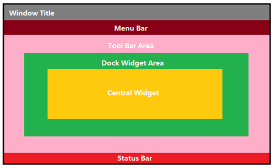
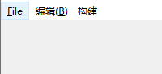
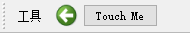
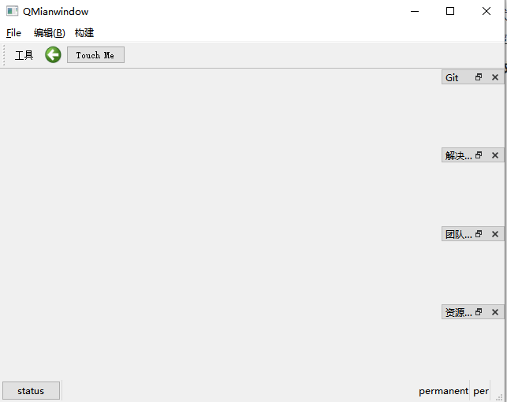

# 1. QMainWindow

> 默认结构最复杂的标准窗口
>
> - 提供了`菜单栏`, `工具栏`, `状态栏`, `停靠窗口`
> - 菜单栏: 只能有一个, 创建的最上方
> - 工具栏: 可以有多个, 默认提供了一个, 窗口的上下左右都可以停靠
> - 状态栏: 只能有一个, 窗口最下方
> - 停靠窗口: 可以有多个, 默认没有提供, 窗口的上下左右都可以停靠



## 1.1 菜单栏

### 创建MenuBar

+ 获取QMainWindow提供的菜单栏

```cpp
QMenuBar* menubar = menuBar();
```

+ 自己new一个，然后设置给窗口

```cpp
QMenuBar* menubar = new QMenuBar;
this->setMenuBar(menubar);
```

### 添加Menu

```cpp
QMenu* m = new QMenu("文件");
m->addAction("new");
m->addAction("open");
//添加已有菜单，返回菜单关联的动作
QAction* act = menubar->addMenu(m);
//通过标题添加菜单
QMenu *editMenu = menubar->addMenu("编辑");
//通过图标和标题添加菜单
QMenu *buildMenu = menubar->addMenu(QIcon(":/images/mm.png"),"构建");
```

### 添加Action

```cpp
editMenu->addAction("undo");
editMenu->addAction(style()->standardIcon
                    (QStyle::StandardPixmap::SP_FileIcon),"redo");
editMenu->addAction("remove",this,[](){qDebug()<<"remove";});
editMenu->addAction("剪切",[](){qDebug()<<"剪切";},QKeySequence("ctrl+x"));
```

### 给菜单添加快捷键

```cpp
menubar->addMenu("编辑(&B)");
menubar->addMenu("&File");
```




> 单击菜单项, 该对象会发出一个信号

```c++
// 点击QAction对象发出该信号
[signal] void QAction::triggered(bool checked = false);
```

## 1.2 工具栏

### 创建工具栏

```cpp
QToolBar *toolbar =  addToolBar("toolbar");
```

### 添加Aciton

```cpp
//没有图标就显示文字 (如下图)
toolbar->addAction("工具");
//有图标就显示图标，文字作为提示(鼠标移上去会显示)
toolbar->addAction(style()->standardIcon
                    (QStyle::StandardPixmap::SP_ArrowBack),"1213123");
```


### 添加Widget

```cpp
//只要是QWidget或者启子类都可以被添加
toolbar->addWidget(new QPushButton("Touch Me"));
```



## 1.3 状态栏

> 一般情况下, 需要在状态栏中添加某些控件, 显示某些属性, 使用最多的就是添加标签 QLabel

### 创建状态栏

+ 获取自带的状态栏

```cpp
QStatusBar* statusbar = statusBar();
```

+ new一个

```cpp
QStatusBar* statusbar = new QStatusBar;
this->setStatusBar(statusbar);
```

### 添加Widget

```cpp
//左边
statusbar->addWidget(new QLabel("hello"));
statusbar->addWidget(new QPushButton("status"));
//右边(Permanent永久的)
statusbar->addPermanentWidget(new QLabel("permanent"));
statusbar->addPermanentWidget(new QLabel("per"));
```


## 1.4 浮动窗口(停靠窗口)

> 默认没有, 需要手动添加

### 添加浮动窗口

```cpp
QDockWidget* gitDock = new QDockWidget("Git");
QDockWidget* solveDock = new QDockWidget("解决方案管理器");
QDockWidget* teamDock = new QDockWidget("团队资源管理器");
QDockWidget* resourceDock = new QDockWidget("资源视图");

addDockWidget(Qt::DockWidgetArea::RightDockWidgetArea, gitDock);
addDockWidget(Qt::DockWidgetArea::RightDockWidgetArea,solveDock);
addDockWidget(Qt::DockWidgetArea::RightDockWidgetArea,teamDock);
addDockWidget(Qt::DockWidgetArea::RightDockWidgetArea,resourceDock);
```



### 分割浮动窗口

+ 将第一个停靠小部件所覆盖的空间分成两部分，将第一个停靠小部件移动到第一部分，并将第二个停靠小部件移动到第二部分。  

```cpp
splitDockWidget(gitDock,solveDock,Qt::Orientation::Horizontal);
```


### 选项卡式停靠

+ 将第二个停靠小部件移动到第一个停靠小部件之上，在主窗口中创建一个选项卡式停靠区域。  

```cpp
tabifyDockWidget(solveDock,teamDock);
tabifyDockWidget(teamDock,resourceDock);
```


# 2，菜单

## 2.1 右键菜单

在桌面右击鼠标会出现菜单，这个我们一般叫做右键菜单，那么在Qt中我们如何使用右键菜单呢？

首先需要给控件设置上下文菜单策略 setContextMenuPolicy(Qt::CustomContextMenu) ；设置该策略后当我们右键点击控件时qt会发送一个信号 customContextMenuRequested(const QPoint &pos) ，其中参数pos用来传递右键点击时的鼠标的坐标，这个坐标一般是相对于控件左上角而言的；最后给这个信号设置相应的槽函数，在槽函数中将菜单展示出来就行了。

+ 设置上下文菜单策略

```css
setContextMenuPolicy(Qt::ContextMenuPolicy::CustomContextMenu);
```

+ 连接上下文菜单触发的信号

```cpp
connect(btn,&QPushButton::customContextMenuRequested,this,[=](const QPoint&pos)
{
    //在指定位置弹出菜单
    //contextMenu->exec(btn->mapToParent(this->mapToParent(pos)));
    contextMenu->exec(QCursor::pos());
});
```

+ 创建的菜单

```cpp
QMenu contextMenu = new QMenu;
QAction* copyAct = contextMenu->addAction("复制");
QAction* pasteAct= contextMenu->addAction("粘贴");
```


## 2.2 托盘菜单

系统托盘就是在系统桌面底部特定的区域显示运行的程序。windows在任务栏状态区域，linux在布告栏区域。应用程序系统托盘功能，是比较普遍的功能。

 演示Demo实现功能：

1.应用启动后，任务栏，系统托盘可以看到该程序。

2.点击右上角×关闭窗口，自动隐藏窗口，托盘可以看到该程序。

3.鼠标在托盘图标上右键，弹出"退出程序"菜单栏，并带有图标。

+ 创建系统托盘菜单图标

```cpp
//必须通过构造函数或者setIcon函数设置图标，否则在托盘看不到
QSystemTrayIcon *trayIcon = new QSystemTrayIcon(QIcon(":/trayIcon.png"),this);
//trayIcon->setContextMenu(contextMenu);
trayIcon->show();
```

+ 设置菜单

```cpp
QMenu* menu = new QMenu;
QAction*openMainWindow = menu->addAction("打开主窗口");
menu->addSeparator();
QAction*quit = menu->addAction("退出程序");

trayIcon->setContextMenu(menu);
```

+ 处理菜单消息

```cpp
connect(openMainWindow,&QAction::triggered,this,&QWidget::showNormal);
connect(quit,&QAction::triggered,this,&QApplication::quit);
//隐藏窗口，任务栏也看不到图标，只能在托盘菜单看到
//connect(quit,&QAction::triggered,this,&Widget::hide);
```

+ 根据托盘菜单激活原因进行处理

```CPP
connect(trayIcon,&QSystemTrayIcon::activated,this,&Widget::onActivated);

void Widget::onActivated(QSystemTrayIcon::ActivationReason)
{
    switch (reason)
    {
    case QSystemTrayIcon::Unknown:      //未知原因
        qDebug()<<"Unknown";
        break;
    case QSystemTrayIcon::Context:      //右键请求菜单
        qDebug()<<"Context";
        break;
    case QSystemTrayIcon::DoubleClick:  //系统托盘被双击
        this->showNormal();    
        qDebug()<<"DoubleClick";
        break;
    case QSystemTrayIcon::Trigger:      //系统托盘被点击
        bubbleMessage();
        qDebug()<<"Trigger";
        break;
    case QSystemTrayIcon::MiddleClick:  //系统托盘被鼠标中键点击
        qDebug()<<"MiddleClick";
        break;
    }
}
```

+ 其他

```cpp
//设置工具提示
trayIcon->setToolTip("maye的小托盘");
//右下角气泡消息
void Widget::bubbleMessage()
{
    //如果支持气泡消息
    if(QSystemTrayIcon::supportsMessages())
    {
        qDebug()<<"bubb";
        trayIcon->showMessage("bubbleMessage","I'm Maye,What's your name?");
    }
    //气泡消息被点击的处理
    connect(trayIcon,&QSystemTrayIcon::messageClicked,this,[]()
    {
        qDebug()<<"气泡消息被点击啦~";
    });
}
```

