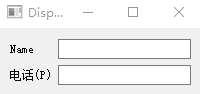
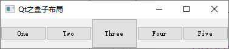
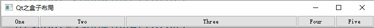

# Qt控件

## 一，按钮组(Buttons)

#### 按钮抽象基类(QAbstractButton)

##### **简介**

QAbstractButton类是按钮部件的抽象基类，提供了按钮所共有的功能。

QAbstractButton类实现了一个抽象按钮，并且让它的子类来指定如何处理用户的动作，并指定如何绘制按钮。

QAbstractButton提供了点击和勾选按钮。QRadioButton和QCheckBox类只提供了勾选按钮，QPushButton和QToolButton提供了点击按钮，如果需要的话，它们还可以提供切换行为。

任何按钮，都可以显示一个包含文本和图标的标签。

+ setText(const QString&) 设置文本

+ setIcon(const QIcon&)    设置图标


##### **信号与槽**

**signals**

+ *clicked，pressed，released信号*

```cpp
QPushButton*btn = new QPushButton("Touch Me",this);
btn->move(100,100);

//按钮按下释放之后会触发
connect(btn,&QPushButton::clicked,this,[](){qDebug()<<"clicked";});
//按钮按下触发
connect(btn,&QPushButton::pressed,this,[](){qDebug()<<"pressed";});
//按钮释放触发
connect(btn,&QPushButton::released,this,[](){qDebug()<<"released";});
```

+ *toggled信号*：每当切换按钮(toggleButton)改变其状态时，就会发出此信号。

```cpp
btn->setCheckable(true);	//设置按钮可选中
connect(btn,&QPushButton::toggled,this,[=]()
{
    qDebug()<<"toggled"<<btn->isChecked();
});
```

**slots**

+ void animateClick(int msec = 100)  定时自动点击按钮
+ void click()  自动点击按钮
+ void setIconSize(const QSize &size)  设置图标大小，较小的图标可能会设置无效
+ void setChecked(bool) 设置是否选中按钮(checkable必须被启用)
+ void toggle()  切换按钮的选中状态

##### 其他函数
| 序号 | 函数&描述                                                    |
| :--: | ------------------------------------------------------------ |
|  1   | <span style = "font-size:18px;color:rgb(0,102,0)" >int void setAutoExclusive(bool)</span><br /><span style="font-size:13px">可选中按钮是否独占， 在独占按钮组(同一父对象为同一组)中，任何时候只能选中一个按钮</span> |
|  2   | <span style = "font-size:18px;color:rgb(0,102,0)" >void setAutoRepeat(bool)</span><br /><span style="font-size:13px">如果启用，按钮按下不松开，pressed()、released()和clicked()信号会定期发出</span> |
|  3   | <span style = "font-size:18px;color:rgb(0,102,0)" >void setAutoRepeatDelay(int)</span><br /><span style="font-size:13px">如果启用了autoRepeat，那么autoRepeatDelay将定义自动重复生效前的初始延迟(以毫秒为单位)。  </span> |
|  4   | <span style = "font-size:18px;color:rgb(0,102,0)" >void setAutoRepeatInterval(int)</span><br /><span style="font-size:13px">如果启用了autoRepeat，则autoRepeatInterval定义了自动重复间隔的长度，以毫秒为单位。 </span> |
|  5   | <span style = "font-size:18px;color:rgb(0,102,0)" >void setCheckable(bool)</span><br /><span style="font-size:13px">设置按钮是否能够被选中，默认是不能被选中的</span> |
|  6   | <span style = "font-size:18px;color:rgb(0,102,0)" >void setDown(bool)</span><br /><span style="font-size:13px">设置按钮是否被按下</span> |
|  7   | <span style = "font-size:18px;color:rgb(0,102,0)" >void setIcon(const QIcon &icon)</span><br /><span style="font-size:13px">设置图标</span> |
|  8   | <span style = "font-size:18px;color:rgb(0,102,0)" >void setShortcut(const QKeySequence &key)</span><br /><span style="font-size:13px">设置快捷键</span> |
|  9   | <span style = "font-size:18px;color:rgb(0,102,0)" >void setText(const QString &text)</span><br /><span style="font-size:13px">设置文本</span> |


#### 1，按钮(PushButton)

最常用的控件之一，应用场景十分广泛。

##### 信号与槽

**signals**

`Inherits:QAbstractButton 继承自父类`

**slots**

`void showMenu()	如果有菜单，弹出菜单，否则啥也不做(这个槽貌似没啥用)`


##### 常用函数
| 序号 | 函数&描述                                                    |
| :--: | ------------------------------------------------------------ |
|  1   | <span style = "font-size:18px;color:rgb(0,102,0)" >int void setAutoDefault(bool)</span><br /><span style="font-size:13px">设为自动默认按钮，按下Enter键时会自动按下按钮</span> |
|  2   | <span style = "font-size:18px;color:rgb(0,102,0)" >void setDefault(bool)</span><br />[doc](https://blog.csdn.net/dbzhang800/article/details/6308308)<span style="font-size:13px">设为自动默认按钮，按下Enter键时会自动按下按钮</span> |
|  3   | <span style = "font-size:18px;color:rgb(0,102,0)" >void setFlat(bool)</span><br /><span style="font-size:13px">去掉按钮的边框，让PushButton按钮跟背景色融为一体，在点击按钮时，会出现原来按钮背景。  </span> |
|  4   | <span style = "font-size:18px;color:rgb(0,102,0)" >void setMenu(QMenu *menu)</span><br /><span style="font-size:13px">设置菜单。 这将把按钮变成一个菜单按钮，在某些样式中，它将在按钮文本的右侧产生一个小三角形。  </span> |

```cpp
QMenu* menu = new QMenu("Menu");
menu->addAction("大家好");
menu->addAction("我是顽石老师");

btn->setMenu(menu);
connect(menu,&QMenu::triggered,this,[=](QAction*act)
{
    btn->setText(act->text());
});
```


#### 2，工具按钮(ToolButton)

QToolButton是一个特殊的Button, 提供快速访问特定的命令或选项。与普通命令按钮不同, QToolButton通常不显示文本标签, 而是显示图标。一般用在toolBar上

##### 信号与槽

**signals**

`Inherits:QAbstractButton 继承自父类`

`void triggered(QAction *action) 按钮绑定的菜单动作被触发 ` 

**slots**

`void setDefaultAction(QAction *action)	如果有菜单，弹出菜单，否则啥也不做(这个槽貌似没啥用)`

`void setToolButtonStyle(Qt::ToolButtonStyle style) 设置工具按钮是否仅显示图标、仅显示文本，还是图标旁边/下面的文本。 `

`void showMenu()`

```cpp
QToolButton*toolbtn = new QToolButton(this);
toolbtn->move(200,100);
toolbtn->setText("hello");
//设置图标
toolbtn->setIcon(style()->standardIcon
                 (QStyle::StandardPixmap::SP_FileIcon));
//设置文字显示位置
toolbtn->setToolButtonStyle
    (Qt::ToolButtonStyle::ToolButtonTextUnderIcon);
```


##### 常用函数

| 序号 | 函数&描述                                                    |
| :--: | ------------------------------------------------------------ |
|  1   | <span style = "font-size:18px;color:rgb(0,102,0)" >int void setArrowType(Qt::ArrowType type)</span><br /><span style="font-size:13px">此属性用于保存按钮是否显示箭头而不是普通图标</span> |
|  2   | <span style = "font-size:18px;color:rgb(0,102,0)" >void setAutoRaise(bool enable)</span><br /><span style="font-size:13px">去掉边框和背景，鼠标在按钮上面时，显示选中效果，按下时有下沉效果</span> |
|  3   | <span style = "font-size:18px;color:rgb(0,102,0)" >void setMenu(QMenu *menu)</span><br /><span style="font-size:13px">设置弹出菜单  </span> |
|  4   | <span style = "font-size:18px;color:rgb(0,102,0)" >void setPopupMode(QToolButton::ToolbuttonPopupMode mode)</span><br /><span style="font-size:13px">描述如何将弹出菜单与工具按钮一起使用，默认设置为DelayedPopup </span> |

###### 弹出菜单

```cpp
QMenu*menu = new QMenu;
menu->addAction("C语言");
menu->addAction("C++");

toolbtn->setMenu(menu);
//设置弹出模式，DelayedPopup延时弹出 MenuButtonPopup在右侧显示一个箭头  InstantPopup立即弹出
toolbtn->setPopupMode(QToolButton::DelayedPopup);
//设置按钮菜单之后，右下角有一个小箭头，去掉箭头
toolbtn->setStyleSheet("QToolButton::menu-indicator {image: none;}");
```


#### 3，单选按钮(RadioButton)

QRadioButton部件提供了一个带有文本标签的单选按钮。

QRadioButton是一个可以切换选中（checked）或未选中（unchecked）状态的选项按钮。单选框通常呈现给用户一个“多选一”的选择。也就是说，在一组单选框中，一次只能选中一个单选框。

##### 信号与槽

**signals**

`Inherits:QAbstractButton 继承自父类`

**slots**

`Inherits:QAbstractButton 继承自父类`


##### 常用函数
| 序号 | 函数&描述                                                    |
| :--: | ------------------------------------------------------------ |
|  1   | <span style = "font-size:18px;color:rgb(0,102,0)" >void setCheckState(Qt::CheckState state)</span><br /><span style="font-size:13px"> 将复选框的复选状态设置为state。 如果不需要三状态支持，还可以使用QAbstractButton::setChecked()，它接受布尔值。   </span> |
|  2   | <span style = "font-size:18px;color:rgb(0,102,0)" >void setTristate(bool)</span><br /><span style="font-size:13px">该属性保存复选框是否是三状态复选框，默认为false，即复选框只有两个状态</span> |


##### 使用方法

+ 同一组(同一父对象)的单选按钮一次只能选中一个

```cpp
QRadioButton*radiobtn = new QRadioButton("男",this);
QRadioButton*radiobtn1 = new QRadioButton("女",this);
//设置默认选中
radiobtn->setChecked(true);
```


+ 同一组同时选中多个

```cpp
QGroupBox* exampleGroup = new QGroupBox("esample",this);
QLabel*label = new QLabel("你喜欢以下哪些宠物？");
exampleGroup->move(300,300);
QRadioButton *dogbtn =  new QRadioButton("狗");
QRadioButton *catbtn =  new QRadioButton("猫");
QRadioButton *snakebtn =  new QRadioButton("蛇");
QRadioButton *pigbtn =  new QRadioButton("猪");

dogbtn->setAutoExclusive(false);
catbtn->setAutoExclusive(false);
snakebtn->setAutoExclusive(false);
pigbtn->setAutoExclusive(false);

QVBoxLayout* layout = new QVBoxLayout;
layout->addWidget(label);
layout->addWidget(dogbtn);
layout->addWidget(catbtn);
layout->addWidget(snakebtn);
layout->addWidget(pigbtn);

exampleGroup->setLayout(layout);
```


+ 不同组的单选按钮可以同时选中

```cpp
QGroupBox* sexGroup = new QGroupBox("性别",this);
QGroupBox* viewpointGroup = new QGroupBox("观点",this);
sexGroup->move(200,300);
viewpointGroup->move(300,300);

QRadioButton*radiobtn = new QRadioButton("男",sexGroup);
QRadioButton*radiobtn1 = new QRadioButton("女",sexGroup);

QRadioButton*radiobtn2 = new QRadioButton("好",viewpointGroup);
QRadioButton*radiobtn3 = new QRadioButton("坏",viewpointGroup);

QHBoxLayout* sexLayout = new QHBoxLayout;
sexLayout->addWidget(radiobtn);
sexLayout->addWidget(radiobtn1);

QHBoxLayout* viewpointLayout = new QHBoxLayout;
viewpointLayout->addWidget(radiobtn2);
viewpointLayout->addWidget(radiobtn3);

sexGroup->setLayout(sexLayout);
viewpointGroup->setLayout(viewpointLayout);
```


#### 4，复选框(CheckBox)

QCheckBox提供了一个带文本标签的复选框。

QCheckBox（复选框）和QRadioButton（单选框）都是选项按钮。这是因为它们都可以在开（选中）或者关（未选中）之间切换。区别是对用户选择的限制：单选框定义了“多选一”的选择，而复选框提供的是“多选多”的选择。

尽管在技术上可以通过复选框来实现单选框的行为，反之亦然，但还是强烈建议使用众所周知的约定。

##### 信号与槽

**signals**

`Inherits:QAbstractButton 继承自父类 `

`void stateChanged(int state)` 当复选框的状态发生变化时，即当用户选中或取消选中它时，就会发出这个信号。  

**slots**

`Inherits:QAbstractButton 继承自父类`

##### 使用方法

```cpp
QGroupBox* exampleGroup = new QGroupBox(this);
exampleGroup->move(300,300);

QLabel*label = new QLabel("你喜欢以下哪些宠物？");
QCheckBox *dogbtn =  new QCheckBox("狗");
QCheckBox *catbtn =  new QCheckBox("猫");
QCheckBox *snakebtn =  new QCheckBox("蛇");
QCheckBox *pigbtn =  new QCheckBox("猪");

QVBoxLayout* layout = new QVBoxLayout;
layout->addWidget(label);
layout->addWidget(dogbtn);
layout->addWidget(catbtn);
layout->addWidget(snakebtn);
layout->addWidget(pigbtn);

exampleGroup->setLayout(layout);
```


#### 5，命令链接按钮(CommandLinkButton)


#### 6，对话框按钮盒(DialogButtonBox)

QT里面提供了QDialogButtonBox，每一个建立的Dialog对话框都会提供这个东东。

##### 信号与槽

**signals**

`Inherits:QWidget 继承自父类 `

void accepted()  接受类按钮发送的信号，如Yes，Ok...

void clicked(QAbstractButton **button*)   所有按钮点击都会发出的信号

void helpRequested()  帮助按钮发送的信号

void rejected()  拒绝类按钮发送的信号，如Cancel，Ok，Abort...

**slots**

`Inherits:QWidget 继承自父类`

+ 标准按钮的使用

```cpp
QDialogButtonBox* dialogBox = new QDialogButtonBox(Qt::Orientation::Vertical,this);
dialogBox->move(200,0);
//设置标准按钮
dialogBox->setStandardButtons(QDialogButtonBox::Ok | QDialogButtonBox::Open 
                              |QDialogButtonBox::Save| QDialogButtonBox::Cancel 
                              |QDialogButtonBox::Close | QDialogButtonBox::Discard
                              |QDialogButtonBox::Apply | QDialogButtonBox::Reset 
                              |QDialogButtonBox::RestoreDefaults | QDialogButtonBox::Help 
                              |QDialogButtonBox::SaveAll | QDialogButtonBox::Yes
                              |QDialogButtonBox::YesToAll | QDialogButtonBox::No 
                              |QDialogButtonBox::NoToAll | QDialogButtonBox::Abort 
                              |QDialogButtonBox::Retry | QDialogButtonBox::Ignore
                              |QDialogButtonBox::NoButton);
//设置尺寸约束
dialogBox->layout()->setSizeConstraint(QLayout::SetFixedSize);

connect(dialogBox,&QDialogButtonBox::accepted,[](){qDebug()<<"accepted";});
connect(dialogBox,&QDialogButtonBox::rejected,[](){qDebug()<<"rejected";});
connect(dialogBox,&QDialogButtonBox::helpRequested,[](){qDebug()<<"helpRequested";});

connect(dialogBox,&QDialogButtonBox::clicked,this,[=](QAbstractButton*button)
{
    switch (dialogBox->standardButton(button))
    {
    case QDialogButtonBox::Reset:               //重置按钮
        qDebug()<<"QDialogButtonBox::Reset";
        break;
    case QDialogButtonBox::RestoreDefaults:     //恢复默认按钮
         qDebug()<<"QDialogButtonBox::RestoreDefaults";
       break;
    case QDialogButtonBox::Discard:             //放弃按钮
         qDebug()<<"QDialogButtonBox::Discard";
        break;
    }
});
```

+ 自定义按钮

```cpp
 QDialogButtonBox*diaBox = new QDialogButtonBox(this);

QPushButton* findBtn =  diaBox->addButton("Find",QDialogButtonBox::ActionRole);
QPushButton* nextBtn = new QPushButton("Next");
QCheckBox* selectCheckBox = new QCheckBox("select");

diaBox->addButton(nextBtn,QDialogButtonBox::ActionRole);
diaBox->addButton(selectCheckBox,QDialogButtonBox::ActionRole);

diaBox->layout()->setSizeConstraint(QLayout::SetMinimumSize);

connect(diaBox,&QDialogButtonBox::clicked,this,[=](QAbstractButton*button)
{
        if(findBtn == button)
        {
            qDebug()<<"findBtn";
        }
        else if(nextBtn == button)
        {
            qDebug()<<"nextBtn";
        }
        else if(selectCheckBox == button)
        {
            qDebug()<<"selectCheckBox";
        }
        //方法2
        //if(findBtn == qobject_cast<QPushButton*>(button))
        //{
        //    qDebug()<<"findBtn";
        //}else if(nextBtn == qobject_cast<QPushButton*>(button))
        //{
        //    qDebug()<<"nextBtn";
        //}else if(selectCheckBox == qobject_cast<QCheckBox*>(button))
        //{
        //    qDebug()<<"selectCheckBox";
        //}
});
```


## 二，输入控件组(Input Widgets)

#### 1，下拉框/组合框(ComboBox)

QComboBox 是下拉列表框组件类，它提供一个下拉列表供用户选择，也可以直接当作一个 QLineEdit 用作输入。QComboBox 除了显示可见下拉列表外，每个项（item，或称列表项）还可以关联一个 QVariant 类型的变量，用于存储一些不可见数据。

##### 信号与槽

**signals**

`Inherits:QWidget 继承自父类 `

```cpp
//当用户在组合框中选择一个项目时，就会发送这个信号。注意，即使选择没有改变，这个信号也会被发送(选择了和原来一样的)
void activated(const QString &text)
void activated(int index)
void textActivated(const QString &text)
    
//用户交互或编程改变组合框中的currentIndex时，都会发送此信号。    
void currentIndexChanged(const QString &text)
void currentIndexChanged(int index)  
void currentTextChanged(const QString &text)
    
//当组合框的行编辑小部件中的文本发生更改时，将发出此信号。    
void editTextChanged(const QString &text)

//当用正在选择组合框弹出列表中的项目时，就会发送此信号(传送高亮显示的文本或下标)。  
void highlighted(const QString &text)
void highlighted(int index)
void textHighlighted(const QString &text)
```

**slots**

`Inherits:QWidget 继承自父类`

```cpp
void clear()
void clearEditText()
void setCurrentIndex(int index)
void setCurrentText(const QString &text)
void setEditText(const QString &text)
```

##### 基本使用

+ 城市选择

```cpp
    citySelectBox = new QComboBox(this);
    citySelectBox->move(200,100);

    citySelectBox->addItem("河北省");
    citySelectBox->addItem("山西省");
    citySelectBox->addItem("辽宁省");
    QStringList provinces;
    provinces<<"吉林省"<<"黑龙江省"<<"江苏省"<<"浙江省"<<"安徽省"
            <<"福建省"<<"江西省"<<"山东省"<<"河南省"<<"湖北省"
            <<"湖南省"<<"广东省"<<"海南省"<<"四川省"<<"贵州省"<<"云南省"<<"陕西省"<<"甘肃省"<<"青海省"<<"台湾省"
            <<"内蒙古自治区"<<"广西壮族自治区"<<"西藏自治区"<<"宁夏回族自治区"<<"新疆维吾尔自治区"
            <<"北京市"<<"天津市"<<"上海市"<<"重庆市"
            <<"香港特别行政区"<<"澳门特别行政区";
    citySelectBox->addItems(provinces);

    //当用户在组合框中选择一个项目时，就会发送这个信号。注意，即使选择没有改变，这个信号也会被发送(选择了和原来一样的)
   connect(citySelectBox,QOverload<int>::of(&QComboBox::activated),this,[](){qDebug()<<"activated(int)";});
//connect(citySelectBox,QOverload<const QString&>::of(&QComboBox::activated),this,[](){qDebug()<<"activated(cosnt Qstring&)";});

//用户交互或编程改变组合框中的currentIndex时，都会发送此信号。 //connect(citySelectBox,QOverload<int>::of(&QComboBox::currentIndexChanged),this,[](){qDebug()<<"currentIndexChanged(int)";});
    //connect(citySelectBox,QOverload<const QString&>::of(&QComboBox::currentIndexChanged),this,[](){qDebug()<<"currentIndexChanged(cosnt Qstring&)";});

//当currentText发生变化时，就会发送这个信号。 新值作为文本传递。
//connect(citySelectBox,&QComboBox::currentTextChanged,this,[](){qDebug()<<"currentTextChanged";});
    //connect(citySelectBox,QOverload<int>::of(&QComboBox::highlighted),this,[](){qDebug()<<"highlighted(int)";});
//connect(citySelectBox,QOverload<const QString&>::of(&QComboBox::highlighted),this,[](){qDebug()<<"highlighted(const QString&)";});

//connect(citySelectBox,&QComboBox::textActivated,this,[](){qDebug()<<"textActivated";});
//connect(citySelectBox,&QComboBox::textHighlighted,this,[](){qDebug()<<"textHighlighted";});
```

+ 当作一个 QLineEdit 用作输入

```cpp
citySelectBox->setEditable(true);	//让下拉框可以编辑
connect(citySelectBox,&QComboBox::editTextChanged,this,[](){qDebug()<<"editTextChanged";});
//返回用于编辑组合框中的项目的行编辑，如果没有行编辑，则返回nullptr
citySelectBox->lineEdit();
```

+ 用户数据

```cpp
//城市和区号
QMap<QString,int>  citys;
citys.insert("北京",10);
citys.insert("上海",21);
citys.insert("天津",22);
citys.insert("大连",411);
citys.insert("锦州",416);
citys.insert("徐州",516);
citys.insert("福州",591);
citys.insert("青岛",532);

for(const QString& city : citys.keys())
{
   citySelectBox->addItem(city,citys.value(city));
}
//当currentText发生变化时，就会发送这个信号。 新值作为文本传递。
connect(citySelectBox,&QComboBox::currentTextChanged,this,[=](const QString& str)
{
   qDebug()<<str+"+"+citySelectBox->currentData().toString();
});
```


#### 2，字体下拉框(FontComboBox)

```cpp
QLabel *label  = new QLabel("测试文本 Are you ok?",this);

QFontComboBox* fontBox = new QFontComboBox(this);
fontBox->setMinimumWidth(250);

connect(fontBox,&QFontComboBox::currentFontChanged,this,[=](const QFont&f)
{
     QFont fo =f;
     fo.setPixelSize(50);
     label->setFont(fo);
});
```


#### 3，行编辑器(LineEdit)

##### 信号与槽

**signals**

`Inherits:QAbstractButton 继承自父类`

```cpp
void clear()					//清除行编辑的内容
void copy() const				//将选中的文本复制到剪贴板(如果有的话)，并且echoMode()是Normal
void cut()						//剪切
void paste()					//粘贴
void redo()						//撤销
void selectAll()				//选中所有
void setText(const QString &)
void undo()						//反撤销
```

**slots**

`void showMenu()	如果有菜单，弹出菜单，否则啥也不做(这个槽貌似没啥用)`

```cpp
//这个信号在光标移动时发出。前一个位置由oldPos给出，新位置由newPos给出
void cursorPositionChanged(int oldPos, int newPos)
//编辑完成，按下Return或Enter键或行编辑失去焦点时将发出此信号
void editingFinished()
//当用户按下一个不被认为是可接受输入的键时，就会发出这个信号。 例如，如果一个按键导致验证器的validate()调用返回Invalid。 另一种情况是试图输入超过行编辑的最大长度的字符。    
void inputRejected()
//编不编辑，当按下Return或Enter键时都发出此信号，失去焦点不会发
void returnPressed()
//这个信号在选择改变时发出  
void selectionChanged()
//每当文本发生变化时，就会发出这个信号。与texttedited()不同，调用setText()改变文本，此信号也会发出。  
void textChanged(const QString &text)
//只要文本被编辑，就会发出这个信号。     
void textEdited(const QString &text)
```

##### 设置显示模式

```cpp
edit->setEchoMode(QLineEdit::EchoMode::Password);
QLineEdit::Normal				//显示输入的字符，这是默认值。  
QLineEdit::NoEcho				//不要显示任何东西
QLineEdit::Password				//显示与平台相关的密码掩码字符，而不是实际输入的字符。  
QLineEdit::PasswordEchoOnEdit	//在编辑时显示已输入的字符，完成显示掩码字符
    
edit->setClearButtonEnabled(true);	//启用清除按钮
```


##### 设置输入掩码

| 掩码字符  | 含义                 |
| ---- | -------------------------------------------------------- |
| A   | ASCII字母字符是必须的，A-Z，a-z                |
| a   | ASCII 字母字符是允许的但不是必须的                      |
| N   | ASCII字母字符是必须的，A-Z，a-z， 0-9               |
| n  | ASCII 字母字符是允许的但不是必须的                      |
| X  | 任何字符都可以，是必须需要的                            |
| x  | 任何字符都允许的，但不是必须需要的                      |
| 9  | ASCII 数字是必须要的，0-9                              |
| 0  | ASCII 数字是允许的，但不是必须要的                      |
| D  | ASCII  数字是必须要的，1-9                             |
| d  | ASCII 数字是允许的，但不是必须要的   |
| #  | ASCII 数字是或加减符号允许的，但不是必须要的            |
| H  | 十六进制数据字符是必须要的，A-F, a-f, 0-9              |
| h  | 十六进制数据字符是允许的，但不是必须要的                |
| B  | 二进制数据字符是必须要的，0-1                         |
| b  | 二进制数据字符是允许的，但不是必须要的                  |
| >  | 所有的字符字母都都大写的                                |
| <  | 所有的字符字幕都是小写的                                |
| !  | 关闭大小写                                              |
| ;c | 终止输入掩码并将空白字符设置为c |
| \  | 使用 `\` 去转义上面的字符，如果再需要显示上述字符的时候 |

+ 输入日期

```cpp
edit->setText(QDate::currentDate().toString("yyyy-MM-dd"));
edit->setInputMask("9999-99-99");
```

+ 输入秘钥

```cpp
edit->setInputMask(">AAAAA-AAAAA-AAAAA-AAAAA-AAAAA");
```


##### 设置验证器

+ 只能输入整数

```cpp
edit->setValidator(new QIntValidator(-90,90,this));
```

+ 只能输入浮点数，但是浮点数验证器不能限制范围，可以随便输入

```cpp
edit->setValidator(new QDoubleValidator(-90.0,90.0,3,this));
```

##### 添加动作

```cpp
void QLineEdit::addAction(QAction *action, QLineEdit::ActionPosition position)
QAction *QLineEdit::addAction(const QIcon &icon, QLineEdit::ActionPosition position)
```

```cpp
QLineEdit *edit = new QLineEdit(this);
edit->addAction(QIcon("://images/user.png"),QLineEdit::ActionPosition::LeadingPosition);
QAction *delAct = edit->addAction(QIcon("://images/delete.png"),QLineEdit::ActionPosition::TrailingPosition);
connect(delAct,&QAction::triggered,[]()
{
    qDebug()<<"delAct";
});
```


##### 设置自动补全

`QCompleter`自动补全类

```cpp
QLineEdit* edit = new QLineEdit(this);

QStringList list;
list<<"hello"<<"have"<<"been"<<"你好"<<"湖南"<<"湖北";
QCompleter *completer = new QCompleter(list,this);
edit->setCompleter(completer);
```


#### 4，文本编辑器(TextEdit)

QTextEdit类提供了一个小部件，用于编辑和显示纯文本和富文本。  

##### 信号与槽

**signals**

`Inherits:QAbstractButton 继承自父类`

```cpp
//当在文本编辑中选择或取消选择文本时，将发出此信号。可以使用copy()将所选内容复制到剪贴板
void copyAvailable(bool yes)
//当前字符格式发生了变化，例如由于光标位置的变化而引起，则会发出此信号。      
void currentCharFormatChanged(const QTextCharFormat &f)
//当光标的位置改变时，就会发出这个信号    
void cursorPositionChanged()
//当重做操作变得可用(可用为true)或不可用(可用为false)时，就会发出此信号。      
void redoAvailable(bool available)
//这个信号在选择改变时发出。      
void selectionChanged()
//当文档的内容发生变化时，就会发出这个信号; 例如，当插入或删除文本时，或者当应用格式化时  
void textChanged()
//当撤销操作变得可用(可用为true)或不可用(可用为false)时，将发出此信号。      
void undoAvailable(bool available)
```

**slots**

```cpp
void append(const QString &text)	//将带有文本的新段落追加到文本编辑的末尾
void clear()						//删除文本编辑中的所有文本
void copy()							//复制选中文本到粘贴板
void cut()							//剪切选中的文本
void insertHtml(const QString &text)//方便槽，在当前光标位置插入假定为html格式的文本。  
void insertPlainText(const QString &text)//在当前光标位置插入文本的方便槽
void paste()						//粘贴
void redo()							//重做
void scrollToAnchor(const QString &name)
void selectAll()					//选择所有文本
void setAlignment(Qt::Alignment a)	//将当前段落的对齐方式设置为a。
void setCurrentFont(const QFont &f)	//设置当前格式的字体为f。
void setFontFamily(const QString &fontFamily)//将当前格式的字体族设置为fontFamily
void setFontItalic(bool italic)
void setFontPointSize(qreal s)
void setFontUnderline(bool underline)
void setFontWeight(int weight)
void setHtml(const QString &text)
void setMarkdown(const QString &markdown)
void setPlainText(const QString &text)	//将文本编辑的文本更改为字符串文本
void setText(const QString &text)		//设置文本编辑的文本。 文本可以是纯文本或HTML，文本编辑将尝试猜测正确的格式。 直接使用setHtml()或setPlainText()来避免文本编辑的猜测。  
void setTextBackgroundColor(const QColor &c)
void setTextColor(const QColor &c)
void undo()								//撤销
void zoomIn(int range = 1)				//放大文本
void zoomOut(int range = 1)				//缩小文本
```

##### 插入图片

+ 单击按钮选择图片，并添加

```cpp
 connect(addImgBtn,&QPushButton::clicked,this,[=]()
    {
        QString fileName = QFileDialog::getOpenFileName(this,"选择图片","./","IMG(*.jpg *.png)");
        if(!fileName.isEmpty())
        {
            QUrl url(fileName);
            QImage image = QImageReader(fileName).read();
            textEdit->document()->addResource(QTextDocument::ImageResource,url,image);

            QTextImageFormat imgformat;
            imgformat.setName(url.toString());
            imgformat.setWidth(textEdit->width());
            imgformat.setHeight(textEdit->height());

            textEdit->textCursor().insertImage(imgformat);
        }
    });
```

+ 图片/文本文件拖拽

```cpp
class MyTextEdit:public QTextEdit
{
public:
    using QTextEdit::QTextEdit;

protected:
    bool canInsertFromMimeData(const QMimeData *source) const override;
    void insertFromMimeData(const QMimeData *source) override;
};
bool MyTextEdit::canInsertFromMimeData(const QMimeData *source) const
{
    return source->hasImage() || source->hasUrls() || QTextEdit::canInsertFromMimeData(source);
}

void MyTextEdit::insertFromMimeData(const QMimeData *source)
{
    //有图像可以直接加载
    if (source->hasImage())
    {
           static int i = 1;
           QUrl url(QString("dropped_image_%1").arg(i++));
           QImage image(qvariant_cast<QImage>(source->imageData()));
           if (!image.isNull())
           {
                  document()->addResource(QTextDocument::ImageResource, url, image);
                  textCursor().insertImage(url.toString());
           }
    }
    //没有图像，但是有链接，自己分析链接进行处理
    else if (source->hasUrls())
    {
           foreach (QUrl url, source->urls())
           {
               QFileInfo info(url.toLocalFile());
               //如果是图片
               if (QImageReader::supportedImageFormats().contains(info.suffix().toLower().toLocal8Bit()))
               {
                   QImage image(info.filePath());
                   if (!image.isNull())
                   {
                          document()->addResource(QTextDocument::ImageResource, url, image);
                          textCursor().insertImage(url.toString());
                   }
               }
               //其他的文件就把数据读出来，添加到textedit当前光标位置
               else
               {
                   QFile file(url.toLocalFile());
                   if (file.open(QIODevice::ReadOnly | QIODevice::Text))
                       textCursor().insertText(file.readAll());
               }
           }
    }
    //都不是交给父类处理
    else
    {
        QTextEdit::insertFromMimeData(source);
    }
}
```


#### 5，普通文本编辑器(PlainTextEdit)

QPlainTextEdit类提供了一个小部件，用于编辑和显示纯文本。  

#### 6，旋转盒(微调框)(SpinBox)

QSpinBox 用于整数的显示和输入，一般显示十进制数，也可以显示二进制、十六进制的数，而且可以在显示框中增加前缀或后缀。

##### 信号与槽

**signals**

`Inherits:QAbstractButton 继承自父类`

```cpp
void textChanged(const QString &text)	//text包含前缀和后缀
void valueChanged(int i)				//i只有值
```

**slots**

`void showMenu()	如果有菜单，弹出菜单，否则啥也不做(这个槽貌似没啥用)`

```cpp
void setValue(int val)
```

##### 基本使用

```cpp
QDoubleSpinBox* dbSpinBox = new QDoubleSpinBox;
dbSpinBox->setRange(0,100.0);   //设置范围
dbSpinBox->setValue(1.2);       //设置值
dbSpinBox->setPrefix("￥");     //设置前缀
dbSpinBox->setSuffix(" 元");    //设置后缀
dbSpinBox->setDecimals(2);      //设置浮点型精度
//dbSpinBox->setStepType(QDoubleSpinBox::StepType::AdaptiveDecimalStepType);    //自适应步长
dbSpinBox->setSingleStep(0.1);  //设置步长

connect(dbSpinBox,&QDoubleSpinBox::textChanged,this,[=](const QString&text){qDebug()<<text;});

   connect(dbSpinBox,QOverload<double>::of(&QDoubleSpinBox::valueChanged),this,[=](double d){qDebug()<<d;});
//这个已经被弃用了
connect(dbSpinBox,QOverload<const QString&>::of(&QDoubleSpinBox::valueChanged),this,[](){});
```


#### 7，浮点型微调框(DoubleSpinBox)

见上面

#### 8，时间编辑器(TimeEdit)

#### 9，日期编辑器(DateEdit)

#### 10，日期/时间编辑器(DateTimeEdit)

QDateTimeEdit允许用户使用键盘或方向键来编辑日期和时间值，以增加和减少日期和时间值

##### 信号与槽

**signals**

`Inherits:QAbstractButton 继承自父类`

```cpp
void dateChanged(const QDate &date)
void dateTimeChanged(const QDateTime &datetime)
void timeChanged(const QTime &time)
```

**slots**

`void showMenu()	如果有菜单，弹出菜单，否则啥也不做(这个槽貌似没啥用)`

```cpp
void setDate(const QDate &date)
void setDateTime(const QDateTime &dateTime)
void setTime(const QTime &time)
```

##### 基本用法

```cpp
QDateTimeEdit *dateEdit = new QDateTimeEdit(QDate::currentDate());
QDateTimeEdit *timeEdit = new QDateTimeEdit(QTime::currentTime());
QDateTimeEdit *dateTimeEdit = new QDateTimeEdit(QDateTime::currentDateTime());

//设置日历弹出
dateEdit->setCalendarPopup(true);
timeEdit->setCalendarPopup(true);           //只有时间不会出现弹出日历选择窗口
dateTimeEdit->setCalendarPopup(true);
//设置显示格式
dateEdit->setDisplayFormat("yyyy/MM/dd");
timeEdit->setDisplayFormat("hh:mm:ss");
dateTimeEdit->setDisplayFormat("yyyy-MM-dd");


QHBoxLayout*layout = new QHBoxLayout;
layout->addWidget(dateEdit);
layout->addWidget(timeEdit);
layout->addWidget(dateTimeEdit);
setLayout(layout);
```

#### 11，QAbstractSlider

###### 信号与槽

**signals**

```cpp
void actionTriggered(int action)		//当触发滑块动作时会发出此信号 SliderAction
void rangeChanged(int min, int max)		//调用setRange(min,max)时会发出此信号
void sliderMoved(int value)				//拖动滑块时发出
void sliderPressed()//鼠标按下滑块时或在调用 setSliderDown(true) 时发出此信号。
void sliderReleased()//鼠标释放滑块时或在调用 setSliderDown(false) 时发出此信号。
void valueChanged(int value)//当滑块的值发生变化时，这个信号就会发出
```

**slots**

```cpp
void setOrientation(Qt::Orientation)
void setRange(int min, int max)
void setValue(int)
```

###### 公有函数

| 序号 | 函数&描述                                                    |
| :--: | ------------------------------------------------------------ |
|  1   | <span style = "font-size:18px;color:rgb(0,102,0)" >void setInvertedAppearance(bool)</span><br /><span style="font-size:13px"> 设置是否翻转最大值和最小值，如果此属性为false(默认值)，则最小值和最大值将显示在继承的小部件的经典位置。 如果该值为true，则最小值和最大值出现在相反的位置。   </span> |
|  2   | <span style = "font-size:18px;color:rgb(0,102,0)" >void setInvertedControls(bool)</span><br /><span style="font-size:13px">此属性保存滑块是否反转其滚轮和键事件。默认为true</span> |
|  3   | <span style = "font-size:18px;color:rgb(0,102,0)" >void setMaximum(int)</span><br /><span style="font-size:13px">设置最大值</span> |
|  4   | <span style = "font-size:18px;color:rgb(0,102,0)" >void setMinimum(int)</span><br /><span style="font-size:13px">设置最大值</span> |
|  5   | <span style = "font-size:18px;color:rgb(0,102,0)" >void setPageStep(int)</span><br /><span style="font-size:13px">PageUp and PageDown步长</span> |
|  6   | <span style = "font-size:18px;color:rgb(0,102,0)" >void setSingleStep(int)</span><br /><span style="font-size:13px">设置步长，按箭头滑块会变化多少数值</span> |
|  7   | <span style = "font-size:18px;color:rgb(0,102,0)" >void setSliderDown(bool)</span><br /><span style="font-size:13px">此属性保持滑块是否按下。</span> |
|  8   | <span style = "font-size:18px;color:rgb(0,102,0)" >void setSliderPosition(int)</span><br /><span style="font-size:13px">设置滑块的位置  如果启用了跟踪(默认)，这与value相同。</span> |
|  9   | <span style = "font-size:18px;color:rgb(0,102,0)" >void setTracking(bool enable)</span><br /><span style="font-size:13px">此属性保存是否启用滑块跟踪 。如果启用跟踪(默认)，滑块在被拖动时将发出valueChanged()信号。 如果禁用跟踪，滑块只有在用户释放滑块时才会发出valueChanged()信号。</span> |

##### 11.1，仪表盘(Dial)

###### 信号与槽

**signals**

`继承自QAbstractSlider`

**slots**

```cpp
void setNotchesVisible(bool visible)		//设置是否显示刻度
void setWrapping(bool on)					//此属性保存是否启用包装,如果为 true，则启用包装； 否则会在表盘底部插入一些空格以分隔有效值范围的两端。如果为true，箭头可以在表盘上的任何角度定向。
```


###### 公有函数

| 序号 | 函数&描述                                                    |
| :--: | ------------------------------------------------------------ |
|  1   | <span style = "font-size:18px;color:rgb(0,102,0)" >void setNotchTarget(double target)</span><br /><span style="font-size:13px">设置刻度之间的目标像素数，实际尺寸可能与目标尺寸不同。   </span> |


##### 11.2，滚动条(ScrollBar)

 

##### 11.3，滑块(Slider)

###### 公有函数

| 序号 | 函数&描述                                                    |
| :--: | ------------------------------------------------------------ |
|  1   | <span style = "font-size:18px;color:rgb(0,102,0)" >void setTickInterval(int ti)</span><br /><span style="font-size:13px">设置存刻度线之间的间隔   </span> |
|  2   | <span style = "font-size:18px;color:rgb(0,102,0)" >void setTibkPosition(QSlider::TickPosition *position*)</span><br /><span style="font-size:13px">设置刻度之间的目标像素数，实际尺寸可能与目标尺寸不同。   </span> |

#### 14，键序列编辑器(KeySequenceEdit)

###### 信号与槽

**signals**

```cpp
void editingFinished()
void keySequenceChanged(const QKeySequence &keySequence)
```

**slots**

```cpp
void clear()											//清除键序列
void setKeySequence(const QKeySequence &keySequence)	//设置键序列
```

##### 14.1 QKeySequence


## 三，显示控件组(Display Widgets)

#### 1，标签(Label)

QLabel小部件提供文本或图像显示

###### 信号与槽

**signals**

```cpp
//当用户点击链接时会发出此信号。
void linkActivated(const QString &link)
//当用户将鼠标悬停在链接上时会发出此信号。    
void linkHovered(const QString &link)
```

**slots**

```cpp
void clear()
void setMovie(QMovie *movie)
void setNum(double num)
void setNum(int num)
void setPicture(const QPicture &picture)
void setPixmap(const QPixmap &)
void setText(const QString &)
```

###### 公有函数
| 序号 | 函数&描述                                                    |
| :--: | ------------------------------------------------------------ |
|  1   | <span style = "font-size:18px;color:rgb(0,102,0)" >void setAlignment(*Qt::Alignment*)</span><br /><span style="font-size:13px">设置对齐方式   </span> |
|  2   | <span style = "font-size:18px;color:rgb(0,102,0)" >void setBuddy(QWidget **buddy*)</span><br /><span style="font-size:13px">将此标签的好友设置为buddy。当用户按下此标签指示的快捷键时，键盘焦点将转移到标签的好友小部件。伙伴机制仅适用于包含文本的 QLabel，其中一个字符以与号“&”为前缀。  </span> |
|  3   | <span style = "font-size:18px;color:rgb(0,102,0)" >void setIndent(*int*)</span><br /><span style="font-size:13px">设置label的文本缩进，以像素为单位   </span> |
|  4   | <span style = "font-size:18px;color:rgb(0,102,0)" >void setMargin(*int*)</span><br /><span style="font-size:13px">设置边距     </span> |
|  5   | <span style = "font-size:18px;color:rgb(0,102,0)" >void setOpenExtrenalLinks(*bool open*)</span><br /><span style="font-size:13px">设置是否自动打开超链接   </span> |
|  6   | <span style = "font-size:18px;color:rgb(0,102,0)" >void setScaledContents(*bool*)</span><br /><span style="font-size:13px">设置内容缩放，确定标签是否将其内容缩放以填充所有可用空间。    </span> |
|  7   | <span style = "font-size:18px;color:rgb(0,102,0)" >void setSelection(*int start,int len*)</span><br /><span style="font-size:13px">设置对齐方式   </span> |
|  8   | <span style = "font-size:18px;color:rgb(0,102,0)" >void setTextFormat(*Qt::TextFormat*)</span><br /><span style="font-size:13px">设置标签文本格式   </span> |
|  9   | <span style = "font-size:18px;color:rgb(0,102,0)" >void setTextInteractionFlags(*Qt::TextInteractionFlags flag*)</span><br /><span style="font-size:13px">设置对齐方式   </span> |
|  10  | <span style = "font-size:18px;color:rgb(0,102,0)" >void setWordWrap(*bool on*)</span><br /><span style="font-size:13px">设置是否在需要时自动换行   </span> |

###### Example:

+ 显示文本

```cpp
QLabel* label = new QLabel("我是萌萌哒的小可爱",this);
label->setAlignment(Qt::AlignmentFlag::AlignCenter);
label->setFixedWidth(100);  //设置固定的宽度
label->setWordWrap(true);   //当文本超过固定的宽度之后，自动换行
```

+ 设置超链接：QLabel支持html文本

```cpp
label->setText("<a href=\"www.baidu.com\">百度一下</a>");
connect(label,&QLabel::linkHovered,this,[=](const QString& link){qDebug()<<"linkHovered"<<link;});    
connect(label,&QLabel::linkActivated,this,[=](const QString& link){qDebug()<<"linkActivated"<<link;});
//设置自动打开超链接，而不是发出信号自己处理，这个设置之后会自动在浏览器打开连接
label->setOpenExternalLinks(true);
```

+ 设置伙伴

```cpp
QLabel* nameLabel = new QLabel("&Name",this);   
QLineEdit * nameEdit = new QLineEdit;           
nameLabel->setBuddy(nameEdit);                  
                                                
QLabel* phoneLabel = new QLabel("电话(&P)",this); 
QLineEdit* phoneEdit = new QLineEdit;           
phoneLabel->setBuddy(phoneEdit);                
                                                
QGridLayout* layout = new QGridLayout;          
layout->addWidget(nameLabel,0,0);               
layout->addWidget(nameEdit,0,1);                
layout->addWidget(phoneLabel,1,0);              
layout->addWidget(phoneEdit,1,1);               
                                                
setLayout(layout);                              
```



+ 显示图片

```cpp
QLabel* label = new QLabel(this);
label->setPixmap(QPixmap("://images/label_img.jpg"));
//如上所示，显示的图片是固定的大小，如何让图片按我们想要的大小显示呢？
//1，设置Label的大小，如果有布局，会随着布局动态变化
label->setFixedSize(340,180);
//2，设置内容缩放
label->setScaledContents(true);
```

+ 显示Gif动图

```cpp
QLabel* label = new QLabel(this);
QMovie *movie = new QMovie("F:/MyCode/QtCode/QtCourse/DisplayWidgets/images/label_gif.gif");
label->setMovie(movie);
movie->start();
```


#### 2，文本浏览(TextBrowser)

#### 3，日历控件(CalendarWidget)

#### 4，数码管(LCDNumber)

###### 信号与槽

**signals**

```cpp
//每当要求 QLCDNumber 显示过大的数字或过长的字符串时，就会发出此信号。
//小数一般不会越界，可以用科学计数法表示
void overflow()
```

**slots**

```cpp
void display(double num)		//显示数字num
void display(int num)			//显示数字num
void display(const QString &s)	//显示由字符串 s 表示的数字。
void setBinMode()		//为调用setMode(Bin)提供方便
void setDecMode()
void setHexMode()
void setOctMode()
void setSmallDecimalPoint(bool)	//该属性保存小数点的样式，独占一位还是，夹在数字中间
```

###### 共有函数

| 序号 | 函数&描述                                                    |
| :--: | ------------------------------------------------------------ |
|  1   | <span style = "font-size:18px;color:rgb(0,102,0)" >void setDigitCount(int numDigits)</span><br /><span style="font-size:13px"> 设置显示的位数 </span> |
|  2   | <span style = "font-size:18px;color:rgb(0,102,0)" >void setMode(QLCDNumber::Mode)</span><br /><span style="font-size:13px"> 设置显示的数字模式(进制) </span> |
|  3   | <span style = "font-size:18px;color:rgb(0,102,0)" >void setSegmentStyle(QLCDNumber::SegmentStyle)</span><br /><span style="font-size:13px"> 设置数码管段的样式 </span> |

###### Example

```cpp
QLCDNumber *lcdNumber = new QLCDNumber(this);
lcdNumber->resize(300,100);
lcdNumber->setSmallDecimalPoint(true);
lcdNumber->display(5.202);
//下图：setSmallDecimalPoint(false) 左，也是默认   
```


+ 设置样式

```cpp
void setSegmentStyle(QLCDNumber::SegmentStyle)
Outline			用背景色填充凸起部分	(有立体感)
Filled(default) 用前景色填充凸起部分  (有立体感)
Flat			用前景色填充平面段    (无立体感)
```


#### 5，进度条(ProgressBar)

###### 信号与槽

**signals**

```cpp
void valueChanged(int value)
```

**slots**

```cpp
void reset()				//重置进度条
void setMaximum(int maximum)
void setMinimum(int minimum)
void setOrientation(Qt::Orientation)
void setRange(int minimum, int maximum)
void setValue(int value)
```

###### 公有函数

| 序号 | 函数&描述                                                    |
| :--: | ------------------------------------------------------------ |
|  1   | <span style = "font-size:18px;color:rgb(0,102,0)" >void resetFormat()</span><br /><span style="font-size:13px"> 重置格式为%p% </span> |
|  2   | <span style = "font-size:18px;color:rgb(0,102,0)" >void setAlignment(Qt::Alignment *alignment*)</span><br /><span style="font-size:13px"> 设置进度条上文字的对齐方式 </span> |
|  3   | <span style = "font-size:18px;color:rgb(0,102,0)" >void setFormat(const QString &*format*)</span><br /><span style="font-size:13px"> 设置进度条上文字的显示格式 </span> |
|  4   | <span style = "font-size:18px;color:rgb(0,102,0)" >void setInvertedAppearance(bool *invert*)</span><br /><span style="font-size:13px"> 设置外观反向 </span> |
|  5   | <span style = "font-size:18px;color:rgb(0,102,0)" >void setTextDirection(QProgressBar::Direction *textDirection*)</span><br /><span style="font-size:13px"> 设置文字的方向 </span> |
|  6   | <span style = "font-size:18px;color:rgb(0,102,0)" >void setTextVisible(bool *visible*)</span><br /><span style="font-size:13px"> 设置文字是否显示 </span> |

###### Example

+ 创建进度条并设置范围

```cpp
QProgressBar *progressBar = new QProgressBar(this);
progressBar->setRange(0,100);
progressBar->setValue(20);
```

+ 设置文字

```cpp
progressBar->setTextVisible(true);	//显示文字(默认就是显示的)
progressBar->setAlignment(Qt::AlignmentFlag::AlignCenter);
progressBar->setFormat("%p%");		//20%
progressBar->setFormat("%vM/%mM");	//20M/100M
/*占位符：
%p - 被完成的百分比取代。 
%v - 被当前值替换。 
%m - 由总步数代替。
默认值为“%p%”。
*/
```


## 四，容器组(Containers)

#### 1，分组框(GroupBox)

##### 信号与槽

**signals**

```cpp
void clicked(bool checked = false)
void toggled(bool on)
```

**slots**

```cpp
void setChecked(bool checked)
```

#### 2，滚动区域(ScrollArea)

滚动区域用于在框架中显示子部件的内容。 如果小部件超出了框架的大小，视图可以提供滚动条，以便查看子小部件的整个区域。  

+ 通过以下函数把widget设置给滚动区域

```cpp
void setWidget(QWidget *widget)
```


#### 3，工具盒子(ToolBox)

工具箱是一个小部件，它将一列选项卡显示在另一列的上方，当前项显示在当前选项卡的下方。 每个制表符在制表符列中有一个索引位置。 每一项都是一个QWidget

##### 信号与槽

**signals**

```cpp
void currentChanged(int index)
```

**slots**

```cpp
void setCurrentIndex(int index)
void setCurrentWidget(QWidget *widget)
```


#### 4，标签控件(TabWidget)

##### 信号与槽

**signals**

```cpp
void currentChanged(int index)
void tabBarClicked(int index)
void tabBarDoubleClicked(int index)
void tabCloseRequested(int index)
```

**slots**

```cpp
void setCurrentIndex(int index)
void setCurrentWidget(QWidget *widget)
```


#### 5，堆叠控件(StackedWidget)

##### 信号与槽

**signals**

```cpp
void currentChanged(int index)
void widgetRemoved(int index)
```

**slots**

```cpp
void setCurrentIndex(int index)
void setCurrentWidget(QWidget *widget)
```


#### 6，多文档界面区域(MDI Area)

QMdiArea（Multiple Document Interface Area）提供了一个可以同时显示多个文档窗口的区域。

本质上来说，QMdiArea就像是多文档窗口的窗口管理器。例如，它将它所管理的窗口绘制在它上面，并且以级联或者平铺的方式放置这些窗口。通常情况下，QMdiArea用作QMainWindow的中心控件，以此来创建一个MDI应用程序。但是，它也可以被放置在任何布局类中。

QMdiArea支持所有的窗口标志，只要这些窗口标志被当前控件样式支持。

##### 信号与槽

**signals**

```cpp
//特定子窗口被激活时触发，参数为当前激活的QMdiSubWindow指针
void subWindowActivated(QMdiSubWindow *window)
```

**slots**

```cpp
void activateNextSubWindow()					//激活下一个窗口
void activatePreviousSubWindow()				//激活上一个窗口
void cascadeSubWindows()						//级联排列所有子窗口
void closeActiveSubWindow()						//关闭活动窗口
void closeAllSubWindows()						//关闭所有窗口
void setActiveSubWindow(QMdiSubWindow *window)	//激活指定的窗口
void tileSubWindows()							//平铺排列所有子窗口
```

##### 添加子窗口

QMdiArea中的子窗口是QMdiSubWindow的实例化对象。通过调用addSubWindow来将他们加入MDI区域。通常情况下是传递一个QWidget作为内部控件给这个函数。但是直接传递QMdiSubWindow也是可以的。

```cpp
auto *w1 = new QWidget;
auto *w2 = new QWidget;
auto *w3 = new QWidget;
w1->setWindowTitle("w1");
w2->setWindowTitle("w2");
w3->setWindowTitle("w3");

mdiArea->addSubWindow(w1);
mdiArea->addSubWindow(w2);
mdiArea->addSubWindow(w3);
```

##### 设置背景颜色

```cpp
mdiArea->setBackground(Qt::gray);
```

##### 设置视图模式

有两种视图模式，可以通过setViewMode来设置。

| 常量                    | 值   | 描述                                 |
| ----------------------- | ---- | ------------------------------------ |
| QMdiArea::SubWindowView | 0    | 显示带有窗口框架的子窗口（默认）。   |
| QMdiArea::TabbedView    | 1    | 在选项卡栏中显示带有选项卡的子窗口。 |

在QMdiArea::TabbedView模式下，setTabPositon、setTabShape、setTabClosable、setTabsMovable等标签栏相关函数可用


#### 7，QAxWidget

QAxWidget类是一个包装ActiveX控件的QWidget。


## 五，布局管理组(Layouts)

什么是布局管理器？你一个窗口里面一般有很多widgets对吧，你如果要自己调它们的位置，大小的话会比较麻烦，而且当窗口变大的时候它里面的widgets又不会跟着变大，就很烦恼。所以，我们有这个东西，布局管理器，相当于一个小管家，你只要把widgets丢进去，他自己会帮你排好它的。

**方法：**

首先，创建好我们想要布局的widgets。 

然后，我们创建 QBoxLayout 对象并将小部件添加到布局中。 

最后，我们调用 QWidget::setLayout() 将 QBoxLayout 对象安装到小部件上。

此时，布局中的小部件将重新设置父对象，为上面调用setLayout()的窗口。

#### 1，盒子布局

QBoxLayout可以在水平方向或垂直方向上排列控件，分别派生了QHBoxLayout、QVBoxLayout子类。

QHBoxLayout：水平布局，在水平方向上排列控件，即：左右排列。
		QVBoxLayout：垂直布局，在垂直方向上排列控件，即：上下排列。

水平布局、垂直布局除了构造时的方向（LeftToRight、TopToBottom）不同外，其它均相同。

##### 公有函数

| 序号 | 函数&描述                                                    |
| :--: | ------------------------------------------------------------ |
|  1   | <span style = "font-size:18px;color:rgb(0,102,0)" >void addLayout(QLayout* *layout*,int *stretch = 0*)</span><br /><span style="font-size:13px">将layout添加到框的末端，使用连续拉伸因子拉伸。  </span> |
|  2   | <span style = "font-size:18px;color:rgb(0,102,0)" >void addSpacerItem(QSpacerItem * *spacerItem*)</span><br /><span style="font-size:13px">将spaceeritem添加到该盒子布局的末尾，通常不使用这个函数，请使用addSpacing(int size)</span> |
|  3   | <span style = "font-size:18px;color:rgb(0,102,0)" >void addSpacing(int *size*)</span><br /><span style="font-size:13px">添加一个大小为size的不可伸缩空间(QSpacerItem)到这个框布局的末尾</span> |
|  4   | <span style = "font-size:18px;color:rgb(0,102,0)" >void addStretch(int *stretch = 0*)</span><br /><span style="font-size:13px">添加一个可伸缩空间(一个QSpacerItem)，最小尺寸为零，拉伸因子stretch到这个框布局的末尾。  </span> |
|  5   | <span style = "font-size:18px;color:rgb(0,102,0)" >void addStrut(int *size*)</span><br /><span style="font-size:13px">限制盒子的垂直尺寸最小为size</span> |
|  6   | <span style = "font-size:18px;color:rgb(0,102,0)" >void addWidget(QWidget* *widget*,int *stretch = 0*,Qt::Alignment *alignment = 0*)</span><br /><span style="font-size:13px">将小部件添加到此框布局的末尾，并使用拉伸因子拉伸和对齐对齐。</span> |
|  7   | <span style = "font-size:18px;color:rgb(0,102,0)" >void setDirection(QBoxLayout::Direction *direction*)</span><br /><span style="font-size:13px">设置此布局的方向为direction。  </span> |
|  8   | <span style = "font-size:18px;color:rgb(0,102,0)" >void setSpacing(int *spacing*)</span><br /><span style="font-size:13px">设置小部件之间的间距 </span> |
|  9   | <span style = "font-size:18px;color:rgb(0,102,0)" >void setStretch(int *index*,int *stretch*)</span><br /><span style="font-size:13px">给index位置的控件设置拉伸因子stretch</span> |
|  10  | <span style = "font-size:18px;color:rgb(0,102,0)" >bool setStretchFactor(QWidget* *widget*,int *stretch*)<br>bool setStretchFactor(QWidget* *widget*,int *stretch*)</span><br /><span style="font-size:13px">设置小部件的拉伸因子，如果在布局中发现小部件(不包括子布局)，则返回true; 否则返回false。</span> |

下面我们以QHBoxLayout为例，来讲解QBoxLayout的常用功能。


+ 简单布局

```cpp
//创建需要布局的小部件
QLabel* nameLabel = new QLabel("name");
QLineEdit* nameEdit = new QLineEdit;
//创建布局
QBoxLayout* hlayout = new QBoxLayout(QBoxLayout::Direction::LeftToRight);
//把小部件添加到布局
hlayout->addWidget(nameLabel);
hlayout->addWidget(nameEdit);
//给当前窗口设置布局
this->setLayout(hlayout);
```


+ 布局嵌套

```cpp
//姓名                         
QLabel* nameLabel = new QLabel("Name");
QLineEdit* nameEdit = new QLineEdit;

QBoxLayout* nameHlayout = new QBoxLayout(QBoxLayout::Direction::LeftToRight);     
nameHlayout->addWidget(nameLabel);
nameHlayout->addWidget(nameEdit);
//电话
QLabel* phoneLabel = new QLabel("Phone");
QLineEdit* phoneEdit = new QLineEdit;

QBoxLayout* phoneHlayout = new QBoxLayout(QBoxLayout::Direction::LeftToRight);    
phoneHlayout->addWidget(phoneLabel);
phoneHlayout->addWidget(phoneEdit);
//布局嵌套
QBoxLayout* mainlayout = new QBoxLayout(QBoxLayout::Direction::TopToBottom);      
mainlayout->addLayout(nameHlayout);
mainlayout->addLayout(phoneHlayout);
this->setLayout(mainlayout);
```


##### 基本使用

+ 创建五个按钮，添加到水平布局

```cpp
QPushButton *btn1 = new QPushButton("One");
QPushButton *btn2 = new QPushButton("Two");
QPushButton *btn3 = new QPushButton("Three");
QPushButton *btn4 = new QPushButton("Four");
QPushButton *btn5 = new QPushButton("Five");

QHBoxLayout* hlayout = new QHBoxLayout;
hlayout->addWidget(btn1);
hlayout->addWidget(btn2);
hlayout->addWidget(btn3);
hlayout->addWidget(btn4);
hlayout->addWidget(btn5);

this->setLayout(hlayout);
```


+ 设置边距

```cpp
void setMargin(int margin);
void setContentsMargins(int left,int top,int right,int bottom);
```

这里我使用setMargin(0)将外边距设置为0。


+ 设置间距

```cpp
void setSpacing(int spacing)
```


+ 添加拉伸空间(QSpacerItem)

```cpp
QHBoxLayout* hlayout = new QHBoxLayout;
hlayout->addStretch();      //添加拉伸空间
hlayout->addWidget(btn1);
...
```


在第一个控件之前添加伸缩，这样所有的控件就会居右显示。

在最后一个控件之后添加伸缩，这样所有的控件就会居左显示。

在第一个控件之前，最后一个空间之后添加伸缩，这样所有的控件就会居中显示。

+ 添加控件addWidget

```cpp
void addWidget(QWidget *widget, int stretch = 0, Qt::Alignment alignment = 0)
```

默认是居中对齐的，我们把其中一个按钮的高度设置大一点，就可以看到非常明显了~



下面，我们使用向上、向下对齐来设置其它控件。

```cpp
QHBoxLayout* hlayout = new QHBoxLayout;
hlayout->addStretch();      //添加拉伸空间
hlayout->addWidget(btn1,0,Qt::AlignmentFlag::AlignTop);
hlayout->addWidget(btn2,0,Qt::AlignmentFlag::AlignTop);
hlayout->addWidget(btn3,0);
hlayout->addWidget(btn4,0,Qt::AlignmentFlag::AlignBottom);
hlayout->addWidget(btn5,0,Qt::AlignmentFlag::AlignBottom);
```


+ 设置布局方向

```cpp
void setDirection(QBoxLayout::Direction direction)
//可以设置从左到右、从右到左、从上到下、从下到上等。。。
```

`setDirection(QBoxLayout::RightToLeft)`


`setDirection(QBoxLayout::TopToBottom);`


既然使用了QHBoxLayout，一般就不建议使用TopToBottom或者BottomToTop，如果实在确定不了方向，或者方向可以随意变化，那么建议使用QBoxLayout。

##### 设置拉伸系数

当窗体大小变化时，控件会根据拉伸系数来做相应的调整。

```cpp
//设置小部件的拉伸因子，如果在布局中发现小部件(不包括子布局)，则返回true; 否则返回false。  
bool setStretchFactor(QWidget *widget, int stretch)
bool setStretchFactor(QLayout *layout, int stretch)
    
hlayout->setStretchFactor(btn2,1);
hlayout->setStretchFactor(btn3,2);    
```



设置btn2的拉伸系数为1，btn3拉伸系数为2，当窗体变大时，会优先将btn3进行拉伸，当达到一定程度时，再拉伸btn2，btn2与btn3的宽度比例为1:2。

#### 3，网格布局(GridLayout)

网格布局也叫格栅布局(多行多列)

QGridLayout占用它可用的空间(通过它的父布局或parentWidget())，将它分成行和列，并将它管理的每个小部件放入正确的单元格中。  

列和行表现相同; 我们将讨论列，但行也有等价的函数。  

每一列都有一个最小宽度和一个拉伸因子。 最小宽度是使用setColumnMinimumWidth()设置的最大宽度和该列中每个小部件的最小宽度。 拉伸因子使用setColumnStretch()设置，并确定列将获得的可用空间超过或超过必要的最小空间的多少。  

##### 公有函数

| 序号 | 函数&描述                                                    |
| :--: | ------------------------------------------------------------ |
|  2   | <span style = "font-size:18px;color:rgb(0,102,0)" >void addLayout(QLayout *layout, int row, int column, Qt::Alignment alignment = 0)<br>void addLayout(QLayout *layout, int row, int column, int rowSpan, int columnSpan, Qt::Alignment alignment = 0)</span><br /><span style="font-size:13px">将layout放置在网格中的位置(row、column)。 左上角的位置是(0,0)。<br>跨越多行/多列。 该单元格将从跨rowSpan行和columnSpan列的行、列开始。</span> |
|  3   | <span style = "font-size:18px;color:rgb(0,102,0)" >void addWidget(QWidget *widget, int row, int column, Qt::Alignment alignment = 0)<br>void addWidget(QWidget *widget, int fromRow, int fromColumn, int rowSpan, int columnSpan, Qt::Alignment alignment = 0)</span><br /><span style="font-size:13px">同上</span> |


```cpp
QLabel* imageLabel = new QLabel;                         
QLineEdit* userNamaeEdit = new QLineEdit;                
QLineEdit* passwdEdit = new QLineEdit;                   
QCheckBox* rememberCheckBox = new QCheckBox;             
QCheckBox* autoLoginCheckBox = new QCheckBox;            
QPushButton* registerBtn = new QPushButton;              
QPushButton* forgetBtn = new QPushButton;                
QPushButton* loginBtn = new QPushButton;                 
                                                         
//设置图片                                                   
imageLabel->setFixedSize(90,90);                         
imageLabel->setPixmap(QPixmap("://images/loginIcon.png"));
imageLabel->setScaledContents(true);                     
                                                         
//设置输入框                                                  
userNamaeEdit->setPlaceholderText("QQ号码/手机/邮箱");         
passwdEdit->setPlaceholderText("密码");                    
                                                         
//设置复选框                                                  
rememberCheckBox->setText("记住密码");                       
autoLoginCheckBox->setText("自动登录");                      
                                                         
//设置按钮                                                   
registerBtn->setText("注册账号");                            
forgetBtn->setText("找回密码");                              
loginBtn->setText("登录");                                 
                                                         
QGridLayout* layout = new QGridLayout;                   
layout->addWidget(imageLabel,0,0,3,1);                   
layout->addWidget(userNamaeEdit,0,1,1,2);                
layout->addWidget(registerBtn,0,3);                      
layout->addWidget(passwdEdit,1,1,1,2);                   
layout->addWidget(forgetBtn,1,3);                        
layout->addWidget(rememberCheckBox,2,1);                 
layout->addWidget(autoLoginCheckBox,2,2);                
layout->addWidget(loginBtn,3,1,1,2);                     
                                                         
layout->setHorizontalSpacing(10);                        
layout->setVerticalSpacing(10);                          
layout->setContentsMargins(20,20,20,20);                 
                                                         
this->setLayout(layout);                                 
```


#### 4，表单布局(FormLayout)

QFormLayout类管理输入小部件的表单及其关联的标签  

QFormLayout 是一个方便的布局类，它以两列形式布置其子项。 左列由标签组成，右列由“字段”小部件（行编辑器、旋转框等）组成。 传统上，这种两列表单布局是使用 QGridLayout 实现的。 

QFormLayout 是一种更高级别的替代方案，具有以下优点：

+ **遵守不同平台的外观和感觉准则**
  例如，macOS Aqua 和 KDE 指南指定标签应该右对齐，而 Windows 和 GNOME 应用程序通常使用左对齐。

+ **支持长行换行**

  对于显示较小的设备，QFormLayout可以设置为对长行进行换行，甚至对所有行进行换行。 

+ **创建标签-字段对，有非常方便的API**
  我们可以通过addRow(const QString &labelText, QWidget *field)来创建一个带有给定文本的QLabel及QWidget控件行，它们可以自动的设置为伙伴关系。

##### 公有函数

| 序号 | 函数&描述                                                    |
| :--: | ------------------------------------------------------------ |
|  1   | <span style = "font-size:18px;color:rgb(0,102,0)" >void addRow(QWidget* *label*,QWidget* *field*)<br>void addRow(QWidget* *label*,QLayout* *field*</span>)<br /><span style="font-size:13px">使用给定的label和field在此表单布局的底部添加新行</span> |
|  2   | <span style = "font-size:18px;color:rgb(0,102,0)" >void addRow(const QString &*labelText*, QWidget* *field*)<br>void addRow(const QString &*labelText*, QLayout* *field*)</span><br /><span style="font-size:13px">这个重载会在后台自动创建一个以labelText作为文本的QLabel。 field被设置为新的QLabel的伙伴</span> |
|  3   | <span style = "font-size:18px;color:rgb(0,102,0)" >void addRow(QWidget **widget*)<br>void addRow(QLayout* *layout*)</span><br /><span style="font-size:13px">在表单布局的末尾添加指定的小部件。 这个小部件横跨两列</span> |
|  9   | <span style = "font-size:18px;color:rgb(0,102,0)" >void setRowWrapPolicy(QFormLayout::RowWrapPolicy policy)</span><br /><span style="font-size:13px">true</span> |
|  10  | <span style = "font-size:18px;color:rgb(0,102,0)" >void setSpacing(int spacing)</span><br /><span style="font-size:13px">将垂直和水平间距设置为spacing。</span> |
|  11  | <span style = "font-size:18px;color:rgb(0,102,0)" >void setVerticalSpacing(int spacing)</span><br /><span style="font-size:13px">将垂直间距设置为spacing</span> |
|  12  | <span style = "font-size:18px;color:rgb(0,102,0)" >void setWidget(int row, QFormLayout::ItemRole role, QWidget *widget)</span><br /><span style="font-size:13px">将给定的row中的role设置为widget，必要时使用空行扩展布局。  如果单元格已被占用，则不插入小部件，并将错误消息发送到控制台。</span> |

```cpp
QLineEdit* userEdit = new QLineEdit;
QLineEdit* passwdEdit = new QLineEdit;
QPushButton* loginBtn = new QPushButton("确定");

QFormLayout* fromLayout = new QFormLayout;
fromLayout->addRow("userName:",userEdit);
fromLayout->addRow("password:",passwdEdit);
fromLayout->addWidget(loginBtn);

this->setLayout(fromLayout);
```

将其与下面使用QGridLayout编写的代码进行比较:  

```cpp
QLineEdit* userEdit = new QLineEdit;
QLineEdit* passwdEdit = new QLineEdit;
QPushButton* loginBtn = new QPushButton("确定");

QLabel*userLabel = new QLabel("userName:");
QLabel*passwdLabel = new QLabel("passwdEdit:");

QGridLayout* glayout = new QGridLayout;
glayout->addWidget(userLabel,0,0);
glayout->addWidget(userEdit,0,1);
glayout->addWidget(passwdLabel,1,0);
glayout->addWidget(passwdEdit,1,1);
glayout->addWidget(loginBtn,2,1);

this->setLayout(glayout);
```

##### 公有函数

+ 设置换行策略  `void setRowWrapPolicy(QFormLayout::RowWrapPolicy policy)`

  | 枚举                      | 描述                                                         | 效果                                                         |
  | ------------------------- | ------------------------------------------------------------ | ------------------------------------------------------------ |
  | QFormLayout::DontWrapRows | 字段总是放在它们的标签旁边(默认样式)                         |  |
  | QFormLayout::WrapLongRows | 标签有足够的空间适应，如果字段对的最小大小大于可用空间，输入框会被换到下一行 |  |
  | QFormLayout::WrapAllRows  | 字段总是在它们的标签下面。                                   |  |

+ 设置控件 `void setWidget(int row, QFormLayout::ItemRole role, QWidget *widget)`

  + 将给定角色的给定行中的小部件设置为*widget*，必要时使用空行扩展布局。 

| 内容                      | 值   | 描述                   |
| ------------------------- | ---- | ---------------------- |
| QFormLayout::LabelRole    | 0    | 标签                   |
| QFormLayout::FieldRole    | 1    | 字段                   |
| QFormLayout::SpanningRole | 2    | 跨标签和字段列的小部件 |

```cpp
QFormLayout * flayout = new QFormLayout;
flayout->setWidget(0,QFormLayout::ItemRole::LabelRole,new QLabel("LabelRole"));
flayout->setWidget(0,QFormLayout::ItemRole::FieldRole,new QLineEdit("FieldRole"));
flayout->setWidget(1,QFormLayout::ItemRole::SpanningRole,new QPushButton("SpanningRole"));

this->setLayout(flayout);
```


