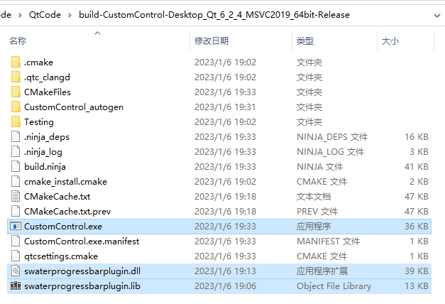

# Designer设计师的使用

在前面的课程中中，我们学习了怎么样用代码来把Qt的界面写出来，代码控制界面，控制力确实比较好，但是免不了复杂的代码，而且需要丰富的想象力。

很多时候运行时的样子，并不是我们想要的，所以说我们可以用Qt给我们提供的`Qt Designer`（界面设计师），拖拖拽拽就可以直观的创建出程序大体的界面。

## 1.1 创建带UI文件的项目

+ 双击.ui文件打开设计师界面


+ 设计师面板介绍
  + 组件面板：窗口左侧是界面设计组件面板，分为多个组，如Layouts、Buttons、Display Widgets等，界面设计的常见组件都可以在组件面板里找到。
  + 中间主要区域是待设计的窗体。如果要将某个组件放置到窗体上时，从组件面板上拖放一个组件到窗体上即可。例如，先放一个 Label 和一个 Push Button 到窗体上。
  + Signals 和 Slots 编辑器与 Action 编辑器是位于待设计窗体下方的两个编辑器。Signals 和Slots 编辑器用于可视化地进行信号与槽的关联，Action 编辑器用于可视化设计 Action。
  + 布局和界面设计工具栏：窗口上方的一个工具栏，工具栏上的按钮主要实现布局和界面设计。
  + 对象浏览器（Object Inspector）：窗口右上方是 Object Inspector，用树状视图显示窗体上各组件之间的布局包含关系，视图有两列，显示每个组件的对象名称（ObjectName）和类名称。
  + 属性编辑器（Property Editor）：窗口右下方是属性编辑器，是界面设计时最常用到的编辑器。属性编辑器显示某个选中的组件或窗体的各种属性及其取值，可以在属性编辑器里修改这些属性的值。


## 1.2 UI设计器使用

#### 1，转到槽

+ 递归搜索给定对象的所有子对象，并将来自它们的匹配信号连接到遵循以下形式的对象槽：

  ```css
  void on_<object name>_<signal name>(<signal parameters>);
  ```

  让我们假设我们的对象有一个 QPushButton 类型的子对象，对象名为 button1。 捕捉按钮的 clicked() 信号的插槽是：

     ```css
  void on_button1_clicked();
     ```

  如果对象本身具有正确设置的对象名称，则其自身的信号也连接到其各自的插槽。

## 1.3 自定义控件

在使用Qt设计师进行窗口设计时，我们会通过拖拽使用设计师中的原生控件来进行界面的开发，但有时候那些标准窗口部件无法满足我们的需求，这时候就需要我们进行自定义控件的使用。而自定义控件又有两种方法，**提升法**及**插件法**，接下来咱们一一学习。

### 1.3.1 控件提升

#### 1.3.1.1 新建界面类

1. 先创建一个带界面文件的项目，然后右击项目名称，添加新文件...


2. 选择Qt->Qt设计师界面类


3. 界面模板选择Widget，并修改好类名，点击下一步，直至完成。


4. 将创建的界面类的文件添加到CMakeLists.txt中，并保存


5. 这边我要自定义的是一个开关控件，所以选择了在ui界面上添加了一个label，修改控件名称并调整合适大小


#### 1.3.1.2初始化界面样式

1. 将下面两种图片添加到，资源文件中

   > PS：记得将资源文件添加到CMakeLists.txt文件中哦


2. 回到scheckbox.ui文件，选中lable，找到属性中的styleSheet，添加资源，选择image，点击OK


3. 选择资源文件，这边选择check_off.png，点击OK


4. 看到出现下列界面(有效样式表)，点击OK


5. 这里将label的文本置空，同时修改控件的objectName，可以调整一下大小


#### 1.3.1.3 主界面进行提升

1. 回到widget.ui，界面中添加一个widget控件，修改名称后选中控件，右键提升为…

   

2. 如图，新建提升的类，这里输入前面添加的ui界面设计师类名，点击添加


3. 勾选中刚刚添加的ImageSwitch类，选择提升


4. 这里可以看到widget控件已经成功提升为SCheckBox类


5. 编译运行，可以看到程序运行后就会出现之前添加的默认关闭的一个图片，这里我们可以重写SCheckBox类的鼠标按下事件来实现图片的切换。

```cpp
void SCheckBox::mousePressEvent(QMouseEvent *event)
{
    qDebug()<<"event:"<<event;
    if(switchFlag)
    {
        ui->switch_cbx->setStyleSheet("image: url(:/images/check_off.png);");
    }
    else
    {
        ui->switch_cbx->setStyleSheet("image: url(:/images/check_on.png);");
    }
     switchFlag = !switchFlag;
}
```

> PS:没有UI界面文件的类也可以提升哦，不过需要自己在paintEvent内绘制或者通过样式表指定

### 1.3.2 制作插件

#### 1. 自定义插件

这一次需要生成DLL文件，所以创建的文件流程有不同，创建过程如下：

##### 1. 新建项目

1. 新建设计师自定义控件项目


2. 一直点击下一步，直到如下界面，添加一个类名(这里用前面讲过的水波纹进度条)


3. 然后一直下一步，直到完成


##### 2. 添加代码

1. 在SWaterProgressBar.h中添加如下代码

```cpp
#ifndef _SWATERPROGRESSBAR_H_
#define _SWATERPROGRESSBAR_H_

#include <QWidget>
#include "CustomAnimation/SineWave.h"
struct SWaterProgressBarPrivate
{
	int value = 0;			//当前值
	qreal yOffset = 0;		//波浪偏移
	int minValue = 0;
	int maxValue = 100;
	QString text;
	bool textVisible = true;
	int minRadius = 0;		//qMin(width(),height())/2
	qreal scale = 0.;		//value 在最大值和最小值中的占比
};

class Q_DECL_EXPORT  SWaterProgressBar : public QWidget
{
	Q_OBJECT
public:
	explicit SWaterProgressBar(QWidget* parent = nullptr);

	int minimum() const;
	int maximum() const;

	int value() const;

	virtual QString text() const;
	void setTextVisible(bool visible);
	bool isTextVisible() const;

protected:
	void resizeEvent(QResizeEvent* ev)override;
	void paintEvent(QPaintEvent* ev)override;
	void drawBackground(QPainter* painter);
	void drawText(QPainter* painter);
	void drawWater(QPainter* painter);
public Q_SLOTS:
	void updaterWater();

	void reset();
	void setRange(int minimum, int maximum);
	void setMinimum(int minimum);
	void setMaximum(int maximum);
	void setValue(int value);
Q_SIGNALS:
	void valueChanged(int value);
private:
	QScopedPointer<SWaterProgressBarPrivate> d;
};

#endif // !_SWATERPROGRESSBAR_H_

```

2. 在SWaterProgressBar.h中添加如下代码

```cpp
#include "SWaterProgressBar.h"
#include <QPainter>
#include <QPainterPath>
#include <QTimer>


SWaterProgressBar::SWaterProgressBar(QWidget* parent)
	:QWidget(parent)
{
	d.reset(new SWaterProgressBarPrivate);
	resize(100, 100);

    QTimer* timer = new QTimer(this);
    connect(timer, &QTimer::timeout, this, &SWaterProgressBar::updaterWater);
    timer->start(30);//定时30毫秒
}

void SWaterProgressBar::resizeEvent(QResizeEvent* ev)
{
    d->minRadius = qMin(width(), height()) / 2;
}

void SWaterProgressBar::paintEvent(QPaintEvent* ev)
{
	Q_UNUSED(ev);
    //d->value 在range内所占比例
    d->scale = (qreal)(qAbs(d->value - d->minValue)) / (qAbs(d->maxValue - d->minValue));
	QPainter painter(this);
	painter.setRenderHints(QPainter::Antialiasing | QPainter::TextAntialiasing);	//设置抗锯齿
	painter.translate(width() / 2, height() / 2);	//设置坐标原点为控件中心
	//painter.scale(side / 200.0, side / 200.0);//设置坐标系拉伸为200*200
	drawBackground(&painter);
    drawWater(&painter);
	drawText(&painter);
 
}

void SWaterProgressBar::drawBackground(QPainter* painter)
{
	painter->save();

	painter->setPen(Qt::NoPen);
	painter->setBrush(QColor(40, 40, 40));
	QRect rect(-d->minRadius, -d->minRadius, d->minRadius * 2, d->minRadius * 2);
	painter->drawEllipse(rect);

	painter->restore();
}

void SWaterProgressBar::drawText(QPainter* painter)
{
    if (d->textVisible)
    {
        painter->save();
        d->text = QString("%1%").arg(d->scale * 100,2,'f', 1);
        //设置字体大小
        //QFont font = painter->font();
        //font.setPixelSize(30);
        //painter->setFont(font);
        //设置画笔
        painter->setPen(QPen(Qt::white, 4));
        //绘制文本
        QRect r(-d->minRadius, -d->minRadius, d->minRadius * 2, d->minRadius * 2);
        painter->drawText(r, Qt::AlignCenter, d->text);

        painter->restore();
    }
}

void SWaterProgressBar::drawWater(QPainter* painter)
{
    if (d->value == d->minValue) //没波浪，不用画
    {
        return;
    }
    else if (d->value == d->maxValue) //波浪满，直接画圆
    {
        painter->save();
        painter->setPen(Qt::NoPen);
        painter->setBrush(QBrush(QColor(100, 180, 250, 230)));
        painter->drawEllipse(QRect(-d->minRadius, -d->minRadius, d->minRadius * 2, d->minRadius * 2));
        painter->restore();
    }
    else//画波浪
    {
        int side = qMin(width(), height());
        int height = side/2 - d->scale * side;  //100/2 - 0.5 * 100
        painter->save();
        QPainterPath wavePath; //波浪区域
        QPainterPath wavePath2; //波浪区域
      
        //1.8 角速度
        //4   振幅
        //height y轴相对远点偏移
        //d->yOffset x=0时的相位；反映在坐标系上则为图像的左右移动。
        //x * M_PI / 180  把x当做角度，转成弧度
        wavePath.moveTo(-d->minRadius, d->minRadius);       //第一点坐标为（0,height）;
        for (int x = -d->minRadius; x <= d->minRadius; x++)  //x从0~w的值而改变，从而得到正弦曲线
        {
            double waveY = 4 * qSin(1.8 * (x * M_PI / 180 + d->yOffset)) + height;// waveY随着x的值改变而改变，从而得到正弦曲线
            wavePath.lineTo(x, waveY);   //从上一个绘制点画一条线到（x，waveY）；
        }
        wavePath.lineTo(d->minRadius, d->minRadius); //右下角，坐标（width, height），移动到右下角结束点,整体形成一个闭合路径

        wavePath2.moveTo(-d->minRadius, d->minRadius);//第一点坐标为（0,height）;
        for (int x = -d->minRadius; x <= d->minRadius; x++)  //x从0~w的值而改变，从而得到正弦曲线
        {
           double waveY = 4 * qSin(1.8 * (x * M_PI / 180 + d->yOffset + 2)) + height;// waveY随着x的值改变而改变，从而得到正弦曲线
           wavePath2.lineTo(x, waveY);   //从上一个绘制点画一条线到（x，waveY）；
        }
        wavePath2.lineTo(d->minRadius, d->minRadius); //右下角，坐标（width, height），移动到右下角结束点,整体形成一个闭合路径

        QPainterPath bigPath;
        bigPath.addEllipse(QRect(-d->minRadius, -d->minRadius, d->minRadius * 2, d->minRadius * 2));
        wavePath = bigPath.intersected(wavePath);
        wavePath2 = bigPath.intersected(wavePath2);

        painter->setPen(Qt::NoPen);
        painter->setBrush(QBrush(QColor(100, 184, 255, 80)));
        painter->drawPath(wavePath);      //绘制路径
        painter->setBrush(QBrush(QColor(100, 180, 250, 230)));
        painter->drawPath(wavePath2);      //绘制路径
        painter->restore();
    }
}

int SWaterProgressBar::minimum() const
{
    return d->minValue;
}

int SWaterProgressBar::maximum() const
{
    return d->maxValue;
}

int SWaterProgressBar::value() const
{
    return d->value;
}

QString SWaterProgressBar::text() const
{
    return d->text;
}

void SWaterProgressBar::setTextVisible(bool visible)
{
    d->textVisible = visible;
}

bool SWaterProgressBar::isTextVisible() const
{
    return d->textVisible;
}

void SWaterProgressBar::reset()
{
    d->minValue = 0;
    d->maxValue = 100;
}
void SWaterProgressBar::setRange(int minimum, int maximum)
{
    d->minValue = minimum;
    d->maxValue = maximum;
    d->value = minimum;
}
void SWaterProgressBar::setMinimum(int minimum)
{
    d->minValue = minimum;
    d->value = minimum;
}
void SWaterProgressBar::setMaximum(int maximum)
{
    d->maxValue = maximum;
}
void SWaterProgressBar::setValue(int value)
{
    if (value != d->value)
    {
        d->value = value;
        emit valueChanged(value);
    }   
}


void SWaterProgressBar::updaterWater()
{
    d->yOffset += 0.15;//波浪偏移
    if (d->yOffset >= 360)
        d->yOffset = 0;
    update();
}

```

3. 添加图标资源


##### 3.生成动态库

1. 选择构建套件，这里有N中方式，对应以后不同情况下使用：

+ MinGW 32bit/64bit Debug/Release
+ MSVC 32bit/64bit Debug/Release


+ 这里选择MSVC 64bit Debug/Release都生成一下，生成的文件夹里大概就是这些文件，我们需要用的就是选择的两个（对比Debug和Release生成的文件有细微差别，Degbug文件后面多了一个d)，再加上源文件夹里的swaterprogressbar.h文件

  + **Debug**

  

  + **Release**

  

至此，自定义控件dll生成完毕！

#### 2.DLL文件使用

##### 1. QtCreator使用DLL

Qt6自带的QtCreator是64bit，所以要在QC中使用插件，只能使用64bit的DLL文件，将64bit/Release版本的.dll文件复制到QtCreator的路径下，然后打开Qt就可以看到控件了（无需将64bit/Debug版本的放入，QtCreator只支持64bit/Release版本的.dll文件）。

> PS：出现如下警告，运行程序窗口不会显示出来
>
> MSVC 如果在Debug模式下，使用了Release模式编译的DLL，则会警告：QWidget: Must construct a QApplication before a QWidget

1. 赋值64bit/Release版本的 **swaterprogressbarplugin.dll** 到`\Qt\Tools\QtCreator\bin\plugins\designer`


2. 然后重新打开QC，就可以看到自定义控件，拖到Ui界面也正常显示


3. 如果将release和debug的DLL文件同时放入，debug的DLL文件不能正常加载。点击 工具->From Editor->About Qt Designer Plugins 可以查看加载的插件以及失败的插件和不能加载的原因


4. 此时，只是在UI界面能够把控件拖出来，还不能运行，因为没有配置头文件和库文件。
   + 将swaterprogressbarplugind.h放入项目的源码目录
   + 将swaterprogressbarplugind.lib和swaterprogressbarplugind.dll文件放入生成的exe同级目录。




+ CMakeLists.txt配置库

  ```cmake
  target_link_libraries(CustomControl PRIVATE Qt${QT_VERSION_MAJOR}::Widgets swaterprogressbarplugin)
  ```

Ok！完美运行

##### 2. Qt的Designer使用DLL文件

Qt安装时我们安装了MinGW和MSVC64bit套件，在这里我们就只能使用64bit的DLL文件了。

1. 把对应的DLL复制到相应的套件目录中！


2. 在开始菜单栏启动对应的设计师


3. 可以看到有了SWaterProgressBar自定义控件


## 1.4 UI设计师原理

就算我们不编写一行程序语句，都能实现界面功能，Qt 是怎么实现的呢？

为了搞清楚Widget类的定义，以及界面功能的实现原理，先将项目进行编译。编译后在项目目录下会自动生成一个文件 ui_widget.h，这样对于一个窗口，就有 4 个文件了，各文件的功能说明见下表。

| 文件名      | 描述                                                         |
| ----------- | ------------------------------------------------------------ |
| widget.h    | 定义Widget类的头文件                                         |
| widget.cpp  | Widget 类的功能实现源文件                                    |
| widget.ui   | 界面文件，由UI设计器自动生成，存储了窗体上各个组件的属性设置和布局 |
| ui_widget.h | 编译后，根据窗体上的组件及其属性、信号与槽的关联等自动生成的一个类的定义文件，类的名称是Ui_Widget |

下面分别分析各个文件的内容及其功能，以及它们是如何联系在一起工作，实现界面的创建与显示的。

#### Widget.h

```cpp
#ifndef WIDGET_H
#define WIDGET_H

#include <QWidget>

QT_BEGIN_NAMESPACE
namespace Ui { class Widget; }
QT_END_NAMESPACE

class Widget : public QWidget
{
    Q_OBJECT

public:
    Widget(QWidget *parent = nullptr);
    ~Widget();

private:
    Ui::Widget *ui;
};
#endif // WIDGET_H
```

+ **namespace申明**

  代码中有如下的一个 namespace 声明：

  ```cpp
  namespace Ui { class Widget; }
  ```

  这是声明了一个名为 Ui 的命名空间（namespace），包含一个类 Widget。但是这个类 Widget 并不是本文件里定义的类 Widget，而是 ui_widget.h 文件里定义的类，用于描述界面组件的。这个声明相当于一个外部类型声明（具体要看完 ui_widget.h 文件内的解释之后才能搞明白）。

+ **private指针定义**

  ```cpp
  Ui::Widget *ui;
  ```

  这个指针是用前面声明的 namespace Ui 里的 Widget 类定义的，所以指针 ui 是指向可视化设计的界面，后面会看到要访问界面上的组件，都需要通过这个指针 ui。


#### Widget.cpp

```cpp
#include "widget.h"
#include "ui_widget.h"

Widget::Widget(QWidget *parent)
    : QWidget(parent)
    , ui(new Ui::Widget)
{
    ui->setupUi(this);
}

Widget::~Widget()
{
    delete ui;
}
```

+ 注意到，在这个文件的头文件包含部分自动加入了如下一行内容

  ```cpp
  #include "ui_widget.h"
  ```

  这个就是 Qt 编译生成的与 UI 文件 widget.ui 对应的类定义文件。

+ 在构造函数初始化参数列表里有这么一段代码

  ```cpp
  ui(new Ui::Widget)
  ```

  其意义是：执行父类 QWidget 的构造函数，创建一个 Ui::Widget 类的对象 ui。这个 ui 就是 Widget 的 private 部分定义的指针变量 ui。

+ 构造函数里只有一行代码

  ```cpp
  ui->setupUi(this);
  ```

  它是执行了 Ui::Widget 类的 setupUi() 函数，这个函数实现窗口的生成与各种属性的设置、信号与槽的关联（后面会具体介绍）。

+ 析构函数只是简单地delete用 new 创建的指针 ui。

+ 所以，在 ui_widget.h 文件里有一个 namespace 名称为 Ui，里面有一个类 Widget 是用于描述可视化设计的窗体，且与 widget.h 里定义的类同名。在 Widget 类里访问 Ui::Widget 类的成员变量或函数需要通过 Widget 类里的 ui 指针，如同构造函数里执行 ui->setupUi( this) 函数那样。

#### Widget.ui

widget.ui 是界面定义文件，是一个 XML 文件，定义了窗口上的所有组件的属性设置、布局，及其信号与槽函数的关联等。用UI设计器可视化设计的界面都由 Qt 自动解析，并以 XML 文件的形式保存下来。在设计界面时，只需在 UI 设计器里进行可视化设计即可，而不用管 widget.ui 文件是怎么生成的。

```cpp
<?xml version="1.0" encoding="UTF-8"?>
<ui version="4.0">
 <class>Widget</class>
 <widget class="QWidget" name="Widget">
  <property name="geometry">
   <rect>
    <x>0</x>
    <y>0</y>
    <width>800</width>
    <height>600</height>
   </rect>
  </property>
  <property name="windowTitle">
   <string>Widget</string>
  </property>
 </widget>
 <resources/>
 <connections/>
</ui>
```


#### ui_Widget.h

ui_widget.h 是在对 widget.ui 文件编译后生成的一个文件，ui_widget.h 会出现在编译后的目录下，或与 widget.ui 同目录（与项目的 shadow build 编译设置有关）。

文件 ui_widget.h 并不会出现在 Qt Creator 的项目文件目录树里，当然，可以手工将 ui_widget.h 添加到项目中。方法是在项目文件目录树上，右击项目名称节点，在调出的快捷菜单中选择“Add Existing Files…”，找到并添加 ui_widget.h 文件即可。

注意，ui_widget.h 是对 widget.ui 文件编译后自动生成的，widget.ui 又是通过 UI 设计器可视化设计生成的。所以，对 ui_widget.h 手工进行修改没有什么意义，所有涉及界面的修改都应该直接在UI 设计器里进行。所以，ui_widget.h 也没有必要添加到项目里。

```cpp
#ifndef UI_WIDGET_H
#define UI_WIDGET_H

#include <QtCore/QVariant>
#include <QtWidgets/QApplication>
#include <QtWidgets/QWidget>

QT_BEGIN_NAMESPACE

class Ui_Widget
{
public:

    void setupUi(QWidget *Widget)
    {
        if (Widget->objectName().isEmpty())
            Widget->setObjectName(QString::fromUtf8("Widget"));
        Widget->resize(800, 600);

        retranslateUi(Widget);

        QMetaObject::connectSlotsByName(Widget);
    } // setupUi

    void retranslateUi(QWidget *Widget)
    {
        Widget->setWindowTitle(QCoreApplication::translate("Widget", "Widget", nullptr));
    } // retranslateUi

};

namespace Ui {
    class Widget: public Ui_Widget {};
} // namespace Ui

QT_END_NAMESPACE

#endif // UI_WIDGET_H
```

+ 查看 ui_widget.h 文件的内容，发现它主要做了以下的一些工作：

  + 1，定义了一个类 Ui_Widget，用于封装可视化设计的界面。

  + 2，自动生成了界面各个组件的类成员变量定义。在 public 部分为界面上每个组件定义了一个指针变量，变量的名称就是设置的 objectName。比如，在窗体上放置了一个 QLabel 和一个 QPushButton 并命名后，自动生成的定义是：

    ```cpp
    QLabel *LabDemo;
    QPushButton *btnClose;
    ```

  + 定义了 setupUi() 函数，这个函数用于创建各个界面组件，并设置其位置、大小、文字内容、字体等属性，设置信号与槽的关联。setupUi() 函数体的第一部分是根据可视化设计的界面内容，用 C++ 代码创建界面上各组件，并设置其属性。

    接下来，setupUi() 调用了函数 retranslateUi(Widget)，用来设置界面各组件的文字内容属性，如标签的文字、按键的文字、窗体的标题等。将界面上的文字设置的内容独立出来作为一个函数 retranslateUi()，在设计多语言界面时会用到这个函数。

    setupUi() 函数的第三部分是设置信号与槽的关联：

    ```cpp
    QMetaObject::connectSlotsByName(Widget);
    ```

    该代码是设置槽函数的关联方式，用于将 UI 设计器自动生成的组件信号的槽函数与组件信号相关联。

    所以，在Widget 的构造函数里调用 ui->setupUI(this)，就实现了窗体上组件的创建、属性设置、信号与槽的关联。

  + 定义 namespace Ui，并定义一个从Ui_Widget 继承的类Widget。

    ```cpp
    namespace Ui {
      class Widget: public Ui_Widget {};
    }
    ```

提示：ui_widget.h 文件里实现界面功能的类是 Ui_Widget。再定义一个类 Widget 从 Ui_Widget 继承而来，并定义在 namespace Ui 里，这样 Ui:: Widget 与 widget.h 里的类 Widget 同名，但是用 namespace 区分开来。所以，界面的 Ui:: Widget 类与文件 widget.h 里定义的 Widget 类实际上是两个类，但是 Qt 的处理让用户感觉不到 Ui:: Widget 类的存在，只需要知道在 Widget 类里用 ui 指针可以访问可视化设计的界面组件就可以了


## 1.5 用Ui文件生成头文件

+ 1，打开终端，并切换工作目录到.ui文件所在的目录


+ 2，输入如下命令，可以看到ui_widget.h文件就生成出来了

  ```css
  uic widget.ui -o ui_widget.h
  ```

  

## 1.6 使用ui_widget.h

一句话，要让ui designer设计出来的界面显示出来，只要能设法调用Ui_widget类的setupUi函数就行了。

**三步即可完成**

+ 1，前置声明

  ```cpp
  //widget.h
  namespace Ui 
  {
      class widget;
  }
  ```

+ 2，类中定义

  ```cpp
  //widget.h
  private:
      Ui::widget* ui;
  ```

+ 3，申请内存，设置ui

  ```cpp
  //widget.cpp
  Widget::Widget(QWidget *parent)
      : QWidget(parent)
      ,ui(new Ui::widget)	//给ui指针分配内存
  {
          ui->setupUi(this);	//给当前窗口this，设置ui界面
  }
  ```

  

## QFormBuilder