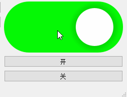
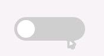
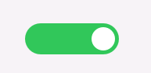

# 自定义开关控件(SwitchButton)

在开发中，开关按钮（Switch Button）常用于表示**开/关**状态，例如控制功能启用、主题切换等。



## 测试框架

### main.cpp

为了方便测试效果，我们在main.cpp中添加如下代码，将SwitchButton居中在窗口中。

```cpp
#include "SwitchButton.h"
#include <QtWidgets/QApplication>

class Widget : public QWidget
{
    Q_OBJECT
public:
    Widget(QWidget* parent = 0) 
        : QWidget(parent)
        , m_switchButton(new SwitchButton(this))
    {
        resize(640, 480);
    }
protected:
    void resizeEvent(QResizeEvent* event) override
    {
		m_switchButton->move(rect().center() - m_switchButton->rect().center());
    }
private:
    SwitchButton *m_switchButton;
};

int main(int argc, char *argv[])
{
    QApplication app(argc, argv);

    Widget w;
    w.show();

    return app.exec();
}

#include "main.moc"
```

### SwitchButton.h

SwitchButton头文件中添加两个重写函数，分别是`sizeHint`和`paintEvent`。

> *sizeHint* 是一个常见的函数，用于获取部件（widget）的建议大小。这个建议的尺寸通常基于部件的内容、布局和样式等因素，并且可能会根据具体情况而有所变化。*sizeHint* 函数不需要任何参数，只需直接调用即可返回建议的大小。一般情况下，这个建议的大小以像素为单位，由宽度和高度组成。
>
> 简单理解就是没有设置控件大小时的默认大小。

```cpp
#pragma once

#include <QtWidgets/QWidget>

class SwitchButton : public QWidget
{
    Q_OBJECT

public:
    SwitchButton(QWidget *parent = nullptr);
    ~SwitchButton();

    QSize sizeHint() const override;
protected:
    void paintEvent(QPaintEvent *event) override;
};
```

### SwitchButton.cpp

在`sizeHint`函数中我们设置提示大小为120*40方便测试，后续可以修改。

在`paintEvent`函数中我们绘制了一个背景颜色为灰色的圆角矩形。


```cpp
#include "SwitchButton.h"
#include <QPainter>

SwitchButton::SwitchButton(QWidget *parent)
    : QWidget(parent)
{
}

SwitchButton::~SwitchButton()
{}

QSize SwitchButton::sizeHint() const
{
    //return QSize(40,20);
    return QSize(120,40);
}

void SwitchButton::paintEvent(QPaintEvent * event)
{
    QPainter painter(this);
    painter.setRenderHint(QPainter::Antialiasing); //抗锯齿

    //绘制背景
    painter.setPen(Qt::NoPen);
    painter.setBrush(QBrush(QColor(204, 204, 204)));
	painter.drawRoundedRect(rect(), height() / 2, height() / 2);
}
```

## 继续完善

### 选择状态

因为选择和未选择状态下，开关按钮拥有不同背景颜色，所以我们需要加入是否选中的状态变量来控制背景颜色。

```cpp
private:
    bool m_isChecked;
```

在绘制时，根据状态选择不同颜色。

```cpp
    //绘制背景
    painter.setPen(Qt::NoPen);
	painter.setBrush(QBrush(m_isChecked ? QColor(52, 199, 89) : QColor(204, 204, 204)));
	painter.drawRoundedRect(rect(), height() / 2, height() / 2);
```

不过这样颜色是固定死的，我们也可以将颜色定义为变量，这样就可以动态进行设置了。

```cpp
    QColor m_grooveColorOn;  /*!开启状态：轨道颜色(绿色)*/
    QColor m_grooveColorOff; /*!关闭状态：轨道颜色(灰色)*/
	//设置颜色
	painter.setBrush(QBrush(m_isChecked ? m_grooveColorOn : m_grooveColorOff));
```

还需要给选中状态提供一些接口，方便访问和设置：

```cpp
void SwitchButton::setChecked(bool checked)
{
    if (m_isChecked == checked)
        return;

    //更新选中状态
    m_isChecked = checked;

    // 出发选择改变信号
    emit toggled(m_isChecked);

    //更新界面
    update();
}

bool SwitchButton::isChecked() const
{
    return m_isChecked;
}
```

### 切换状态

接下来我们需要通过鼠标点击按钮进行状态切换。


重写鼠标按下和释放事件处理函数：

```cpp
void SwitchButton::mousePressEvent(QMouseEvent* event)
{
    if (event->button() == Qt::LeftButton) {
        event->accept();	// 接受事件，防止冒泡(就是防止事件传播到父组件)
    }
}

void SwitchButton::mouseReleaseEvent(QMouseEvent* event)
{
    if (event->button() == Qt::LeftButton) {
        setChecked(!m_isChecked);	  // 切换状态（开启变关闭，关闭变开启）
    }
}
```

### 滑块绘制

背景搞定，我们还需要绘制把手，这样开关按钮效果才更加完整：

先定义把手颜色：

```cpp
    m_handleColorOn(255, 255, 255)
    m_handleColorOff(255, 255, 255)
```

然后根据状态绘制把手：

```cpp
    //计算handle位置
    //int handleSize = height() - 6;
    //int handleX = 3;
	//int handleY = 3;

	int handleSize = height() * 0.75;               //滑块大小，*0.75表示滑块大小为按钮高度的75%
	int handleX = (height() - handleSize) / 2;      //滑块X坐标，居中显示
    int handleY = (height() - handleSize) / 2;      //滑块Y坐标，居中显示

    //绘制滑块
	painter.setBrush(QBrush(m_isChecked ? m_handleColorOn : m_handleColorOff));
	painter.drawEllipse(QRect(handleX, handleY, handleSize, handleSize));
```

效果如下：


但是当我们点击切换状态时，把手的位置不会改变；我们还需要根据状态来计算滑块的位置。

为了方便表示，我们定义一个滑块进度变量从0.0到1.0之间。

```cpp
    qreal m_handleProgress; /*!把手位置*/
```

然后编写更新把手进度的函数：

```cpp
void SwitchButton::updateHandleProgress()
{
    if (m_isChecked) {
        m_handleProgress = 1;
    }
    else {
        m_handleProgress = 0;
    }
}
```

此函数需要在`setChecked`函数中调用：

```cpp
void SwitchButton::setChecked(bool checked)
{
	...
        
    //更新把手进度
    updateHandleProgress();

    //更新界面
    update();
}
```

紧接着需要在`paintEvent`中根据进度来计算把手的位置：

```cpp
    //计算handle位置
	int handleSize = height() * 0.75;               //滑块大小，*0.75表示滑块大小为按钮高度的75%
	int spacing = (height() - handleSize) / 2;        //滑块与按钮边缘的间距，*0.1表示间距为
	int handleX = spacing + (width() - handleSize - spacing * 2) * m_handleProgress;      //滑块X坐标，居中显示
	int handleY = spacing;      //滑块Y坐标，居中显示
```

切换效果如下：



### 滑块动画

当前的滑块切换比较生硬，如果想要平滑一点，我们可以通过定时器实现平滑移动。

首先，创建定时器，并实现定时器超时的槽函数：

```cpp
    m_handleTimer->callOnTimeout(this, [this] {
            //选中状态
		    if (m_isChecked) {
                //每次让进度增加0.01
                m_handleProgress += 0.01;
                if (m_handleProgress >= 1.0) {
                    m_handleTimer->stop();
                    m_handleProgress = 1.0;
                }
            }
			else {
                //每次让进度减少0.01
				m_handleProgress -= 0.01;
				if (m_handleProgress <= 0.0) {
					m_handleTimer->stop();
                    m_handleProgress = 0.0;
				}
			}
            update();
		});
```

然后，在`updateHanldeProgress`函数中开启定时器：

```cpp
void SwitchButton::updateHandleProgress()
{
    if (m_handleTimer->isActive()) {
    }
    else {
		m_handleTimer->start(1);
    }
}
```

效果如下：



### 按钮文本

为了让按钮显示更直观，我们可以增加文本：

```cpp
    , m_textOff("关闭")
    , m_textOn("打开")
    , m_textColorOff(Qt::white)
    , m_textColorOn(Qt::black)
```

还可以添加函数，控制文本是否显示：

```cpp
void SwitchButton::setTextVisible(bool textVisible)
{
    if (m_textVisible == textVisible)
        return;

    m_textVisible = textVisible;

    update();
}

bool SwitchButton::textVisible() const
{
    return m_textVisible;
}

void SwitchButton::setTextOff(const QString& text)
{
    if (m_textOff == text)
        return;

    m_textOff = text;

    update();
}

void SwitchButton::setTextOn(const QString& text)
{
    if (m_textOn == text)
        return;

    m_textOn = text;

    update();
}

QString SwitchButton::textOff() const
{
    return m_textOff;
}

QString SwitchButton::textOn() const
{
    return m_textOn;
}
```

最后，绘制文本即可：

```cpp
	// 绘制文字
    if (m_textVisible) {
        auto text = m_isChecked ? m_textOn : m_textOff;
        painter.setPen(m_isChecked ? m_textColorOn : m_textColorOff);
        painter.drawText(rect(), text, QTextOption(Qt::AlignCenter));
    }
```

### 添加颜色设置与获取函数

**声明：**

```cpp
    void setTextColorOff(const QColor &color);
    void setTextColorOn(const QColor &color);
	QColor textColorOff()const;
	QColor textColorOn()const;

    void setGrooveColorOff(const QColor &color);
    void setGrooveColorOn(const QColor &color);
	QColor grooveColorOff()const;
	QColor grooveColorOn()const;

    void setHandleColorOff(const QColor &color);
    void setHandleColorOn(const QColor &color);
	QColor handleColorOff()const;
	QColor handleColorOn()const;
```

**实现：**

```cpp
void SwitchButton::setTextColorOff(const QColor& color)
{
    if (m_textColorOff == color)
        return;

    m_textColorOff = color;

    update();
}

void SwitchButton::setTextColorOn(const QColor& color)
{
    if (m_textColorOn == color)
        return;

    m_textColorOn = color;

    update();
}

QColor SwitchButton::textColorOff() const
{
    return m_textColorOff;
}

QColor SwitchButton::textColorOn() const
{
    return m_textColorOn;
}

void SwitchButton::setGrooveColorOff(const QColor& color)
{
    if (m_grooveColorOff == color)
        return;

    m_grooveColorOff = color;

    update();
}

void SwitchButton::setGrooveColorOn(const QColor& color)
{
    if (m_grooveColorOn == color)
        return;

    m_grooveColorOn = color;

    update();
}

QColor SwitchButton::grooveColorOff() const
{
    return m_grooveColorOff;
}

QColor SwitchButton::grooveColorOn() const
{
    return m_grooveColorOn;
}

void SwitchButton::setHandleColorOff(const QColor& color)
{
    if (m_handleColorOff == color)
        return;

    m_handleColorOff = color;

    update();
}

void SwitchButton::setHandleColorOn(const QColor& color)
{
    if (m_handleColorOn == color)
        return;

    m_handleColorOn = color;

    update();
}

QColor SwitchButton::handleColorOff() const
{
    return m_handleColorOff;
}

QColor SwitchButton::handleColorOn() const
{
    return m_handleColorOn;
}
```


## 根据qss设置颜色

在 Qt 中，可以通过 `Q_PROPERTY` 为自定义控件添加属性，并使其支持 QSS 样式表。核心机制分为**两个方向**：

| 方向          | 用途                           | 关键语法                  |
| :------------ | :----------------------------- | :------------------------ |
| **QSS → C++** | 从样式表读取值并设置到控件属性 | `qproperty-<属性名>: 值;` |
| **C++ → QSS** | 根据 C++ 属性值动态改变样式    | `[属性名="值"] { ... }`   |

### 一、QSS → C++：从样式表读取属性值

在 QSS 中使用 `qproperty-` 前缀，可以将样式表中定义的值自动写入控件的 `Q_PROPERTY`。

> **`qproperty-` 前缀只能在控件初始化时设置属性的初始值，不能在伪状态（如 `:hover`）中动态改变**。

#### 定义属性

我们先将开关按钮的颜色等变量定义为属性：

```cpp
    Q_PROPERTY(QColor grooveColorOn READ grooveColorOn WRITE setGrooveColorOn)
    Q_PROPERTY(QColor grooveColorOff READ grooveColorOff WRITE setGrooveColorOff)
    Q_PROPERTY(QColor handleColorOn READ handleColorOn WRITE setHandleColorOn)
    Q_PROPERTY(QColor handleColorOff READ handleColorOff WRITE setHandleColorOff)
    Q_PROPERTY(QColor textColorOn READ textColorOn WRITE setTextColorOn)
    Q_PROPERTY(QColor textColorOff READ textColorOff WRITE setTextColorOff)
	Q_PROPERTY(bool checked READ isChecked WRITE setChecked NOTIFY toggled)
	Q_PROPERTY(bool textVisible READ textVisible WRITE setTextVisible)
```

####  QSS 样式表中设置属性

```css
SwitchButton{
    qproperty-textVisible: true;
    qproperty-textOff: "off";
    qproperty-textOn: "on";
    qproperty-textColorOff: blue;
    qproperty-textColorOn: yellow;

    qproperty-handleColorOff: blue;
    qproperty-handleColorOn: yellow;

    qproperty-grooveColorOff: red;
    qproperty-grooveColorOn: brown;
}
```

效果预览：


### 二、C++ → QSS：根据属性值改变样式

通过 `Q_PROPERTY` 定义的属性，可以在 QSS 中作为**属性选择器**的条件，实现样式动态切换。

#### QSS 中使用属性选择器

```cpp
SwitchButton[checked="true"]{
    border:2px solid red;
}
SwitchButton[checked="false"]{
    border:2px solid green;
}
```

#### 修改属性并刷新样式

```cpp
void SwitchButton::setChecked(bool checked)
{
    if (m_isChecked == checked)
        return;

	...

    //刷新样式
    style()->unpolish(this);    //卸载旧样式
    style()->polish(this);      //加载新样式

    //更新界面
    update();
}
```

> ⚠️ **关键点**：通过 `setProperty()` 或 setter 修改属性值后，**必须调用 `style()->polish(widget)`** 才能让样式表重新解析并生效

### 三、注意事项汇总

| 问题                               | 解决方案                                                     |
| :--------------------------------- | :----------------------------------------------------------- |
| `qproperty-` 在构造函数中读取不到  | 延迟到 `showEvent` 或使用 `QTimer::singleShot(0, ...)`       |
| 属性修改后样式不变                 | 调用 `widget->style()->polish(widget)`                       |
| 枚举属性在 QSS 中如何设置          | 使用枚举项名称（字符串），不是数值：`qproperty-status: Warning;` |
| 动态属性（未用 `Q_PROPERTY` 声明） | 可用 `setProperty()` 创建，同样支持属性选择器                |
| 哪些类支持 `qproperty-`            | 必须是 `QWidget` 及其子类，纯 `QObject` 不支持               |

通过这两种机制的组合，可以实现完全由 QSS 驱动的自定义控件样式系统，同时保持 C++ 代码的灵活性和可维护性。