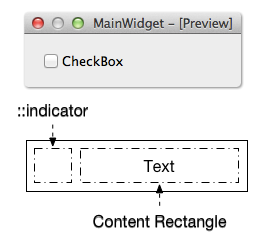

## 1、Qt样式表

Qt样式表(Qt Style Sheet)是用于定制用户界面的强有力的机制，其概念、术语是受到到HTML中的层级样式表(Cascading Style Sheets,CCS)启发而来，只是Qt样式表是用于窗体界面的。

与HTML的CSS类似，Qt的样式表是纯文本的格式定义，在应用程序运行时可以载入和解析这些样式定义。使用样式表可以定义各种界面组件(QWidget类及其子类)的样式，从而使应用程序的界面呈现不同的效果。很多软件具有换肤功能，使用Qt的样式表就可以很容易的实现这样的功能

> 多多翻看Qt官方文档，所有控件都有案例：在索引栏输入`Qt Style Sheets`

### 盒子模型

盒子模型是qss技术所使用的一种思维模型。盒子模型是指将界面设计页面中的内容元素看作一个个装了东西的矩形盒子。每个矩形盒子包括：内容(content)、内边距(padding)、边框(border)、外边距(margin)。

下面的图片说明了盒子模型(Box Model)：


**组成：**

+ **内容(Content)**
  + 内容区是盒子模型的中心，它呈现了盒子的主要信息内容，这些内容可以是文本、图片等多种类型
+ **内边距/填充(Padding)**
  + **内边距**是**内容区**和**边框**之间的空间。填充的属性有五种 ，即padding -top、padding -bottom、padding -left、padding-right 以及综合了以上四种方向的快捷填充属性padding。使用这五种属性可以指定内容区信息内容与各方向边框间的距离

+ **边框(Border)**
  + 边框是环绕内容区和填充的边界。边框的属性有border-style、border-width和border-color 以及综合了以上三类属性的快捷边框属性 border。
  + border-style 属性是边框最重要的属性，如果没有指定边框样式，其他的边框属性都会被忽略，边框将不存在。qss规定了dotted（点线）、dashed（虚线）、solid(实线)等十一种边框样式
  + 使用border-width属性可以指定边框的宽度
  + 使用border-color属性可以为边框指定相应的颜色，其属性值可以是RGB值，也可以是CSS 规定的[颜色名](https://www.w3.org/TR/SVG11/types.html#ColorKeywords)
+ **外边距(Margin)**
  + 空白边位于盒子的最外围，是添加在边框外周围的空间。空白边使盒子之间不会紧凑地连接在一起，是CSS 布局的一个重要手段。空白边的属性有五种 ，即margin-top、margin-bottom、margin- left、margin-right以及综合了以上四种方向的快捷空白边属性margin，其具体的设置和使用与填充属性类似。对于两个相邻的（水平或垂直方向 ）且设置有空白边值的盒子，他们邻近部分的空白边将不是二者空白边的相加，而是二者的并集。若二者邻近的空白边值大小不等，则取二者中较大的值。同时，CSS 容许给空白边属性指定负数值，当指定负空白边值时，整个盒子将向指定负值方向的相反方向移动，以此可以产生盒子的重叠效果。采用指定空白边正负值的方法可以移动网页中的元素

为了正确设置元素在所有浏览器中的宽度和高度，你需要知道的盒模型是如何工作的。

## 2、选择器

到目前为止所有的例子使用的都是最简单的选择器类型。QT样式表支持[CSS2](https://www.runoob.com/css/css-tutorial.html)定义的所有选择器。下表总结了最常用的选择器类型。

### 选择器类型

|       选择器       |           示例            |                  描述                  |
| :----------------: | :-----------------------: | :------------------------------------: |
|     通用选择器     |             *             |              匹配所有控件              |
|     类型选择器     |        QPushButton        |       匹配给定类型控件，包括子类       |
|      类选择器      |       .QPushButton        |      匹配给定类型控件，不包括子类      |
|     属性选择器     | QPushButton[flat="false"] |   匹配给定类型控件中符合[属性]的控件   |
|      ID选择器      |   QPushButton#closeBtn    | 匹配给定类型，且对象名为closeBtn的控件 |
|   子孙对象选择器   |    QDialog QPushButton    |         匹配给定类型的子孙控件         |
|    子对象选择器    |    QDialog>QPushButton    |        匹配给定类型的直接子控件        |
| 辅助(子控件)选择器 |   QComboBox::drop-down    |            复杂对象的子控件            |
|    伪状态选择器    |     QPushButton:hover     |         控件的特定状态下的样式         |
|     并集选择器     |                           |                                        |

### 伪状态选择器

| 状态           | 描述                        |
| -------------- | --------------------------- |
| :disabled      | 控件禁用                    |
| :enabled       | 控件启用                    |
| :focus         | 控件获取输入焦点            |
| :hover         | 鼠标在空间上悬停            |
| :pressed       | 鼠标按下                    |
| :checked       | 控件被选中                  |
| :unchecked     | 控件没有选中                |
| :indeterminate | 控件部分被选中              |
| :open          | 控件                        |
| :closed        | 空间关闭                    |
| :on            | 控件可以切换，且处于on状态  |
| :off           | 控件可以切换，且处于off状态 |
| !              | 对以上状态的否定            |

## 3、控件示例

[公孙二狗](http://qtdebug.com/qtbook-animated-checkbox/)

[Qt中的QSS Subcontrol](https://blog.csdn.net/kanchuan1905/article/details/53714928)

[QT样式表](https://www.cnblogs.com/lsgxeva/p/7816938.html)

[CSS 中长度单位em、px、ex、%](https://blog.csdn.net/cui_angel/article/details/7692068)

[QCombobox下拉选择线宽](https://blog.csdn.net/qq_23208659/article/details/110955761)

### QLabel

#### 设置字体样式

```css
QLabel
{
    /*分开设置*/
    /*font-family: "楷体";
    font-size: 20px;
    font-style: italic;
    font-weight:bold ;
    /*快捷设置*/
    font:bold italic 18px "微软雅黑";
    color:cornflowerblue;
}
```

**font-family** 为设置字体类型，标准形式需要加双引号，不加也可能会生效，具体看系统是否支持，中英文都支持，但要保证字体编码支持，一般程序编码为"utf-8"时没问题。

**font-size** 为设置字体大小，单位一般使用 px 像素

**font-style** 为设置字体斜体样式，italic 为斜体， normal 为不斜体

**font-weight** 为设置字体加粗样式，bold 为加粗， normal 为不加粗

**font** 为同时设置字体 style weight size family 的样式，但是 style 和 weight 必须出现在开头，size 和 family 在后面，而且 size 必须在 family 之前，否则样式将不生效，font 中不能设置颜色，可以单独设置 style weight 和 size，不能单独设置 family

**color** 为设置字体颜色，可以使用十六进制数表示颜色，也可以使用某些特殊的字体颜色：red, green, blue 等，或者使用 rgb(r,g,b) 和 rgba(r,g,b,a) 来设置，其中 r、g、b、a 值为0~255，如果想不显示颜色可以设置值为透明 transparent

#### 文字位置

```css
QLabel
{
    padding-left: 10px;
    padding-top: 8px;
    padding-right: 7px;
    padding-bottom: 9px;
}
```

**Tip:** 在 qss 中，属性 text-align 对 Label 是不起作用的，只能通过设置 padding 来实现文字的显示位置；一般 padding-left 相当于 x 坐标，padding-top 相当于 y 坐标，设置这两个就可以在任意位置显示了（

#### 边框样式

##### 整体设置

```css
QLabel
{
    /*分开设置*/
    border-style: solid;
    border-width: 2px;
    border-color:darkgoldenrod;
    /*快捷设置*/
    border:2px solid red;
}
```

**border-style** 为设置边框样式，solid 为实线， dashed 为虚线， dotted 为点线， none 为不显示（如果不设置 border-style 的话，默认会设置为 none）

**border-width** 为设置边框宽度，单位为 px 像素

**border-color** 为设置边框颜色，可以使用十六进制数表示颜色，也可以使用某些特殊的字体颜色：red, green, blue 等，或者使用 rgb(r,g,b) 和 rgba(r,g,b,a) 来设置，其中 r、g、b、a 值为0~255，如果想不显示颜色可以设置值为透明 transparent

**border** 为同时设置 border 的 width style color 属性，但值的顺序必须是按照 width style color 来写，不然不会生效！

##### 单独设置某条边框的样式

```css
QLabel
{
    border-left: 2px solid red;
    border-top: 2px solid black;
    border-right: 2px solid blue;
    border-bottom-color: transparent;	/*下边框透明，不显示*/
}
```

##### 设置边框半径(圆角)

```css
QLabel
{
    border-left: 2px solid red;
    border-top: 2px solid black;
    border-right: 2px solid blue;
    border-bottom: 2px solid yellow;

	border-top-left-radius: 20px;
	border-top-right-radius: 15px;
	border-bottom-left-radius: 10px;
	border-bottom-right-radius: 5px;	
	/*border-radius: 20px;*/
}
```

**border-top-left-radius** 为设置左上角圆角半径，单位 px 像素

**border-top-right-radius** 为设置右上角圆角半径，单位 px 像素

**border-bottom-left-radius** 为设置左下角圆角半径，单位 px 像素

**border-bottom-right-radius** 为设置右上角圆角半径，单位 px 像素

**border-radius** 为设置所有边框圆角半径，单位为 px 像素，通过圆角半径可以实现圆形的 Label

#### 背景样式

```css
QLabel
{
    background-color: #2E3648;
	background-image: url("./image.png");
	background-repeat: no-repeat; 
	background-position: left center;
	/*background: url("./image.png") no-repeat left center #2E3648;*/
}
```

**background-color** 为设置背景颜色，可以使用十六进制数表示颜色，也可以使用某些特殊的字体颜色：red, green, blue 等，或者使用 rgb(r,g,b) 和 rgba(r,g,b,a) 来设置，其中 r、g、b、a 值为0~255，如果想不显示颜色可以设置值为透明 transparent

**background-image** 为设置背景图片，图片路径为 url(image-path)

**background-repeat** 为设置背景图是否重复填充背景，如果背景图片尺寸小于背景实际大小的话，默认会自动重复填充图片，可以设置为 no-repeat 不重复，repeat-x 在x轴重复，repeat-y 在y轴重复

**background-position** 为设置背景图片显示位置，只支持 left right top bottom center；值 left right center 为设置水平位置，值 top bottom center 为设置垂直位置 

**background** 为设置背景的所有属性，color image repeat position 这些属性值出现的顺序可以任意

### QPushButton

```css
QPushButton
{
    /*1*/
	border:none;	/*去掉边框*/
	border-radius:10px;
    /*1，添加图片*/
  	background-image: url(:/images/quit.png);
	background-repeat:none;
	background-position:center;
    /*3，把图片作为边框，会自动铺满背景*/
    border-image: url(:/images/quit.png);
}
QPushButton:hover
{
	background-color:rgba(102,205,227,255);
}
QPushButton:pressed
{
	background-color:rgb(48,188,218);
}
```


### QCheckBox、QRadioButton



```css
QCheckBox
{
	color:red;
}

QCheckBox::indicator
{
	width:16px;
	height:16px;
	border-image: url(:/images/checkbox-unchecked.png);
	border-radius:5px;		
}
QCheckBox::indicator:checked
{	
	border-image: url(:/images/checkbox-checked.png);
}
QCheckBox::indicator:unchecked:hover
{	
	border-image: url(:/images/checkbox-unchecked-hover.png);
}
QCheckBox::indicator:checked:hover
{
	border-image: url(:/images/checkbox-checked-hover.png);
}
```

### QGroupBox


```css
QGroupBox {
    background-color: qlineargradient(x1: 0, y1: 0, x2: 0, y2: 1,
                      stop: 0 #E0E0E0, stop: 1 #EEEEEE);
    border: 2px solid gray;
    border-radius: 5px;
    margin-top: 10px; /* leave space at the top for the title */
}
 
QGroupBox::title {
    subcontrol-origin: margin;
    subcontrol-position: top center; /* position at the top center */
    padding: 2px 3px;
    color: white;
    margin-top: 2px;
    background-color: gray;
    border-radius: 3px;
    spacing: 5px;
}
 
QGroupBox::indicator {
    width: 13px;
    height: 13px;
    border: 1px solid black;
    background: white;
}
 
QGroupBox::indicator:checked {
    background: yellow;
}
```

### QComboBox


```css
QComboBox {
    color: black;
	border:1px solid black;
	border-radius:5px;
	padding: 1px 1px 1px 1px;	/*不加这个圆角会有缺失*/
}
QComboBox::drop-down
{
	width:25px;
	border-image: url(:/images/comboBox/drop-down.png);
}
QComboBox::drop-down:hover
{
	border-image: url(:/images/comboBox/drop-down-hover.png);
}
/*把checked换成on也行*/
QComboBox::drop-down:checked
{
	border-image: url(:/images/comboBox/drop-down-on.png);
}
QComboBox::drop-down:checked:hover
{
	border-image: url(:/images/comboBox/drop-down-on-hover.png);
}
/*设置下拉菜单的样式*/
QComboBox#usernameEdit QAbstractItemView
{
    border: none;
    background-color: rgb(255, 255, 255);
    outline:0px ;
}
/*设置下拉菜单的每一项的样式*/
QComboBox#usernameEdit QAbstractItemView::item
{
    height: 50px;
    /*设置高度不生效，需要给QcomboBox设置如下属性(二选一)
        //1,usernameEdit->setItemDelegate(new QStyledItemDelegate);
    	//2,usernameEdit->setView(new QListView
    */
}
```

下拉项使用委托？

### QSpinBox、QTimeEdit、QDateEdit、QDateTimeEdit

QSpinBox 的 subcontrol 有 `::up-button`, `::down-button`, `::up-arrow`, `::down-arrow`。

- up-button 显示在 QSpinBox 里，它的 subcontrol-origin 是相对于 QSpinBox的
- down-button 显示在 QSpinBox 里，它的 subcontrol-origin 是相对于 QSpinBox的
- up-arrow 显示在 up-button 里，它的 subcontrol-origin 是相对于 up-button 的
- down-arrwo 显示在 down-button 里，它的 subcontrol-origin 是相对于 down-button 的


```css
QSpinBox
{
	border:1px solid black;
	border-radius:5px;
}
/*按钮*/
QSpinBox:down-button,QSpinBox:up-button
{
	width:16px;
	height:15px;
	subcontrol-origin:padding;
	background:white;
	border:2px solid rgb(217,217,217);
	border-radius:5px;
}

QSpinBox:down-button
{
	subcontrol-position:left center;
}

QSpinBox:up-button
{
	subcontrol-position:right center;
}

QSpinBox:down-button:hover,QSpinBox:up-button:hover
{

	border:2px solid rgb(138,138,138);
}
/*箭头*/
QSpinBox:down-arrow
{	
	border-image: url(:/images/spinBox/down-arrow.png);
}

QSpinBox:up-arrow
{
	border-image: url(:/images/spinBox/up-arrow.png);
}
QSpinBox:down-arrow:hover
{	
	border-image: url(:/images/spinBox/down-arrow-hover.png);
}

QSpinBox:up-arrow:hover
{
	border-image: url(:/images/spinBox/up-arrow-hover.png);
}
```

### QSlider

QSlider 的 subcontrol 有 `::groove`（槽），`::handle`，`::add-page` 和 `::sub-page`。

- groove 显示在 QSlider 里，它的 subcontrol-origin 是相对于 QSlider 的
- handle 显示在 groove 里，它的 subcontrol-origin 是相对于 groove 的
- sub-page 显示在 groove 里，它的 subcontrol-origin 是相对于 groove 的
- add-page 显示在 groove 里，它的 subcontrol-origin 是相对于 groove 的
- handle, sub-page, add-page 虽然都显示在 groove 里，但是都可以把它们扩展到 groove 外


```css
QSlider::groove:horizontal
{
    border: 1px solid skyblue;
    background-color: skyblue;
    height: 10px;
    border-radius: 5px;
}

QSlider::handle:horizontal
{
	background: qradialgradient(spread:pad, cx:0.5, cy:0.5, radius:0.5, fx:0.5, fy:0.5, stop:0.7 white,stop:0.8 rgb(143,212,255));
    width: 20px;
    border-radius: 10px;    
    margin-top: -5px;
    margin-bottom: -5px;
}
QSlider::sub-page:horizontal 
{
    background: #999;
    margin: 5px;
    border-radius: 5px;
}
 
QSlider::add-page:horizontal 
{
    background: #666;
    margin: 5px;
    border-radius: 5px;
}
```

### QProgressBar

对于 QProgressBar 的 QSS，大多数都是想把 chunk 定义为圆角矩形的样子，但是当它的 value 比较小时，chunk 的圆角会变成直角，即使使用图片都不行，效果很不理想，所以如果要修改 QProgressBar 的外观的话，推荐继承 QProgressBar 自己绘制或者使用 QStyle。


```css
/*边框*/
QProgressBar
{
	border:1px solid skyblue;
	border-radius:5px;
	height:5px;
    text-align: center;
}
/*进度条*/
QProgressBar::chunk
{
    background-color: steelblue;
    border-radius: 5px;
}
```


```css
QProgressBar
{
    border-color: 1px solid blue;
    border-radius: 5px;
    text-align: center;
}

QProgressBar:chunk
{
    background-color: aqua;	/*设置快的颜色*/
    width: 5px;		/*块的宽度*/
    margin: 0.5px;	/*让每个块之间有点间隔*/
}
```


如果最大值和最小值都为0，则会显示一个繁忙提示，等待系统容错处理结束，再继续恢复加载

```cpp
progressBar->setRange(0,0);
```

### QToolTip

```cpp
QToolTip
{
     border: 1px solid black;
     background-color: #ffa02f;
     padding: 1px;
     border-radius: 3px;
}
```

