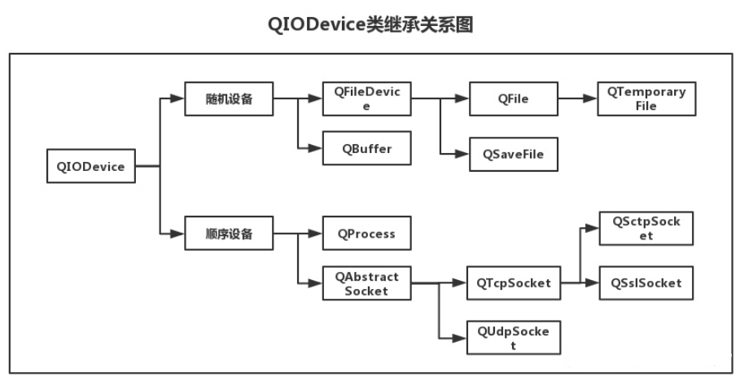

## 简介

QT中的IO操作通过统一的接口简化了文件与外部设备的操作方式，QT中文件被当作一种特殊的外部设备，文件操作与外部设备操作相同。IO操作的本质是连续存储空间的数据读写。

## IO设备的类型

顺序存取设备：只能从头开始顺序读写数据，不能指定数据的读写位置

随机存取设备：可以定位到任意位置进行数据的读写



## QFile

QFile是一个用于读写文本、二进制文件和资源的I/O设备。 QFile可以单独使用，或者更方便地与QTextStream或QDataStream一起使用。  

文件名通常在构造函数中传递，但它可以在任何时候使用setFileName()设置。 无论操作系统是什么，QFile都希望文件分隔符是'/'。 不支持使用其他分隔符(比如'\\\')。  

可以使用exists()检查文件是否存在，并使用remove()删除文件。 (更高级的文件系统相关操作由QFileInfo和QDir提供。)  

文件用open()打开，用close()关闭，用flush()刷新。 数据通常使用QDataStream或QTextStream读取和写入，但你也可以调用qiodevice继承的函数read()， readLine()， readAll()， write()。 QFile还继承了getChar()、putChar()和ungetChar()，它们每次只工作一个字符。  

文件的大小由size()返回。 您可以使用pos()获取当前文件位置，或者使用seek()移动到新的文件位置。 如果您已经到达文件的末尾，atEnd()将返回true。  

### 读文件

```cpp
QFile file("./student.txt");
if (!file.open(QIODevice::ReadOnly | QIODevice::Text))
{
    return -1;
}

// qDebug() << QString(file.readAll());    //读取所有
file.seek(0);                           //移动文件指针到开头
while (!file.atEnd())
{
    qDebug().noquote() << QString(file.readLine());   //读取一行
}
```

QIODevice::Text标志告诉Qt将windows风格的行终止符("\r\n")转换为c++风格的终止符("\n")。 默认情况下，QFile假设为二进制，即它不会对存储在文件中的字节执行任何转换。  

### 写文件

```cpp
QFile file("./what.txt");
if(!file.open(QIODevice::WriteOnly | QIODevice::Text))
{
    qDebug() << "文件打开失败";
    return;
}
file.write("大家好，我是顽石老师");
file.write(QString(",今年%1岁了").arg(18).toUtf8());
```

### 临时文件

QTemporaryFile用于安全地创建唯一的临时文件

```cpp
void tempFile()
{
    qDebug()<<QDir::tempPath();
    QTemporaryFile tempfile;
    if (!tempfile.open())
    {
        qDebug() << "打开失败"<<tempfile.errorString();
        return;
    }
    QTextStream stream(&tempfile);
    stream << "hello";
    qDebug() << tempfile.fileName();
}
```


## 流操作

在上面的读写文件中，我们发现操作还是太过复杂，为了简化文本文件和数据文件的读写操作，QT提供了QTextStream和QDataStream辅助类。QTextStream可将写入的数据全部转换为可读文本，QDataStream可将写入的数据根据类型转换为二进制数据。

### QTextStream

QTextStream可以在QIODevice, QByteArray或QString上操作。 使用QTextStream的流操作符，可以方便地读和写单词，行和数字。 对于生成文本，QTextStream支持字段填充和对齐的格式化选项，以及数字的格式化。

  ```cpp
class Student
{
public:
    qint64 number;
    QString name;
    QString grade;
    qreal math;
    qreal chinese;
    qreal english;
    friend QDebug& operator<<(QDebug& out, const Student& other)
    {
        out.noquote() << other.number << other.name << other.grade << other.math << other.chinese << other.english;
        return out;
    }
};
void readStudentInfo()
{
     QFile file("./student.txt");
    if (!file.open(QIODevice::ReadOnly | QIODevice::Text))
    {
        return -1;
    }

    Student stu;
    QTextStream stream(&file);
    qDebug().noquote() <<stream.readLine();
    while (!stream.atEnd())
    {
        stream >> stu.number >> stu.name >> stu.grade >> stu.math >> stu.chinese >> stu.english;
        qDebug() << stu;
    }
}
void test()
{
    QString res;
    QTextStream textstream(&res);
    textstream << "maye" << QString("冷寂") << "young"; 	//注意：中文要用Qstirng包起来，否则会乱码
    qDebug() <<res;
}
  ```


### QDataStream

```cpp
QByteArray data;
QDataStream stream(&data,QIODevice::ReadWrite);
stream << "image" << 1024 << "ABC";
//"[\x00\x00\x00\x06image\x00]   [\x00\x00\x04\x00]  [\x00\x00\x00\x04" "ABC\x00"] 22
qDebug() << data << data.size();
```

使用QDataStream串行化数据，如果数据是字符串则会在前面用4个字节表明字符串长度，如果是整数则直接存储。

[QIODevice 类 - 什么是设备？](https://zhuanlan.zhihu.com/p/50675356)

[Qt文档指南](https://qtguide.ustclug.org/)

[文件操作](https://blog.51cto.com/u_9291927/1872474)

[Qt压缩和解压 zip--Qt](https://blog.csdn.net/xiaopei_yan/article/details/90267714)

## QFileInfo

QFileInfo类提供与系统无关的文件信息。  

```cpp
QFileInfo info(file);
QFileInfo info("../QFile-test/what.txt");
qDebug() << info.size();                //文件大小
qDebug() << info.absoluteFilePath();    //文件绝对路径(包括文件名)
qDebug() << info.absolutePath();        //绝对路径(不包括文件名)
qDebug() << info.absoluteDir();         //绝对路径 QDir
qDebug() << info.path();                //文件路径
qDebug() << info.filePath();			//返回文件名，包括路径(可以是绝对路径也可以是相对路径)。  
if(info.is)
if (info.isFile())  //如果是文件
{
    qDebug() << info.fileName();            //带后缀的文件名
    qDebug() << info.baseName();            //不带后缀的文件名
    qDebug() << info.suffix();              //获取文件后缀
}
```


## QDir

QDir类提供对目录结构及其内容的访问。  

QDir功能如下：

  A、目录分隔符统一使用’/’

  B、能够对目录进行任意操作（创建、删除、重命名）

```cpp
bool mkdir(const QString &dirName) const
bool mkpath(const QString &dirPath) const
        
bool rmdir(const QString &dirName) const	//删除子目录(必须为空才能删除)
bool rmpath(const QString &dirPath) const	//删除路径(必须为空才能删除)
bool remove(const QString &fileName)		//删除指定文件
bool removeRecursively()					//删除目录，包括它的所有内容 

bool rename(const QString &oldName, const QString &newName)	//重命名
```

  C、能够获取指定目录中的所有条目（文件和文件夹）

```cpp
QFileInfoList entryInfoList(const QStringList &nameFilters, QDir::Filters filters = NoFilter, QDir::SortFlags sort = NoSort) const
QFileInfoList entryInfoList(QDir::Filters filters = NoFilter, QDir::SortFlags sort = NoSort) const
QStringList entryList(const QStringList &nameFilters, QDir::Filters filters = NoFilter, QDir::SortFlags sort = NoSort) const
QStringList entryList(QDir::Filters filters = NoFilter, QDir::SortFlags sort = NoSort) const
```

  E、获取常用路径

```cpp
//返回应用程序当前目录的绝对路径
QDir current()
QString currentPath()

//返回用户主目录  C:/Users/Maye
QDir home()
QString homePath()
 
//返回系统的临时目录。   
QDir temp()
QString tempPath()
    
//返回根目录列表 C:/  D:/ ...
QFileInfoList drives()
```

+ 计算目录的大小

  ```cpp
  quint32 dirSize(const QString& dirName)
  {
      QDir dir(dirName);
      if (!dir.exists())
          return ~0;
      quint32 size = 0;
      for (QFileInfo& info : dir.entryInfoList(QDir::Filter::NoDotAndDotDot | QDir::Files | QDir::Dirs))
      {
          qDebug() << info.fileName();
          if (info.isFile())
          {
              size += info.size();
          }
          else
          {
              size += dirSize(info.filePath());
          }
      }
      return size;
  }
  ```


## QFileSystemWatcher

### 简介

QFileSystemWatcher类用于提供监视文件和目录修改的接口。

QFileSystemWatcher通过监控指定路径的列表，监视文件系统中文件和目录的变更。

调用addPath()函数可以监控一个特定的文件或目录。如果需要监控多个路径，可以使用addPaths()。通过使用removePath()和removePaths()函数来移除现有路径。

QFileSystemWatcher检查添加到它的每个路径，已添加到QFileSystemWatcher的文件可以使用的files()函数进行访问，目录则使用directories()函数进行访问。

当一个文件被修改、重命名或从磁盘上删除时，会发出fileChanged()信号。同样，当一个目录或它的内容被修改或删除时，会发射directoryChanged()信号。需要注意：文件一旦被重命名或从硬盘删除，目录一旦从磁盘上删除，QFileSystemWatcher将停止监控。

注：监控文件和目录进行修改的行为会消耗系统资源。这意味着，你的进程同时监控会有文件数量的限制。一些系统限制打开的文件描述符的数量默认为256。也就是说，如果你的进程试使用addPath()和addPaths()函数添加超过256个文件或目录到文件系统将会失败。


### 公有函数

+ 构造函数

```cpp
QFileSystemWatcher(const QStringList &paths, QObject *parent = nullptr)
QFileSystemWatcher(QObject *parent = nullptr)
```

+ 添加目录或文件

```cpp
bool  addPath(const QString &path)
QStringList addPaths(const QStringList &paths)
```

+ 获取在监控的目录或文件

```cpp
QStringList directories() const
QStringList files() const
```

+ 从监控中移除目录或文件

```cpp
bool removePath(const QString &path)
QStringList removePaths(const QStringList &paths)
```

### 信号

+ 目录或文件发生改变

```cpp
void directoryChanged(const QString &path)
void fileChanged(const QString &path)
```

### 示例

来实现一个文件/目录监控类型。

```cpp
#include <QCoreApplication>
#include <QFileSystemWatcher>
#include <QDir>
#include <QFileInfo>
#include <QMap>
#include <QDebug>
class FileWatcher : public QObject
{
    Q_OBJECT
public:
    FileWatcher():mFileWatcher(new QFileSystemWatcher(this))
    {
        connect(mFileWatcher, &QFileSystemWatcher::directoryChanged, this, &FileWatcher::onDirChanged);
        connect(mFileWatcher, &QFileSystemWatcher::fileChanged, this, &FileWatcher::onFileChanged);
    };
    void addWatcherPath(const QString&path)
    {
        //把每个目录和文件都添加监视
        mFileWatcher->addPath(path);
        //如果监视的是目录，则把目录中的项保存起来
        if(QFileInfo(path).isDir())
            mCurContentsMap.insert(path,QDir(path).entryList(QDir::Filter::NoDotAndDotDot | QDir::Dirs | QDir::Files));

        //遍历子项
        QDir dir(path);
        for(QString ph : dir.entryList(QDir::Filter::NoDotAndDotDot | QDir::Dirs | QDir::Files))
        {
            if(QFileInfo(ph).isFile())
            {
                mFileWatcher->addPath(ph);
            }
            else //目录
            {
               addWatcherPath(ph);
            }
        }
    }

public slots:
    void onDirChanged(const QString& path)
    {
        qDebug() << path << "dirChanged"<<mFileWatcher->directories();
        //获取目录下所有项列表
        auto curEntryList = QDir(path).entryList(QDir::Filter::NoDotAndDotDot | QDir::Dirs | QDir::Files);

        //获取目录下原来项的列表
        auto oldEntryList = mCurContentsMap[path];

        //qDebug()<<"curEntryList"<<curEntryList;
        //qDebug()<<"oldEntryList"<<oldEntryList;


        //把curEntryList和oldEntryList转成集合set
        QSet<QString> curDirSet(curEntryList.begin(),curEntryList.end());
        QSet<QString> oldDirSet(oldEntryList.begin(),oldEntryList.end());


        //更新设置
        mCurContentsMap[path] = curEntryList;

        //判断是否修改了文件：如果新老集合大小相等，说明只是文件名改变了
        if(curDirSet.size() == oldDirSet.size())
        {
            auto modifyDir = curDirSet - oldDirSet;
            if(!modifyDir.isEmpty())
            {
                //对修改的文件进行操作
                qDebug()<<"修改"<<modifyDir;
            }
        }
        //判断是否添加了文件
        else if(curDirSet.size() > oldDirSet.size())
        {
             auto addDir = curDirSet - oldDirSet;
             if(!addDir.isEmpty())
             {
                 //对添加的文件进行操作
                 qDebug()<<"添加"<<addDir;
             }

        }
        //判断是否删除了文件
        else if(curDirSet.size() < oldDirSet.size())
        {
             auto delDir = curDirSet - oldDirSet;
             if(!delDir.isEmpty())
             {
                 //对删除的文件进行操作
                 qDebug()<<"删除"<<delDir;
             }
        }
    }
    void onFileChanged(const QString& file)
    {
        qDebug() << file << "fileChanged";

        QFileInfo info(file);
        QString strPath = info.absolutePath();
        QString strName = info.fileName();

        qDebug() << QString("The file %1 at path %2 is updated").arg(strName).arg(strPath);
    }
private:
    QFileSystemWatcher *mFileWatcher;
    QMap<QString,QStringList> mCurContentsMap;  //每个监控路径对应的列表
};


int main(int argc, char *argv[])
{
    QCoreApplication a(argc, argv);

    FileWatcher watcher;
    watcher.addWatcherPath("./");

    return a.exec();
}

#include"main.moc"
```

## QStandardPaths

### 简介

QStandardPaths类提供了访问标准路径的方法。 所谓系统标准路径指的是本地文件系统中，用户的特定目录或系统的配置目录。比如在Windows系统中的“我的文档”，“视频”，“图片”等目录位置。

对于一个大型项目，系统的标准目录是保存数据，配置信息的一个非常有用的地方。例如，一个应用程序需要将下载好的文档保存在本地文件系统的某个地方，而它不能假设某个定好的路径是存在于磁盘上的。有的人可能会将这个文档保存在应用程序所在的工作目录中，当然这是个好方法，但有时应用程序并不希望将数据放在工作目录中，这是因为：

- 这会使得程序工作目录变得复杂，让用户来干预工作目录，这无疑是一件危险的事情，很可能会破坏程序。
- 有的程序会希望工作目录是只读的，所以禁止其它用户来对其进行修改。
- 如果某些配置文件是和其它程序是共享的，如若放置这些文件在某个程序的工作目录中，显然是不明智的做法，而最好的做法就是放在这些标准目录中啦。

对于系统标准目录，我们可以认定它是必然存在的（即使不存在，也可自动创建），但是不同的操作系统，可能有不一样的系统标准目录。例如“我的文档”目录位置

- Windows：C:/Users/$username$/Documents
- MacOs ：~/Documents
- Linux : ~/Documents
- Android :/Documents,//Documents
- IOS :/Documents

如果想要做跨平台的系统，像这些路径，你都得想办法获取，这只是一个我的文档，如果再加上“下载”，“图片”等标准路径，想想是不是都很麻烦。

然而，Qt却给我们提供了非常方便的类来获取这些标准目录路径，它就是马上要学习的QStandardPaths类。所有函数均为**静态函数**。

### 静态公有函数

+ 返回给定位置类型的本地化显示名称，如果找不到相关位置，则返回空QString。  

```cpp
[static] QString displayName(QStandardPaths::StandardLocation type)
```

+ 在指定路径中查找名为executableName的可执行文件，如果路径为空则查找系统路径。 

```cpp
[static] QString findExecutable(const QString &executableName, const QStringList &paths = QStringList())
```

+ 在type的标准位置中查找名为fileName的文件或目录。 

```cpp
[static] QString locate(QStandardPaths::StandardLocation type, const QString &fileName, QStandardPaths::LocateOptions options = LocateFile)
```

+ 根据文件名fileName在type的标准位置查找所有文件或目录。 

```cpp
[static] QStringList locateAll(QStandardPaths::StandardLocation type, const QString &fileName, QStandardPaths::LocateOptions options = LocateFile)
```

+ 如果testMode为true，这将在QStandardPaths中启用一个特殊的“测试模式”，它将更改可写的位置以指向测试目录。 这将阻止自动测试读取或写入当前用户的配置。  

```cpp
[static] void setTestModeEnabled(bool testMode)
```

+ 返回该类型文件所属的所有目录。  

```cpp
[static] QStringList standardLocations(QStandardPaths::StandardLocation type)
```

+ 返回写入类型为文件的目录，如果无法确定位置，则返回空字符串。  

```cpp
[static] QString writableLocation(QStandardPaths::StandardLocation type)
```


### 枚举：标准位置

enum QStandardPaths::StandardLocation 描述了各种路径的位置，可用以下函数查询。

+ `QString displayName(QStandardPaths::StandardLocation type)`

  根据路径类型，返回对应的本地路径名称，未找到返回空QString。 

  **Example**

  ```cpp
  qDebug()<<QStandardPaths::displayName(QStandardPaths::DesktopLocation);
  输出:"Desktop"
  ```

+ `QString writableLocation(QStandardPaths::StandardLocation type)`

  根据路径类型，返回对应的本地路径，未找到返回空QString。 

  **Example**

  ```cpp
  qDebug()<< QStandardPaths::writableLocation(QStandardPaths::DesktopLocation);
  输出:"C:/Users/Maye/Desktop"
  ```

+ `QStringList standardLocations(QStandardPaths::StandardLocation type)`

  根据路径类型，返回该类型对应的所有目录路径。 如果可以确定的话，目录列表从高优先级到低优先级排序。 如果type没有定义，则此列表为空

  **Example**

  ```cpp
  qDebug()<<QStandardPaths::standardLocations(QStandardPaths::DataLocation);
  输出:("C:/Users/Maye/AppData/Local/test", "C:/ProgramData/test", "F:/MyCode/QtCode/build-QtCourse-Desktop_Qt_5_14_2_MinGW_32_bit-Debug/test/debug", "F:/MyCode/QtCode/build-QtCourse-Desktop_Qt_5_14_2_MinGW_32_bit-Debug/test/debug/data", "F:/MyCode/QtCode/build-QtCourse-Desktop_Qt_5_14_2_MinGW_32_bit-Debug/test/debug/data/test")
  ```

### 在指定位置查找文件

+ `QString findExecutable(const QString &executableName, const QStringList &paths = QStringList())`

在指定的路径中查找名为executableName的可执行文件，如果paths为空，则在系统路径中查找。 系统路径指PATH环境变量的值。 如果存在，返回可执行文件的绝对文件路径，如果没有找到，则返回空字符串。

**Example**

```cpp
qDebug()<<QStandardPaths::findExecutable("calc.exe");	//只要设置了path环境变量，都可以找到
qDebug()<<QStandardPaths::findExecutable("7z.exe",QStringList()<<"D:\\MySoftWare\\7-Zip");	//如果没有设置path环境变量，可以自己指定多个路径
```

+ `QString locate(QStandardPaths::StandardLocation type, const QString &fileName, QStandardPaths::LocateOptions options = LocateFile)`

+ `QStringList locateAll(QStandardPaths::StandardLocation type, const QString &fileName, QStandardPaths::LocateOptions options = LocateFile)`

  根据标准目录类型，在该目录中查找名为fileName的文件或目录。 返回找到的文件或目录的完整路径(取决于options)。 如果找不到这样的文件或目录，则返回一个空字符串

**Example**

```cpp
qDebug()<< QStandardPaths::locate(QStandardPaths::StandardLocation::DownloadLocation,"下拉.png");
```


## QSettings

### 简介

用户通常希望应用程序在会话中记住它的设置(窗口大小和位置，选项等)。 这些信息通常存储在Windows上的系统注册表中(HKEY_CURRENT_USERSoftware/MySoft )，以及macOS和iOS上的属性列表文件中。 在Unix系统上，在缺乏标准的情况下，许多应用程序(包括KDE应用程序)使用INI文本文件。  

QSettings是对这些技术的抽象，使您能够以可移植的方式保存和恢复应用程序设置。 它还支持自定义存储格式。  

QSettings的API基于QVariant，因此我们可以保存很多的类型，如QString、QRect和QImage。  

如果您所需要的只是一个非持久的基于内存的结构，那么可以考虑使用QMap<QString,QVariant>替代。  

### 基本用法

创建QSettings对象时，必须传递**公司或组织的名称**以及**应用程序的名称**。 例如，如果你的程序名为QQ，而你的公司名为NiuBi，你将构造QSettings对象如下:  

```cpp
 QSettings setting("NiuBi","QQ");
```

QSettings对象既可以在堆栈上创建，也可以在堆上创建(即使用new)。 构造和销毁QSettings对象非常快。  

如果你在应用程序的很多地方使用QSettings，你可能想要使用QCoreApplication::setOrganizationName()和QCoreApplication::setApplicationName()指定组织名称和应用程序名称，然后使用默认的QSettings构造函数:  

```cpp
QCoreApplication::setOrganizationName("NiuBi");
QCoreApplication::setOrganizationDomain("NiuBi.com");
QCoreApplication::setApplicationName("QQ");
...
QSettings settings;
```

QSettings存储设置。 每个设置由一对(key,value)键值对(`key为QStirng类型，value为QVariant`)组成。 要写入设置，可以使用setValue()。 例如: 

```cpp
setting.setValue("size",QSize(640,480));
qDebug()<< setting.fileName();	//获取配置文件保存位置
```

如果已经存在具有相同键的设置，则现有值将被新值覆盖。 为了提高效率，更改可能不会立即保存到永久存储中。 (可以调用sync()来立即提交更改。)  

你可以使用value()获取设置的值:  

```cpp
QSize size =  setting.value("size",QSize(250,250)).value<QSize>();
```

如果没有指定名称的设置，QSettings返回一个空的QVariant(无效的)。你可以通过传递第二个参数给value()来指定另一个默认值(这里传了QSize(250,250)，如果配置文件中没有size，就返回自己传的这个数据)。

#### 配置文件格式

在windows下，默认为写入注册表，如果想要写入到.ini文件并保存到exe所在目录，该怎么设置呢？

```cpp
QApplication::setOrganizationName("NiuBi");
QApplication::setApplicationName("QQ");

QSettings setting(QApplication::applicationDirPath()+"/qfile.ini" ,QSettings::Format::IniFormat);
```


### 公有函数

#### 常用

+ 设置将key设置为value的值。 如果键已经存在，则覆盖前面的值。

```cpp
void setValue(const QString &key, const QVariant &value)
```

+ 返回设置键的值。 如果该设置不存在，则返回defaultValue。  

  如果没有指定默认值，则返回一个默认的QVariant。  

```cpp
QVariant QSettings::value(const QString &key, const QVariant &defaultValue = QVariant()) const
```

+ 将任何未保存的更改写入永久存储，并重新加载与此同时被另一个应用程序更改的任何设置。  

  这个函数会定期从QSettings的析构函数和事件循环中自动调用，所以您通常不需要自己调用它。

```cpp
void QSettings::sync()
```

+ 返回一个状态码，指示QSettings遇到的第一个错误，如果没有错误发生，则返回QSettings::NoError。  

```cpp
QSettings::Status status() const
```

+ 删除设置键和键的任何子设置。  

```cpp
void remove(const QString &key)
```

+ 返回使用该QSettings对象写入的设置存储的路径。  

  在Windows上，如果格式为QSettings::NativeFormat，则返回值为系统注册表路径，而不是文件路径。  

```cpp
QString QSettings::fileName() const
```

#### 分组

+ 向当前组添加前缀。

```cpp
void beginGroup(const QString &prefix)
```

+ 将组重置为相应beginGroup()调用之前的值。  

```cpp
void endGroup()
```

+ 返回当前组。

```cpp
QString QSettings::group() const
```

+ 向当前组添加前缀并开始从数组读取。 返回数组的大小。[有案例]  

```cpp
int beginReadArray(const QString &prefix)
```

+ 向当前组添加前缀，并开始写入大小为size的数组。 如果size为-1(默认值)，则根据写入的条目的索引自动确定size。  [有案例]

```cpp
void beginWriteArray(const QString &prefix, int size = -1)
```

+ 关闭数组

```cpp
void endArray()
```

+ 将当前数组的索引设置为i。调用setValue()、value()、remove()和contains()等函数将对该索引处的数组项进行操作。  

```cpp
void setArrayIndex(int i)
```

