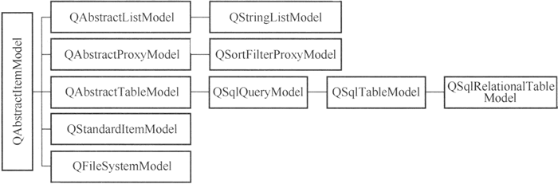

## Model/View（模型/视图）结构

### 简介

Model/View（模型/视图）结构是 Qt 中用界面组件显示与编辑数据的一种结构，视图（View）是显示和编辑数据的界面组件，模型（Model）是视图与原始数据之间的接口。

GUI 应用程序的一个很重要的功能是由用户在界面上编辑和修改数据，典型的如数据库应用程序。数据库应用程序中，用户在界面上执行各种操作，实际上是修改了界面组件所关联的数据库内的数据。

将界面组件与所编辑的数据分离开来，又通过数据源的方式连接起来，是处理界面与数据的一种较好的方式。Qt 使用 Model/View 结构来处理这种关系，Model/View 的基本结构如下图所示。


其中各部分的功能如下：

- 数据（Data）是实际的数据，如数据库的一个数据表或SQL查询结果，内存中的一个 StringList，或磁盘文件结构等。
- 视图或视图组件（View）是屏幕上的界面组件，视图从数据模型获得每个数据项的模型索引（model index），通过模型索引获取数据，然后为界面组件提供显示数据。Qt 提供一些现成的数据视图组件，如 QListView、QTreeView 和 QTableView 等。
- 模型或数据模型（Model）与实际数据通信，并为视图组件提供数据接口。它从原始数据提取需要的内容，用于视图组件进行显示和编辑。Qt 中有一些预定义的数据模型，如 QStringListModel 可作为 StringList 的数据模型，QSqlTableModel 可以作为数据库中一个数据表的数据模型。


由于数据源与显示界面通过 Model/View 结构分离开来，因此可以将一个数据模型在不同的视图中显示，也可以在不修改数据模型的情况下，设计特殊的视图组件。

在 Model/View 结构中，还提供了代理（Delegate）功能，代理功能可以让用户定制数据的界面显示和编辑方式。在标准的视图组件中，代理功能显示一个数据，当数据被编辑时，代理通过模型索引与数据模型通信，并为编辑数据提供一个编辑器，一般是一个 QLineEdit 组件。

模型、视图和代理之间使用信号和槽通信。当源数据发生变化时，数据模型发射信号通知视图组件；当用户在界面上操作数据时，视图组件发射信号表示这些操作信息；当编辑数据时，代理发射信号告知数据模型和视图组件编辑器的状态。

### 数据模型

所有的基于项数据的数据模型（Model）都是基于 QAbstractltemModel 类的，这个类定义了视图组件和代理存取数据的接口。数据无需存储在数据模型里，数据可以是其他类、文件、数据库或任何数据源。

Qt 中与数据模型相关的几个主要的类的层次结构如下图所



上图中的抽象类是不能直接使用的，需要由子类继承来实现一些纯虚函数。Qt 提供了一些模型类用于项数据处理，常见的几个见下表。

| Model 类                 | 用途                                                       |
| ------------------------ | ---------------------------------------------------------- |
| QStringListModel         | 用于处理字符串列表数据的数据模型类                         |
| QStandardltemModel       | 标准的基于项数据的数据模型类，每个项数据可以是任何数据类型 |
| QFileSy stemModel        | 计算机上文件系统的数据模型类                               |
| QSortFilterProxyModel    | 与其他数据模型结合，提供排序和过滤功能的数据模型类         |
| QSqlQueryModel           | 用于数据库SQL查询结果的数据模型类                          |
| QSqlTableModel           | 用于数据库的一个数据表的数据模型类                         |
| QSqlRelationalTableModel | 用于关系型数据表的数据模型类                               |

如果这些现有的模型类无法满足需求，用户可以从 QAbstractltemModel、QAbstractListModel 或 QAbstractTableModel 继承，生成自己定制的数据模型类。

### 视图组件

视图组件（View）就是显示数据模型的数据的界面组件，Qt 提供的视图组件如下：

- QListView：用于显示单列的列表数据，适用于一维数据的操作。
- QTreeView：用于显示树状结构数据，适用于树状结构数据的操作。
- QTableView：用于显示表格状数据，适用于二维表格型数据的操作。
- QColumnView：用多个QListView显示树状层次结构，树状结构的一层用一个QListView显示。
- QHeaderView：提供行表头或列表头的视图组件，如QTableView的行表头和列表头。


视图组件在显示数据时，只需调用视图类的 setModel() 函数，为视图组件设置一个数据模型就可以实现视图组件与数据模型之间的关联，在视图组件上的修改将自动保存到关联的数据模型里，一个数据模型可以同时在多个视图组件里显示数据。

前面介绍了 QListWidget、QTreeWidget 和 QtableWidget 3个可用于数据编辑的组件。这 3 个类称为便利类（convenience classes），它们分别是 3 个视图类的子类，其层次关系如下图所示。


用于 Model/View 结构的几个视图类直接从 QAbstract ItemView 继承而来，而便利类则从相应的视图类继承而来。

视图组件类的数据采用单独的数据模型，视图组件不存储数据。便利类则为组件的每个节点或单元格创建一个项（item），用项存储数据、格式设置等。所以，便利类没有数据模型，它实际上是用项的方式集成了数据模型的功能，这样就将界面与数据绑定了。

所以，便利类缺乏对大型数据源进行灵活处理的能力，适用于小型数据的显示和编辑。

### 代理（Delegate）

代理就是在视图组件上为编辑数据提供编辑器，如在表格组件中编辑一个单元格的数据时，缺省是使用一个 QLineEdit 编辑框。代理负责从数据模型获取相应的数据，然后显示在编辑器里，修改数据后，又将其保存到数据模型中。

QAbstractltemDelegate 是所有代理类的基类，作为抽象类，它不能直接使用。它的一个子类 QStyledltemDelegate，是 Qt 的视图组件缺省使用的代理类。

对于一些特殊的数据编辑需求，例如只允许输入整型数，使用一个 QSpinBox 作为代理组件更恰当，从列表中选择数据时使用一个 QComboBox 作为代理组件更好。这时，就可以从 QStyledltemDelegate 继承创建自定义代理类。

### Model/View结构的一些概念

在 Model/View 结构中，数据模型为视图组件和代理提供存取数据的标准接口。在 Qt 中，所有的数据模型类都从 QAbstractltemModel 继承而来，不管底层的数据结构是如何组织数据的，QAbstractltemModel 的子类都以表格的层次结构表示数据，视图组件通过这种规则来存取模型中的数据，但是表现给用户的形式不一样。


上图数据模型的 3 种常见表现形式。不管数据模型的表现形式是怎么样的，数据模型中存储数据的基本单元都是项（item），每个项有一个行号、一个列号，还有一个父项。在列表和表格模式下，所有的项都有一个相同的顶层项；在树状结构中，行号、列号、父项稍微复杂一点，但是由这 3 个参数完全可以定义一个项的位置，从而存取项的数据。

#### 模型索引（model index）

为了保证数据的表示与数据存取方式隔离，数据模型中引入了模型索引的概念。通过数据模型存取的每个数据都有一个模型索引，视图组件和代理都通过模型索引来获取数据。

QModelIndex 表示模型索引的类。模型索引提供数据存取的一个临时指针，用于通过数据模型提取或修改数据。因为模型内部组织数据的结构随时可能改变，所以模型索引是临时的。如果需要使用持久性的模型索引，则要使用 QPersistentModelIndex 类。

#### 行号和列号

数据模型的基本形式是用行和列定义的表格数据，但这并不意味着底层的数据是用二维数组存储的，使用行和列只是为了组件之间交互方便的一种规定。通过模型索引的行号和列号就可以存取数据。

要获得一个模型索引，必须提供 3 个参数：行号、列号、父项的模型索引。例如，对于如图 5 中的表格数据模型中的 3 个数据项 A、B、C，获取其模型索引的代码是：

```cpp
QModelIndex indexA = model->index(0, 0, QModelIndex());
QModelIndex indexB = model->index(1, 1, QModelIndex());
QModelIndex indexC = model->index(2, 1, QModelIndex());
```

在创建模型索引的函数中需要传递行号、列号和父项的模型索引。对于列表和表格模式的数据模型，顶层节点总是用 QModelIndex() 表示。

#### 父项

当数据模型是列表或表格时，使用行号、列号存储数据比较直观，所有数据项的父项就是顶层项；当数据模型是树状结构时，情况比较复杂（树状结构中，项一般习惯于称为节点），一个节点可以有父节点，也可以是其他节点的父节点，在构造数据项的模型索引时，必须指定正确的行号、列号和父节点。

对于图 5 中的树状数据模型，节点 A 和节点 C 的父节点是顶层节点，获取模型索引的代码是：

```cpp
QModelIndex indexA = model->index(0, 0, QModelIndex());
QModelIndex indexC = model->index(2, 1, QModelIndex());
```

但是，节点 B 的父节点是节点 A，节点 B 的模型索引由下面的代码生成：

```cpp
QModelIndex indexB = model->index(1, 0, indexA);
```


#### 项的角色

在为数据模型的一个项设置数据时，可以赋予其不同项的角色的数据。例如，数据模型类 QStandardItemModel 的项数据类是 QStandardItem，其设置数据的函数是：

void QStandardItem::setData(const QVariant &value, int role= Qt::UserRole + 1)

其中，value 是需要设置的数据，role 是设置数据的角色。一个项可以有不同角色的数据，用于不同的场合。

role 是 `Qt::ItemDataRole` 枚举类型，有多种取值，如 `Qt::DisplayRole` 角色是在视图组件中显示的字符串，`Qt::ToolTipRole` 是鼠标提示消息，`Qt::UserRole` 可以自定义数据。项的标准角色是 `Qt::DisplayRole`。

在获取一个项的数据时也需要指定角色，以获取不同角色的数据：

QVariant QStandardItem::data(int role = Qt::UserRole + 1) const

为一个项的不同角色定义数据，可以告知视图组件和代理组件如何显示数据。例如，在图 6 中，项的 DisplayRole 数据是显示的字符串，DecorationRole 是用于装饰显示的属性，ToolTipRole 定义了鼠标提示信息。不同的视图组件对各种角色数据的解释和显示可能不一样，也可能忽略某些角色的数据。


## 项目控件组(Item Widgets)

#### 1，列表控件(ListWidgt)

#### 2，树型控件(TreeWidget)

#### 3，表格控件(TableWidget)

[Qt之QListView使用](https://www.jianshu.com/p/670de4f63689)


## 模型/视图 如何使用

为了直观的看到效果，我们可以把listview、treeview、tableview同时使用，对同一个模型进行显示。

### 创建视图

```cpp
QListView*      listView    = new QListView;
QTreeView*      treeView    = new QTreeView;
QTableView*     tableView   = new QTableView;
//放进布局
QGridLayout* glayout = new QGridLayout(this);   
glayout->addWidget(new QLabel("listView"),0,0); 
glayout->addWidget(listView,1,0);               
glayout->addWidget(new QLabel("treeView"),0,1); 
glayout->addWidget(treeView,1,1);               
glayout->addWidget(new QLabel("tableView"),2,0);
glayout->addWidget(tableView,3,0);              
```

### 创建模型

创建model，并分别设置给view

```cpp
QStandardItemModel* model = new QStandardItemModel(this);
listView->setModel(model);
treeView->setModel(model);
tableView->setModel(model);
```

#### 添加项(数据)

+ 接口

```cpp
//追加
void appendColumn(const QList<QStandardItem *> &items)
void appendRow(const QList<QStandardItem *> &items)
void appendRow(QStandardItem *item)
//插入    
void insertColumn(int column, const QList<QStandardItem *> &items)
bool insertColumn(int column, const QModelIndex &parent = QModelIndex())
void insertRow(int row, const QList<QStandardItem *> &items)
void insertRow(int row, QStandardItem *item)
bool insertRow(int row, const QModelIndex &parent = QModelIndex()) 
//设置项    
void setItem(int row, int column, QStandardItem *item)
void setItem(int row, QStandardItem *item)
//添加空项
bool insertRow(int row, const QModelIndex &parent = QModelIndex())
virtual bool insertRows(int row, int count, const QModelIndex &parent = QModelIndex())   
bool insertColumn(int column, const QModelIndex &parent = QModelIndex())
virtual bool insertColumns(int column, int count, const QModelIndex &parent = QModelIndex())    
```

+ 案例-添加行数据

```cpp
model->appendRow(new QStandardItem("顽石"));
model->appendRow(new QStandardItem("强森"));
model->appendRow(new QStandardItem("里奇"));
model->appendRow(new QStandardItem("莫影"));

QStringList stuList;                        
stuList<<"young"<<"执着";                     
foreach(auto& stu , stuList)                
{                                           
   model->appendRow(new QStandardItem(stu));
}                                           
```

+ 案例-添加列数据

```cpp
QList<QStandardItem*> colItem_list;
foreach(auto& age ,QStringList()<<"20"<<"21"<<"22"<<"23")
{
    colItem_list.append(new QStandardItem(age));
}
model->appendColumn(colItem_list);
```


#### 小结：

添加列对于QListView是无效的，因为它只能显示一列，对于QTreeView和QTableView是可以的，所以在使用模型时，需要根据视图对模型进行添加数据。

#### 给item添加子项

给模型中的QStandardItem添加子项，只对QTreeView起作用

```cpp
QStandardItem* item = new QStandardItem("newItem");
                                                   
auto* subItem = new QStandardItem("one");          
subItem->appendRow(new QStandardItem("one_1"));    
subItem->appendRow(new QStandardItem("one_2"));    
                                                   
item->appendRow(subItem);                          
item->appendRow(new QStandardItem("two"));         
                                                   
model->appendRow(item);       

model->setItem(6,1,new QStandardItem("What"));
```


#### 删除项

```cpp
bool removeColumn(int column, const QModelIndex &parent = QModelIndex())
virtual bool removeColumns(int column, int count, const QModelIndex &parent = QModelIndex())
bool removeRow(int row, const QModelIndex &parent = QModelIndex())
virtual bool removeRows(int row, int count, const QModelIndex &parent = QModelIndex())    
        
//从model中移除指定的项(内存不会释放)，项会以列表的方式返回，需要自己删除    
QList<QStandardItem *> takeColumn(int column)
QStandardItem *takeHorizontalHeaderItem(int column)
QStandardItem *takeItem(int row, int column = 0)
QList<QStandardItem *> takeRow(int row)
QStandardItem *takeVerticalHeaderItem(int row)    
```

#### 获取项(查找、获取)

```cpp
//查找给定列中使用给定标志匹配给定文本的项列表。  
QList<QStandardItem *> findItems(const QString &text, Qt::MatchFlags flags = Qt::MatchExactly, int column = 0) const
    
//获取model的不可见根，注意：此项并不存在，是虚拟的，所以调用index是无效的
QStandardItem *invisibleRootItem() const
    
QStandardItem *item(int row, int column = 0) const
//通过下标获取项指针    
QStandardItem *itemFromIndex(const QModelIndex &index) const       
```

#### 获取项的下标

```cpp
//把元素添加进model之后，可以通过这个函数获取所在的下标
QModelIndex indexFromItem(const QStandardItem *item) const    
virtual QModelIndex index(int row, int column, const QModelIndex &parent = QModelIndex()) const override
```

#### 清空模型

```cpp
void clear()
```

### 表头数据(QTreeView、QTableView)

对于QTreeView、QTableView是可以显示表头的，接下来我们来设置表头。

```cpp
//设置水平头
void setHorizontalHeaderItem(int column, QStandardItem *item)
void setHorizontalHeaderLabels(const QStringList &labels)
//设置垂直头    
void setVerticalHeaderItem(int row, QStandardItem *item)
void setVerticalHeaderLabels(const QStringList &labels)    
//获取头部项指针
QStandardItem *horizontalHeaderItem(int column) const
QStandardItem *verticalHeaderItem(int row) const    
```

案例：

```cpp
//逐个添加水平头项
model->setHorizontalHeaderItem(0,new QStandardItem("姓名"));
//一次全部添加
model->setHorizontalHeaderLabels(QStringList()<<"姓名"<<"年龄");
//添加垂直头项...略
```


### 设置角色数据

模型中的每个项都有一组与之相关联的数据元素，每个元素都有自己的角色。 视图使用角色向模型指示它需要哪种类型的数据。 

```cpp
//给指定的index项设置对应角色的数据
virtual bool setData(const QModelIndex &index, const QVariant &value, int role = Qt::EditRole) override
virtual bool setHeaderData(int section, Qt::Orientation orientation, const QVariant &value, int role = Qt::EditRole) override
//可以同时给指定的index项设置多个（角色,数据）    
virtual bool setItemData(const QModelIndex &index, const QMap<int, QVariant> &roles) override
        
bool clearItemData(const QModelIndex &index)
    
virtual QVariant data(const QModelIndex &index, int role = Qt::DisplayRole) const override      
virtual QVariant headerData(int section, Qt::Orientation orientation, int role = Qt::DisplayRole) const override
virtual QMap<int, QVariant> itemData(const QModelIndex &index) const override
```

案例：

```cpp
//提示角色
model->setData(model->index(0,0),"tooltip",Qt::ToolTipRole);   

//装饰角色
QPixmap icon(16,16);                                                      
icon.fill(Qt::red);                                                       
model->setData(model->index(0,0),icon,Qt::DecorationRole);                
                                                                          
model->setHeaderData(0,Qt::Orientation::Horizontal,"header",Qt::ToolTipRole);
                                                                          
QMap<int,QVariant> role;                                                  
role.insert(Qt::ToolTipRole,"顽石牛逼");                                      
model->setItemData(model->index(0,1),role);                               
                                                                          
QVariant display = model->data(model->index(0,0));                        
QVariant tooltip = model->data(model->index(0,0),Qt::ToolTipRole);        
qDebug()<<display.toString()<<tooltip.toString();                         
//获取所有角色及对应的数据                                                                          
QMap<int,QVariant> decoration = model->itemData(model->index(0,0));       
qDebug()<<decoration.value(Qt::DisplayRole);   
qDebug()<<decoration.value(Qt::DecorationRole);  
...
```

设置项的角色数据，还可以直接通过QStandardItem的成员函数设置

```cpp
virtual void QStandardItem::setData(const QVariant &value, int role = Qt::UserRole + 1)
```


## 项目视图组(Item Views)

### 设置行的颜色交替变换

如果该属性为true，项目背景将使用QPalette::Base和QPalette::AlternateBase绘制; 否则，背景将使用QPalette::Base颜色绘制。  

```cpp
QPalette palette;                                                          
palette.setBrush(QPalette::ColorRole::Base, QColor(204, 213, 240));        
palette.setBrush(QPalette::ColorRole::AlternateBase, QColor(93, 107, 153));
tableView->setPalette(palette);                                            
                                                                           
tableView->setAlternatingRowColors(true);                                  
listView->setAlternatingRowColors(true);                                   
treeView->setAlternatingRowColors(true);                                   
```


### 拖拽

```cpp
m_tableView->setDragEnabled(true);	//启用拖拽
m_tableView->setDragDropMode(QTableView::DragDropMode::DragDrop);	//设置拖拽模式
```


### 启动编辑操作

什么情况下启动条目编辑的操作  

```cpp
m_tableView->setEditTriggers(QTableView::EditTrigger::NoEditTriggers);	//禁止编辑
```


### 设置选择行为

+ 默认是选中一个项，可以设置选择一行或者一列

```cpp
tableView->setSelectionBehavior(QTableView::SelectionBehavior::SelectRows);
```

+ 控制用户是否可以选择一个或多个项目，以及在多项目选择中，选择是否必须是连续的项目范围。  

```cpp
void setSelectionMode(QAbstractItemView::SelectionMode mode)
SelectionMode::SingleSelection	//单选
SelectionMode::MultiSelection	//多选
```


### 启用排序

```cpp
tableView->setSortingEnabled(true);
```

### QListView

+ 设置视图模式、布局流向以及视图调整大小时是否重新布局。

```cpp
//设置视图模式 列表模式 QListView::ListMode 图标模式 QListView::IconMode
void setViewMode(QListView::ViewMode mode)
//设置流布局方向
void setFlow(QListView::Flow flow)
//当视图调整大小时是否再次布局项。 如果此属性为Adjust，项目将重新布局。 如果值是Fixed，项目将不会被布局。      
void setResizeMode(QListView::ResizeMode mode)
```


+ 显示模型中的某一列

```cpp
void setModelColumn(int column)
```


+ 隐藏指定行

```cpp
void setRowHidden(int row, bool hide)
```

### QTableView

```cpp
//设置行高和列宽
void setRowHeight(int row, int height)
void setColumnWidth(int column, int width)
//设置行隐藏和列隐藏   
void setRowHidden(int row, bool hide)     
void setColumnHidden(int column, bool hide)    
//此属性用于保持左上角的按钮是否启用，单击此按钮将选择表格视图中的所有单元格。     
void setCornerButtonEnabled(bool enable)
//设置表格边框线样式    
void setGridStyle(Qt::PenStyle style)
//设置水平和垂直头    
void setHorizontalHeader(QHeaderView *header)
void setVerticalHeader(QHeaderView *header)
//是否启用对表的排序，并立即使用当前排序部分和顺序触发对sortByColumn()的调用  
void setSortingEnabled(bool enable)
//将(row, column)处的表元素的span设置为(rowSpanCount, columnSpanCount)指定的行数和列数。(合并单元格)      
void setSpan(int row, int column, int rowSpanCount, int columnSpanCount)
//是否在适当的时候换行文本
void setWordWrap(bool on)
    
//获取头视图
QHeaderView *horizontalHeader() const
QHeaderView *verticalHeader() const
```

### QTreeView

```cpp
//是否应该使用所有列显示键盘焦点(一行中的所有列都有焦点)  
void setAllColumnsShowFocus(bool enable)
//是否启用展开和折叠动画    
void setAnimated(bool enable)
//设置行隐藏    
void setRowHidden(int row, const QModelIndex &parent, bool hide)    
//设置列隐藏
void setColumnHidden(int column, bool hide)
//设置列宽度    
void setColumnWidth(int column, int width)
//将索引代表的项设置为折叠项或展开项  
void setExpanded(const QModelIndex &index, bool expanded)
//设置用户是否可以通过双击展开或折叠项。(默认为true，但是请先禁用编辑)  
void setExpandsOnDoubleClick(bool enable)
//是否显示时项的第一列数据跨越所有列，为true即只显示第一列数据，且占用所有列的位置，为false则显示所有列数据    
void setFirstColumnSpanned(int row, const QModelIndex &parent, bool span)
//设置头视图    
void setHeader(QHeaderView *header)
//设置头是否隐藏    
void setHeaderHidden(bool hide)
//此属性保存以树视图中每个级别的项目的像素为单位的缩进。 对于顶级项，缩进指定从视口边缘到第一列中的项的水平距离; 对于子项，它指定它们从父项的缩进。 调用settinentation()将停止更新，调用resettinentation()将恢复默认行为。      
void setIndentation(int i)
//用户是否可以交互展开和折叠项，默认为true
void setItemsExpandable(bool enable)
//此属性包含是否显示用于展开和折叠顶级项的控件,这可以使单个层次的树结构看起来像一个简单的项目列表。    
void setRootIsDecorated(bool show)
//启用排序，最好在所有项插入之后启用排序
void setSortingEnabled(bool enable)
//这指定树结构应该放在逻辑索引索引处。 如果设置为-1，那么树将始终遵循视觉索引0 (展开树的那个箭头的位置)  
void setTreePosition(int index)
//该属性用于保存树视图中的所有项是否具有相同的高度，只有确保视图中的所有项具有相同的高度时，该属性才应该设置为true。 这使视图能够进行一些优化。    
void setUniformRowHeights(bool uniform)
//如果此属性为true，则项目文本将在需要换行时换行;    
void setWordWrap(bool on)
```

