# Qt模型视图框架(Model/View)

## 简介

Qt模型视图框架是一种**设计模式**，用于分离数据的存储和展示，使得开发者可以更灵活地控制数据的显示方式和用户与数据的交互。这种框架基于模型-视图-控制器（MVC）设计模式，但在Qt中通常被称为模型/视图（Model/View）框架。

GUI 应用程序的一个很重要的功能是由用户在界面上编辑和修改数据，典型的如数据库应用程序。数据库应用程序中，用户在界面上执行各种操作，实际上是修改了界面组件所关联的数据库内的数据。

将界面组件与所编辑的数据分离开来，又通过数据源的方式连接起来，是处理界面与数据的一种较好的方式。Qt 使用 Model/View 结构来处理这种关系，Model/View 的基本结构如下图所示。

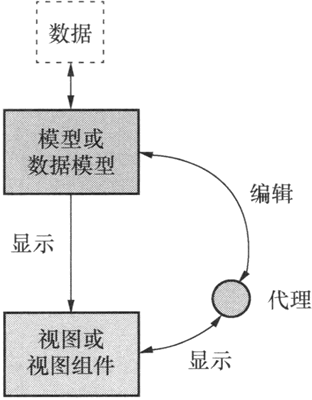

其中各部分的功能如下：

- **数据（Data）**是实际的数据，如数据库的一个数据表或SQL查询结果，内存中的一个 StringList，或磁盘文件结构等。
- **视图或视图组件（View）**是屏幕上的界面组件，视图从数据模型获得每个数据项的模型索引（model index），通过模型索引获取数据，然后为界面组件提供显示数据。Qt 提供一些现成的数据视图组件，如 QListView、QTreeView 和 QTableView 等。
- **模型或数据模型（Model）**与实际数据通信，并为视图组件提供数据接口。它从原始数据提取需要的内容，用于视图组件进行显示和编辑。Qt 中有一些预定义的数据模型，如 QStringListModel 可作为 StringList 的数据模型，QSqlTableModel 可以作为数据库中一个数据表的数据模型。


由于数据源与显示界面通过 Model/View 结构分离开来，因此可以将一个数据模型在不同的视图中显示，也可以在不修改数据模型的情况下，设计特殊的视图组件。

在 Model/View 结构中，还提供了代理（Delegate）功能，代理功能可以让用户定制数据的界面显示和编辑方式。在标准的视图组件中，代理功能显示一个数据，当数据被编辑时，代理通过模型索引与数据模型通信，并为编辑数据提供一个编辑器，一般是一个 QLineEdit 组件。

模型、视图和代理之间使用信号和槽通信。当源数据发生变化时，数据模型发射信号通知视图组件；当用户在界面上操作数据时，视图组件发射信号表示这些操作信息；当编辑数据时，代理发射信号告知数据模型和视图组件编辑器的状态。

### 模型（Model）

模型是应用程序中用于**管理数据**的部分。在Qt中，所有模型都基于`QAbstractItemModel`类。模型提供了一个接口，允许视图和委托（代理）访问数据。数据本身可以存储在模型之外的任何地方，例如单独的类、文件、数据库或其他数据结构中。Qt提供了一些现成的模型，如`QStringListModel`、`QStandardItemModel`、`QFileSystemModel`和`QSqlQueryModel`等，这些模型可以用于处理不同类型的数据项。

Qt 中与数据模型相关的几个主要的类的层次结构如下图所：

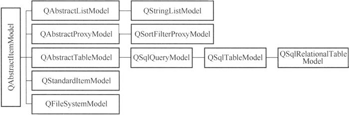

如果这些现有的模型类无法满足需求，用户可以从 QAbstractltemModel、QAbstractListModel 或 QAbstractTableModel 继承，生成自己定制的数据模型类。

### 视图（View）

视图是用户界面中展示数据的部分。Qt为不同类型的视图提供了完整的实现，包括`QListView`、`QTableView`和`QTreeView`。这些视图类都基于`QAbstractItemView`抽象基类。视图使用模型提供的数据接口来获取数据，并将其呈现给用户。视图还负责处理用户输入，如选择和编辑数据项。

视图组件在显示数据时，只需调用视图类的 setModel() 函数，为视图组件设置一个数据模型就可以实现视图组件与数据模型之间的关联，在视图组件上的修改将自动保存到关联的数据模型里，一个数据模型可以同时在多个视图组件里显示数据。

Qt 中与视图相关的几个主要的类的层次结构如下图所：

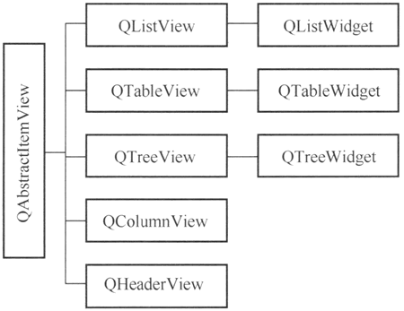

视图组件类的数据采用单独的数据模型，视图组件不存储数据。

### 委托（Delegate）

委托是模型/视图框架中用于**自定义数据项呈现和编辑方式的组件**。`QAbstractItemDelegate`是所有委托类的基类。Qt的标准视图使用`QStyledItemDelegate`作为默认委托，它根据当前样式绘制项目。如果需要自定义数据项的编辑方式，可以从`QStyledItemDelegate`继承创建自定义委托类。


### 便利类（Convenience Classes）

Qt还提供了一些便利类，如`QListWidget`、`QTreeWidget`和`QTableWidget`，这些类是从标准视图类派生出来的，它们提供了简化的接口用于处理项目视图中的数据。这些便利类不如视图类灵活，并且不能与任意模型一起使用。因此，建议在可能的情况下使用模型/视图方法来处理数据。

> 便利类为组件的每个节点或单元格创建一个项（item），用项存储数据、格式设置等。所以，便利类缺乏对大型数据源进行灵活处理的能力，适用于小型数据的显示和编辑。

## 模型类

在学习如何选择对应模型之前，先了解一下模型/视图框架中所用到的概念是有必要的。

### 基本概念

在 Model/View 结构中，数据模型为视图组件和代理提供存取数据的标准接口。在 Qt 中，所有的数据模型类都从 QAbstractltemModel 继承而来，不管底层的数据结构是如何组织数据的，QAbstractltemModel 的子类都**以表格的层次结构表示数据**，视图组件通过这种规则来存取模型中的数据，但是表现给用户的形式不一样。

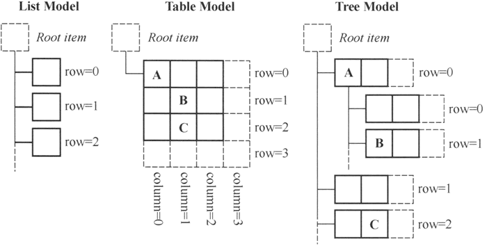

模型通过**信号和插槽机制**将数据的任何更改通知给任何附加的视图。

本节描述了一些基本概念，这些概念对于其他组件通过模型类访问数据项的方式至关重要。更高级的概念将在后面的章节中讨论。

### 模型索引（Model Indexes）

为了保证数据的表示与数据存取方式隔离，数据模型中引入了模型索引的概念。通过数据模型存取的每个数据都有一个模型索引，视图组件和代理都通过模型索引来获取数据。

因此，只有模型需要知道如何获取数据，而模型所管理的数据类型可以进行较为宽泛的定义。模型索引包含指向创建该索引的模型的指针，这在处理多个模型时可避免混淆。

```cpp
 QAbstractItemModel *model = index.model();
```

模型索引为信息片段提供了临时的引用，并可用于通过模型来检索或修改数据。由于模型可能会不时地重新组织其内部结构，因此模型索引可能会失效，不应被存储。如果需要对某一信息进行长期的引用，则必须创建持久的模型索引。这为模型所保存的保持最新状态的信息提供了引用。临时模型索引由 QModelIndex 类提供，而持久模型索引由 QPersistentModelIndex 类提供。

要获取与某一数据项相对应的模型索引，必须向模型指定**三个属性**：**行号**、**列号**以及**父项的模型索引**。下面将详细描述并解释这些属性。

### 行号和列号（Rows and columns）

数据模型的基本形式是用行和列定义的表格数据，但这并不意味着底层的数据是用二维数组存储的，使用行和列只是为了组件之间交互方便的一种规定。通过模型索引的行号和列号就可以存取数据。

```cpp
 QModelIndex index = model->index(row, column, ...);
```

表格模型的示意图如下：

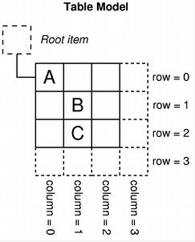

该图表展示了基本表格模型的示意图，其中每个项目都通过行号和列号这一对数字来定位。我们通过将相关的行号和列号传递给模型来获取一个模型索引，该索引可指向数据项。

```cpp
 QModelIndex indexA = model->index(0, 0, QModelIndex());
 QModelIndex indexB = model->index(1, 1, QModelIndex());
 QModelIndex indexC = model->index(2, 1, QModelIndex());
```

因为所有行都之后一个共有的`RootItem`，所以index函数中的父项直接指定`QModelIndex()`即可，也可以忽略不写。

### 父项（Parent of items）

当数据模型是列表或表格时，使用行号、列号存储数据比较直观，所有数据项的父项就是顶层项；当数据模型是树状结构时，情况比较复杂（树状结构中，项一般习惯于称为节点），一个节点可以有父节点，也可以是其他节点的父节点，在构造数据项的模型索引时，必须指定正确的行号、列号和父节点。

在获取模型的索引时，我们必须提供有关该项父项的一些信息。在模型之外，要引用一个项，唯一的途径就是通过模型索引来实现，因此还必须提供父项的模型索引：

```cpp
 QModelIndex index = model->index(row, column, parent);
```

树模型的示意图如下：

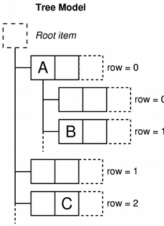

该图表展示了树模型的示意图，其中每个项目都通过其父项、行号和列号来标识。在该模型中，“A”和“C”这两个项目被表示为处于顶层的兄弟项：

```cpp
 QModelIndex indexA = model->index(0, 0, QModelIndex());
 QModelIndex indexC = model->index(2, 1, QModelIndex());
```

项 "A”有若干子项。获取“项目 B”的模型索引可使用以下代码：

```cpp
 QModelIndex indexB = model->index(1, 0, indexA);
```

### 项角色（Item roles）

在为数据模型的一个项设置数据时，可以赋予其不同项的角色的数据。例如，Qt:：DisplayRole 用于访问可在视图中以文本形式显示的字符串。通常，项目包含多个不同角色的数据，而标准角色由 Qt::ItemDataRole 定义。

我们可以通过向模型传递与该物品相对应的模型索引，并指定一个角色来获取我们所需数据的类型，从而向模型请求该物品的相关数据：

我们可以通过`data`函数来获取对应的角色，通过`setData`给指定的角色设置数据。

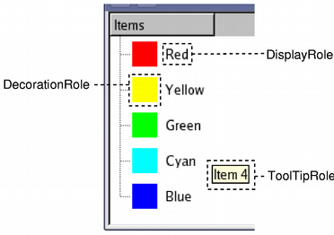

该角色会向模型指示所引用的数据类型。视图可以以不同的方式展示这些角色，因此为每个角色提供适当的信息非常重要。

## 模型视图框架使用

### QListView使用

QListView 是 Qt 中的一个视图类，专门用于展示列表数据。它支持多种视图模式，包括列表视图（List View）和图标视图（Icon View），允许开发者根据需求选择合适的展示方式。QListView 通过与数据模型（如 QStringListModel、QStandardItemModel）配合使用，实现了数据与视图的分离，提高了应用程序的灵活性和可维护性。

#### 创建QListView和Model

要使用 QListView，首先需要创建一个 QListView 控件和一个数据模型。数据模型可以是 Qt 提供的标准模型（如 QStringListModel、QStandardItemModel），也可以是自定义的模型。以下是一个简单的示例代码，展示了如何创建 QListView 和 QStringListModel 并将其关联起来：
```cpp
    m_listView = new QListView(this);
    m_model = new QStringListModel(this);
    m_model->setStringList(QStringList() << "item1" << "item2" << "item3");
    m_listView->setModel(m_model);
```

为了后续界面处理，还使用水平布局：

```cpp
    auto hlayout = new QHBoxLayout(this);
    hlayout->setContentsMargins(0, 0, 0, 0);
    hlayout->addWidget(m_listView);
    hlayout->addStretch(1);
```

效果如下：

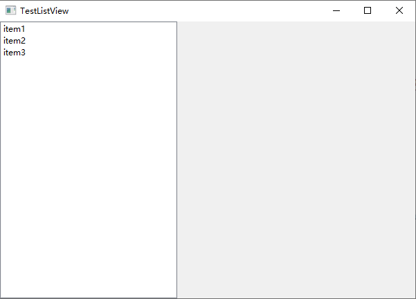

#### 设置QListView属性

QListView 提供了多种属性设置，用于控制其外观和行为。

##### 编辑触发器

默认情况下，QListView的Item是可以被编辑的，鼠标左双击item即可进入编辑模式。通过` editTriggers()`和`setEditTriggers()`函数可以获取和设置编辑触发器。

```cpp
m_listView->setEditTriggers(QAbstractItemView::NoEditTriggers);
```

一般来说，我们设置为禁止编辑触发器，这样视图就只负责展示数据即可，修改数据通过别的方式实现。

##### 选择模式

默认情况下，QListView只能有一个item被选择，而要实现多选，需要通过` selectionMode()`和`setSelectionMode()`函数来获取和设置选择模式。

```cpp
m_listView->setSelectionMode(QAbstractItemView::SingleSelection);
```

选择模式包括如下几种：

| 常量                                   | 值   | 描述                                                         |
| -------------------------------------- | ---- | ------------------------------------------------------------ |
| QAbstractItemView::SingleSelection     | 1    | 当用户选择一个项目时，之前被选中的项目就会自动取消选中状态。 |
| QAbstractItemView::ContiguousSelection | 4    | 如果用户在点击项目时同时按下 Shift 键，那么当前项目和被点击项目之间的所有项目都会被选中或取消选中，具体取决于被点击项目的当前状态。 |
| QAbstractItemView::ExtendedSelection   | 3    | 如果用户在点击一个项目时按下 Ctrl 键，那么被点击的项目会切换状态，而其他所有项目则不会受到影响。如果用户在点击一个项目时按下 Shift 键，那么从当前项目到被点击项目的所有项目都会被选中或取消选中，具体取决于被点击项目的状态。可以通过用鼠标拖动来选择多个项目。 |
| QAbstractItemView::MultiSelection      | 2    | 当用户以常规方式选择一个项目时，该项目的选中状态会被切换，而其他项目则保持不变。可以通过用鼠标拖动多个项目来同时切换多个项目的选中状态。 |
| QAbstractItemView::NoSelection         | 0    | 无法选择项目。                                               |

当设置为可以通过鼠标拖动来选择多个item时，可以设置是否显示选择矩形：

```cpp
    m_listView->setSelectionRectVisible(false);
```

##### 选择行为

默认情况下，QListView只选择被点击的item，而要实现选择一行或者一列，需要通过` selectionBehavior()`和`setSelectionBehavior()`函数来获取和设置选择行为。

```cpp
m_listView->setSelectionBehavior(QAbstractItemView::SelectColumns);
```

选择行为包括如下三种：

| 常量                             | 值   | 描述         |
| -------------------------------- | ---- | ------------ |
| QAbstractItemView::SelectItems   | 0    | 选择单个项。 |
| QAbstractItemView::SelectRows    | 1    | 选择一行。   |
| QAbstractItemView::SelectColumns | 2    | 选择一列。   |

##### 设置Item间距

默认情况下，QListView的每个item是紧密连在一起的，而要每个item之间间隔一定的距离，需要通过` spacing()`和`setSpacing()`函数来获取和设置。

```cpp
m_listView->setSpacing(10);
```

##### 设置视图模式

默认情况下，QListView是以列表模式显示的数据，我们还可以通过` viewMode()`和`setViewMode()`函数来获取和设置视图模式。

```cpp
m_listView->setViewMode(QListView::IconMode);
```

当设置为图标模式之后，还可以设置流动模式，流动模式是指icon的排列方向，有两种`    enum Flow { LeftToRight, TopToBottom };`。

```cpp
m_listView->setFlow(QListView::Flow::LeftToRight);
```

还可以设置调整大小模式，默认情况下，当QListView大小调整之后，item的位置是不会进行重新调整的，需要设置一下：

```cpp
m_listView->setResizeMode(QListView::Adjust);
```

#### 处理用户交互(信号)

QListView 支持多种用户交互方式，如点击、双击、鼠标进入等。开发者可以通过连接信号和槽来处理这些交互。例如，可以连接clicked信号来处理项被点击的事件：

```cpp
    //item激活一般是鼠标点击或者双击
	connect(m_listView, &QListView::activated, this, [](const QModelIndex& index) {
		qDebug() << "activated:" << index.data(Qt::ItemDataRole::DisplayRole).toString();
        });

    connect(m_listView, &QListView::clicked, this, [](const QModelIndex& index) {
		qDebug() << "clicked:" << index.data(Qt::ItemDataRole::DisplayRole).toString();
        });

    connect(m_listView, &QListView::doubleClicked, this, [](const QModelIndex& index) {
		qDebug() << "double clicked:" << index.data(Qt::ItemDataRole::DisplayRole).toString();
        });
	//当鼠标指针进入由索引指定的项目时，就会发出此信号。要使此功能生效，需要启用鼠标跟踪功能。
    connect(m_listView, &QListView::entered, this, [](const QModelIndex& index) {
		qDebug() << "entered:" << index.data(Qt::ItemDataRole::DisplayRole).toString();
        });

    connect(m_listView, &QListView::pressed, this, [](const QModelIndex& index) {
		qDebug() << "pressed:" << index.data(Qt::ItemDataRole::DisplayRole).toString();
        });

	//当鼠标指针进入视口时，会发出此信号。要使此功能生效，需要开启鼠标追踪功能。
    connect(m_listView, &QListView::viewportEntered, this, [this]() {
		qDebug() << "viewportEntered:" << m_listView->viewport()->geometry();
        });
```

#### 样式设置

QListView的样式分为整体样式以及item单独样式设置。

##### QListView整体样式

###### 基本样式

基本样式就是对这个控件背景、颜色、字体等进行设置。

```css
QListView{
    background-color: #E6E7E8;
    color:black;
    border:none;
    font-size:12pt;
}
```

###### item交替背景颜色

先通过代码设置启用交替颜色：

```cpp
m_listView->setAlternatingRowColors(true);
```

然后在css中设置交替变换的颜色即可：

```css
QListView{
    background-color: #E6E7E8;
    alternate-background-color: #878787;	/*交替颜色*/
    color:black;
    border:none;
    font-size:12pt;
}
```

效果如下：

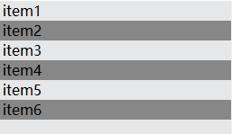

###### 去除焦点框

在 Qt 中去除 QListView 选中时的焦点框（通常指选中项周围的虚线矩形），可以通过**样式表**或**设置焦点策略**两种方式实现。

```css
    QListView {
       outline: none;           /*去除焦点虚线框*/
    }
```


##### Item样式

还可以对item进行单独设置。

###### 交替颜色伪状态

对拥有交替变色的item进行单独设置：

```css
QListView::item:alternate{
    background-color: blue;
    color:white;
}
```

效果如下：

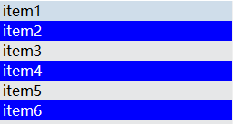

###### 选中状态

选中时的背景颜色也是可以修改的：

```cpp
QListView::item:selected{
    background-color: green;
    color:white;
}
```

效果如下：

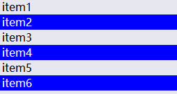

###### 鼠标悬停

```cpp
QListView::item:hover{
    background-color: pink;
}
```

效果如下：

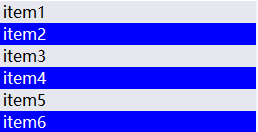

### QStandardItemModel

`QStandardItemModel` 是 Qt 中一个通用的**树形数据模型**类，可以把它理解为一个可以存储多行、多列、带层级数据的“表格库”。

它非常适合在**不使用数据库**或**没有自定义数据结构**时，为 `QTreeView`、`QTableView`、`QListView` 等视图类快速提供数据。

它的核心组成很简单：

1. **QStandardItemModel**：数据容器本身。
2. **QStandardItem**：容器中的每个单元格数据项。可以设置文本、图标、复选框、对齐方式、是否可编辑等状态。

#### 创建模型

创建模型，并将模型设置给QListView。

```cpp
QStandardItemModel* model = new QStandardItemModel(this);
```

给模型添加数据，数据需要使用`QStandardItem`对象保存。

```cpp
model->appendRow(new QStandardItem("item1"));
model->appendRow(new QStandardItem("item2"));
model->appendRow(new QStandardItem("item3"));
model->appendRow(new QStandardItem("item4"));
model->appendRow(new QStandardItem("item5"));
model->appendRow(new QStandardItem("item6"));
```

#### 文本对齐

通过设置`Qt::TextAlignmentRole`文本对齐角色，可以让文本在item中进行对齐；如让文本居中设置如下：

```cpp
//遍历所有行
for (int i = 0; i < model->rowCount(); i++) {
    //根据行列获取模型索引
    auto index = model->index(i, 0);
    //设置文本对齐角色为居中
	model->setData(index,Qt::AlignCenter, Qt::TextAlignmentRole);
}
```

#### 删除Item

删除item会将item从模型中移除掉，并且视图中也会移除掉。

```cpp
    //删除一行item
    model->removeRow(0);
    model->removeRows(2, 3);
	//删除一列item
    model->removeColumn(0);
```

#### 取出Item

删除item只会将item从模型中移除掉，视图中原来的位置将会是空，再次获取item也是nullptr。

```cpp
    //只拿取item，而不删除对应的View行
    auto item = model->takeItem(0);
    if (item) {
        //手动释放
        delete item;
    }
    //再次获取就是nullptr
    item = model->item(0);
    if (!item) {
        qDebug() << "item is null";
    }
```

可以通过setItem重新设置一个新的item上去：

```cpp
    item = new QStandardItem("item00");
    item->setTextAlignment(Qt::AlignCenter);
    model->setItem(0, item);
```

#### 查找Item

通过`findItems`函数可以查找满足条件的item。

```cpp
    //常规匹配
    qDebug() << "base match:";
    QList<QStandardItem*> items =  model->findItems("item2");
    for(auto item : items) {
        qDebug() << item->text();
    }

    //通配符(?匹配一个字符，*匹配任意个字符)
    qDebug() << "wild card match:";
    items =  model->findItems("item?",Qt::MatchWildcard);
    for(auto item : items) {
        qDebug() << item->text();
    }

    //正则匹配
    qDebug() << "regex match:";
    items =  model->findItems("^.+00$",Qt::MatchRegularExpression); //匹配任意个任意字符开头，00结尾的item
    for(auto item : items) {
        qDebug() << item->text();
    }
```

#### Item和索引的获取

```cpp
        //根据行列获取索引
        auto index = model->index(0, 0);
        if (index.isValid()) {
			qDebug() << index.row() << index.column() << index.data(Qt::DisplayRole).toString();
        }
        //根据行列获取item
        auto item = model->item(0, 0);
        if (item) {
            qDebug() << item->text();
        }

        //根据索引获取item
        item = model->itemFromIndex(index);
        if (item) {
			//item也可以直接访问行列
			qDebug() << item->row() << item->column() << item->text();
        }

        //根据item获取索引
        index = model->indexFromItem(item);
        if (index.isValid()) {
			qDebug() << index.row() << index.column() << index.data(Qt::DisplayRole).toString();
        }
```

### QTableView

QTableView是Qt框架中非常重要的一个控件，专门用于展示和编辑二维表格数据。 

#### 创建QTableView和Model

```cpp
        m_tableView = new QTableView(this);
        m_tableModel = new QStandardItemModel(this);

        m_tableView->setModel(m_tableModel);
		m_tableView->setEditTriggers(QAbstractItemView::NoEditTriggers);
```

#### 添加数据

```cpp
        for (int i = 0; i < 10; i++) {
            QList<QStandardItem*> items;
            items.append(new QStandardItem(QString("100%1").arg(i)));
			items.append(new QStandardItem(QString("maye_%1").arg(QChar('A' + QRandomGenerator::global()->bounded(0, 26)))));
            items.append(new QStandardItem(QString::number(QRandomGenerator::global()->bounded(10,30))));
			items.append(new QStandardItem(i % 2 == 0 ? "女" : "男"));

            m_tableModel->appendRow(items);
        }
```

#### 表头设置

QTableView有两个表头，分别是水平表头和垂直表头。

##### 隐藏/显示表头

先获取表头，然后调用hide或show隐藏或显示：

```cpp
        m_tableView->horizontalHeader()->hide();
        m_tableView->verticalHeader()->hide();
```

##### 设置表头数据

###### 水平表头

通过`setHorizontalHeaderItem`函数可以设置指定列的表头：

```cpp
        m_tableModel->setHorizontalHeaderItem(0, new QStandardItem("学号"));
		m_tableModel->setHorizontalHeaderItem(1, new QStandardItem("姓名"));
        m_tableModel->setHorizontalHeaderItem(2, new QStandardItem("年龄"));
        m_tableModel->setHorizontalHeaderItem(3, new QStandardItem("性别"));
```

上面方法比较麻烦，如果就是简单设置表头可以使用`setHorizontalHeaderLabels`更加方便：

```cpp
        m_tableModel->setHorizontalHeaderLabels({"学号", "姓名", "年龄", "性别"});
```

当然，还有一种方法设置表头：

```cpp
        m_tableModel->setHeaderData(0, Qt::Horizontal, "编号");
```

###### 垂直表头

垂直表头和水平表头设置方法类似:

```cpp
        m_tableModel->setVerticalHeaderItem(0, new QStandardItem("zero"));
        m_tableModel->setVerticalHeaderItem(1, new QStandardItem("one"));
        m_tableModel->setVerticalHeaderItem(2, new QStandardItem("two"));
        m_tableModel->setVerticalHeaderItem(3, new QStandardItem("three"));
        m_tableModel->setVerticalHeaderItem(4, new QStandardItem("four"));
        m_tableModel->setVerticalHeaderItem(5, new QStandardItem("five"));
        m_tableModel->setVerticalHeaderItem(6, new QStandardItem("six"));
        m_tableModel->setVerticalHeaderItem(7, new QStandardItem("seven"));
        m_tableModel->setVerticalHeaderItem(8, new QStandardItem("eight"));
        m_tableModel->setVerticalHeaderItem(9, new QStandardItem("nine"));
        m_tableModel->setVerticalHeaderItem(10, new QStandardItem("ten"));
```

批量设置：

```cpp
        m_tableModel->setVerticalHeaderLabels({"zero", "one", "two", "three", "four", "five", "six", "seven", "eight", "nine", "ten"});
```

另一个方法：

```cpp
        m_tableModel->setHeaderData(0, Qt::Vertical, "第一个");
```

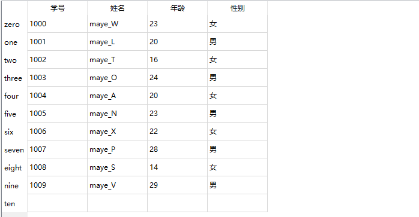

###### 水平头大小调整模式

默认情况下，水平表头不会铺满QTableView，需要调整水平头的大小调整模式：

```cpp
        m_tableView->horizontalHeader()->setSectionResizeMode(QHeaderView::Stretch);
```

效果如下：

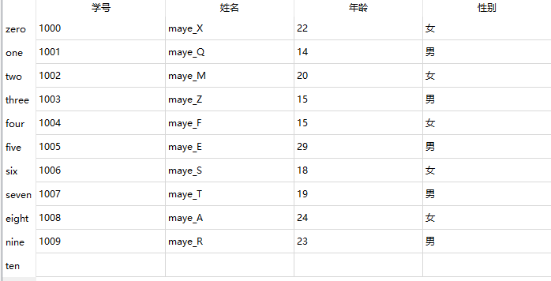

##### 网格线

##### 选择模式和行为