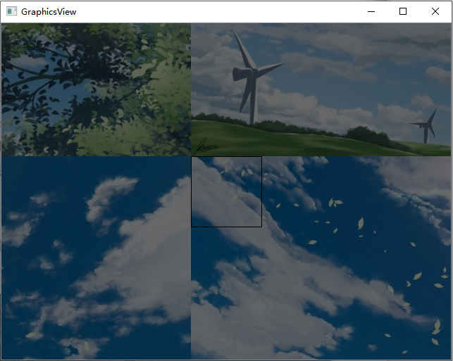

Qt提供了图形视图框架(Graphics View Framework)、动画框架(The AnimationFramework)和状态机框架(The State Machine Framework)来实现更加高级的图形和动画应用。使用这些框架可以快速设计出动态GUI应用程序和各种动画，游戏程序。

## 简介

前面讲paintEvent2D绘图时已经可以绘制出各种图形，并且进行简单的控制。不过，如果要绘制成千上万相同或者不同的图形，并且对它们进行控制，比如拖动这些图形、检测它们的位置以及判断它们是否相互碰撞等，使用以前的方法就很难完成了。这时可以使用Qt提供的图形视图框架来进行设计。

图形视图框架提供了一个基于图形项的模型视图编程方法，主要由场景、视图和图形项三部分组成，这三部分分别由QGraphicsScene，QGraphicsView和 QGraphicsItem这3个类来表示。多个视图可以查看一个场景，场景中包含各种各样几何形状的图形项。

图形视图框架可以管理数量庞大的自定义2D图形项，并且可以与它们进行交互。使用视图部件可以使这些图形项可视化，视图还支持缩放和旋转。框架中包含了一个事件传播构架，提供了和场景中的图形项进行精确的双精度交互的能力，图形项可以处理键盘事件，鼠标的按下，移动，释放和双击事件，还可以跟踪鼠标的移动。

图形视图框架使用一个BSP(Binary Space Partitioning)树来快速发现图形项，也正是因为如此，它可以实时显示一个巨大的场景，甚至包含上百万个图形项。本节的内容可以在帮助中通过Graphics View Framework关键字查看。


## 场景：QGraphicsScene

QGraphicsScene类提供了一个管理大量2D图形项的场景，场景有以下职责:

+ 提供一个快速的接口，用于管理大量图元。
+ 向每个图元传递事件
+ 管理图元的状态，如:选中、焦点处理
+ 提供未进行坐标转换的渲染功能，主要用于打印

场景是QGraphicsltem对象的容器。调用QGraphicsScene::addltem()将图元添加到场景中后，你就可以通过调用场景中的不同的查找函数来查找其中的图元。

QGraphicsScene:.items()函数及其重载函数可以返回所有图元，包括:点、矩形、多边形、通用矢量路径。

QGraphicsScene:itemAt()返回在特定点上最上面的图元。所有找到的图元按照层叠递减的排列顺序(即:最先返回的图元是最顶层的，最后返回的则是最底层的)。

```cpp
#include <QApplication>
#include <QGraphicsScene>
#include <QGraphicsView>
#include <QGraphicsRectItem>
#include <QDebug>
int main(int argc， char *argv[])
{
    QApplication a(argc， argv);
    //新建场景
    QGraphicsScene* secne = new QGraphicsScene;
    //创建图形项
    QGraphicsRectItem* rectItem = new QGraphicsRectItem(0，0，100，100);
    //将图形项添加到场景中
    secne->addItem(rectItem);
    //输出（50，50）点出的图形项
    qDebug()<<secne->itemAt(50，50，QTransform());

    return a.exec();
}
```

这里先创建了一个场景，然后创建了一个矩形图形项，并且将该图形项添加到了场景中。然后使用itemAt()函数返回指定坐标处最顶层的图形项，这里返回的就是刚才添加的矩形图形项。现在可以运行程序，不过因为还没有设置视图，所以不会出现任何图形界面。这时可以在应用程序输出栏中看到输出项目的信息，要关闭运行的程序，则可以按下应用程序输出栏上的红色按钮，然后强行关闭应用程序。

QGraphicsScene的事件传播构架可以将场景事件传递给图形项，也可以管理图形项之间事件的传播。例如，如果场景在一个特定的点接收到了一个鼠标按下事件，那么场景就会将这个事件传递给该点的图形项。

QGraphicsScene也用来管理图形项的状态，如图形项的选择和焦点等。可以通过向QGraphicsScene: :setSelectionArea()函数传递一个任意的形状来选择场景中指定的图形项。如果要获取当前选取的所有图形项的列表，则可以使用QGraphicsScene: :selectedItems()函数。另外可以调用QGraphicsScene: : setFocusItem()或者QGraphicsScene: : setFocus()函数来为一个图形项设置焦点，调用QGraphicsScene : : focus-Item()函数获取当前获得焦点的图形项。

QGraphicsScene也可以使用QGraphicsScene: : render()函数将场景中的一部分渲染到一个绘图设备上。这里讲到的这些函数会在后面的内容中看到它们的应用。

## 视图：QGraphicsView

QGraphicsView提供了视图部件，它用来使场景中的内容可视化。视图部件是一个可滚动的区域，它提供了一个滚动条来浏览大的场景。可以使用setDragMode()函数以QGraphicsView : :ScrollHandDrag 为参数来使光标变为手掌形状，从而可以拖动场景。如果设置setDragMode()的参数为QGraphicsView :: RubberBandDrag，那么可以在视图上使用鼠标拖出橡皮筋框来选择图形项。默认的QGraphicsView提供了一个QWidget作为视口部件，如果要使用OpenGL进行渲染，则可以调用QGraphicsView : : setViewport()设置QOpenGLWidget作为视口。

```cpp
//创建视图
QGraphicsView view(secne);
//view.setScene(secne);    //也可以这样设置场景
//设置场景的前景色
view.setForegroundBrush(QColor(255，255，0，100));
//设置场景的背景色
 view.setBackgroundBrush(QPixmap("://images/background.png"));
view.resize(640，480);
view.show();
```

这里新建了视图部件，并指定了要可视化的场景。然后为该视图设置了场景前景色和背景图片。一个场景分为3层:图形项层(ItemLayer)、前景层(ForegroundLayer)和背景层(BackgroundLayer)。场景的绘制总是从背景层开始，然后是图形项层，最后是前景层。前景层和背景层都可以使用QBrush进行填充，比如使用渐变和贴图等。

代码中使用了QGraphicsView类中的函数设置了场景中的背景和前景，其实也可以使用QGraphicsScene 中的同名函数来实现，不过它们的效果并不完全一样。如果使用QGraphicsScene对象设置了场景背景或者前景，那么对所有关联了该场景的视图都有效，而QGraphicsView对象设置的场景的背景或者前景只对它本身对应的视图有效。可以在这里的代码后面再添加如下代码:

```cpp
QGraphicsView view2(secne);
view2.resize(640，480);
view2.show();
```

这时运行程序会出现两个视图，但是第二个视图中的背景是白色的。然后将前面使用view对象设置背景和前景的代码更改为:

```cpp
//设置场景的前景色                                                     
secne->setForegroundBrush(QColor(0，0，0，150));                  
//设置场景的背景色                                                     
secne->setBackgroundBrush(QPixmap("://images/background.png"));
```

这时再运行程序可以发现，两个视图的背景和前景都一样了。当然，使用视图对象来设置场景背景的好处是可以在多个视图中使用不同的背景和前景来实现特定的效果。

最后设置了视图的大小，并调用show()函数来显示视图。现在场景中的内容就可以在图形界面中显示出来了，运行程序，效果如图所示。可以看到矩形图形项和背景图片都是在视图中间部分绘制，这个问题会在坐标系统部分详细讲解。



视图从键盘或者鼠标接收输人事件，然后会在发送这些事件到可视化的场景之前将它们转换为场景事件(将坐标转换为合适的场景坐标)。另外，使用视图的变换矩阵函数QGraphicsView : : transform（()时，可以通过视图来变换场景的坐标系统，这样便可以实现比如缩放和旋转等高级的导航功能。

## 图元：QGraphicsItem

QGraphicsItem是场景中图形项的基类。图形视图框架为典型的形状提供了标准的图形项，比如矩形(QGraphicsRectlem)、椭圆(QGraphicsEllipseItem)和文本项(QGraphicsTextItcm)等。不过，只有编写自定义的图形项时才能发挥QGraphicsItem的强大功能。QGraphicsItem主要支持如下功能：

+ 鼠标按下，移动、释放，双击、悬停、滚轮和右键菜单事件;
+ 键盘输入焦点和键盘事件;
+ 拖放事件;
+ 分组，使用QGraphicsItemGroup通过parent-child关系来实现;>
+ 碰撞检测。

除此之外，图形项还可以存储自定义的数据，可以使用setData()进行数据存储，然后使用data()获取其中的数据。

### 自定义图形项

新建类文件，在头文件中加入如下代码：创建一个绘制三角形的Item

```cpp
#ifndef GRAPHICSTRIANGLEITEM_H
#define GRAPHICSTRIANGLEITEM_H

#include<QGraphicsItem>
class GraphicsTriangleItem:public QGraphicsItem
{
public:
    GraphicsTriangleItem(int w，int h);
    QRectF boundingRect()const override;
    void paint(QPainter *painter， const QStyleOptionGraphicsItem *option， QWidget *widget)override;
private:
    int m_w;
    int m_h;
};

#endif // GRAPHICSTRIANGLEITEM_H
```

再到.cpp文件添加实现

```cpp
#include "GraphicsTriangleItem.h"
#include<QPainter>
GraphicsTriangleItem::GraphicsTriangleItem(int x，int y，int w，int h)
    :m_w(w)，m_h(h)
{

}

QRectF GraphicsTriangleItem::boundingRect() const
{
    return QRectF(0,0，m_w，m_h);
}

void GraphicsTriangleItem::paint(QPainter *painter， const QStyleOptionGraphicsItem *option， QWidget *widget)
{
    QPoint triangle[3]={QPoint(m_w/2，0)，QPoint(0，m_h)，QPoint(m_w，m_y)};
    painter->setPen(Qt::black);
    painter->setBrush(Qt::red);
    painter->drawPolygon(triangle，3);
    painter->drawLine(0，0，50，50);
}
```

要实现自定义的图形项，那么首先要创建一个QGraphicsItem的子类，然后重新实现它的两个纯虚公共函数: boundingRect()和 paint()，前者用来返回要绘制图形项的矩形区域，后者用来执行实际的绘图操作。其中， boundingRect()函数将图形项的外部边界定义为一个矩形，所有的绘图操作都必须限制在图形项的边界矩形之中。而且，QGraphicsView要使用这个矩形来剔除那些不可见的图形项，还要使用它来确定绘制交叉项目时哪些区域需要进行重新构建。另外，QGraphicsItem的碰撞检测机制也需要使用到这个边界矩形。如果图形绘制了一个轮廓，那么在边界矩形中包含一半画笔的宽度是很重要的，尽管对于抗锯齿绘图并不需要这些补偿。

boundingRect有两个参数，第一个是QPointF，第二个是QSizeF。其中第一个点坐标，设置的是，在item的边框矩阵内做一个坐标系，这个坐标系对应于边框矩阵左上角的点的坐标是什么。如果传(0, 0)，则边界矩形左上角坐标就是(0, 0)；如果传(- width / 2, -height / 2)，边界矩形左上角坐标就是(- width / 2, -height / 2)，从而(0, 0)点就被设置在了边界矩形的中心点。


## 图形视图框架的坐标系统和事件处理

### 坐标系统

图形视图框架基于笛卡尔坐标系统，一个图形项在场景中的位置和几何形状由x坐标和y坐标来表示。当使用一个没有变换的视图来观察场景时，场景中的一个单元代表屏幕上的一个像素。图形视图框架中有3个有效的坐标系统:图形项坐标，场景坐标和视图坐标。为了方便应用，图形视图框架中提供了一些便捷函数来完成3个坐标系统之间的映射。进行绘图时，场景坐标对应QPainter的逻辑坐标，视图坐标对应设备坐标。

#### 图形项坐标(Item)

图形项使用自己的本地坐标系统，坐标通常是以它们的中心为原点(0，0)，而这也是所有变换的中心。当要创建一个自定义图形项时，只需要考虑图形项的坐标系统，QGraphicsScene和 QGraphicsView会完成其他所有的转换。而且，一个图形项的边界矩形和图形形状都是在图形项坐标系统中的。

图形项的位置是指图形项的原点在其父图形项或者场景中的位置。如果一个图形项在另一个图形项之中，那么它被称为子图形项，而包含它的图形项称为它的父图形项。所有没有父图形项的图形项都会在场景的坐标系统中，它们被称为顶层图形项。可以使用setPos()函数来指定图形项的位置，如果没有指定，则默认出现在父图形项或者场景的原点处。

子图形项的位置和坐标是相对于父图形项的，虽然父图形项的坐标变换会隐含地变换子图形项，但是，子图形项的坐标不会受到父图形项变换的影响。例如，在没有坐标变换时，子图形项在父图形项的(10，0)点，那么子图形项中的(0，10)点就对应了父图形项的(10，10)点。现在即使父图形项进行了旋转或者缩放，子图形项的(0，10)点仍然对应着父图形项的(10，10)点。但是相对于场景，子图形项会跟随父图形项的变换，例如，父图形项放大为(2x，2x)，那么子图形项在场景中的位置就会变为(20，0)，它的(10，0)点会对应着场景中的(40，0)点。

所有的图形项都会使用确定的顺序来进行绘制，这个顺序也决定了单击场景时哪个图形项会先获得鼠标输人。一个子图形项会堆叠在父图形项的上面，而兄弟图形项会以插入顺序进行堆叠(也就是添加到场景或者父图形项中的顺序)。默认的，父图形项会被最先进行绘制，然后按照顺序对其上的子图形项进行绘制。所有的图形项都包含一个Z值来设置它们的层叠顺序，一个图形项的Z值默认为0，可以使用QGraphic-sItem: : setZValue()来改变一个图形项的Z值，从而使它堆叠到其兄弟图形项的上面(使用较大的Z值时)或者下面(使用较小的Z值时)。

#### 场景坐标(Scene)

场景坐标是所有图形项的基础坐标系统。场景坐标系统描述了每一个顶层图形项的位置，也用于处理所有从视图传到场景上的事件。场景坐标的原点在场景的中心，x和y坐标分别向右和向下增大。每一个场景中的图形项除了拥有一个图形项的本地坐标和边界矩形外，还都拥有一个场景坐标(QGraphicsItem: : scenePos())和一个场景中的边界矩形(QGraphicsItem: ; sceneBoundingRect())。场景坐标用来描述图形项在场景坐标系统中的位置，而图形项的场景边界矩形用于QGraphicsScene判断场景中的哪些区域进行了更改。

#### 视图坐标(View)

视图的坐标就是部件的坐标。视图坐标的每一个单位对应一个像素，原点(0，0)总在QGraphicsView视口的左上角，而右下角是(宽，高)。所有的鼠标事件和拖放事件最初都是使用视图坐标接收的。

#### 坐标映射

当处理场景中的图形项时，将坐标或者一个任意的形状从场景映射到图形项、或者从一个图形项映射到另一个图形项，或者从视图映射到场景，这些坐标变换都是很常用的。例如，在QGraphicsView的视口上单击了鼠标，则可调用QGraphicsView : ; map-ToScene()以及QGraphicsScene: : itemAt()来获取光标下的图形项;如果要获取一个图形项在视口中的位置，那么可以先在图形项上调用QGraphicsItem : : mapToScene()，然后在视图上调用QGraphicsView : : mapFromScene() ;如果要获取在视图的一个椭圆形中包含的图形项，则可以先传递一个QPainterPath对象作为参数给mapTo-Scene()函数，然后传递映射后的路径给QGraphicsScene::items()函数。

不仅可以在视图，场景和图形项之间使用坐标映射，还可以在子图形项、父图形项或者图形项.图形项之间进行坐标映射。图形视图框架提供的所有映射函数如下标所示，所有的映射函数都可以映射点.矩形、多边形和路径。

| 映射函数                       | 描述                                             |
| ------------------------------ | ------------------------------------------------ |
| QGraphicsView::mapToScene()    | 从视图坐标系统映射到场景坐标系统                 |
| QGraphicsView::mapFromScene()  | 从场景坐标系统映射到视图坐标系统                 |
| QGraphicsItem::mapToScene()    | 从图形项的坐标系统映射到场景的坐标系统           |
| QGraphicsItem::mapFromScene()  | 从场景的坐标系统映射到图形项的坐标系统           |
| QGraphicsItem::mapToParent()   | 从本图形的坐标系统映射到其父图形的坐标系统       |
| QGraphicsItem::mapFromParent() | 从父图形项的坐标系统映射到本图形项的坐标系统     |
| QGraphicsItem::mapToItem()     | 从本图形项的坐标系统映射到另一个图形项的坐标系统 |
| QGraphicsItem::mapFromScene()  | 从另一个图形项的坐标系统映射到本图形项的坐标系统 |

#### 通过案例进一步学习坐标系统


## 图形视图框架中的类

| 类                             | 描述                                                   |
| ------------------------------ | :----------------------------------------------------- |
| QAbstractGraphicsShapeltem     | 所有路径图元的共同基类                                 |
| QGraphicsAnchor                | 表示一个QGraphicsAnchorLayout中两个图元之间的anchor    |
| QGraphicsAnchorLayout          | 布局可以anchor部件到图形视图中                         |
| QGraphicsEffect                | 所有图形特效的基类                                     |
| QGraphicsEllipseltem           | 可以添加到QGraphicsScene的椭圆图元                     |
| QGraphicsGridLayout            | 图形视图中管理部件的网格布局                           |
| QGraphicsltem                  | QGraphicsScene中所有图元的基类                         |
| QGraphicsltemGroup             | —个将图元组当做单个图元来看待的容器                    |
| QGraphicsLayout                | 图形视图中所有布局类的基类                             |
| QGraphicsLayoutltem            | 可以被继承，允许布局类管理的自定义图元                 |
| QGraphicsLineltem              | 可以添加到QGraphicsScene的直线图元                     |
| QGraphicsLinearLayout          | 图形视图中管理部件的水平或垂直布局                     |
| QGraphicsObject                | 所有需要信号、槽、属性的图元的基类                     |
| QGraphicsPathltem              | 可以添加到QGraphicsScene的路径图元                     |
| QGraphicsPixmapltem            | 可以添加到QGraphicsScene的图形图元                     |
| QGraphicsPolygonltem           | 可以添加到QGraphicsScene的多边形图元                   |
| QGraphicsProxyWidget           | 代理，用于将一个QWidget对象嵌入到QGraphicsScene中      |
| QGraphicsRectltem              | 可以添加到QGraphicsScene的矩形图元                     |
| QGraphicsScene                 | 管理大量2D图元的管理器                                 |
| QGraphicsSceneContextMenuEvent | 图形视图框架中的上下文菜单事件                         |
| QGraphicsSceneDragDropEvent    | 图形视图框架中的拖放事件                               |
| QGraphicsSceneEvent            | 所有图形视图相关事件的基类                             |
| QGraphicsSceneHelpEvent        | Tooltip请求时的事件                                    |
| QGraphicsSceneHoverEvent       | 图形视图框架中的悬停事件                               |
| QGraphicsSceneMouseEvent       | 图形视图框架中的鼠标事件                               |
| QGraphicsSceneMoveEvent        | 图形视图框架中的部件移动事件                           |
| QGraphicsSceneResizeEvent      | 图形视图框架中的部件大小改变事件                       |
| QGraphicsSceneWheelEvent       | 图形视图框架中的鼠标滚轮事件                           |
| QGraphicsSimpleTextltem        | 可以添加到QGraphicsScene的简单文本图元                 |
| QGraphicsSvgltem               | 可以用来呈现SVG文件内容的QGraphicsltem                 |
| GraphicsTextltem               | 可以添加到QGraphicsScene的文本图元，用于显示格式化文本 |
| QGraphicsTransform             | 创建QGraphicsltems高级矩阵变换的抽象基类               |
| QGraphicsView                  | 显示一个QGraphicsScene内容的部件                       |
| QGraphicsWidget                | QGraphicsScene中所有部件图元的基类                     |
| QStyleOptionGraphicsltem       | 用于描述绘制一个QGraphicsltem所需的参数                |

[Qt 图形视图框架 （一）](https://stormzhou.blog.csdn.net/article/details/81002822)

[QGrapicsItem类函数翻译](https://blog.csdn.net/smb1987cs/article/details/8237317)