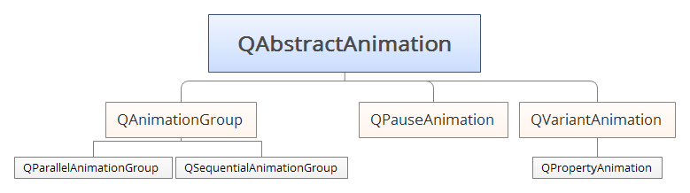
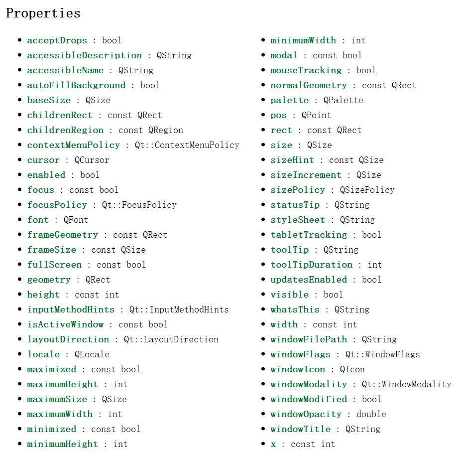
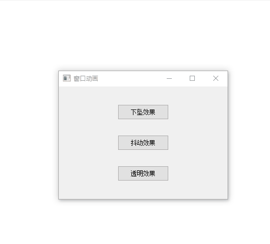
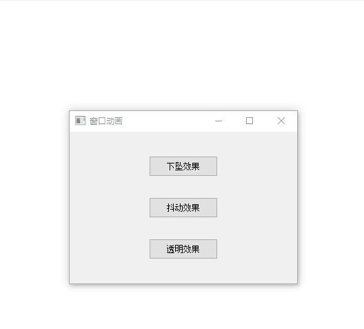

[Qt 之动画框架](https://blog.csdn.net/liang19890820/article/details/51850579)

[Qt属性系统](https://blog.csdn.net/zyhse/article/details/106890856)

## 简介

Qt动画框架旨在为创建动画和平滑的GUI提供了一种简单的方法。通过Qt动画属性，该框架为部件和其它QObject对象的动画操作提供了非常大的自由性，框架也可以被用于图形视图框架中。

本篇，我们阐述了Qt动画框架的基本结构。同时，会展示最常见的技术示例，用于动画操作QObject和图形项。



动画框架基础由基类QAbstractAnimation以及它的两个子类QVariantAnimation、QAnimationGroup组成。QAbstractAnimation是所有动画的祖先。它包含了一些在框架中被普遍使用的基本功能，尤其是启动、停止和暂停动画功能，它也接收定时触发通知。

Qt动画框架更是提供了QPropertyAnimation类，该类继承自QVariantAnimation，用于对Qt属性的动画操作(Qt属性系统是Qt元对象系统的一部分)。QPropertyAnimation类使用缓和曲线算法对属性进行插值演化操作。因此当你想使用动画改变一个值时，需要声明其为一个属性并且使该类继承自QObject。这给我们提供了很大的方便性，去动画操作现有的部件和其它的QObject对象。

复杂动画可以通过构建QAbstractAnimation树形结构来构造。该树主要使用QAnimationGroup,QAnimationGroup类是一个包含其它动画类的容器类;同时QAnimationGroup类也是QAbstractAnimation类的子类，因此一个容器可以包含其它容器。

Qt动画框架可以独立使用，但是也被设计为Qt状态机框架的一部分。状态机框架提供一个特殊的状态用来播放动画。当状态进入或者退出时，QState也可以改变属性。当这个动画状态提供了一个QPropertyAnimatio时，这个特殊的状态会在这些值之间进行篡改操作。后续我们将了解的更加仔细。

## 动画框架类

这些类提供了用于创建简单的和复杂的动画框架

| 类名                      | 描述                          |
| ------------------------- | ----------------------------- |
| QAbstractAnimation        | 所有动画类的基类              |
| QAnimationGroup           | 动画容器类的抽象类            |
| QEasingCurve              | 控制动画的缓和曲线类          |
| QParallelAnimationGroup   | 并行动画容器                  |
| QPauseAnimation           | QSequentialAnimationGroup暂停 |
| QPropertyAnimation        | Qt属性动画                    |
| QSequentialAnimationGroup | 串行动画容器                  |
| QTimeLine                 | 可控制动画的时间轴类          |
| QVariantAnimation         | 动画类的抽象基类              |

## QPropertyAnimation

#### 简介

QPropertyAnimation类定义了Qt的属性动画。

QPropertyAnimation以Qt属性做插值，作为属性值存储在QVariants中，该类继承自QVariantAnimation，所以基类支持的元素类型该类同样支持。

声明属性的类必须是一个QObject，为了能够让属性可以用做动画效果，必须提供一个setter(这样，QPropertyAnimation才可以设置属性的值)。注意:这能够使它让许多Qt控件产生动画效果。

**Example**

```cpp
QPushButton *btn = new QPushButton("Animation",this);

QPropertyAnimation* animation = new QPropertyAnimation(btn,"pos");
animation->setStartValue(QPoint(0,0));
animation->setEndValue(QPoint(520,400));
animation->setDuration(3000);
animation->start();
```

属性名和应用改动画属性的QObject实例被传递给构造函数。 然后可以指定属性的开始值和结束值。  

QVariantAnimation类描述详细说明了如何设置动画。 但是请注意，如果没有设置启动值，该属性将从创建QPropertyAnimation实例时的值开始。  

不同类的属性可以通过帮助文档查看，如果属性声明为const 那么将不能用于动画设置，而且用于动画的属性，一般都是能够直接观察到的，比如：大小，坐标，颜色...



#### Example:

```cpp
void Widget::initBtn()
{
    auto* oneAnimation = new QPropertyAnimation(ui->oneBtn,"pos");
    oneAnimation->setStartValue(ui->oneBtn->pos());
    oneAnimation->setEndValue(QPoint(ui->oneBtn->x(),ui->moreBtn->y()));
    oneAnimation->setDuration(2000);
    oneAnimation->setEasingCurve(QEasingCurve::OutBack);

    auto* twoAnimation = new QPropertyAnimation(ui->twoBtn, "pos");
    twoAnimation->setStartValue(ui->twoBtn->pos());
    twoAnimation->setEndValue(QPoint(ui->twoBtn->x(), ui->moreBtn->y()));
    twoAnimation->setDuration(2000);
    twoAnimation->setEasingCurve(QEasingCurve::OutBack);

    auto* threeAnimation = new QPropertyAnimation(ui->threeBtn, "pos");
    threeAnimation->setStartValue(ui->threeBtn->pos());
    threeAnimation->setEndValue(QPoint(ui->threeBtn->x(), ui->moreBtn->y()));
    threeAnimation->setDuration(1000);
    threeAnimation->setEasingCurve(QEasingCurve::OutBack);

    connect(ui->moreBtn, &QPushButton::clicked, this, [=]()
        {
            if (ui->oneBtn->y() < 0)
            {
                oneAnimation->setDirection(QPropertyAnimation::Direction::Forward);
                twoAnimation->setDirection(QPropertyAnimation::Direction::Forward);
                threeAnimation->setDirection(QPropertyAnimation::Direction::Forward);
            }
            else
            {
                oneAnimation->setDirection(QPropertyAnimation::Direction::Backward);
                twoAnimation->setDirection(QPropertyAnimation::Direction::Backward);
                threeAnimation->setDirection(QPropertyAnimation::Direction::Backward);
            }
            oneAnimation->start();
            twoAnimation->start();
            threeAnimation->start();
        });
}
```

## QSequentialAnimationGroup

#### 简介

QSequentialAnimationGroup类提供了动画的串行组

QSequentialAnimationGroup是一个QAnimationGroup，它按顺序运行它的动画，也就是说，它在一个动画结束播放后开始另一个动画。 动画按照它们被添加到组的顺序播放(使用addAnimation()或insertAnimation())。 动画组在最后一个动画完成时结束。  

在每一个时刻，最多有一个动画是活跃的群体; 它由currentAnimation()返回。 空组没有当前的动画。  

串行动画组可以被视为任何其他动画，也就是说，它可以启动、停止，并添加到其他组中。 还可以调用addPause()或insertPause()向连续动画组添加暂停。  

```cpp
QSequentialAnimationGroup *group = new QSequentialAnimationGroup;

group->addAnimation(anim1);
group->addAnimation(anim2);

group->start();
```

#### 公有函数

+ QPauseAnimation *addPause(int msecs)

  给这个动画组添加一个msecs的暂停。 暂停被认为是一种特殊类型的动画，因此animationCount将增加1。  

+ void clear()

  清除动画组所有动画

#### Eaxmple

下面，我们通过QSequentialAnimationGroup来构建一个串行动画组，并添加属性动画QPropertyAnimation，这里也可以使用addAnimation()添加其它动画/动画组，就不予演示了。

```cpp
auto* group = new QSequentialAnimationGroup(this);
group->addAnimation(oneAnimation);
group->addAnimation(twoAnimation);
group->addAnimation(threeAnimation);

connect(ui->moreBtn, &QPushButton::clicked, this, [=]()
    {
        if (ui->oneBtn->y() < 0)
        {
            group->setDirection(QPropertyAnimation::Direction::Forward);
        }
        else
        {
            group->setDirection(QPropertyAnimation::Direction::Backward);
        }
        group->start();
    });
```

## QParallelAnimationGroup

## 窗口动画（下坠、抖动、透明度）

前面我们学习了动画的基本使用，现在我们用起来，实现一些特效~

下面，我们以geometry、pos、windowOpacity属性为例，来实现窗体的下坠、抖动、透明度效果。

### 下坠效果

```cpp
void Widget::onDropWindow()
{
    auto* animation = new QPropertyAnimation(this, "geometry");
    animation->setStartValue(QRect(x(), 0, width(), height()));
    animation->setEndValue(this->geometry());
    animation->setEasingCurve(QEasingCurve::OutElastic);
    animation->setDuration(2000);
    animation->start(QPropertyAnimation::DeletionPolicy::DeleteWhenStopped);
}
```



### 抖动效果

```cpp
void Widget::onShakeWindow()
{
    auto* animation = new QPropertyAnimation(this, "pos");
    animation->setKeyValueAt(0, pos() - QPoint(3, 0));
    animation->setKeyValueAt(0.25, pos() - QPoint(0, 3));
    animation->setKeyValueAt(0.5, pos() - QPoint(0, -3));
    animation->setKeyValueAt(0.75, pos() - QPoint(-3, 0));
    animation->setKeyValueAt(0, pos());
    animation->setLoopCount(3); //重复三次
    animation->setDuration(100);
    animation->start(QPropertyAnimation::DeletionPolicy::DeleteWhenStopped);
}
```


### 透明

```cpp
void Widget::onOpacityWindow()
{
    auto* animation = new QPropertyAnimation(this, "windowOpacity");
    animation->setStartValue(1);
    animation->setKeyValueAt(0.25,0.75);
    animation->setKeyValueAt(0.5,0.5);
    animation->setKeyValueAt(0.75,0.25);
    animation->setEndValue(1);
    animation->setDuration(1000);
    animation->start();
}
```




## 状态机

### QState

QState类为QStateMachine提供了一个通用状态。  


### QStateMachine

QStateMachine类提供了一个分层的有限状态机  

```cpp
    QPushButton* btn = new QPushButton("播放", this);

    QState* statePlay = new QState;
    statePlay->assignProperty(btn, "text", "播放");

    QState* stateStop = new QState;
    stateStop->assignProperty(btn, "text", "暂停");


    statePlay->addTransition(btn, &QPushButton::clicked, stateStop);
    stateStop->addTransition(btn, &QPushButton::clicked, statePlay);


    QStateMachine* stateMachine = new QStateMachine(this);
    stateMachine->addState(statePlay);
    stateMachine->addState(stateStop);
    stateMachine->setInitialState(statePlay);
    stateMachine->start();
```

