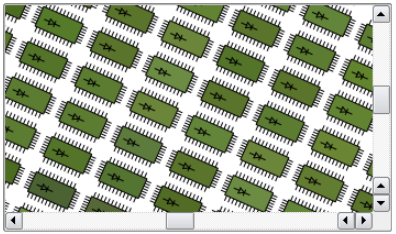

# 图形视图框架

图形视图提供了一个界面，用于管理大量定制的2D图形项并与之交互，还提供了一个视图小部件，用于可视化这些项，支持缩放和旋转。

该框架包括一个事件传播体系结构，允许对场景中的项目进行精确的双精度交互功能。项目可以处理按键事件、鼠标按下、移动、释放和双击事件，还可以跟踪鼠标移动。

Graphics View使用BSP(二进制空间分区)树来提供非常快速的项目发现，因此，它可以实时可视化大型场景，即使有数百万个项目。

## 图形视图架构

前面讲paintEvent2D绘图时已经可以绘制出各种图形，并且进行简单的控制。不过，如果要绘制成千上万相同或者不同的图形，并且对它们进行控制，比如拖动这些图形、检测它们的位置以及判断它们是否相互碰撞等，使用以前的方法就很难完成了。这时可以使用Qt提供的图形视图框架来进行设计。

### 场景(Scene)

QGraphicsScene提供了图形视图场景。本场景主要职责如下:

+ 为管理大量Items提供了一个快速的界面
+ 将事件传播到每个item
+ 管理Items状态，例如选择和焦点处理
+ 提供未转换的呈现功能；主要用于印刷

场景充当QGraphicsItem对象的容器。通过调用QGraphicsScene::addItem()将item添加到场景中，然后通过调通过调用众多item查找函数来检索。QGraphicsScene::items()及其重载返回由点、矩形、多边形或一般矢量路径包含或与之相交的所有项。QGraphicsScene::itemAt()返回特定点的最上面的项。所有项发现函数都以递减的堆叠顺序返回项(即，返回的第一个项是最上面的，最后一个项是最下面的)。

```cpp
 QGraphicsScene scene;
 QGraphicsRectItem *rect = scene.addRect(QRectF(0, 0, 100, 100));

 QGraphicsItem *item = scene.itemAt(50, 50, QTransform());
```

QGraphicsScene的事件传播架构安排场景事件以传递到项目，并且还管理项目之间的传播。如果场景在某个位置接收到一个鼠标按下事件，场景将该事件传递给位于该位置的任何项目。

QGraphicsScene还管理某些项目状态，比如项目选择和焦点。你可以通过调用QGraphicsScene::setSelectionArea()来选择场景中的项目，传递一个任意形状。这个功能也被用作在QGraphicsView中选择橡皮筋的基础。调用QGraphicsScene::selectedItems()获取当前所有选中项的列表。QGraphicsScene处理的另一个状态是项目是否有键盘输入焦点。你可以通过调用QGraphicsScene::setFocusItem()或QGraphicsItem::setFocus()来设置一个项目的焦点，或者通过调用QGraphicsScene::focusItem()来获取当前的焦点项目。

最后，QGraphicsScene允许你通过QGraphicsScene::render()函数将部分场景渲染到绘制设备中。您可以在本文档后面的打印部分阅读更多相关内容。

### 视图(View)

QGraphicsView提供了视图小部件，它可视化了场景的内容。您可以将多个视图附加到同一个场景，从而为相同的数据集提供多个视口。视图小部件是一个滚动区域，并提供滚动条用于在大型场景中导航。要启用OpenGL支持，您可以通过调用QGraphicsView::setViewport()将QOpenGLWidget设置为viewport。

```cpp
 QGraphicsScene scene;
 myPopulateScene(&scene);
 QGraphicsView view(&scene);
 view.show();
```

视图接收来自键盘和鼠标的输入事件，并将这些事件转换为场景事件(在适当的地方将使用的坐标转换为场景坐标)，然后将事件发送到可视化的场景。

使用它的变换矩阵QGraphicsView::transform()，视图可以变换场景的坐标系统。这允许高级导航功能，如缩放和旋转。为了方便起见，QGraphicsView还提供了在视图和场景坐标之间转换的函数:QGraphicsView::mapToScene()和QGraphicsView::mapFromScene()。



### 图形项(Item)

QGraphicsItem是场景中图形项的基类。图形视图为典型形状提供了几个标准项，例如矩形(QGraphicsRectItem)、椭圆(QGraphicsEllipseItem)和文本项(QGraphicsTextItem)，但最强大的QGraphicsItem特性是在编写自定义项时可用的。除此之外，QGraphicsItem支持以下特性:

+ 鼠标按下、移动、释放和双击事件，以及鼠标悬停事件、滚轮事件和上下文菜单事件。
+ 键盘输入焦点和按键事件
+ 拖放
+ 通过父子关系和QGraphicsItemGroup进行分组
+ 碰撞检测

item存在于本地坐标系统中，像QGraphicsView一样，它还提供了许多函数来映射项目和场景之间的坐标，以及项与项之间的坐标。同样，像QGraphicsView一样，它可以使用矩阵:QGraphicsItem::transform()转换其坐标系统。这对于旋转和缩放单个项目非常有用。

项可以包含其他项(子项)。父项的转换由其所有子项继承。然而，不管一个项的累积转换如何，它的所有函数(例如，QGraphicsItem::contains()， QGraphicsItem::boundingRect()， QGraphicsItem::collidesWith())仍然在局部坐标中操作。

QGraphicsItem通过QGraphicsItem::shape()函数和QGraphicsItem::collidesWith()支持碰撞检测，这两个函数都是虚函数。通过从QGraphicsItem::shape()返回物体的形状作为局部坐标QPainterPath, QGraphicsItem将为你处理所有的碰撞检测。但是，如果你想提供自己的碰撞检测，你可以重新实现QGraphicsItem::collidesWith()。

## 图形视图框架中的类

| 类                             | 描述                                                   |
| ------------------------------ | :----------------------------------------------------- |
| QAbstractGraphicsShapeltem     | 所有路径图元的共同基类                                 |
| QGraphicsAnchor                | 表示一个QGraphicsAnchorLayout中两个图元之间的anchor    |
| QGraphicsAnchorLayout          | 布局可以anchor部件到图形视图中                         |
| QGraphicsEffect                | 所有图形特效的基类                                     |
| QGraphicsEllipseltem           | 可以添加到QGraphicsScene的椭圆图元                     |
| QGraphicsGridLayout            | 图形视图中管理部件的网格布局                           |
| QGraphicsltem                  | QGraphicsScene中所有图元的基类                         |
| QGraphicsltemGroup             | —个将图元组当做单个图元来看待的容器                    |
| QGraphicsLayout                | 图形视图中所有布局类的基类                             |
| QGraphicsLayoutltem            | 可以被继承，允许布局类管理的自定义图元                 |
| QGraphicsLineltem              | 可以添加到QGraphicsScene的直线图元                     |
| QGraphicsLinearLayout          | 图形视图中管理部件的水平或垂直布局                     |
| QGraphicsObject                | 所有需要信号、槽、属性的图元的基类                     |
| QGraphicsPathltem              | 可以添加到QGraphicsScene的路径图元                     |
| QGraphicsPixmapltem            | 可以添加到QGraphicsScene的图形图元                     |
| QGraphicsPolygonltem           | 可以添加到QGraphicsScene的多边形图元                   |
| QGraphicsProxyWidget           | 代理，用于将一个QWidget对象嵌入到QGraphicsScene中      |
| QGraphicsRectltem              | 可以添加到QGraphicsScene的矩形图元                     |
| QGraphicsScene                 | 管理大量2D图元的管理器                                 |
| QGraphicsSceneContextMenuEvent | 图形视图框架中的上下文菜单事件                         |
| QGraphicsSceneDragDropEvent    | 图形视图框架中的拖放事件                               |
| QGraphicsSceneEvent            | 所有图形视图相关事件的基类                             |
| QGraphicsSceneHelpEvent        | Tooltip请求时的事件                                    |
| QGraphicsSceneHoverEvent       | 图形视图框架中的悬停事件                               |
| QGraphicsSceneMouseEvent       | 图形视图框架中的鼠标事件                               |
| QGraphicsSceneMoveEvent        | 图形视图框架中的部件移动事件                           |
| QGraphicsSceneResizeEvent      | 图形视图框架中的部件大小改变事件                       |
| QGraphicsSceneWheelEvent       | 图形视图框架中的鼠标滚轮事件                           |
| QGraphicsSimpleTextltem        | 可以添加到QGraphicsScene的简单文本图元                 |
| QGraphicsSvgltem               | 可以用来呈现SVG文件内容的QGraphicsltem                 |
| GraphicsTextltem               | 可以添加到QGraphicsScene的文本图元，用于显示格式化文本 |
| QGraphicsTransform             | 创建QGraphicsltems高级矩阵变换的抽象基类               |
| QGraphicsView                  | 显示一个QGraphicsScene内容的部件                       |
| QGraphicsWidget                | QGraphicsScene中所有部件图元的基类                     |
| QStyleOptionGraphicsltem       | 用于描述绘制一个QGraphicsltem所需的参数                |

## 图形视图坐标系统

图形视图基于笛卡尔坐标系;道具在场景中的位置和几何形状由两组数字表示:x坐标和y坐标。当使用未转换视图观察场景时，场景中的一个单元由屏幕上的一个像素表示。

在图形视图中有三种有效的坐标系统:item坐标、scene坐标和view坐标。为了简化实现，Graphics View提供了方便的函数，允许您在三个坐标系统之间进行映射。

渲染时，图形视图的场景坐标对应于QPainter的逻辑坐标，视图坐标与设备坐标相同。在坐标系统文档中，您可以了解逻辑坐标和设备坐标之间的关系。


### 图形项坐标

items存在于自己的本地坐标系统中。它们的坐标通常以中心点(0,0)为中心，这也是所有变换的中心。项目坐标系中的几何原语通常被称为项目点、项目线或项目矩形。

当创建一个自定义项目时，项目坐标是你需要担心的;QGraphicsScene和QGraphicsView将为你执行所有的转换。这使得实现自定义项目变得非常容易。例如，如果您接收到鼠标按下或拖动进入事件，则事件位置将以项目坐标表示。QGraphicsItem::contains()虚函数，如果某个点在项目内，则返回true，否则返回false，它接受项目坐标中的point参数。类似地，项目的边界矩形和形状在项目坐标中。

项目的位置是项目的中心点在其父坐标系统中的坐标;有时被称为父坐标。在这个意义上，场景被视为所有无父项的“父项”。顶层项的位置在场景坐标中。

子坐标相对于父坐标。如果子坐标未转换，则子坐标和父坐标之间的差值与父坐标中项目之间的距离相同。例如:如果一个未转换的子项目被精确地定位在其父项目的中心点上，那么两个项目的坐标系统将是相同的。如果子结点的位置是(10,0)，那么子结点的(0,10)点将与父结点的(10,10)点对应。

因为项的位置和转换相对于父项，所以子项的坐标不受父项转换的影响，尽管父项的转换隐式地转换子项。在上面的例子中，即使父节点被旋转和缩放，子节点的(0,10)点仍然对应于父节点的(10,10)点。然而，相对于场景，子元素会跟随父元素的变化和位置。如果父对象被缩放(2x, 2x)，子对象的位置将位于场景坐标(20,0)，并且它的(10,0)点将对应于场景中的点(40,0)。

QGraphicsItem::pos()是少数例外之一，QGraphicsItem的函数在项坐标中操作，不管项是什么，也不管它的父项转换是什么。例如，一个项目的边界矩形(即QGraphicsItem::boundingRect())总是在项目坐标中给出。

### 场景坐标

场景表示所有项目的基本坐标系统。场景坐标系统描述了每个顶级项目的位置，也形成了从视图传递到场景的所有场景事件的基础。场景中的每个项目都有一个场景位置和边界矩形(QGraphicsItem::scenePos()， QGraphicsItem::sceneBoundingRect())，除了它的本地项目pos和边界矩形。场景坐标描述了项目在场景坐标中的位置，它的场景边界矩形构成了QGraphicsScene如何确定场景中哪些区域发生了变化的基础。场景中的变化是通过QGraphicsScene::changed()信号传递的，参数是一个场景矩形列表。

### 视图坐标

视图坐标是Widget的坐标。视图坐标中的每个单元对应一个像素。这个坐标系的特殊之处在于它相对于小部件或视口，不受所观察场景的影响。QGraphicsView的viewport的左上角总是(0,0)，右下角总是(viewport width, viewport height)。所有鼠标事件和拖放事件最初都是作为视图坐标接收的，为了与项目交互，您需要将这些坐标映射到场景。

### 坐标映射

通常在处理场景中的项目时，将坐标和任意形状从场景映射到项目，从项目映射到项目，或从视图映射到场景是很有用的。例如，当你在QGraphicsView的viewport中点击鼠标时，你可以通过调用QGraphicsView::mapToScene()，然后再调用QGraphicsScene::itemAt()来询问场景光标下的项目是什么。如果你想知道一个项目在viewport中的位置，你可以在项目上调用QGraphicsItem::mapToScene()，然后在视图上调用QGraphicsView::mapFromScene()。最后，如果你想要找到视图椭圆内的项目，你可以传递一个QPainterPath给mapToScene()，然后传递映射路径给QGraphicsScene::items()。

你可以通过调用QGraphicsItem::mapToScene()和QGraphicsItem::mapFromScene()将坐标和形状映射到项目的场景。你也可以通过调用QGraphicsItem:: maptopparent()和QGraphicsItem::mapFromParent()映射到一个项目的父项目，或者通过调用QGraphicsItem::mapToItem()和QGraphicsItem::mapFromItem()映射到项目之间。所有的映射函数都可以映射点、矩形、多边形和路径。

视图中也有相同的映射函数，用于从场景映射到场景。QGraphicsView::mapFromScene()和QGraphicsView::mapToScene()。要从视图映射到项，首先映射到场景，然后从场景映射到项。

| 映射函数                       | 描述                                             |
| ------------------------------ | ------------------------------------------------ |
| QGraphicsView::mapToScene()    | 从视图坐标系统映射到场景坐标系统                 |
| QGraphicsView::mapFromScene()  | 从场景坐标系统映射到视图坐标系统                 |
| QGraphicsItem::mapToScene()    | 从图形项的坐标系统映射到场景的坐标系统           |
| QGraphicsItem::mapFromScene()  | 从场景的坐标系统映射到图形项的坐标系统           |
| QGraphicsItem::mapToParent()   | 从本图形的坐标系统映射到其父图形的坐标系统       |
| QGraphicsItem::mapFromParent() | 从父图形项的坐标系统映射到本图形项的坐标系统     |
| QGraphicsItem::mapToItem()     | 从本图形项的坐标系统映射到另一个图形项的坐标系统 |
| QGraphicsItem::mapFromScene()  | 从另一个图形项的坐标系统映射到本图形项的坐标系统 |

## 关键特征

### 缩放和旋转

QGraphicsView支持与QPainter通过QGraphicsView::setMatrix()所做的相同的仿射转换。通过对视图应用转换，您可以轻松地添加对常见导航功能(如缩放和旋转)的支持。
下面是一个如何在QGraphicsView的子类中实现缩放和旋转槽的例子:

```cpp
 class View : public QGraphicsView
 {
 Q_OBJECT
     ...
 public slots:
     void zoomIn() { scale(1.2, 1.2); }
     void zoomOut() { scale(1 / 1.2, 1 / 1.2); }
     void rotateLeft() { rotate(-10); }
     void rotateRight() { rotate(10); }
     ...
 };
```

槽可以连接到启用autoRepeat的QToolButtons。
当你转换视图时，QGraphicsView保持视图的中心对齐。
请参见弹性节点示例，了解如何实现基本缩放功能的代码。

### 打印

图形视图通过其渲染函数QGraphicsScene::render()和QGraphicsView::render()提供单行打印。这两个函数提供了相同的API:你可以通过将QPainter传递给任何一个渲染函数，让场景或视图将全部或部分内容渲染到任何绘制设备中。这个例子展示了如何使用QPrinter将整个场景打印成一个完整的页面。

```cpp
 QGraphicsScene scene;
 QPrinter printer;
 scene.addRect(QRectF(0, 0, 100, 200), QPen(Qt::black), QBrush(Qt::green));

 if (QPrintDialog(&printer).exec() == QDialog::Accepted) {
     QPainter painter(&printer);
     painter.setRenderHint(QPainter::Antialiasing);
     scene.render(&painter);
 }
```

场景和视图渲染函数之间的区别是一个在场景坐标中操作，另一个在视图坐标中操作。QGraphicsScene::render()通常用于打印未转换的整个场景片段，例如绘制几何数据，或打印文本文档。另一方面，QGraphicsView::render()适合截图;它的默认行为是使用提供的渲染器渲染视口的确切内容。

```cpp
 QGraphicsScene scene;
 scene.addRect(QRectF(0, 0, 100, 200), QPen(Qt::black), QBrush(Qt::green));

 QPixmap pixmap;
 QPainter painter(&pixmap);
 painter.setRenderHint(QPainter::Antialiasing);
 scene.render(&painter);
 painter.end();

 pixmap.save("scene.png");

```

当源和目标区域的大小不匹配时，源内容将被拉伸以适应目标区域。通过将一个Qt::AspectRatioMode传递给你正在使用的渲染函数，当内容被拉伸时，你可以选择保持或忽略场景的纵横比。

### 拖放

因为QGraphicsView间接继承了QWidget，所以它已经提供了与QWidget相同的拖放功能。此外，为了方便起见，图形视图框架为场景和每个项目提供了拖放支持。当视图接收到拖拽时，它将拖放事件转换为QGraphicsSceneDragDropEvent，然后将其转发到场景。场景接管了这个事件的调度，并将其发送到鼠标光标下接受掉落的第一个项目。

要从一个项目开始拖动，创建一个QDrag对象，将一个指针传递给开始拖动的小部件。项目可以被多个视图同时观察，但只有一个视图可以开始拖动。在大多数情况下，拖动是由于按下或移动鼠标而开始的，因此在mousePressEvent()或mouseMoveEvent()中，您可以从事件中获得原始小部件指针。例如:

```cpp
 void CustomItem::mousePressEvent(QGraphicsSceneMouseEvent *event)
 {
     QMimeData *data = new QMimeData;
     QDrag *drag = new QDrag(event->widget());
     drag->setMimeData(data);
     drag->exec();
 }

```

为了拦截场景的拖放事件，你在一个QGraphicsItem子类中重新实现QGraphicsScene::dragEnterEvent()和任何你特定场景需要的事件处理程序。您可以在QGraphicsScene的每个事件处理程序的文档中阅读更多关于图形视图中拖放的信息。

项目可以通过调用QGraphicsItem::setAcceptDrops()来启用拖放支持。要处理传入的拖动，重新实现QGraphicsItem::dragEnterEvent()， QGraphicsItem::dragMoveEvent()， QGraphicsItem::dragLeaveEvent()和QGraphicsItem::dropEvent()。

另请参阅拖放机器人示例，以演示图形视图对拖放操作的支持。

### 光标和工具提示

像QWidget一样，QGraphicsItem也支持游标(QGraphicsItem::setCursor())和工具提示(QGraphicsItem::setToolTip())。当鼠标光标进入项目区域时，游标和工具提示由QGraphicsView激活(通过调用QGraphicsItem::contains()来检测)。

你也可以通过调用QGraphicsView::setCursor()直接在视图上设置默认游标。
请参见拖放机器人示例，了解实现工具提示和光标形状处理的代码。

### 动画

图形视图支持多个级别的动画。通过使用动画框架，您可以轻松地组装动画。为此，你需要你的项目从QGraphicsObject继承和关联QPropertyAnimation与他们。QPropertyAnimation允许动画任何QObject属性。

另一种选择是创建一个自定义项目，从QObject和QGraphicsItem继承。项目可以设置自己的定时器，并在QObject::timerEvent()中使用增量步骤控制动画。

第三种选择是通过调用QGraphicsScene::advance()来推进场景，QGraphicsScene::advance()反过来调用QGraphicsItem::advance()。

### OpenGL渲染

要启用OpenGL呈现，您只需通过调用QGraphicsView::setViewport()来设置一个新的QOpenGLWidget作为QGraphicsView的viewport。如果你想要OpenGL与反锯齿，你需要设置一个QSurfaceFormat与所需的样本计数(见QSurfaceFormat::setSamples())。

```cpp
 QGraphicsView view(&scene);
 QOpenGLWidget *gl = new QOpenGLWidget();
 QSurfaceFormat format;
 format.setSamples(4);
 gl->setFormat(format);
 view.setViewport(gl);
```

### 项目组

通过使一个项成为另一个项的子项，您可以实现项分组的最基本特性:项将一起移动，并且所有转换都从父项传播到子项。

此外，QGraphicsItemGroup是一个特殊的项目，它结合了子事件处理和一个有用的接口，用于向组中添加和删除项目。向QGraphicsItemGroup中添加一个项将保持该项的原始位置和转换，而重父项通常会导致子项相对于其新的父项重新定位。为了方便，你可以通过调用QGraphicsScene::createItemGroup()在场景中创建QGraphicsItemGroups。

### 小部件和布局

Qt 4.4通过QGraphicsWidget引入了对几何和布局感知项的支持。这个特殊的基本项类似于QWidget，但与QWidget不同，它没有继承自QPaintDevice;而是间接继承自QGraphicsItem。这允许你编写带有事件、信号和槽、大小提示和策略的完整小部件，你还可以通过QGraphicsLinearLayout和QGraphicsGridLayout在布局中管理小部件的几何形状。

#### QGraphicsWidget

在QGraphicsItem的功能和精简占用的基础上，QGraphicsItem提供了两全其美的两个功能：来自QWidget的额外功能，如样式、字体、调色板、布局方向和几何图形，以及来自QGraphicsItem的分辨率独立性和转换支持。因为图形视图使用实坐标而不是整数， QGraphicsWidget的几何函数也操作在QRectF和QPointF上。这也适用于框架矩形，边距和间距。例如，使用 QGraphicsWidget，将内容边距指定为(0.5,0.5,0.5,0.5)是很常见的。你可以创建子窗口和“顶级”窗口;在某些情况下，您现在可以使用图形视图高级MDI应用程序。

QGraphicsWidget 支持 Qt 的小部件属性的子集，（Qt::WidgetAttribute），如下表所示。 此表中未列出的任何属性均不受支持或未使用。

| Widget 属性               | 用法                                                         |
| ------------------------- | ------------------------------------------------------------ |
| Qt::WA_SetLayoutDirection | 由 setLayoutDirection() 设置，由 unsetLayoutDirection() 清除。 您可以测试此属性以检查小部件是否已明确分配了 layoutDirection。 如果未设置该属性，则继承 layoutDirection()。 |
| Qt::WA_RightToLeft        | 由 setLayoutDirection() 切换。 从父/场景继承。 如果设置，小部件的布局将从右到左排列水平排列的小部件。 |
| Qt::WA_SetStyle           | 由 setStyle() 设置和清除。 如果设置了此属性，则该小部件已明确分配了样式。 如果未设置，小部件将使用场景或应用程序的样式。 |
| Qt::WA_Resized            | 由 setGeometry() 和 resize() 设置。                          |
| Qt::WA_SetPalette         | 由 setPalette() 设置。                                       |
| Qt::WA_SetFont            | 由 setFont() 设置。                                          |
| Qt::WA_WindowPropagation  | 启用对窗口小部件的传播。                                     |

#### QGraphicsLayout

QGraphicsLayout是专门为QGraphicsWidget设计的第二代布局框架的一部分。它的API与QLayout非常相似。您可以在QGraphicsLinearLayout和QGraphicsGridLayout中管理小部件和子布局。您也可以通过自己子类化QGraphicsLayout来轻松编写自己的布局，或者通过编写QGraphicsLayoutItem的适配器子类来将自己的QGraphicsItem项添加到布局中。

## 嵌入式小部件支持

图形视图为将任何小部件嵌入场景提供无缝支持。您可以嵌入简单的小部件，如QLineEdit或QPushButton，也可以嵌入复杂的小部件（如QTabWidget），甚至可以嵌入完整的主窗口。要将小部件嵌入到场景中，只需调用QGraphicsScene:：addWidget（），或创建QGraphicsProxyWidget的实例以手动嵌入小部件。

通过QGraphicsProxyWidget，GraphicsView能够深度集成客户端小部件功能，包括光标、工具提示、鼠标、平板电脑和键盘事件、子小部件、动画、弹出窗口（例如，QComboBox或QCompleter）以及小部件的输入焦点和激活。QGraphicsProxyWidget甚至集成了嵌入式小部件的标签顺序，这样您就可以在嵌入式小部件中添加标签。您甚至可以在场景中嵌入一个新的QGraphicsView，以提供复杂的嵌套场景。

在转换嵌入式小部件时，Graphics View确保小部件独立转换分辨率，允许字体和样式在放大时保持清晰。（请注意，分辨率独立的效果取决于样式。）

## 正式开始

### 创建图形视图基本代码

```cpp
//创建场景
auto scene = new QGraphicsScene(0, 0, 640, 480);

//创建视图,并把场景交给视图管理,或者通过setScene添加
auto view = new QGraphicsView(scene);
//显示视图
view->show();

//给场景添加项
scene->addRect(0, 0, 50, 50, QPen(Qt::red));


//获取指定坐标的项
qInfo()<< scene->itemAt(20, 20, QTransform());
```

