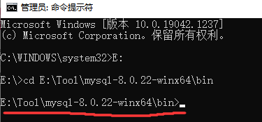
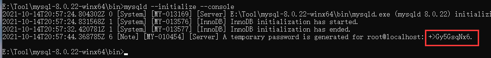
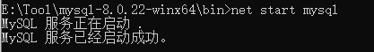
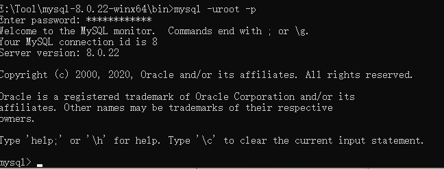
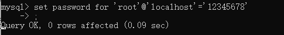
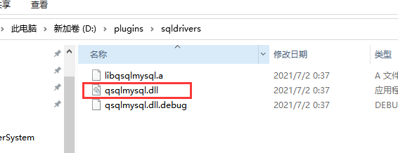
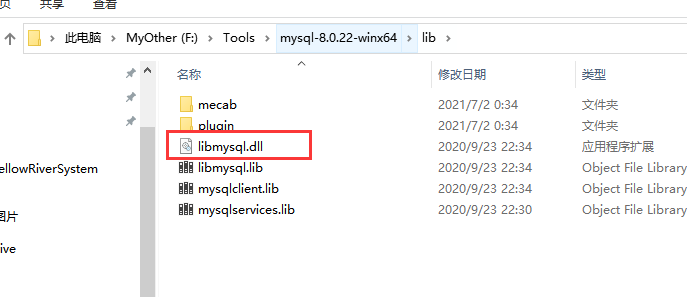

# MySql数据库安装

## 什么是MySql？

MySQL 是最流行的关系型数据库管理系统，数据库（Database）是按照数据结构来组织、存储和管理数据的仓库。

在没有使用数据库之前，我们一般都是把数据存储在文件中的，但是对于文件来说，读写数据速度相对较慢。

所以，现在我们使用关系型数据库管理系统（RDBMS）来存储和管理大数据量。所谓的关系型数据库，是建立在关系模型基础上的数据库，借助于集合代数等数学概念和方法来处理数据库中的数据。

话不多说我们先来安装MySql数据库吧！

## 如何下载

进入MySql官网[https://dev.mysql.com/downloads/mysql/],选择操作系统，默认是windows，下面选择免安装压缩包下载


## 解压，了解目录

下载好了之后解压即可，可以看到有很多的目录


  bin:存放命令，二进制文件，脚本等

  data(后续操作之后才会有这个目录)：存放数据库数据，table数据，数据存放位置可以自己定义，不一定存在这个路径

  docs:存放文档

  include:存放C语言头文件

  lib:头文件对应的库


## 配置Mysql

以**管理员**身份运行cmd，并进入到mysql的bin目录。



### 初始化mysql

在控制台输入mysqld --initialize --console，成功了后面会有一个密码，先记住哦~



### 安装mysql服务

执行命令`mysqld --install`  移除服务命令`mysqld --remove`


如果有配置文件可以安装服务的时候，指定配置文件(mysql是服务名称)


my.ini

```cpp
[mysql]
# 设置mysql客户端默认字符集
default-character-set=utf8 
[mysqld]
#设置3306端口
port = 3306 
# 设置mysql的安装目录
basedir=E:\Tool\mysql-8.0.22-winx64
# 设置mysql数据库的数据的存放目录
datadir=E:\Tool\mysql-8.0.22-winx64\data

# 允许最大连接数
max_connections=200
# 服务端使用的字符集默认为UTF8
character-set-server=utf8
# 创建新表时将使用的默认存储引擎
default-storage-engine=INNODB
```


### 启动服务

执行命令`net start mysql` 停止服务命令`net stop mysql`



### 登录MySql

启动服务之后就可以登录啦，输入mysql -u root -p 回车之后会提示你输入密码，输入上面初始化的密码即可



### 修改默认密码

登录之后命令行的提示已经变成了mysql>  接着输入set password for 'root'@'localhost'='你的新密码'；回车即可修改，不要忘记后面的分号哦



### 退出MySql

输入quit;即可退出登录，下次登录就可以使用你修改的密码了


### 设置系统环境变量

进入bin目录，然后复制路径，添加到系统环境变量的path下


设置完之后，可以进入cmd登录测试一下哦~

## 可能的错误及解决方法

### 1，发生系统错误 2

即使我们配置了系统环境变量，此时我们执行mysqld时也应该到mysql/bin目录下去执行：

  ``` sh
1>mysqld remove
2>mysqld install
3>net start mysql
  ```


# 编译MySQL数据库驱动

+ 找到Qt的mysql插件源码目录

  ```css
  D:\MySoftWare\Qt\Qt5.14.2\5.14.2\Src\qtbase\src\plugins\sqldrivers\mysql
  ```

+ 双击pro文件打开项目，在pro文件中加入mysql的安装目录

  ```js
  TARGET = qsqlmysql
  
  HEADERS += $$PWD/qsql_mysql_p.h
  SOURCES += $$PWD/qsql_mysql.cpp $$PWD/main.cpp
  
  #自己注释掉
  #QMAKE_USE += mysql
  
  OTHER_FILES += mysql.json
  
  #加上自己的mysql目录
  win32:LIBS += -LF:/Tools/mysql-8.0.22-winx64/lib -llibmysql
  INCLUDEPATH += F:/Tools/mysql-8.0.22-winx64/include
  DEPENDPATH += F:/Tools/mysql-8.0.22-winx64/include
  
  
  PLUGIN_CLASS_NAME = QMYSQLDriverPlugin
  include(../qsqldriverbase.pri)
  ```

+ 然后点击编译，会在Qt安装目录的盘符根目录(我这里是在D盘)生成plugins文件夹（D:\plugins）,进入找到qsqlmysql.dll，复制到Qt**对应的编译套件**目录中的plugins/sqldrivers目录中

  


+ 最后将mysql安装目录下面的lib下面的libmysql.dll 复制到Qt对应的编译套件目录的bin目录中

  


+ 测试是否配置成功

  ```cpp
  QSqlDatabase db = QSqlDatabase::addDatabase("QMYSQL");
      db.setHostName("127.0.0.1");
      db.setPort(3306);
      db.setUserName("root");
      db.setPassword("12345678");
      db.setDatabaseName("testqt");
  
      if(!db.open())
      {
          cout<<"DunKai 数据库打开失败";
          return;
      }
  ```

# 使用mysql数据库的程序打包

+ 程序打包之后，需要把mysql数据库bin目录下面的`libcrypto-1_1-x64.dll和libssl-1_1-x64.dll`两个动态库拷贝到可执行程序的同级目录，以及lib目录下面的libmysql.dll也要拷贝进去