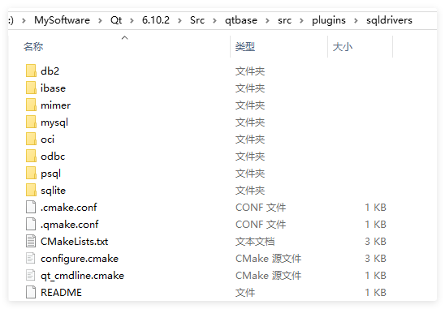
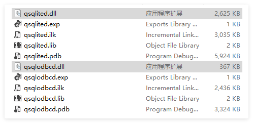
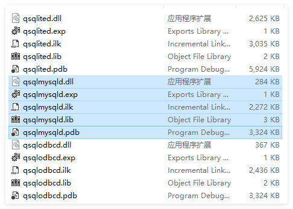
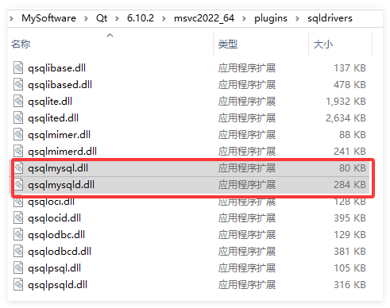
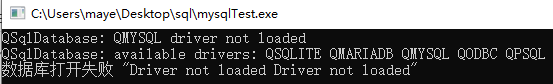
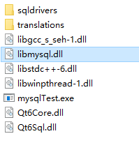
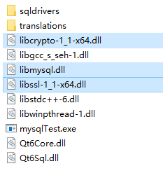

# SQL模块

Qt 提供了 **Qt SQL 模块** 来操作数据库。该模块使用统一的接口，支持多种主流数据库，让你无需为不同的数据库重写核心逻辑。

## CMake添加模块

首先，在你的 Qt 项目文件（`CMakeLists.txt` 文件）中添加 SQL 模块的支持：

```cmake
CMake: find_package(Qt6 REQUIRED COMPONENTS Sql)
target_link_libraries(mytarget PRIVATE Qt6::Sql)
```

在你的源代码中，根据具体需求，包含对应的头文件：

```cpp
#include <QSqlDatabase>   // 用于建立和管理数据库连接
#include <QSqlQuery>      // 用于执行任意的SQL语句
#include <QSqlError>      // 用于获取数据库操作的错误信息
```

## 数据库驱动

Qt SQL 模块通过**驱动插件**的方式支持各种数据库。让我从架构原理、内置驱动、编译自定义驱动和常见问题几个方面详细讲解。

### 驱动架构原理

```css
应用程序层 (你的代码)
    ↓
Qt SQL 接口层 (QSqlDatabase, QSqlQuery 等)
    ↓
驱动插件层 (QSQLiteDriver, QMYSQLDriver 等)
    ↓
原生客户端库 (sqlite3.dll, libmysql.dll 等)
    ↓
数据库服务器
```

每个驱动插件继承自 `QSqlDriver`，实现特定数据库的通信协议。

### 查看可用驱动

```cpp
#include <QSqlDatabase>
#include <QDebug>

// 获取所有可用的驱动列表
QStringList drivers = QSqlDatabase::drivers();
qDebug() << "可用驱动:" << drivers;

// 典型输出示例:
// QList("QIBASE", "QSQLITE", "QMIMER", "QOCI", "QODBC", "QPSQL")
```

Qt 提供了多种数据库驱动，用于与不同的数据库管理系统（DBMS）进行交互。常见的驱动包括 QMYSQL（MySQL/MariaDB）、QPSQL（PostgreSQL）、QSQLITE（SQLite）等。

### 编译自定义驱动

当 Qt 没有提供你需要的驱动时，可以自行编译。

默认情况下，Qt不提供MySql的驱动，需要自己手动编译；在编译MySQL驱动之前，请确保Qt的Source源码已经安装好了~

#### 编译驱动

+ 在Qt安装目录中找到数据库驱动源码目录，如下：

```css
D:\MySoftware\Qt\6.10.2\Src\qtbase\src\plugins\sqldrivers
```



+ 找到`sqldrivers`目录后，可以看到里面有项目文件`CMakeLists.txt`，用Vs或Qt Creator打开。

  > **记得先把你的MySQL库目录配置到环境变量哟**

##### Vs编译

我这里以Vs2026为例，项目打开之后自动配置，CMake会报错，如下：

```css
1> [CMake] CMake Error at D:\MySoftware\Qt\6.10.2\Src\qtbase\src\plugins\sqldrivers\CMakeLists.txt:21 (find_package):
1> [CMake]   Could not find a package configuration file provided by "Qt6" (requested
1> [CMake]   version 6.10.2) with any of the following names:
1> [CMake] 
1> [CMake]     Qt6Config.cmake
1> [CMake]     qt6-config.cmake
1> [CMake] 
1> [CMake]   Add the installation prefix of "Qt6" to CMAKE_PREFIX_PATH or set "Qt6_DIR"
1> [CMake]   to a directory containing one of the above files.  If "Qt6" provides a
1> [CMake]   separate development package or SDK, be sure it has been installed.
```

此错误表示，找不到Qt的包，我们需要配置一下Qt的MSVC套件库目录。

```cmake
# Copyright (C) 2022 The Qt Company Ltd.
# SPDX-License-Identifier: BSD-3-Clause

cmake_minimum_required(VERSION 3.16)

# 设置Qt的安装路径,替换成你的路径即可
set(CMAKE_PREFIX_PATH "D:/MySoftware/Qt/6.10.2/msvc2022_64")
```

设置好后，重新构建并生成项目即可！

在如下目录中即可找到生成的数据库驱动了：

```css
D:\MySoftware\Qt\6.10.2\Src\qtbase\src\plugins\sqldrivers\out\build\x64-Debug\plugins\sqldrivers
```

后缀为.dll的就是数据库驱动：



但是大家会发现并没有mysql的驱动呀？没错我们还需要配置mysql的库目录。

```cmake
# 设置包查找路径
set(CMAKE_PREFIX_PATH 
    "D:/MySoftware/Qt/6.10.2/msvc2022_64"   # Qt安装路径
    "F:/Tools/MySQL/MySQLServer8.4")        # MySQL安装路径
```

然后重新编译，即可生成mysql驱动了！



> 注意，Debug和Release驱动都要编译一下，使用模式必须一致！

默认是Debug模式，要想编译Release模式，需要添加`CMakePresets.json`文件，并加入如下内容：

```cpp
{
    "version": 3,
    "configurePresets": [
        {
            "name": "Debug-x64",
            "displayName": "Debug (x64)",
            "binaryDir": "${sourceDir}/out/build/debug",
            "cacheVariables": {
                "CMAKE_BUILD_TYPE": "Debug"
            }
        },
        {
            "name": "Release-x64",
            "displayName": "Release (x64)",
            "binaryDir": "${sourceDir}/out/build/release",
            "cacheVariables": {
                "CMAKE_BUILD_TYPE": "Release"
            }
        } 
    ]
}
```

然后重启vs即可选择模式了。

#### 安装驱动

驱动编译好后并不能直接使用，还需要将驱动放到套件的指定目录中。

MSVC套件数据库驱动安装目录如下：

```css
D:\MySoftware\Qt\6.10.2\msvc2022_64\plugins\sqldrivers
```

将Debug和Release模式的驱动都放入到此目录中：



#### 验证驱动

驱动安装完成后，再次通过代码查看驱动：

```cpp
#include <QSqlDatabase>
#include <QDebug>

// 获取所有可用的驱动列表
QStringList drivers = QSqlDatabase::drivers();
qDebug() << "可用驱动:" << drivers;

// 典型输出示例:
// 安装之前：QList("QIBASE", "QSQLITE", "QMIMER", "QOCI", "QODBC", "QPSQL")
// 安装之后：QList("QIBASE", "QSQLITE", "QMIMER", "QMARIADB", "QMYSQL", "QOCI", "QODBC", "QPSQL")
```

如果发现安装之后比之前多了`QMARIADB`、`QMYSQL`驱动则表示驱动安装成功！

> 注意，要想成功使用驱动，mysql的lib和bin目录必须配置到系统环境变量中~

## 操作数据库

### 连接数据库

使用 `QSqlDatabase` 类来创建和管理一个数据库连接。你需要指定一个驱动程序名称，这决定了你要连接哪种数据库。

下面是两种最常见的连接方式：

#### 连接SQLite数据库

SQLite 是一个轻量级的嵌入式数据库，不需要安装和配置服务器，非常适用于本地或移动应用。

```cpp
void test_sql_sqlite()
{
	// 添加一个名为 "SQLite Connection" 的 SQLite 数据库连接
	QSqlDatabase db = QSqlDatabase::addDatabase("QSQLITE", "SQLite Connection");

	// 设置数据库文件路径，使用 ":memory:" 则会创建一个在内存中的临时数据库
	db.setDatabaseName("your_database_file.db");

	if (db.open()) {
		qDebug() << "SQLite 数据库连接成功！";
	}
	else {
		qDebug() << "连接失败：" << db.lastError().text();
	}
}
```


#### 连接MySQL数据库

MySQL 是一种流行的客户端-服务器数据库，适用于需要高并发、多用户访问的网络应用。

```cpp
void test_sql_mysql()
{
	QSqlDatabase db = QSqlDatabase::addDatabase("QMYSQL");
	db.setHostName("127.0.0.1");	 // 数据库服务器的地址
	db.setPort(3306);				 // 数据库服务器的端口，MySQL默认为3306
	db.setDatabaseName("qt_course"); // 你想要连接的数据库名
	db.setUserName("root");          // 数据库登录用户名
	db.setPassword("123456");		// 数据库登录密码

	if (db.open()) {
		qDebug() << "MySQL 数据库连接成功！";
	}
	else {
		qDebug() << "连接失败：" << db.lastError().text();
	}
}
```

可能报错如下：

```css
1.连接失败： "Access denied for user 'root'@'localhost' (using password: YES) QMYSQL: Unable to connect"
 -- 这是用户名不存在或密码验证失败，大概率是密码错了！可以通过命令行或者图形工具先确定mysql登录密码。
2.连接失败： "Unknown database 'hdy1' QMYSQL: Unable to connect"
 -- 这是mysql中不存在hdy1这个数据库，创建数据库即可！
3.连接失败： "Can't connect to MySQL server on '127.0.0.1:33061' (10061) QMYSQL: Unable to connect"
 -- 这是服务器地址或端口号出错，请确认后重新填写！
4.qt.sql.qsqldatabase: QSqlDatabase: can not load requested driver 'QMYSQL', available drivers: QIBASE QSQLITE QMIMER QMARIADB QMYSQL QOCI QODBC QPSQL
连接失败： "Driver not loaded Driver not loaded"
 -- 如果提示有QMYSQL驱动，则是MySQL的bin目录或者lib目录没有配置到系统环境变量中！
```

### 执行SQL语句（增、删、查、改）

数据库连接成功后，就可以通过 `QSqlQuery` 类来执行 SQL 语句了。

#### 查询数据 (SELECT)

```cpp
void test_mysql_select()
{
	QSqlQuery query;
	if (!query.exec("SELECT * FROM users")) {
		qDebug() << "查询失败：" << query.lastError().text();
		return;
	}

	qDebug() << "size:"<< query.size();
	qDebug() << "查询结果：";
	while (query.next()) {
		auto id = query.value(0).toInt();
		auto uername = query.value(1).toString();
		auto nickname = query.value("nickname").toString();
		auto email = query.value("email").toString();
		qDebug() << id << uername << nickname << email;
	}
}
```


#### 插入数据 (INSERT)

```cpp
void test_mysql_insert()
{
	QSqlQuery query;
	if (!query.exec("INSERT INTO users(username,nickname,password,email,phone) VALUES('maye','顽石','123456','maye@gmial.com','5280620')")) {
		qDebug() << "插入失败：" << query.lastError().text();
		return;
	}

	qDebug() << "插入的数据ID为：" << query.lastInsertId();
	qDebug() << "插入成功 affectedNums:"<< query.numRowsAffected();
}
```


#### 更新数据 (UPDATE)

```cpp
void test_mysql_update()
{
	QSqlQuery query;
	if (!query.exec("UPDATE users SET nickname='玩蛇老师' WHERE username='maye'")) {
		qDebug() << "更新失败：" << query.lastError().text();
		return;
	}

	qDebug() << "更新成功 affectedNums:"<< query.numRowsAffected();
}
```


#### 删除数据 (DELETE)

```cpp
void test_mysql_delete()
{
	QSqlQuery query;
	if (!query.exec("DELETE FROM users WHERE username='maye'")) {
		qDebug() << "删除失败：" << query.lastError().text();
		return;
	}

	qDebug() << "删除成功 affectedNums:"<< query.numRowsAffected();
}
```


#### 预处理语句（Prepare Statement）

直接将用户输入拼接到SQL语句中是极其危险的，这会导致 **SQL注入攻击**。正确的做法是使用 `prepare()` 和 `bindValue()` 方法。这在执行批量操作时也更高效。

QSqlQuery支持预先准备的查询执行和将参数值绑定到占位符。 有些数据库不支持这些特性，所以对于这些特性，Qt会模拟所需的功能。

Qt支持使用问号`?`和命名占位符（如`:name`）这两种语法，只是不能将它们混合在同一个查询中。  

##### 命名占位符

1. 使用**命名**占位符的**命名**绑定：

```cpp
QSqlQuery query;
query.prepare("INSERT INTO user (id, username, nickname)"
               "VALUES (:id, :username, :nickname)");
query.bindValue(":id",520);
query.bindValue(":username","maye");
query.bindValue(":nickname","顽石");
query.exec();
```

2. 使用**命名**占位符的**位置**绑定：

```cpp
QSqlQuery query;
query.prepare("INSERT INTO user (id, username, nickname)"
               "VALUES (:id, :username, :nickname)");
query.bindValue(0,520);
query.bindValue(1,"maye");
query.bindValue(2,"顽石");
query.exec();
```

##### 位置占位符

1. 使用**位置**占位符绑定值(版本1)：

```cpp
QSqlQuery query;                                         
query.prepare("INSERT INTO user (id, username, nickname)"  
           "VALUES (?,?,?)");                              
query.bindValue(0,520);                                    
query.bindValue(1,"maye");                                 
query.bindValue(2,"顽石");                                   
query.exec();  
```

2. 使用**位置**占位符绑定值(版本2)：  

```cpp
QSqlQuery query;                                       
query.prepare("INSERT INTO user (id, username, nickname)"
           "VALUES (?,?,?)");                            
query.addBindValue(520);                                 
query.addBindValue("maye");                              
query.addBindValue("顽石");                                
query.exec();                                            
```

另外，未绑定的参数将导致操作失败。  

##### 批量执行

在批处理中执行先前准备的SQL查询。 所有绑定参数都必须是变量列表。

```cpp
QSqlQuery q;
q.prepare("insert into stu values (?,?,?)");

QVariantList names = QVariantList()<<"Maye"<<"young"<<"百毒不侵"<<"落笔不打";
q.addBindValue(names);

QVariantList ages = QVariantList << 26 << 36 << 46 << 56;
q.addBindValue(ages);

QVariantList scores = QVariantList << 89 << 69.9 << 79.9 << QVariant(QVariant::Float);//最后插入一个NULL
q.addBindValue(scores);

if (!q.execBatch())
   qDebug() << q.lastError();
```

注意:每个绑定的QVariantList必须包含相同数量的变量。  

注意:列表中qvariables的类型不能更改。 例如，您不能在QVariantList中混合整数和字符串变量。

### 使用模型/视图框架

Qt 提供了三种高级的数据库模型类，它们都继承自 `QAbstractTableModel`，可以与 Qt 的 Model/View 框架无缝集成。这三个类分别是：

| 模型类                       | 可编辑性 | 数据源        | 核心特点                    |
| :--------------------------- | :------- | :------------ | :-------------------------- |
| **QSqlQueryModel**           | 只读     | 任意 SQL 查询 | 最灵活，支持复杂查询和 JOIN |
| **QSqlTableModel**           | 读写     | 单个数据表    | 自动生成 SQL，无需手写 SQL  |
| **QSqlRelationalTableModel** | 读写     | 单表 + 外键   | 自动解析外键为可读文本      |

#### QSqlQueryModel

这是最基础的模型，用于执行任意 SQL 查询并显示结果。**只读**，不支持编辑。

##### 核心特点

- **任意 SQL 查询**：支持 JOIN、子查询、聚合等复杂 SQL
- **只读访问**：数据不可编辑，适合报表、统计等展示场景
- **高性能**：直接映射查询结果，无额外开销
- **灵活性最高**：适合熟悉 SQL 的开发者

##### 使用

先创建模型，然后设置查询，最后交给视图显示即可：

```cpp
QSqlQueryModel *sqlQueryModel = new QSqlQueryModel(this);
//sqlQueryModel->setQuery(query);
sqlQueryModel->setQuery("select * from user",database);

QTableView * view = new QTableView;
view->setModel(sqlQueryModel);
view->show();
```

QSqlQueryModel也可以用于通过编程方式访问数据库，而无需将其绑定到视图:  

```cpp
QSqlQueryModel model;
model.setQuery("SELECT username,nickname FROM user");
QString nickname = model.record(4).value("nickname").toInt();
```

上面的代码片段从SELECT查询结果集中的`记录4`中提取nickname字段。 由于nickname是第3列(索引为2)，我们可以重写最后一行如下:  

```cpp
QString nickname = model.data(model.index(4,2)).toInt();
```

默认情况下，模型是只读的。 要使它可读可写，必须子类化它并重新实现setData()和flags()。 另一种选择是使用QSqlTableModel，它提供了基于单个数据库表的读写模型。    

如果数据库不返回查询中选择的行数，模型将以递增的方式获取行。

```cpp
//清除模型并释放所有获得的资源。 
virtual void clear()
//返回关于数据库上发生的最后一个错误的信息      
QSqlError lastError() const
//返回与此模型关联的QSqlQuery。      
QSqlQuery query() const
//返回包含有关当前查询字段信息的记录。 如果row是有效行的索引，则记录将使用来自该行的值填充。      
QSqlRecord record(int row) const
QSqlRecord record() const
//执行给定数据库连接db的查询查询。 如果没有指定数据库(或无效的数据库)，则使用默认连接。 
void setQuery(const QSqlQuery &query)
void setQuery(const QString &query, const QSqlDatabase &db = QSqlDatabase())
```


#### QSqlTableModel

这是 `QSqlQueryModel` 的子类，专门用于操作**单个数据库表**，支持读写。

##### 核心特点

- **读写支持**：内置数据修改和提交机制
- **自动生成 SQL**：无需手动编写 INSERT/UPDATE/DELETE 语句
- **过滤与排序**：支持 `setFilter()` 和 `setSort()`
- **编辑策略**：可控制何时提交更改到数据库

**编辑策略 (Edit Strategy)**

| 策略             | 说明                       | 适用场景                  |
| :--------------- | :------------------------- | :------------------------ |
| `OnFieldChange`  | 字段改变时立即提交         | 实时保存，但性能较差      |
| `OnRowChange`    | 切换到不同行时提交（默认） | 通用场景                  |
| `OnManualSubmit` | 手动调用 `submitAll()`     | 需要"保存/取消"按钮的场景 |

##### 使用

先创建模型，然后设置要查询的表名还可以设置编辑策略，然后调用select函数进行查询，最后交给视图显示即可：

```cpp
//构造时指定数据库，如果使用默认连接则不需要指定
QSqlTableModel* sqltableModel = new QSqlTableModel(this,database);
//设置需要查询的表名
sqltableModel->setTable("freecustomers");	
//设置在视图中编辑值时选择的策略。  OnManualSubmit手动提交
sqltableModel->setEditStrategy(QSqlTableModel::EditStrategy::OnManualSubmit);
//使用指定的过滤器和排序条件，用setTable()设置的表中的数据填充模型，如果成功则返回true; 否则返回false。  
sqltableModel->select();
//设置表头数据
sqltableModel->setHeaderData(0,Qt::Horizontal,"ID");
sqltableModel->setHeaderData(1,Qt::Horizontal,"QQ");
sqltableModel->setHeaderData(2,Qt::Horizontal,"电话");

QTableView * tableView = new QTableView;
tableView->setModel(sqltableModel);
tableView->hideColumn(0);	//隐藏ID
tableView->show();
```

##### 其他函数

```cpp
//还原指定行的更改
virtual void revertRow(int row)
////设置在视图中编辑值时选择的策略。    
virtual void setEditStrategy(QSqlTableModel::EditStrategy strategy)
//将当前筛选器设置为筛选器。这个过滤器是一个没有关键字WHERE的SQL WHERE子句(例如，name='Josephine')。      
virtual void setFilter(const QString &filter)
//设置一条记录到指定行，记录顺序可以随意，会自动映射    
bool setRecord(int row, const QSqlRecord &values)
bool insertRecord(int row, const QSqlRecord &record)    

//将列的排序顺序设置为order。 这不会影响当前数据，要使用新的排序顺序刷新数据，调用select()。（在查询之前设置即可）     
virtual void setSort(int column, Qt::SortOrder order)
//将模型操作的数据库表设置为tableName。 如果设置之后不调用select，那么将获取表的字段信息，要获取数据，必须调用select      
virtual void setTable(const QString &tableName)
//获取表名    
QString tableName() const
//获取一条空记录，只有字段名。 此函数可用于检索记录的字段名。    
QSqlRecord record() const
//获取指定行的记录，如果row是有效行的索引。  如果模型没有初始化，将返回一个空记录。 
QSqlRecord record(int row) const    
//返回当前表的主键，如果表没有设置或没有主键，则返回空QSqlIndex。  
QSqlIndex primaryKey() const    
//如果模型包含未提交到数据库的修改值，则返回true，否则返回false。  
bool isDirty(const QModelIndex &index) const
bool isDirty() const    
```

+ slots

```cpp
//当用户取消编辑当前行时，项目委托将调用这个重新实现的槽。  如果模型的策略设置为OnRowChange或OnFieldChange，则恢复更改。 对OnManualSubmit策略不做任何操作。  使用revertAll()来恢复OnManualSubmit策略的所有挂起的更改，或使用revertRow()来恢复特定的行。  
virtual void revert() override
//恢复所有待提交的更改
void revertAll()
//使用指定的过滤器和排序条件，用setTable()设置的表中的数据填充模型，如果成功则返回true; 否则返回false。      
virtual bool select()
//刷新某一行，按主键匹配，如果没有主键，那么每一个字段都必须对应(重新从数据库中查询一行)    
virtual bool selectRow(int row)
//使用submitAll()提交OnManualSubmit策略中所有挂起的更改。  成功返回true; 否则返回false。 使用lastError()查询详细的错误信息。  不会自动重新填充模型。 成功时将从数据库刷新提交的行。      
virtual bool submit() override
//提交所有挂起的更改并在成功时返回true。 错误返回false，详细的错误信息可以通过lastError()获得。  
//注意:在OnManualSubmit模式下，当submitAll()失败时，已经提交的更改不会从缓存中清除。 这允许在不丢失数据的情况下回滚和重新提交事务。      
bool submitAll()
```

+ signals

```cpp
//在删除某一行之前会发出这个信号
void beforeDelete(int row)
//在插入某一条记录之前会发出这个信号，可以在插入之前修改记录 (这里是使用insertRow() 或 setData() 插入非空数据时发出的)   
void beforeInsert(QSqlRecord &record)
//在更新某一行记录之前发出此信号。    
void beforeUpdate(int row, QSqlRecord &record)
//准备插入一条记录是时，insertRows()将发出此信号。 可以将记录参数写入(因为它是一个引用)，例如用默认值填充某些字段，并设置字段的生成标志(这里是使用insertRows()插入多个空行时发出的，一次插入多条，那么每一条记录就会发出一次信号)   
void primeInsert(int row, QSqlRecord &record)
```


#### QSqlRelationalTableModel

这是 `QSqlTableModel` 的子类，增加了**外键支持**，可以自动将外键 ID 显示为关联表中的可读文本。

##### 核心特点

- **外键解析**：将 ID 自动转换为关联表的显示字段
- **级联操作**：支持外键约束
- **读写支持**：继承 `QSqlTableModel` 的所有编辑功能
- **组合视图**：可显示来自多个表的数据

##### 基本使用

假设有两张表：

```sql
-- 用户表
CREATE TABLE users (
    id INTEGER PRIMARY KEY,
    name VARCHAR(50),
    dept_id INTEGER  -- 外键，关联部门表
);

-- 部门表
CREATE TABLE departments (
    id INTEGER PRIMARY KEY,
    dept_name VARCHAR(50)
);
```

使用 `QSqlRelationalTableModel` 可以自动将 `dept_id` 显示为部门名称：

```cpp
QSqlRelationalTableModel *model = new QSqlRelationalTableModel;
model->setTable("users");

// 设置第3列（dept_id）的外键关系
// 关联 departments 表，用 id 字段匹配，显示 dept_name 字段
model->setRelation(2, QSqlRelation("departments", "id", "dept_name"));

// 设置列标题
model->setHeaderData(2, Qt::Horizontal, "部门");

model->select();

QTableView *view = new QTableView;
view->setModel(model);
view->show();
```

调用`setRelation()`函数建立两个表之间的关系。 调用指定表`users`中的第2列(dept_id列)与表`departments`的`id`字段映射的外键，并且视图应该向用户显示`dept_name`。 (把users表中的指定列的(dept_id)字段，换成与departments表中id对应的记录的dept_name字段)

##### 变为可读可写

默认情况下`QSqlRelationalTableModel`是只读的，如果要使用可读可写的`QSqlRelationalTableModel`，则需要在视图上使用专门的委托类`QSqlRelationalDelegate`。 与默认委托不同，`QSqlRelationalDelegate`为作为其他表的外键的字段提供了一个组合框。 要使用该类，只需在视图中调用QAbstractItemView::setItemDelegate()，并使用QSqlRelationalDelegate的实例:  

```cpp
QTableView * tableView = new QTableView;
tableView->setModel(relationalModel);
tableView->setItemDelegate(new QSqlRelationalDelegate(this));
tableView->show();
```

##### 修改连接方式

`QSqlRelationalTableModel`默认使用内连接(inner join)，要修改连接模式请使用如下函数：

```cpp
//设置SQL joinMode以显示或隐藏具有NULL外键的行。 在InnerJoin模式(默认)中，这些行不会显示:如果您想显示它们，请使用LeftJoin模式。  
void setJoinMode(QSqlRelationalTableModel::JoinMode joinMode)
```

### 选择指南

1. **需要复杂查询（JOIN、子查询、聚合）且不需要编辑** → `QSqlQueryModel`
2. **操作单个表，需要编辑功能** → `QSqlTableModel`
3. **操作的表有外键关联，需要显示友好名称** → `QSqlRelationalTableModel`
4. **需要完全控制 SQL，执行批量操作或复杂事务** → 直接使用 `QSqlQuery`（不在三种模型之列）


## MySQL客户端程序部署

如果你的程序使用了MySQL数据库，那么在部署时，需要将MySQL的依赖，一并拷贝到exe同级目录。

+ 如果没有拷贝libmysql.dll动态库，会出现如下错误



明明显示了有QMYSQL驱动，却提示驱动没有加载，在MySQL安装目录的lib目录把`libmysql.dll`拷贝到exe同级目录试试。



咦！怎么和刚刚的错误信息一样，加了和没加一样，这是因为还需要一些库，这些库可以在MySQL的安装目录的bin目录里面找到

+ libcrypto-1_1-x64.dll  加密解密库
+ libssl-1_1-x64.dll         安全传输库

找到之后，同样拷贝进去，在双击运行即可！


