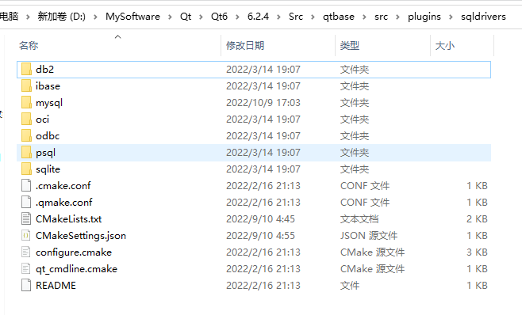
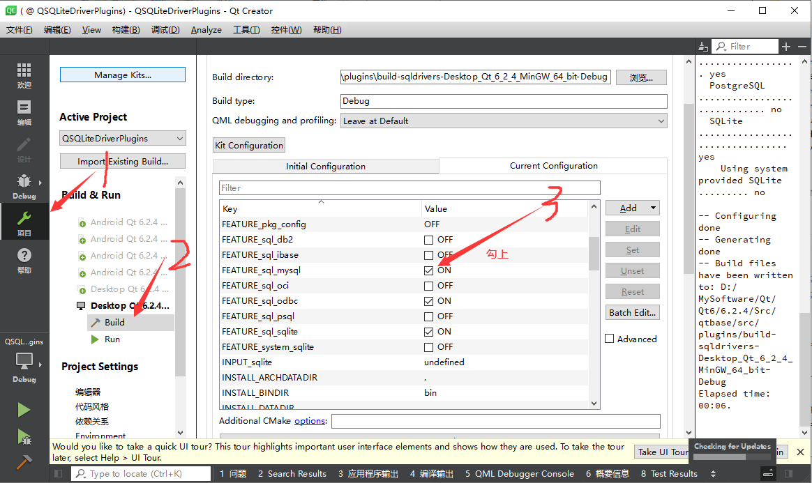
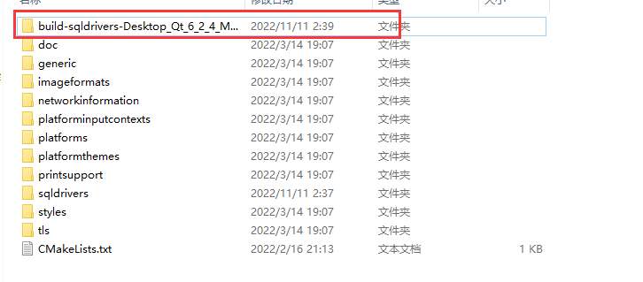
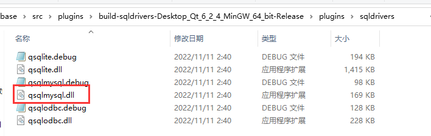
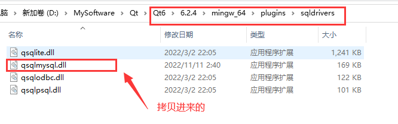
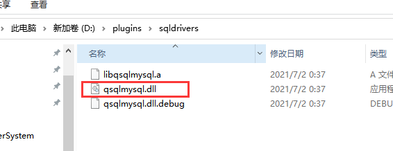
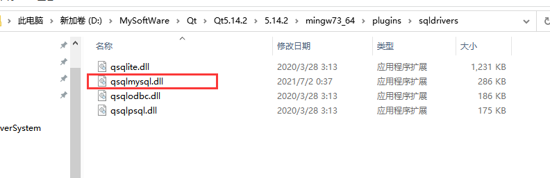
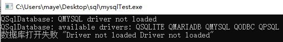
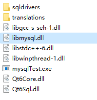
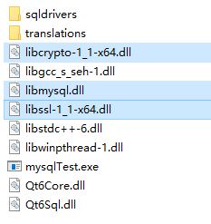

# Qt 操作数据库

Qt 框架中对数据库操作提供了很好的支持，我们可以通过 Qt 提供的类非常方便地和本地或者远程数据库进行连接。众所周知，数据库是 C-S（client-server）结构的，我们要连接的数据库属于服务器端，通过 Qt 编写的应用程序属于客户端。

## QSqlDatabase

> 连接数据库

QSqlDatabase类提供了一个通过连接访问数据库的接口。 QSqlDatabase的一个实例表示连接。 该连接通过一个受支持的数据库驱动程序提供对数据库的访问，该驱动程序派生自QSqlDriver。 

通过调用一个静态addDatabase()函数创建一个连接，在该函数中指定要使用的驱动程序或驱动程序类型(取决于数据库的类型)和一个连接名称。 连接可以通过它自己的名称而不是它所连接的数据库的名称得知。 可以有一个或多个数据库的连接。 QSqlDatabase还支持默认连接的概念，即未命名连接。 要创建默认连接，在调用addDatabase()时不要传递连接名称参数。 随后，如果您调用任何静态成员函数而没有指定连接名，则将假定默认连接。 

下面的代码片段展示了如何创建和打开到MySQL数据库的默认连接:  

```cpp
QSqlDatabase db = QSqlDatabase::addDatabase("QMYSQL");
db.setHostName("localhost");
db.setPort(3306);
db.setDatabaseName("mydb");
db.setUserName("root");
db.setPassword("123456");
bool ok = db.open();
```

**注意：如果提示驱动未加载，则需要编译驱动，并配置一下**

```css
QSqlDatabase: QMYSQL driver not loaded
QSqlDatabase: available drivers: QSQLITE QODBC QODBC3 QPSQL QPSQL7
```

[详细配置教程](#编译MySQL驱动)

创建QSqlDatabase对象之后，使用setDatabaseName()、setUserName()、setPassword()、setHostName()、setPort()和setConnectOptions()设置连接参数。 然后调用open()来激活到数据库的物理连接。 在您打开连接之前，该连接不可用。  

上面定义的连接将是默认连接，因为我们没有给addDatabase()提供连接名。 随后，你可以通过调用database()不带连接名称参数来获得默认连接:  

```cpp
 QSqlDatabase db = QSqlDatabase::database();
```

QSqlDatabase是一个值类。 通过一个QSqlDatabase实例对数据库连接所做的更改将影响表示同一连接的其他QSqlDatabase实例。 使用cloneDatabase()在现有数据库连接的基础上创建一个独立的数据库连接。  

**警告**:强烈建议不要将QSqlDatabase的副本作为类的成员保存，因为这将阻止在关闭时正确清理实例。 如果需要访问现有的QSqlDatabase，应该使用database()来访问它。 如果你选择有一个QSqlDatabase成员变量，它需要在QCoreApplication实例被删除之前被删除，否则它可能会导致未定义的行为。  

如果创建多个数据库连接，在调用addDatabase()时为每个连接指定唯一的连接名。 使用带有连接名的database()来获取该连接。 使用removeDatabase()和连接名一起删除连接。 如果您试图删除由其他QSqlDatabase对象引用的连接，QSqlDatabase将输出一个警告。 使用contains()查看给定的连接名是否在连接列表中。 

一些实用方法:

| 函数                                                         | 描述                                     |
| ------------------------------------------------------------ | ---------------------------------------- |
| QStringList tables()                                         | 返回数据库中所有的表列表                 |
| QSqlRecord QSqlDatabase::record(const QString &*tablename*)  | 返回一条记录(改记录只包含字段，没有数据) |
| bool QSqlDatabase::transaction()                             | 开启事务                                 |
| bool QSqlDatabase::commit()                                  | 提交事务                                 |
| bool QSqlDatabase::rollback()                                | 回滚事务                                 |
| bool QSqlDriver::hasFrature()                                | 检查驱动程序是否支持事务                 |
| QSqlError QSqlDatabase::lastError()                          | 返回数据库上发生的最后一个错误的信息。   |
| [static] QStringList QSqlDatabase::drivers()                 | 返回可用SQL驱动程序的名称                |
| [static] bool QSqlDatabase::isDriverAvailable(const QString &name) | 检查某个特定的驱动程序是否可用           |

## QSqlRecord

QSqlRecord类封装了数据库记录(通常是数据库中的表或视图中的一行)的功能和特征。 QSqlRecord支持添加和删除字段，以及设置和检索字段值。  

使用setValue()可以通过名称或位置设置记录字段的值; 如果你想设置一个字段值为空，使用setNull()。 要按名称查找字段的位置，请使用indexOf()，要在特定位置查找字段的名称，请使用fieldName()。 使用field()检索给定字段的QSqlField对象。 使用contains()查看记录是否包含特定的字段名。  

当生成要在数据库上执行的查询时，生成的SQL中只包含isGenerated()为true的字段。  

一条记录可以有通过append()或insert()添加的字段，通过replace()替换的字段，以及通过remove()删除的字段。 可以使用clear()删除所有字段。 字段的数量由count()给出; 所有它们的值都可以使用clearValues()清除(为空)。  

对SqlRecord记录字段操作不会影响到原来的表。

下面的代码片段展示了如何获取指定表的所有字段，只不过值是无效的。

```cpp
QSqlRecord rec = db.record("emp");
for (int i=0;i<rec.count();i++)
{
     qDebug()<<rec.fieldName(i)<<rec.value(i);
}
```


## QSqlField

> 表的字段

QSqlField表示数据库表或视图中单个列的特征，例如数据类型和列名。 字段还包含数据库列的值，可以查看或更改该值。  

字段数据值存储为qvariant。 不允许使用不兼容的类型。 例如:  

```cpp
QSqlField field("age", QVariant::Int);
field.setValue(QPixmap());  // WRONG
```

但是，在可能的情况下，字段会尝试将某些数据类型转换为字段数据类型:  

```cpp
QSqlField field("age", QVariant::Int);
field.setValue(QString("123"));  // casts QString to int
```

很少在应用程序代码中显式创建QSqlField对象。 它们通常通过已经包含字段列表的QSqlRecords间接访问。 例如:  

```cpp
QSqlQuery query;
...
QSqlRecord record = query.record();
QSqlField field = record.field("country");
```

QSqlField对象可以提供一些关于字段的元数据，例如，它的name()、variant type()、length()、precision()、defaultValue()、typeID()以及它的requiredStatus()、isGenerated()和isReadOnly()。 可以检查字段的数据，看看它是否为null()，并检索它的值()。 当编辑数据时，可以使用setValue()设置或使用clear()设置为NULL。 

## QSqlQuery 

> Sql查询

QSqlQuery封装了从在QSqlDatabase上执行的SQL查询中创建、导航和检索数据所涉及的功能。 它可以用于执行DML(数据操作语言)语句，如SELECT、INSERT、UPDATE和DELETE，也可以用于执行DDL(数据定义语言)语句，如CREATE TABLE。 它也可以用于执行非标准SQL的特定数据库命令。  

成功执行的SQL语句将查询的状态设置为活动，以便isActive()返回true。 否则，查询的状态将设置为不活动。 在这两种情况下，当执行新的SQL语句时，查询将定位在无效的记录上。 在检索值之前，活动查询必须导航到有效记录(以便isValid()返回true)。  

导航记录有以下功能:  

```cpp
bool next()					//检索结果中的下一条记录(如果可用)，并在检索的记录上定位查询。
bool previous()				//检索结果中的前一条记录(如果可用)，并将查询定位于检索的记录上。  
bool first()				//检索结果中的第一条记录(如果可用)，并在检索的记录上定位查询。  
bool last()					//检索结果中的最后一条记录(如果可用)，并在检索的记录上定位查询  
bool seek()  				//在位置索引处检索记录(如果可用)，并在检索的记录上定位查询。 第一条记录位于位置0。
int at() const				//返回查询的当前内部位置。 如果位置无效，函数返回特殊的负值QSql::BeforeFirstRow或QSql::AfterLastRow。  
```

这些函数允许程序员在查询返回的记录中向前、向后移动或任意移动。 如果您只需要移动结果(例如，使用next())，您可以使用setForwardOnly()，这将节省大量的内存开销，并提高某些数据库的性能。 一旦活动查询定位在有效记录上，就可以使用value()检索数据。 所有数据都使用qvariant从SQL后端传输。  

例如：

```cpp
QSqlQuery query("SELECT ename FROM emp");
while (query.next()) {
      QString ename = query.value(0).toString();
      QString ename = query.value("ename").toString();
      qDebug()<< ename;
}
```

要访问查询返回的数据，请使用value(int)。 通过从0开始传递字段在语句中的位置来访问SELECT语句返回的数据中的每个字段。 这使得使用SELECT *查询是不可取的，因为返回的字段的顺序是不确定的。  

下面代码片段可以获取指定表的所有记录：

```cpp
QSqlQuery query("SELECT * FROM emp");
auto record = query.record();
while (query.next())
{
     for (int i = 0;i<record.count();i++)
     {
         QString ename = query.value(i).toString();
         std::cout<< ename.toStdString()<<"\t";
     }
     std::cout<<std::endl;
 }
```

+ 获取SQL语句查询到的记录条数

```cpp
int QSqlQuery::size() const
```

+ 获取SQL语句影响的行数

```cpp
int QSqlQuery::numRowsAffected() const
```

size()用来获取SELECT语句查询到的记录条数。如果大小无法确定或数据库不支持报告有关查询大小的信息，则返回-1。 注意，对于非select语句(isSelect()返回false)， size()将返回-1。 如果查询不是活动的(isActive()返回false)，则返回-1。  

numRowsAffected()返回受结果的SQL语句影响的行数，如果不能确定，则返回-1。 注意，对于SELECT语句，该值是未定义的; 使用大小()。 如果查询未激活，则返回-1。  

Oracle数据库使用`冒号-名称`语法来标识占位符，例如:name。 ODBC简单使用 ? 字符。 Qt支持这两种语法，但有一个限制，就是不能在同一个查询中混合使用它们。  

可以使用boundValues()检索单个变量(映射)中所有字段的值。  


QSqlQuery支持预先准备的查询执行和将参数值绑定到占位符。 有些数据库不支持这些特性，所以对于这些特性，Qt会模拟所需的功能。

Oracle数据库使用冒号语法识别占位符，例如:name。 ODBC仅仅使用? 字符。 Qt支持这两种语法，只是不能将它们混合在同一个查询中。  

### 绑定值的方法

下面我们将展示使用四种不同绑定方法中的每一种的相同示例。

- 使用**命名**占位符的**命名**绑定：

```cpp
QSqlQuery query;
query.prepare("INSERT INTO user (id, username, nickname)"
               "VALUES (:id, :username, :nickname)");
query.bindValue(":id",520);
query.bindValue(":username","maye");
query.bindValue(":nickname","顽石");
query.exec();
```

- 使用**命名**占位符的**位置**绑定：

```cpp
QSqlQuery query;
query.prepare("INSERT INTO user (id, username, nickname)"
               "VALUES (:id, :username, :nickname)");
query.bindValue(0,520);
query.bindValue(1,"maye");
query.bindValue(2,"顽石");
query.exec();
```

+ 使用**位置**占位符绑定值(版本1)：

```cpp
QSqlQuery query;                                         
query.prepare("INSERT INTO user (id, username, nickname)"  
           "VALUES (?,?,?)");                              
query.bindValue(0,520);                                    
query.bindValue(1,"maye");                                 
query.bindValue(2,"顽石");                                   
query.exec();  
```

+ 使用**位置**占位符绑定值(版本2)：  

```cpp
QSqlQuery query;                                       
query.prepare("INSERT INTO user (id, username, nickname)"
           "VALUES (?,?,?)");                            
query.addBindValue(520);                                 
query.addBindValue("maye");                              
query.addBindValue("顽石");                                
query.exec();                                            
```

另外，未绑定的参数将导致操作失败。  

**批量执行**

在批处理中执行先前准备的SQL查询。 所有绑定参数都必须是变量列表。

```cpp
QSqlQuery q;
q.prepare("insert into stu values (?,?,?)");

QVariantList names = QVariantList()<<"Maye"<<"young"<<"百毒不侵"<<"落笔不打";
q.addBindValue(names);

QVariantList ages = QVariantList << 26 << 36 << 46 << 56;
q.addBindValue(ages);

QVariantList scores = QVariantList << 89 << 69.9 << 79.9 << QVariant(QVariant::Float);//最后插入一个NULL
q.addBindValue(scores);

if (!q.execBatch())
   qDebug() << q.lastError();
```

注意:每个绑定的QVariantList必须包含相同数量的变量。  

注意:列表中qvariables的类型不能更改。 例如，您不能在QVariantList中混合整数和字符串变量。

## 数据库模型

### QSqlQueryModel

QSqlQueryModel类为SQL结果集提供了**只读数据模型**。

QSqlQueryModel是执行SQL语句和遍历结果集的高级接口。 它构建在较低级别的QSqlQuery之上，可用于向视图类(如QTableView)提供数据。

```cpp
QSqlQueryModel *sqlQueryModel = new QSqlQueryModel(this);
//sqlQueryModel->setQuery(query);
sqlQueryModel->setQuery("select * from user",database);

QTableView * view = new QTableView;
view->setModel(sqlQueryModel);
view->show();
```

我们设置了模型的查询，然后设置了显示在视图头中的标签。  

QSqlQueryModel也可以用于通过编程方式访问数据库，而无需将其绑定到视图:  

```cpp
QSqlQueryModel model;
model.setQuery("SELECT username,nickname FROM user");
QString nickname = model.record(4).value("nickname").toInt();
```

上面的代码片段从SELECT查询结果集中的记录4中提取nickname字段。 由于nickname是第3列(索引为2)，我们可以重写最后一行如下:  

```cpp
QString nickname = model.data(model.index(4,2)).toInt();
```

默认情况下，模型是只读的。 要使它可读可写，必须子类化它并重新实现setData()和flags()。 另一种选择是使用QSqlTableModel，它提供了基于单个数据库表的读写模型。    

如果数据库不返回查询中选择的行数，模型将以递增的方式获取行。

```cpp
//清除模型并释放所有获得的资源。 
virtual void clear()
//返回关于数据库上发生的最后一个错误的信息      
QSqlError lastError() const
//返回与此模型关联的QSqlQuery。      
QSqlQuery query() const
//返回包含有关当前查询字段信息的记录。 如果row是有效行的索引，则记录将使用来自该行的值填充。      
QSqlRecord record(int row) const
QSqlRecord record() const
//执行给定数据库连接db的查询查询。 如果没有指定数据库(或无效的数据库)，则使用默认连接。 
void setQuery(const QSqlQuery &query)
void setQuery(const QString &query, const QSqlDatabase &db = QSqlDatabase())
```


### QSqlTableModel

QSqlTableModel类为单个数据库表提供了一个可编辑的数据模型  

QSqlTableModel是一个高级接口，用于从单个表中读写数据库记录。可用于向视图类(如QTableView)提供数据。 例如:  

```cpp
//构造时指定数据库，如果使用默认连接则不需要指定
QSqlTableModel* sqltableModel = new QSqlTableModel(this,database);
//设置需要查询的表名
sqltableModel->setTable("freecustomers");	
//设置在视图中编辑值时选择的策略。  OnManualSubmit手动提交
sqltableModel->setEditStrategy(QSqlTableModel::EditStrategy::OnManualSubmit);
//使用指定的过滤器和排序条件，用setTable()设置的表中的数据填充模型，如果成功则返回true; 否则返回false。  
sqltableModel->select();
//设置表头数据
sqltableModel->setHeaderData(0,Qt::Horizontal,"ID");
sqltableModel->setHeaderData(1,Qt::Horizontal,"QQ");
sqltableModel->setHeaderData(2,Qt::Horizontal,"电话");

QTableView * tableView = new QTableView;
tableView->setModel(sqltableModel);
tableView->hideColumn(0);	//隐藏ID
tableView->show();
```

QSqlTableModel不提供对外键的直接支持。 如果要解析外键，请使用QSqlRelationalTableModel和QSqlRelationalDelegate。  

#### 其他函数

```cpp
//还原指定行的更改
virtual void revertRow(int row)
////设置在视图中编辑值时选择的策略。    
virtual void setEditStrategy(QSqlTableModel::EditStrategy strategy)
//将当前筛选器设置为筛选器。这个过滤器是一个没有关键字WHERE的SQL WHERE子句(例如，name='Josephine')。      
virtual void setFilter(const QString &filter)
//设置一条记录到指定行，记录顺序可以随意，会自动映射    
bool setRecord(int row, const QSqlRecord &values)
bool insertRecord(int row, const QSqlRecord &record)    

//将列的排序顺序设置为order。 这不会影响当前数据，要使用新的排序顺序刷新数据，调用select()。（在查询之前设置即可）     
virtual void setSort(int column, Qt::SortOrder order)
//将模型操作的数据库表设置为tableName。 如果设置之后不调用select，那么将获取表的字段信息，要获取数据，必须调用select      
virtual void setTable(const QString &tableName)
//获取表名    
QString tableName() const
//获取一条空记录，只有字段名。 此函数可用于检索记录的字段名。    
QSqlRecord record() const
//获取指定行的记录，如果row是有效行的索引。  如果模型没有初始化，将返回一个空记录。 
QSqlRecord record(int row) const    
//返回当前表的主键，如果表没有设置或没有主键，则返回空QSqlIndex。  
QSqlIndex primaryKey() const    
//如果模型包含未提交到数据库的修改值，则返回true，否则返回false。  
bool isDirty(const QModelIndex &index) const
bool isDirty() const    
```

+ slots

```cpp
//当用户取消编辑当前行时，项目委托将调用这个重新实现的槽。  如果模型的策略设置为OnRowChange或OnFieldChange，则恢复更改。 对OnManualSubmit策略不做任何操作。  使用revertAll()来恢复OnManualSubmit策略的所有挂起的更改，或使用revertRow()来恢复特定的行。  
virtual void revert() override
//恢复所有待提交的更改
void revertAll()
//使用指定的过滤器和排序条件，用setTable()设置的表中的数据填充模型，如果成功则返回true; 否则返回false。      
virtual bool select()
//刷新某一行，按主键匹配，如果没有主键，那么每一个字段都必须对应(重新从数据库中查询一行)    
virtual bool selectRow(int row)
//使用submitAll()提交OnManualSubmit策略中所有挂起的更改。  成功返回true; 否则返回false。 使用lastError()查询详细的错误信息。  不会自动重新填充模型。 成功时将从数据库刷新提交的行。      
virtual bool submit() override
//提交所有挂起的更改并在成功时返回true。 错误返回false，详细的错误信息可以通过lastError()获得。  
//注意:在OnManualSubmit模式下，当submitAll()失败时，已经提交的更改不会从缓存中清除。 这允许在不丢失数据的情况下回滚和重新提交事务。      
bool submitAll()
```

+ signals

```cpp
//在删除某一行之前会发出这个信号
void beforeDelete(int row)
//在插入某一条记录之前会发出这个信号，可以在插入之前修改记录 (这里是使用insertRow() 或 setData() 插入非空数据时发出的)   
void beforeInsert(QSqlRecord &record)
//在更新某一行记录之前发出此信号。    
void beforeUpdate(int row, QSqlRecord &record)
//准备插入一条记录是时，insertRows()将发出此信号。 可以将记录参数写入(因为它是一个引用)，例如用默认值填充某些字段，并设置字段的生成标志(这里是使用insertRows()插入多个空行时发出的，一次插入多条，那么每一条记录就会发出一次信号)   
void primeInsert(int row, QSqlRecord &record)
```


### QSqlRelationalTableModel

QSqlRelationalTableModel的作用类似于QSqlTableModel，但允许将列设置为其他数据库表的外键。  

左边的截图显示了一个普通的QTableView中的QSqlTableModel。 外键(城市和国家)不能解析为人类可读的值。 右边的屏幕截图显示了一个QSqlRelationalTableModel，外键被解析为人类可读的文本字符串。  

```cpp
QSqlRelationalTableModel* relationalModel = new QSqlRelationalTableModel(this,database);
relationalModel->setTable("freecustomers");
relationalModel->setRelation(1,QSqlRelation("lectures","qq","nickname"));
relationalModel->select();
```

调用setRelation()函数建立两个表之间的关系。 调用指定表freecustomers中的第1列是与表lectures的字段qq映射的外键，并且视图应该向用户显示城市的名称字段。 (把freecustomers表中第一列(qq字段)，换成lectures表中qq与nickname对应的字段)

如果使用可读可写的QSqlRelationalTableModel，则可能需要在视图上使用QSqlRelationalDelegate。 与默认委托不同，QSqlRelationalDelegate为作为其他表的外键的字段提供了一个组合框。 要使用该类，只需在视图中调用QAbstractItemView::setItemDelegate()，并使用QSqlRelationalDelegate的实例:  

```cpp
QTableView * tableView = new QTableView;
tableView->setModel(relationalModel);
tableView->setItemDelegate(new QSqlRelationalDelegate(this));
tableView->show();
```

#### 其他函数

```cpp
//设置SQL joinMode以显示或隐藏具有NULL外键的行。 在InnerJoin模式(默认)中，这些行不会显示:如果您想显示它们，请使用LeftJoin模式。  
void setJoinMode(QSqlRelationalTableModel::JoinMode joinMode)
//让指定的列是relation指定的外部索引。     
virtual void setRelation(int column, const QSqlRelation &relation)
```


# 数据库操作

## 基本操作

#### 创建表

```sql
create table 表名(字段名 类型(大小) 主键限制，字段名 类型(大小)，...);
create table student(id int primary key auto_increment,name varchar(50),age int ,score float(3,2));
CREATE TABLE class(classid int NOT NULL PRIMARY KEY,name varchar(50) NOT NULL);

/*增加字段并赋值*/
alter table 表名 add new字段名 类型;
update 表名 set new字段名=值 ;

alter table student add courseid int;			#给student添加一个courseid字段
ALTER TABLE student add FOREIGN KEY(courseid) REFERENCES class(classid);#把课程id设置为外键
-- update student set courseid=1;
```

| 类型/限制      | 描述                        |
| -------------- | --------------------------- |
| primary key    | 主键                        |
| auto_increment | 自增长                      |
| int            | 整型                        |
| varchar(int)   | 字符串(大小)                |
| FLOAT(size,d)  | 浮点型，size最大位数，d精度 |


#### 插入

```sql
insert into 表名(字段名,字段名...) values(数据，数据,...);	/*部分数据插入*/
insert into 表名 values(数据，数据,...);					/*全数据插入*/

insert into student values(0,'maye',18,59.9,1);
insert into student(name,age,score,classid) values('hello',18,66.9,1);
```

QSqlQuery支持多条数据插入(占位符..)

#### 查询

```sql
select 字段名，... from 表名 where 条件;

select * from student;							/*查询所有信息*/
select * from student where age=18;				/*查询所有年龄等于18的信息*/
select name,score from student where score=60;	/*查询分数为60的学生信息，只查询name和score字段*/
```

#### 删除

```sql
delete from 表名 where 条件;

delete from student where name='maye';	/*删除名为maye的记录*/
```

#### 更新

```sql
update 表名 set name='顽石',age=19,... where name='maye';
```

在更新记录时要格外小心！在上面的实例中，如果我们省略了 WHERE 子句，执行以上代码会将 student表中所有数据的 name 改为 ’顽石‘，age 改为 19。

<font style="color:red;">执行没有 WHERE 子句的 UPDATE 要慎重，再慎重。</font>

#### 事务

```cpp
auto db = QSqlDatabase::database();
db.transaction()	//开启事务 (当前操作不会立即更新数据库，而是会先缓存，等待提交或者回滚)
/*dosomething...*/    
db.commit();		//提交事务 (确认操作)
db.rollback();		//回滚事务 (撤销操作)
```


# 编译MySQL驱动

Qt5.13版本后不包含MySQL的驱动插件，需要自己手动编译。

而对于不同的编译套件，又需要分别编译，这里将阐述详细过程~

在编译MySQL驱动之前，请确保Qt的Source源码已经安装好了~

+ 在Qt安装目录找到Qt的插件源码目录

```css
D:\MySoftware\Qt\Qt6\6.2.4\Src\qtbase\src\plugins\sqldrivers
```



+ 进入sqldrivers目录之后，用QtCreator打开，套件选择MinGW 64-bit，等待配置完成，构建类型选择Release

  点击左边工具菜单的项目，勾上mysql，点击编译(**记得先把你的MySQL配置到环境变量哟**)

  

+ 如果编译没有问题，将会在同级目录生成build目录，进入找到(plugins/sqldrivers)编译好的驱动`qsqlmysql.dll`，把它拷贝到MinGw64套件的驱动目录。

  

  **找到并复制**

  

**粘贴进套件的sqldrivers目录**




4. 然后点击编译，会在Qt安装目录的盘符根目录(我这里是在D盘)生成plugins文件夹（D:\plugins）,进入找到qsqlmysql.dll，复制到Qt**对应的编译套件**目录中的plugins/sqldrivers目录中





+ 测试是否配置成功

  ```cpp
  #include <QCoreApplication>
  #include <QSqlDatabase>
  #include <QSqlError>
  #include <QDebug>
  int main(int argc, char *argv[])
  {
      QCoreApplication a(argc, argv);
  
      QSqlDatabase db = QSqlDatabase::addDatabase("QMYSQL");
      db.setUserName("root");
      db.setPassword("12345678");
      db.setDatabaseName("test");
  
      if(!db.open())
      {
           qInfo()<<"数据库打开失败"<<db.lastError().text();
  
      }
      else
      {
          qInfo()<<"数据库打开成功";
      }
  
      return a.exec();
  }
  
  ```

## 使用SQLite

SQLite（sql）是一款开源轻量级的数据库软件，不需要server，可以集成在其他软件中，非常适合嵌入式系统。Qt5以上版本可以直接使用SQLite（Qt自带驱动）。

### 1，准备

1. 引入SQL模块
   在Qt项目文件(.pro文件)中，加入SQL模块：

```
QT += sql
```

1. 引用头文件
   在需要使用SQL的类定义中，引用相关头文件。例如：

```
#include <QSqlDatabase>
#include <QSqlError>
#include <QSqlQuery>
```

### 2，连接数据库

连接SQLite不需要指定服务器名和端口号，但是可以设置用户名和密码。如果指定的数据库名不存在，则会创建一个新的。

```cpp
QSqlDatabase db = QSqlDatabase::addDatabase("QSQLITE");
db.setUserName("root");
db.setPassword("123456");
db.setDatabaseName("student.db");	

if(!db.open())
{
     cout<<"student 数据库打开失败";
     return;
}
```

# 使用了MySQL数据库的程序部署

如果你的程序使用了MySQL数据库，那么在部署时，需要将MySQL的依赖，一并拷贝到exe同级目录。

+ 如果没有拷贝libmysql.dll动态库，会出现如下错误



明明显示了有QMYSQL驱动，却提示驱动没有加载，在MySQL安装目录的lib目录把`libmysql.dll`拷贝到exe同级目录试试。



咦！怎么和刚刚的错误信息一样，加了和没加一样，这是因为还需要一些库，这些库可以在MySQL的安装目录的bin目录里面找到

+ libcrypto-1_1-x64.dll  加密解密库
+ libssl-1_1-x64.dll         安全传输库

找到之后，同样拷贝进去，在双击运行即可！



