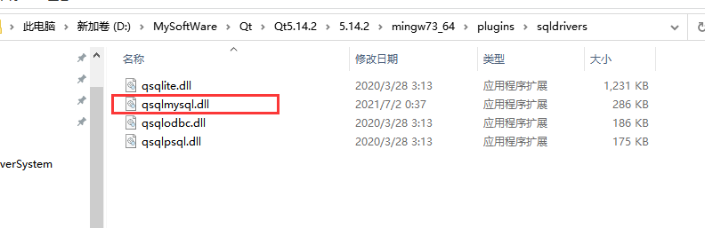
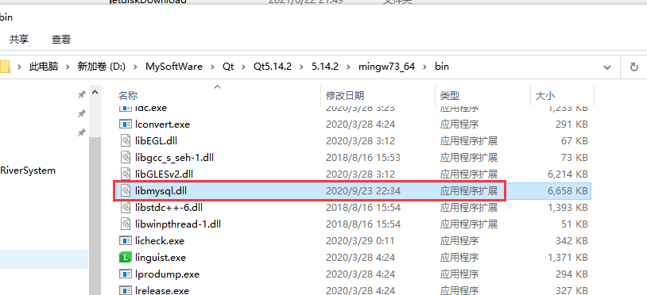

# MySql数据库安装

## 什么是MySql？

MySQL 是最流行的关系型数据库管理系统，数据库（Database）是按照数据结构来组织、存储和管理数据的仓库。

在没有使用数据库之前，我们一般都是把数据存储在文件中的，但是对于文件来说，读写数据速度相对较慢。

所以，现在我们使用关系型数据库管理系统（RDBMS）来存储和管理大数据量。所谓的关系型数据库，是建立在关系模型基础上的数据库，借助于集合代数等数学概念和方法来处理数据库中的数据。

话不多说我们先来安装MySql数据库吧！

## 如何下载

进入MySql官网[https://dev.mysql.com/downloads/mysql/],选择操作系统，默认是windows，下面选择免安装压缩包下载


## 解压，了解目录

下载好了之后解压即可，可以看到有很多的目录


  bin:存放命令，二进制文件，脚本等

  data(后续操作之后才会有这个目录)：存放数据库数据，table数据，数据存放位置可以自己定义，不一定存在这个路径

  docs:存放文档

  include:存放C语言头文件

  lib:头文件对应的库


## 配置Mysql

以**管理员**身份运行cmd，并进入到mysql的bin目录。


### 初始化mysql

在控制台输入mysqld --initialize --console，成功了后面会有一个密码，先记住哦~


### 安装mysql服务

执行命令`mysqld --install`  移除服务命令`mysqld --remove`


如果有配置文件可以安装服务的时候，指定配置文件(mysql是服务名称)


my.ini

```cpp
[mysql]
# 设置mysql客户端默认字符集
default-character-set=utf8 
[mysqld]
#设置3306端口
port = 3306 
# 设置mysql的安装目录
basedir=E:\Tool\mysql-8.0.22-winx64
# 设置mysql数据库的数据的存放目录
datadir=E:\Tool\mysql-8.0.22-winx64\data

# 允许最大连接数
max_connections=200
# 服务端使用的字符集默认为UTF8
character-set-server=utf8
# 创建新表时将使用的默认存储引擎
default-storage-engine=INNODB
```


### 启动服务

执行命令`net start mysql` 停止服务命令`net stop mysql`


### 登录MySql

启动服务之后就可以登录啦，输入mysql -u root -p 回车之后会提示你输入密码，输入上面初始化的密码即可


### 修改默认密码

登录之后命令行的提示已经变成了mysql>  接着输入set password for 'root'@'localhost'='你的新密码'；回车即可修改，不要忘记后面的分号哦


### 退出MySql

输入quit;即可退出登录，下次登录就可以使用你修改的密码了


### 设置系统环境变量

进入bin目录，然后复制路径，添加到系统环境变量的path下


设置完之后，可以进入cmd登录测试一下哦~

## 可能的错误及解决方法

### 1，发生系统错误 2

即使我们配置了系统环境变量，此时我们执行mysqld时也应该到mysql/bin目录下去执行：

  ``` sh
1>mysqld remove
2>mysqld install
3>net start mysql
  ```


# 编译MySQL数据库驱动

+ 找到Qt的mysql插件源码目录

  ```css
  D:\MySoftWare\Qt\Qt5.14.2\5.14.2\Src\qtbase\src\plugins\sqldrivers\mysql
  ```

+ 双击pro文件打开项目，在pro文件中加入mysql的安装目录

  ```js
  TARGET = qsqlmysql
  
  HEADERS += $$PWD/qsql_mysql_p.h
  SOURCES += $$PWD/qsql_mysql.cpp $$PWD/main.cpp
  
  #自己注释掉
  #QMAKE_USE += mysql
  
  OTHER_FILES += mysql.json
  
  #加上自己的mysql目录
  win32:LIBS += -LF:/Tools/mysql-8.0.22-winx64/lib -llibmysql
  INCLUDEPATH += F:/Tools/mysql-8.0.22-winx64/include
  DEPENDPATH += F:/Tools/mysql-8.0.22-winx64/include
  
  
  PLUGIN_CLASS_NAME = QMYSQLDriverPlugin
  include(../qsqldriverbase.pri)
  ```

+ 然后点击编译，会在Qt安装目录的盘符根目录(我这里是在D盘)生成plugins文件夹（D:\plugins）,进入找到qsqlmysql.dll，复制到Qt**对应的编译套件**目录中的plugins/sqldrivers目录中

  



+ 最后将mysql安装目录下面的lib下面的libmysql.dll 复制到Qt对应的编译套件目录的bin目录中

  



+ 测试是否配置成功

  ```cpp
  QSqlDatabase db = QSqlDatabase::addDatabase("QMYSQL");
      db.setHostName("127.0.0.1");
      db.setPort(3306);
      db.setUserName("root");
      db.setPassword("12345678");
      db.setDatabaseName("testqt");
  
      if(!db.open())
      {
          cout<<"DunKai 数据库打开失败";
          return;
      }
  ```

# 使用mysql数据库的程序打包

+ 程序打包之后，需要把mysql数据库bin目录下面的`libcrypto-1_1-x64.dll和libssl-1_1-x64.dll`两个动态库拷贝到可执行程序的同级目录，以及lib目录下面的libmysql.dll也要拷贝进去


# 数据库操作

## 连接数据库

要在Qt中连接数据库，需要使用QSqlDatabase类，通过调用一个静态的addDatabase()函数来创建一个连接，在这个函数中你指定要使用的驱动程序或驱动程序类型(取决于数据库的类型)和一个连接名。 

连接名标识连接的作用。 一个数据库可以有多个连接。 QSqlDatabase还支持默认连接的概念，即未命名连接。 要创建默认连接，在调用addDatabase()时不要传递连接名参数。 随后，如果您调用任何静态成员函数而不指定连接名，则假定使用默认连接。 

```cpp
QSqlDatabase database = QSqlDatabase::addDatabase("QMYSQL");
database.setHostName("81.70.201.51");
database.setPort(3306);
database.setDatabaseName("testqt");
database.setUserName("root");
database.setPassword("dunkaiedu@****");

if(!database.open())
{
     qWarning("%s 数据库打开失败~",database.databaseName().toStdString().data());
     return;
}
```

上面定义的连接将是默认连接，因为我们没有给addDatabase()提供连接名。 随后，你可以通过调用database()而不带连接名参数来获得默认连接:  

```cpp
QSqlDatabase db = QSqlDatabase::database();
```

**注意**：不要将QSqlDatabase作为成员变量，因为这将阻止在关闭时正确地清理实例。 如果需要访问现有的QSqlDatabase，那么应该使用database()来访问它。

## QSqlQuery

QSqlQuery类提供了一种执行和操作SQL语句的方法。  

QSqlQuery封装了从QSqlDatabase上执行的SQL查询中创建、导航和检索数据所涉及的功能。 它可以用于执行DML(数据操作语言)语句，如SELECT、INSERT、UPDATE、DELETE，以及DDL(数据定义语言)语句，如CREATE TABLE。

### 查询

成功执行的SQL语句将查询的状态设置为活动状态，以便isActive()返回true。 否则查询的状态将被设置为非活动状态。 在这两种情况下，当执行一个新的SQL语句时，查询定位在一个无效的记录上。 活动查询必须导航到有效的记录(以便isValid()返回true)，然后才能检索值。  

导航记录通过以下功能执行：

```cpp
bool next()					//检索结果中的下一条记录(如果可用)，并在检索的记录上定位查询。
bool previous()				//检索结果中的前一条记录(如果可用)，并将查询定位于检索的记录上。  
bool first()				//检索结果中的第一条记录(如果可用)，并在检索的记录上定位查询。  
bool last()					//检索结果中的最后一条记录(如果可用)，并在检索的记录上定位查询  
bool seek()  				//在位置索引处检索记录(如果可用)，并在检索的记录上定位查询。 第一条记录位于位置0。
int at() const				//返回查询的当前内部位置。 如果位置无效，函数返回特殊的负值QSql::BeforeFirstRow或QSql::AfterLastRow。  
```

这些函数允许程序员向前、向后或任意地通过查询返回的记录。 如果您只需要通过结果向前移动(例如，通过使用next())，您可以使用**setForwardOnly()**，这将节省大量的内存开销，并提高某些数据库的性能。 一旦将活动查询定位到有效记录上，就可以使用value()检索数据。 所有数据使用QVariants从SQL后端传输。  

例如：

```cpp
QSqlQuery query("select * from user");
while(query.next())
{
      qDebug()<< query.value(0).toInt();	
}
//如果知道字段的数量，可以用循环获取一条记录的所有数据
while(query.next())
{
    for(int i =0;i<5;i++)
       std::cout<< query.value(i).toString().toLocal8Bit().toStdString();
    std::cout<<std::endl;
}
```

要访问查询返回的数据，请使用value(int)。 通过从0开始传递字段在语句中的位置，可以访问SELECT语句返回的数据中的每个字段。 这使得不建议使用SELECT * 查询，因为返回字段的顺序是不确定的。  

还可以通过名称访问字段的函数。 要将字段名转换为索引，请使用record().indexOf()。

例如:  

```cpp
QSqlQuery query("select * from user",database);
while(query.next())
{
     qDebug() <<query.value("username").toString()<< query.value("nickname").toString();
}
```

QSqlQuery支持准备好的查询执行和参数值到占位符的绑定。 有些数据库不支持这些特性，因此Qt会模拟所需的功能。 例如，Oracle和ODBC驱动程序有适当的预置查询支持，Qt就利用了它; 但是对于不支持这个功能的数据库，Qt自己实现了这个功能，例如在执行查询时用实际值替换占位符。

 使用numRowsAffected()来确定有多少行受到非SELECT查询的影响，使用size()来确定有多少行被SELECT检索。  

+ 查询语句 select 使用`size()`查看查询了多少条记录
+ 非查询语句(比如update，insert into 等)使用numRowsAffected()查看有多少行收到了影响


Oracle数据库使用`冒号-名称`语法来标识占位符，例如:name。 ODBC简单使用 ? 字符。 Qt支持这两种语法，但有一个限制，就是不能在同一个查询中混合使用它们。  

可以使用boundValues()检索单个变量(映射)中所有字段的值。  

### 绑定值的方法

下面我们将展示使用四种不同绑定方法中的每一种的相同示例。

- 使用命名占位符的命名绑定：

```cpp
QSqlQuery query;
query.prepare("INSERT INTO user (id, username, nickname)"
               "VALUES (:id, :username, :nickname)");
query.bindValue(":id",520);
query.bindValue(":username","maye");
query.bindValue(":nickname","顽石");
query.exec();
```

- 使用命名占位符的位置绑定：

```cpp
QSqlQuery query;
query.prepare("INSERT INTO user (id, username, nickname)"
               "VALUES (:id, :username, :nickname)");
query.bindValue(0,520);
query.bindValue(1,"maye");
query.bindValue(2,"顽石");
query.exec();
```

+ 使用位置占位符绑定值(版本1)：

```cpp
QSqlQuery query;                                         
query.prepare("INSERT INTO user (id, username, nickname)"  
           "VALUES (?,?,?)");                              
query.bindValue(0,520);                                    
query.bindValue(1,"maye");                                 
query.bindValue(2,"顽石");                                   
query.exec();  
```

+ 使用位置占位符绑定值(版本2)：  

```cpp
QSqlQuery query;                                       
query.prepare("INSERT INTO user (id, username, nickname)"
           "VALUES (?,?,?)");                            
query.addBindValue(520);                                 
query.addBindValue("maye");                              
query.addBindValue("顽石");                                
query.exec();                                            
```

另外，未绑定的参数将保留其值。  

**警告**：在创建QSqlQuery之前，必须加载SQL驱动程序并打开连接。 此外，当查询存在时，连接必须保持打开; 否则，QSqlQuery的行为是未定义的。  

## 数据库模型

### QSqlQueryModel

QSqlQueryModel类为SQL结果集提供了**只读数据模型**。

QSqlQueryModel是执行SQL语句和遍历结果集的高级接口。 它构建在较低级别的QSqlQuery之上，可用于向视图类(如QTableView)提供数据。

```cpp
QSqlQueryModel *sqlQueryModel = new QSqlQueryModel(this);
//sqlQueryModel->setQuery(query);
sqlQueryModel->setQuery("select * from user",database);

QTableView * view = new QTableView;
view->setModel(sqlQueryModel);
view->show();
```

我们设置了模型的查询，然后设置了显示在视图头中的标签。  

QSqlQueryModel也可以用于通过编程方式访问数据库，而无需将其绑定到视图:  

```cpp
QSqlQueryModel model;
model.setQuery("SELECT username,nickname FROM user");
QString nickname = model.record(4).value("nickname").toInt();
```

上面的代码片段从SELECT查询结果集中的记录4中提取nickname字段。 由于nickname是第3列(索引为2)，我们可以重写最后一行如下:  

```cpp
QString nickname = model.data(model.index(4,2)).toInt();
```

默认情况下，模型是只读的。 要使它可读可写，必须子类化它并重新实现setData()和flags()。 另一种选择是使用QSqlTableModel，它提供了基于单个数据库表的读写模型。    

如果数据库不返回查询中选择的行数，模型将以递增的方式获取行。 更多信息请参见fetchMore()。 