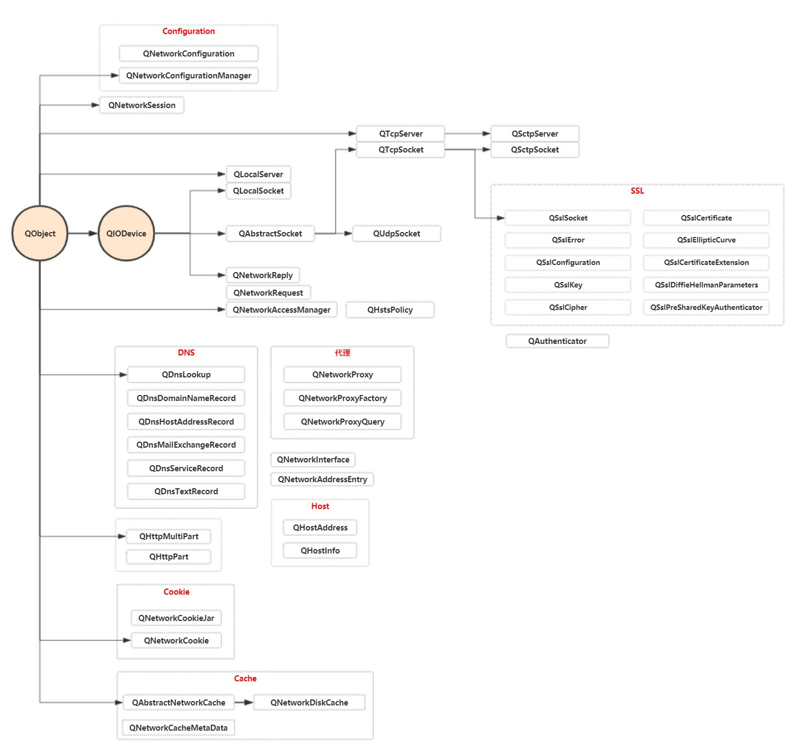

# 网络编程

Qt中的 Qt Network模块用来编写基于TCP/IP的网络程序,其中提供了较低层次的类,比如 QTcpSocket,QTcpServer和QUdpSocket等,来表示低层次的网络概念;还有高层次的类,比如 QNetworkRequest、QNetworkReply和QNetworkAccessManager,使用通用的协议来执行网络操作。

Qt5中所有网络相关的C++类的继承关系如下图：

## 主机(Host)

### QHostInfo

QHostInfo查找与主机名相关联的IP地址或与IP地址相关联的主机名。该类提供了两个静态方便函数:一个异步工作，一旦找到主机就发出信号，另一个阻塞并返回QHostInfo对象。  

要**异步**查找主机的IP地址，调用lookupHost()，它以主机名或IP地址、接收器对象和槽位签名作为参数，并返回一个ID。可以通过使用查找ID调用abortHostLookup()来中止查找。

```cpp
//通过域名查找ip
QHostInfo::lookupHost("www.baidu.com",this,[](const QHostInfo& info)
{
    qDebug()<<info.hostName()<<info.addresses();
});
//查找ip是否存在
QHostInfo::lookupHost("183.232.231.172",this,[](const QHostInfo& info)
{
    qDebug()<<info.hostName()<<info.addresses();
});
```

当结果准备好时，将调用该槽。 结果存储在QHostInfo对象中。 调用addresses()获取主机的IP地址列表，调用hostName()获取所查找的主机名。  

如果查找失败，error()将返回所发生的错误类型。 errorString()给出了可读的查找错误描述。  

如果你想要一个**阻塞**查找，使用QHostInfo::fromName()函数:  

```cpp
QHostInfo info = QHostInfo::fromName("smtp.qq.com");
qDebug()<<info.hostName()<<info.addresses();
```

QHostInfo通过IDNA和Punycode标准支持国际化域名(IDNs)。  

要检索本地主机的名称，请使用静态QHostInfo::localHostName()函数。  

```cpp
qDebug()<< QHostInfo::localHostName();	//DESKTOP-4GI0IAG
```


### QHostAddress

该类以独立于平台和协议的方式保存IPv4或IPv6地址。

QHostAddress通常与QTcpSocket、QTcpServer和QUdpSocket一起使用，以连接到主机或设置服务器。

主机地址使用setAddress()设置，并使用toIPv4Address()， toIPv6Address()或toString()检索。可以使用protocol()检查类型。

>  注意:请注意QHostAddress不做DNS查找。这需要QHostInfo。  

这个类还支持常见的预定义地址:Null、LocalHost、LocalHostIPv6、Broadcast和Any。  

| 枚举                        | 描述                                                         |
| --------------------------- | ------------------------------------------------------------ |
| QHostAddress::Null          | 空地址对象。 相当于QHostAddress()。 参见QHostAddress: isNull()。 |
| QHostAddress::LocalHost     | IPv4本地主机地址。 相当于QHostAddress(127.0.0.1)。           |
| QHostAddress::localhsotIPv6 | IPv6本地主机地址。 相当于QHostAddress(“::1”)。               |
| QHostAddress::Broadcast     | IPv4广播地址。 相当于QHostAddress(“255.255.255.255”)         |
| QHostAddress::AnyIPv4       | IPv4任何地址。 相当于QHostAddress(“0.0.0.0”)。 与此地址绑定的套接字将只侦听IPv4接口。 |
| QHostAddress::AnyIPv6       | IPv6任何地址。 相当于QHostAddress(“::”)。 与此地址绑定的套接字只在IPv6接口上监听。 |
| QHostAddress::Any           | 双栈任意地址。 与此地址绑定的套接字将侦听IPv4和IPv6接口。    |

### QNetworkInterface

QNetworkInterface表示连接到运行程序的主机的一个网络接口。每个网络接口可以包含零个或多个**IP地址**，每个IP地址可选地与网络掩码&/|广播地址相关联。这样的三元组列表可以通过addressEntries()获得。或者，当不需要网络掩码或广播地址或其他信息时，可以使用allAddresses()方便函数来获取活动接口的IP地址。  

QNetworkInterface还使用hardwareAddress()报告接口的硬件地址。  

并非所有操作系统都支持报告所有特性。 在所有平台中，只有IPv4地址保证被这个类列出。 其中IPv6地址列表仅支持在Windows、Linux、macOS和BSD等操作系统上使用。     

+ 返回主机上找到的所有网络接口的列表。 如果失败，它将返回一个没有元素的列表。  

```cpp
QList<QNetworkInterface> networkList =  QNetworkInterface::allInterfaces();
for(auto inter : networkList)
{
    if(!inter.isValid())
    	continue;
    //输出此网络接口的名称、接口的类型、MAC地址和 在Windows上返回这个网络接口的人类可读的名称(如以太网、本地连接等)
    qDebug()<<inter.name()<<inter.type()<<inter.hardwareAddress()<<inter.humanReadableName();
    //输出网络接口对应的ip地址
    for(auto entrys : inter.addressEntries())
    {
        qDebug()<<entrys.ip();
    }
}
```

+ 这个方便的函数返回主机上找到的所有IP地址。

```cpp
QList<QHostAddress> addrlist = QNetworkInterface::allAddresses();
for(QHostAddress addr : addrlist)                                  
{                                                                  
    qDebug()<<addr.protocol()<<addr.toString();                    
}    
```

这个方便函数返回在主机上找到的所有IP地址。它等价于在QNetworkInterface::IsUp状态的allInterfaces()返回的所有对象上调用addressEntries()来获得QNetworkAddressEntry对象的列表，然后在每个对象上调用QNetworkAddressEntry::ip()。

## 低级接口

### QAbstractSocket

> QAbstractSocket类提供了所有套接字类型通用的基本功能 。

QAbstractSocket是QTcpSocket和QUdpSocket的基类，包含这两个类的所有通用功能。 如果你需要一个套接字，你有两个选择:  

+ 实例化QTcpSocket或QUdpSocket。  

+ 创建本机套接字描述符，实例化QAbstractSocket，并调用setSocketDescriptor()来包装本机套接字。  

> TCP(传输控制协议)是一种可靠的、面向流的、面向连接的传输协议。 
>
> UDP(用户数据报协议)是一个不可靠的、面向数据报的、无连接的协议。 
>
> 在实践中，这意味着TCP更适合于数据的连续传输，而更轻量级的UDP可以在可靠性不重要的情况下使用。  

QAbstractSocket的API统一了这两种协议之间的大部分差异。 例如，尽管UDP是无连接的，但connectToHost()为UDP套接字建立了一个虚拟连接，使您能够以几乎相同的方式使用QAbstractSocket，而不管底层协议是什么。 在内部，QAbstractSocket记住传递给connectToHost()的地址和端口，read()和write()等函数使用这些值。  

在任何时候，QAbstractSocket都有一个状态(由state()返回)。初始状态是UnconnectedState。在调用connectToHost()之后，套接字首先进入HostLookupState。如果找到主机，QAbstractSocket进入ConnectingState并发出hostFound()信号。当连接建立后，它进入ConnectedState并发出connected()。如果在任何阶段发生错误，就会触发errorOccurred()信号。每当状态发生变化时，就会触发stateChanged()。为方便起见，如果套接字已准备好读写，isValid()将返回true，但请注意，在进行读写之前，套接字的状态必须为ConnectedState。

通过调用read()或write()读取或写入数据，或使用方便的函数readLine()和readAll()。 QAbstractSocket还从QIODevice继承了getChar()、putChar()和ungetChar()，它们处理单个字节。 当数据被写入套接字时将发出bytesWritten()信号。 注意，Qt不限制写缓冲区的大小。 你可以通过听这个信号来监控它的大小。  

readyRead()信号在每次到达一个新的数据块时被触发。 然后bytesAvailable()返回可用于读取的字节数。 通常，您将readyRead()信号连接到一个插槽并读取那里的所有可用数据。 如果您没有一次读取所有数据，其余的数据将在稍后仍然可用，并且任何新的传入数据将被附加到QAbstractSocket的内部读缓冲区。 要限制读缓冲区的大小，可以调用setReadBufferSize()。  

要关闭套接字，调用disconnectFromHost()。 QAbstractSocket进入QAbstractSocket:: ClosingState。 在将所有挂起的数据写入套接字之后，QAbstractSocket实际上关闭了套接字，输入QAbstractSocket::UnconnectedState，并发出disconnected()。 如果您想立即中止连接，丢弃所有挂起的数据，可以调用abort()。 如果远程主机关闭连接，QAbstractSocket将发出错误(QAbstractSocket::RemoteHostClosedError)，在此期间，套接字状态仍然是ConnectedState，然后将发出disconnected()信号。  

通过调用 peerPort() 和 peerAddress() 获取连接的对等方的端口和地址。 peerName() 返回传递给 connectToHost() 的对等方的主机名。 localPort() 和 localAddress() 返回本地套接字的端口和地址。 

QAbstractSocket提供了一组函数，用于挂起调用线程，直到发出某些信号。 这些函数可以用来实现阻塞套接字:  

+ waitForConnected()将阻塞，直到建立连接。  

+ waitForReadyRead()会阻塞，直到有新的数据可以读取。  

+ waitForBytesWritten()将阻塞，直到一个数据负载被写入套接字。  

+ waitForDisconnected()将阻塞，直到连接关闭。  

我们举个例子:

```cpp
int numRead = 0, numReadTotal = 0;
char buffer[50];

forever 
{
     numRead  = socket.read(buffer, 50);
     // do whatever with array
     numReadTotal += numRead;
     if (numRead == 0 && !socket.waitForReadyRead())
         break;
}
```

如果waitForReadyRead()返回false，则表示连接已经关闭或发生了错误。  

使用阻塞套接字编程与使用非阻塞套接字编程完全不同。 阻塞套接字不需要事件循环，通常会导致更简单的代码。 然而，在GUI应用程序中，阻塞套接字应该只在非GUI线程中使用，以避免冻结用户界面。 请参阅fortuneclient和blockingfortuneclient示例来了解这两种方法的概述。  

注意:我们不建议将阻塞函数与信号一起使用。 应该使用两种可能性中的一种。  

QAbstractSocket可以与QTextStream和QDataStream的流操作符(操作符<<()和操作符>>())一起使用。 但是有一个问题需要注意:在尝试使用操作符>>()读取数据之前，必须确保有足够的数据可用。  


### QTcpSocket 

QTcpSocket类提供一个TCP套接字。

```cpp
void initUI()
{
    qInfo() << QHostInfo::localDomainName()<<QHostInfo::localHostName();
    qInfo() << QNetworkInterface::allInterfaces();

    m_tcpSocket = new QTcpSocket(this);

    connect(m_tcpSocket, &QTcpSocket::errorOccurred, this, [=] 
            {qInfo() << m_tcpSocket->errorString(); });
    connect(m_tcpSocket, &QTcpSocket::stateChanged, this, [=] 
            {qInfo() << m_tcpSocket->state(); });
    connect(m_tcpSocket, &QTcpSocket::hostFound, this, [=] 
            {qInfo() << "hostFound"; });
    connect(m_tcpSocket, &QTcpSocket::connected, this, [=] 
            {qInfo() << "连接服务器成功"; });
    connect(m_tcpSocket, &QTcpSocket::disconnected, this, [=] 
            {qInfo() << "连接已断开"; });
    //基类信号，准备读消息
    connect(m_tcpSocket, &QTcpSocket::readyRead, this, &Widget::onReadyRead);
    //连接到服务器
    m_tcpSocket->connectToHost(QHostAddress::Any, 8888);
}
    void onReadyRead()
    {
        //有待读取的字节
        while (m_tcpSocket->bytesAvailable())
        {
            qInfo()<< m_tcpSocket->readAll();
        }
    }

    QTcpSocket* m_tcpSocket{nullptr};
```


### QTcpServer

> QTcpServer类提供了一个基于Tcp的服务器。  

这个类使得接收传入的TCP连接成为可能。您可以指定端口，或者让QTcpServer自动选择一个端口。您可以监听特定地址或所有机器地址。

调用listen()让服务器监听传入的连接。 然后，每当客户机连接到服务器时，就会发出newConnection()信号。  

调用nextPendingConnection()接受挂起的连接作为已连接的QTcpSocket。 该函数返回一个指向QAbstractSocket::ConnectedState中的QTcpSocket的指针，您可以使用该指针与客户端通信。  

如果发生了错误，serverError()返回错误的类型，可以调用errorString()来获得人们可读的关于发生了什么事情的描述。  

当监听连接时，服务器监听的地址和端口可用serverAddress()和serverPort()获取。  

调用close()会使QTcpServer停止监听传入的连接。  

虽然QTcpServer主要是为使用事件循环而设计的，但也可以不使用事件循环。 在这种情况下，必须使用waitForNewConnection()，它会阻塞直到连接可用或超时过期。  

```cpp
Server::Server(QObject *parent) : QObject(parent)
{
    m_tcpServer = new QTcpServer(this);
    //开始监听
    m_tcpServer->listen(QHostAddress::Any,6666);
    //处理错误
    connect(m_tcpServer,&QTcpServer::acceptError,this,&Server::onAcceptError);
    //处理新连接
    connect(m_tcpServer,&QTcpServer::newConnection,this,&Server::onNewConnection);
}
void Server::onAcceptError(QAbstractSocket::SocketError socketErr)
{
    qDebug()<<"hasError"<<socketErr<<m_tcpServer.errorString();
}

void Server::onNewConnection()
{
    qDebug()<<"newConnection";
    while(m_tcpServer->hasPendingConnections())
    {
        //获取下一个待处理的连接
    	QTcpSocket* sock = m_tcpServer->nextPendingConnection();
    	m_tcps.push_back(sock);
    	sock->write("hello");
    	qDebug()<<m_tcps.size();
    	connect(tcpSocket,&QTcpSocket::readyRead,this,&Server::onReadyRead);
    }
}

void Server::onReadyRead()
{
    QTcpSocket *sock = dynamic_cast<QTcpSocket*>(sender());
    if(sock)
    {
         qInfo() <<"client Info:"<<sock->peerAddress()<<tcpsokcet->peerPort()<<tcpsokcet->peerName();
    }
}
```


### QUdpSocket

UDP(用户数据报协议)是一种轻量级、不可靠、面向数据报、无连接的协议。 当可靠性不重要时，可以使用它。 QUdpSocket是QAbstractSocket的一个子类，允许您发送和接收UDP数据报。  

使用该类最常见的方法是使用bind()绑定到一个地址和端口，然后调用writeDatagram()和readDatagram() / receiveDatagram()来传输数据。 如果你想使用标准的QIODevice函数read()， readLine()， write()等，你必须首先通过调用connectToHost()将套接字直接连接到对等体。  

套接字在每次将数据报写入网络时发出bytesWritten()信号。 如果您只是想发送数据报，则不需要调用bind()。  

readyRead()信号在数据报到达时被触发。 在这种情况下，hasPendingDatagrams()返回true。 调用pendingDatagramSize()获取第一个挂起的数据报的大小，并调用readDatagram()或receiveDatagram()读取它。  

注意:当接收到readyRead()信号时，应该读取传入的数据报，否则该信号将不会为下一个数据报发出。

Example:  

```cpp
void Server::initSocket()
{
   udpSocket = new QUdpSocket(this);
   udpSocket->bind(QHostAddress::LocalHost, 7755);

   connect(udpSocket, &QUdpSocket::readyRead,
              this, &Server::readPendingDatagrams);
}

void Server::readPendingDatagrams()
{
   while (udpSocket->hasPendingDatagrams()) {
          QNetworkDatagram datagram = udpSocket->receiveDatagram();
          processTheDatagram(datagram);
   }
}

```

QUdpSocket也支持UDP组播。 使用joinMulticastGroup()和leaveMulticastGroup()控制组成员，使用QAbstractSocket::MulticastTtlOption和QAbstractSocket::MulticastLoopbackOption设置TTL和loopback套接字选项。 使用setMulticastInterface()控制组播数据报的出接口，使用multicastInterface()查询出接口。  

使用QUdpSocket，您还可以使用connectToHost()建立到UDP服务器的虚拟连接，然后使用read()和write()交换数据报，而不需要为每个数据报指定接收者。  

Broadcast Sender、Broadcast Receiver、Multicast Sender和Multicast Receiver示例演示了如何在应用程序中使用QUdpSocket。  


#### 单播

单播（Unicast）是在一个单个的发送者和一个接受者之间通过网络进行的通信。

+ **发送：**

```cpp
QUdpSocket *udpSocket = new QUdpSocket(this);
static int i=0;
udpSocket->writeDatagram(QString("DataGram %1").arg(i++).toUtf8(),QHostAddress("127.0.0.1"),8888);
```

+ **接受：**

```cpp
QUdpSocket *udpSocket = new QUdpSocket(this);
udpSocket->bind(QHostAddress("127.0.0.1"),8888);

connect(m_udpSocket,&QUdpSocket::readyRead,this,&MainWindow::onReadyRead);
void MainWindow::onReadyRead()
{
    QByteArray datagram;
    while (udpSocket->hasPendingDatagrams())
    {
        datagram.resize(udpSocket->pendingDatagramSize());
        udpSocket->readDatagram(datagram.data(),datagram.size());
        qDebug()<<QString("Recevied datagram: %1").arg(datagram.constData();
    }
}
```

#### 多播(组播)

多播(Multicast)是一点对多点的通信，IPv6没有采用IPv4中的组播术语，而是将广播看成是多播的一个特殊例子。

多播与单播步骤是一样的，只有IP地址有所区别。

多播的地址是特定的，D类地址用于多播。D类IP地址就是多播IP地址，即224.0.0.0至239.255.255.255之间的IP地址，并被划分为**局部连接多播地址**、预留多播地址和**管理权限多播地址**3类：

+ 1，局部多播地址：在224.0.0.0～224.0.0.255之间，这是为路由协议和其他用途保留的地址，路由器并不转发属于此范围的IP包
+ 2，预留多播地址：在224.0.1.0～238.255.255.255之间，可用于全球范围（如Internet）或网络协议。
+ 3，管理权限多播地址：在239.0.0.0～239.255.255.255之间，可供组织内部使用，类似于私有IP地址，不能用于Internet，可限制多播范围。

多播的程序设计使用setSocketOption()函数和socketOption()函数来实现，组播的选项是IP层的，其选项值和含义参见11.5所示。

| 选项               | 描述                   |
| ------------------ | ---------------------- |
| IP_MULTICAST_TTL   | 设置多播组数据的TTL值  |
| IP_ADD_MEMBERSHIP  | 在指定接口上加入组播组 |
| IP_DROP_MEMBERSHIP | 退出组播组             |
| IP_MULTICAST_IF    | 获取默认接口或设置接口 |
| IP_MULTICAST_LOOP  | 禁止组播数据回送       |

**多播程序设计的框架**

要进行多播的编程，需要遵从一定的编程框架。多播程序框架主要包含套接字初始化、设置多播超时时间、加入多播组、发送数据、接收数据以及从多播组中离开几个方面。其步骤如下：

（1）建立一个socket。

（2）然后设置多播的参数，例如超时时间TTL、本地回环许可LOOP等。

（3）加入多播组。

（4）发送和接收数据。

（5）从多播组离开。

+ **发送：**

```cpp
QUdpSocket *udpSocket = new QUdpSocket(this);
//给某个指定的组发数据报
static int i = 0;
QByteArray datagram = "multi message " + QByteArray::number(i++);
m_udpSocket->writeDatagram(datagram,QHostAddress("238.239.239.239"),45678);
```

+ **接受：**

```cpp
QUdpSocket *udpSocket = new QUdpSocket(this);
connect(&m_udpSocket,&QUdpSocket::readyRead,this,&Receiver::onReadyRead);
connect(&m_udpSocket,QOverload<QUdpSocket::SocketError>::of(&QUdpSocket::error),this,[=](){qDebug()<<"haserror"<<m_udpSocket.errorString();});
//允许端口和ip重用，多个socket绑定同一ip和端口
m_udpSocket.bind(QHostAddress::AnyIPv4,45678,QUdpSocket::BindFlag::ShareAddress | QUdpSocket::ReuseAddressHint);
//加入指定组
m_udpSocket.joinMulticastGroup(QHostAddress("238.239.239.239"));

void Receiver::onReadyRead()
{
    QByteArray datagram;
    while(m_udpSocket.hasPendingDatagrams())
    {
        datagram.resize(m_udpSocket.pendingDatagramSize());
        m_udpSocket.readDatagram(datagram.data(),datagram.size());
        ui->label->setText(tr("Received datagram:%1").arg(datagram.constData()));
    }
}
```

[QUdpSocket-Qt使用Udp通讯实现服务端和客户端](https://blog.csdn.net/pingis58/article/details/82977335)

[单播，多播（组播），广播，详细讲解呀](https://www.cnblogs.com/CNHK1949/p/10680651.html)

[UDP 单播、广播、多播](https://www.cnblogs.com/yyy1234/p/10417383.html)

[UDP中转服务器](https://blog.51cto.com/zero01/1976693)

[QT利用UDP实现简单群聊系统](https://blog.csdn.net/yrr999/article/details/117432462)

#### 广播

广播(broadcast)是一点到所有点的通信方式。

广播与组播是一样的，只是ip地址有所不同，而且不用加入指定的组。单播的数据只是收发数据的特定主机进行处理，组播在特定组之间进行处理，而广播的数据整个局域网都进行处理。

“广播”可以理解为一个人通过广播喇叭对在场的全体说话，这样做的好处是通话效率高，信息一下子就可以传递到全体。

“广播”在网络中的应用较多，如客户机通过DHCP自动获得IP地址的过程就是通过广播来实现的。但是同单播和多播相比，广播几乎占用了子网内网络的所有带宽。拿开会打一个比方吧，在会场上只能有一个人发言，想象一下如果所有的人同时都用麦克风发言，那会场上就会乱成一锅粥。

在IP网络中，广播地址用IP地址“255.255.255.255”来表示，这个IP地址代表同一子网内所有的IP地址。

+ **发送：**

```cpp
QUdpSocket *udpSocket = new QUdpSocket(this);
//给某个指定的组发数据报
static int i = 0;
QByteArray datagram = "multi message " + QByteArray::number(i++);
m_udpSocket->writeDatagram(datagram,QHostAddress(QHostAddress::Broadcast),45678);
```

+ **接受：**

```cpp
QUdpSocket *udpSocket = new QUdpSocket(this);
connect(&m_udpSocket,&QUdpSocket::readyRead,this,&Receiver::onReadyRead);
connect(&m_udpSocket,QOverload<QUdpSocket::SocketError>::of(&QUdpSocket::error),this,[=](){qDebug()<<"haserror"<<m_udpSocket.errorString();});
//允许端口和ip重用，多个socket绑定同一ip和端口
m_udpSocket.bind(QHostAddress::AnyIPv4,45678,QUdpSocket::BindFlag::ShareAddress | QUdpSocket::ReuseAddressHint);

void Receiver::onReadyRead()
{
    QByteArray datagram;
    while(m_udpSocket.hasPendingDatagrams())
    {
        datagram.resize(m_udpSocket.pendingDatagramSize());
        m_udpSocket.readDatagram(datagram.data(),datagram.size());
        ui->label->setText(tr("Received datagram:%1").arg(datagram.constData()));
    }
}
```


## 网络访问

### QNetworkAccessManager

QNetworkAccessManager类允许应用程序发送网络请求并接收回复。

网络访问API是围绕一个QNetworkAccessManager对象构造的，该对象保存它所发送的请求的公共配置和设置。它包含代理和缓存配置，以及与此类问题相关的信号，以及可用于监视网络操作进展的应答信号。对于整个Qt应用程序来说，一个QNetworkAccessManager实例应该足够了。由于QNetworkAccessManager基于QObject，所以只能从它所属的线程使用。

一旦创建了QNetworkAccessManager对象，应用程序就可以使用它通过网络发送请求。提供了一组接受请求和可选数据的标准函数，每个函数返回一个QNetworkReply对象。返回对象用于获取响应相应请求时返回的任何数据。

从网络上简单下载可以通过以下方式完成:

```cpp
 QNetworkAccessManager *manager = new QNetworkAccessManager(this);
 connect(manager, &QNetworkAccessManager::finished,
         this, &MyClass::replyFinished);

 manager->get(QNetworkRequest(QUrl("http://qt-project.org")));
```

QNetworkAccessManager有一个异步API。当调用上面的replyFinished槽时，它接受的参数是包含下载数据和元数据(头数据等)的QNetworkReply对象。

> 注意:在请求完成后，用户有责任在适当的时候删除QNetworkReply对象。不要直接在连接到finished()的槽位中删除它。可以使用deleteLater()函数。

> 注意:QNetworkAccessManager对它接收到的请求进行排队。并行执行的请求的数量取决于协议。目前，对于桌面平台上的HTTP协议，对于一个主机/端口组合并行执行6个请求。

一个更复杂的例子，假设管理器已经存在，可以是:

```cpp
 QNetworkRequest request;
 request.setUrl(QUrl("http://qt-project.org"));
 request.setRawHeader("User-Agent", "MyOwnBrowser 1.0");

 QNetworkReply *reply = manager->get(request);
 connect(reply, &QIODevice::readyRead, this, &MyClass::slotReadyRead);
 connect(reply, &QNetworkReply::errorOccurred,
         this, &MyClass::slotError);
 connect(reply, &QNetworkReply::sslErrors,
         this, &MyClass::slotSslErrors);
```

### QNetworkRequest

QNetworkRequest是网络访问API的一部分，它是保存通过网络发送请求所需信息的类。它包含一个URL和一些可用于修改请求的辅助信息。


### QNetworkReply

QNetworkReply类包含与QNetworkAccessManager发布的请求相关的数据和元数据。像QNetworkRequest一样，它包含一个URL和标题(解析和原始形式)，一些关于回复状态的信息和回复本身的内容。

QNetworkReply是一个顺序访问的QIODevice，这意味着一旦数据从对象中读取，它就不再被设备保存。因此，如果需要的话，应用程序有责任保存这些数据。每当从网络接收到更多数据并进行处理时，就会发出readyRead()信号。

当接收到数据时，也会发出downloadProgress()信号，但如果对内容进行了任何转换(例如，解压并删除协议开销)，则信号中包含的字节数可能并不代表接收到的实际字节数。

尽管QNetworkReply是一个连接到应答内容的QIODevice，但它也发出uploadProgress()信号，该信号指示具有此类内容的操作的上传进度。

> 注意:不要delete连接到erroroccurs()或finished()信号的槽位中的对象。请使用deleteLater()。


### 实操

```cpp
class NetworkAcess : public QObject
{
    Q_OBJECT
public:
    NetworkAcess()
    {
        test1();
    }
    void test1()
    {
        auto* manager = new QNetworkAccessManager(this);
        QObject::connect(manager, &QNetworkAccessManager::finished,
            this, [](QNetworkReply* reply)
            {
                qInfo() << "访问成功"<<reply->header(QNetworkRequest::ContentTypeHeader);
            });
        auto *reply = manager->get(QNetworkRequest(QUrl("http://www.baidu.com")));
        connect(reply, &QNetworkReply::readyRead, this, [=]()
            {
                //追加写
                QFile file("test.html");
                if (!file.open(QIODevice::Append))
                {
                    qWarning() << file.fileName() << "open failed";
                }
                auto data = reply->readAll();
                file.write(data);

            });
    }
};
```

