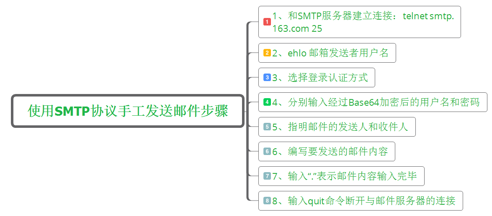

# SMTP

## 简介

SMTP协议：全称为 Simple Mail Transfer Protocol，简单邮件传输协议。它定义了邮件客户端软件和SMTP邮件服务器之间，以及两台SMTP邮件服务器之间的通信规则。

SMTP是一个相对简单的基于文本的协议。在其之上指定了一条消息的一个或多个接收者（在大多数情况下被确认是存在的），然后消息文本会被传输。可以很简单地通过telnet程序来测试一个SMTP服务器。SMTP使用TCP端口25。

## 工作过程

SMTP协议的工作过程可分为如下3个过程： 

(1)建立连接：在这一阶段，SMTP客户请求与服务器的25端口建立一个TCP连接。一旦连接建立，SMTP服务器和客户就开始相互通告自己的域名，同时确认对方的域名。

(2)邮件传送：利用命令，SMTP客户将邮件的源地址、目的地址和邮件的具体内容传递给SMTP服务器，SMTP服务器进行相应的响应并接收邮件。 

(3)连接释放：SMTP客户发出退出命令，服务器在处理命令后进行响应，随后关闭TCP连接。 

## 常用命令

　SMTP 协议中一共定义了18条命令，但是发送一封电子邮件的过程通常只需要6条命令，我将这6调命令/响应的语法格式总结如下：

**注意：**SMTP命令不区分大小写，但参数区分大小写。<>内代表参数，<SP>是空格，<CRLF>代表\r\n

| SMTP命令及格式                 | 描述                                                         |
| ------------------------------ | ------------------------------------------------------------ |
| EHLO   <domain><CRLF>          | ehlo命令是SMTP邮件发送程序与SMTP邮件接受程序建立简介后必须发送的第一条SMTP命令，参数<domain>表示SMTP邮件发送者的名称(邮箱名) |
| AUTH   <para><CRLF>            | 告诉SMTP服务器认证方式，参数para表示回应的认证方式，通常是AUTH LOGIN |
| MAIL FROM:<reverse-path><CRLF> | 此命令用于指定邮件发送者的邮箱地址，参数reverse-path表示发件人的邮箱地址 |
| RCPT TO:<forword-path><CRLF>   | 此命令用于指定邮件接受者的邮箱地址，参数forword-path表示发件人的邮箱地址，如果邮件要发送给多个接受者，那么应该使用多条RCPT TO命令来分别指定每一个接受者的邮箱地址 |
| DATA<CRLF>                     | 此命令用于表示SMTP邮件发送程序准备开始传送邮件内容，在这个命令后面发送的所有数据都将被当做邮件内容，直到遇到<CRLF>.<CRLF>表示符，则表示邮件内容结束 |
| QUIT<CRLF>                     | 此命令表示要结束邮件发送过程，SMTP邮件接受程序接收到此名后，将关闭与SMTP邮件服务器的连接 |

大家可能光看这些命令不太清楚，下面我总结了一下使用Smtp协议手工发送邮件的步骤：

​		①、和SMTP服务器建立连接，telnet smtp.163.com 25。这条命令是和163邮箱建立连接，如果是和QQ，那么将163换成qq即可，同理别的邮箱也是一样。后面的数字25表示SMTP服务器的端口号。

　　②、ehlo 发件人用户名。这没什么好说的，就是告诉SMTP服务器发送者的用户名。

　　③、选择登录认证方式，一般我们在第二步执行完后，会提示有几种认证方式，我们一般选择的是login。即输入命令：auth login

　　④、分别输入经过Base64加密后的用户名和密码。注意必须是要经过 Base64加密后的用户名和密码，大家可以[Base64 在线编码解码](https://base64.us/)

　　⑤、指明邮件的发送人和收件人

　　　　mail from:\<xxx@163.com>

　　　　rcpt to:\<xxx@qq.com>

　　⑥、输入data命令，然后编写要发送的邮件内容，邮件的编写格式规则如下：

　　　　第一步：输入data

　　　　第二步：输入邮件内容　

　　⑦、输入“.”表示邮件内容输入完毕

　　⑧、输入quit命令断开与邮件服务器的连接

## SMTP发送邮件遇到问题

**①、执行 telent smtp.163.com 25 命令时，报如下错误：**

解决办法是：控制面板----程序------启动或关闭 Windows 功能----将Telnet勾上，然后点击确定即可

**②、用户名和密码必须要base64加密**

**③、每一步骤之间输入命令要尽量快，不然会自动断开连接**

**④、163邮箱可以使用用户名和密码，但是QQ邮箱必须使用用户名和授权码。**

**⑤、输入邮件内容时，空行不要忘记了，还有结束输入是以“.”结束的。** 

## MIME协议

[RFC822文档](https://www.w3.org/Protocols/rfc822/)存在两个问题：

　　①、定义了邮件内容的主体结构和各种邮件头字段的详细细节，但是，它没有定义邮件体的格式，RFC822文档定义的邮件体部分通常都只能用于表述一段普通的文本，而无法表达出图片、声音等二进制数据。

　　②、SMTP服务器在接收邮件内容时，当接收到只有一个“.”字符的单独行时，就会认为邮件内容已经结束，如果一封邮件正文中正好有内容仅为一个“.”字符的单独行，SMTP服务器就会丢弃掉该行后面的内容，从而导致信息丢失。

　　上面两个问题是致命的，当今的电子邮件，人们希望在电子邮件中嵌入图片、声音、动画和附件。但是，由于图片和声音等内容是非ASCII码的二进制数据，而RFC822邮件格式只适合用来表达纯文本的邮件内容，所以，要使用RFC822邮件格式发送这些非ASCII码的二进制数据时，必须先采用某种编码方式将它们“编码”成可打印的ASCII字符后再作为RFC822邮件格式的内容。邮件阅读程序在读取到这种经过编码处理的邮件后，再按照相应的解码方式解码出原始的二进制数据，这样就可以借助RFC822邮件格式来传递多媒体数据了。这种做法需要解决一下两个技术问题：

　　一、邮件阅读程序如何知道邮件中嵌入的原始二进制数据所采用的编码方式；

　　二、邮件阅读程序如何知道每个嵌入的图像或其他资源在整个邮件内容中的起止位置。

　　为了解决上面两个问题，人们后来专门为此定义了MIME（Multipurpose Internet Mail Extension，多用途Internet邮件扩展）协议。

### MIME消息的头字段

#### **Content-Type**

Content-Type（内容类型），用于定义文件的类型和编码，Content-Type字段中的内容以“**主类型/子类型**”的形式出 现，主类型有 text、image、audio、video、application、multipart、message等，分别表示文本、图片、音频、视频、应用 程序、组合结构、消息等。每个主类型下面都有多个子类型，例如text主类型包含plain、html、xml、css等子类型。multipart主类 型用于表示MIME组合消息，它是MIME协议中最重要的一种类型。

一封MIME邮件中的MIME消息可以有三种组合关系：混合、关联、选择，它们对应 MIME类型如下：

| 类型                  | 描述                                                         |
| --------------------- | ------------------------------------------------------------ |
| multipart/mixed       | 表示消息体中的内容是混和组合类型，内容可以是文本、声音和附件等不同邮件内容的混和体(整封邮件的MIME类型就必须定义为multipart/mixed) |
| multipart/related     | 表 示消息体中的内容是关联（依赖）组合类型,邮件正文要使用HTML代码引用内嵌的图片资源，它们组合成的MIME消息的MIME类型就应 该定义为multipart/related |
| multipart/alternative | 表 示消息体中的内容是选择组合类型，例如一封邮件的邮件正文同时采用HTML格式和普通文本格式进行表达时，就可以将它们嵌套在一个 multipart/alternative类型的MIME组合消息中。这种做法的好处在于如果邮件阅读程序不支持HTML格式时，可以采用其中的文本格 式进行替代。 |

**总结**：如果要在邮件中要添加附件，就必须将整封邮件的MIME类型定义为multipart/mixed；如果要在HTML格式的正文中引用内嵌资 源，那就要定义multipart/related类型的MIME消息；如果普通文本内容与HTML文本内容共存，那就要定义multipart /alternative类型的MIME消息。

在Content-type头字段中除了可以定义消息体的MIME类型外，还可以在MIME类型后面包含相应的属性，属性以“属性名=属性值”的形式出现，属性与MIME类型之间采用分号（;）分隔，如下所示：

| 主类 型     | 属 性 名 | 说  明                       |
| ----------- | -------- | ---------------------------- |
| text        | charset  | 用于说明文本内容的字符集编码 |
| image       | name     | 用于说明图片文件的文件名     |
| application | name     | 用于说明应用程序的文件名     |
| multipart   | boundary | 用于定义MIME消息之间的分隔符 |

**除了 Content-Type头字段之外**，MIME协议中还定义Content- Transfer-Encoding、Content-Disposition、Content-ID、Content-Location、 Content-Base等几个重要的头字段，这几个头字段需要与Content-type头字段配合使用，它们的作用如下：

#### Content-Transfer-Encoding

Content-Transfer-Encoding头字段用于指定MIME消息体中的内容所采用的邮件编码方式。

#### Content-Disposition

Content- Disposition头字段用于指定邮件阅读程序处理数据内容的方式，有inline和attachment两种标准方式，inline表示直接处理， 而attachment表示当做附件处理。如果将Content-Disposition设置为attachment，在其后还可以指定filename 属性，如下所示：

Content-Disposition: attachment; filename="1.bmp"

上面的MIME头字段表示MIME消息体的内容为邮件附件，附件名"1.bmp"。

####  Content-ID

Content- ID头字段用于为“multipart/related”组合消息中的内嵌资源指定一个唯一标识号，在HTML格式的正文中可以使用这个唯一标识号来引用 该内嵌资源。例如，假设将一个表示内嵌图片的MIME消息的Content-ID头字段设置为如下形式：

Content-ID: maye520_gif

那么，在HTML正文中就需要使用如下HTML语句来引用该图片资源：

注意，在引用Content-ID头字段标识的内嵌资源时，要在资源的唯一标识号前面加上“cid:”，以说明要采用唯一标识号对资源进行引用。

####  Content-Location

Content- Location头字段用于为内嵌资源设置一个URI地址，这个URI地址可以是绝对或相对的。当使用Content- Location头字段为一个内嵌资源指定一个URI地址后，在HTML格式的正文中也可以使用这个URI来引用该内嵌资源。例如，假设将一个表示内嵌图 片的MIME消息的Content-Location头字段设置为如下形式：

Content-Location:http://www.maye.com/images/maye520.gif

那么，在HTML正文中就可以使用如下HTML语句来引用该图片资源：

\

#### Content-Base

Content- Base头字段用于为内嵌资源设置一个基准路径，只有这样，Content-Location头字段中设置的URI才可以采用相对地址。例如，假设将一个 表示内嵌图片的MIME消息的Content-Base和Content-Location头字段设置为如下形式：

Content-Base: http://www.maye.org/images/

Content-Location: maye520.gif 

那么，内嵌资源的完整路径就是Content-Base头字段设置的基准路径与Content-Location头字段设置的相对路径相加的结果，在HTML正文中就可以使用如下HTML语句来引用该图片资源：

\<imgsrc="http://www.maye.com/images/maye520.gif">

