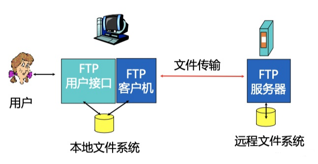
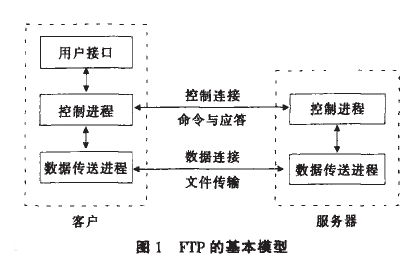
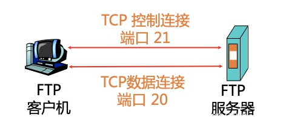

# FTP

## FTP协议简介

文件传输协议（File Transfer Protocol，FTP）是用于在[网络](https://baike.baidu.com/item/网络)上进行文件传输的一套标准协议，它工作在 OSI 模型的第七层， TCP 模型的第四层， 即应用层， 使用 TCP 传输而不是 UDP， 客户在和服务器建立连接前要经过一个“三次握手”的过程， 保证客户与服务器之间的连接是可靠的， 而且是面向连接， 为数据传输提供可靠保证。

FTP允许用户以文件操作的方式（如文件的增、删、改、查、传送等）与另一主机相互通信。然而， 用户并不真正登录到自己想要存取的计算机上面而成为完全用户， 可用FTP程序访问远程资源， 实现用户往返传输文件、目录管理以及访问电子邮件等等， 即使双方计算机可能配有不同的操作系统和文件存储方式。

## 工作原理

FTP 采用 Internet 标准文件传输协议 FTP 的用户界面， 向用户提供了一组用来管理计算机之间文件传输的应用程序。

FTP 是基于客户———服务器（C/S）模型而设计的，在客户端与 FTP 服务器之间建立两个连接。

开发任何基于 FTP 的客户端软件都必须遵循 FTP 的工作原理，FTP 的独特的优势同时也是与其它客户服务器程序最大的不同点就在于它在两台通信的主机之间使用了两条 TCP 连接，一条是**数据连接**，用于数据传送；另一条是**控制连接**，用于传送控制信息（命令和响应），这种将命令和数据分开传送的思想大大提高了 FTP 的效率，而其它客户服务器应用程序一般只有一条 TCP 连接。图 1 给出了 FTP 的基本模型。客户有三个构件：用户接口、客户控制进程和客户数据传送进程。服务器有两个构件：服务器控制进程和服务器数据传送进程。在整个交互的 FTP 会话中，控制连接始终是处于连接状态的，数据连接则在每一次文件传送时先打开后关闭。 

- FTP客户首先发起建立1个与FTP服务器端口号21之间的TCP控制连接, 指定TCP作为传输层协议
- 客户在建立的控制连接上获得身份认证
- 客户在建立的控制连接上发送命令来浏览远程主机的目录.
- 当服务器接收到1个文件传输命令时, 在服务器端口号20创建1个与客户 的TCP数据连接
- 1个文件传输后,服务器结束这个TCP数据连接.
- 之后 再次传输，服务器创建第2个TCP与客户的数据连接来传输下一个文件.

## 支持模式

FTP客户端发起FTP会话，与FTP服务器建立相应的连接。FTP会话期间要建立控制信息进程与数据进程两个连接。控制连接不能完成传输数据的任务，只能用来传送FTP执行的内部命令以及命令的响应等控制信息；数据连接是服务器与客户端之间传输文件的连接，是全双工的，允许同时进行双向数据传输。当数据传输完成后，数据连接会撤消，再回到FTP会话状态，直到控制连接被撤消，并退出会话为止。 [7] 

FTP支持两种模式：Standard （PORT方式，主动方式），Passive （PASV，被动方式）。

**Port模式**

FTP [客户端](https://baike.baidu.com/item/客户端)首先和服务器的TCP 21端口建立连接，用来发送命令，客户端需要接收数据的时候在这个通道上发送PORT命令。PORT命令包含了客户端用什么端口接收数据。在传送数据的时候，服务器端通过自己的TCP 20端口连接至客户端的指定端口发送数据。FTP server必须和客户端建立一个新的连接用来传送数据。

**Passive模式**

建立控制通道和Standard模式类似，但建立连接后发送Pasv命令。服务器收到Pasv命令后，打开一个临时端口（端口号大于1023小于65535）并且通知客户端在这个端口上传送数据的请求，客户端连接FTP服务器此端口，然后FTP服务器将通过这个端口传送数据。

很多[防火墙](https://baike.baidu.com/item/防火墙)在设置的时候都是不允许接受外部发起的连接的，所以许多位于防火墙后或内网的FTP服务器不支持PASV模式，因为客户端无法穿过防火墙打开FTP服务器的高端端口；而许多内网的客户端不能用PORT模式登陆FTP服务器，因为从服务器的TCP 20无法和内部网络的客户端建立一个新的连接，造成无法工作。

## 命令

FTP 控制帧即远程交换信息，包含控制命令和选项。大多数 FTP 控制帧是简单的ASCII文本，用户通过用户PI向服务器PI发出FTP命令，服务器PI执行用户PI的FTP命令，并将执行的结果返回给用户。常用的FTP命令如下所示：

**命令 |** **描述**

ABOR：中断数据连接程序

ACCT：系统特权帐号

ALLO：为服务器上的文件存储器分配字节

APPE：添加文件到服务器同名文件

CDUP ：改变服务器上的父目录

CWD ：改变服务器上的工作目录

DELE：删除服务器上的指定文件

HELP：返回指定命令信息

LIST：如果是文件名列出文件信息，如果是目录则列出文件列表

MODE：传输模式（S=流模式，B=块模式，C=压缩模式）

MKD：在服务器上建立指定目录

NLST：列出指定目录内容

NOOP：无动作，除了来自服务器上的承认

PASS：系统登录密码

PASV：请求服务器等待数据连接

PORT ：IP 地址和两字节的端口 ID

PWD：显示当前工作目录

QUIT：从 FTP 服务器上退出登录

REIN：重新初始化登录状态连接

REST：由特定偏移量重启文件传递

RETR：从服务器上找回（复制）文件

RMD：在服务器上删除指定目录

RNFR：对旧路径重命名

RNTO：对新路径重命名

SITE：由服务器提供的站点特殊参数

SMNT：挂载指定文件结构

STAT：在当前程序或目录上返回信息

STOR：储存（复制）文件到服务器上

STOU：储存文件到服务器名称上

STRU：数据结构（F=文件，R=记录，P=页面）

SYST：返回服务器使用的操作系统

TYPE：数据类型（A=ASCII，E=EBCDIC，I=binary）

USER>：系统登录的用户名

FTP命令的响应是为了对数据传输请求和过程进行同步，也是为了让用户了解服务器的状态 。每个命令必须至少有一个响应，如果有多个响应，每个响应要易于区别。FTP响应码如下所示：

**响应代码 |** **描述**

110：新文件指示器上的重启标记

120：服务器准备就绪的时间（分钟数）

125：打开数据连接，开始传输

150：打开连接

200：成功

202：命令没有执行

211：系统状态回复

212：目录状态回复

213：文件状态回复

214：帮助信息回复

215：系统类型回复

220：服务就绪

221：退出网络

225：打开数据连接

226：结束数据连接

227：进入被动模式（IP 地址、ID 端口）

230：登录因特网

250：文件行为完成

257：路径名建立

331：要求密码

332：要求帐号

350：文件行为暂停

421：服务关闭

425：无法打开数据连接

426：结束连接

450：文件不可用

451：遇到本地错误

452：磁盘空间不足

500：无效命令

501：错误参数

502：命令没有执行

503：错误指令序列

504：无效命令参数

530：未登录网络

532：存储文件需要帐号

550：文件不可用

551：不知道的页类型

552：超过存储分配

553文件名不允许

## 术语

**FTP（FILE TRANSFER PROTOCOL）：**文件传输协议。

**PI（protocol interpreter）：**协议解析器。用户和服务器用其来解析协议，它们的具体实现分别称为用户 PI （USER-PI）和服务器PI（SERVER-PI）。

**服务器PI（server-PI）：**服务器 PI 在 L 端口“监听”用户协议解析器的连接请求并建立控制连接。它从用户 PI接收标准的 FTP 命令，发送响应，并管理服务器 DTP。

**服务器DTP（server-DTP）：**数据传输过程，在通常的“主动”状态下是用“监听”的数据端口建立数据连接。它建立传输和存储参数，并在服务器端 PI 的命令下传输数据。服务器端 DTP 也可以用于“被动”模式，而不是主动在数据端口建立连接。

**用户PI（user-PI）：**用户协议解析器用 U 端口建立到服务器 FTP 过程的控制连接，并在文件传输时管理用户 DTP。

**用户DTP（user-DTP）：**数据传输过程在数据端口“监听”服务器 FTP 过程的连接。

**控制连接：**用户PI 与服务器PI 用来交换命令和响应的信息传输通道。

**数据连接：**通过控制连接协商的模式和类型进行数据传输。