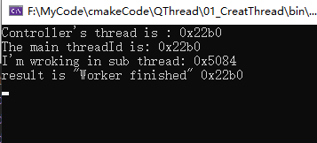
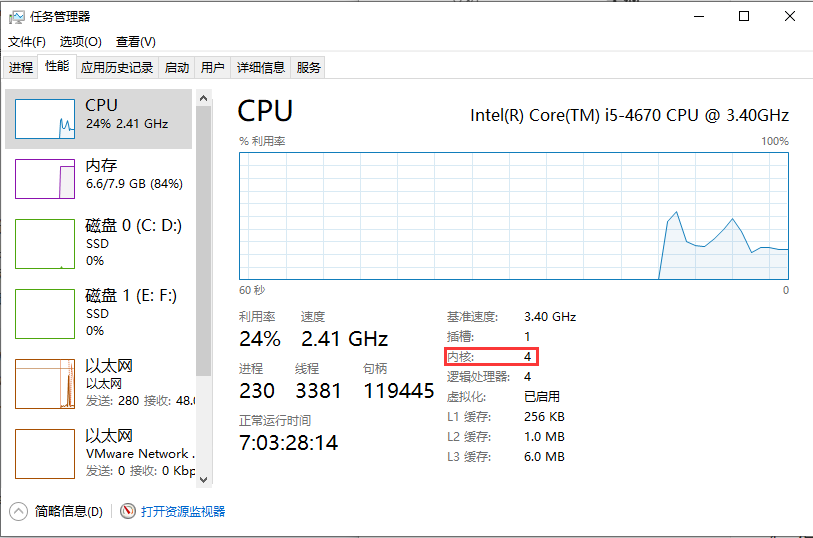
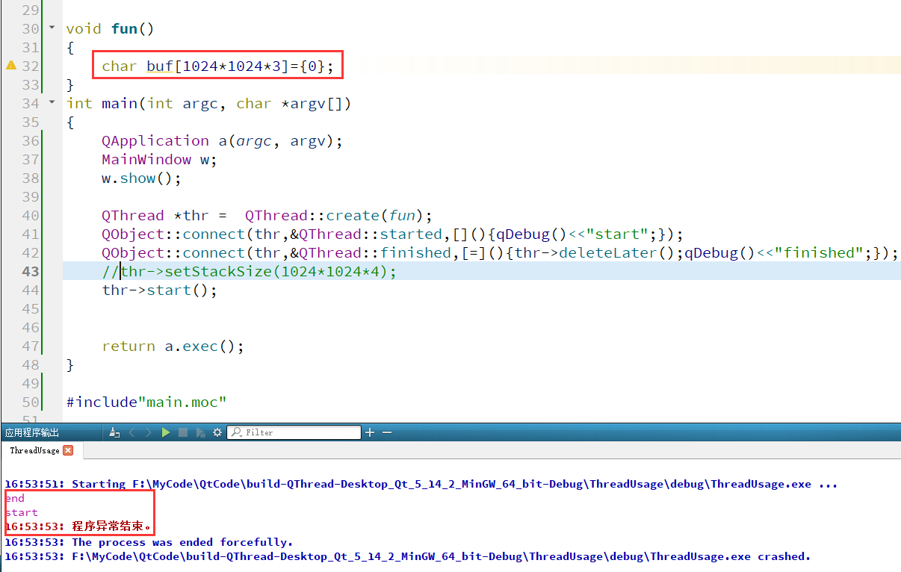
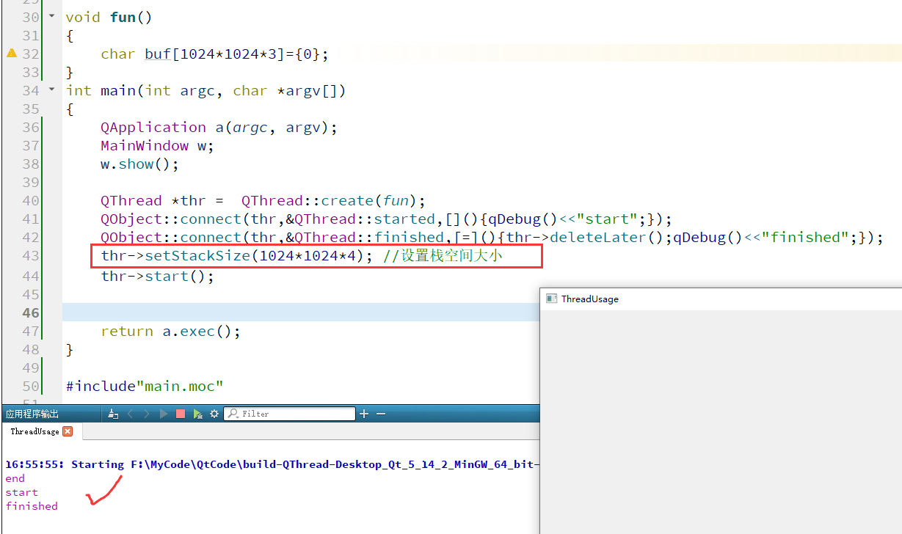
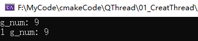
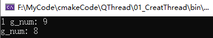
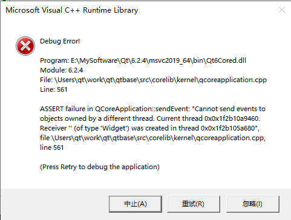

# 多线程

## 1. 线程概念的起源

**1.1 单核 CPU**

在早期的单核 CPU 时代还没有线程的概念，只有进程。操作系统作为一个大的“软件”，协调着各个硬件（如CPU、内存，硬盘、网卡灯）有序的工作着。在双核 CPU 诞生以前，我们用的 Windows 操作系统依然可以一边用 word 写文档一边听着音乐，作为整个系统唯一可以完成计算任务的 CPU 是如何保证两个进程“同时进行”的呢？**时间片轮转调度**！

注意这个关键字「轮转」。每个进程会被操作系统分配一个时间片，即**每次被 CPU 选中来执行当前进程所用的时间。时间一到，无论进程是否运行结束，操作系统都会强制将 CPU 这个资源转到另一个进程去执行**。为什么要这样做呢？因为只有一个单核 CPU，假如没有这种轮转调度机制，那它该去处理写文档的进程还是该去处理听音乐的进程？无论执行哪个进程，另一个进程肯定是不被执行，程序自然就是无运行的状态。如果 CPU 一会儿处理 word 进程一会儿处理听音乐的进程，起初看起来好像会觉得两个进程都很卡，但是 CPU 的执行速度已经快到让人们感觉不到这种切换的顿挫感，就真的好像两个进程在“并行运行”。


如上图所示，每一个小方格就是一个时间片，大约100ms。假设现在我同时开着 Word、QQ、网易云音乐三个软件，CPU 首先去处理 Word 进程，100ms时间一到 CPU 就会被强制切换到 QQ 进程，处理100ms后又切换到网易云音乐进程上，100ms后又去处理 Word 进程，如此往复不断地切换。**我们将其中的 Word 单独拿出来看，如果时间片足够小，那么以人类的反应速度看就好比最后一个处理过程，看上去就会有“CPU 只处理 Word 进程”的幻觉**。随着芯片技术的发展，CPU 的处理速度越来越快，在保证流畅运行的情况下可以同时运行的进程越来越多。

**1.2 多核 CPU**

随着运行的进程越来越多，人们发现进程的创建、撤销与切换存在着较大的时空开销，因此业界急需一种轻型的进程技术来减少开销。于是上世纪80年代出现了一种叫 SMP（Symmetrical Multi-Processing）的对称多处理技术，就是我们所知的线程概念。线程切换的开销要小很多，这是因为每个进程都有属于自己的一个完整虚拟地址空间，而线程隶属于某一个进程，与进程内的其他线程一起共享这片地址空间，基本上就可以利用进程所拥有的资源而无需调用新的资源，故对它的调度所付出的开销就会小很多。


以 QQ 聊天软件为例，上文我们一直都在说不同进程如何流畅的运行，此刻我们只关注一个进程的运行情况。如果没有线程技术的出现，当 QQ 这个进程被 CPU “临幸”时，我是该处理聊天呢还是处理界面刷新呢？如果只处理聊天，那么界面就不会刷新，看起来就是界面卡死了。**有了线程技术后，每次 CPU 执行100ms，其中30ms用于处理聊天，40ms用于处理传文件，剩余的30ms用于处理界面刷新，这样就可以使得各个组件可以“并行”的运行了**。于是乎我们可以提炼出两点关于多线程的适用场景：

- 通过使用多核 CPU 提高处理速度。
- 保证 GUI 界面流畅运行的同时可以执行其他计算任务。

## 2. 三种方式创建线程

随着Qt的版本迭代，出现了三种创建线程的方式，每一种都有各自的特点，我们一起来学习如何使用它们吧！

### 第一种：QThread::create

```cpp
[static] QThread *QThread::create(Function &&f, Args &&... args)	//C++17
```

创建一个新的QThread对象，该对象将执行带有参数args的函数f。

新线程没有启动——它必须通过显式调用start()来启动。这允许您连接到它的信号，将QObjects移动到线程，选择新线程的优先级等等。函数f将在新线程中被调用。  

> 注意:调用者获得返回的QThread实例的所有权。也就是说，需要自己[释放线程对象](#信号处理)。

**警告：**不要对返回的QThread实例多次调用start(); 这样做将导致未定义的行为。 

#### 线程入口函数

```cpp
void print(int n)
{
    for(int i = 0;i<n;i++)
        qInfo()<<"hello global print";
}
class MainWindow:public QWidget
{
    Q_OBJECT
public:
    MainWindow(QWidget*parent = nullptr):QWidget(parent)
    {
        qInfo()<<"end";
    }
    static void print1()
    {
        for(int i = 0;i<5;i++)
            qInfo()<<"hello static print1";
    }
    void print2()
    {
        for(int i = 0;i<5;i++)
            qInfo()<<"hello print2";
    }
};
```

##### 全局函数

```cpp
auto* thr = QThread::create(print,5);
thr->start();
```

##### 静态函数

```cpp
auto* thr1 = QThread::create(&MainWindow::print1);
thr1->start();
```

##### 成员函数

```cpp
auto* thr2 = QThread::create(&MainWindow::print2,&w);
thr2->start();
```

##### lambda

```cpp
auto* thr3 = QThread::create([](){qInfo()<<"hello lambda";});
thr3->start();
```

##### 信号处理

 线程启动之后会触发`started`信号，信号执行完毕会触发`finished`信号，可以连接该信号以销毁相关资源。  

```cpp
QThread *thr =  QThread::create(fun);
QObject::connect(thr,&QThread::started,[](){qDebug()<<"start";});
QObject::connect(thr,&QThread::finished,[=]()
                 {
                     thr->deleteLater();
                     qDebug()<<"finished";
                 });
thr->start();
```


### 第二种：继承QThread,重写run

QThread类中有一个virtual函数QThread::run()，要创建一个新的线程，我们只需定义一个MyThread类，让其继承QThread，然后重新实现QThread::run()。`把需要在线程中执行的代码全部塞到run函数中`。

run函数是线程的起始点。 在调用start()之后，新创建的线程调用这个函数。 默认实现只是调用exec()，用来处理线程中的事件。  

```cpp
class SThread : public QThread
{
    Q_OBJECT
public:
    SThread(QObject* parent = nullptr)
        :QThread(parent)
    {
        qInfo() << __FUNCTION__;
    }
    ~SThread() { qInfo() << __FUNCTION__; }
    void run()override
    {   
        for (size_t i = 0; i < 100; i++)
        {
            qInfo() << "Hello Qt~";
        }
    }
};


int main(int argc,char* argv[])
{
	QApplication a(argc, argv);

    SThread thr;
    thr.start();
    qInfo() << "main~~";
	return a.exec();
}

#include "main.moc"
```

### 第三种：QObject::moveToThread

追溯历史，在 Qt 4.4 版本以前的 QThread 类是个抽象类，要想编写多线程代码唯一的做法就是继承 QThread 类，然后重写run函数。但是之后的版本中，Qt 库完善了线程的亲和性以及信号槽机制，**我们有了更为优雅的使用线程的方式，即 QObject::moveToThread()**。这也是**官方推荐**的做法，遗憾的是大部分教程没有跟上技术的进步，依然采用 run() 这种腐朽的方式来编写多线程程序。

之所以 Qt 官方对 QThread 类进行了大刀阔斧地改革，我认为这是想让多线程编程更加符合 C++ 语言的「面向对象」特性。继承的本意是扩展基类的功能，所以继承 QThread 并把耗时操作代码塞入 run() 函数中的做法怎么看都感觉不伦不类。

#### 应该把耗时代码放哪里？

暂时不考虑多线程，先思考这样一个问题：想想我们平时会把耗时操作代码放在哪里？一个类中。那么有了多线程后，难道我们要把这段代码从类中剥离出来单独放到某个地方吗？显然这是很糟糕的做法(比如，用于下载文件、查询数据库，或者做任何其他操作的代码都不应该被加入到QThread的子类中；它应该被封装在它自己的对象中。)

**QObject 中的 moveToThread() 函数可以在不破坏类结构的前提下依然可以在新线程中运行**。


假设现在我们有个 QObject 的子类 Worker，这个类有个成员函数 doSomething()，该函数中运行的代码非常耗时。此时我要做的就是将这个类对象“移动”到新线程里，这样 Worker 的所有成员函数就可以在新线程中运行了。那么如何触发这些函数的运行呢？信号槽。在主线程里需要有个 *signal* 信号来关联并触发 Worker 的成员函数，与此同时 Worker 类中也应该有个 *signal* 信号用于向外界发送运行的结果。这样思路就清晰了，Worker 类需要有个槽函数用于执行外界的命令，还需要有个信号来向外界发送结果。

#### 示例

如下列代码：

**Worker**

```cpp
class Worker : public QObject
{
	Q_OBJECT
public:
	explicit Worker(QObject* parent = nullptr):QObject(parent){}
public slots:			//线程入口函数必须是一个槽函数
	void doSomething()
	{
		qInfo() << "I'm wroking in sub thread:" << QThread::currentThreadId();
		emit resultReady("Worker finished");
	}
signals:
	//从线程中返回结果
	void resultReady(const QString& str);
};
```

Worker类可以是自己编写的任何类，但是必须间接或直接继承自QObject，doSomething可以是任何槽函数，他作为线程的入口函数。resultReady信号可以在线程中返回结果。

**Controller**

```cpp
class Controller : public QObject
{
	Q_OBJECT
public:
	explicit Controller(QObject* parent = nullptr) : QObject(parent)
	{
        qInfo() << "Controller's thread is :" << QThread::currentThreadId();
		m_worker = new Worker;	//不能指定父对象
		m_worker->moveToThread(&m_workThread);

		connect(this, &Controller::startRunning, m_worker, &Worker::doSomething);
		connect(&m_workThread, &QThread::finished, m_worker, &QObject::deleteLater);
		connect(m_worker, &Worker::resultReady, this, &Controller::resultHandle);

		m_workThread.start();
	}
	~Controller()
	{
		m_workThread.quit();
		m_workThread.wait();
	}
	void startThread()
	{
		emit startRunning();
	}
public:
	void resultHandle(const QString& str)
	{
		qInfo() << "result is" << str <<QThread::currentThreadId();
	}
signals:
	void startRunning();	//通过信号让Worker的函数在线程中运行
private:
	QThread m_workThread;
	Worker* m_worker;
};
```

在作为“外界”的 Controller 类中，由于要发送命令与接收结果，因此有两个成员：*startRunning()* 信号用于启动 Worker 类的耗时函数运行，*resultHandle()* 槽函数用于接收新线程的运行结果。

在 Controller 类的实现里，首先实例化一个 Worker 对象并把它“移动”到新线程中，然后就是在新线程启动前将双方的信号槽连接起来。同 Worker 类一样，为了体现是在不同线程中执行的，我们在构造函数中打印当前线程 ID。

**main**

```cpp
int main(int argc,char* argv[])
{
	QApplication a(argc, argv);

	Controller c;
	c.startRunning();
	qInfo() << "The main threadId is:" <<QThread::currentThreadId();
	return a.exec();
}
```

在 main.cpp 中我们实例化一个 Controller 对象，并运行 startRunning() 成员函数发射出信号来触发 Worker 类的耗时操作函数。来看看运行结果：



从结果可以看出，Worker 类对象的成员函数是在新线程中运行的。而 Controller 对象是在主线程中被创建，因此它就隶属于主线程。

#### 再谈 moveToThread()

“移动到线程”是一个很形象的描述，作为入门的认知是可以的，但是它的本质是改变线程亲和性（也叫关联性）。为什么要强调这一点？这是因为如果你天真的认为 Worker 类对象整体都移动到新线程中去了，那么你就会本能的认为 Worker 类对象的控制权是由新线程所属，然而事实并不是如此。**「在哪创建就属于哪」这句话放在任何地方都是适用的**。比如上面的例子中，Worker 类对象是在 Controller 类中创建并初始化，因此该对象是属于主线程的。而 moveToThread() 函数的作用是将槽函数在指定的线程中被调用。当然，在新线程中调用函数的前提是该线程已经启动处于就绪状态，所以在上面的 Controller 构造函数中，我们把各种信号槽连接起来后就可以启动新线程了。

使用 moveToThread() 有一些需要注意的地方，首先就是`类对象不能有父对象`，否则无法将该对象“移动”到新线程。如果类对象保存在栈上，自然销毁由操作系统自动完成；**如果是保存在堆上，没有父对象的指针要想正常销毁，需要将线程的** **finished() 信号关联到 QObject 的** **deleteLater() 让其在正确的时机被销毁**。其次是该对象一旦“移动”到新线程，那么该对象中的计时器（如果有 QTimer 等计时器成员变量）将重新启动。不是所有的场景都会遇到这两种情况，但是记住这两个行为特征可以避免踩坑。


## **3. 启动线程前的准备工作**

### 3.1 开多少个线程比较合适？

说“开线程”其实是不准确的，这种事儿只有操作系统才能做，我们所能做的是管理其中一个线程。无论是 QThread thread 还是 QThread *thread，创建出来的对象仅仅是作为操作系统线程的接口，用这个接口可以对线程进行一些操作。虽然这样说不准确，但下文我们仍以“开线程”的说法，只是为了表述方便。

我们来思考这样一个问题：“线程数是不是越大越好”？显然不是，“开”一千个线程是没有意义的。线程的切换是要消耗系统资源的，频繁的切换线程会使性能降低。线程太少的话又不能完全发挥 CPU 的性能。一般后端服务器都会设置最大工作线程数，不同的架构师有着不同的经验，有些业务设置为 CPU 逻辑核心数的4倍，有的甚至达到32倍。



在 *Venkat Subramaniam* 博士的《[Programming Concurrency on the JVM](https://link.zhihu.com/?target=https%3A//book.douban.com/subject/6039359/)》这本书中提到关于最优线程数的计算，即线程数量 = 可用核心数/(1 - 阻塞系数)。可用核心数就是所有逻辑 CPU 的总数，这可以用 QThread::idealThreadCount() 静态函数获取，比如双核四线程的 CPU 的返回值就是4。但是阻塞系数比较难计算，这需要用一些性能分析工具来辅助计算。如果只是粗浅的计算下线程数，最简单的办法就是 CPU 核心数 * 2 + 2。更为精细的找到最优线程数需要不断的调整线程数量来观察系统的负载情况。

### 3.2 设置栈大小

每个线程都有自己的栈，彼此独立，由编译器分配。一般在 Windows 的栈大小为2M，在 Linux 下是8M。

Qt 提供了获取以及设置栈空间大小的函数：stackSize()、setStackSize(uint stackSize)。其中 stackSize() 函数不是返回当前所在线程的栈大小，而是获取用 stackSize() 函数手动设置的栈大小。如果是用编译器默认的栈大小，该函数返回0，这一点需要注意。为什么要设置栈的大小？这是因为有时候我们的局部变量很大（常见于数组），当超过编译器默认大小时程序就会因为栈溢出而报错，这时候就需要手动设置栈大小了。



在 Windows操作系统环境下，假如我们在线程入口函数fun()中添加一个3M大小的数组 *array*，可以看出在程序运行时会由于栈溢出而导致异常退出，因为 Windows默认的栈空间仅为2M。



如果我们设置了栈大小为4M，那么程序会正常运行，不会出现栈溢出的问题。

## 4. 启动线程/退出线程

### 4.1 启动线程

调用 start() 函数就可以启动函数在新线程中运行，运行后会发出 started() 信号。

在上面的使用线程中我们知道将耗时函数放入新线程有QThread::create()、 moveToThread() 和继承 QThread 且重新实现 run() 函数三种方式。有这么一种情况：此时我有 *fun1()* 和 *fun2()* 两个耗时函数，将 *fun1()* 中的代码放入 run() 函数，而将 *fun2()* 以 moveToThread() 的方式也放到这个线程中。那新线程该运行哪个函数呢？**其实调用 start() 函数后，新线程会优先执行 run() 中的代码，即先执行** **fun1() 函数，其次才会运行** **fun2() 函数**。这种情况不常见，但了解这种先后顺序有助于我们理解 start() 函数。

说到 run() 函数就不得不提 exec() 函数。这是个 protected 函数，因此只能在类内使用。**默认 run() 函数会调用 exec() 函数，即启用一个局部的不占 CPU 的事件循环**。为什么要默认启动个事件循环呢？这是因为没有事件循环的话，耗时代码只要执行完线程就会退出，频繁的开销线程显然很浪费资源。因此，如果使用上述第三种“开线程”的方式，别忘了在 run() 函数中调用 exec() 函数。

### 4.2 优雅的退出线程

退出线程可是个技术活，不是随随便便就可以退出。比如我们关闭主进程的同时，里面的线程可能还处在运行状态，尤其线程上跑着耗时操作。这时候你可以用 terminate() 函数强制终止线程，调用该函数后所有处于等待状态的线程都会被唤醒。该函数是异步的，也就是说调用该函数后虽然获得了返回值，但此时线程依然可能在运行。**因此，一般是在后面跟上 wait() 函数来保证线程已退出**。当然强制是很暴力的行为，有可能会造成局部变量得不到清理，或者无法解锁互斥关系，种种行为都是很危险的，除非必要时才会使用该函数。

在上面我们说到`默认 run() 函数会调用 exec() 函数`，耗时操作代码执行完后，线程由于启动了事件循环是不退出的。**所以，正常的退出线程其实质是退出事件循环，即执行** **exit(int returnCode = 0)** **函数**。返回0代表成功，其他非零值代表异常。quit() 函数等价于 exit(0)。线程退出后会发出 finished() 信号。

## **5. 操作运行中的线程**

### 5.1 获取状态

#### （1）运行状态

线程的状态有很多种，而往往我们只关心一个线程是运行中还是已经结束。QThread 提供了 isRunning()、isFinished() 两个函数来判断当前线程的运行状态。

#### （2）线程标识

**关于 currentThreadId() 函数，很多人将该函数用于输出线程ID，这是错误的用法**。该函数主要用于 Qt 内部，不应该出现在我们的代码中。那为什么还要开放这个接口？这是因为我们有时候想和系统线程进行交互，而不同平台下的线程 ID 表示方式不同。因此调用该函数返回的 Qt::HANDLE 类型数据并转化成对应平台的线程 ID 号数据类型（例如 Windows 下是 DWORD 类型），利用这个转化后的 ID 号就可以与系统开放出来的线程进行交互了。当然，这就破坏了移植性了。

需要注意的是，这个 Qt::HANDLE 是 ID 号而不是句柄。句柄相当于对象指针，一个线程可以被多个对象所操控，而每个线程只有一个[全局线程](https://www.zhihu.com/search?q=全局线程&search_source=Entity&hybrid_search_source=Entity&hybrid_search_extra={"sourceType"%3A"article"%2C"sourceId"%3A"53270619"}) ID 号。**正确的获取线程 ID 做法是：调用操作系统的线程接口来获取**。以下是不同平台下获取线程 ID 的代码：

```cpp
#include <QCoreApplication>
#include <QDebug>

#ifdef Q_OS_LINUX
#include <pthread.h>
#endif

#ifdef Q_OS_WIN
#include <windows.h>
#endif

int main(int argc, char *argv[])
{
    QCoreApplication a(argc, argv);

#ifdef Q_OS_LINUX
    qDebug() << pthread_self();
#endif

#ifdef Q_OS_WIN
    qDebug() << GetCurrentThreadId();
#endif

    return a.exec();
}
```

我们自己的程序内部可以调用静态函数 currentThread() 函数来获取 QThread 指针，有了线程指针就可以对线程进行一些操作了。

### 5.2 操作线程

#### （1）安全退出线程必备函数

在上面已经提到“一般是在后面跟上 wait() 函数来保证线程已退出”，线程退出的时候不要那么暴力，告诉操作系统要退出的线程后，给点时间（即阻塞）让线程处理完。也可以设置超时时间 *time*，时间一到就强制退出线程。一般在类的析构函数中调用，正如上面的示例代码那样：

```cpp
Controller::~Controller()
{
    m_workThread.quit();
    m_workThread.wait();
}
```

#### （2）线程间的礼让行为

这是个很有意思的话题，一般我们都希望每个线程都能最大限度的榨干系统资源，何来礼让之说呢？有时候我们采用多线程并不只是运行耗时代码，而是和主 GUI 线程分开，避免主界面卡死的情况发生。**那么有些线程上跑的任务可能对实时性要求不高，这时候适当的缩短被 CPU 选中的机会可以节约出系统资源**。


除了调用 setPriority()、priority() 优先级相关的函数以外，QThread 类还提供了 yieldCurrentThread() 静态函数，该函数是在通知操作系统“**我这个线程不重要，优先处理其他线程吧**”。当然，调用该函数后不会立马将 CPU 计算资源交出去，而是由操作系统决定。

QThread 类还提供了 sleep()、msleep()、usleep() 这三个函数，这三个函数也是在通知操作系统“**在未来** **time 时间内我不参与 CPU 计算**”。从我们直观的角度看，就好像当前线程“沉睡”了一段时间。

#### （3）线程的中断标志位

Qt 为每一个线程都设置了一个布尔变量用来标记当前线程的终端状态，用 isInterruptionRequested() 函数来获取，用 requestInterruption() 函数来设置中断标记。这个标记不是给操作系统看的，而是给用户写的代码中进行判断。也就是说调用 requestInterruption() 函数并不能中断线程，需要我们自己的代码去判断。这有什么用处呢？

```cpp
while (ture) {
    if (!isInterruptionRequested()) {
        // 耗时操作
        ......
    }
}
```

这种设计可以让我们自助的中断线程，而不是由操作系统强制中断。经常我们会在新线程上运行无限循环的代码，在代码中加上判断中断标志位可以让我们随时跳出循环。**好处就是给了我们程序更大的灵活性**。

## 6. 为每个线程提供独立数据

思考这样一个问题，如果线程本身存在全局变量，那么修改一处后另一个线程会不会受影响？我们以一段代码为例：

```cpp
int g_num = 5;
void fun()
{
    qInfo() << "g_num:" << g_num;
    g_num = 8;
}

void fun1()
{
    qInfo() << "1 g_num:" << g_num;
    g_num = 9;
}

int main(int argc, char* argv[])
{
    QApplication a(argc, argv);

    auto thr = QThread::create(fun);

    auto thr1 = QThread::create(fun1);

    thr->start();
    thr1->start();

    return a.exec();
}
```



可以看到两个输出的结果是一样的(结果不一定一致哟)，线程 thr 对全局变量的修改影响了线程 thr1。造成这个现象的原因也很好理解。“线程隶属于某一个进程，与进程内的其他线程一起共享这片地址空间”。也就是说全局变量属于公共资源，被所有线程所共享，只要一个线程修改了这个全局变量自然就会影响其他线程对该全局变量的访问。

而 QThreadStorage 类为每个线程提供了独立的数据存储功能，即使在线程中用到全局变量，只要存在 QThreadStorage 中，也不会影响到其他线程。

```cpp
QThreadStorage<int> g_num;
void fun()
{
    g_num.setLocalData(8);
    qInfo() << "g_num:" << g_num.localData();
}

void fun1()
{
    g_num.setLocalData(9);
    qInfo() << "1 g_num:" << g_num.localData();
}
```



## 子线程不能操作UI

GUI框架一般只允许UI线程操作界面组件，Qt也是如此，否则会导致程序崩溃或者出现一些诡异的问题。

### 示例代码

```cpp
class Widget : public QWidget
{
    Q_OBJECT
public:
    Widget(QWidget* parent = nullptr)
        :QWidget(parent)
    {
        QProgressBar* bar = new QProgressBar(this);
        connect(this, &Widget::progressChanged, bar, &QProgressBar::setValue);
        auto thr = QThread::create([=]
            {
                for (int i = 0; i <= 100; i++)
                {
                    QThread::msleep(50);
                    bar->setValue(i);
                }            
            });
        connect(thr, &QThread::finished, thr, &QThread::deleteLater);
        thr->start();
    }
};
```



> 错误翻译：在QCoreApplication::sendEvent中ASSERT失败:"不能发送事件到由不同线程拥有的对象。当前线程0x0x225230ae150。接收者“(类型为'Widget')在线程0x0x2252305a570中创建”

但我们的应用程序一般是多线程的，势必就涉及到UI线程与子线程的交互。

### 解决方案

下面介绍常用的UI线程与子线程交互方式：

#### 通过信号与槽

大体思路：当子线程中需要对ui对象进行操作时，发出一个信号，在与之连接的槽中处理ui操作。信号和槽的连接方式必须是`BlockingQueuedConnection`或`QueuedConnection`的连接方式连接

```cpp
class Widget : public QWidget
{
    Q_OBJECT
public:
    Widget(QWidget* parent = nullptr)
        :QWidget(parent)
    {
        QProgressBar* bar = new QProgressBar(this);
        connect(this, &Widget::progressChanged, bar, &QProgressBar::setValue);
        auto thr = QThread::create([=]
            {
                for (int i = 0; i <= 100; i++)
                {
                    QThread::msleep(50);
                    //bar->setValue(i);
                    emit progressChanged(i);
                }
            });
        connect(thr, &QThread::finished, thr, &QThread::deleteLater);
        thr->start();
    }

signals:
    void progressChanged(int v);
};
```

#### 通过QMetaObject::invokeMethod

```cpp
class Widget : public QWidget
{
    Q_OBJECT
public:
    Widget(QWidget* parent = nullptr)
        :QWidget(parent)
    {
        QProgressBar* bar = new QProgressBar(this);
        auto thr = QThread::create([=]
            {
                for (int i = 0; i <= 100; i++)
                {
                    QThread::msleep(50);
                    QMetaObject::invokeMethod(bar,"setValue", Q_ARG(int, i));
                }
            });
        connect(thr, &QThread::finished, thr, &QThread::deleteLater);
        thr->start();
    }
};
```

#### 通过QApplication::postEvent

```cpp
enum  CustomEventType
{
    ProgressChanged = QEvent::User
};
class ProgressChangedEvent : public QEvent
{
public:
    ProgressChangedEvent(int v) 
        : QEvent(QEvent::Type(CustomEventType::ProgressChanged))
        ,value(v)
    {

    }
    int value{ 0 };
};
class Widget : public QWidget
{
    Q_OBJECT
public:
    Widget(QWidget* parent = nullptr)
        :QWidget(parent)
    {
        bar = new QProgressBar(this);
        //connect(this, &Widget::progressChanged, bar, &QProgressBar::setValue);
        auto thr = QThread::create([=]
            {
                for (int i = 0; i <= 100; i++)
                {
                    QThread::msleep(50);
                    //bar->setValue(i);
                    //emit progressChanged(i);
                    //QMetaObject::invokeMethod(bar,"setValue", Q_ARG(int, i));
                    QApplication::postEvent(this, new ProgressChangedEvent(i));
                }
            });
        connect(thr, &QThread::finished, thr, &QThread::deleteLater);
        thr->start();
    }
    void customEvent(QEvent* ev)override
    {
        if (ev->type() == CustomEventType::ProgressChanged)
        {
            bar->setValue(static_cast<ProgressChangedEvent*>(ev)->value);
        }
    }
signals:
   // void progressChanged(int v);
private:
    QProgressBar* bar;
}
```

#### 自己研究的方法

```cpp
class Widget : public QWidget
{
    Q_OBJECT
public:
    Widget(QWidget* parent = nullptr)
        :QWidget(parent)
    {
        bar = new QProgressBar(this);
        
        QTimer* timer = new QTimer(this);
        timer->callOnTimeout([=]
            {
                bar->setValue(progressValue);
            });
        timer->start(50);
        
        auto thr = QThread::create([=]
            {
                for (int i = 0; i <= 100; i++)
                {
                    QThread::msleep(50);
                    ++this->progressValue;
                }
            });
        connect(thr, &QThread::finished, thr, &QThread::deleteLater);
        connect(thr, &QThread::finished, timer, &QTimer::deleteLater);
        thr->start();
    }
private:
    QProgressBar* bar;
    int progressValue{0};
};
```

定义成员变量`progressValue`，在子线程里面对变量进行操作；在主线程里根据`progressValue`的值更新进度条。

### **QMetaObject::invokeMethod介绍**

#### 基本使用

```cpp
[static] bool QMetaObject::invokeMethod(QObject *obj, const char *member, Qt::ConnectionType type, QGenericReturnArgument ret, QGenericArgument val0 = QGenericArgument(nullptr), QGenericArgument val1 = QGenericArgument(), QGenericArgument val2 = QGenericArgument(), QGenericArgument val3 = QGenericArgument(), QGenericArgument val4 = QGenericArgument(), QGenericArgument val5 = QGenericArgument(), QGenericArgument val6 = QGenericArgument(), QGenericArgument val7 = QGenericArgument(), QGenericArgument val8 = QGenericArgument(), QGenericArgument val9 = QGenericArgument())
//还有很多重载版本，大致类似！    
```

调用对象obj上的成员(信号或槽名)。如果成员可以被调用，则返回true。如果没有这样的成员或形参不匹配，则返回false。

调用可以是同步的，也可以是异步的，这取决于类型:

+ 如果type是Qt::DirectConnection，成员将立即被调用。
+ 如果type为Qt::QueuedConnection，则当应用程序进入主事件循环时，将发送一个QEvent并调用该成员。
+ 如果type为Qt::BlockingQueuedConnection，该方法将以与Qt::QueuedConnection相同的方式调用，只是当前线程将阻塞，直到事件交付。使用这种连接类型在同一线程中的对象之间通信将导致死锁。
+ 如果type为Qt::AutoConnection，如果obj与调用者位于同一个线程中，则同步调用成员;否则，它将异步调用成员。

成员函数调用的返回值放在ret中。如果调用是异步的，则不能计算返回值。您最多可以向成员函数传递十个参数(val0、val1、val2、val3、val4、val5、val6、val7、val8和val9)。

QGenericArgument和QGenericReturnArgument是内部的辅助类。因为信号和槽可以动态调用，所以必须使用Q_ARG()和Q_RETURN_ARG()宏将参数括起来。Q_ARG()接受类型名和该类型的const引用;Q_RETURN_ARG()接受一个类型名和一个非const引用。

您只需要将信号或插槽的名称传递给该函数，而不是整个签名。例如，要异步调用QThread上的quit()槽，使用以下代码:

```cpp
 QMetaObject::invokeMethod(thread, "quit",
                           Qt::QueuedConnection);
```

对于异步方法调用，参数必须是Qt的元对象系统所知道的类型，因为Qt需要复制参数以将它们存储在幕后的事件中。如果您尝试使用排队连接并获得错误消息

```css
QMetaObject::invokeMethod:无法处理未注册的数据类型'MyType'
```

在调用invokeMethod()之前，调用qRegisterMetaType()来注册数据类型。

```cpp
typedef QString CustomString;
qRegisterMetaType<CustomString>("CustomString");
```

同步调用任意对象的compute(QString, int, double)槽obj获取其返回值:

```cpp
 QString retVal;
 QMetaObject::invokeMethod(obj, "compute", Qt::DirectConnection,
                           Q_RETURN_ARG(QString, retVal),
                           Q_ARG(QString, "sqrt"),
                           Q_ARG(int, 42),
                           Q_ARG(double, 9.7));
```

如果“compute”插槽没有按照指定的顺序接收一个QString、一个int和一个double，则调用将失败。


#### 经验补充

如果要执行自定义类的成员函数，需要函数前面加上 `Q_INVOKABLE` 关键字(无论成员函数时什么权限，都可以调用)。

```cpp
class Foo : public QObject
{
    Q_OBJECT
public:
    Q_INVOKABLE void public_fun()
    {
        qInfo() << __FUNCTION__;
    }
protected:
    Q_INVOKABLE void protected_fun()
    {
        qInfo() << __FUNCTION__;
    }
private:
    Q_INVOKABLE void private_fun()
    {
        qInfo() << __FUNCTION__;
    }
};
int main(int argc, char* argv[])
{
    QApplication a(argc, argv);

    Foo foo;
    QMetaObject::invokeMethod(&foo, "public_fun");
    QMetaObject::invokeMethod(&foo, "protected_fun");
    QMetaObject::invokeMethod(&foo, "private_fun");

    return a.exec();
}

#include "main.moc"
```

