# Qt Linguist

## 简介

Qt提供了一款优秀的支持Qt C++和Qt Quick应用程序的翻译工具。发布者、翻译者和开发者可以使用这款工具来完成他们的任务。

发布者：承担了全面发布应用程序的责任。通常，他们协调开发者和翻译者的工作，可以使用lupdate工具同步源代码，进行翻译，使用lrelease同步工具为发布应用程序创建运行时使用的翻译文件。

翻译者：可以使用Qt Linguist工具翻译应用程序的文本。当然，这必须要有专业的翻译知识。

开发者：必须创建Qt应用程序能够使用的翻译文本。也应该帮助翻译者识别短语出现的场景。

以上有三种角色-发布者、翻译者、开发者，当然很多情况下，其实就是一种，那就是程序猿自己，大家都懂的。

## 使用流程

### **1，使用tr包裹字符串**

如果想让你的程序实现国际化，那么就在用户所有可见的字符串处都使用QObject::tr()。

```cpp
[static] QString QObject::tr(const char *sourceText, const char *disambiguation = nullptr, int n = -1)
```

### **2，修改pro文件**

在.pro文件中添加翻译文件名称。

```css
TRANSLATIONS += translations/zh_CN.ts \   /*中文翻译文件*/
                translations/en.ts        /*英文翻译文件*/
```

### 3，生成翻译文件

点击 菜单栏->工具->外部->Qt语言家->更新翻译(lupdae)，此时会在translations目录下面生成zh_CN.ts和en.ts两个文件。

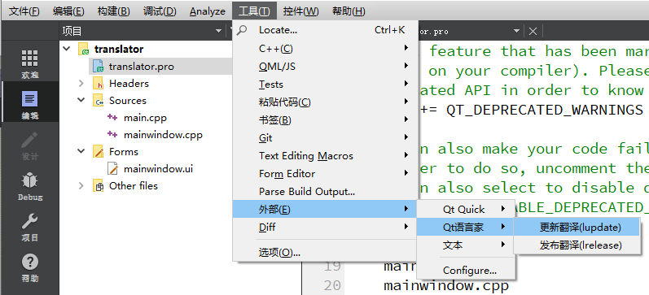

### 4，打开翻译文件，并翻译

#### 4.1 修改xml，翻译

ts文件实际上是一个xml文件，直接可以用文本编辑器打开。

```xml
<?xml version="1.0" encoding="utf-8"?>
<!DOCTYPE TS>
<TS version="2.1" language="en">							<!-- 版本和语言 -->
<context>
    <name>MainWindow</name>
    <message>
        <location filename="../mainwindow.ui" line="14"/>	<!-- 文本位置-->
        <source>MainWindow</source>							<!-- 源文本-->
        <translatorcomment>title</translatorcomment>		<!-- 注释 -->
        <translation>Maye</translation>						<!-- 翻译文本 -->
    </message>
    <message>
        <location filename="../mainwindow.ui" line="27"/>
        <source>用户名</source>
        <translation>username</translation>
    </message>
    <message>
        <location filename="../mainwindow.ui" line="40"/>
        <source>密码</source>
        <translation>password</translation>
    </message>
    <message>
        <location filename="../mainwindow.ui" line="73"/>
        <source>登录</source>
        <translation>login</translation>
    </message>
    <message>
        <location filename="../mainwindow.ui" line="86"/>
        <source>注册</source>
        <translation>register</translation>
    </message>
    <message>
        <location filename="../mainwindow.ui" line="100"/>
        <source>中文</source>
        <translation>chinese</translation>
    </message>
    <message>
        <location filename="../mainwindow.ui" line="105"/>
        <source>英文</source>
        <translation type="unfinished">English</translation>
    </message>
    <message>
        <location filename="../mainwindow.ui" line="119"/>
        <source>语言</source>
        <translation type="unfinished">language</translation>
    </message>
</context>
</TS>

```

#### 4.1 使用预言家翻译

找到Linguist预言家打开，点击菜单栏->文件->打开，选择上面生成的.ts文件，并打开。

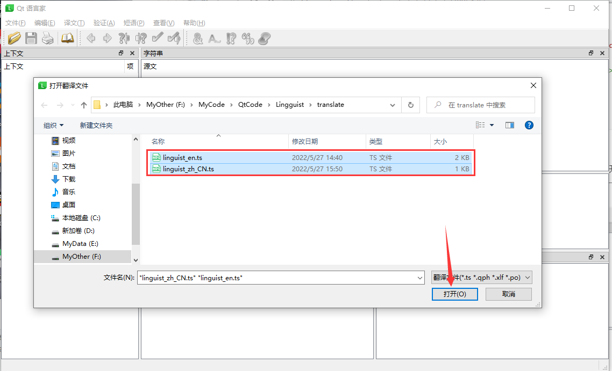

打开之后可以看到如下界面，主要就是对语言进行翻译。

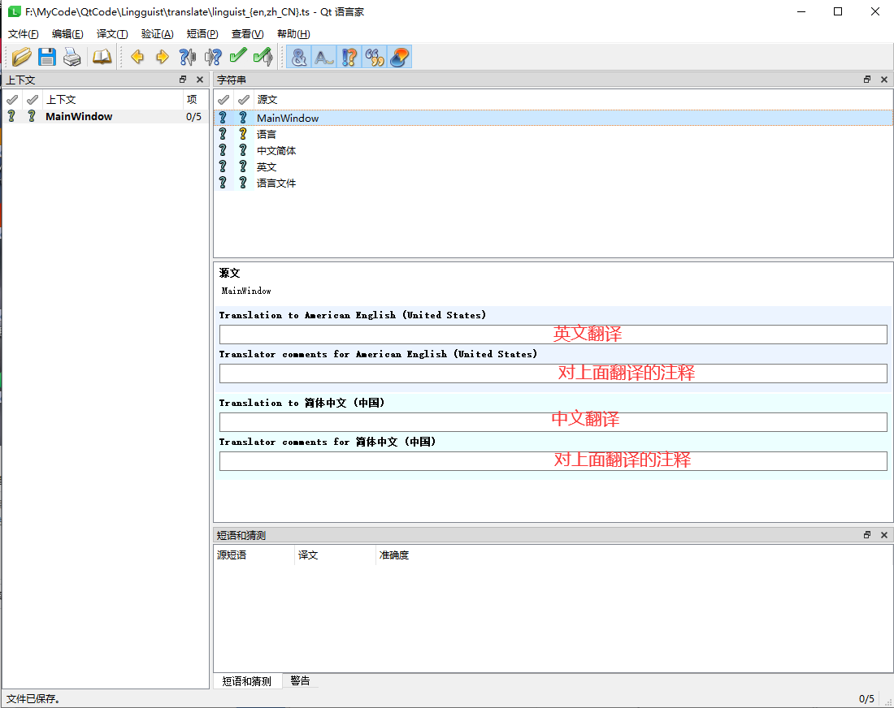

翻译前面的图标及含义：

| 图标                                                         | 含义                 |
| ------------------------------------------------------------ | -------------------- |
|  | 未翻译               |
|  | 已翻译，未标记完成   |
|  | 已翻译，且已标记完成 |


#### 4.2 使用短语书让翻译变得更快捷

短语书就是一个提前写好的翻译对照文件，在翻译ts文件的时候，可以打开短语书，很方便的就可以看到翻译。

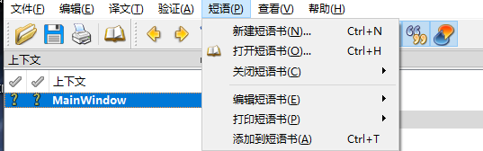

##### 1. 新建短语书

然后把需要的翻译提前写好，以后也可以重复使用。选择源语言和目标语言。

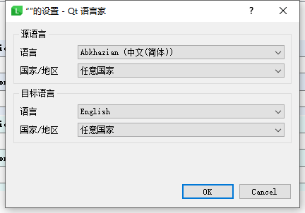

##### 2. 编辑短语书

短语书创建完成之后，就可以开始编辑短语书了。

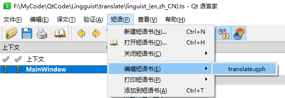

如下：先新建条目，再写上源文、译文、以及准确度(可以不写，也可以随便写点东西)，最后点击保存，就可以关掉窗口了

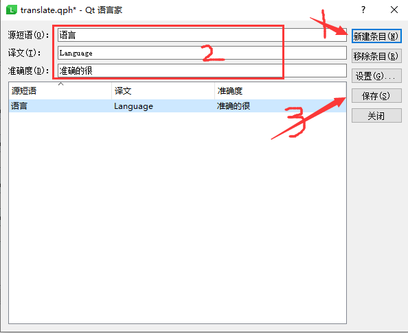

##### 3. 使用短语书

如果使用已经写好的短语书，而不是刚刚创建的，那么需要先打开短语书。如果是刚在预言家上创建的，则是打开状态的。

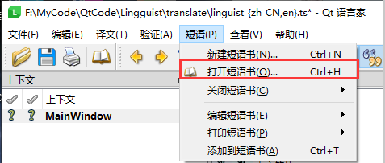

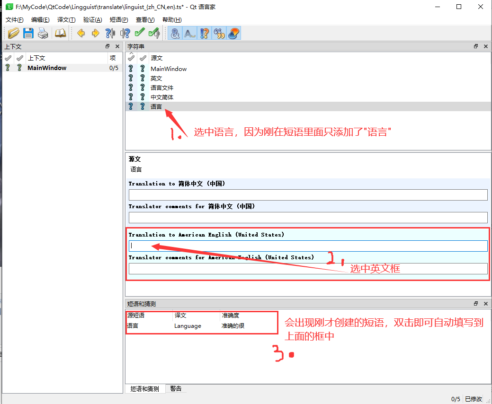

### **5，发布翻译**

翻译完成之后，就可以发布翻译了，为什么要发布呢？发布是什么意思？

+ ts文件是文本文件，占用内存比较大，发布之后会生成对应的二进制文件，内存较小
+ 通过发布就可以把ts文件转换成二进制文件

**发布的方式有两种:**

+ 通过语言家发布

  + 点击 菜单栏->文件->发布全部即可发布所有ts文件

  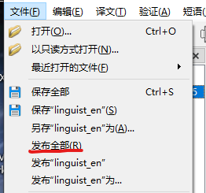

+ 通过Qt Creator发布

  + 点击 菜单栏->工具->外部->Qt语言家->发布翻译(lrelease)，会在translations目录中生成zc_CN.qm和en.qm两个文件。

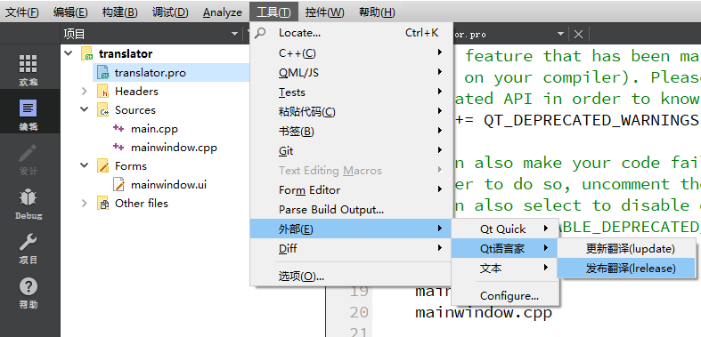


### **6，加载语言文件**

QTranslator类为文本输出提供国际化支持。

该类的对象包含一组从源语言到目标语言的翻译。 QTranslator提供了在翻译文件中查找翻译的功能。 翻译文件使用Qt Linguist创建。  

```cpp
QTranslator translator;
if(translator.load("linguist_en.qm","F:\\MyCode\\QtCode\\Lingguist\\translate"))
{
      qApp->installTranslator(&translator);
      ui->retranslateUi(this);
}
```

**注意**：翻译文件加载的位置必须在界面实例化之前完成，否则是没有效果的.

### **7，动态切换语言**

如果界面是通过Ui生成的，切换语言之后，可以通过调用函数retranslateUi翻译界面，否则需要重启程序.

+ 下拉框切换语言

```cpp
void MainWindow::on_comboBox_currentIndexChanged(int index)
{
    QString filename;
    switch (index)
    {
    case 0:
        filename = "linguist_zh_CN.qm";      
        break;
    case 1:
        filename = "linguist_en.qm";
        break;
    }
    QTranslator translator;
    if(!translator.load(filename,"F:\\MyCode\\QtCode\\Lingguist\\translate"))
    {
        qDebug()<<"翻译文件加载失败";
        return;
    }
    if(qApp->installTranslator(&translator))
    {
        qDebug()<<"安装成功";
    }else
    {
        qDebug()<<"安装失败";
    }
    ui->retranslateUi(this);
}
```

+ 保存语言选择和恢复语言

保存

```cpp
void MainWindow::on_comboBox_currentIndexChanged(int index)
{
    QString filename;
    switch (index)
    {
    case 0:
        filename = "linguist_zh_CN.qm";
        break;
    case 1:
        filename = "linguist_en.qm";
        break;
    }
    //保存配置
    QSettings setting("config.ini",QSettings::Format::IniFormat);
    setting.setValue("ts",filename);
	...
}
```

恢复

```cpp
int main(int argc, char *argv[])
{
    QApplication a(argc, argv);

    QSettings setting("config.ini",QSettings::Format::IniFormat);
    QString filename = setting.value("ts").toString();

    QTranslator translator;
    if(!translator.load(filename,"F:\\MyCode\\QtCode\\Lingguist\\translate"))
    {
        qDebug()<<"翻译文件加载失败";
    }
    if(qApp->installTranslator(&translator))
    {
        qDebug()<<"安装成功";
    }else
    {
        qDebug()<<"安装失败";
    }

    MainWindow w;
    w.show();
    return a.exec();
}
```

+ 重启程序

```cpp
//重启程序才能生效，是否重启
auto ret = QMessageBox::information(this,"hit","是否重启",QMessageBox::StandardButton::Ok,QMessageBox::No);
if(ret == QMessageBox::Ok)
{
    QString exe =  QApplication::applicationDirPath()+"/"+qAppName()+".exe";
    QProcess::startDetached(exe);
    qApp->quit();
}
```


在论坛中漂，经常遇到有人遇到tr相关的问题。用tr的有两类人：

- (1)因为发现中文老出问题，然后搜索，发现很多人用tr，于是他也开始用tr
- (2)另一类人，确实是出于国际化的需要，将需要在界面上显示的文件都用tr包起来，这有分两种：
  - (2a) 用tr包住英文(最最推荐的用法，源码英文，然后提供英文到其他语言的翻译包)
  - (2b) 用tr包住中文(源码用中文，然后提供中文到其他语言的翻译包)

注意哦，如果你正在用tr包裹中文字符，却不属于(2b)，那么：

- 你在误用tr
- 你需要的是QString，而不是tr

如果你确实属于(2b)，请做好心理准备，你可能还会遇到很多困难,

tr 是做什么的？下面二者的区别是什么？

```cpp
QString text1 = QObject::tr("hello"); 
QString text2 = QString("hello");
```

tr是用来实现国际化，如果你为这个程序提供了中文翻译包(其中hello被翻译成中文"你好")，那么text1的内容将是中文"你好"；如果你为程序提供且使用日文翻译包，那么text1的内容将是日文。

tr是经过多级函数调用才实现了翻译操作，是有代价的，所以不该用的时候最好不要用。

## 各国语言代码和名称表

| 语言代码 | 语言名称 |
| -------- | -------- |
|af    |南非语                       |
|af-ZA |南非语                   |
|ar    |阿拉伯语                      |
|ar-AE |阿拉伯语(阿联酋)             |
|ar-BH |阿拉伯语(巴林)              |
|ar-DZ |阿拉伯语(阿尔及利亚)           |
|ar-EG |阿拉伯语(埃及)              |
|ar-IQ |阿拉伯语(伊拉克)             |
|ar-JO |阿拉伯语(约旦)              |
|ar-KW |阿拉伯语(科威特)             |
|ar-LB |阿拉伯语(黎巴嫩)             |
|ar-LY |阿拉伯语(利比亚)             |
|ar-MA |阿拉伯语(摩洛哥)             |
|ar-OM |阿拉伯语(阿曼)              |
|ar-QA |阿拉伯语(卡塔尔)             |
|ar-SA |阿拉伯语(沙特阿拉伯)           |
|ar-SY |阿拉伯语(叙利亚)             |
|ar-TN |阿拉伯语(突尼斯)             |
|ar-YE |阿拉伯语(也门)              |
|az    |阿塞拜疆语                     |
|az-AZ |阿塞拜疆语(拉丁文)            |
|az-AZ |阿塞拜疆语(西里尔文)           |
|be    |比利时语                      |
|be-BY |比利时语                  |
|bg    |保加利亚语                     |
|bg-BG |保加利亚语                 |
|bs-BA |波斯尼亚语(拉丁文，波斯尼亚和黑塞哥维那) |
|ca    |加泰隆语                      |
|ca-ES |加泰隆语                  |
|cs    |捷克语                       |
|cs-CZ |捷克语                   |
|cy    |威尔士语                      |
|cy-GB |威尔士语                  |
|da    |丹麦语                       |
|da-DK |丹麦语                   |
|de    |德语                        |
|de-AT |德语(奥地利)               |
|de-CH |德语(瑞士)                |
|de-DE |德语(德国)                |
|de-LI |德语(列支敦士登)             |
|de-LU |德语(卢森堡)               |
|dv    |第维埃语                      |
|dv-MV |第维埃语                  |
|el    |希腊语                       |
|el-GR |希腊语                   |
|en    |英语                        |
|en-AU |英语(澳大利亚)              |
|en-BZ |英语(伯利兹)               |
|en-CA |英语(加拿大)               |
|en-CB |英语(加勒比海)              |
|en-GB |英语(英国)                |
|en-IE |英语(爱尔兰)               |
|en-JM |英语(牙买加)               |
|en-NZ |英语(新西兰)               |
|en-PH |英语(菲律宾)               |
|en-TT |英语(特立尼达)              |
|en-US |英语(美国)                |
|en-ZA |英语(南非)                |
|en-ZW |英语(津巴布韦)              |
|eo    |世界语                       |
|es    |西班牙语                      |
|es-AR |西班牙语(阿根廷)             |
|es-BO |西班牙语(玻利维亚)            |
|es-CL |西班牙语(智利)              |
|es-CO |西班牙语(哥伦比亚)            |
|es-CR |西班牙语(哥斯达黎加)           |
|es-DO |西班牙语(多米尼加共和国)         |
|es-EC |西班牙语(厄瓜多尔)            |
|es-ES |西班牙语(传统)              |
|es-ES |西班牙语(国际)              |
|es-GT |西班牙语(危地马拉)            |
|es-HN |西班牙语(洪都拉斯)            |
|es-MX |西班牙语(墨西哥)             |
|es-NI |西班牙语(尼加拉瓜)            |
|es-PA |西班牙语(巴拿马)             |
|es-PE |西班牙语(秘鲁)              |
|es-PR |西班牙语(波多黎各(美))         |
|es-PY |西班牙语(巴拉圭)             |
|es-SV |西班牙语(萨尔瓦多)            |
|es-UY |西班牙语(乌拉圭)             |
|es-VE |西班牙语(委内瑞拉)            |
|et    |爱沙尼亚语                     |
|et-EE |爱沙尼亚语                 |
|eu    |巴士克语                      |
|eu-ES |巴士克语                  |
|fa    |法斯语                       |
|fa-IR |法斯语                   |
|fi    |芬兰语                       |
|fi-FI |芬兰语                   |
|fo    |法罗语                       |
|fo-FO |法罗语                   |
|fr    |法语                        |
|fr-BE |法语(比利时)               |
|fr-CA |法语(加拿大)               |
|fr-CH |法语(瑞士)                |
|fr-FR |法语(法国)                |
|fr-LU |法语(卢森堡)               |
|fr-MC |法语(摩纳哥)               |
|gl    |加里西亚语                     |
|gl-ES |加里西亚语                 |
|gu    |古吉拉特语                     |
|gu-IN |古吉拉特语                 |
|he    |希伯来语                      |
|he-IL |希伯来语                  |
|hi    |印地语                       |
|hi-IN |印地语                   |
|hr    |克罗地亚语                     |
|hr-BA |克罗地亚语(波斯尼亚和黑塞哥维那)     |
|hr-HR |克罗地亚语                 |
|hu    |匈牙利语                      |
|hu-HU |匈牙利语                  |
|hy    |亚美尼亚语                     |
|hy-AM |亚美尼亚语                 |
|id    |印度尼西亚语                    |
|id-ID |印度尼西亚语                |
|is    |冰岛语                       |
|is-IS |冰岛语                   |
|it    |意大利语                      |
|it-CH |意大利语(瑞士)              |
|it-IT |意大利语(意大利)             |
|ja    |日语                        |
|ja-JP |日语                    |
|ka    |格鲁吉亚语                     |
|ka-GE |格鲁吉亚语                 |
|kk    |哈萨克语                      |
|kk-KZ |哈萨克语                  |
|kn    |卡纳拉语                      |
|kn-IN |卡纳拉语                  |
|ko    |朝鲜语                       |
|ko-KR |朝鲜语                   |
|kok   |孔卡尼语                  |
|kok-IN|孔卡尼语                  |
|ky    |吉尔吉斯语                     |
|ky-KG |吉尔吉斯语(西里尔文)           |
|lt    |立陶宛语                      |
|lt-LT |立陶宛语                  |
|lv    |拉脱维亚语                     |
|lv-LV |拉脱维亚语                 |
|mi    |毛利语                       |
|mi-NZ |毛利语                   |
|mk    |马其顿语                      |
|mk-MK |马其顿语(FYROM)           |
|mn    |蒙古语                       |
|mn-MN |蒙古语(西里尔文)             |
|mr    |马拉地语                      |
|mr-IN |马拉地语                  |
|ms    |马来语                       |
|ms-BN |马来语(文莱达鲁萨兰)           |
|ms-MY |马来语(马来西亚)             |
|mt    |马耳他语                      |
|mt-MT |马耳他语                  |
|nb    |挪威语(伯克梅尔)                 |
|nb-NO |挪威语(伯克梅尔)(挪威)         |
|nl    |荷兰语                       |
|nl-BE |荷兰语(比利时)              |
|nl-NL |荷兰语(荷兰)               |
|nn-NO |挪威语(尼诺斯克)(挪威)         |
|ns    |北梭托语                      |
|ns-ZA |北梭托语                  |
|pa    |旁遮普语                      |
|pa-IN |旁遮普语                  |
|pl    |波兰语                       |
|pl-PL |波兰语                   |
|pt    |葡萄牙语                      |
|pt-BR |葡萄牙语(巴西)              |
|pt-PT |葡萄牙语(葡萄牙)             |
|qu    |克丘亚语                      |
|qu-BO |克丘亚语(玻利维亚)            |
|qu-EC |克丘亚语(厄瓜多尔)            |
|qu-PE |克丘亚语(秘鲁)              |
|ro    |罗马尼亚语                     |
|ro-RO |罗马尼亚语                 |
|ru    |俄语                        |
|ru-RU |俄语                    |
|sa    |梵文                        |
|sa-IN |梵文                    |
|se    |北萨摩斯语                     |
|se-FI |北萨摩斯语(芬兰)             |
|se-FI |斯科特萨摩斯语(芬兰)           |
|se-FI |伊那里萨摩斯语(芬兰)           |
|se-NO |北萨摩斯语(挪威)             |
|se-NO |律勒欧萨摩斯语(挪威)           |
|se-NO |南萨摩斯语(挪威)             |
|se-SE |北萨摩斯语(瑞典)             |
|se-SE |律勒欧萨摩斯语(瑞典)           |
|se-SE |南萨摩斯语(瑞典)             |
|sk    |斯洛伐克语                     |
|sk-SK |斯洛伐克语                 |
|sl    |斯洛文尼亚语                    |
|sl-SI |斯洛文尼亚语                |
|sq    |阿尔巴尼亚语                    |
|sq-AL |阿尔巴尼亚语                |
|sr-BA |塞尔维亚语(拉丁文，波斯尼亚和黑塞哥维那) |
|sr-BA |塞尔维亚语(西里尔文，波斯尼亚和黑塞哥维那)|
|sr-SP |塞尔维亚(拉丁)              |
|sr-SP |塞尔维亚(西里尔文)            |
|sv    |瑞典语                       |
|sv-FI |瑞典语(芬兰)               |
|sv-SE |瑞典语                   |
|sw    |斯瓦希里语                     |
|sw-KE |斯瓦希里语                 |
|syr   |叙利亚语                  |
|syr-SY|叙利亚语                  |
|ta    |泰米尔语                      |
|ta-IN |泰米尔语                  |
|te    |泰卢固语                      |
|te-IN |泰卢固语                  |
|th    |泰语                        |
|th-TH |泰语                    |
|tl    |塔加路语                      |
|tl-PH |塔加路语(菲律宾)             |
|tn    |茨瓦纳语                      |
|tn-ZA |茨瓦纳语                  |
|tr    |土耳其语                      |
|tr-TR |土耳其语                  |
|ts    |宗加语                       |
|tt    |鞑靼语                       |
|tt-RU |鞑靼语                   |
|uk    |乌克兰语                      |
|uk-UA |乌克兰语                  |
|ur    |乌都语                       |
|ur-PK |乌都语                   |
|uz    |乌兹别克语                     |
|uz-UZ |乌兹别克语(拉丁文)            |
|uz-UZ |乌兹别克语(西里尔文)           |
|vi    |越南语                       |
|vi-VN |越南语                   |
|xh    |班图语                       |
|xh-ZA |班图语                   |
|zh    |中文                        |
|zh-CN |中文(简体)                |
|zh-HK |中文(香港)                |
|zh-MO |中文(澳门)                |
|zh-SG |中文(新加坡)               |
|zh-TW |中文(繁体)                |
|zu    |祖鲁语                       |
|zu-ZA |祖鲁语                   |

