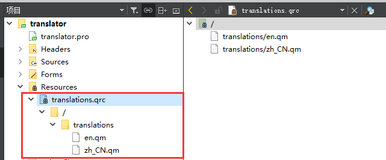

# Qt Linguist

## 简介

Qt提供了一款优秀的支持Qt C++和Qt Quick应用程序的翻译工具。发布者、翻译者和开发者可以使用这款工具来完成他们的任务。

发布者：承担了全面发布应用程序的责任。通常，他们协调开发者和翻译者的工作，可以使用lupdate工具同步源代码，进行翻译，使用lrelease同步工具为发布应用程序创建运行时使用的翻译文件。

翻译者：可以使用Qt Linguist工具翻译应用程序的文本。当然，这必须要有专业的翻译知识。

开发者：必须创建Qt应用程序能够使用的翻译文本。也应该帮助翻译者识别短语出现的场景。

以上有三种角色-发布者、翻译者、开发者，当然很多情况下，其实就是一种，那就是程序猿自己，大家都懂的。

## 开发者

**1，使用tr包裹字符串**

如果想让你的程序实现国际化，那么就在用户所有可见的字符串处都使用QObject::tr()。

```cpp
[static] QString QObject::tr(const char *sourceText, const char *disambiguation = nullptr, int n = -1)
```

**2，修改pro文件**

在.pro文件中添加翻译文件名称。

```css
TRANSLATIONS += translations/zh_CN.ts \   /*中文翻译文件*/
                translations/en.ts      /*英文翻译文件*/
```

**3，更新翻译**

点击 菜单栏->工具->外部->Qt语言家->更新翻译(lupdae)，此时会在translations目录下面生成zh_CN.ts和en.ts两个文件。


**4，打开ts文件，并翻译**

ts文件实际上是一个xml文件，直接可以用文本编辑器打开。

```xml
<?xml version="1.0" encoding="utf-8"?>
<!DOCTYPE TS>
<TS version="2.1" language="en">
<context>
    <name>MainWindow</name>
    <message>
        <location filename="../mainwindow.ui" line="14"/>	<!-- 文本位置-->
        <source>MainWindow</source>							<!-- 源文本-->
        <translatorcomment>title</translatorcomment>		<!-- 注释 -->
        <translation>Maye</translation>						<!-- 翻译文本 -->
    </message>
    <message>
        <location filename="../mainwindow.ui" line="27"/>
        <source>用户名</source>
        <translation>username</translation>
    </message>
    <message>
        <location filename="../mainwindow.ui" line="40"/>
        <source>密码</source>
        <translation>password</translation>
    </message>
    <message>
        <location filename="../mainwindow.ui" line="73"/>
        <source>登录</source>
        <translation>login</translation>
    </message>
    <message>
        <location filename="../mainwindow.ui" line="86"/>
        <source>注册</source>
        <translation>register</translation>
    </message>
    <message>
        <location filename="../mainwindow.ui" line="100"/>
        <source>中文</source>
        <translation>chinese</translation>
    </message>
    <message>
        <location filename="../mainwindow.ui" line="105"/>
        <source>英文</source>
        <translation type="unfinished">English</translation>
    </message>
    <message>
        <location filename="../mainwindow.ui" line="119"/>
        <source>语言</source>
        <translation type="unfinished">language</translation>
    </message>
</context>
</TS>

```

**5，发布翻译**

修改完成之后，点击 菜单栏->工具->外部->Qt语言家->发布翻译(lrelease)，会在translations目录中生成zc_CN.qm和en.qm两个文件。


**6，将qm文件添加到资源**



**7，加载语言文件**

QTranslator类为文本输出提供国际化支持。

该类的对象包含一组从源语言到目标语言的翻译。 QTranslator提供了在翻译文件中查找翻译的功能。 翻译文件使用Qt Linguist创建。  

```cpp
QTranslator translator;                    
if(translator.load(":/translations/en.qm"))
{                                          
    qDebug()<<"加载成功";                      
}else                                      
{                                          
    qDebug()<<"加载失败";                      
}                                          
                                           
if(a.installTranslator(&translator))       
{                                          
    qDebug()<<"安装成功";                      
}else                                      
{                                          
    qDebug()<<"安装失败";                      
}                                          
```

**注意**：翻译文件加载的位置必须在界面实例化之前完成，否则是没有效果的.

**8，动态切换语言**

如果界面是通过Ui生成的，切换语言之后，可以通过调用函数retranslateUi翻译界面，否则需要重启程序.

```cpp
void MainWindow::on_comboBox_currentIndexChanged(int index)
{
    QTranslator translator;
    switch (index)
    {
    case 0:
        translator.load(":/translations/zh_CN.qm");
        break;
    case 1:
        translator.load(":/translations/en.qm");
        break;
    }
    if(qApp->installTranslator(&translator))
    {
        qDebug()<<"安装成功";
    }else
    {
        qDebug()<<"安装失败";
    }
    ui->retranslateUi(this);
}
```


在论坛中漂，经常遇到有人遇到tr相关的问题。用tr的有两类人：

- (1)因为发现中文老出问题，然后搜索，发现很多人用tr，于是他也开始用tr
- (2)另一类人，确实是出于国际化的需要，将需要在界面上显示的文件都用tr包起来，这有分两种：
  - (2a) 用tr包住英文(最最推荐的用法，源码英文，然后提供英文到其他语言的翻译包)
  - (2b) 用tr包住中文(源码用中文，然后提供中文到其他语言的翻译包)

注意哦，如果你正在用tr包裹中文字符，却不属于(2b)，那么：

- 你在误用tr
- 你需要的是QString，而不是tr

如果你确实属于(2b)，请做好心理准备，你可能还会遇到很多困难,

tr 是做什么的？下面二者的区别是什么？

```cpp
QString text1 = QObject::tr("hello"); QString text2 = QString("hello");
```

tr是用来实现国际化，如果你为这个程序提供了中文翻译包(其中hello被翻译成中文"你好")，那么text1的内容将是中文"你好"；如果你为程序提供且使用日文翻译包，那么text1的内容将是日文。

tr是经过多级函数调用才实现了翻译操作，是有代价的，所以不该用的时候最好不要用。
