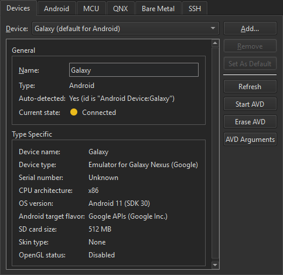
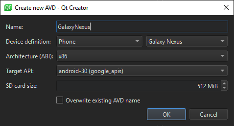

# Android

从Qt 5.14.0开始，Qt for Android包包含了作为一个整体安装的所有架构(abs)。您可以让Qt Creator为已安装的Qt版本和工具链自动创建工具包。

## 1.连接安卓设备

你可以使用USB数据线将Android设备连接到开发PC，以从Qt Creator构建，运行，调试和分析应用程序。

+ 使用 Qt 5 进行开发时，支持 Android 版本 4.1（API 级别 16）或更高版本的设备。
+ 使用 Qt 6 进行开发时，支持 Android 版本 6.0（API 级别 23）的设备。

若要针对 Android 进行开发，必须具有用于在开发电脑上安装的 Android 设备构建应用程序的工具链。Qt Creator可以自动下载并安装工具链，并创建一个合适的构建和运行[工具包](https://doc.qt.io/qtcreator/creator-glossary.html#glossary-buildandrun-kit)，其中包含工具链和适用于设备架构的AndroidQt版本。

从Qt 5.14.0开始，Qt for Android软件包包含所有安装的架构（ABI）。

要为 Java 启用有用的代码编辑功能（如代码完成、突出显示、函数工具提示和在代码中导航），请添加 [Java 语言服务器](https://doc.qt.io/qtcreator/creator-language-servers.html#java-language-server)。

Android Debug Bridge（adb）命令行工具集成到Qt Creator中，使您能够将应用程序部署到连接的Android设备，运行它们并读取其日志。它包括在开发主机上运行的客户端和服务器，以及在模拟器或设备上运行的守护程序。

### 要求

要使用Qt Creator开发适用于Android的Qt应用程序，您需要Qt for Android 5.2或更高版本，以及[Qt](https://doc.qt.io/qt/android.html) Creator可以自动为您下载、安装和配置的工具链。有关详细信息，请参阅[手动安装必备组件](https://doc.qt.io/qt/android-getting-started.html#manually-installing-the-prerequisites)。

### 指定安卓设备设置

Qt Creator提供自动安装所有必要的软件包和工具，并通过创建调试器，工具链和工具包来设置您的开发环境。您可以使用Qt Creator执行以下操作：

- 下载并解压缩 Android SDK 命令行工具。
- 安装或更新基本软件包，例如 NDK、构建工具和平台工具。

要设置适用于 Android 的开发环境，请执行以下操作：

1. **在 Windows** 和 Linux **上>** **Android** 设备上编辑>**首选项**>或在 macOS **上选择** **Qt Creator** > > 设备上**的设备>首选项**。


1. 在 **JDK 位置**字段中，设置 JDK 的路径。Qt Creator 会检查 JDK 安装并报告错误。

   默认情况下，Qt Creator 会尝试查找受支持的 [AdoptOpenJDK](https://adoptopenjdk.net/) 或 [OpenJDK](http://openjdk.java.net/) 安装。如果未找到路径，则必须手动设置路径。如果未安装受支持的 JDK，请选择在默认浏览器中打开 JDK 下载网页。

   **注意：** 我们建议使用 64 位 JDK，因为 32 位 JDK 可能会导致 出现问题，并且某些包可能未列出。`cmdline-tools`

2. 在 Android SDK **位置**字段中，设置要安装 [Android SDK 命令行工具](http://developer.android.com/sdk/index.html)的文件夹的路径。

3. 选择“设置 SDK”以自动下载 Android **SDK** 命令行工具并将其提取到所选路径。

   SDK 管理器会检查工具链是否已安装。如果缺少包或需要更新，SDK 管理器会提供添加或删除这些包。在执行操作之前，它会提示您接受即将进行的更改。此外，如有必要，它会提示您接受 Google 许可。

4. 已安装的 NDK 版本列在**安卓 NDK 列表中**。锁定的项目由 SDK 管理器安装，只能从 **Android SDK 管理器**对话框中进行修改。有关更多信息，请参阅[管理安卓 NDK 软件包](https://doc.qt.io/qtcreator/creator-developing-android.html#managing-android-ndk-packages)。

5. 选中“**自动为Android工具链创建工具包**”复选框，以允许Qt Creator为您创建工具包。如果找不到合适的Qt版本，Qt Creator会显示警告。

6. （可选）在 Android OpenSSL 设置组中，设置预构建的 **OpenSSL** 库的路径。

   对于需要OpenSSL支持的Qt应用程序，Qt Creator允许快速将[Android OpenSSL支持](https://marketplace.qt.io/products/android-openssl-support)添加到您的项目中。有关更多信息，请参见[添加外部库](https://doc.qt.io/qtcreator/creator-deploying-android.html#adding-external-libraries)。

7. 选择**“下载 OpenSSL**”，将 OpenSSL 存储库下载到所选路径。如果自动下载失败，下载网页将打开以供手动下载。

### 手动设置

**注意：** 我们建议您使用最新的安卓 SDK 命令行工具。不支持使用Android SDK Tools版本25.2.5或更早版本，因为它们无法与Qt Creator完全集成。

但是，如果自动设置不能满足您的需求，您可以下载并安装 Android SDK 命令行工具，然后安装或更新开发所需的 NDK、工具和软件包。有关更多信息，请参阅 [Qt Android 入门](https://doc.qt.io/qt/android-getting-started.html)。

### 查看安卓工具链设置

Android SDK 命令行工具下载 URL、基本软件包列表以及每个 Qt 版本的相应 NDK 在 JSON 配置文件中定义。该文件位于用户的Qt Creator资源文件夹下：

```
# Linux and macOS
~/.config/QtProject/qtcreator/android/sdk_definitions.json

# Windows
C:\Users\Username\AppData\Local\QtProject\qtcreator\android\sdk_definitions.json
```

例如，SDK 配置文件定义了要用于 Qt 5.12.0 至 5.12.5 和 Qt 5.13.0 至 5.13.1 版本的 NDK 版本 19.2.5345600：

```
"specific_qt_versions": [
    {
        "versions": ["5.12.[0-5]", "5.13.[0-1]"],
        "sdk_essential_packages": ["build-tools;28.0.2", "ndk;19.2.5345600"],
        "ndk_path": "ndk/19.2.5345600"
    }
]
```

您可以在 Git 中查看最新版本的配置文件，其中包含 Android SDK 和 NDK 更改的最新版本，[sdk_definitions.json](https://code.qt.io/cgit/qt-creator/qt-creator.git/plain/share/qtcreator/android/sdk_definitions.json)。

### 管理安卓 NDK 软件包

要查看已安装的 [Android NDK](http://developer.android.com/tools/sdk/ndk/index.html) 版本，请选择在 Windows 和 Linux 上编辑>>设备上 **的设备**>或在 macOS **上选择** **Qt Creator** **> >** **设备 > Android** 设备。


锁定的版本由 SDK 管理器安装，只能从 **Android SDK 管理器**对话框中进行修改。有关更多信息，请参阅[管理 Android SDK 包](https://doc.qt.io/qtcreator/creator-developing-android.html#managing-android-sdk-packages)。

要手动下载 NDK，请选择  。

要默认对所有Qt版本使用选定的NDK版本，请选择**设为默认**版本。

要手动将自定义 NDK 路径添加到全局 NDK 列表，请选择**添加**。这将创建与该 NDK 关联的自定义工具链和调试器。但是，您必须手动创建使用自定义 NDK 的工具包。有关详细信息，请参阅[添加工具包](https://doc.qt.io/qtcreator/creator-targets.html)。

### 管理安卓开发工具包

从 Android SDK Tools 版本 25.3.0 开始，Android 仅提供命令行工具 [sdkmanager](https://developer.android.com/studio/command-line/sdkmanager.html) 用于 SDK 包管理。为了使SDK管理更容易，Qt Creator提供了一个SDK管理器，用于安装、更新和删除SDK包。您仍然可以使用 sdkmanager 进行高级 SDK 管理。

要查看已安装的 Android SDK 软件包，请在 Windows 和 Linux 上 选择 > **Android** > SDK Manager >**设备**编辑>首选项，或在 macOS **上选择** **Qt Creator > Preferences**> 设备> **Android >** **SDK Manager**。


可以**显示>****频道**显示包“中选择的发布频道的包。常见的频道 ID 包括**稳定**版、**测试**版、**开发**版和**金丝雀**频道。若要显示和更新过时的包，请选择“**包括过时的**包”。若要筛选包，请选择“**可用**”、“**已安装**”或**“全部**”。

要更新已安装的 Android SDK 软件包，请选择**更新已安装**。选择要更新的程序包，然后选择**“应用**”。

要指定高级 sdkmanager 设置，请选择**高级选项**，然后在 **SDK 管理器**参数字段中输入参数。可用参数中列出并描述了可用**参数**。


### 管理安卓虚拟设备 （AVD）

可用的 AVD 列在 Windows 和 Linux 上的“**编辑**>首选项”>“设备”或 macOS **上的“****Qt Creator** >**首选项**”>**“设备**”>中。 您可以添加更多 AVD。



您可以在**“当前状态**”中查看所选设备的状态。若要更新状态信息，请选择**“刷新**”。

要启动 **AVD，请选择启动 AVD**。通常，您不需要单独启动 AVD，因为当您在[套件选择器](https://doc.qt.io/qtcreator/creator-building-targets.html)中选择它们以[将应用程序部署到](https://doc.qt.io/qtcreator/creator-deploying-android.html)它们时，它们会自动启动。

要从列表和套件选择器中删除 AVD，请选择**擦除 AVD**。

要指定用于启动 AVD 的选项，请选择 **AVD 参数**。


在**模拟器命令行启动**选项中指定选项。有关可用选项，请参阅[从命令行启动模拟器](https://developer.android.com/studio/run/emulator-commandline)。

**注意：** Android 模拟器有一个错误，阻止它在某些系统上启动。如果 AVD 未启动，您可以尝试通过运行以下命令手动启动它：

```
cd <ANDROID_SDK>/emulator
./emulator -avd <AVD_NAME>
```

### 创建新的 AVD

要创建新的虚拟设备：

1. **选择编辑**>**首选项**>**设备**>>**在** Windows 和 Linux 上添加 Android 设备或 **Qt Creator** >首选项>**设备>在** macOS 上**添加****> Android 设备**以打开“**创建新的 AVD”**对话框。

   

2. 设置设备的名称、定义、体系结构、目标 API 级别和 SD 卡大小。

3. 选择**确定**以创建 AVD。

有关创建新 AVD 的更多高级选项，请使用命令行工具 [avdmanager](https://developer.android.com/studio/command-line/avdmanager.html) 或 Android Studio 的原生 AVD 管理器界面。

### 在安卓设备上调试

调试在不同的 Android 设备上以不同的方式启用。在**“开发人员选项**”下查找**USB调试**。在某些设备上，“**开发人员选项**”处于隐藏状态，并且仅在您多次点击“设置”>**“**关于”中的**内部版本号**字段时可见。有关详细信息，请参阅[配置设备上的开发人员选项](https://developer.android.com/studio/debug/dev-options)。

选择调试生成[配置以生成用于调试](https://doc.qt.io/qtcreator/creator-glossary.html#glossary-build-config)的应用程序。

**注意：** 如果Android Studio正在运行，Qt Creator无法调试Android设备上的应用程序。如果[应用程序输出](https://doc.qt.io/qtcreator/creator-output-panes.html#application-output)中显示以下消息，请关闭 Android 工作室并重试：

```
Ignoring second debugger -accepting and dropping.
```

## 2. 部署到安卓

在 Android 上，应用程序以特殊结构类型的 ZIP 包分发，称为应用程序包 （APK） 或 Android 应用捆绑包 （AAB）。APK文件可以下载到设备上并在设备上执行，而AAB旨在由Google Play商店解释，并用于生成APK文件。

[Qt for Android](https://doc.qt.io/qt/android.html) 有 armv7a、arm64-v8a、x86 和 x86-64 的二进制文件。若要在应用程序中支持多个不同的 ABI，请生成一个 AAB，其中包含每个 ABI 的二进制文件。Google Play 商店使用 AAB 为发出下载请求的设备生成优化的 APK 包，并使用您的发布商密钥自动对其进行签名。

Qt Creator支持以下Android应用程序的部署方法：

- 作为独立的可分发应用程序包 （APK）。
- 从Qt 5.14.0开始，作为应用程序捆绑包（AAB），打算在Google Play商店中分发。

**注意：** 从Qt Creator 4.12开始，不支持Ministro。

要[指定](https://doc.qt.io/qtcreator/creator-deploying-android.html#specifying-settings-for-packages)应用程序包的设置，请选择“**项目**”>**“生成**”>**“生成 Android APK** ”**>详细信息”。**

有关运行应用程序的选项的详细信息，请参阅[指定 Android 设备的运行设置](https://doc.qt.io/qtcreator/creator-run-settings.html#specifying-run-settings-for-android-devices)。

### 包装应用

由于将应用程序捆绑为APK包并非易事，因此Qt 5提供了一个名为.当您使用*适用于Android的Qt kit*部署应用程序时，Qt Creator会使用该工具创建必要的文件并将其捆绑到APK中：`androiddeployqt``androiddeployqt`

- Java 文件，作为应用程序的入口点，自动加载 Qt 并在应用程序中执行本机代码。
- AndroidManifest.xml，提供有关应用程序的元信息。
- 其他 XML 文件，用于指定应用程序的依赖项。
- 资源文件。
- 库和 QML 文件，可以包含在项目中，具体取决于您选择的部署方法。
- 下载和使用 Gradle 所需的 Gradle 包装器。
- Java IDE所需的Gradle脚本，例如Android Studio。它允许用户在不复制我们的 Java 源代码的情况下扩展 Java 部分。它还允许 IDE 提供代码完成、语法突出显示等。

仅当您使用 Gradle 构建应用程序包时，才会捆绑 Gradle 包装器和脚本。有关更多信息，请参阅[连接安卓设备](https://doc.qt.io/qtcreator/creator-developing-android.html)。

若要查看该工具创建的包，请选中“**生成后打开包位置**”复选框。`androiddeployqt`

### 指定部署设置

可用的部署设置列在“**方法**”字段中。若要为项目添加部署方法，请选择“**添加**”。


若要重命名当前部署方法，请选择“**重命名**”。

若要删除当前部署方法，请选择“**删除**”。

程序包部署在[您在工具包选择器](https://doc.qt.io/qtcreator/creator-building-targets.html)中选择的 Android 设备上。若要添加设备，请选择**“管理**”。

有关为应用程序指定其他启动选项的详细信息，请参阅[指定 Android 设备的运行设置](https://doc.qt.io/qtcreator/creator-run-settings.html#specifying-run-settings-for-android-devices)。

若要从设备中删除以前安装的文件，请选择**“在部署之前卸载现有应用**”。

要将预构建的 APK（例如第三方应用程序）安装到设备，请选择**安装 APK 文件**。

### 指定包的设置

要指定该工具的设置，请选择“**>生成和运行****项目**”>**“生成**”>**“生成 Android APK** **>详细信息”。**`androiddeployqt`


该工具使用配置信息来创建 APK。有关可用选项的更多信息，请参阅 [androiddeployqt](https://doc.qt.io/qt/android-deploy-qt-tool.html#androiddeployqt)。`androiddeployqt`

您可以在[编译输出](https://doc.qt.io/qtcreator/creator-output-panes.html#compile-output)中查看有关该工具正在执行的操作的信息。若要查看其他信息，请选中“**详细输出**”复选框。`androiddeployqt`

选择“添加调试服务器”，将**调试服务器**二进制文件包含在包中。

#### 选择 API 级别

在 **Android 构建平台 SDK** 字段中，您可以选择用于构建应用程序的 API 级别。通常，您应该选择可用的最高 API 级别。

**注意：** 对于 Qt 5.12.0 到 5.12.5 和 Qt 5.13.0 到 5.13.1，应使用 Android 构建平台 SDK 28。对于Qt 5.13.1更新的版本，应使用构建平台SDK 29或最新版本。

此字段不指定支持的最低 API 级别，也不指定可在 Android 清单中指定的目标 API 级别。请参阅[编辑清单文件](https://doc.qt.io/qtcreator/creator-deploying-android.html#editing-manifest-files)。有关 Android API 级别的更多信息，请参阅[什么是 API 级别？](http://developer.android.com/guide/topics/manifest/uses-sdk-element.html#ApiLevels)。

#### 建立AAB

若要在本地测试应用程序，请使用 APK 格式，因为包可以直接上传到设备并运行。要分发到 Google Play 商店，请通过选中**构建 Android 应用捆绑包 （\*.aab）** 复选框来创建 AAB。

使用 CMake 进行构建时，可以在 **CMake** 部分的**初始配置**中查看选定的 ABI。您可以将其他 ABI 设置为键的值：`ANDROID_ABI`


使用 Qbs 或 qmake 进行构建时，可以在“**构建步骤**”的“**ABI ”**字段中选择 ABI：


#### 对安卓软件包进行签名

若要发布应用程序，必须使用公钥-私钥对对其进行签名，公钥*-私钥对*由*证书*和相应的*私钥*组成，并由*别名*标识。密钥对用于验证应用程序的未来版本是否确实由您创建。

**警告：** 将密钥对保存在安全的地方并备份副本，因为如果丢失密钥对，则无法更新应用程序。

您可以使用Qt Creator生成密钥库和*自签名*证书。生成的证书具有 X.509 v3 数字证书的结构。它包含有关证书的版本、序列号和有效期、用于加密数据的算法的 ID、颁发证书的组织以及证书的*使用者*（所有者）的信息。如果是自签名证书，证书的颁发者和所有者是相同的。此外，证书还包含有关用于对证书进行签名的算法以及证书签名的信息。

密钥库受密码保护。此外，您可以使用每个别名的单独密码保护每个别名。

对 Android 应用程序进行签名时，必须从密钥库中选择一个包含证书和证书别名的密钥库。别名的公钥（证书）在签名期间嵌入到 APK 中。

要创建密钥库和自签名证书，请执行以下操作：

1. 在密钥库字段中，选择**创建**以创建一个新的密钥库，该**密钥**库在创建密钥**库和证书**对话框中包含一个密钥对：

   

2. 在密钥库组中，输入用于保护**密钥库**的密码。

3. 在“证书”组中，指定**证书**的密钥大小和有效期。您可以指定单独的密码来保护密钥对或使用密钥库密码。

4. 在“**证书可分辨名称**”组中，输入有关您自己以及标识密钥对颁发者和所有者的公司或组织的信息。

5. 选择**“保存**”。

6. 在“密钥库文件名”对话框中，输入**密钥库**的名称并为其选择位置。

7. 在密钥库对话框中，输入密钥库密码以在密钥库中创建**密钥**对。

要使用密钥对对 Android 程序包进行签名，请设置指定程序包[设置](https://doc.qt.io/qtcreator/creator-deploying-android.html#specifying-settings-for-packages)中所述的**签名程序包**组设置：

1. 在密钥库字段中，选择**选择以**选择现有密钥**库**。
2. 在证书别名字段中，从密钥库包含的密钥对列表中选择**别名**。
3. 选中“对**包进行签名**”复选框以使用别名对 Android 包进行签名。

#### 添加外部库

Qt Creator会自动检测应用程序使用的Qt库，并将它们添加为依赖项。如果应用程序需要外部库，请在>**“****构建**>构建**Android APK****>其他库**”字段中指定它们。这些库将复制到应用程序的库文件夹中，并在启动时加载。

若要添加 OpenSSL 库，请在“**其他**库”组中**选择“包括预构建的 OpenSSL 库**”。这将添加在**Android OpenSSL**组中[的设备设置](https://doc.qt.io/qtcreator/creator-developing-android.html#specifying-android-device-settings)中定义的OpenSSL包含项目。这可用于 qmake 和 CMake 项目。

否则，您可以手动将所需库和库的路径添加到**“其他库**”字段。`libssl.so``libcrypto.so`

### 编辑清单文件

您可以使用配置选项指定该工具所需的所有设置。您只需要一个 Android 清单文件即可指定特定于 Android 的设置，例如应用程序图标。但是，当您要在 Play 商店中发布软件包时，需要清单文件。`androiddeployqt`

### 包名称

Android 应用程序包通常使用分层模式命名，层次结构中的级别用句点 （.） 分隔。通常，包名称以组织的顶级域名开头，后跟组织的域名和按相反顺序列出的任何子域名。然后，组织可以为其包选择特定名称。包名称应尽可能以全部小写字符书写。例如。`org.qtproject.example`

Java 语言规范的第 7.7 节中描述了消除软件包名称歧义的完整约定以及当 Internet 域名不能直接用作软件包名称时命名软件包的规则。

有关软件包名称的更多信息，请参阅 [Android 应用程序基础知识](http://developer.android.com/guide/components/fundamentals.html)。

### 造型

Qt使用不同的方法来确定Qt控件和Qt快速控件的样式：

- 在项目中使用 Qt Widgets 或 Qt Quick Controls 1 时，选择**默认**或**完整**。

  **注意：** 此方法使用一些 Android 非 SDK 接口，这些接口从 Android 9.0 （API 28） 开始受到 Google 的限制。

- 使用 Qt 快速控件 2 但不使用 Qt 控件或 Qt 快速控件 1 时选择**最小**。这比使用默认或完整选项更快。

- 既不使用 Qt Widgets 也不使用 Qt Quick Controls 1 或 2 时，请选择**“无**”。

### 屏幕方向

您可以根据传感器读数或用户首选项指定不同的选项来确定屏幕方向。下表列出了可用的选项。

|    取向    |                             描述                             |
| :--------: | :----------------------------------------------------------: |
|   未指定   | 系统选择方向。它使用的策略以及在特定上下文中做出的选择可能因设备而异。 |
|     后     |         使用与活动堆栈中紧靠其下方的活动相同的方向。         |
|    景观    |                横向，其中显示宽度大于其高度。                |
|    肖像    |                纵向，其中显示高度大于其宽度。                |
|  反向横向  |                   景观方向与正常景观相反。                   |
|  反向纵向  |                   纵向方向与正常纵向相反。                   |
| 传感器环境 | 横向，但根据设备传感器，它可以是正常或反向横向。即使用户锁定了基于传感器的旋转，也会使用传感器。 |
| 传感器纵向 | 纵向，但根据设备传感器，它可以是正常或反向纵向。即使用户锁定了基于传感器的旋转，也会使用传感器。 |
|  用户格局  | 横向，但根据设备传感器和用户的偏好，它可以是正常或反向横向。 |
|  用户画像  | 纵向，但根据设备传感器和用户的偏好，它可以是正常或反向纵向。 |
|   传感器   | 方向由设备方向传感器确定。显示器的方向取决于用户握持设备的方式。当用户旋转设备时，它会发生变化。但是，默认情况下，某些设备不会旋转到所有四个可能的方向。要允许所有四个方向，请选择完整传感器选项。即使用户锁定了基于传感器的旋转，也会使用该传感器。 |
|  全传感器  | 方向由设备方向传感器确定四个方向中的任何一个。这类似于传感器选项，不同之处在于它允许四种可能的屏幕方向中的任何一种，而不管设备通常做什么。例如，某些设备通常不会使用纵向反向或反向横向，但此选项会启用它们。 |
|  无传感器  | 方向是在不参考物理方向传感器的情况下确定的。传感器将被忽略，因此显示器不会根据用户移动设备的方式旋转。 |
|    用户    |                     用户当前的首选方向。                     |
|  完全用户  | 如果用户已锁定基于传感器的旋转，则此选项的行为方式与用户选项相同。否则，它的行为与完整传感器选项相同，并允许四种可能的屏幕方向中的任何一种。 |
|     锁     |          将方向锁定为其当前旋转，无论该旋转是什么。          |

### 图标和初始屏幕

您可以将不同的图像设置为在低、中、高和超高 DPI 显示器上显示为应用程序图标和初始屏幕。以下列表汇总了通常与每个类别关联的 DPI 值：

- 低密度：~120dpi
- 中密度 （MDPI）： ~160dpi
- 高密度 （HDPI）： ~240dpi
- 超高密度 （XHDPI）： ~320dpi
- 超高密度 （XXHDPI）： ~480dpi
- 超高密度 （XXXHDPI）： ~640dpi

在应用程序图标选项卡中指定**图标**的设置。选择分辨率最高的图像作为**主图标**。Qt Creator根据需要调整图标大小，并将其版本设置为在低，中，高和超高DPI显示器上显示。或者，分别设置每个分辨率的图标。


在“初始屏幕”选项卡中指定**初始屏幕**的设置。选择要显示为初始屏幕的图像，具体取决于设备方向和屏幕分辨率。


默认情况下，绘制活动时自动隐藏初始屏幕。若要在调用 [QNativeInterface：：QAndroidApplication：：hideSplashScreen（）](https://doc.qt.io/qt-6/qnativeinterface-qandroidapplication.html#hideSplashScreen) 之前使其保持可见，请选中“**粘滞初始屏幕**”复选框。

在**图像显示模式下**，选择是将初始屏幕居中放在设备显示屏上，还是缩放初始屏幕以填充显示屏。

在背景颜色中设置**背景颜色**。

选择分辨率最高的图像作为主图像、纵向主图像和**横向****主图像**。

选择**“全部清除”**以重置所有设置或删除所有图像。

### 安卓清单编辑器

如果您使用 qmake 作为构建系统，则可以创建一个 Android 清单文件并在 Qt Creator 中进行编辑。

要创建 Android 清单文件并在 Android 清单编辑器中打开它，请执行以下操作：

1. 选择**项目**>**构建**>**构建安卓APK**>**创建模板**。

2. 检查 **Android 包源目录中**的路径。

   

3. 选择**将 Gradle 文件复制到 Android 目录**，如果您计划扩展 Qt 应用程序的 Java 部分。

4. 选择**“完成**”，将模板文件复制到目录，并打开清单文件进行编辑。`android`

5. 在 **包**名称 字段中，输入应用程序的有效[包名称](https://doc.qt.io/qtcreator/creator-deploying-android.html#package-names)。例如。该应用程序由自动生成的 Java 启动器启动，该启动器与应用程序一起打包到 Android 包 （.apk） 中。

   ```
   org.example.myapplication
   ```

   

6. 您可以在版本**代码**字段中指定包的内部版本号。它用于确定应用程序的一个版本是否比另一个版本更新。在 **版本名称** 字段中，指定向用户显示的版本号。

7. 在“**所需的最低 SDK**”字段中，选择运行应用程序所需的最低 API 级别。Qt Creator 支持的最低 API 级别是 android-9。但是，Qt版本可能具有不同的最低API级别，因此Qt Creator不允许您选择为工具包指定的Qt版本不支持的API级别。

8. 在**“目标 SDK**”字段中，选择应用程序的目标 API 级别。这会影响操作系统中某些兼容性功能的激活。该工具默认使用的值为 14，这意味着默认情况下不会启用系统导航栏中的溢出按钮。`androiddeployqt`

9. 在 **应用程序名称** 字段中，设置应用程序的名称。

10. 在 活动名称 字段中，设置**活动名称**。

11. 在**样式提取**字段中，设置 Qt 用于[确定要使用的 UI 样式](https://doc.qt.io/qtcreator/creator-deploying-android.html#styling)的方法。

12. 在 屏幕方向 字段中，选择用于确定**屏幕方向**的选项。

13. 在“应用程序图标”中，根据屏幕分辨率指定要用作**应用程序图标**的图像。

14. 在“初始屏幕”中，根据屏幕方向和分辨率选择要显示为**初始屏幕**的图像。

15. 在 **Android** 服务中，选择“添加”以**添加**服务。必须至少为新服务输入服务类名称。如果选择“**在外部进程中运行**”，则还需要输入进程名称。如果选择“**在外部库中运行**”，则需要输入库名称。服务参数对于未在外部库中运行的服务是必需的。有关编写服务代码和服务结构的更多信息，请参阅 [Android 服务](https://doc.qt.io/qt/android-services.html)。

    

16. 在**“权限”**字段中，可以指定应用程序所需的权限。从Android 6.0（API 23）开始，必须在运行时请求权限（参见[QtAndroidPrivate：：requestPermission](https://doc.qt.io/qt/qtandroidprivate.html#requestPermission)（））。对于较低的 Android API 级别，系统会要求用户在安装应用程序时授予权限。然后，Android 操作系统授予应用程序访问相应数据和功能的权限。

    

17. 选中“包括Qt模块的默认权限”和**“包括Qt模块的默认功能**”复选框，以添加**Qt**库所需的权限。这可以是[Qt Core](https://doc.qt.io/qt/qtcore-index.html)或[Qt Location](https://doc.qt.io/qt-5.15/qtlocation-index.html)。`android.permission.WRITE_EXTERNAL_STORAGE``android.permission.ACCESS_COARSE_LOCATION`

18. 若要添加权限，请从列表中选择该权限，然后单击“**添加**”。

在顶部标题上，选择“XML 源”选项卡以编辑 **XML** 格式的文件。

## 3. Qt for Android

[Qt for Android](https://doc.qt.io/qt-6.2/android.html)使您能够在Android设备上运行Qt应用程序。

支持android目标的Qt模块详见：[所有支持的Qt模块](https://doc.qt.io/qt-6.2/qtmodules.html)。

Qt 6.2支持以下开发环境和目标系统配置:

这个Qt版本支持以下配置:

|                 Distribution                  |               Architecture                |                         Compiler                          |                      Notes                      |
| :-------------------------------------------: | :---------------------------------------: | :-------------------------------------------------------: | :---------------------------------------------: |
| Android 6.0 or later (API level 23 or higher) | `armv7a`, `x86`, `arm64-v8`, and `x86_64` | Clang 11.0.5 (NDK r22b) as provided by Google, MinGW 11.2 | For JDK versions see Java Development Kit (JDK) |

使用Qt开发安卓程序，需要三个工具包，分别是JDK、SDK、NDK:

**JDK(Java Development Kit)**是 Java 语言的软件开发工具包，主要用于移动设备、嵌入式设备上的java应用程序。JDK是整个java开发的核心，它包含了JAVA的运行环境，JAVA工具和JAVA基础的类库。

**SDK (Software Development Kit)** 软件开发工具包是软件开发工程师用于为特定的软件包、软件框架、硬件平台、操作系统等建立应用软件的开发工具的集合。Android SDK 就是 Android 专属的软件开发工具包。

**NDK(Native Development Kit)**原生开发工具包是一组可以让您在Android应用中利用C和c++代码的工具,可用以从您自己的源代码构建,或者利用现有的预构建库.

### 一、下载JDK、SDK、NDK

**不同的Qt需要不同版本的工具包，版本不同可能会导致配置失败，为了方便，我们把这三个工具包都放到同一目录中**

- [JDK]([Java Downloads | Oracle](https://www.oracle.com/java/technologies/downloads/#java11))——11.0.16.1

- [SDK/NDK](https://developer.android.google.cn/studio#downloads) ——通过Android命令行工具下载

  - [sdkmanager使用](https://developer.android.google.cn/studio/command-line/sdkmanager#install_packages)

  

### 1,安装JDK

双击安装包，根据提示，点击下一步。


然后可以自己修改安装目录，点击下一步，等待片刻，即可安装完成~


### 2,安装SDK/安装NDK

#### sdkmanager

首先，解压`commandlinetools-win-8512546_latest.zip` 得到sdkmanager命令行工具，您可以用它来查看、安装、更新和卸载 Android SDK 的软件包。如果您使用 Android Studio，则无需使用此工具，而是可以[从 IDE 管理 SDK 软件包](https://developer.android.google.cn/studio/intro/update#sdk-manager)。

请按以下步骤操作：

1. 从 [Android Studio 下载页面](https://developer.android.google.cn/studio)中下载最新的“command line tools only”软件包，然后将其解压缩。

2. 将解压缩的 `cmdline-tools` 目录移至您选择的新目录，例如 android_sdk。这个新目录就是您的 Android SDK 目录。

3. 在解压缩的 `cmdline-tools` 目录中，创建一个名为 `latest` 的子目录。

4. 将原始 `cmdline-tools` 目录内容（包括 `lib` 目录、`bin` 目录、`NOTICE.txt` 文件和 `source.properties` 文件）移动到新创建的 `latest` 目录中。现在，您就可以从这个位置使用命令行工具了。

5. （可选）如需安装旧版命令行工具，请运行以下命令：

   ```sh
   android_sdk/cmdline-tools/latest/bin/sdkmanager --install "cmdline-tools;version"
   ```

   将 `version` 替换为您要安装的版本，例如 `5.0`

#### 用法

您可以使用 `sdkmanager` 执行以下任务。

##### 列出已安装和可用的软件包

```sh
sdkmanager --list
```

##### 安装软件包

```sh
sdkmanager packages
```

packages 参数是 `--list` 命令列出的 SDK 式的路径，这些路径括在引号中（例如 `"build-tools;30.0.2"` 或 `"platforms;android-28"`）。您可以传递多个软件包路径（用空格分隔），但各个路径必须括在各自的一组引号中。

例如，下面展示了如何安装最新的平台工具（包括 `adb` 和 `fastboot`）以及适用于 API 级别 28 的 SDK 工具：

```sh
sdkmanager "platform-tools" "platforms;android-28"
```

或者，您也可以传递一个指定了所有软件包的文本文件：

```sh
sdkmanager --package_file=package_file
```

###### package_file

若要卸载软件包，只需添加 `--uninstall` 标记：

```sh
sdkmanager --uninstall packages 
sdkmanager --uninstall --package_file=package_file
```

例如，使用以下命令安装指定 NDK 版本（无论其当前位于哪个渠道）。

```sh
sdkmanager --install "ndk;21.3.6528147" --channel=3 //从canary通道(或below)安装NDK 
sdkmanager --install "cmake;10.24988404" // 安装特定版本的CMake
```

#### 安装需要的软件包

进入bin目录，打开cmd，输入`sdkmanager --package_file=sdk_tools.txt`


### 二、Qt Creator 配置

### 配置路径

菜单栏->工具->选项->设备->android，把对应的工具包路径加载到指定位置。


路径添加好之后，如果全是绿色的√，没有红色的**叉叉**，说明环境配置成功了

### 下载Android OpenSSL


### 三、创建项目，生成apk

创建项目和平时一样，只需要在选择套件时，选择上android即可。


然后点击编译，不要点击运行哦~


OK！生成成功！

如果想要打开模拟器实时看小运行效果，需要安装模拟器，输入以下命令即可:

```sh
sdkmanager "system-images;android-31;google_apis_playstore;x86_64"
```

+ 当程序在安卓手机上大小显示不正常时，需要设置高分屏缩放

```cpp
int main(int argc, char *argv[])
{
    //必须在QApplication对象创建之前
    QApplication::setAttribute(Qt::AA_EnableHighDpiScaling);
    QApplication a(argc, argv);
    MainWindow w;
    w.show();
    return a.exec();
}
```


## 四、遇到错误


```cpp
the selected path has an invaild ndk.  this might mean that the path contains space characters,or that it does not have a "toolchains" sub-directory,or that the NDK version could not be retrieved because of a missing "source. properties" or "RELEASE.TXT" file
```

