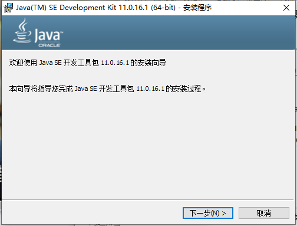
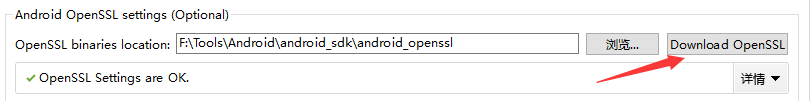
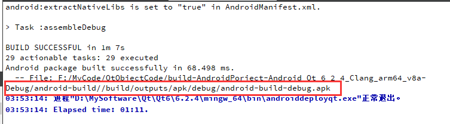

# Qt for Android

[Qt for Android](https://doc.qt.io/qt-6.2/android.html)使您能够在Android设备上运行Qt应用程序。

支持android目标的Qt模块详见：[所有支持的Qt模块](https://doc.qt.io/qt-6.2/qtmodules.html)。

Qt 6.2支持以下开发环境和目标系统配置:

这个Qt版本支持以下配置:

|                 Distribution                  |               Architecture                |                         Compiler                          |                      Notes                      |
| :-------------------------------------------: | :---------------------------------------: | :-------------------------------------------------------: | :---------------------------------------------: |
| Android 6.0 or later (API level 23 or higher) | `armv7a`, `x86`, `arm64-v8`, and `x86_64` | Clang 11.0.5 (NDK r22b) as provided by Google, MinGW 11.2 | For JDK versions see Java Development Kit (JDK) |

使用Qt开发安卓程序，需要三个工具包，分别是JDK、SDK、NDK:

**JDK(Java Development Kit)**是 Java 语言的软件开发工具包，主要用于移动设备、嵌入式设备上的java应用程序。JDK是整个java开发的核心，它包含了JAVA的运行环境，JAVA工具和JAVA基础的类库。

**SDK (Software Development Kit)** 软件开发工具包是软件开发工程师用于为特定的软件包、软件框架、硬件平台、操作系统等建立应用软件的开发工具的集合。Android SDK 就是 Android 专属的软件开发工具包。

**NDK(Native Development Kit)**原生开发工具包是一组可以让您在Android应用中利用C和c++代码的工具,可用以从您自己的源代码构建,或者利用现有的预构建库.

## 一、下载JDK、SDK、NDK

**不同的Qt需要不同版本的工具包，版本不同可能会导致配置失败，为了方便，我们把这三个工具包都放到同一目录中**

- [JDK]([Java Downloads | Oracle](https://www.oracle.com/java/technologies/downloads/#java11))——11.0.16.1

- [SDK/NDK](https://developer.android.google.cn/studio#downloads) ——通过Android命令行工具下载

  - [sdkmanager使用](https://developer.android.google.cn/studio/command-line/sdkmanager#install_packages)

  

### 1,安装JDK

双击安装包，根据提示，点击下一步。



然后可以自己修改安装目录，点击下一步，等待片刻，即可安装完成~


### 2,安装SDK/安装NDK

#### sdkmanager

首先，解压`commandlinetools-win-8512546_latest.zip` 得到sdkmanager命令行工具，您可以用它来查看、安装、更新和卸载 Android SDK 的软件包。如果您使用 Android Studio，则无需使用此工具，而是可以[从 IDE 管理 SDK 软件包](https://developer.android.google.cn/studio/intro/update#sdk-manager)。

请按以下步骤操作：

1. 从 [Android Studio 下载页面](https://developer.android.google.cn/studio)中下载最新的“command line tools only”软件包，然后将其解压缩。

2. 将解压缩的 `cmdline-tools` 目录移至您选择的新目录，例如 android_sdk。这个新目录就是您的 Android SDK 目录。

3. 在解压缩的 `cmdline-tools` 目录中，创建一个名为 `latest` 的子目录。

4. 将原始 `cmdline-tools` 目录内容（包括 `lib` 目录、`bin` 目录、`NOTICE.txt` 文件和 `source.properties` 文件）移动到新创建的 `latest` 目录中。现在，您就可以从这个位置使用命令行工具了。

5. （可选）如需安装旧版命令行工具，请运行以下命令：

   ```sh
   android_sdk/cmdline-tools/latest/bin/sdkmanager --install "cmdline-tools;version"
   ```

   将 `version` 替换为您要安装的版本，例如 `5.0`

#### 用法

您可以使用 `sdkmanager` 执行以下任务。

##### 列出已安装和可用的软件包

```sh
sdkmanager --list
```

##### 安装软件包

```sh
sdkmanager packages
```

packages 参数是 `--list` 命令列出的 SDK 式的路径，这些路径括在引号中（例如 `"build-tools;30.0.2"` 或 `"platforms;android-28"`）。您可以传递多个软件包路径（用空格分隔），但各个路径必须括在各自的一组引号中。

例如，下面展示了如何安装最新的平台工具（包括 `adb` 和 `fastboot`）以及适用于 API 级别 28 的 SDK 工具：

```sh
sdkmanager "platform-tools" "platforms;android-28"
```

或者，您也可以传递一个指定了所有软件包的文本文件：

```sh
sdkmanager --package_file=package_file
```

###### package_file

若要卸载软件包，只需添加 `--uninstall` 标记：

```sh
sdkmanager --uninstall packages 
sdkmanager --uninstall --package_file=package_file
```

例如，使用以下命令安装指定 NDK 版本（无论其当前位于哪个渠道）。

```sh
sdkmanager --install "ndk;21.3.6528147" --channel=3 //从canary通道(或below)安装NDK 
sdkmanager --install "cmake;10.24988404" // 安装特定版本的CMake
```

#### 安装需要的软件包

进入bin目录，打开cmd，输入`sdkmanager --package_file=sdk_tools.txt`


## 二、Qt Creator 配置

### 配置路径

菜单栏->工具->选项->设备->android，把对应的工具包路径加载到指定位置。


路径添加好之后，如果全是绿色的√，没有红色的**叉叉**，说明环境配置成功了

### 下载Android OpenSSL




## 三、创建项目，生成apk

创建项目和平时一样，只需要在选择套件时，选择上android即可。


然后点击编译，不要点击运行哦~



OK！生成成功！

如果想要打开模拟器实时看小运行效果，需要安装模拟器，输入以下命令即可:

```sh
sdkmanager "system-images;android-31;google_apis_playstore;x86_64"
```

+ 当程序在安卓手机上大小显示不正常时，需要设置高分屏缩放

```cpp
int main(int argc, char *argv[])
{
    //必须在QApplication对象创建之前
    QApplication::setAttribute(Qt::AA_EnableHighDpiScaling);
    QApplication a(argc, argv);
    MainWindow w;
    w.show();
    return a.exec();
}
```


## 四、遇到错误


```cpp
the selected path has an invaild ndk.  this might mean that the path contains space characters,or that it does not have a "toolchains" sub-directory,or that the NDK version could not be retrieved because of a missing "source. properties" or "RELEASE.TXT" file
```

