# Qt 5.14.2实现Android开发

在这里，咱就默认你已经安装好了Qt5.14.2了，直接开始配置安卓开发环境了。

使用Qt开发安卓程序，需要三个工具包，分别是JDK、SDK、NDK:

**JDK(Java Development Kit)**是 Java 语言的软件开发工具包，主要用于移动设备、嵌入式设备上的java应用程序。JDK是整个java开发的核心，它包含了JAVA的运行环境，JAVA工具和JAVA基础的类库。

**SDK (Software Development Kit)** 软件开发工具包是软件开发工程师用于为特定的软件包、软件框架、硬件平台、操作系统等建立应用软件的开发工具的集合。Android SDK 就是 Android 专属的软件开发工具包。

**NDK(Native Development Kit)**原生开发工具包是一组可以让您在Android应用中利用C和c++代码的工具,可用以从您自己的源代码构建,或者利用现有的预构建库.

## 一、下载JDK、SDK、NDK

**不同的Qt需要不同版本的工具包，版本不同可能会导致配置失败，为了方便，我们把这三个工具包都放到同一目录中**

- [JDK](https://www.oracle.com/java/technologies/javase/javase8-archive-downloads.html)- - - - 8u311-x64
- [SDK](http://tools.android-studio.org/index.php/sdk)- - - - r24.4.1(推荐.zip版本)
- [NDK](https://developer.android.google.cn/ndk/downloads/) - - - - r21e

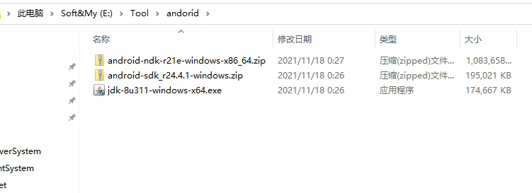

### 1,安装JDK

双击安装包，出现如下界面，点击下一步

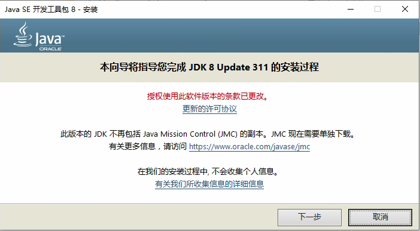

然后自己修改安装目录，一直下一步，直到安装完成为止.

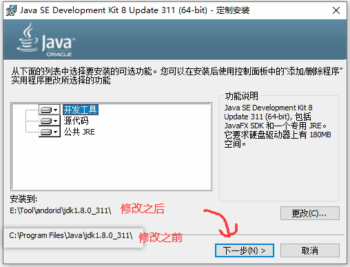

### 2,安装SDK

解压到指定目录即可

### 3,安装NDK

解压到指定目录即可

最终结果如下，接下来就进入Qt Creator配置了。。

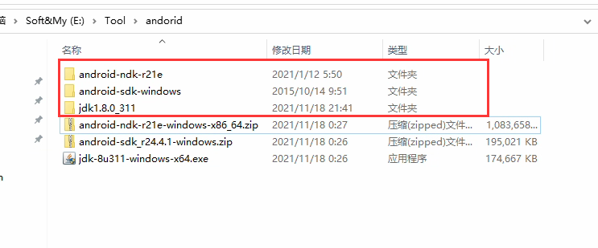


## 二、Qt Creator 配置

菜单栏->工具->选项->设备->android，把上面的三个工具包的路径添加到指定的位置

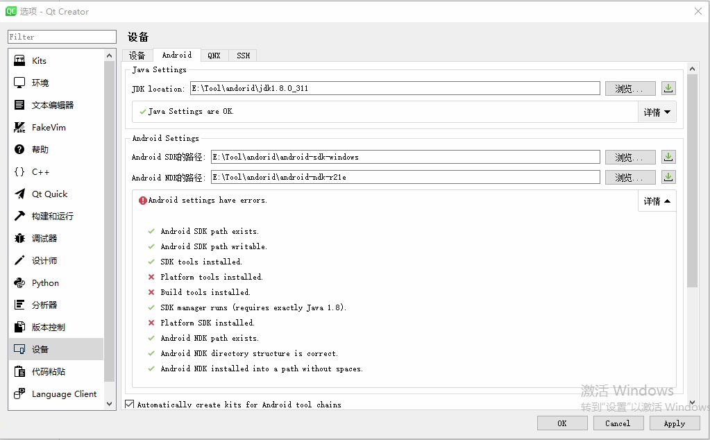

路径添加好之后，发现下面有几个红色的**叉叉**，这时就需要打开SDK Manager进行组件的安装了。

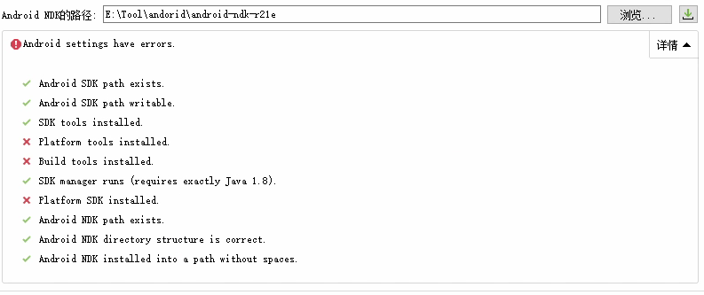

组件安装方法如下：

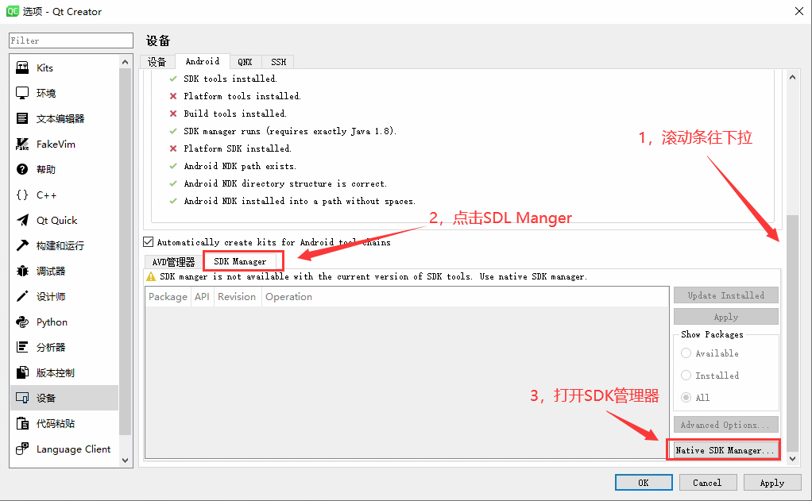

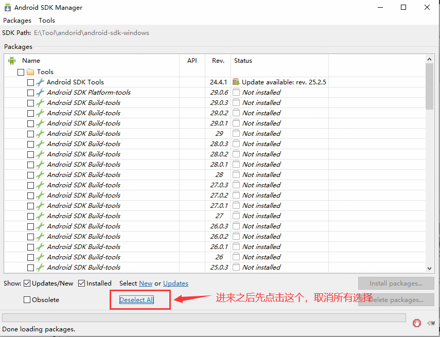

选择如下4个包

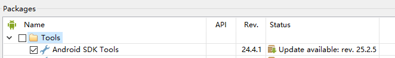

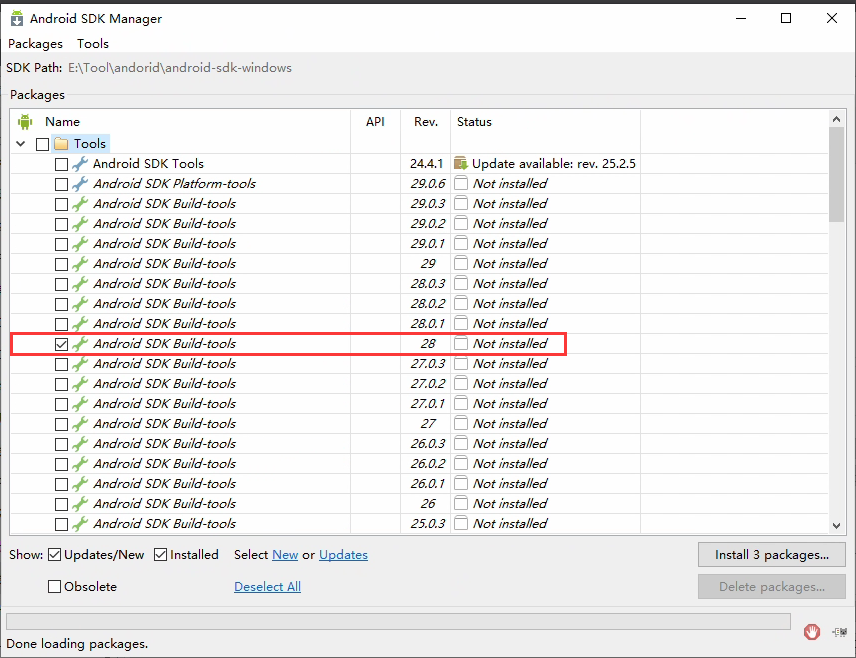

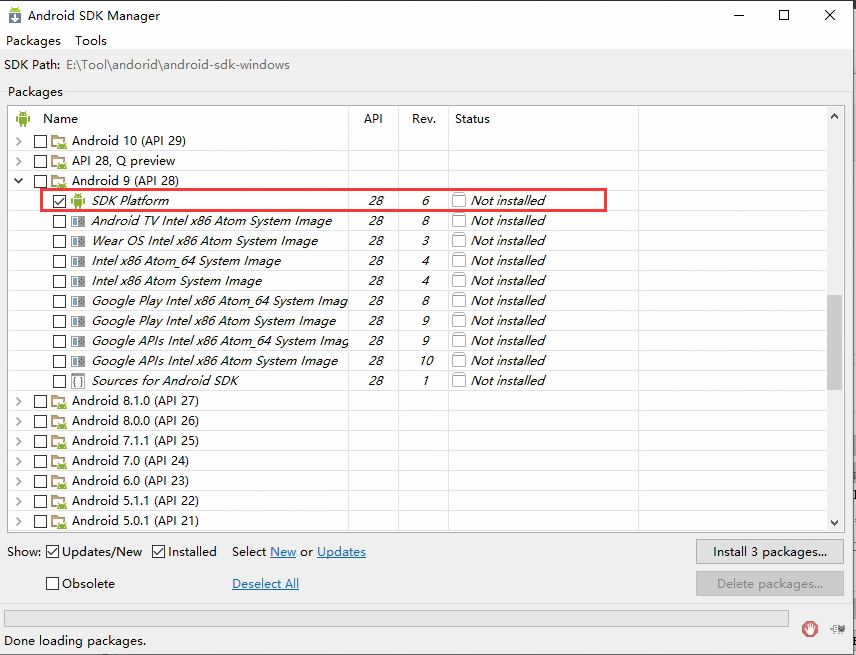

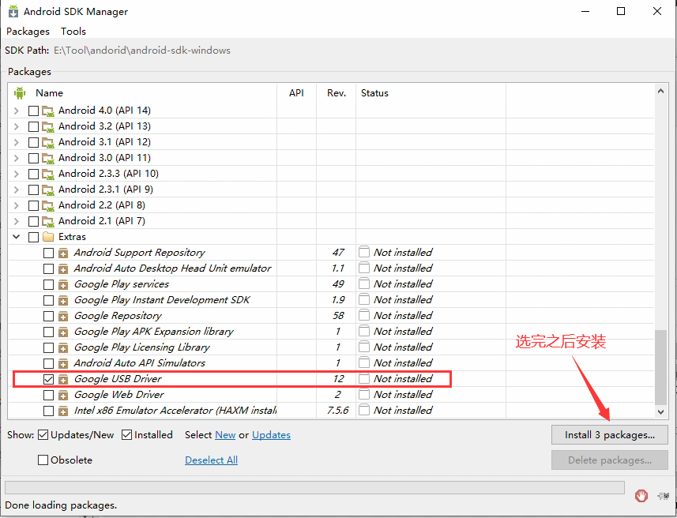

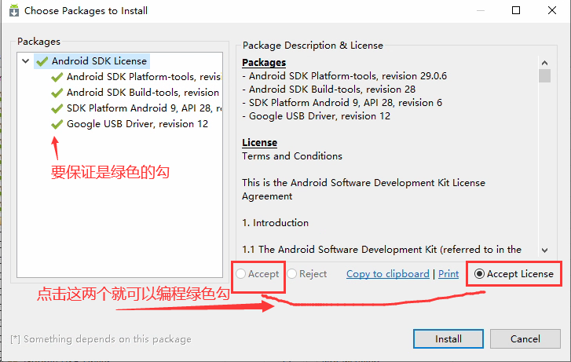

然后点击install，耐心等待一会儿即可.然后关闭下面的窗口，然后重新打开，就没有任何的问题了。

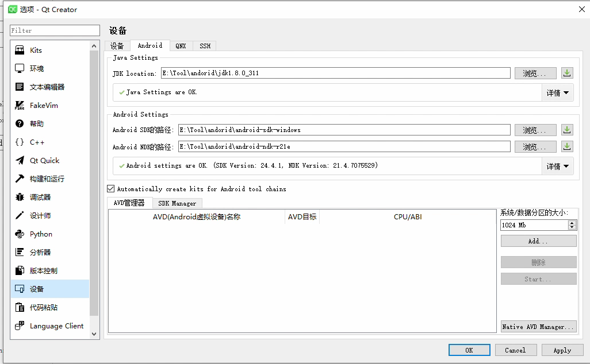

## 三、创建项目，生成apk

创建项目和平时一样，只需要在选择套件时，选择上android即可。

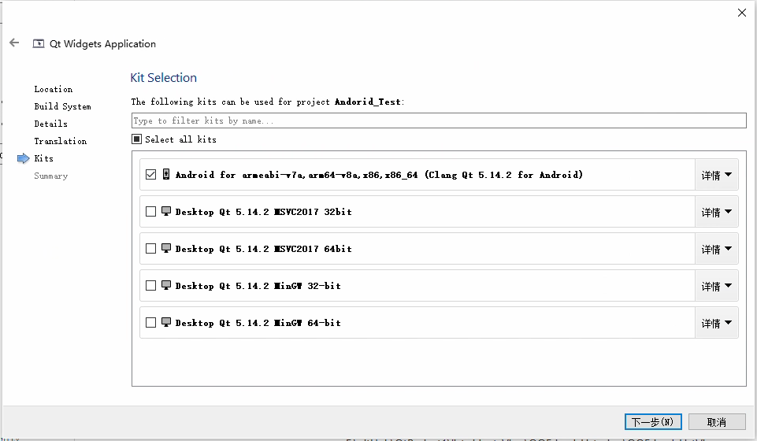

然后点击编译，不要点击运行哦~


## 四、遇到错误

哦豁，点击编译之后，从编译输出窗口可以看到有如下错误！

+ 翻译：未能安装以下Android SDK包，因为一些许可证没有被接受。  

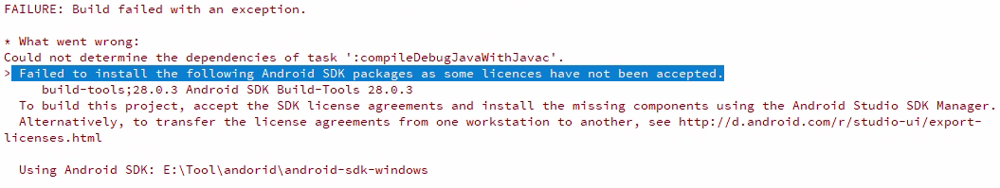

所以，只需要安装一下许可证即可，首先进入SDK/tools/bin目录，然后用命令行执行如下命令

```sh
sdkmanager.bat --update
sdkmanager.bat --licences
```

遇到这种，就选y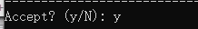

如果SDK目录中出现licenses目录即表示成功了~，重新编译程序即可

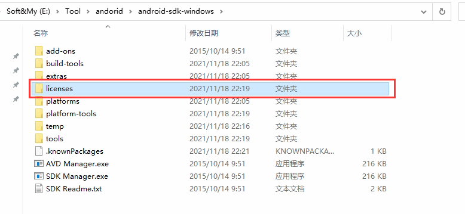

Ok，成功生成apk

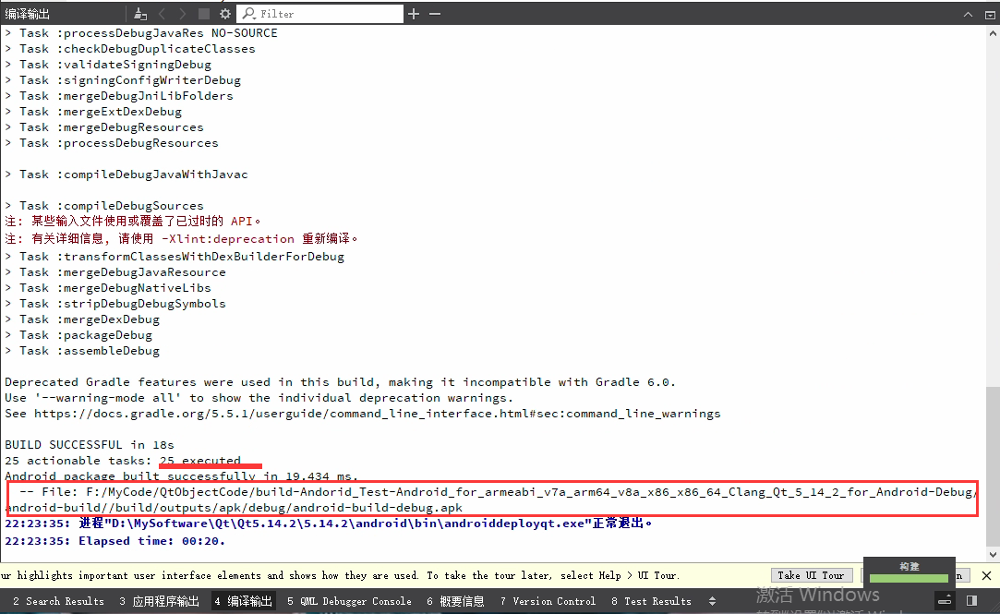


[QT 5.14.2实现ANDROID开发](https://www.freesion.com/article/27831209988/)

[Qt5.14.2开发Android环境搭建](https://blog.csdn.net/z1872385/article/details/119822615)

[win10 sdk manager打不开怎么办](http://www.xitongcheng.com/jiaocheng/win10_article_61918.html)

[QT For Android小米真机调试/PC模拟器debug](https://blog.csdn.net/Fei_Yang_YF/article/details/82530438)

[Qt5.14 For Android配置(Windows10)](https://blog.csdn.net/weixin_43698364/article/details/105187950)

