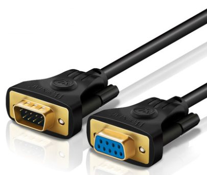
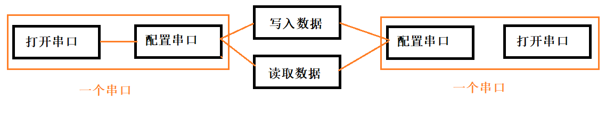

# RS-232串口通信

## 简介

串口通信是指外设和计算机间，通过数据信号线 、地线、控制线等，按位进行传输数据的一种通讯方式。这种通信方式使用的数据线少，在远距离通信中可以节约通信成本，但其传输速度比并行传输低。

串口的出现是在1980年前后，数据传输率是115kbps～230kbps。串口出现的初期是为了实现连接计算机外设的目的，初期串口一般用来连接鼠标和外置Modem以及老式摄像头和写字板等设备。串口也可以应用于两台计算机（或设备）之间的互联及数据传输。由于串口（COM）不支持热插拔及传输速率较低，部分新主板和大部分便携电脑已开始取消该接口。串口多用于工控和测量设备以及部分通信设备中。

> kbps（千比特每秒），又称千比特率，指的是数字信号的传输速率，也就是每秒钟传送多少个千位的信息（k表示千，kb表示的是多少千个位），也可以表示网络的传输速度。为了在直观上显得网络的传输速度较快，一般公司都使用kb（千位）来表示。

## Qt串口

### 概述

Qt提供了进行串口通信传输数据的功能类`QSerialPort `，在使用之前可以使用QSerialPortInfo帮助类获取有关可用串行端口的信息，该类允许枚举系统中的所有串行端口。这对于获取要使用的串行端口的正确名称非常有用。您可以将helper类的对象作为参数传递给setPort()或setPortName()方法，以分配所需的串行设备。

### 使用流程

使用流程非常简单，打开-配置-发送/接受数据即可！

#### 获取串口

打开串口其实就是在`QSerialPort `构造函数里传递一个 QSerialPortInfo 对象或者一开始声明一个空参数对象，然后用 setPort() 来绑定一个串口 。

#### 配置串口

串口通信最重要的参数是[波特率](https://baike.baidu.com/item/波特率?fromModule=lemma_inlink)、[数据位](https://baike.baidu.com/item/数据位?fromModule=lemma_inlink)、停止位和[奇偶校验](https://baike.baidu.com/item/奇偶校验?fromModule=lemma_inlink)。对于两个进行通信的端口，这些参数必须匹配。

##### 波特率

这是一个衡量符号传输速率的参数。指的是信号被调制以后在单位时间内的变化，即单位时间内[载波](https://baike.baidu.com/item/载波?fromModule=lemma_inlink)参数变化的次数。

RS-232-C标准规定的数据传输速率为50、75、100、150、300、600、1200、2400、4800、9600、19200、38400波特。常用为9600bps。

>  bool setBaudRate(qint32 baudRate, QSerialPort::Directions directions = AllDirections)

##### 数据位

这是衡量通信中实际[数据位](https://baike.baidu.com/item/数据位/3441892?fromModule=lemma_inlink)的参数。当计算机发送一个信息包，实际的数据往往不会是8位的，标准的值是6、7和8位。如何设置取决于你想传送的信息。比如，标准的ASCII码是0～127（7位）。扩展的ASCII码是0～255（8位）。如果数据使用简单的文本（标准 ASCII码），那么每个[数据包](https://baike.baidu.com/item/数据包?fromModule=lemma_inlink)使用7位数据。每个包是指一个[字节](https://baike.baidu.com/item/字节?fromModule=lemma_inlink)，包括开始/停止位，数据位和[奇偶校验位](https://baike.baidu.com/item/奇偶校验位?fromModule=lemma_inlink)。由于实际数据位取决于[通信协议](https://baike.baidu.com/item/通信协议?fromModule=lemma_inlink)的选取，术语“包”指任何通信的情况。

> bool setDataBits(QSerialPort::DataBits dataBits)

##### 停止位

用于表示单个包的最后一位。典型的值为1，1.5和2位。由于数据是在传输线上定时的，并且每一个设备有其自己的时钟，很可能在通信中两台[设备间](https://baike.baidu.com/item/设备间?fromModule=lemma_inlink)出现了小小的不同步。因此停止位不仅仅是表示传输的结束，并且提供计算机校正[时钟同步](https://baike.baidu.com/item/时钟同步?fromModule=lemma_inlink)的机会。适用于停止位的位数越多，不同时钟同步的容忍程度越大，但是[数据传输率](https://baike.baidu.com/item/数据传输率/603683?fromModule=lemma_inlink)同时也越慢。

> bool setStopBits(QSerialPort::StopBits stopBits)

##### 奇偶校验位

在[串口](https://baike.baidu.com/item/串口?fromModule=lemma_inlink)通信中一种简单的检错方式。有四种检错方式：偶、奇、高和低。当然没有校验位也是可以的。对于偶和[奇校验](https://baike.baidu.com/item/奇校验?fromModule=lemma_inlink)的情况，串口会设置校验位（[数据位](https://baike.baidu.com/item/数据位?fromModule=lemma_inlink)后面的一位），用一个值确保传输的数据有偶个或者奇个逻辑高位。例如，如果数据是011，那么对于[偶校验](https://baike.baidu.com/item/偶校验?fromModule=lemma_inlink)，校验位为0，保证逻辑高的位数是偶数个。如果是奇校验，校验位为1，这样就有3个逻辑高位。高位和低位不真正的检查数据，简单置位逻辑高或者逻辑低校验。这样使得接收设备能够知道一个位的状态，有机会判断是否有噪声干扰了通信或者是否传输和接收数据是否不同步。

> bool setParity(QSerialPort::Parity parity)

#### 打开串口

串口配置好之后，使用`bool QSerialPort::open(QIODeviceBase::OpenMode mode)`打开串口，open使用指定的OpenMode模式打开串口，如果成功则返回true;否则返回false并设置一个可以通过调用error()方法获得的错误代码。

使用完毕之后，可以使用`void QSerialPort::close()`关闭串口。

#### 读写数据

成功打开后，可以通过` bool isDataTerminalReady()`判断数据终端是否就绪，如果是true就可以开始发送数据了！

接受数据分为阻塞和非阻塞式：

**阻塞式：**

**非阻塞：**

https://blog.csdn.net/zzssdd2/category_10730183.html

# 蓝牙串口通信