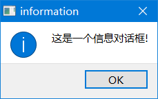
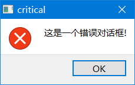
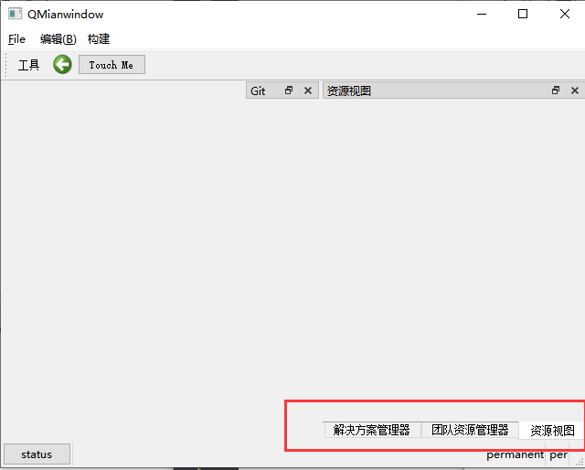
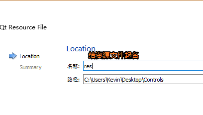

# 1. QWidget

> QWidget类是所有窗口类的父类(控件类是也属于窗口类), 并且QWidget类的父类的QObject, 也就意味着所有的窗口类对象只要指定了父对象, 都可以实现内存资源的自动回收。这里给大家介绍一下关于这个类常用的一些API函数。


```c++
// 构造函数
QWidget::QWidget(QWidget *parent = nullptr, Qt::WindowFlags f = Qt::WindowFlags());

// 公共成员函数
// 给当前窗口设置父对象
void QWidget::setParent(QWidget *parent);
void QWidget::setParent(QWidget *parent, Qt::WindowFlags f);
// 获取当前窗口的父对象, 没有父对象返回 nullptr
QWidget *QWidget::parentWidget() const;

//------------- 窗口位置 -------------
// 得到相对于当前窗口父窗口的几何信息, 边框也被计算在内
QRect QWidget::frameGeometry() const;
// 得到相对于当前窗口父窗口的几何信息, 不包括边框
const QRect &geometry() const;
// 设置当前窗口的几何信息(位置和尺寸信息), 不包括边框
void setGeometry(int x, int y, int w, int h);
void setGeometry(const QRect &);
    
// 移动窗口, 重新设置窗口的位置
void move(int x, int y);
void move(const QPoint &);

//------------- 窗口尺寸 -------------
// 获取当前窗口的尺寸信息
QSize size() const
// 重新设置窗口的尺寸信息
void resize(int w, int h);
void resize(const QSize &);
// 获取当前窗口的最大尺寸信息
QSize maximumSize() const;
// 获取当前窗口的最小尺寸信息
QSize minimumSize() const;
// 设置当前窗口固定的尺寸信息
void QWidget::setFixedSize(const QSize &s);
void QWidget::setFixedSize(int w, int h);
// 设置当前窗口的最大尺寸信息
void setMaximumSize(const QSize &);
void setMaximumSize(int maxw, int maxh);
// 设置当前窗口的最小尺寸信息
void setMinimumSize(const QSize &);
void setMinimumSize(int minw, int minh);


// 获取当前窗口的高度    
int height() const;
// 获取当前窗口的最小高度
int minimumHeight() const;
// 获取当前窗口的最大高度
int maximumHeight() const;
// 给窗口设置固定的高度
void QWidget::setFixedHeight(int h);
// 给窗口设置最大高度
void setMaximumHeight(int maxh);
// 给窗口设置最小高度
void setMinimumHeight(int minh);

// 获取当前窗口的宽度
int width() const;
// 获取当前窗口的最小宽度
int minimumWidth() const;
// 获取当前窗口的最大宽度
int maximumWidth() const;
// 给窗口设置固定宽度
void QWidget::setFixedWidth(int w);
// 给窗口设置最大宽度
void setMaximumWidth(int maxw);
// 给窗口设置最小宽度
void setMinimumWidth(int minw);

//------------- 窗口图标 -------------
// 得到当前窗口的图标
QIcon windowIcon() const;
// 构造图标对象, 参数为图片的路径
QIcon::QIcon(const QString &fileName);
// 设置当前窗口的图标
void setWindowIcon(const QIcon &icon);

//------------- 窗口标题 -------------
// 得到当前窗口的标题
QString windowTitle() const;
// 设置当前窗口的标题
void setWindowTitle(const QString &);

// 判断窗口是否可用
bool isEnabled() const;
// 设置窗口是否可用, 不可用窗口无法接收和处理窗口事件
void setEnabled(bool);

//------------- 窗口显示 -------------
// 关闭当前窗口
[slot] bool QWidget::close();
// 隐藏当前窗口
[slot] void QWidget::hide();
// 显示当前创建以及其子窗口
[slot] void QWidget::show();
// 全屏显示当前窗口, 只对windows有效
[slot] void QWidget::showFullScreen();
// 窗口最大化显示, 只对windows有效
[slot] void QWidget::showMaximized();
// 窗口最小化显示, 只对windows有效
[slot] void QWidget::showMinimized();
// 将窗口回复为最大化/最小化之前的状态, 只对windows有效
[slot] void QWidget::showNormal();


//------------- 信号 -------------
// QWidget::setContextMenuPolicy(Qt::ContextMenuPolicy policy);
// 窗口的右键菜单策略 contextMenuPolicy() 参数设置为 Qt::CustomContextMenu, 按下鼠标右键发射该信号
[signal] void QWidget::customContextMenuRequested(const QPoint &pos);
// 窗口图标发生变化, 发射此信号
[signal] void QWidget::windowIconChanged(const QIcon &icon);
// 窗口标题发生变化, 发射此信号
[signal] void QWidget::windowTitleChanged(const QString &title);
```


# 2. QDialog

> 对话框类是QWidget类的子类, 处理继承自父类的属性之外, 还有一些自己所特有的属性, 常用的一些API函数如下:

```c++
// 构造函数
QDialog::QDialog(QWidget *parent = nullptr, Qt::WindowFlags f = Qt::WindowFlags());

// 模态显示窗口
[virtual slot] int QDialog::exec();
// 隐藏模态窗口, 并且解除模态窗口的阻塞, 将 exec() 的返回值设置为 QDialog::Accepted
[virtual slot] void QDialog::accept();
// 隐藏模态窗口, 并且解除模态窗口的阻塞, 将 exec() 的返回值设置为 QDialog::Rejected
[virtual slot] void QDialog::reject();
// 关闭对话框并将其结果代码设置为r。finished()信号将发出r;
// 如果r是QDialog::Accepted 或 QDialog::Rejected，则还将分别发出accept()或Rejected()信号。
[virtual slot] void QDialog::done(int r);

[signal] void QDialog::accepted();
[signal] void QDialog::rejected();
[signal] void QDialog::finished(int result);
```


## 2.1 QMessageBox

> QMessageBox 对话框类是 QDialog 类的子类, 通过这个类可以显示一些简单的提示框, 用于展示警告、错误、问题等信息。关于这个类我们只需要掌握一些静态方法的使用就可以了。

```c++
// 显示一个模态对话框, 将参数 text 的信息展示到窗口中
[static] void QMessageBox::about(QWidget *parent, const QString &title, const QString &text);

/*
参数:
- parent: 对话框窗口的父窗口
- title: 对话框窗口的标题
- text: 对话框窗口中显示的提示信息
- buttons: 对话框窗口中显示的按钮(一个或多个)
- defaultButton
    1. defaultButton指定按下Enter键时使用的按钮。
    2. defaultButton必须引用在参数 buttons 中给定的按钮。
    3. 如果defaultButton是QMessageBox::NoButton, QMessageBox会自动选择一个合适的默认值。
*/
// 显示一个信息模态对话框
[static] QMessageBox::StandardButton QMessageBox::information(QWidget *parent, const QString &title, const QString &text, QMessageBox::StandardButtons buttons = Ok, QMessageBox::StandardButton defaultButton = NoButton);

// 显示一个错误模态对话框
[static] QMessageBox::StandardButton QMessageBox::critical(QWidget *parent, const QString &title, const QString &text, QMessageBox::StandardButtons buttons = Ok, QMessageBox::StandardButton defaultButton = NoButton);

// 显示一个问题模态对话框
[static] QMessageBox::StandardButton QMessageBox::question(QWidget *parent, const QString &title, const QString &text, QMessageBox::StandardButtons buttons = StandardButtons(Yes | No), QMessageBox::StandardButton defaultButton = NoButton);

// 显示一个警告模态对话框
[static] QMessageBox::StandardButton QMessageBox::warning(QWidget *parent, const QString &title, const QString &text, QMessageBox::StandardButtons buttons = Ok, QMessageBox::StandardButton defaultButton = NoButton);
```

​                                       

​                                       

## 2.2 QFileDialog

> QFileDialog 对话框类是 QDialog 类的子类, 通过这个类可以选择要打开/保存的文件或者目录。关于这个类我们只需要掌握一些静态方法的使用就可以了。

```c++
/*
通用参数:
	- parent: 当前对话框窗口的父对象也就是父窗口
	- caption: 当前对话框窗口的标题
	- dir: 当前对话框窗口打开的默认目录
	- options: 当前对话框窗口的一些可选项,枚举类型, 一般不需要进行设置, 使用默认值即可
	- filter: 过滤器, 在对话框中只显示满足条件的文件, 可以指定多个过滤器, 使用 ;; 分隔
		- 样式举例: 
			- Images (*.png *.jpg)
			- Images (*.png *.jpg);;Text files (*.txt)
	- selectedFilter: 如果指定了多个过滤器, 通过该参数指定默认使用哪一个, 不指定默认使用第一个过滤器
*/
// 打开一个目录, 得到这个目录的绝对路径
[static] QString QFileDialog::getExistingDirectory(QWidget *parent = nullptr, const QString &caption = QString(), const QString &dir = QString(), QFileDialog::Options options = ShowDirsOnly);

// 打开一个文件, 得到这个文件的绝对路径
[static] QString QFileDialog::getOpenFileName(QWidget *parent = nullptr, const QString &caption = QString(), const QString &dir = QString(), const QString &filter = QString(), QString *selectedFilter = nullptr, QFileDialog::Options options = Options());

// 打开多个文件, 得到这多个文件的绝对路径
[static] QStringList QFileDialog::getOpenFileNames(QWidget *parent = nullptr, const QString &caption = QString(), const QString &dir = QString(), const QString &filter = QString(), QString *selectedFilter = nullptr, QFileDialog::Options options = Options());

// 打开一个目录, 使用这个目录来保存指定的文件
[static] QString QFileDialog::getSaveFileName(QWidget *parent = nullptr, const QString &caption = QString(), const QString &dir = QString(), const QString &filter = QString(), QString *selectedFilter = nullptr, QFileDialog::Options options = Options());
```


## 2.3 QFontDialog

- QFont 字体类

  ```c++
  QFont::QFont();
  /*
  参数:
  	- family: 本地字库中的字体名, 通过 office 等文件软件可以查看
  	- pointSize: 字体的字号
  	- weight: 字体的粗细, 有效范围为 0 ~ 99
  	- italic: 字体是否倾斜显示, 默认不倾斜
  */
  QFont::QFont(const QString &family, int pointSize = -1, int weight = -1, bool italic = false);
  
  // 设置字体
  void QFont::setFamily(const QString &family);
  // 根据字号设置字体大小
  void QFont::setPointSize(int pointSize);
  // 根据像素设置字体大小
  void QFont::setPixelSize(int pixelSize);
  // 设置字体的粗细程度, 有效范围: 0 ~ 99
  void QFont::setWeight(int weight);
  // 设置字体是否加粗显示
  void QFont::setBold(bool enable);
  // 设置字体是否要倾斜显示
  void QFont::setItalic(bool enable);
  
  // 获取字体相关属性(一般规律: 去掉设置函数的 set 就是获取相关属性对应的函数名)
  QString QFont::family() const;
  bool QFont::italic() const;
  int QFont::pixelSize() const;
  int QFont::pointSize() const;
  bool QFont::bold() const;
  int QFont::weight() const;
  ```

  

  

- QFontDialog类的静态API

  ```c++
  [static] QFont QFontDialog::getFont(bool *ok, const QFont &initial, QWidget *parent = nullptr, const QString &title = QString(), QFontDialog::FontDialogOptions options = FontDialogOptions());
  
  [static] QFont QFontDialog::getFont(bool *ok, QWidget *parent = nullptr);
  ```

- 窗口字体的设置

  ```c++
  // QWidget 类
  // 得到当前窗口使用的字体
  const QWidget::QFont& font() const;
  // 给当前窗口设置字体, 只对当前窗口类生效
  void QWidget::setFont(const QFont &);
  
  // QApplication 类
  // 得到当前应用程序对象使用的字体
  [static] QFont QApplication::font();
  // 给当前应用程序对象设置字体, 作用于当前应用程序的所有窗口
  [static] void QApplication::setFont(const QFont &font, const char *className = nullptr);
  ```

  

## 2.4 QColorDialog

- 颜色类 QColor

  ```c++
  // 构造函数
  QColor::QColor(Qt::GlobalColor color);
  QColor::QColor(int r, int g, int b, int a = ...);
  QColor::QColor();
  
  // 参数 red, green, blue, alpha 取值范围是 0-255
  void QColor::setRed(int red);
  void QColor::setGreen(int green);
  void QColor::setBlue(int blue);
  void QColor::setAlpha(int alpha);
  void QColor::setRgb(int r, int g, int b, int a = 255);
  
  int QColor::red() const;
  int QColor::green() const;
  int QColor::blue() const;
  int QColor::alpha() const;
  void QColor::getRgb(int *r, int *g, int *b, int *a = nullptr) const;
  ```

- QFontDialog类的静态API

  ```c++
  // 弹出颜色选择对话框, 并返回选中的颜色信息
  [static] QColor QColorDialog::getColor(const QColor &initial = Qt::white, QWidget *parent = nullptr, const QString &title = QString(), QColorDialog::ColorDialogOptions options = ColorDialogOptions());
  ```

  

## 2.5 QInputDialog

```c++
[static] double QInputDialog::getDouble(QWidget *parent, const QString &title, const QString &label, double value = 0, double min = -2147483647, double max = 2147483647, int decimals = 1, bool *ok = nullptr, Qt::WindowFlags flags = Qt::WindowFlags());

[static] int QInputDialog::getInt(QWidget *parent, const QString &title, const QString &label, int value = 0, int min = -2147483647, int max = 2147483647, int step = 1, bool *ok = nullptr, Qt::WindowFlags flags = Qt::WindowFlags());

[static] QString QInputDialog::getItem(QWidget *parent, const QString &title, const QString &label, const QStringList &items, int current = 0, bool editable = true, bool *ok = nullptr, Qt::WindowFlags flags = Qt::WindowFlags(), Qt::InputMethodHints inputMethodHints = Qt::ImhNone)
    
[static] QString QInputDialog::getMultiLineText(QWidget *parent, const QString &title, const QString &label, const QString &text = QString(), bool *ok = nullptr, Qt::WindowFlags flags = Qt::WindowFlags(), Qt::InputMethodHints inputMethodHints = Qt::ImhNone);


[static] QString QInputDialog::getText(QWidget *parent, const QString &title, const QString &label, QLineEdit::EchoMode mode = QLineEdit::Normal, const QString &text = QString(), bool *ok = nullptr, Qt::WindowFlags flags = Qt::WindowFlags(), Qt::InputMethodHints inputMethodHints = Qt::ImhNone);
```


## 2.6 QProgressDialog


```c++
// 构造函数
/*
参数:
	- labelText: 对话框中显示的提示信息
	- cancelButtonText: 取消按钮上显示的文本信息
	- minimum: 进度条最小值
	- maximum: 进度条最大值
	- parent: 当前窗口的父对象
	- f: 当前进度窗口的flag属性, 使用默认属性即可, 无需设置
*/
QProgressDialog::QProgressDialog(QWidget *parent = nullptr, Qt::WindowFlags f = Qt::WindowFlags());
QProgressDialog::QProgressDialog(const QString &labelText, const QString &cancelButtonText, int minimum, int maximum, QWidget *parent = nullptr, Qt::WindowFlags f = Qt::WindowFlags());


// 设置取消按钮显示的文本信息
[slot] void QProgressDialog::setCancelButtonText(const QString &cancelButtonText);

// 公共成员函数和槽函数
QString QProgressDialog::labelText() const;
void QProgressDialog::setLabelText(const QString &text);

// 得到进度条最小值
int QProgressDialog::minimum() const;
// 设置进度条最小值
void QProgressDialog::setMinimum(int minimum);

// 得到进度条最大值
int QProgressDialog::maximum() const;
// 设置进度条最大值
void QProgressDialog::setMaximum(int maximum);

// 设置进度条范围(最大和最小值)
[slot] void QProgressDialog::setRange(int minimum, int maximum);

// 得到进度条当前的值
int QProgressDialog::value() const;
// 设置进度条当前的值
void QProgressDialog::setValue(int progress);


bool QProgressDialog::autoReset() const;
// 当value() = maximum()时，进程对话框是否调用reset()，此属性默认为true。
void QProgressDialog::setAutoReset(bool reset);


bool QProgressDialog::autoClose() const;
// 当value() = maximum()时，进程对话框是否调用reset()并且隐藏，此属性默认为true。
void QProgressDialog::setAutoClose(bool close);

// 判断用户是否按下了取消键, 按下了返回true, 否则返回false
bool wasCanceled() const;


// 重置进度条
// 重置进度对话框。wascancelled()变为true，直到进程对话框被重置。进度对话框被隐藏。
[slot] void QProgressDialog::cancel();
// 重置进度对话框。如果autoClose()为真，进程对话框将隐藏。
[slot] void QProgressDialog::reset();   

// 信号
// 当单击cancel按钮时，将发出此信号。默认情况下，它连接到cancel()槽。
[signal] void QProgressDialog::canceled();

// 设置窗口的显示状态(模态, 非模态)
/*
参数:
	Qt::NonModal  -> 非模态
	Qt::WindowModal	-> 模态, 阻塞父窗口
	Qt::ApplicationModal -> 模态, 阻塞应用程序中的所有窗口
*/
void QWidget::setWindowModality(Qt::WindowModality windowModality);
```


# 3. QMainWindow

> 默认结构最复杂的标准窗口
>
> - 提供了`菜单栏`, `工具栏`, `状态栏`, `停靠窗口`
> - 菜单栏: 只能有一个, 创建的最上方
> - 工具栏: 可以有多个, 默认提供了一个, 窗口的上下左右都可以停靠
> - 状态栏: 只能有一个, 窗口最下方
> - 停靠窗口: 可以有多个, 默认没有提供, 窗口的上下左右都可以停靠


## 3.1 菜单栏

### 创建MenuBar

+ 获取QMainWindow提供的菜单栏

```cpp
QMenuBar* menubar = menuBar();
```

+ 自己new一个，然后设置给窗口

```cpp
QMenuBar* menubar = new QMenuBar;
this->setMenuBar(menubar);
```

### 添加Menu

```cpp
QMenu* m = new QMenu("文件");
m->addAction("new");
m->addAction("open");
//添加已有菜单，返回菜单关联的动作
QAction* act = menubar->addMenu(m);
//通过标题添加菜单
QMenu *editMenu = menubar->addMenu("编辑");
//通过图标和标题添加菜单
QMenu *buildMenu = menubar->addMenu(QIcon(":/images/mm.png"),"构建");
```

### 添加Action

```cpp
editMenu->addAction("undo");
editMenu->addAction(style()->standardIcon
                    (QStyle::StandardPixmap::SP_FileIcon),"redo");
editMenu->addAction("remove",this,[](){qDebug()<<"remove";});
editMenu->addAction("剪切",[](){qDebug()<<"剪切";},QKeySequence("ctrl+x"));
```

### 给菜单添加快捷键

```cpp
menubar->addMenu("编辑(&B)");
menubar->addMenu("&File");
```


> 单击菜单项, 该对象会发出一个信号

```c++
// 点击QAction对象发出该信号
[signal] void QAction::triggered(bool checked = false);
```

## 3.2 工具栏

### 创建工具栏

```cpp
QToolBar *toolbar =  addToolBar("toolbar");
```

### 添加Aciton

```cpp
//没有图标就显示文字 (如下图)
toolbar->addAction("工具");
//有图标就显示图标，文字作为提示(鼠标移上去会显示)
toolbar->addAction(style()->standardIcon
                    (QStyle::StandardPixmap::SP_ArrowBack),"1213123");
```


### 添加Widget

```cpp
//只要是QWidget或者启子类都可以被添加
toolbar->addWidget(new QPushButton("Touch Me"));
```


## 3.3 状态栏

> 一般情况下, 需要在状态栏中添加某些控件, 显示某些属性, 使用最多的就是添加标签 QLabel

### 创建状态栏

+ 获取自带的状态栏

```cpp
QStatusBar* statusbar = statusBar();
```

+ new一个

```cpp
QStatusBar* statusbar = new QStatusBar;
this->setStatusBar(statusbar);
```

### 添加Widget

```cpp
//左边
statusbar->addWidget(new QLabel("hello"));
statusbar->addWidget(new QPushButton("status"));
//右边(Permanent永久的)
statusbar->addPermanentWidget(new QLabel("permanent"));
statusbar->addPermanentWidget(new QLabel("per"));
```


## 3.4 浮动窗口(停靠窗口)

> 默认没有, 需要手动添加

### 添加浮动窗口

```cpp
QDockWidget* gitDock = new QDockWidget("Git");
QDockWidget* solveDock = new QDockWidget("解决方案管理器");
QDockWidget* teamDock = new QDockWidget("团队资源管理器");
QDockWidget* resourceDock = new QDockWidget("资源视图");

addDockWidget(Qt::DockWidgetArea::RightDockWidgetArea, gitDock);
addDockWidget(Qt::DockWidgetArea::RightDockWidgetArea,solveDock);
addDockWidget(Qt::DockWidgetArea::RightDockWidgetArea,teamDock);
addDockWidget(Qt::DockWidgetArea::RightDockWidgetArea,resourceDock);
```


### 分割浮动窗口

+ 将第一个停靠小部件所覆盖的空间分成两部分，将第一个停靠小部件移动到第一部分，并将第二个停靠小部件移动到第二部分。  

```cpp
splitDockWidget(gitDock,solveDock,Qt::Orientation::Horizontal);
```


### 选项卡式停靠

+ 将第二个停靠小部件移动到第一个停靠小部件之上，在主窗口中创建一个选项卡式停靠区域。  

```cpp
tabifyDockWidget(solveDock,teamDock);
tabifyDockWidget(teamDock,resourceDock);
```



# 4. 资源文件 .qrc

> 需要我们给窗口设置图标

```c++
// 创建图标对象
QIcon::QIcon(const QString &fileName)
// QWidget类的 公共成员函数
void setWindowIcon(const QIcon &icon)

// 给窗口设置图标
// 弊端: 发布的exe 必须要加载 d:\\pic\\1.ico 如果对应的目录中么有图片, 图标就无法被加载
//			发布exe 需要额外发布图片, 将其部署到某个目录中
setWindowIcon(QIcon("d:\\pic\\1.ico"));
```

使用资源文件解决上述的弊端:

> 优势: 
>
> 1. 将图片资源放到资源文件
> 2. 当程序编译的时候, 资源文件中的图片会被转换为二进制, 打包到exe中
> 3. 直接发布exe就可以, 不需要额外提供图片资源了

资源文件的创建





- 资源文件的使用

  - 打开资源文件

  

  - 添加前缀

  

  - 添加文件

    

    - 弹出以文件选择对话框, 选择资源文件

      - 资源文件放到什么地方?
        - 放到和 项目文件  .pro 同一级目录或者更深的目录中
        - `错误的做法: 将资源文件放到 .pro文件的上级目录, 这样资源文件无法被加载到`

    - 资源文件中添加的图片资源

      

  - 如何在程序中使用资源文件中的图片

    

  

# 5，菜单

## 5.1 右键菜单

在桌面右击鼠标会出现菜单，这个我们一般叫做右键菜单，那么在Qt中我们如何使用右键菜单呢？

首先需要给控件设置上下文菜单策略 setContextMenuPolicy(Qt::CustomContextMenu) ；设置该策略后当我们右键点击控件时qt会发送一个信号 customContextMenuRequested(const QPoint &pos) ，其中参数pos用来传递右键点击时的鼠标的坐标，这个坐标一般是相对于控件左上角而言的；最后给这个信号设置相应的槽函数，在槽函数中将菜单展示出来就行了。

+ 设置上下文菜单策略

```css
setContextMenuPolicy(Qt::ContextMenuPolicy::CustomContextMenu);
```

+ 连接上下文菜单触发的信号

```cpp
connect(btn,&QPushButton::customContextMenuRequested,this,[=](const QPoint&pos)
{
    //在指定位置弹出菜单
    //contextMenu->exec(btn->mapToParent(this->mapToParent(pos)));
    contextMenu->exec(QCursor::pos());
});
```

+ 创建的菜单

```cpp
QMenu contextMenu = new QMenu;
QAction* copyAct = contextMenu->addAction("复制");
QAction* pasteAct= contextMenu->addAction("粘贴");
```


## 5.2 托盘菜单

系统托盘就是在系统桌面底部特定的区域显示运行的程序。windows在任务栏状态区域，linux在布告栏区域。应用程序系统托盘功能，是比较普遍的功能。

 演示Demo实现功能：

1.应用启动后，任务栏，系统托盘可以看到该程序。

2.点击右上角×关闭窗口，自动隐藏窗口，托盘可以看到该程序。

3.鼠标在托盘图标上右键，弹出"退出程序"菜单栏，并带有图标。

+ 创建系统托盘菜单图标

```cpp
//必须通过构造函数或者setIcon函数设置图标，否则在托盘看不到
QSystemTrayIcon *trayIcon = new QSystemTrayIcon(QIcon(":/trayIcon.png"),this);
//trayIcon->setContextMenu(contextMenu);
trayIcon->show();
```

+ 设置菜单

```cpp
QMenu* menu = new QMenu;
QAction*openMainWindow = menu->addAction("打开主窗口");
menu->addSeparator();
QAction*quit = menu->addAction("退出程序");

trayIcon->setContextMenu(menu);
```

+ 处理菜单消息

```cpp
connect(openMainWindow,&QAction::triggered,this,&QWidget::showNormal);
connect(quit,&QAction::triggered,this,&QApplication::quit);
//隐藏窗口，任务栏也看不到图标，只能在托盘菜单看到
//connect(quit,&QAction::triggered,this,&Widget::hide);
```

+ 根据托盘菜单激活原因进行处理

```CPP
connect(trayIcon,&QSystemTrayIcon::activated,this,&Widget::onActivated);

void Widget::onActivated(QSystemTrayIcon::ActivationReason)
{
    switch (reason)
    {
    case QSystemTrayIcon::Unknown:      //未知原因
        qDebug()<<"Unknown";
        break;
    case QSystemTrayIcon::Context:      //右键请求菜单
        qDebug()<<"Context";
        break;
    case QSystemTrayIcon::DoubleClick:  //系统托盘被双击
        this->showNormal();    
        qDebug()<<"DoubleClick";
        break;
    case QSystemTrayIcon::Trigger:      //系统托盘被点击
        bubbleMessage();
        qDebug()<<"Trigger";
        break;
    case QSystemTrayIcon::MiddleClick:  //系统托盘被鼠标中键点击
        qDebug()<<"MiddleClick";
        break;
    }
}
```

+ 其他

```cpp
//设置工具提示
trayIcon->setToolTip("maye的小托盘");
//右下角气泡消息
void Widget::bubbleMessage()
{
    //如果支持气泡消息
    if(QSystemTrayIcon::supportsMessages())
    {
        qDebug()<<"bubb";
        trayIcon->showMessage("bubbleMessage","I'm Maye,What's your name?");
    }
    //气泡消息被点击的处理
    connect(trayIcon,&QSystemTrayIcon::messageClicked,this,[]()
    {
        qDebug()<<"气泡消息被点击啦~";
    });
}
```

