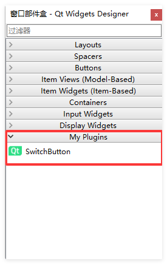

# 为 Qt Designer 创建设计时插件

这种方式主要用于将自定义控件集成到Qt Designer的可视化控件面板中，开发者可以直接拖拽使用，并像原生控件一样调整属性。

## 核心步骤

### 继承插件接口

新建一个以 `设计师库` 为模板的Qt项目，或者自己手动创建插件接口。

**SwitchButtonPlugin.h**

```cpp
#pragma once

#include <QtUiPlugin/QDesignerCustomWidgetInterface>

class SwitchButtonPlugin : public QObject, public QDesignerCustomWidgetInterface
{
    Q_OBJECT
    Q_PLUGIN_METADATA(IID "org.qt-project.Qt.QDesignerCustomWidgetInterface" FILE "switchbuttonplugin.json")
    Q_INTERFACES(QDesignerCustomWidgetInterface)

public:
    SwitchButtonPlugin(QObject *parent = nullptr);

    bool isContainer() const override;
    bool isInitialized() const override;
    QIcon icon() const override;
    QString domXml() const override;
    QString group() const override;
    QString includeFile() const override;
    QString name() const override;
    QString toolTip() const override;
    QString whatsThis() const override;
    QWidget *createWidget(QWidget *parent) override;
    void initialize(QDesignerFormEditorInterface *core) override;

private:
    bool initialized;
};
```

**SwitchButtonPlugin.cpp**

```cpp
#include "SwitchButton.h"
#include "SwitchButtonPlugin.h"

#include <QtCore/QtPlugin>

SwitchButtonPlugin::SwitchButtonPlugin(QObject *parent)
    : QObject(parent)
{
    initialized = false;
}

void SwitchButtonPlugin::initialize(QDesignerFormEditorInterface * /*core*/)
{
    if (initialized)
        return;

    initialized = true;
}

bool SwitchButtonPlugin::isInitialized() const
{
    return initialized;
}

QWidget *SwitchButtonPlugin::createWidget(QWidget *parent)
{
    return new SwitchButton(parent);
}

QString SwitchButtonPlugin::name() const
{
    return "SwitchButton";
}

QString SwitchButtonPlugin::group() const
{
    return "My Plugins";
}

QIcon SwitchButtonPlugin::icon() const
{
    return QIcon();
}

QString SwitchButtonPlugin::toolTip() const
{
    return QString();
}

QString SwitchButtonPlugin::whatsThis() const
{
    return QString();
}

bool SwitchButtonPlugin::isContainer() const
{
    return false;
}

QString SwitchButtonPlugin::domXml() const
{
    return "<widget class=\"SwitchButton\" name=\"SwitchButton\">\n"
        " <property name=\"geometry\">\n"
        "  <rect>\n"
        "   <x>0</x>\n"
        "   <y>0</y>\n"
        "   <width>52</width>\n"
        "   <height>24</height>\n"
        "  </rect>\n"
        " </property>\n"
        "</widget>\n";
}

QString SwitchButtonPlugin::includeFile() const
{
    return "SwitchButton.h";
}
```

### 插件项目

使用CMake作为构建工具，CMakeLists.txt文件内容如下：

```cpp
cmake_minimum_required(VERSION 3.16)
project(SwitchButton LANGUAGES CXX)

include(qt.cmake)

set(CMAKE_CXX_STANDARD 17)
set(CMAKE_CXX_STANDARD_REQUIRED ON)
    
# 设置 Debug 版本的后缀为 "d"
set(CMAKE_DEBUG_POSTFIX "d")    

find_package(QT NAMES Qt6 Qt5 REQUIRED COMPONENTS Core)
find_package(Qt${QT_VERSION_MAJOR}
    COMPONENTS
        Core
        Designer
        Gui
        Widgets
)
qt_standard_project_setup()

set(PROJECT_SOURCES
    SwitchButton.h
    SwitchButton.cpp
    SwitchButtonPlugin.h
    SwitchButtonPlugin.cpp
)

add_library(${PROJECT_NAME} SHARED ${PROJECT_SOURCES})

target_link_libraries(${PROJECT_NAME}
    PRIVATE
        Qt::Core
        Qt::Designer
        Qt::Gui
        Qt::Widgets
)
```

### 实现插件

**SwitchButton.h**

```cpp
#ifndef SWITCHBUTTON_H
#define SWITCHBUTTON_H

#include <QWidget>

class QPropertyAnimation;

/**
 * @brief SwitchButton - 自定义开关按钮控件
 * 
 * 一个仿iOS风格的滑动开关按钮，支持以下功能：
 * - 点击切换开关状态
 * - 平滑的动画过渡效果
 * - 自定义颜色配置
 * - toggled信号用于状态变化回调
 */
class SwitchButton : public QWidget
{
    Q_OBJECT

    // Qt元对象系统属性，用于动画绑定
    Q_PROPERTY(bool checked READ isChecked WRITE setChecked)
    Q_PROPERTY(qreal slidePosition READ getSlidePosition WRITE setSlidePosition)

public:
    /**
     * @brief 构造函数
     * @param parent 父控件指针
     */
    explicit SwitchButton(QWidget *parent = nullptr);
    
    /**
     * @brief 析构函数
     */
    ~SwitchButton();

    /**
     * @brief 获取当前开关状态
     * @return true 表示开启状态，false 表示关闭状态
     */
    bool isChecked() const { return m_checked; }
    
    /**
     * @brief 设置开关状态
     * @param checked true 为开启，false 为关闭
     */
    void setChecked(bool checked);

    /**
     * @brief 获取滑块当前位置（0.0 ~ 1.0）
     * @return 滑块位置值
     */
    qreal getSlidePosition() const { return m_slidePosition; }
    
    /**
     * @brief 设置滑块位置
     * @param position 位置值（0.0 ~ 1.0）
     */
    void setSlidePosition(qreal position);

    /**
     * @brief 获取推荐的控件尺寸
     * @return 推荐尺寸 QSize
     */
    QSize sizeHint() const override;

signals:
    /**
     * @brief 开关状态变化信号
     * @param checked 当前开关状态
     */
    void toggled(bool checked);

protected:
    /**
     * @brief 绘制事件处理
     * @param event 绘制事件
     */
    void paintEvent(QPaintEvent *event) override;
    
    /**
     * @brief 鼠标按下事件处理
     * @param event 鼠标事件
     */
    void mousePressEvent(QMouseEvent *event) override;
    
    /**
     * @brief 鼠标释放事件处理
     * @param event 鼠标事件
     */
    void mouseReleaseEvent(QMouseEvent *event) override;

private:
    /**
     * @brief 初始化控件参数
     */
    void init();
    
    /**
     * @brief 更新滑块位置（带动画）
     * @param checked 目标状态
     */
    void updateThumbPosition(bool checked);

private:
    bool m_checked;                    ///< 当前开关状态
    qreal m_slidePosition;             ///< 滑块当前位置（0.0 ~ 1.0）
    QPropertyAnimation *m_animation;   ///< 位置动画对象

    QColor m_trackColorOff;    ///< 轨道关闭颜色（灰色）
    QColor m_trackColorOn;     ///< 轨道开启颜色（绿色）
    QColor m_thumbColorOff;    ///< 滑块关闭颜色（白色）
    QColor m_thumbColorOn;     ///< 滑块开启颜色（白色）
    QString m_textOff;         ///< 滑块关闭文本（关闭）
    QString m_textOn;          ///< 滑块开启文本（打开）
    QColor m_textColorOff;    ///< 滑块关闭文本颜色（白色）
    QColor m_textColorOn;     ///< 滑块开启文本颜色（黑色）
};

#endif

```

**SwitchButton.cpp**

```cpp
#include "switchbutton.h"

#include <QPropertyAnimation>
#include <QPainter>
#include <QMouseEvent>

/**
 * @brief 构造函数
 * @param parent 父控件指针
 */
SwitchButton::SwitchButton(QWidget *parent)
    : QWidget(parent)
    , m_checked(false)
    , m_slidePosition(0.0)
    , m_animation(new QPropertyAnimation(this, "slidePosition", this))
{
    init();
}

/**
 * @brief 析构函数
 */
SwitchButton::~SwitchButton()
{
}

/**
 * @brief 初始化控件参数
 * 设置默认的颜色和动画参数
 */
void SwitchButton::init()
{
    // 轨道和滑块尺寸在paintEvent中根据控件实际大小动态计算
    // 这里只设置颜色
    m_trackColorOff = QColor(204, 204, 204);  // 关闭状态：灰色
    m_trackColorOn = QColor(52, 199, 89);     // 开启状态：绿色（iOS风格）
    m_thumbColorOff = QColor(255, 255, 255);  // 关闭状态：白色
    m_thumbColorOn = QColor(255, 255, 255);   // 开启状态：白色
    m_textOff = "关闭";
    m_textOn = "打开";
    m_textColorOff = Qt::white;
    m_textColorOn = Qt::black;

    // 配置动画参数
    m_animation->setDuration(200);              // 动画持续时间200毫秒
    m_animation->setEasingCurve(QEasingCurve::InOutQuad);  // 使用缓入缓出曲线
    
    // 设置最小尺寸，确保控件不会过小
    //setMinimumSize(52, 24);
}

/**
 * @brief 设置开关状态
 * @param checked true 为开启状态，false 为关闭状态
 * 
 * 如果状态发生变化，会触发toggled信号和滑块动画
 */
void SwitchButton::setChecked(bool checked)
{
    // 如果状态未改变，则不进行任何操作
    if (m_checked == checked) {
        return;
    }
    
    // 更新状态
    m_checked = checked;
    
    // 触发滑块位置动画
    updateThumbPosition(checked);
    
    // 发出状态变化信号
    emit toggled(checked);
}

/**
 * @brief 设置滑块位置（供QPropertyAnimation调用）
 * @param position 位置值，范围0.0 ~ 1.0
 * 
 * 这是一个setter方法，被Q_PROPERTY绑定，用于动画驱动滑块移动
 */
void SwitchButton::setSlidePosition(qreal position)
{
    m_slidePosition = position;
    // 触发重绘以更新滑块位置
    update();
}

/**
 * @brief 获取推荐的控件尺寸
 * @return QSize 推荐尺寸（52x24）
 */
QSize SwitchButton::sizeHint() const
{
    return QSize(52, 24);
}

/**
 * @brief 绘制事件处理
 * @param event 绘制事件
 * 
 * 负责绘制开关的轨道和滑块，根据控件实际大小动态计算尺寸
 */
void SwitchButton::paintEvent(QPaintEvent *event)
{
    Q_UNUSED(event);

    QPainter painter(this);
    painter.setRenderHint(QPainter::Antialiasing);  // 开启抗锯齿

    int w = width();   // 控件宽度
    int h = height();  // 控件高度

    // 根据控件高度动态计算轨道和滑块尺寸
    // 滑块略小于轨道高度，保持一定边距
    int trackHeight = h;
    int thumbSize = h - 4;  // 滑块比轨道高度小4像素
    if (thumbSize < 12) {
        thumbSize = 12;  // 确保滑块不会过小
    }

    // 根据当前状态选择颜色
    QColor trackColor = m_checked ? m_trackColorOn : m_trackColorOff;
    QColor thumbColor = m_checked ? m_thumbColorOn : m_thumbColorOff;

    // 1. 绘制轨道（背景）- 圆角矩形
    QRect trackRect(0, 0, w, h);
    painter.setBrush(trackColor);
    painter.setPen(Qt::NoPen);
	painter.drawRoundedRect(trackRect, trackHeight / 2.0, trackHeight / 2.0);

    // 2. 计算滑块位置
    // 根据m_slidePosition在水平方向上移动滑块
	int thumbX = (w - thumbSize) * m_slidePosition;
	int thumbY = (h - thumbSize) / 2;

	thumbX = qBound(1, thumbX, w - thumbSize - 1);  // 限制滑块位置在轨道范围内

	// 3. 绘制滑块（圆形按钮）
	QRect thumbRect(thumbX, thumbY, thumbSize, thumbSize);
	painter.setBrush(thumbColor);
	painter.setPen(Qt::NoPen);
	painter.drawEllipse(thumbRect);

	// 4. 绘制滑块阴影效果（可选，增加立体感）
    painter.setPen(QColor(0, 0, 0, 20));
    painter.setBrush(Qt::NoBrush);
    painter.drawEllipse(thumbRect.adjusted(1, 1, -1, -1));

    // 5. 绘制文字
	auto text = m_checked ? m_textOn : m_textOff;
    painter.setPen(m_checked ? m_textColorOn : m_textColorOff);
	painter.drawText(rect(), text, QTextOption(Qt::AlignCenter));
}

/**
 * @brief 鼠标按下事件处理
 * @param event 鼠标事件
 * 
 * 捕获左键点击事件，防止事件传递给父控件
 */
void SwitchButton::mousePressEvent(QMouseEvent *event)
{
    if (event->button() == Qt::LeftButton) {
        event->accept();  // 接受事件，防止冒泡
    }
}

/**
 * @brief 鼠标释放事件处理
 * @param event 鼠标事件
 * 
 * 在鼠标释放时切换开关状态
 */
void SwitchButton::mouseReleaseEvent(QMouseEvent *event)
{
    if (event->button() == Qt::LeftButton) {
        // 切换状态（开启变关闭，关闭变开启）
        setChecked(!m_checked);
    }
}

/**
 * @brief 更新滑块位置（带动画效果）
 * @param checked 目标状态，true为最右侧，false为最左侧
 * 
 * 使用QPropertyAnimation实现平滑的滑块移动动画
 */
void SwitchButton::updateThumbPosition(bool checked)
{
    // 先停止当前正在进行的动画
    m_animation->stop();
    
    // 设置动画起始位置（当前位置）
    m_animation->setStartValue(m_slidePosition);
    
    // 设置动画结束位置
    // checked为true时滑块移动到最右侧（1.0），否则移动到最左侧（0.0）
    m_animation->setEndValue(checked ? 1.0 : 0.0);
    
    // 启动动画
    m_animation->start();
}
```

## 配置插件

插件分别使用`Debug`和`Release`模式编译一下，生成两个版本的插件dll。

```css
SwitchButtond.dll
SwitchButton.dll
```

然后将这两个库，放入到对应的编译套件的设计师插件目录中即可：

```css
D:\MySoftware\Qt\6.10.2\msvc2022_64\plugins\designer
```

然后再打开ui设计师，即可在工具栏看到对应的插件了！


