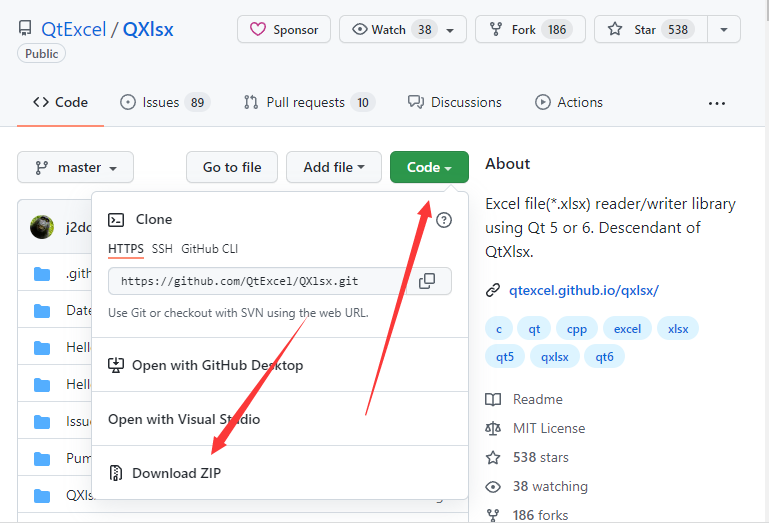
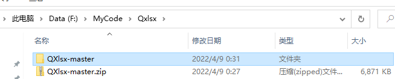
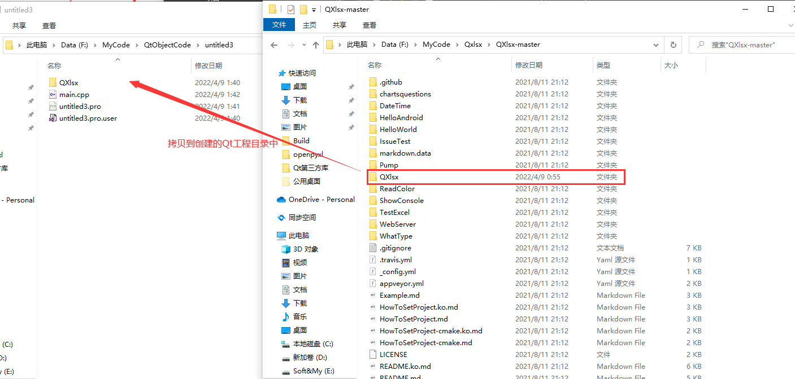

## 1. QXlsx下载

QXlsx是一个可以读写Excel文件的库。它不需要Microsoft Excel，可以在Qt5支持的任何平台上使用。

### 1.1 下载地址

[github官网](https://github.com/QtExcel/QXlsx)

[本地文件](./QXlsx-master.zip)



### 1.2 解压



### 1.3 新建Qt工程

新建Qt工程，把上面解压后的目录中的`QXlsx`文件夹拷贝到，创建的Qt工程目录中。



然后在pro文件中加入以下代码：

```css
QXLSX_PARENTPATH=$$PWD/QXlsx
QXLSX_HEADERPATH=$$PWD/QXlsx/header/
QXLSX_SOURCEPATH=$$PWD/QXlsx/source/
include(./QXlsx/Qxlsx.pri)
```

包含头文件并写入测试代码：

```cpp
#include "xlsxdocument.h"

void test()
{
    //![0]
    QXlsx::Document xlsx;
    //![0]

    //![1]
    xlsx.write("A1", "Hello Qt!");
    xlsx.write("A2", 12345);
    xlsx.write("A3", "=44+33");
    xlsx.write("A4", true);
    xlsx.write("A5", "http://qt-project.org");
    xlsx.write("A6", QDate(2013, 12, 27));
    xlsx.write("A7", QTime(6, 30));
    //![1]

    //![2]
    xlsx.save();
    //![2]
}
```


