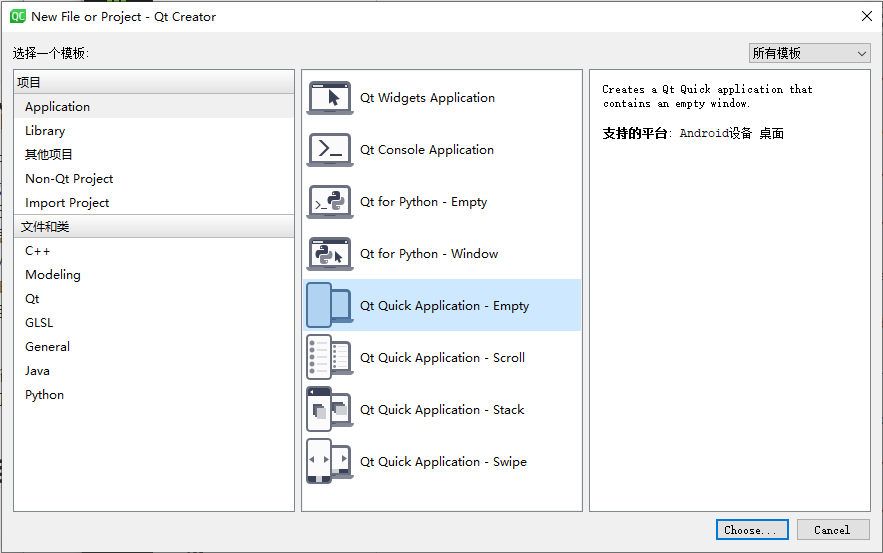

# QML

## QML简介

从 Qt 4.7 开始，Qt 引入了一种声明式脚本语言，称为 QML（Qt Meta Language 或者 Qt Modeling Language），作为 C++ 语言的一种替代。而 Qt Quick 就是使用 QML 构建的一套类库。 QML 是一种基于 JavaScript 的声明式语言。在 Qt 5 中， QML 有了长足进步，并且同 C++ 并列成为 Qt 的首选编程语言。也就是说，使用 Qt 5，我们不仅可以使用 C++ 开发 Qt 程序，而且可以使用 QML。虽然 QML 是解释型语言，性能要比 C++ 低一些，但是新版 QML 使用 V8，Qt 5.2 又引入了专为 QML 优化的 V4 引擎，使得其性能不再有明显降低。在 Nokia 发布 Qt 4.7 的时候，QML 被用于开发手机应用程序，全面支持触摸操作、流畅的动画效果等。但是在 Qt 5 中，QML 已经不仅限于开发手机应用，也可以用户开发传统的桌面程序。

QML 文档描述了一个对象树。QML 元素包含了其构造块、图形元素（矩形、图片等）和行为（例如动画、切换等）。这些 QML 元素按照一定的嵌套关系构成复杂的组件，供用户交互。

## QML项目

1，选择Qt Quick Application - empty创建项目

