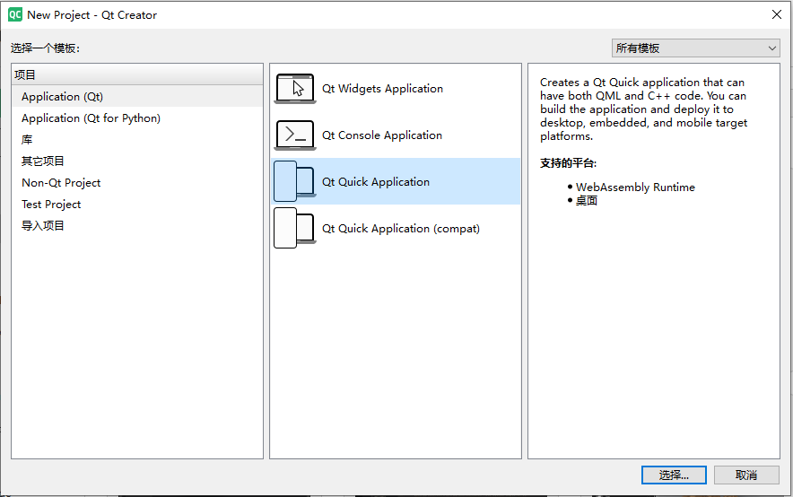
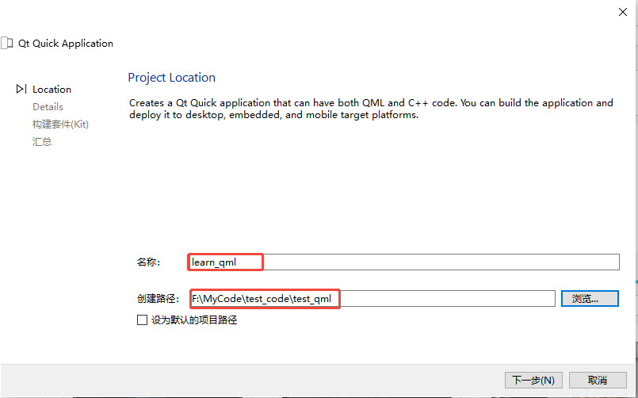
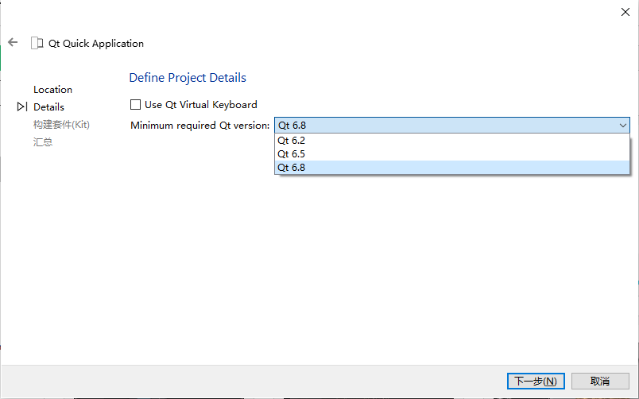
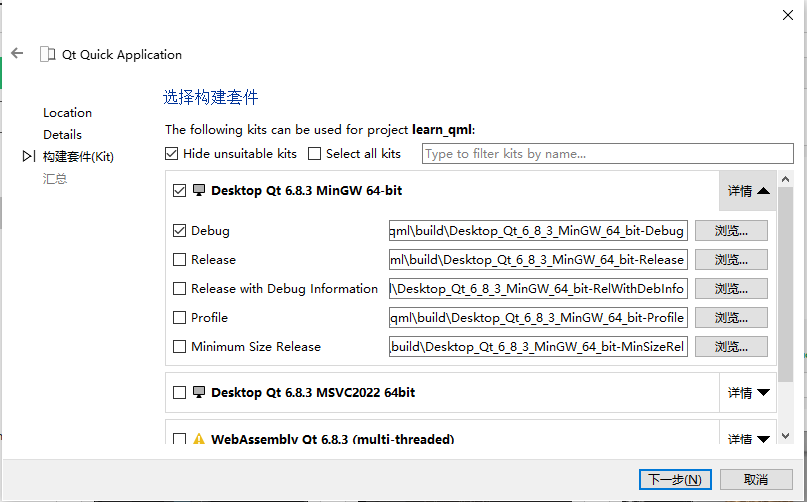
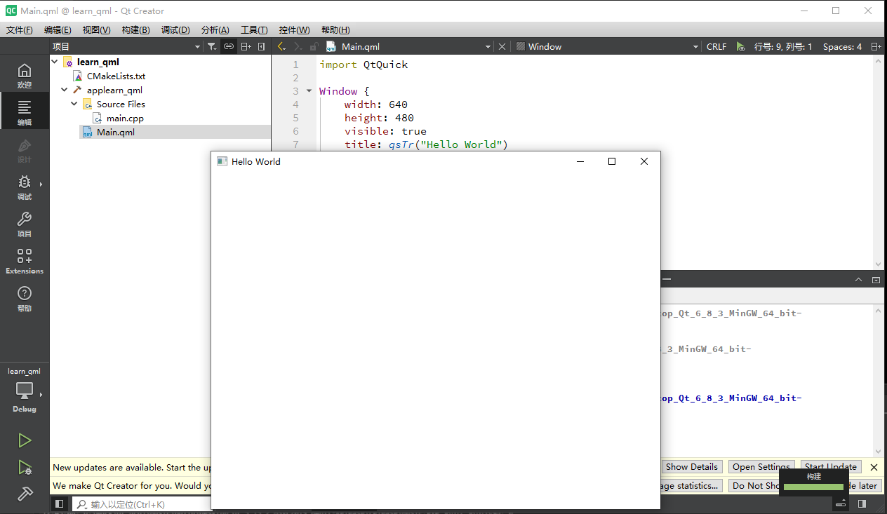

# QML

## QML简介

从 Qt 4.7 开始，Qt 引入了一种声明式脚本语言，称为 QML（Qt Meta Language 或者 Qt Modeling Language），作为 C++ 语言的一种替代。而 Qt Quick 就是使用 QML 构建的一套类库。 QML 是一种基于 JavaScript 的声明式语言。在 Qt 5 中， QML 有了长足进步，并且同 C++ 并列成为 Qt 的首选编程语言。也就是说，使用 Qt 5，我们不仅可以使用 C++ 开发 Qt 程序，而且可以使用 QML。虽然 QML 是解释型语言，性能要比 C++ 低一些，但是新版 QML 使用 V8，Qt 5.2 又引入了专为 QML 优化的 V4 引擎，使得其性能不再有明显降低。在 Nokia 发布 Qt 4.7 的时候，QML 被用于开发手机应用程序，全面支持触摸操作、流畅的动画效果等。但是在 Qt 5 中，QML 已经不仅限于开发手机应用，也可以用户开发传统的桌面程序。

QML 文档描述了一个对象树。QML 元素包含了其构造块、图形元素（矩形、图片等）和行为（例如动画、切换等）。这些 QML 元素按照一定的嵌套关系构成复杂的组件，供用户交互。

## QML项目

### 项目创建

1. 选择Qt Quick Application创建项目



2. 输入项目名称和项目位置(注意：不能有中文和空格！！！)



3. 请求Qt的最小版本，直接选最新版本即可！



4. 接下来选择编译套件



5. 创建完成运行测试一下，能出现一个窗口表示项目没毛病！



### 项目介绍

项目创建完成后，可以在左边看到有三个文件，分别是项目文件`CMakeLists.txt`、源文件`main.cpp`、qml文件`Main.qml`。

#### CMakeLists.txt

```cmake
cmake_minimum_required(VERSION 3.16)

project(learn_qml VERSION 0.1 LANGUAGES CXX)

set(CMAKE_CXX_STANDARD_REQUIRED ON)

find_package(Qt6 REQUIRED COMPONENTS Quick)

qt_standard_project_setup(REQUIRES 6.8)

qt_add_executable(applearn_qml
    main.cpp
)

qt_add_qml_module(applearn_qml
    URI learn_qml
    VERSION 1.0
    QML_FILES
        Main.qml
)

# Qt for iOS sets MACOSX_BUNDLE_GUI_IDENTIFIER automatically since Qt 6.1.
# If you are developing for iOS or macOS you should consider setting an
# explicit, fixed bundle identifier manually though.
set_target_properties(applearn_qml PROPERTIES
#    MACOSX_BUNDLE_GUI_IDENTIFIER com.example.applearn_qml
    MACOSX_BUNDLE_BUNDLE_VERSION ${PROJECT_VERSION}
    MACOSX_BUNDLE_SHORT_VERSION_STRING ${PROJECT_VERSION_MAJOR}.${PROJECT_VERSION_MINOR}
    MACOSX_BUNDLE TRUE
    WIN32_EXECUTABLE TRUE
)

target_link_libraries(applearn_qml
    PRIVATE Qt6::Quick
)

include(GNUInstallDirs)
install(TARGETS applearn_qml
    BUNDLE DESTINATION .
    LIBRARY DESTINATION ${CMAKE_INSTALL_LIBDIR}
    RUNTIME DESTINATION ${CMAKE_INSTALL_BINDIR}
)
```

#### main.cpp

```cpp
#include <QGuiApplication>
#include <QQmlApplicationEngine>	//QML程序引擎

int main(int argc, char *argv[])
{
    QGuiApplication app(argc, argv);

    //创建QML程序引擎
    QQmlApplicationEngine engine;	
    //连接引擎中qml对象创建失败信号，失败之后让应用程序直接退出
    QObject::connect(
        &engine,
        &QQmlApplicationEngine::objectCreationFailed,
        &app,
        []() { QCoreApplication::exit(-1); },
        Qt::QueuedConnection);
    //引擎加载QML主文件
    engine.loadFromModule("learn_qml", "Main");
	//开启事件循环
    return app.exec();
}
```


#### Main.qml

```css
//导入qml模块
import QtQuick

//定义一个窗口对象
Window {
    width: 640						//窗口宽度
    height: 480						//窗口高度
    visible: true					//窗口是否显示
    title: qsTr("Hello World")		//窗口标题
}
```

## QML对象类型

### Window

在 Qt Quick 中，`Window` 对象是一个重要的顶级视觉元素，代表应用程序的窗口。

### **核心属性**

1. **窗口属性**

   - `title`: 窗口标题（显示在标题栏）。

   - `icon`: 窗口图标（前面已介绍）。

   - `flags`: 控制窗口样式（如无边框、全屏等）。

     ```qml
     flags: Qt.FramelessWindowHint // 无边框窗口
     ```

2. **尺寸与位置**

   - `width`/`height`: 窗口大小。
   - `x`/`y`: 窗口位置。
   - `minimumWidth`/`minimumHeight`: 最小尺寸限制。
   - `maximumWidth`/`maximumHeight`: 最大尺寸限制。

3. **状态控制**

   - `visible`: 窗口是否可见。
   - `enabled`: 窗口是否启用（可交互）。
   - `active`: 窗口是否处于活动状态（前台）。
   - `visibility`: 窗口的可见性模式（`Window.Normal`、`Window.Minimized`、`Window.Maximized`、`Window.FullScreen`）。

4. **行为控制**

   - `flags`: 窗口标志（如 `Qt.Dialog`、`Qt.SplashScreen` 等）。
   - `modality`: 模态属性（`Window.NonModal`、`Window.WindowModal`、`Window.ApplicationModal`）。

### **常用信号**

- `onClosing`: 窗口关闭时触发。

  ```qml
  onClosing: {
      // 阻止窗口关闭（如需要确认）
      close.accepted = false
      // 或者执行清理操作
      console.log("Window is closing...")
  }
  ```

- `onVisibleChanged`: 窗口可见性变化时触发。

- `onScreenChanged`: 窗口所在屏幕变化时触发（多显示器场景）。

### **重要方法**

- `show()`: 显示窗口。
- `hide()`: 隐藏窗口。
- `close()`: 关闭窗口。
- `requestActivate()`: 请求将窗口置于前台。
- `setGeometry(x, y, width, height)`: 设置窗口位置和大小。

### **特殊场景**

#### 1. **无边框窗口**

```css
flags: Qt.FramelessWindowHint
```

#### 2. **模态对话框**

```css
Window {
    id: dialog
    visible: false
    modality: Window.WindowModal // 窗口模态（阻塞父窗口）
    // 或 modality: Window.ApplicationModal（阻塞整个应用）
    
    width: 400
    height: 300
    title: "Dialog Window"
}
```

#### 3. **全屏应用**

```qml
visibility: Window.FullScreen
```

### **与 ApplicationWindow 的区别**

- `Window`: 基础窗口，需手动实现菜单、工具栏等。

- `ApplicationWindow`: 高级窗口，内置菜单、工具栏、状态栏等，适合桌面应用。

  ```css
  import QtQuick.Controls 2.15
  
  ApplicationWindow {
      visible: true
      width: 800
      height: 600
      title: "Modern Application"
      
      menuBar: MenuBar {
          // 菜单定义
      }
  }
  ```

### **注意事项**

1. **单例窗口**：通常一个应用只有一个主窗口，多个窗口可能导致焦点管理问题。
2. **资源管理**：窗口关闭时，可通过 `Component.onDestruction` 清理资源。
3. **平台差异**：窗口行为在不同操作系统（Windows、macOS、Linux）可能略有不同。