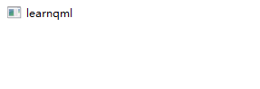
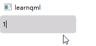

# 常用控件

## 文本输入

### TextInput

`TextInput`类型用于显示一行可编辑的纯文本。

`TextInput`用于接收一行文本输入。可以对`TextInput`设置输入约束（例如，通过验证器或输入掩码），并将“echoMode”设置为适当的值可使`TextInput`用于密码输入字段。

**基本使用：**

```css
    TextInput{
        focus:true
    }
```



TextInput 是一个非常简单的项目，除了显示光标和文本外，默认并没有边框等装饰性效果，所以在使用时一般要为其添加一个可视化的外观。

```css
    Rectangle{
        width:150
        height:35
        color: 'lightgray'
        border.color:'#ccd8db'
        radius: 5

        TextInput{
            focus:true
            anchors{
                fill:parent
                leftMargin: 5
                rightMargin: 5
            }

            verticalAlignment: TextInput.AlignVCenter
            clip:true
        }
    }
```



#### 自适应输入框尺寸

按照前面的代码已经为 TextInput 设置了一个基本的外观，但是如果输入过多的内容时，内容就会被裁剪，有时需要让背景框的尺寸根据内容宽度进行自动调整。

```css
    Rectangle{
        width:Math.min(Math.max(input.contentWidth,150),250)	/*最小为150，最大为250*/
        height:35
        color: 'lightgray'
        border.color:'#ccd8db'
        radius: 5

        TextInput{
            id:input	/*指定id*/
            focus:true
            anchors{
                fill:parent
                leftMargin: 5
                rightMargin: 5
            }

            verticalAlignment: TextInput.AlignVCenter
            clip:true
        }
    }
```

#### 回显模式

`echoMode`指定了文本在文本输入框中应如何显示的方式。

+ **TextInput.Normal：**将文本原样显示出来
+ **TextInput.Password：**显示的是密码字符而非实际的字符内容。在编辑过程中，新输入的字符会在由“密码掩码延迟”属性指定的一段时间内以明文形式显示。
+ **TextInput.NoEcho：**没有任何显示内容。
+ **TextInput.PasswordEchoOnEdit：**内容的显示方式与输入文本的密码输入方式相同。在编辑过程中，只要输入文本具有焦点，新输入的字符就会以明文形式显示出来。

```css
        TextInput{
            id:input	/*指定id*/
            focus:true
            anchors{
                fill:parent
                leftMargin: 5
                rightMargin: 5
            }

            verticalAlignment: TextInput.AlignVCenter
            clip:true
            echoMode: TextInput.PasswordEchoOnEdit
            passwordCharacter: '#'

            //输入文本改变时触发
            onTextChanged: console.log(text)
            //按下Return键或Enter键时触发
            onAccepted: {focus = false;console.log('accepted');}
        }
```

`passwordCharacter`设置密码显示字符，当“echoMode”设置为“Password”或“PasswordEchoOnEdit”时，会显示此字符。默认情况下，该字符为平台主题所使用的密码字符。

`passwordMaskDelay`设置在将可见字符替换为密码字符之前的时间延迟（以毫秒为单位）。

#### 验证器

允许您为文本输入控件设置验证器。一旦设置了验证器，文本输入控件将仅接受能使文本属性保持可接受或中间状态的输入。只有当输入的文本在按下回车键时处于可接受状态时，才会发送已接受的信号。

目前支持的验证器有整数验证器(IntValidator)、浮点数验证器(DoubleValidator)和正则表达式验证器(RegularExpressionValidator)。

##### 整数验证器

使用验证器的示例如下所示，它允许在文本输入框中输入 11 到 31 之间的整数：

```css
validator: IntValidator{bottom: 11; top: 31;}
```

##### 浮点数验证器

以下示例展示了一个包含“双精度验证器”的输入文本对象，该验证器用于检查用户输入的数值是否在指定范围内，并通过更改文本颜色来突出显示无效输入：

```css
validator: DoubleValidator {
         bottom: 0.00
         top: 100.00
         decimals: 2
         notation: DoubleValidator.StandardNotation
     }
onAcceptableInputChanged:
         color = acceptableInput ? "black" : "red";
```

##### 正则验证器

“RegularExpressionValidator”类型提供了一个验证器，该验证器会判定任何与指定正则表达式相匹配的字符串为有效字符串。

以下正则验证器只接受数字输入。

```css
validator: RegularExpressionValidator{
    regularExpression: /^\d+$/
}
```

更多正则，请查看[正则表达式在线测试 | 菜鸟工具](https://www.jyshare.com/front-end/854/)


### TextField

文本框是一种单行文本编辑器。文本框继承自文本输入组件，并具备占位文本的功能，同时还添加了装饰效果。

### TextEdit

`TextEdit`项会显示一段可编辑且已格式化的文本内容，它既能显示纯文本，也能显示富文本。