# Canvas

## 基本用法

“Canvas”支持绘制直线和曲线、简单和复杂的形状、图表以及引用的图形图像。它还能添加文本、颜色、阴影、渐变和图案，并进行低级像素操作。画布的输出可以保存为图像文件，或者序列化为一个 URL。

在画布上进行渲染是通过使用 `Context2D` 对象来实现的，通常这是由`paint`信号触发的。

要在“Canvas”项中定义绘图区域，请设置其“宽度”和“高度”属性。例如，以下代码创建了一个具有 100 像素高度和 200 像素宽度的绘图区域的“Canvas”项：

```js
Canvas{
    width: 100
    height:100
    onPaint: {
        let ctx = getContext("2d")
        ctx.fillStyle = Qt.rgba(1, 0, 0, 1);
        ctx.fillRect(25,25,50,50)
    }
}
```

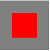

`paint`是Canvas的信号，当需要绘图（更新）时会触发，开发者通过实现名为onPaint的信号处理器来响应paint信号，在信号处理器内进行绘图；

Context2D是QML中负责2D绘图的对象，与Canvas结合使用，有两种使用Context2D对象的方式：

+ 1、在onPaint信号处理器中调用getContext(“2d”)获取Context2D对象；
+ 2、设置Canvas对象的contextType属性（2D绘图时取值为“2d”）后，context属性就会保存一个可用的Context2D对象；故上例也可以写为如下方式：

```js
Canvas{
    id:canvas
    width: 100
    height:100
    contextType: '2d'
    property alias ctx: canvas.context	//取个简单的别名，方便使用
    onPaint: {
        //let ctx = getContext("2d")
        ctx.fillStyle = Qt.rgba(1, 0, 0, 1);
        ctx.fillRect(25,25,50,50)
    }
}
```

## 使用Canvas来绘制图形

接下来我们深入了解如何在 Canvas 上绘制。到本文的最后，你将学会如何绘制矩形，三角形，直线，圆弧和曲线，变得熟悉这些基本的形状。绘制物体到 Canvas 前，需掌握路径，我们看看到底怎么做。

### 栅格


在我们开始画图之前，我们需要了解一下画布栅格（canvas grid）以及坐标空间。上一页中的 HTML 模板中有个宽 100px, 高 100px 的 canvas 元素。如上图所示，canvas 元素默认被网格所覆盖。通常来说网格中的一个单元相当于 canvas 元素中的一像素。栅格的起点为左上角（坐标为（0,0））。所有元素的位置都相对于原点定位。所以图中蓝色方形左上角的坐标为距离左边（X 轴）x 像素，距离上边（Y 轴）y 像素（坐标为（x,y））。在课程的最后我们会平移原点到不同的坐标上，旋转网格以及缩放。现在我们还是使用原来的设置。

### 绘制矩形

Canvas只支持两种形式的图形绘制：**矩形**和**路径**（由一系列点连成的线段）。所有其他类型的图形都是通过一条或者多条路径组合而成的。不过，我们拥有众多路径生成的方法让复杂图形的绘制成为了可能。

首先，我们回到矩形的绘制中。canvas 提供了三种方法绘制矩形：

```c
object fillRect(real x, real y, real w, real h)			//绘制一个填充矩形
object strokeRect(real x, real y, real w, real h)		//绘制一个矩形的边框
object clearRect(real x, real y, real w, real h)		//清除指定矩形区域，请清除部分完全透明
```

上面提供的方法之中每一个都包含了相同的参数。x 与 y 指定了在 canvas 画布上所绘制的矩形的左上角（相对于原点）的坐标。width 和 height 设置矩形的尺寸。

**示例：**

```js
    Canvas{
        id:canvas
        anchors.fill: parent

        onPaint: {
            let ctx = getContext("2d")

             ctx.fillRect(25, 25, 100, 100);
             ctx.clearRect(45, 45, 60, 60);
             ctx.strokeRect(50, 50, 50, 50);
        }
    }
```

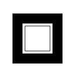

`fillRect()`函数绘制了一个边长为 100px 的黑色正方形。`clearRect()`函数从正方形的中心开始擦除了一个 60*60px 的正方形，接着`strokeRect()`在清除区域内生成一个 50\*50 的正方形边框。

不同于下一节所要介绍的路径函数（path function），以上的三个函数绘制之后会马上显现在 canvas 上，即时生效。

### 绘制路径

图形的基本元素是路径。路径是通过**不同颜色**和**宽度的线段**或**曲线**相连形成的不同形状的点的集合。一个路径，甚至一个子路径，都是闭合的。使用路径绘制图形需要一些额外的步骤。

1. 首先，你需要创建路径起始点。
2. 然后你使用画图命令去画出路径。
3. 之后你把路径封闭。
4. 一旦路径生成，你就能通过描边或填充路径区域来渲染图形。

以下是所要用到的函数：

```c
object beginPath()		//新建一条路径，生成之后，图形绘制命令被指向到路径上生成路径。
object closePath()		//闭合路径之后图形绘制命令又重新指向到上下文中。
object stroke()			//通过线条来绘制图形轮廓。
object fill()			//通过填充路径的内容区域生成实心的图形。
```

生成路径的第一步叫做 beginPath()。本质上，路径是由很多子路径构成，这些子路径都是在一个列表中，所有的子路径（线、弧形、等等）构成图形。而每次这个方法调用之后，列表清空重置，然后我们就可以重新绘制新的图形。

第二步就是调用函数指定绘制路径，本文稍后我们就能看到了。

第三，就是闭合路径 closePath(),不是必需的。这个方法会通过绘制一条从当前点到开始点的直线来闭合图形。如果图形是已经闭合了的，即当前点为开始点，该函数什么也不做。

#### 绘制一个三角形

例如，绘制三角形的代码如下：

```js
onPaint: {
    let ctx = getContext("2d")
    
    ctx.beginPath()
    ctx.moveTo(75, 50)			//移动笔触(这里移动到了三角形左边的点)
    ctx.lineTo(100, 75)			//从当前笔触点，绘制直线到100,75的位置(三角形最下面的点)
    ctx.lineTo(100, 25)
    ctx.fill()					//填充路径
}
```

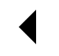

#### 移动笔触

一个非常有用的函数，而这个函数实际上并不能画出任何东西，也是上面所描述的路径列表的一部分，这个函数就是`moveTo(x,y)`。或者你可以想象一下在纸上作业，一支钢笔或者铅笔的笔尖从一个点到另一个点的移动过程。

当 canvas 初始化或者`beginPath()`调用后，你通常会使用`moveTo()`函数设置起点。我们也能够使用`moveTo()`绘制一些不连续的路径。

#### 绘制直线

绘制直线，需要用到的方法`lineTo()`。

```c
object lineTo(real x, real y)		//绘制一条从当前位置到指定 x 以及 y 位置的直线。
```

该方法有两个参数：x 以及 y，代表坐标系中直线结束的点。开始点和之前的绘制路径有关，之前路径的结束点就是接下来的开始点，以此类推。开始点也可以通过`moveTo()`函数改变。

下面的例子绘制两个三角形，一个是填充的，另一个是描边的。

```js
onPaint: {
    let ctx = getContext("2d")
    // 填充三角形
    ctx.beginPath()
    ctx.moveTo(25, 25)
    ctx.lineTo(105, 25)
    ctx.lineTo(25, 105)
    ctx.fill()
    // 描边三角形
    ctx.beginPath()
    ctx.moveTo(125, 125)
    ctx.lineTo(125, 45)
    ctx.lineTo(45, 125)
    ctx.closePath()
    ctx.stroke()
}
```

这里从调用`beginPath()`函数准备绘制一个新的形状路径开始。然后使用`moveTo()`函数移动到目标位置上。然后下面，两条线段绘制后构成三角形的两条边。

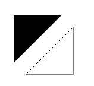

你会注意到填充与描边三角形步骤有所不同。正如上面所提到的，因为路径使用填充（fill）时，路径自动闭合，使用描边（stroke）则不会闭合路径。如果没有添加闭合路径`closePath()`到描边三角形函数中，则只绘制了两条线段，并不是一个完整的三角形。

#### 绘制圆弧

##### arc

绘制圆弧或者圆，我们使用`arc()`方法。当然可以使用`arcTo()`。

```c
object arc(real x, real y, real radius, real startAngle, real endAngle, bool anticlockwise)		//画一个以（x,y）为圆心的以 radius 为半径的圆弧（圆），从 startAngle 开始到 endAngle 结束，按照 anticlockwise 给定的方向（默认为顺时针）来生成。
```

这里详细介绍一下 arc 方法，该方法有六个参数：`x,y`为绘制圆弧所在圆上的圆心坐标。`radius`为半径。`startAngle`以及`endAngle`参数用弧度定义了开始以及结束的弧度。这些都是以 x 轴为基准。参数`anticlockwise`为一个布尔值。为 true 时，是逆时针方向，否则顺时针方向。

> **备注：** `arc()` 函数中表示角的单位是弧度，不是角度。角度与弧度的 js 表达式：**弧度=(Math.PI/180)\*角度。**


下面的例子比上面的要复杂一下，下面绘制了 12 个不同的角度以及填充的圆弧。

下面两个`for`循环，生成圆弧的行列（x,y）坐标。每一段圆弧的开始都调用`beginPath()`。代码中，每个圆弧的参数都是可变的，实际编程中，我们并不需要这样做。

x,y 坐标是可变的。半径（radius）和开始角度（startAngle）都是固定的。结束角度（endAngle）在第一列开始时是 180 度（半圆）然后每列增加 90 度。最后一列形成一个完整的圆。

`clockwise`语句作用于第一、三行是顺时针的圆弧，`anticlockwise`作用于二、四行为逆时针圆弧。`if`语句让一、二行描边圆弧，下面两行填充路径。

```js
            for (var i = 0; i < 4; i++) {
                for (var j = 0; j < 3; j++) {
                    ctx.beginPath();
                    var x = 25 + j * 50; // x 坐标值
                    var y = 25 + i * 50; // y 坐标值
                    var radius = 20; // 圆弧半径
                    var startAngle = 0; // 开始点
                    var endAngle = Math.PI + (Math.PI * j) / 2; // 结束点
                    var anticlockwise = i % 2 == 0 ? false : true; // 顺时针或逆时针
                    
                    ctx.arc(x, y, radius, startAngle, endAngle, anticlockwise);
                    
                    if (i > 1) {
                        ctx.fill();
                    } else {
                        ctx.stroke();
                    }
                }
            }
        }
```

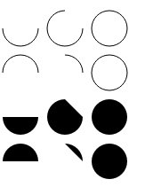

##### arcTo

```c
object arcTo(real x1, real y1, real x2, real y2, real radius)	//根据给定的控制点和半径画一段圆弧，再以直线连接两个控制点。
```

当前点是开始点(我们称之为x0和y0吧)，x1,y1是第一个控制点，x2和y2是第二个控制点，radius是圆的半径！

> 又是烧脑的数学知识，关系到切线原理！
>
> 简单来说就是p0点和p1点构成的直线 与 p1点和p2点构成的直线，与半径为radius的圆刚好相切，夹角内部分圆弧！

**案例一**

```js
//绘制辅助线
/*ctx.strokeStyle = 'green'
ctx.beginPath()
ctx.moveTo(300,200)
ctx.lineTo(300,250)
ctx.lineTo(250,250)
ctx.stroke()
*/
//绘制圆弧
ctx.strokeStyle = 'red'
ctx.beginPath()
ctx.moveTo(300,200)
ctx.arcTo(300,250,250,250,25)
ctx.stroke()
```

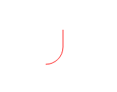

**案例二**

```js
//绘制辅助线
/*ctx.strokeStyle = 'red'
ctx.beginPath()
ctx.moveTo(50,50)
ctx.lineTo(200,300)
ctx.lineTo(0,300)
ctx.stroke()
*/
//绘制弧
ctx.strokeStyle = 'green'
ctx.beginPath();
ctx.moveTo(50,50);
ctx.arcTo(200,300,120,300,20*Math.PI);
ctx.stroke();
```

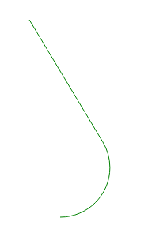

#### 贝塞尔曲线

> 贝塞尔曲线(Bézier curve)，又称贝兹曲线或贝济埃曲线，是应用于二维图形应用程序的数学曲线。一般的矢量图形软件通过它来精确画出曲线，贝兹曲线由[线段](https://baike.baidu.com/item/线段/8679802?fromModule=lemma_inlink)与[节点](https://baike.baidu.com/item/节点/865052?fromModule=lemma_inlink)组成，节点是可拖动的支点，线段像可伸缩的皮筋，我们在绘图工具上看到的钢笔工具就是来做这种矢量[曲线](https://baike.baidu.com/item/曲线/12004395?fromModule=lemma_inlink)的。

##### 贝塞尔曲线生成动图

- 一阶(一次)贝塞尔曲线( = 线段)：


- ② 二次贝塞尔曲线( = 抛物线)


- ③ 三次贝塞尔曲线( = 类似抛物线的圆滑曲线)


##### 二次、三次贝塞尔曲线

一般用来绘制复杂有规律的图形。

```c
object quadraticCurveTo(real cpx, real cpy, real x, real y)		//绘制二次贝塞尔曲线，cp1x,cp1y 为一个控制点，x,y 为结束点。
object bezierCurveTo(real cp1x, real cp1y, real cp2x, real cp2y, real x, real y)	//绘制三次贝塞尔曲线，cp1x,cp1y为控制点一，cp2x,cp2y为控制点二，x,y为结束点。
```

比较难控制，可以通过在线工具先测试：[Canvas 贝塞尔曲线绘图](https://bezier.yunser.com/)

下边的图能够很好的描述两者的关系，二次贝塞尔曲线有一个开始点（蓝色）、一个结束点（蓝色）以及一个控制点（红色），而三次贝塞尔曲线有两个控制点。


数 x、y 在这两个方法中都是结束点坐标。`cp1x,cp1y`为坐标中的第一个控制点，`cp2x,cp2y`为坐标中的第二个控制点。

使用二次以及三次贝塞尔曲线是有一定的难度的，因为不同于像 Adobe Illustrators 这样的矢量软件，我们所绘制的曲线没有给我们提供直接的视觉反馈。这让绘制复杂的图形变得十分困难。在下面的例子中，我们会绘制一些简单有规律的图形，如果你有时间以及更多的耐心，很多复杂的图形你也可以绘制出来。

下面的这些例子没有多少困难。这两个例子中我们会连续绘制贝塞尔曲线，最后形成复杂的图形。

##### 二次贝塞尔曲线

这个例子使用多个贝塞尔曲线来渲染对话气泡。

```js
// 二次贝塞尔曲线
ctx.beginPath()
ctx.moveTo(75, 25)
ctx.quadraticCurveTo(25, 25, 25, 62.5)
ctx.quadraticCurveTo(25, 100, 50, 100)
ctx.quadraticCurveTo(50, 120, 30, 125)
ctx.quadraticCurveTo(60, 120, 65, 100)
ctx.quadraticCurveTo(125, 100, 125, 62.5)
ctx.quadraticCurveTo(125, 25, 75, 25)
ctx.stroke()
```

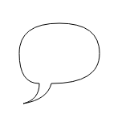

##### 三次贝塞尔曲线

这个例子使用贝塞尔曲线绘制心形。

```js
//三次贝塞尔曲线
ctx.beginPath()
ctx.moveTo(75, 40)
ctx.bezierCurveTo(75, 37, 70, 25, 50, 25)
ctx.bezierCurveTo(20, 25, 20, 62.5, 20, 62.5)
ctx.bezierCurveTo(20, 80, 40, 102, 75, 120)
ctx.bezierCurveTo(110, 102, 130, 80, 130, 62.5)
ctx.bezierCurveTo(130, 62.5, 130, 25, 100, 25)
ctx.bezierCurveTo(85, 25, 75, 37, 75, 40)
ctx.fill()
```

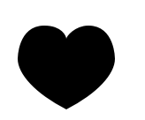

#### 绘制矩形

直接在画布上绘制矩形的三个额外方法，正如我们开始所见的[绘制矩形](https://developer.mozilla.org/zh-CN/docs/Web/API/Canvas_API/Tutorial/Drawing_shapes#绘制矩形)，同样，也有 rect() 方法，将一个矩形路径增加到当前路径上。

```c
object rect(real x, real y, real w, real h)		//绘制一个左上角坐标为（x,y），宽高为 width 以及 height 的矩形。
```

当该方法执行的时候，moveTo() 方法自动设置坐标参数（0,0）。也就是说，当前笔触自动重置回默认坐标。

```js
onPaint: {
    let ctx = getContext("2d")
    
    ctx.rect(20,20,100,35)
    ctx.fill()
    
    ctx.rect(20,60,100,35)
    ctx.stroke()
}
```

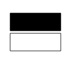

#### 组合使用

目前为止，每一个例子中的每个图形都只用到一种类型的路径。然而，绘制一个图形并没有限制使用数量以及类型。所以在最后的一个例子里，让我们组合使用所有的路径函数来重现一款著名的游戏。

```js
    Canvas{
        id:canvas
        anchors.fill: parent
        
        onPaint: {
            let ctx = getContext("2d")
            
            //绘制一些圆角矩形
            roundedRect(ctx, 12, 12, 150, 150, 15);
            roundedRect(ctx, 19, 19, 150, 150, 9);
            roundedRect(ctx, 53, 53, 49, 33, 10);
            roundedRect(ctx, 53, 119, 49, 16, 6);
            roundedRect(ctx, 135, 53, 49, 33, 10);
            roundedRect(ctx, 135, 119, 25, 49, 10);
            
            //绘制玩家
            ctx.beginPath();
            ctx.arc(37, 37, 13, Math.PI / 7, -Math.PI / 7, false);
            ctx.lineTo(31, 37);
            ctx.fill();
            
            //绘制食物
            for (var i = 0; i < 8; i++) {
                ctx.fillRect(51 + i * 16, 35, 4, 4);
            }
            
            for (i = 0; i < 6; i++) {
                ctx.fillRect(115, 51 + i * 16, 4, 4);
            }
            
            for (i = 0; i < 8; i++) {
                ctx.fillRect(51 + i * 16, 99, 4, 4);
            }
            
            
            //绘制怪物身体
            ctx.beginPath();
            ctx.moveTo(83, 116);
            ctx.lineTo(83, 102);
            ctx.bezierCurveTo(83, 94, 89, 88, 97, 88);
            ctx.bezierCurveTo(105, 88, 111, 94, 111, 102);
            ctx.lineTo(111, 116);
            ctx.lineTo(106.333, 111.333);
            ctx.lineTo(101.666, 116);
            ctx.lineTo(97, 111.333);
            ctx.lineTo(92.333, 116);
            ctx.lineTo(87.666, 111.333);
            ctx.lineTo(83, 116);
            ctx.fill();
            
            ctx.fillStyle = "white";
            //绘制左眼白
            ctx.beginPath();
            ctx.moveTo(91, 96);
            ctx.bezierCurveTo(88, 96, 87, 99, 87, 101);
            ctx.bezierCurveTo(87, 103, 88, 106, 91, 106);
            ctx.bezierCurveTo(94, 106, 95, 103, 95, 101);
            ctx.bezierCurveTo(95, 99, 94, 96, 91, 96);
            //绘制右眼白
            ctx.moveTo(103, 96);
            ctx.bezierCurveTo(100, 96, 99, 99, 99, 101);
            ctx.bezierCurveTo(99, 103, 100, 106, 103, 106);
            ctx.bezierCurveTo(106, 106, 107, 103, 107, 101);
            ctx.bezierCurveTo(107, 99, 106, 96, 103, 96);
            ctx.fill();
            
            ctx.fillStyle = "black";
            //绘制右眼睛
            ctx.beginPath();
            ctx.arc(101, 102, 2, 0, Math.PI * 2, true);
            ctx.fill();
            
            //绘制左眼睛
            ctx.beginPath();
            ctx.arc(89, 102, 2, 0, Math.PI * 2, true);
            ctx.fill();
        }
    }
    
    // 封装的一个用于绘制圆角矩形的函数。   
    function roundedRect(ctx, x, y, width, height, radius) {
        ctx.beginPath();
        ctx.moveTo(x, y + radius);
        ctx.lineTo(x, y + height - radius);
        ctx.quadraticCurveTo(x, y + height, x + radius, y + height);
        ctx.lineTo(x + width - radius, y + height);
        ctx.quadraticCurveTo(x + width, y + height, x + width, y + height - radius);
        ctx.lineTo(x + width, y + radius);
        ctx.quadraticCurveTo(x + width, y, x + width - radius, y);
        ctx.lineTo(x + radius, y);
        ctx.quadraticCurveTo(x, y, x, y + radius);
        ctx.stroke();
    }
```

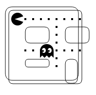

[基本的动画 - Web API | MDN](https://developer.mozilla.org/zh-CN/docs/Web/API/Canvas_API/Tutorial/Basic_animations)

## 基本动画

```js
    // 动画定时器
    Timer {
        id: animationTimer
        interval: 16 // 约60FPS
        running: true
        repeat: true
        onTriggered: {
            canvas.requestPaint();
        }
    }

    //画布，可以在上面自己画图
    Canvas{
        id:canvas
        anchors.fill: parent

        onPaint: {
            //获取2d上下文对象
            let ctx =  getContext("2d")
            if(!ctx)
                return

            clock(ctx)
        }
    }

    function   clock(ctx)
    {
        const now = new Date()
        ctx.save()
        ctx.clearRect(0, 0, 150, 150)
        ctx.translate(75, 75)
        ctx.scale(0.4, 0.4)
        ctx.rotate(-Math.PI / 2)
        ctx.strokeStyle = "black"
        ctx.fillStyle = "white"
        ctx.lineWidth = 8
        ctx.lineCap = "round"

        // 小时刻度
        ctx.save()
        for (let i = 0; i < 12; i++) {
            ctx.beginPath()
            ctx.rotate(Math.PI / 6)
            ctx.moveTo(100, 0)
            ctx.lineTo(120, 0)
            ctx.stroke()
        }
        ctx.restore()

        // 分钟刻度
        ctx.save()
        ctx.lineWidth = 5
        for (let i = 0; i < 60; i++) {
            if (i % 5 !== 0) {
                ctx.beginPath()
                ctx.moveTo(117, 0)
                ctx.lineTo(120, 0)
                ctx.stroke()
            }
            ctx.rotate(Math.PI / 30)
        }
        ctx.restore()

        const sec = now.getSeconds()
        // 要显示扫秒式的时钟，请使用：
        //const sec = now.getSeconds() + now.getMilliseconds() / 1000
        const min = now.getMinutes()
        const hr = now.getHours() % 12

        ctx.fillStyle = "black"

        // 显示图像描述
        //canvas.innerText = `当前时间：${hr}:${min}`;

        // 时针
        ctx.save()
        ctx.rotate(
                    (Math.PI / 6) * hr + (Math.PI / 360) * min + (Math.PI / 21600) * sec,
                    )
        ctx.lineWidth = 14
        ctx.beginPath()
        ctx.moveTo(-20, 0)
        ctx.lineTo(80, 0)
        ctx.stroke()
        ctx.restore()

        // 分针
        ctx.save();
        ctx.rotate((Math.PI / 30) * min + (Math.PI / 1800) * sec)
        ctx.lineWidth = 10
        ctx.beginPath()
        ctx.moveTo(-28, 0)
        ctx.lineTo(112, 0)
        ctx.stroke()
        ctx.restore()

        // 秒针
        ctx.save();
        ctx.rotate((sec * Math.PI) / 30)
        ctx.strokeStyle = "#D40000"
        ctx.fillStyle = "#D40000"
        ctx.lineWidth = 6
        ctx.beginPath()
        ctx.moveTo(-30, 0)
        ctx.lineTo(83, 0)
        ctx.stroke()
        ctx.beginPath()
        ctx.arc(0, 0, 10, 0, Math.PI * 2, true)
        ctx.fill()
        ctx.beginPath()
        ctx.arc(95, 0, 10, 0, Math.PI * 2, true)
        ctx.stroke()
        ctx.fillStyle = "rgb(0 0 0 / 0%)"
        ctx.arc(0, 0, 3, 0, Math.PI * 2, true)
        ctx.fill()
        ctx.restore()

        ctx.beginPath()
        ctx.lineWidth = 14
        ctx.strokeStyle = "#325FA2"
        ctx.arc(0, 0, 142, 0, Math.PI * 2, true)
        ctx.stroke()

        ctx.restore()
    }
```

