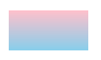

# QML绘图系统

## 概述

“Canvas”支持绘制直线和曲线、简单和复杂的形状、图表以及引用的图形图像。它还能添加文本、颜色、阴影、渐变和图案，并进行低级像素操作。画布的输出可以保存为图像文件，或者序列化为一个 URL。

在画布上进行渲染是通过使用 `Context2D` 对象来实现的，通常这是由`paint`信号触发的。

要在“Canvas”项中定义绘图区域，请设置其“宽度”和“高度”属性。例如，以下代码创建了一个具有 100 像素高度和 200 像素宽度的绘图区域的“Canvas”项：

```js
Canvas{
    width: 100
    height:100
    onPaint: {
        let ctx = getContext("2d")
        ctx.fillStyle = Qt.rgba(1, 0, 0, 1);
        ctx.fillRect(25,25,50,50)
    }
}
```


`paint`是Canvas的信号，当需要绘图（更新）时会触发，开发者通过实现名为onPaint的信号处理器来响应paint信号，在信号处理器内进行绘图；

Context2D是QML中负责2D绘图的对象，与Canvas结合使用，有两种使用Context2D对象的方式：

+ 1、在onPaint信号处理器中调用getContext(“2d”)获取Context2D对象；
+ 2、设置Canvas对象的contextType属性（2D绘图时取值为“2d”）后，context属性就会保存一个可用的Context2D对象；故上例也可以写为如下方式：

```js
Canvas{
    id:canvas
    width: 100
    height:100
    contextType: '2d'
    property alias ctx: canvas.context	//取个简单的别名，方便使用
    onPaint: {
        //let ctx = getContext("2d")
        ctx.fillStyle = Qt.rgba(1, 0, 0, 1);
        ctx.fillRect(25,25,50,50)
    }
}
```


## 一、绘图样式

+ 画布（Canvas，类似于Widget的QPaintDevice）
+ 画师（Context2d，类似于Widget的QPainter）
+ 画笔（strokeStyle属性，类似于Widget的QPen）
+ 画刷（fillStyle属性，类似于Widget的QBrush）

### 1.1、fillStyle

`fillStyle`保存当前用于填充形状的样式。该样式可以是包含 CSS 颜色的字符串、CanvasGradient 对象或 CanvasPattern 对象。无效的值将被忽略。此属性支持多种颜色语法：除了直接写颜色名称之外，其他写法如下：

#### rgb颜色

```js
//ctx.fillStyle = 'rgb(80%, 80%, 0%)'		//使用百分比(只能使用百分号形式，不能用小数)
//ctx.fillStyle = 'rgb(255,0,0)'			//使用RGB值
//ctx.fillStyle = '#FF0000'       			//#RGB 十六进制表示的颜色值，每个值需要两个十六进制数
```

#### rgba颜色

**字符串表示**

```js
//ctx.fillStyle = 'rgba(80%, 80%, 0%, 0.8)'		//使用百分比(只能使用百分号形式，不能用小数)
//ctx.fillStyle = 'rgba(255,0,0,0.8)'			//使用RGB值
//ctx.fillStyle = '#CCFF0000'       			//#ARGB 十六进制表示的颜色值，每个值需要两个十六进制数
```

**通过方法获取**

```js
//ctx.fillStyle = Qt.rgba(0.8, 0.8, 0, 1)		//使用百分比(alpha通道只能用小数百分比)
//ctx.fillStyle = Qt.rgba(255,0,0,1)			//使用RGB值(alpha通道只能用小数百分比)
```

#### hsl颜色

使用`'hsl(hue, saturation, lightness)'`或者`'hsla(hue, saturation, lightness, alpha)'`指定HSL或HSLA颜色。

+ **hue：**色调是色环上的一种度量单位，范围从 0 到 360 度。0 度（或 360 度）对应红色，120 度对应绿色，240 度对应蓝色。
+ **saturation：**饱和度可以被定义为一种颜色的浓淡程度。它是一个介于 0% 到 100% 之间的百分比数值。
  + 100% 是全彩的，没有灰色调。
  + 50% 的颜色是 50% 的灰色，但你仍然可以看到其原本的颜色。
  + 0% 时颜色完全消失，再也看不见任何颜色了。
+ **lightness：**颜色的亮度可以被描述为你希望赋予该颜色的光线强度，其中 0% 表示没有光线（颜色为深色），50% 表示 50% 的光线（既不深也不亮），而 100% 则表示全亮。
+ **alpha：**“alpha”参数是一个介于 0.0（完全透明）和 1.0（完全不透明）之间的数值。

```js
ctx.fillStyle = 'hsl(120,50%,80%)'
ctx.fillStyle = 'hsla(120,50%,80%,0.2)'
```

#### 渐变色

需要先使用context的方法创建渐变。

##### 线性渐变

`object createLinearGradient(real x0, real y0, real x1, real y1)`创建线性渐变，`x0`和`y0`是起点的横坐标和纵坐标，`x1`和`y1`是终点的横坐标和纵坐标。通过不同的坐标值，可以生成从上至下、从左到右的渐变等等。

```js
onPaint: {
    let ctx = getContext("2d")
    let linearGradient = ctx.createLinearGradient(25,25,25+100,25+50)
    linearGradient.addColorStop(0,'pink')
    linearGradient.addColorStop(1,'skyblue')
    ctx.fillStyle = linearGradient
    ctx.fillRect(25,25,100,50)
}
```


通过不同的坐标值，可以生成从上至下、从左到右的渐变等等。

```js
let linearGradient = ctx.createLinearGradient(25,25,25,25+50)
linearGradient.addColorStop(0,'pink')
linearGradient.addColorStop(1,'skyblue')
ctx.fillStyle = linearGradient
```



##### 径向(梯度)渐变

`object createRadialGradient(real x0, real y0, real r0, real x1, real y1, real r1)`创建径向渐变，`x0`和`y0`是辐射起始的圆的圆心坐标，`r0`是起始圆的半径，`x1`和`y1`是辐射终止的圆的圆心坐标，`r1`是终止圆的半径。

```js
// 创建一个径向渐变
// 内圆位于 x=110、y=90，半径为 30
// 外圆位于 x=100,、y=100，半径为 70
const gradient = ctx.createRadialGradient(110, 90, 30, 100, 100, 70);
// 添加三个色标
gradient.addColorStop(0, "pink");
gradient.addColorStop(0.9, "white");
gradient.addColorStop(1, "green");
// 设置填充样式并绘制矩形
ctx.fillStyle = gradient;
ctx.fillRect(20, 20, 160, 160);
```


#### 图像填充

`createPattern()`方法定义一个图像填充样式，在指定方向上不断重复该图像，填充指定的区域。

```c
variant createPattern(Image image, string repetition)
```

该方法接受两个参数，第一个参数是图像数据，它可以是``元素，也可以是另一个`<canvas>`元素，或者一个表示图像的 Blob 对象。第二个参数是一个字符串，有四个可能的值，分别是`repeat`（双向重复）、`repeat-x`(水平重复)、`repeat-y`(垂直重复)、`no-repeat`(不重复)。如果第二个参数是空字符串或`null`，则等同于`null`。

> qml中貌似设置重复无效？？

```js
    Canvas{
        id:canvas
        anchors.fill: parent

        property string imageSrc: "/Resource/images/dog.png"

        onPaint: {
            let ctx = getContext("2d")

            let pattern =  ctx.createPattern(imageSrc,"repeat-x")
            ctx.fillStyle = pattern
            ctx.fillRect(20,20,150,50)
        }

        onImageLoaded: {
            console.log('image loaded!')
            requestPaint()
        }

    }
```


### 1.2、线条样式

用于指定形状周围线条的当前颜色或样式。该样式可以是包含 CSS 颜色的字符串、CanvasGradient 对象或 CanvasPattern 对象。无效的值将被忽略。

> 基本和fillStyle类似，主要使用颜色！

以下的方法和属性控制线条的视觉特征。

- `CanvasRenderingContext2D.lineWidth`：指定线条的宽度，默认为1.0。
- `CanvasRenderingContext2D.lineCap`：指定线条末端的样式，有三个可能的值：`butt`（默认值，末端为矩形）、`round`（末端为圆形）、`square`（末端为突出的矩形，矩形宽度不变，高度为线条宽度的一半）。
- `CanvasRenderingContext2D.lineJoin`：指定线段交点的样式，有三个可能的值：`round`（交点为扇形）、`bevel`（交点为三角形底边）、`miter`（默认值，交点为菱形)。
- `CanvasRenderingContext2D.miterLimit`：指定交点菱形的长度，默认为10。该属性只在`lineJoin`属性的值等于`miter`时有效。
- `CanvasRenderingContext2D.getLineDash()`：返回一个数组，表示虚线里面线段和间距的长度。
- `CanvasRenderingContext2D.setLineDash()`：数组，用于指定虚线里面线段和间距的长度。

### 1.3、阴影


## 二、绘制路径

使用Context2D绘制路径的一般步骤：

+ 调用beginPath()；
+ 调用moveTo()【移动到】、lineTo()【连线到】、arcTo()【画弧到】、rect()【矩形】、quadraticCurveTo()【二次方贝塞尔曲线】、arc()【弧线】、bezierCurveTo()【三次方贝塞尔曲线】、ellipse()【椭圆】、text()【文字】等构造路径元素的方法；
+ 调用fill()或stroke()；
+ 调用closePath()方法用于结束当前的路径，从路径终点到起点绘制一条直线来封闭路径（可选非必须）；

```js
import QtQuick 2.12
import QtQuick.Window 2.12

Window {
    width: 640
    height: 480
    visible: true

    Canvas {
        width: 400;
        height: 300;
        id: root;

        onPaint: {
            var ctx = getContext("2d");
            ctx.lineWidth = 2;
            ctx.strokeStyle = "red";
            ctx.font = "42px sans-serif";
            var gradient = ctx.createLinearGradient(0,0,width,height);
            gradient.addColorStop(0.0,Qt.rgba(0,1,0,1));
            gradient.addColorStop(1.0,Qt.rgba(0,0,1,1));
            ctx.fillStyle = gradient;

            ctx.beginPath();
            ctx.moveTo(4,4);
            ctx.bezierCurveTo(0,height-1,width-1,height/2,width/4,height/4);
            ctx.lineTo(width/2,height/4);
            ctx.arc(width*5/8,height/4,width/8,Math.PI,0,false);
            ctx.ellipse(width*11/16,height/4,width/8,height/4);
            ctx.lineTo(width/2,height*7/8);
            ctx.text("Complex Path",width/4,height*7/8);
            ctx.fill();
            ctx.stroke();
        }
    }
}
```

## 三、绘制文本

Context2D对象与文本相关的方法有三个：fillText()、strokeText()、text()

+ fillText()方法使用fillStyle填充文字；
+ strokeText()使用strokeStyle描画文字边框；
+ text()方法在路径上添加一串文本作为构成路径的元素之一

```js
import QtQuick 2.12
import QtQuick.Window 2.12

Window {
    width: 640
    height: 480
    visible: true

    Canvas {
        width: 400;
        height: 300;
        id: root;

        onPaint: {
            var ctx = getContext("2d");
            ctx.lineWidth = 2;
            ctx.strokeStyle = "red";
            ctx.font = "42px sans-serif";

            var gradient = ctx.createLinearGradient(0,0,width,height);
            gradient.addColorStop(0.0,Qt.rgba(0,1,0,1));
            gradient.addColorStop(1.0,Qt.rgba(0,0,1,1));
            ctx.fillStyle = gradient;

            ctx.beginPath();
            ctx.text("Fill Text On Path",10,50);
            ctx.fill();

            ctx.fillText("Fill Text",10,100);

            ctx.beginPath();
            ctx.text("Stroke Text On Path",10,150);
            ctx.stroke();

            ctx.strokeText("Stroke Text",10,200);

            ctx.beginPath();
            ctx.text("Stroke and Fill Text on Path",10,250);
            ctx.stroke();
            ctx.fill();
        }
    }

}
```

+ 描述font属性的语法与CSS font属性相同，font属性的默认值为“ 10px sans-serif ”；
+ Context2D的font属性，允许我们按顺序设置字体的下列属性：
  + font-style(可选)：可以取normal、italic、oblique三值之一；
  + font-variant(可选)：可以取normal、small-caps二值之一；
  + font-weight(可选)：可以取normal、bold二值之一，或0-99的数字；
  + font-size：取Npx或Npt，其中N为数字，px代表像素，pt代表点，对于移动设备，使用pt为单位更合适一些，能够适应各种屏幕尺寸；
  + font-family：常见的有serif、sans-serif、cursive、fantasy、monospace，详情参考http://www.w3.org/TR/CSS2/fonts.html#propdef-font-family

## 四、绘制图片

1、drawImage(variant image, real dx, read dy)

它在（dx,dy）位置绘制指定的image对象代表的图片，image可以是一个Image元素、一个图片URL，或者一个CanvasImageData对象

```js
import QtQuick 2.12
import QtQuick.Window 2.12

Window {
    width: 640
    height: 480
    visible: true

    Canvas {
        width: 400;
        height: 300;
        id: root;
        property var dartlikeWeapon: "dartlike_weapon.png"

        onPaint: {
            var ctx = getContext("2d");
            ctx.drawImage(dartlikeWeapon,0,0);
        }

        Component.onCompleted: {
            loadImage(dartlikeWeapon);
            console.log("图片加载：",isImageLoaded(dartlikeWeapon));
        }

        onImageLoaded: {
            requestPaint();
        }
    }
}
```


> 注意：需要确保dartlike_weapon.png和QML文件在同一目录下，因为是通过相对路径引用的；

+ Canvas对象内定义了一个dartlikeWeapon属性来保存图片URL；
+ 然后在Component.onCompleted附加信号处理器内调用Cancas的loadImage()方法来加载图片；该方法会异步加载图片，当图片加载完成时，发射imageLoaded信号；
+ 然后在对应的信号处理器onImageLoaded内调用了requestPaint()方法来重绘Canvas；
  可以通过Canvas的isImageError()、isImageLoaded()两个方法来判断图片是否加载成功，它们接受和loadImage()同样的参数，返回布尔值；
+ 只有成功加载的图片，才可以使用Context2D来绘制：
+ 在Canvas内定义的darklikeWeapon，可以理解为图片索引，加载图片、判断图片是否成功加载、绘制图片，都适用这个索引；

2、一个Canvas可以加载多张图片，既可以加载本地图片，也可以加载网络图片

```js
import QtQuick 2.2

Canvas {
	width: 400;
	height: 300;
	id: root;
	property var dartlikeWeapon: "dartlike_weapon.png";
	property var poster: "https://www.baidu.com/img/PCtm_d9c8750bed0b3c7d089fa7d55720d6cf.png"

	onPaint: {
		var ctx = getContext("2d");
		ctx.drawImage(poster,120,0);
		ctx.drawImage(dartlikeWeapon,0,0);
	}

	Component.onCompleted: {
		loadImage(dartlikeWeapon);
		loadImage(poster)
	}

	onImageLoaded: requestPaint();
}
```

3、绘制一个Image元素

```js
import QtQuick 2.2

Canvas {
    width: 400;
    height: 300;
    id: root;

    Image {
        id: poter;
        source: "https://www.baidu.com/img/PCtm_d9c8750bed0b3c7d089fa7d55720d6cf.png";
        visible: false;

        onStatusChanged: {
            if(status == Image.Ready) {
                root.requestPaint();
            }
        }
    }

    onPaint: {
        var ctx = getContext("2d");
        ctx.drawImage(poster,50,0);
    }

    Component.onCompleted: {
        loadImage(poster)
    }

    onImageLoaded: requestPaint();
}
```
## 五、变换

就像QPainter一样，Context2D也支持平移（translate()）、旋转（rotate()）、缩放（scale()）、错切（shear()）等简单的图像变换，它还支持简单的矩阵变换（setTransform()）：

```js
import QtQuick 2.12
import QtQuick.Window 2.12

Window {
    width: 400
    height: 400
    visible: true

    Canvas {
        width: 300;
        height: 300;
        id: root;
        contextType: "2d"

        onPaint: {
            context.lineWidth = 2;
            context.strokeStyle = "blue";
            context.fillStyle = "red";
            context.save();
            context.translate(width/2,height/2);
            context.beginPath();
            context.arc(0,0,30,0,Math.PI*2);
            context.arc(0,0,50,0,Math.PI*2);
            context.arc(0,0,70,0,Math.PI*2);
            context.arc(0,0,90,0,Math.PI*2);
            context.stroke();
            context.restore();

            context.save();
            context.translate(width/2,30);
            context.font = "26px serif";
            context.textAlign = "center";
            context.fillText("concentric circles",0,0);
            context.restore();
        }
    }
}
```

+ 绘制同心圆时，我们以(0,0)做圆心，按道理应该是在画布左上角绘制，但是结果确实在画布中心绘制，是因为使用context.translate(width/2,height/2);将坐标系平移到了画布中心，那么画布中心就是(0,0)点了；
+ 平移变换、绘图操作完成后，应当调用restore()来恢复之前的画布状态，否则发生重绘时（比如用户拖动窗口改变大小），你就看不见绘图的图元了，而要restore()必先save()；
+ translate(real x, real y)方法，平移画布原点，x、y两个参数是相对于当前原点的偏移量；
+ 示例中为了使“concentric circles”在画布上方居中显示，先恢复画布原点到左上角，然后sava()，接着再变换到（width/2,30），接着设置了textAlign属性为“center”，最后调用fillText()在原点处绘制文本，画完后再次调用restore()；

当然，也可以不多次平移，后面的针对平移后的画布原点计算坐标即可，例如上例：

```js
import QtQuick 2.12
import QtQuick.Window 2.12

Window {
    width: 400
    height: 400
    visible: true

    Canvas {
        width: 300;
        height: 300;
        id: root;
        contextType: "2d"

        onPaint: {
            context.lineWidth = 2;
            context.strokeStyle = "blue";
            context.fillStyle = "red";
            //context.save();
            context.translate(width/2,height/2);
            context.beginPath();
            context.arc(0,0,30,0,Math.PI*2);
            context.arc(0,0,50,0,Math.PI*2);
            context.arc(0,0,70,0,Math.PI*2);
            context.arc(0,0,90,0,Math.PI*2);
            context.stroke();
            //context.restore();

            //context.save();
            //context.translate(width/2,30);
            context.font = "26px serif";
            context.textAlign = "center";
            context.fillText("concentric circles",0,-height/2+30);
            //context.restore();
        }
    }
}
```

## 六、裁切

Context2D的clip()方法，让我们能够根据当前路径包围的区域来裁切后续的绘图操作，在此区域之外的图像会被毫不留情的丢弃掉。

步骤如下：

+ 调用beginPath()；
+ 使用lineTo()、arc()、bezierCurveTo()、moveTo()、closePath()等创建路径；
+ 调用clip()确定裁切区域；
+ 绘图，如使用drawImage()；

```js
import QtQuick 2.12
import QtQuick.Window 2.12

Window {
    id: root;
    width: 400
    height: 400
    visible: true

    Canvas {
        width: 400;
        height: 400;
        contextType: "2d";
        property var comicRole: "https://www.baidu.com/img/PCtm_d9c8750bed0b3c7d089fa7d55720d6cf.png";

        onPaint: {
            context.lineWidth = 2;
            context.strokeStyle = "blue";
            context.fillStyle = Qt.rgba(0.3,0.5,0.7,0.3);

            context.save();
            context.beginPath();
            context.arc(180,150,80,0,Math.PI*2,true);
            context.moveTo(180,230);
            context.lineTo(420,280);
            context.lineTo(160,320);
            context.closePath();
            context.clip();
            context.drawImage(comicRole,0,0,600,600,0,0,400,400);
            context.stroke();
            context.fill();

            context.rotate(Math.PI / 5);
            context.font = " italic bold 32px serif";
            context.fillStyle = "red";
            context.fillText("the text will be clipped",110,70);
            context.restore();
        }

        Component.onCompleted: loadImage(comicRole);
        onImageLoaded: requestPaint();
    }
}
```

## 七、图像合成

Context2D允许我们绘制一个图元，将其与已有的图像按照globalCompositeOperation属性指定的模式合成，globalCompositeOperation支持下列模式：

| 模式 | 详细说明 |
| ---- | -------- |
|source-over|	默认模式，新图形覆盖在原有内容之上|
|source-in	|新图形中仅仅出现与原有内容重叠的部分，其它区域变成透明的|
|source-out	|只有新图形中与原有内容不重叠的部分会被绘制出来|
|source-atop	|新图形中与原有内容重叠的部分会被绘制，并覆盖于原有内容之上|
|destination-over	|在原有内容至下绘制新图形|
|destination-in	|原有内容中与新图形重叠的部分会被保留，其它区域变成透明的|
|destination-out	|原有内容中与新图形不重叠的部分会被保留|
|destination-atop|	原有内容中与新内容重叠的部分会被保留，并且在原有内容至下绘制新图形|
|lighter	|两图形中的重叠部分做加色处理|
|copy|	只有新图形会被保留，其它都被清除掉|
|xor|	重叠部分会变成透明的|