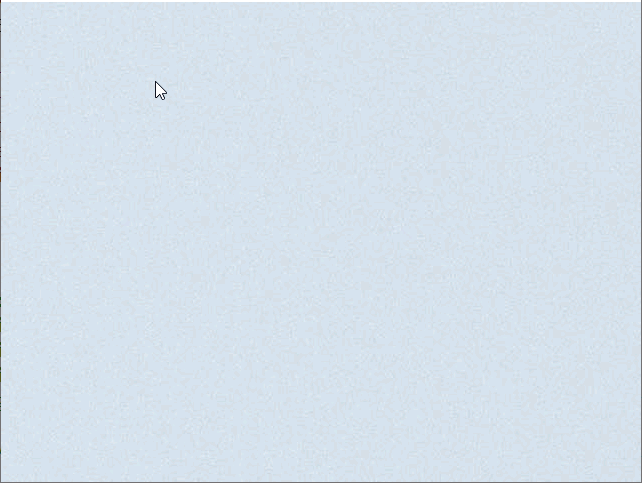

# 可拖动、轻拂区域

Flickable 项将子项放置在一个可以拖动和轻拂的表面上，从而导致子项视图滚动。这种行为构成了诸如 ListView 和 GridView 等旨在展示大量子项的项的基础。

在传统的用户界面中，视图可以通过标准控件（如滚动条和箭头按钮）进行滚动。在某些情况下，也可以通过按住鼠标按钮并移动光标直接拖动视图。在基于触摸的用户界面中，这种拖动操作通常会与轻拂操作相结合，即在用户停止触摸视图后滚动仍会继续。

Flickable 不会自动裁剪其内容。如果它不是用作全屏项，则应考虑将 clip 属性设置为 true。

## Flickable

### 示例

以下示例展示了一个大图像的小视图，用户可以在其中拖动或轻拂图像以查看其不同部分。

```js
import QtQuick

Window {
    id:root
    width:640
    height:480
    visible: true

    Flickable {
        contentWidth: image.width
        contentHeight: image.height
        anchors.fill: parent

        Image { id: image; source: "file:///F:/MyCode/test_code/test_qml/learn_qml/Resource/images/张佳宁.jpg" }
    }
}
```


由于实现细节，放置在 Flickable 内的项目不能锚定到 Flickable。声明为Flickable的子元素会自动设置为**contentItem**的子项，**contentItem** 的大小由 **contentWidth** 和 **contentHeight** 决定。 

 **contentX** 和 **contentY**是内容区域坐标，对于上面也就是图片左上角在Flickable上的坐标。

### 属性

#### 1. 移动

```c
moving : bool [read-only]
movingHorizontally : bool [read-only]
movingVertically : bool [read-only]
```

这些属性描述了视图当前是在水平方向、垂直方向上移动，还是在两个方向上同时移动，这是由于用户通过**拖动**或**滑动**操作使视图发生移动所致。

#### 2. 拖动

```c
dragging : bool [read-only]
draggingHorizontally : bool [read-only]
draggingVertically : bool [read-only]
```

这些属性描述了视图当前是否正在水平方向、垂直方向或在任意方向上移动，这种移动是由于用户**拖动视图**所致。

> 必须要按下鼠标不松开，这些属性才可能为true，具体取决于当前正在个方向移动

#### 3. 滑动

```c
flicking : bool [read-only]
flickingHorizontally : bool [read-only]
flickingVertically : bool [read-only]
```

这些属性描述了视图当前是否正在水平方向、垂直方向或在任意方向上移动，这是由于用户对视图进行了**滑动**操作所致。

> 只要视图正在滑动中，这些属性就可能为真

#### 4. 内容起始坐标

```c
originX : real [read-only]
originY : real [read-only]
```

这些属性保存着内容的起始位置信息。无论布局方向如何，此值始终指代内容的左上角位置。通常情况下，其坐标为(0,0)。

#### 5. 边距

```c
bottomMargin : real
leftMargin : real
rightMargin : real
topMargin : real
```

这些属性控制着内容周围的边距。此空间是在内容宽度和内容高度之外额外预留的。

#### 6. 视图位置

```c
atXBeginning : bool [read-only]
atXEnd : bool [read-only]
atYBeginning : bool [read-only]
atYEnd : bool [read-only]
```

如果可拖动视图位于开头或结尾位置，那么这些属性就是有效的。

#### 7. 移动速度

```c
horizontalVelocity : real [read-only]
verticalVelocity : real [read-only]
```

沿 x 轴和 y 轴的瞬时移动速度（以像素/秒为单位）。

#### 8. 超调量

```c
horizontalOvershoot : real [read-only]
verticalOvershoot : real [read-only]
```

水和平垂直方向的超调量，即内容被拖动或滑动超出可滑动区域边界的水平或垂直距离。当内容被拖动或滑动超出起始位置时，该值为负；超出结束位置时为正；否则为 0.0。

是否报告拖动和/或滑动的值由 boundsBehavior 决定。即使 boundsMovement 为 Flickable.StopAtBounds，也会报告超调距离。

#### 9. 边界行为

```c
boundsBehavior : enumeration
```

当“边界移动”属性设置为“可滑动跟随边界行为”时，如果选择的值不是“可滑动停止在边界处”，那么就会给人一种视图边缘较为柔和而非硬性边界的感觉。

边界属性可以是以下枚举值之一：

+ **Flickable.StopAtBounds：**内容不能超出边界
+ **Flickable.DragOverBounds：**内容可以超出可滚动区域的边界进行拖动，但滚动操作不会超出边界范围。

+ **Flickable.OvershootBounds：**当进行滑动操作时，内容可能会超出边界，但不能将内容拖拽到不可滑动区域之外。

+ **Flickable.DragAndOvershootBounds：**(默认值)其内容可以超出可滚动区域的边界，并且在滑动操作时可能会超出该边界。

#### 10. 边界移动

```c
boundsMovement : enumeration
```

运动范围可以是以下之一：

+ **Flickable.StopAtBounds：**这种设置方式允许实现自定义边缘效果，即内容不会因拖动或轻拂而超出可拖动区域的边界。可以利用水平超伸量和垂直超伸量的值来实现自定义边缘效果。
+ **Flickable.FollowBoundsBehavior：**（默认值） 决定内容是否跟随超出可拖动区域边界的拖动或轻拂操作的选项由 boundsBehavior 控制。

以下示例会将内容限制在一定范围内，并在超出水平边界时应用翻转效果：

```js
    Flickable {
        id:flickable
        contentWidth: image.width
        contentHeight: image.height
        anchors.fill: parent
        boundsBehavior: Flickable.DragAndOvershootBounds
        boundsMovement: Flickable.StopAtBounds

        transform: Rotation {
               axis { x: 0; y: 1; z: 0 }
               origin.x: flickable.width / 2
               origin.y: flickable.height / 2
               angle: Math.min(30, Math.max(-30, flickable.horizontalOvershoot))
           }

        Image { id: image;
            source: "file:///F:/MyCode/test_code/test_qml/learn_qml/Resource/images/张佳宁.jpg"
            width: implicitWidth/3
            height: implicitHeight/3
        }
    }
```


以下示例会将内容限制在一定范围内，并在拖动至垂直边界时应用不透明度效果：

```js
        boundsBehavior: Flickable.DragAndOvershootBounds
        boundsMovement: Flickable.StopAtBounds        
		opacity: Math.max(0.5, 1.0 - Math.abs(verticalOvershoot)/height)
```


#### 11. 减速率

```c
flickDeceleration : real
```

此属性决定了手指滑动减速的速率：数值越大，用户通过触摸停止滑动时减速的速度就越快。例如，0.0001 大约是“几乎没有摩擦力”的状态，而 10000 则感觉像是“非常粘”的状态。

#### 12. 滑动方向

```c
flickableDirection : enumeration
```

此属性决定了视图可以进行滑动操作的方向。

+ **Flickable.AutoFlickDirection：**（默认值）若内容高度与 Flickable 的高度不相等，则允许进行垂直方向的滑动。若内容宽度与 Flickable 的宽度不相等，则允许进行水平方向的滑动。
+ **Flickable.AutoFlickIfNeeded：** 若内容高度大于 Flickable 的高度，则允许进行垂直方向的滑动。若内容宽度大于 Flickable 的宽度，则允许进行水平方向的滑动。
+ **Flickable.HorizontalFlick：** 允许进行水平方向的滑动。
+ **Flickable.VerticalFlick：** 允许进行垂直方向的滑动。
+ **Flickable.HorizontalAndVerticalFlick：** 允许在两个方向上进行滑动。

#### 13. 滑动速度

```c
maximumFlickVelocity : real
```

此属性表示滑动内容时，内容自动滑动的速度。能够以每秒多少像素的速度快速移动视图的最大速度。

> 默认值取决于平台，我测试是2500，也就是说每秒最大能自动滑动2500个像素。

#### 14. 返回边界过渡

```c
rebound : Transition
```

此代码将该过渡效果应用于内容视图，使其在恢复到可滑动区域的边界时生效。该过渡效果会在视图因滑动或拖动而超出内容区域边缘时触发，或者在调用 returnToBounds() 时触发。

当下面视图超出其边界时，它会按照指定的过渡效果返回至其边界位置：

```c
        rebound:Transition {
            NumberAnimation{
                properties: 'x,y'
                duration: 1000
                easing.type: Easing.OutBounce
            }

        }
```



### 信号

1、flickEnded()

> 当视图因轻弹而停止移动时发出此信号。

2、flickStarted()

> 当视图被轻弹时发出这个信号。轻弹从鼠标或触摸被释放时开始。

3、movementEnded()

>  当视图由于用户交互或生成的 flick() 而停止移动时会发出此信号。

4、movementStarted()

> 当视图由于用户交互或生成的 flick() 而开始移动时会发出此信号。

### 函数

1、cancelFlick()

> 取消当前的轻弹动画。

2、flick(qreal xVelocity, qreal yVelocity)

> 使用 xVelocity 水平滑动内容，yVelocity 垂直滑动（以像素/秒为单位）。调用此方法会更新相应的移动和轻弹属性和信号，就像真正的轻弹一样。

3、resizeContent(real width, real height, QPointF center)

> 将 content 的大小调整为围绕中心的 width * height。
>
> 这不会缩放 Flickable 的内容 - 它只会调整 contentWidth 和 contentHeight。
>
> 调整 content 大小可能会导致内容位于 Flickable 的边界之外。调用 returnToBounds() 会将 content 移回合适范围内。

4、returnToBounds()

> 确保 content 在合适范围内。


### 其他示例

+ 给Flickable加上滚动条

```qml
import QtQuick
import QtQuick.Controls
import QtQuick.Controls.Basic

Window {
    id:root
    width:640
    height:480
    visible: true


    Flickable {
        id: flickable
        anchors.fill: parent

        Image {
            id: img
            source: "file:///F:/MyCode/test_code/test_qml/learn_qml/Resource/images/张佳宁.jpg"
            //fillMode: Image.PreserveAspectFit
            //transformOrigin: Item.Center
        }

        contentWidth: img.width
        contentHeight: img.height
        rebound: Transition {
            NumberAnimation {
                properties: "x, y"
                duration: 500
                easing.type: Easing.OutBounce
            }
        }
        ScrollBar.vertical: ScrollBar {
            //background: Rectangle {
            //    color: "#ffffff"
            //}
            interactive: true
        }
        ScrollBar.horizontal: ScrollBar {
            //background: Rectangle {
            //    color: "#ffffff"
            //}
            interactive: true
        }
    }
}
```

