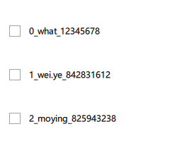

# ListView

一个列表视图会显示来自基于内置 QML 类型（如 ListModel 和 XmlListModel）创建的模型，或者来自在 C++ 中定义的、继承自 QAbstractItemModel 或 QAbstractListModel 的自定义模型类的数据。

ListView 有一个模型，用于定义要显示的数据；还有一个委托，用于定义数据的显示方式。ListView 中的项目是水平排列或垂直排列的。由于 ListView 继承自 Flickable 类，所以它本身就具有可滑动性。

## 示例

### 整型模型

```qml
    ListView{
        width:280
        height:parent.height

        model: 3

        delegate: Text{
            text: index
            color: 'black'
        }
    }
```

`index`是一个内置属性。它的作用是表明当前被渲染的模型项在模型中的位置。由于模型是`model: 3`，这意味着模型会生成 3 个项，索引依次为 0、1、2。所以，这 3 个文本项会分别显示 "0"、"1"、"2"。

### 列表模型

```qml
    ListView{
        x:280
        width:280
        height:parent.height

        model: ["one","two","three"]

        delegate: Text{
            text: index +'_'+ modelData
            color: 'black'
        }
    }
```

`modelData`是一个内置属性。它的作用是表明当前被渲染的模型项的数据。也就是list["one","two","three"]中的每个元素。

### 对象列表模型

```qml
    ListView{
        x:280
        width:280
        height:parent.height
        spacing:10

        model: [
            {name:'what',qq:'12345678'},
            {name:'wei.ye',qq:'842831612'},
            {name:'moying',qq:'825943238'}
        ]

        delegate: Text{
            text: index +'_'+ modelData.name+'_'+ modelData.qq
            color: 'black'
        }
    }
```

使用对象作为模型数据，可以在delegate中，通过modelData.属性名，访问对象中的属性。

### ObjectModel

```qml
	import QtQml.Models
	...
 	ObjectModel {
         id: itemModel
         Rectangle { height: 30; width: 80; color: "red" }
         Rectangle { height: 30; width: 80; color: "green" }
         Rectangle { height: 30; width: 80; color: "blue" }
     }

     ListView {
         width:300
         height:200
         y:300
         model: itemModel
     }
```

使用了`ObjectModel`作为 ListView 的模型，每个模型项本身就是一个可视化的矩形组件。这种方法的优点是简洁直观，适合直接嵌入复杂组件。

### ListModel

```qml
    ListView{
        x:280
        width:280
        height:parent.height
        spacing:10

        model: ListModel{
            ListElement{name:'what';qq:'12345678'}
            ListElement{name:'wei.ye';qq:'842831612'}
            ListElement{name:'moying';qq:'825943238'}
        }

        delegate: Text{
            text: index +'_'+ name+'_'+ qq
            color: 'black'
        }
    }
```

`ListModel`是 Qt Quick 提供的更专业的模型类型，适合动态添加 / 删除项。

## 委托

### 选择委托

#### CheckDelegate

```qml
    ListView{
        x:280
        width:280
        height:parent.height
        spacing:10

        model: ListModel{
            ListElement{name:'what';qq:'12345678'}
            ListElement{name:'wei.ye';qq:'842831612'}
            ListElement{name:'moying';qq:'825943238'}
        }

        delegate: CheckDelegate{
                text: index +'_'+ name+'_'+ qq
                LayoutMirroring.enabled: true
                indicator.width: 16
                indicator.height: 16
        }
    }
```



#### RadioDelegate

使用RadioDelegate，并绘制自定义背景以及内容。

```qml
   ListView{
        x:280
        y:20
        width:280
        height:parent.height
        spacing:10

        model: ListModel{
            ListElement{name:'what';qq:'12345678'}
            ListElement{name:'wei.ye';qq:'842831612'}
            ListElement{name:'moying';qq:'825943238'}
        }

        delegate: CheckDelegate{
        		//让委托的宽度和ListView一样，这样绘制背景时才会所有item都是一样的宽度
                width: parent.width

                LayoutMirroring.enabled: true
                indicator.width: 16
                indicator.height: 16

                required property int index
                required property string name
                required property string qq

				//设置背景颜色
                background: Rectangle{
                    color:'#f0f0f0'
                }
				//设置文本内容并居中对齐
                contentItem: Text{
                    text: index +'_'+ name+'_'+ qq
                    leftPadding: 30
                    verticalAlignment: Text.AlignVCenter
                }
        }
    }
```


#### SwitchDelegate

```qml
    ListView {
        id:listView
        width:200
        height:parent.height
        spacing: 6
        focus: true


        model: ["Option 1", "Option 2", "Option 3"]
        delegate: SwitchDelegate {
            id:switchDelegate
            text: modelData +'_'+ index
            width: parent.width
            LayoutMirroring.enabled: true

            // 可选属性：开关打开时的颜色
            property color activeColor: "#4CD964"  // 绿色
            // 可选属性：开关关闭时的颜色
            property color inactiveColor: "#E0E0E0"  // 浅灰色
            // 可选属性：开关按钮颜色
            property color thumbColor: "white"

            required property int index
            required property string modelData

			//点击是切换当前item
            onClicked: listView.currentIndex = index

            //背景
            background:Rectangle{
                color:switchDelegate.hovered?'#cdcdcd':(listView.currentIndex === index?'#a6a6a6':'#f0f0f0')
            }


            //指示器(开关按钮)
            indicator:Item{
                width: 60
                height:25
                x:6
                anchors.verticalCenter: parent.verticalCenter

                Rectangle {
                    id: groove
                    anchors.fill: parent
                    radius: height / 2
                    color: checked ? activeColor : (hovered ? "#F0F0F0" : inactiveColor)
                    border.color: checked ? activeColor : "#CCCCCC"
                    border.width: 0

                    Rectangle {
                        id: thumb
                        width: parent.height - 8
                        height: width
                        radius: width / 2
                        color: thumbColor
                        anchors.verticalCenter: parent.verticalCenter
                        x: checked ? (parent.width - width - 4) : 4

                        // 开关切换动画
                        Behavior on x {
                            NumberAnimation {
                                duration: 200
                                easing.type: Easing.InOutQuad
                            }
                        }
                    }

                    // 悬停效果
                    MouseArea {
                        id: mouseArea
                        anchors.fill: parent
                        hoverEnabled: true

                        onClicked:{
                            //切换选择状态
                            switchDelegate.checked = !switchDelegate.checked
                            //设置当前选中的item
                            listView.currentIndex = switchDelegate.index
                            console.log(listView.currentItem,switchDelegate,index)
                        }
                    }
                }
            }
        }
    }
```


```qml
 ListView {
        id:listView
        width:200
        height: parent.height
        anchors.centerIn: parent
        spacing: 6
        focus: true

		//新增高亮部分
        highlightFollowsCurrentItem: true
        highlight: Rectangle{
            radius: height/2
            y:listView.currentItem.y
            color:'#cdcdcd'
        }

        model: ["Option 1", "Option 2", "Option 3"]
        delegate: SwitchDelegate {
            id:switchDelegate
            text: modelData +'_'+ index
            width: parent.width
            LayoutMirroring.enabled: true

            // 可选属性：开关打开时的颜色
            property color activeColor: "#4CD964"  // 绿色
            // 可选属性：开关关闭时的颜色
            property color inactiveColor: "#E0E0E0"  // 浅灰色
            // 可选属性：开关按钮颜色
            property color thumbColor: "white"

            required property int index
            required property string modelData

            onClicked: listView.currentIndex = index

            //背景部分进行了修改
            background:Rectangle{
                color:switchDelegate.pressed?'#606060':(switchDelegate.hovered?'#cdcdcd':'#0')
                radius: height/2
                visible: switchDelegate.hovered
            }
          //剩下部分未改动
```


### 滑动委托

#### SwipeDelegate

```qml
    ListView{
        id:listView
        x:280
        width:280
        height:parent.height
        spacing:10
        clip:true

        model: ListModel {
                ListElement { sender: "Bob Bobbleton"; title: "How are you going?" }
                ListElement { sender: "Rug Emporium"; title: "SALE! All rugs MUST go!" }
                ListElement { sender: "Electric Co."; title: "Electricity bill 15/07/2016 overdue" }
                ListElement { sender: "Tips"; title: "Five ways this tip will save your life" }
            }
            delegate: SwipeDelegate {
                id: swipeDelegate
                text: sender + " - " + title
                width: listView.width

                required property string sender
                required property string title
                required property int index

                SequentialAnimation {
                    id:seqAnimation
                    PropertyAction {
                        target: swipeDelegate
                        property: "ListView.delayRemove"
                        value: true
                    }
                    NumberAnimation {
                        target: swipeDelegate
                        property: "height"
                        to: 0
                        easing.type: Easing.InOutQuad
                    }
                    PropertyAction {
                        target: swipeDelegate
                        property: "ListView.delayRemove"
                        value: false
                    }
                }

                ListView.onRemove: seqAnimation.start()

                swipe.right: Label {
                    id: deleteLabel
                    text: qsTr("Delete")
                    color: "white"
                    verticalAlignment: Label.AlignVCenter
                    padding: 12
                    height: parent.height
                    anchors.right: parent.right

                    SwipeDelegate.onClicked: listView.model.remove(index)

                    background: Rectangle {
                        color: deleteLabel.SwipeDelegate.pressed ? Qt.darker("tomato", 1.1) : "tomato"
                    }
                }
                swipe.left: Button{
                    text: 'xxxx'
                }
            }
    }
```


## 其他

```qml
    ListModel{
        id:listModel
        ListElement{name:"张三";age:14}
        ListElement{name:"李四";age:15}
        ListElement{name:"王五";age:16}
        ListElement{name:"莫影";age:17}
        ListElement{name:"顽石";age:18}
        ListElement{name:"清者";age:19}
        ListElement{name:"伊伊";age:20}
        ListElement{name:"如也";age:21}
        ListElement{name:"betty";age:22}
        ListElement{name:"天明";age:23}
    }

    ListView{
        id:listView
        anchors.fill: parent
        anchors.rightMargin: 100
        spacing:10
        model:listModel
        //委托，决定数据如何显示
        delegate: Rectangle{
            id:rectDelegate
            width:listView.width

            height:35
            color:'red'
            border.color: 'yellow'
            border.width: 1

            Text{
                anchors.centerIn: parent
                font.pointSize:20
                text:name +'-'+age
            }


            MouseArea{
                anchors.fill: parent
                hoverEnabled: true
                onEntered: {
                    listView.currentIndex = index
                    listView.highlightItem.setText(name,age)
                }
            }
        }
        //头
        //headerPositioning:ListView.OverlayHeader  //固定不动
        headerPositioning:ListView.PullBackHeader   //可以通过滑动视图，将头往上推，滑动之后会自动还原，不能往下拉
        header:Rectangle{
          width: listView.width
          height:35
          color: 'green'
          //border.color: 'yellow'
          //border.width: 1
          Text {
              anchors.centerIn: parent
              font.pointSize: 20
              text: qsTr("信息")
          }
        }
        //尾
        //footerPositioning:ListView.OverlayFooter
        footerPositioning:ListView.PullBackFooter   //通过往上滑动视图显示尾，滑动之后会自动隐藏到listview最下面
        footer:Rectangle{
          width: listView.width
          height:35
          color: 'green'
          z:1.1
          //border.color: 'yellow'
          //border.width: 1
          Text {
              anchors.centerIn: parent
              font.pointSize: 20
              text: qsTr("信息")
          }

          onVisibleChanged: console.log('footer',visible)
          onYChanged: console.log('y',y)
        }

        //高亮
        highlightFollowsCurrentItem:true
        //highlightMoveDuration:100
        //highlightMoveVelocity:1000
        //highlightResizeDuration:1000
        highlight: Rectangle{
            //width:parent.width
            //height:
            color: '#cdcdcd'
            z:1.1

            Text{
                id:text
                anchors.centerIn: parent
                font.pointSize:20
                text:'-'
            }
            function setText(name,age){
                text.text = name+'-'+age;
            }
        }

        //添加item动画
        add: Transition {
            NumberAnimation{property:'y';from:listView.height;duration: 500}
        }
        addDisplaced: Transition {
               NumberAnimation{property:'y';duration: 500}
        }
        //删除item动画
        remove: Transition {
            NumberAnimation{property:'opacity';to:0;duration: 500}
        }
        removeDisplaced: Transition {
            NumberAnimation{property:'y';duration: 500}
        }
    }

    Column{
        anchors.right:parent.right
        anchors.rightMargin:15

        Button{
            text: '添加一条'
            width:70
            height:35

            property int idx: 0
            onClicked: {
                listView.model.insert(0,{name:'赵日天',age:100+idx})
                idx +=1
            }
        }
        Button{
            text: '删除一条'
            width:70
            height:35
            onClicked: {
                if(listView.count>0)
                    listView.model.remove(0)
            }
        }
    }
```

