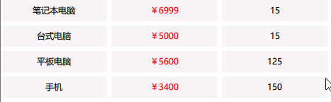
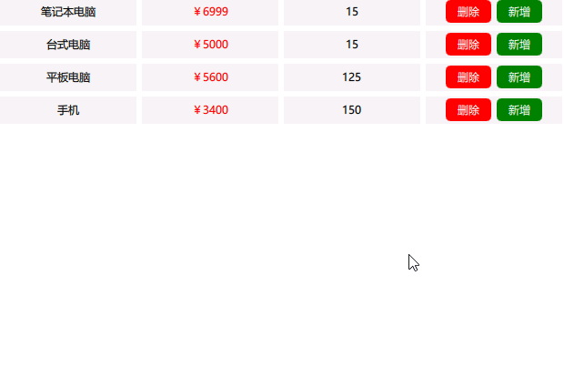

# TableView

表格视图（TableView）有一个模型，用于定义要显示的数据，还有一个委托，用于定义数据的显示方式。

TableView 继承自 Flickable。这意味着尽管模型可以有任意数量的行和列，但通常只有表格的一部分在视口内可见。一旦您进行滑动操作，新的行和列就会进入视口，而旧的行和列则会移出视口并从视口中移除。移出的行和列会被重新用于构建进入视口的行和列。因此，TableView 支持任意大小的模型，而不会影响性能。

一个表格视图会显示由内置的 QML 类型（如 ListModel 和 XmlListModel）创建的数据，这些数据仅会在表格视图的第一列中进行填充。若要创建具有多列的模型，可以使用 TableModel 或继承自 QAbstractItemModel 的 C++ 模型。

默认情况下，表格视图不包含标题。您可以通过使用 Qt Quick Controls 中的“HorizontalHeaderView”和“VerticalHeaderView”来添加标题。

## 示例

### TableView基本使用

TableModel使用和TableView基本属性。

```qml
    TableModel{
        id:tableModel

        //每行数据
        rows:[
            {product:"笔记本电脑",price:"6999",stock:15},
            {product:"台式电脑",price:"5000",stock:15},
            {product:"平板电脑",price:"5600",stock:125},
            {product:"手机",price:"3400",stock:150},
        ]

        //每列显示对象的什么数据
        TableModelColumn{display:'product'}
        TableModelColumn{display:'price'}
        TableModelColumn{display:'stock'}
    }

    //定义属性
    property int hoveredRow:-1
    property int selectedRow:-1
    
    TableView{
        id:tableView
        anchors.fill: parent

        model: tableModel

        //列宽提供者，必须保存函数，然后根据不同的列返回宽度
        columnWidthProvider:function columnWidth(column){
            return 150
        }
        //列间距
        columnSpacing:6
        //行间距
        rowSpacing:6

        //委托
        delegate:Rectangle{
            //必须添加委托的隐士高度
            implicitHeight: 30
            //color:'#f0f0f0'
            //color:tableView.currentRow == index ? '#cdcdcd':'#f0f0f0'
            color:hoveredRow == row ? '#cdcdcd':(selectedRow == row?'#a6a6a6' : '#f0f0f0')
            Text {
                //text:  display
                text:column ==1 ?"￥" +  display:display
                color:column == 1 ?'red':'black'
                anchors.centerIn: parent
            }

            Component.onCompleted: console.log('row:',row,'column:',column)

            //鼠标区域:用来记录点击的行和鼠标悬停的行
            MouseArea{
                anchors.fill: parent
                hoverEnabled: true

                onEntered: hoveredRow = row
                onExited: hoveredRow = -1
                onClicked: selectedRow = row
            }
        }
    }
```



要记录鼠标悬停和点击的行，还可以把委托和MouseArea分离开，更加方便

```qml
        //委托
        delegate:Rectangle{
            //必须添加委托的隐士高度
            implicitHeight: 30
            //color:'#f0f0f0'
            //color:tableView.currentRow == index ? '#cdcdcd':'#f0f0f0'
            color:hoveredRow == row ? '#cdcdcd':(selectedRow == row?'#a6a6a6' : '#f0f0f0')
            Text {
                //text:  display
                text:column ==1 ?"￥" +  display:display
                color:column == 1 ?'red':'black'
                anchors.centerIn: parent
            }

            Component.onCompleted: console.log('row:',row,'column:',column)
        }

        //鼠标区域:用来记录点击的行和鼠标悬停的行
        MouseArea{
            anchors.fill: parent
            hoverEnabled: true

            onPositionChanged: function(){
                //获取当前鼠标所在的
                var p = tableView.cellAtPosition(mouseX,mouseY,true)
                console.log(p)
                hoveredRow = p.y
            }
            //onEntered:function(){ hoveredRow = -1}
            onExited:function(){ hoveredRow = -1}
            onClicked: function(){
                var p = tableView.cellAtPosition(mouseX,mouseY,true)
                selectedRow = p.y
            }
        }
```


通过`text:column ==1 ?"￥" +  display:display`可以让每列文本添加不同的内容，通过`  color:column == 1 ?'red':'black'`可以让每列拥有不同的颜色，但是如果想要让每列的委托不一样，需要使用委托选择器`DelegateChooser`。

### 委托选择器

```qml
    TableModel{
        id:tableModel

        //每行数据
        rows:[
            {product:"笔记本电脑",price:"6999",stock:15,option:true},
            {product:"台式电脑",price:"5000",stock:15,option:true},
            {product:"平板电脑",price:"5600",stock:125,option:true},
            {product:"手机",price:"3400",stock:150,option:true},
        ]

        //每列显示对象的什么数据
        TableModelColumn{display:'product'}
        TableModelColumn{display:'price'}
        TableModelColumn{display:'stock'}
        TableModelColumn{display:'option'}
    }

    //定义属性
    property int hoveredRow:-1
    property int selectedRow:-1

    TableView{
        id:tableView
        anchors.fill: parent
        animate: true

        model: tableModel

        //列宽提供者，必须保存函数，然后根据不同的列返回宽度
        columnWidthProvider:function columnWidth(column){
            return 150
        }
        //列间距
        columnSpacing:6
        //行间距
        rowSpacing:6

        //委托
        delegate:DelegateChooser{
            id:mdelegate
            DelegateChoice{
                column: 0
                delegate:Rectangle{
                    id:r
                    //必须添加委托的隐士高度
                    implicitHeight: 30
                    //color:'#f0f0f0'
                    //color:tableView.currentRow == index ? '#cdcdcd':'#f0f0f0'
                    color:hoveredRow == row ? '#cdcdcd':(selectedRow == row?'#a6a6a6' : '#f0f0f0')
                    Text {
                        text:display
                        color:'black'
                        anchors.centerIn: parent
                    }

                }
            }
            DelegateChoice{
                column: 1
                delegate:Rectangle{
                    //必须添加委托的隐士高度
                    implicitHeight: 30
                    //color:'#f0f0f0'
                    //color:tableView.currentRow == index ? '#cdcdcd':'#f0f0f0'
                    color:hoveredRow == row ? '#cdcdcd':(selectedRow == row?'#a6a6a6' : '#f0f0f0')
                    Text {
                        //text:  display
                        text:"￥" +  display
                        color:'red'
                        anchors.centerIn: parent
                    }

                }
            }
            DelegateChoice{
                column: 2
                delegate:Rectangle{
                    //必须添加委托的隐士高度
                    implicitHeight: 30
                    //color:'#f0f0f0'
                    //color:tableView.currentRow == index ? '#cdcdcd':'#f0f0f0'
                    color:hoveredRow == row ? '#cdcdcd':(selectedRow == row?'#a6a6a6' : '#f0f0f0')
                    Text {
                        //text:  display
                        text:display
                        color:'black'
                        anchors.centerIn: parent
                    }

                }
            }
            DelegateChoice{
                column: 3
                delegate:Rectangle{
                    id:delegate_3
                    //必须添加委托的隐士高度
                    implicitHeight: 30
                    //color:'#f0f0f0'
                    //color:tableView.currentRow == index ? '#cdcdcd':'#f0f0f0'
                    color:hoveredRow == row ? '#cdcdcd':(selectedRow == row?'#a6a6a6' : '#f0f0f0')

                    Row{
                        anchors.centerIn: parent
                        spacing:6
                        Rectangle{
                            color:'red'
                            width: 50
                            height: 25
                            radius:5

                            Text{
                                text: '删除'
                                color: 'white'
                                anchors.centerIn: parent
                            }

                            MouseArea{
                                anchors.fill: parent
                                onClicked: {
                                    tableView.model.removeRow(row)
                                }
                            }
                        }
                        Rectangle{
                            color:'green'
                            width: 50
                            height: 25
                            radius:5

                            Text{
                                text: '新增'
                                color: 'white'
                                anchors.centerIn: parent
                            }

                            MouseArea{
                                anchors.fill: parent
                                onClicked: {
                                    //获取当前行数据
                                    var rowObj = tableView.model.getRow(row)
                                    console.log(rowObj.product,rowObj.price,rowObj.stock)
                                    //插入一行和当前行一样的数据
                                    tableView.model.appendRow(rowObj)
                                }
                            }
                        }
                    }
                }
            }
        }

        //鼠标区域:用来记录点击的行和鼠标悬停的行
        MouseArea{
            anchors.fill: parent
            hoverEnabled: true

            onPositionChanged: function(){
                //获取当前鼠标所在的
                var p = tableView.cellAtPosition(mouseX,mouseY,true)
                //console.log(p)
                hoveredRow = p.y
            }
            //onEntered:function(){ hoveredRow = -1}
            onExited:function(){ hoveredRow = -1}
            onClicked: function(){
                var p = tableView.cellAtPosition(mouseX,mouseY,true)
                selectedRow = p.y
            }
        }
    }
}
```

