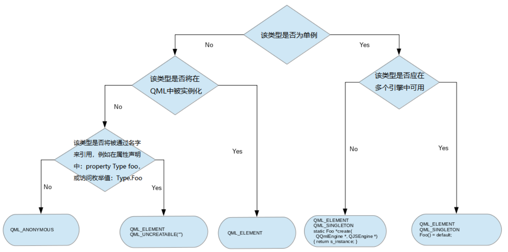
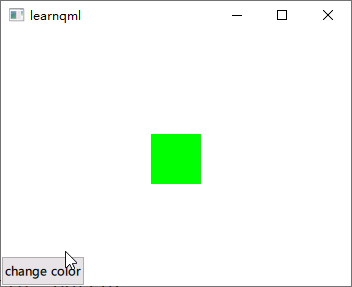
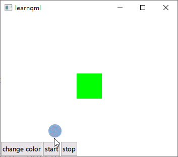
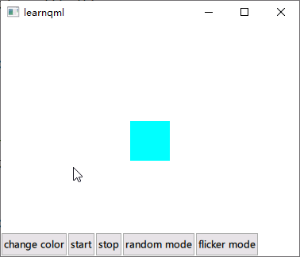

# QML和C++集成

> Overview - QML and C++ Integration

QML 被设计为可通过 C++ 代码轻松扩展。Qt Qml 模块中的类使 QML 对象能够从 C++ 中加载和操作，并且 QML 引擎与 Qt 元对象系统的集成方式使得可以直接从 QML 调用 C++ 功能。这允许开发混合应用程序，这些应用程序由 QML、JavaScript 和 C++ 代码混合实现。

将 QML 和 C++ 集成提供了多种机会，包括能够：

+ 将**用户界面**代码与应用**程序逻辑**代码分离，前者通过在 QML 文档中使用 QML 和 JavaScript 实现，后者使用 C++ 实现。
+ 从 QML 中使用和调用一些 C++ 功能（例如，调用您的应用程序逻辑、使用在 C++ 中实现的数据模型，或者调用第三方 C++ 库中的某些函数）。
+ 访问 Qt Qml 或 Qt Quick C++ API 中的功能（例如，使用 QQuickImageProvider 动态生成图像）。
+ 从 C++ 实现您自己的 QML 对象类型——无论是用于您自己的特定应用程序，还是分发给其他人。+

若要将一些 C++ 数据或功能提供给 QML，必须将其放入一个继承自QObject的类中。由于 QML 引擎与元对象系统的集成，任何派生自 QObject 的类的属性、方法和信号都可以在 QML 中访问，详情请参阅[《将 C++ 类型的属性暴露给 QML》](#将C++属性暴漏给QML)。一旦通过这样的类提供了所需的功能，就可以以多种方式将其暴露给 QML：

+ 该类可以被注册为**可实例化**的 QML 类型，这样一来，就可以像使用任何普通的 QML 对象类型一样从 QML 代码中对其进行实例化和使用了。
+ 该类可以被注册为**单例**类型，这样就可以从 QML 代码中导入该类的一个实例，从而能够从 QML 中访问该实例的属性、方法和信号。
+ 该类的一个实例可以作为**上下文属性或上下文对象**嵌入到 QML 代码中，从而使得可以从 QML 中访问该实例的属性、方法和信号。

这些是通过 QML 代码访问 C++ 功能的最常见方法；如需更多选项及详细信息，请参阅以下各节中所描述的主要文档页面。此外，除了能够从 QML 中访问 C++ 功能之外，Qt 的 Qml 模块还提供了从 C++ 代码反向操作 QML 对象的方法。有关更多详细信息，请参阅“在 C++中 与 QML 对象进行交互”。

通常情况下，将某些状态作为全局属性暴露给 QML 是很有必要的。从 C++ 将状态暴露给 QML 的方法描述如下。

最后，C++ 代码可以集成到 C++ 应用程序或 C++ 插件中，具体取决于是要将其作为独立应用程序还是库进行分发。插件可以与 QML 模块集成，然后该模块可以被其他应用程序中的 QML 代码导入并使用；有关更多信息，请参阅《在 C++ 插件中提供类型和功能》。

## 选择 C++ 与 QML 之间的正确集成方式

要快速确定哪种整合方法适合您的情况，可以参考以下流程图：



## 向 QML 公开 C++ 类型的属性

>  Exposing Attributes of C++ Classes to QML

由于 QML 引擎与 Qt 元对象系统的集成，QML 可以很容易地用 C++ 扩展。这种集成可以让 QML 访问任何 [QObject](https://thinkinginqt.com/doc/qtcore/qobject.html) 派生类的属性、方法和信号：可以读取和修改属性，可以在 JavaScript 表达式里调用方法，并根据需要为信号自动创建信号处理程序。此外，可以在 QML 访问 [QObject](https://thinkinginqt.com/doc/qtcore/qobject.html) 派生类的枚举值。

有关详细信息，请参阅 [向 QML 公开 C++ 类型的属性](https://thinkinginqt.com/doc/qtqml/qtqml-cppintegration-exposecppattributes.html)。

## 在 C++ 中定义 QML 类型

>  Defining QML Types from C++

QML 类型可以在 C++ 中定义，然后在 [QML类型系统](https://thinkinginqt.com/doc/qtqml/qtqml-typesystem-topic.html) 中注册。这可以将 C++ 类实例化为 [QML 对象类型](https://thinkinginqt.com/doc/qtqml/qtqml-typesystem-objecttypes.html)，从而使自定义对象类型可以用 C++ 实现，并集成到现有的 QML 代码中。C++ 类也可以出于其他目的进行注册：例如，它可以注册为 *单例类型*，来让 QML 代码导入单个类实例，也可以注册为可以在 QML 访问的不可实例化类的枚举值。

此外，[Qt QML](https://thinkinginqt.com/doc/qtqml/qtqml-index.html) 模块提供了定义 QML 类型的机制，这些类型与附加属性和默认属性等 QML 概念集成。

有关 C++ 注册和创建自定义 QML 类型的更多信息，请参阅 [在 C++ 中定义 QML 类型](https://thinkinginqt.com/doc/qtqml/qtqml-cppintegration-definetypes.html) 文档。

## 使用上下文属性将 C++ 对象嵌入 QML 中

>  Embedding C++ Objects into QML with Context Properties

C++ 对象和值可以使用 *上下文属性* 和 *上下文对象* 直接嵌入到已加载 QML 对象的上下文（或 *范围*）中。这是通过 [Qt QML](https://thinkinginqt.com/doc/qtqml/qtqml-index.html) 模块提供的 [QQmlContext](https://thinkinginqt.com/doc/qtqml/qqmlcontext.html) 类实现的，该类将数据公开到 QML 组件的上下文中，可以将数据从 C++ 注入 QML。

有关更多信息，请参阅 [使用上下文属性将 C++ 对象嵌入 QML 中](https://thinkinginqt.com/doc/qtqml/qtqml-cppintegration-contextproperties.html)。

## 在 C++ 中与 QML 对象交互

> Interacting with QML Objects from C++

QML 对象类型可以在 C++ 实例化并检查，以便访问它们的属性、调用它们的方法和接收它们的信号通知。这是因为所有 QML 对象类型都是使用 [QObject](https://thinkinginqt.com/doc/qtcore/qobject.html) 派生类实现的，QML 引擎能够通过 Qt 元对象系统动态加载和内省对象。

**警告：**虽然可以在 C++ 访问 QML 对象并对其进行操作，但除了用于测试和原型设计之外，不建议使用这种方法。QML 与 C++ 混合编程的优势之一是能够在 QML 中独立于 C++ 逻辑和数据集后端实现 UI，如果 C++ 端直接操作 QML，优势就没了，还让我们在不影响其 C++ 对应项的情况下更改 QML UI 变得困难。

有关在 C++ 访问 QML 对象的更多信息，请参阅 [在 C++ 中与 QML 对象交互](https://thinkinginqt.com/doc/qtqml/qtqml-cppintegration-interactqmlfromcpp.html) 文档。

## QML 和 C++ 之间的数据类型转换

>  Data Type Conversion Between QML and C++

当在 QML 和 C++ 之间交换数据值时，QML 引擎会将它们转换为适合在 QML 或 C++ 使用的正确数据类型，前提是引擎知道所涉及的数据类型。

有关引擎支持的内置类型以及在 QML 和 C++ 之间交换时如何转换这些类型以供使用的信息，请参见 [QML 和 C++ 之间的数据类型转换](https://thinkinginqt.com/doc/qtqml/qtqml-cppintegration-data.html)。


# 在C++中定义QML定义

## 将C++类型暴漏给QML

定义一个C++类，必须直接或间接继承自QObject，必须包含`Q_OBJECT`宏！

**ColorMaker.h**

```cpp
#include <QObject>

class ColorMaker : public QObject
{
    Q_OBJECT
public:
    explicit ColorMaker(QObject *parent = nullptr);

signals:
};
```

**ColorMaker.cpp**

```cpp
#include "ColorMaker.h"

ColorMaker::ColorMaker(QObject *parent)
    : QObject{parent}
{}
```

**Main.qml**

```css
import ColorMaker    /*必须通过模块导入类型*/
Window{
	...
	ColorMaker{

    }
	...
}
```

此时在QML中定义`ColorMaker`类型，会直接报错！大概意思是，ColorMaker不是一个类型，也就是找不到C++中的类型！

> QQmlApplicationEngine failed to load component
> 	qrc:/qt/qml/learn_qml/Main.qml:11:5: ColorMaker is not a type

需要在C++文件中使用`qmlRegisterType`函数对类型进行注册，才能到QML中使用！！

```cpp
#include <QGuiApplication>
#include <QQmlApplicationEngine>
#include "ColorMaker.h"

int main(int argc, char *argv[])
{
    QGuiApplication app(argc, argv);

    qmlRegisterType<ColorMaker>("ColorMaker",1,0,"ColorMaker");

    QQmlApplicationEngine engine;
    QObject::connect(
        &engine,
        &QQmlApplicationEngine::objectCreationFailed,
        &app,
        []() { QCoreApplication::exit(-1); },
        Qt::QueuedConnection);
    engine.loadFromModule("learn_qml", "Main");

    return app.exec();
}
```

>注意：必须在qml引擎加载qml文件之前进行注册，也就是在engine.loadFromModule("learn_qml", "Main");之前！

注册之后再运行程序，没有任何报错信息了！

## 将C++属性暴漏给QML

在ColorMaker类中添加m_color成员，并声明为属性。

```cpp
class ColorMaker : public QObject
{
    Q_OBJECT
    Q_PROPERTY(QColor color MEMBER m_color FINAL)
public:
    explicit ColorMaker(QObject *parent = nullptr);
private:
    QColor m_color{Qt::GlobalColor::green};
};
```

在上面代码中添加了QColor成员m_color并给了一个初始值，为绿色！

接着，在QML中定义一个`Rectangle`并将样色设置为`ColorMaker`!

```css
import QtQuick
import QtQuick.Controls
import ColorMaker

Window {
    id: window
    width: 640
    height: 480
    visible: true
    title: "learnqml"

    ColorMaker{
        id:colorMaker
    }

    Rectangle{
        width: 50
        height:50
        anchors.centerIn: parent
        color:colorMaker.color
    }
}
```

可以看到矩形变成了绿色，尝试修改m_color的初始化值，观察一下颜色变化！


## 将C++信号暴漏给QML

> 信号将自动暴漏给QML，也就是说能在QML中直接通过`on<信号名>:`处理信号

虽然能运行起来，颜色也没有问题，但是下面还是有一个报错！大概的意思是`Rectangle`的color属性，绑定了`ColorMaker`的color属性，但是`ColorMaker`的属性改变时，没有发出信号通知，这会让绑定属性不生效，需要在C++中加上！

> QQmlExpression: Expression qrc:/qt/qml/learn_qml/Main.qml:20:9 depends on non-NOTIFYable properties: ColorMaker::color

修改之后`ColorMaker.h`代码如下:

```cpp
class ColorMaker : public QObject
{
    Q_OBJECT
    Q_PROPERTY(QColor color MEMBER m_color NOTIFY colorChanged  FINAL)	//颜色改变时自动发出
public:
    explicit ColorMaker(QObject *parent = nullptr);
signals:					//添加颜色改变信号
    void colorChanged();
private:
    QColor m_color{Qt::GlobalColor::green};
};
```

这样当`ColorMaker`的color属性变化时，`Rectangle`的颜色也会发生变化了！

让我们在QML新增一个按钮，点击按钮时修改一下`ColorMaker`的color属性。

```css
import QtQuick
import QtQuick.Controls
import ColorMaker

Window {
    id: root
    width: 640
    height: 480
    visible: true
    title: "learnqml"

    ColorMaker{
        id:colorMaker
        onColorChanged: console.log(color)	/*处理颜色改变信号*/
    }

    Rectangle{
        width: 50
        height:50
        anchors.centerIn: parent
        color:colorMaker.color				/*自动绑定，当colorMaker的color属性变化时，会通过信号通知矩形*/
    }

    Row{
        anchors.left: parent.left
        anchors.right: parent.right
        anchors.bottom: parent.bottom

        Button{
            text: 'change color'
            width: implicitWidth
            height:30

            onClicked: colorMaker.color = 'blue'
        }
    }
}
```



## 将C++槽暴漏给QML

> 槽将自动暴漏给QML，也就是说能在QML中直接调用槽函数

比如在C++添加一个定时器，每秒改变一下颜色。

**ColorMaker.h**

```cpp
class ColorMaker : public QObject
{
    Q_OBJECT
    Q_PROPERTY(QColor color MEMBER m_color NOTIFY colorChanged  FINAL)
public:
    explicit ColorMaker(QObject *parent = nullptr);
signals:
    void colorChanged();
public slots:
    void start();
    void stop();
protected:
    void timerEvent(QTimerEvent*ev)override;
private:
    QColor m_color{Qt::GlobalColor::green};
    int m_timerId{-1};
};
```

在头文件中添加两个槽函数，start用于开启定时器，stop用于停止定时器；`m_timerId`用来保存当前定时器的ID；`timerEvent`虚函数重写用来处理定时器超时改变颜色逻辑。

**ColorMaker.cpp**

```cpp
#include "ColorMaker.h"
#include <QTimerEvent>
#include <QRandomGenerator>
#include <QDebug>

ColorMaker::ColorMaker(QObject *parent)
    : QObject{parent}
{}

void ColorMaker::start()
{
    if(m_timerId == -1){
        m_timerId = startTimer(1000);
    }
    else{
        qDebug()<<"定时器已经开启了~";
    }
}

void ColorMaker::stop()
{
    if(m_timerId !=-1){
        killTimer(m_timerId);
        m_timerId = -1;
    }
    else{
        qDebug()<<"定时器已经停止了~";
    }
}

void ColorMaker::timerEvent(QTimerEvent *ev)
{
    if(ev->timerId() == m_timerId){
        auto r = QRandomGenerator::global();
        m_color.setRgb(r->bounded(256), r->bounded(256), r->bounded(256));
        emit colorChanged();
    }
}
```

在定时器处理函数中，使用随机数来随机生成一个颜色值！并**发出颜色改变信号**！

**Main.qml**

```css
import QtQuick
import QtQuick.Controls
import ColorMaker

Window {
    id: root
    width: 640
    height: 480
    visible: true
    title: "learnqml"

    ColorMaker{
        id:colorMaker
        onColorChanged: console.log(color)
    }

    Rectangle{
        width: 50
        height:50
        anchors.centerIn: parent
        color:colorMaker.color
    }

    Row{
        anchors.left: parent.left
        anchors.right: parent.right
        anchors.bottom: parent.bottom

        Button{
            text: 'change color'
            width: implicitWidth
            height:30

            onClicked: colorMaker.color = 'blue'
        }
        /*开启定时器按钮*/
        Button{
            text: 'start'
            width: implicitWidth
            height:30

            onClicked: colorMaker.start()	/*直接调用槽函数*/
        }
        /*关闭定时器按钮*/
        Button{
            text: 'stop'
            width: implicitWidth
            height:30

            onClicked: colorMaker.stop()	/*直接调用槽函数*/
        }
    }
}
```

在qml文件中，添加了两个按钮，一个用来开启定时器，一个用来关闭定时器！

运行之后效果如下！



## 将C++普通函数暴漏给QML

> 如果要将C++普通函数暴漏给QML，必须在每个函数之前加上`Q_INVOKABLE`宏！

例如，通过设置模式，来控制颜色变化模式，比如随机颜色、颜色闪烁。

**ColorMaker.h**

```cpp
class ColorMaker : public QObject
{
    Q_OBJECT
    Q_PROPERTY(QColor color MEMBER m_color NOTIFY colorChanged  FINAL)
public:
    explicit ColorMaker(QObject *parent = nullptr);

    enum Mode{
        Random, /*!随机颜色*/
        Flicker,/*!闪烁颜色*/
    };

    Q_INVOKABLE void setMode(Mode mode);	/*设置模式*/
    Q_INVOKABLE Mode mode()const;			/*获取模式*/

signals:
    void colorChanged();
public slots:
    void start();
    void stop();
protected:
    void timerEvent(QTimerEvent*ev)override;
private:
    QColor m_color{Qt::GlobalColor::cyan};
    int m_timerId{-1};
    Mode m_mode{Mode::Flicker};		/*保存当前模式*/
};
```

在头文件中添加Mode枚举，然后添加两个函数，分别用于设置和获取通过定时器改变颜色的模式。

**ColorMaker.cpp**

```cpp
void ColorMaker::setMode(Mode mode)
{
    m_mode = mode;
}

ColorMaker::Mode ColorMaker::mode() const
{
    return m_mode;
}

void ColorMaker::timerEvent(QTimerEvent *ev)
{
    if(ev->timerId() == m_timerId){
        auto r = QRandomGenerator::global();
        if(mode() == Mode::Random){
            m_color.setRgb(r->bounded(256), r->bounded(256), r->bounded(256));
        }
        else if(mode() == Mode::Flicker){
            static bool isDarker = false;
            if(isDarker)
                m_color = m_color.lighter(150);
            else
                m_color = m_color.darker(150);
            isDarker = !isDarker;
        }
        emit colorChanged();
    }
}
```

然后修改定时器事件中的逻辑。

**Main.qml**

```css
    Row{
        anchors.left: parent.left
        anchors.right: parent.right
        anchors.bottom: parent.bottom

		/*其他按钮已省略*/

        Button{
            text: 'random mode'
            width: implicitWidth
            height:30

            onClicked: colorMaker.setMode(0)
        }
        Button{
            text: 'flicker mode'
            width: implicitWidth
            height:30

            onClicked: colorMaker.setMode(1)
        }
    }
```

在QML文件中添加两个按钮，用来设置两种不同的模式！

> 注意，在qml中的模式，是直接写的枚举对应的整数值，因为现在还没有办法在QML中访问枚举类型！！



## 将C++枚举暴漏给QML

> 将枚举暴漏给QML只需使用Q_ENUM将枚举注册到源对象系统中即可！

### 类中的枚举

**ColorMaker.h**

```cpp
class ColorMaker : public QObject
{
    /*...*/
	enum Mode{
        Random, /*!随机颜色*/
        Flicker,/*!闪烁颜色*/
    };
    Q_ENUM(Mode)
    /*...*/
}
```

**Main.qml**

```css
        Button{
            text: 'random mode'
            width: implicitWidth
            height:30

            onClicked: colorMaker.setMode(ColorMaker.Random)	/*直接换成枚举名即可*/
        }
        Button{
            text: 'flicker mode'
            width: implicitWidth
            height:30

            onClicked: colorMaker.setMode(ColorMaker.Flicker)	/*直接换成枚举名即可*/
        }
```

当前，上述代码只能将类中的枚举暴漏给QML，如果想将命名空间中的枚举暴漏给QML，还需要不同的处理！

### 命名空间中的枚举

> 将命名空间中的枚举注册到QML中，命名空间名必须大写开头，否则在QML会报错，xx命名空间不是一个类型。

**ColorMaker.h**

```cpp
/*将枚举定义到命名空间中*/
namespace maye{
    Q_NAMESPACE
    enum Mode{
        Random, /*!随机颜色*/
        Flicker,/*!闪烁颜色*/
    };
    Q_ENUM_NS(Mode)
}
//测试用这个，方便，正经代码，一定不要导入，防止标识符冲突
using namespace maye;

class ColorMaker : public QObject
{
    /*将类中的枚举注释掉*/
    //enum Mode{
    //    Random, /*!随机颜色*/
    //    Flicker,/*!闪烁颜色*/
    //};
    //Q_ENUM(Mode)
};
```

**main.cpp**

```cpp
    // 注册命名空间到QML
    qmlRegisterUncreatableMetaObject(
        maye::staticMetaObject,
        "ColorMaker", 1, 0,
        "Maye",		/*注意这里一定要首字母大写，否则会有问题*/
        "Cannot create instances of Maye enum"
        );
```

还需要把枚举类型注册到QML中。

**Main.qml**

```css
        Button{
            text: 'random mode'
            width: implicitWidth
            height:30

            onClicked: colorMaker.setMode(Maye.Random)	/*直接试用命名空间访问枚举值*/
        }
        Button{
            text: 'flicker mode'
            width: implicitWidth
            height:30

            onClicked: colorMaker.setMode(Maye.Flicker)	/*直接试用命名空间访问枚举值*/
        }
```

# 将C++单例注册到QML中

在某些时候，我们只需要将一个C++单例注册到QML，而不希望在QML中能定义QML对象，这个时候就需要使用`qmlRegisterSingletonType`函数进行注册。

```cpp
template <typename T>
int qmlRegisterSingletonType(const char *uri, int versionMajor, int versionMinor, const char *typeName, 
                             std::function<QJSValue (QQmlEngine *, QJSEngine *)> callback);

template <typename T> 
int qmlRegisterType(const char *uri, int versionMajor, int versionMinor, const char *qmlName)
```

`qmlRegisterType`用来注册一个非单例类型，而`qmlRegisterSingletonType`用来注册一个单例类型，只是比`qmlRegisterType`函数多了一个获取单例的回调函数。

+ **uri：**要注册的类型所在位置，一般是对应的C++头文件名，注意：必须要保证能够直接包含的头文件，如果需要访问目录才能包含的，必须写上目录。
+ **versionMajor：**主版本号
+ **versionMinor：**副版本号
+ **typeName：**类型名(类、枚举)，首字母必须是大写的才行，要不然会报错，而且是那种你找不到的QAQ！

+ **callback：**获取单例的回调函数

**ColorMaker.h**

```cpp
public: 
	//创建对象的函数，由QML调用
    static QObject* create(QQmlEngine *engine, QJSEngine *scriptEngine) {
        Q_UNUSED(engine)
        Q_UNUSED(scriptEngine)
        return new ColorMaker();
    }

    //注册类型到QML
    static void registerTypes(){

        qmlRegisterType<ColorMaker>("ColorMaker",1,0,"ColorMaker");

        //注册单例
        qmlRegisterSingletonType<ColorMaker>("ColorMaker",1,0,"ColorMakerSingleton",&ColorMaker::create);

        // 注册命名空间到QML
        qmlRegisterUncreatableMetaObject(
            Maye::staticMetaObject,
            "ColorMaker", 1, 0,
            "Maye",
            "Cannot create instances of Maye enum"
            );

    }
```

在头文件中加入如下代码，这里我把`main.cpp`中的类型注册，移动到了`registerTypes`静态函数中。

**main.cpp**

```cpp
int main(int argc, char *argv[])
{
    QGuiApplication app(argc, argv);

    ColorMaker::registerTypes();
    /*...*/
}
```

在main函数中，只需要调用一下注册函数即可！

**Main.qml**

```css
import QtQuick
import QtQuick.Controls
import ColorMaker

Window {
    id: root
    width: 640
    height: 480
    visible: true
    title: "learnqml"

    //ColorMaker{
    //    id:colorMaker
    //    onColorChanged: console.log(color)
    //}

    Rectangle{
        width: 50
        height:50
        anchors.centerIn: parent
        color:ColorMakerSingleton.color
    }

    Row{
        anchors.left: parent.left
        anchors.right: parent.right
        anchors.bottom: parent.bottom

        Button{
            text: 'change color'
            width: implicitWidth
            height:30

            onClicked: ColorMakerSingleton.color = 'blue'
        }
        Button{
            text: 'start'
            width: implicitWidth
            height:30

            onClicked: ColorMakerSingleton.start()
        }
        Button{
            text: 'stop'
            width: implicitWidth
            height:30

            onClicked: ColorMakerSingleton.stop()
        }

        Button{
            text: 'random mode'
            width: implicitWidth
            height:30

            onClicked: ColorMakerSingleton.setMode(Maye.Random)
        }
        Button{
            text: 'flicker mode'
            width: implicitWidth
            height:30

            onClicked: ColorMakerSingleton.setMode(Maye.Flicker)
        }
    }
}
```

在qml中，把`ColorMaker`对象注释掉，然后把所有引用次对象的位置，都修改为`ColorMakerSingleton`单例类型即可！