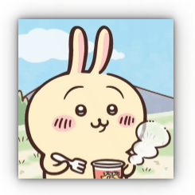
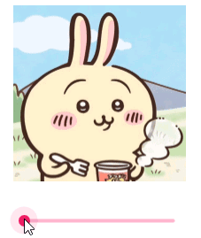
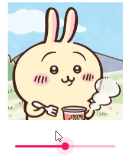
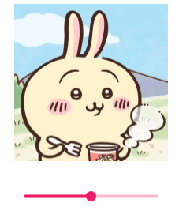
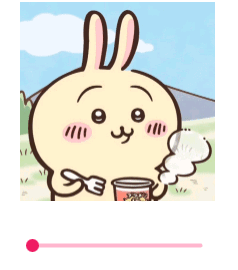

# MultiEffect

>  import QtQuick.Effects

MultiEffect 类型是被弃用的 Qt 图形效果（来自 Qt 5）的后续版本，它会对源项应用后处理效果。与 Qt 图形效果模块相比，MultiEffect 将多种效果（模糊、阴影、色彩化等）整合到一个单独的项和着色器中，这使其更适合多种效果的处理。有多种着色器变体，根据所使用的功能选择最优化的那一个。

MultiEffect 是专门为大多数常见效果而设计的，并且可以轻松进行动画处理。如果 MultiEffect 中没有您所需的效果，可以考虑使用 Qt Quick 效果生成器来实现自定义效果。有关着色器效果的更多信息，请参阅 ShaderEffect 参考文档。

请注意，MultiEffect 类型会与源项一起生成一个新的视觉项。若要将效果应用到源项上，您需要将新的 MultiEffect 项放置在源项的位置上。如果源项和 MultiEffect 项都不是不透明的，那么两个项都会可见，从而可能导致无法获得预期的效果。要隐藏源项，您可以采取以下任何一种方法：

+ 将源项的“可见性”设置为“false”。在这种情况下，源项不会被渲染出来，也无法接收触摸或点击输入。
+ 将源项的“不透明度”设置为“0”。在这种情况下，源项是完全透明的，但仍能接收触摸或点击输入。

## 模糊

下面示例，演示了模糊效果：

```css
    Image{
        id:img1
        anchors.left: img.right
        anchors.leftMargin: 100
        source:'/Resource/images/tutu.png'
        width: implicitWidth/2
        height:implicitHeight/2
    }
    MultiEffect{
        source: img1
        anchors.fill: img1
        blurEnabled: true
        blur: 0.5
        blurMax: 39
        blurMultiplier: 10
    }
```

定义`MultiEffect`对象，`source`属性表明要应用特效的对象，还必须使用`anchors.fill`才能看到特效效果！

+ **blurEnabled：**是否启用模糊特效
+ **blur：**模糊半径，其取值范围为 0.0（无模糊）至 1.0（完全模糊）。默认置为 0.0（无变化）。完全模糊的程度受 blurMax 和 blurMultiplier 的影响。
+ **blurMax：**此属性定义了当模糊半径为 1.0 时所能达到的最大像素半径。此值的有效范围为 2（轻微模糊）至 64（高度模糊）。默认设置为 32。为获得最佳性能，请根据需要选择最小值。
+ **blurMultiplier：**此属性定义了一个用于扩大模糊半径的乘数。该值的范围从 0.0（未进行乘法运算）到无穷大。默认情况下，该属性设置为 0.0。增加乘法因子会扩大模糊半径，但会降低模糊质量。与 blurMax 相比，对于较大的模糊半径，这是一个更高效的选项，因为它不会增加纹理查找的次数。

还有一种方式可以对item应用特效，即使用item的`layer`组属性。

```css
    Image{
        id:img
        source:'/Resource/images/tutu.png'
        width: implicitWidth/2
        height:implicitHeight/2
            
        layer.enabled: true			/*必须启用层*/
        layer.effect:MultiEffect{
            source: img
            anchors.fill: img
            blurEnabled: true
            blurMax: 39
            blur: 0.5
            blurMultiplier: 10
        }
    }
```

> 但是，使用layer设置的特效和不使用layer设置的特效表现不太一样！

## 阴影

```css
    Image{
        id:img
        source:'/Resource/images/tutu.png'
        x:50
        y:50
        width: implicitWidth/2
        height:implicitHeight/2
        layer.enabled: true
        layer.effect:MultiEffect{
            source: img
            anchors.fill: img
            shadowEnabled: true
        }
    }
```




+ **shadowEnabled：**是否启用阴影特效
+ **shadowColor：**阴影颜色
+ **shadowBlur：**阴影模糊半径，取值范围:[0~1]，默认值为1
+ **shadowScale：**此属性定义了阴影的缩放。缩放是从对象的中心开始进行的。取值范围:[0~无穷大]，默认值为1
+ **shadowOpacity：**此属性定义了阴影的透明度。该值会与阴影颜色的 alpha 值相乘。取值范围:[0~1]，默认值为1

+ **shadowVerticalOffset：**此属性定义了阴影相对于项目中心的垂直偏移量。取值范围:[负无穷大~无穷大]，默认值为0
+ **shadowHorizontalOffset：**此属性定义了阴影相对于项目中心的水平偏移量。取值范围:[负无穷大~无穷大]，默认值为0

## 色彩

**saturation : real：**饱和度，该值的范围从 -1.0（完全无色）到无穷大。默认情况下，该属性被设置为 0.0（无变化）。

```css
    Image{
        id:img
        source:'/Resource/images/tutu.png'
        x:50
        width: implicitWidth/2
        height:implicitHeight/2
        layer.enabled: true
        layer.effect:MultiEffect{
            source: img
            anchors.fill: img
            saturation : slider.value * 100
        }
    }
    Slider{
        id:slider
        width: img.width
        anchors.top: img.bottom
        anchors.left: img.left
        anchors.topMargin: 20
    }
```



**brightness : real：**亮度，该值的范围在 -1.0 到 1.0 之间。默认情况下，该属性被设置为 0.0（即无变化）。

```css
  Image{
        id:img
        source:'/Resource/images/tutu.png'
        x:50
        width: implicitWidth/2
        height:implicitHeight/2
        layer.enabled: true
        layer.effect:MultiEffect{
            source: img
            anchors.fill: img
            //saturation : slider.value * 100
            brightness :slider.value
        }
    }
    Slider{
        id:slider
        width: img.width
        anchors.top: img.bottom
        anchors.left: img.left
        anchors.topMargin: 20
        from: -1
        to:1
    }
```



**contrast : real：**对比度，该值的范围在 -1.0 到 1.0 之间。默认情况下，该属性被设置为 0.0（即无变化）。



**colorization : real：**着色，其取值范围为 0.0（未着色）至 1.0（完全着色）。默认情况下，该属性设置为 0.0（无变化）。

**colorizationColor : color：**此属性定义了用于为源内容着色的 RGBA 颜色值。色彩化，默认情况下，该属性被设置为 Qt.rgba(1.0, 0.0, 0.0, 1.0)（即红色）。

