# Qt Charts概述

Qt Charts支持创建时尚的、交互式的、以数据为中心的用户界面。为了便于集成，Qt Charts使用图形视图框架。图表组件可以作为QWidget或QGraphicsWidget对象或QML类型使用。

QChart类管理不同类型的系列和其他图表相关对象(如图例和轴)的图形表示。QChart是一个QGraphicsWidget，可以在QGraphicsScene中显示。一个更简单的解决方案是通过使用方便的类QChartView而不是QChart在布局中显示图表。在QML中，图表使用ChartView类型显示。

通过使用QChart类的专门化QPolarChart类或ChartView类型的专门化PolarChartView QML类型，一些图表组件也可以显示为极性图表。

可以通过使用主题、修改颜色和属性、隐藏图表组件或动画图表来定制图表的外观。

模型映射器允许使用从QAbstractItemModel类派生的数据模型作为图表的数据源。模型映射器可以是水平的，也可以是垂直的。

## 入门指南

要链接到Qt Charts模块，将这一行添加到qmake项目文件中:

```cpp
 QT += charts
```

CMake项目文件请添加

```cmake
find_package(Qt6 COMPONENTS Widgets Charts REQUIRED)
```

## 图表类型

Qt Charts模块提供了以下图表类型:

折线图和样条图

面积图和散点图

柱状图

饼图

盒须图

蜡烛图表

极坐标图

每种图表类型都由QML中的QAbstractSeries派生类或AbstractSeries派生类型表示。图表是通过使用系列类的实例并将其添加到QChart或ChartView实例来创建的。

```cpp
 QLineSeries* series = new QLineSeries();
 series->add(0, 6);
 series->add(2, 4);
 ...
 chartView->chart()->addSeries(series);
 chartView->chart()->createDefaultAxes();
```

您可以在一个图表中组合不同类型的系列。

### 折线图(QLineSeries)

折线图用于将信息表示为由直线连接的一系列数据点。

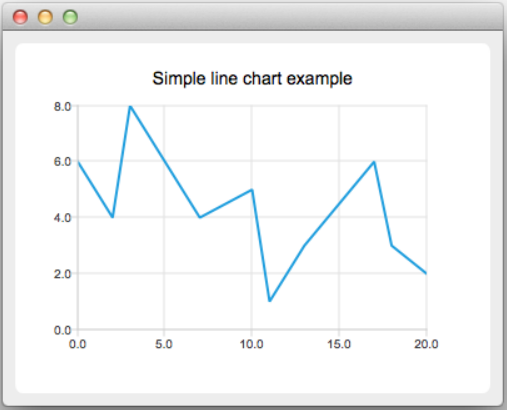

折线图是通过使用QLineSeries类实现的。

### 曲线图(QSplineSeries)

> 样条图

样条图是通过使用继承QLineSeries的QSplineSeries类或继承LineSeries的SplineSeries类型实现的。

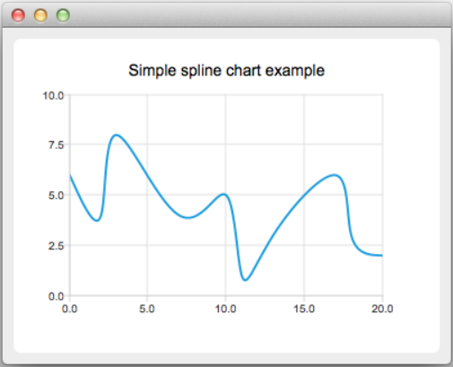

### 面积图(QAreaSeries)

> 区域图

面积图将数据表示为由两条线连接的区域

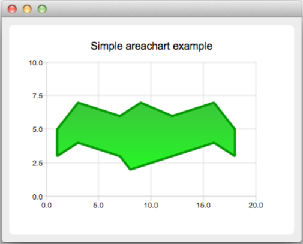

面积图是通过使用QAreaSeries类实现的。默认情况下，x轴作为一个边界，QLineSeries作为另一个边界。但是，你可以同时使用QLineSeries作为边界。

### 散点图(QScatterSeries)

散点图将数据表示为点的集合

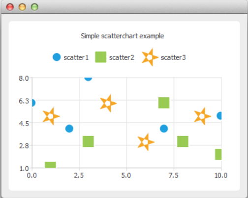

散点图是通过使用QScatterSeries类实现的。

### 柱状图(QBarSeries)

> 直方图；条形统计图

条形图以按类别分组的水平或垂直条形表示数据。QBarSet类表示柱状图中的一组柱状。QAbstractBarSeries类是所有栏系列类的抽象父类。序列(series)类型决定了数据的呈现方式。

QBarSeries类将数据表示为按类别分组的竖条。类似地，QHorizontalBarSeries类将数据表示为水平条。

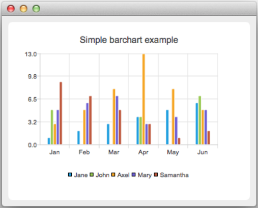

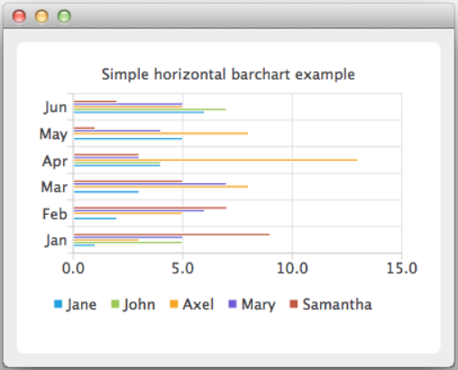

QStackedBarSeries类将一系列数据表示为垂直堆叠的条，每个类别一个条。相应的水平类是QHorizontalStackedBarSeries

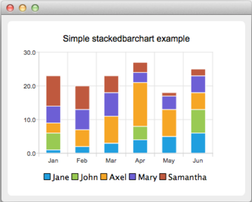

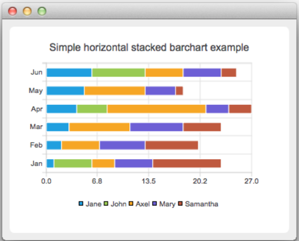

QPercentBarSeries类以每个类别的百分比表示一系列分类数据。相应的水平类是QHorizontalPercentBarSeries。

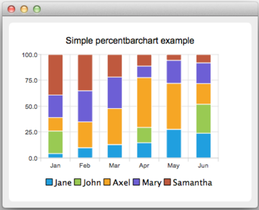

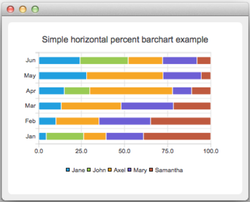

### 饼图(QPieSeries)

饼图将数据表示为由饼图切片组成的饼图。饼是使用QPieSeries类实现的，饼片是使用QPieSlice类添加的。

通过指定洞的大小在0.0到1.0之间，可以将饼变成甜甜圈。

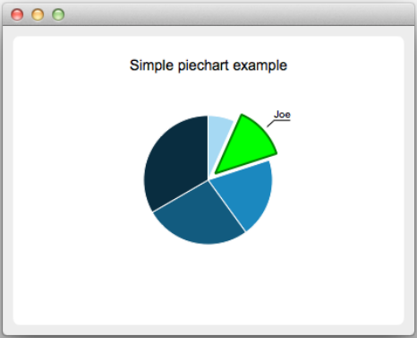

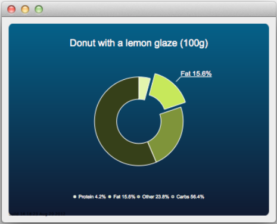

### 线箱图(QBoxPlotSeries)

> 盒须图;盒式图

盒须图将数据表示为四分位数，扩展了显示值可变性的须。箱形图系列中的项目按类别分组，类似于条形图系列中的条形集。对于每个盒须项，指定了下限、下限四分位数、中位数、上限四分位数和上限极值。

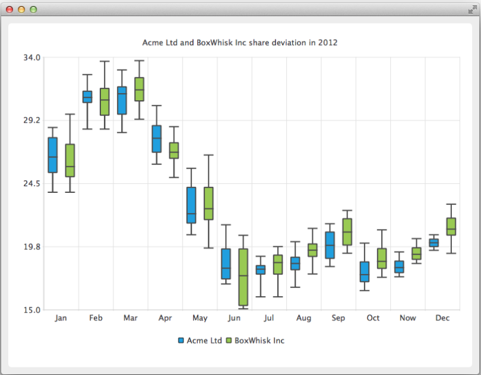

### 蜡烛图(QCandlestickSeries)

> K线图

烛台图以烛台的形式呈现一系列数据。

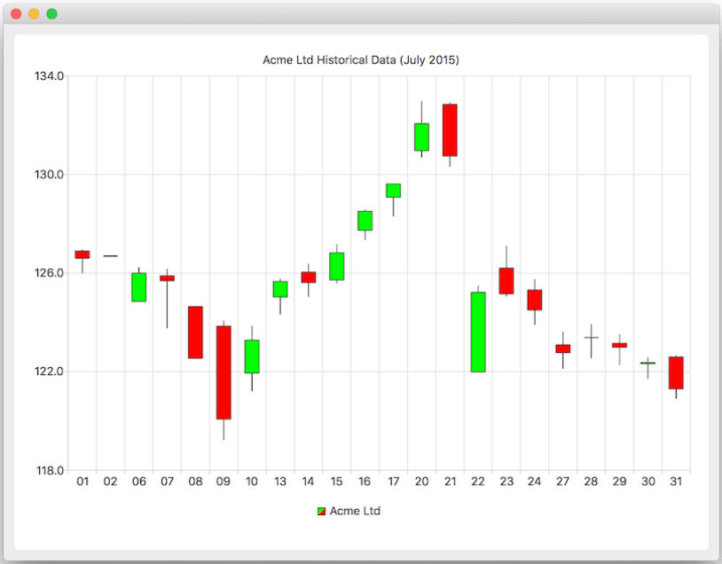

烛台图是通过使用QCandlestickSeries和QCandlestickSet类实现的。

### 极坐标图(QPolarChart)

极坐标图以圆形图形的形式显示数据，其中数据的位置基于图形中心(极点)的角度和距离。

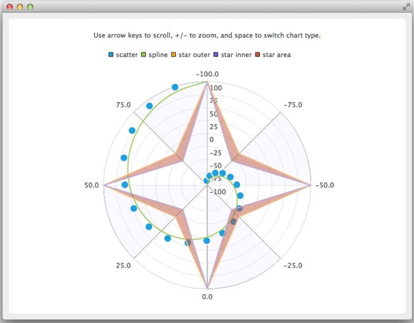

QPolarChart类是QChart类的专门化。它支持直线、样条、区域和散点系列，以及它们支持的所有轴类型。轴既可以用作径向轴，也可以用作角轴。

## 坐标抽

Qt Charts支持以下轴类型:

+ Value axis(值轴)
+ Category axis(类别轴)
+ Bar category axis(杆类轴)
+ Date-time axis(日期-时间轴)
+ Logarithmic value axis(对数值轴)

可以设置轴来显示带有标记、网格线和阴影的线。轴上的值画在标记的位置上。所有轴类型都是QAbstractAxis类的专门化。

### 值轴(QValueAxis)

值轴为图表轴添加实际值。它是使用QValueAxis类实现的。

### 分类轴(QCategoryAxis)

> 类别轴

类别轴是使用QCategoryAxis类实现的。它具有命名范围和可调范围宽度。

### 条形分类轴(QBarCategoryAxis)

> 杆类轴

条形分类轴类似于分类轴，但是所有范围的范围宽度是相同的。bar类别轴是使用QBarCategoryAxis类实现的。

### 日期-时间轴(QDateTimeAxis)

日期-时间轴向图表轴添加日期和时间。它是使用QDateTimeAxis类实现的。

### 对数值轴(QLogValueAxis)

对数轴将对数刻度添加到图表的轴上。对数刻度是一种基于数量级的非线性刻度，因此轴上的每个刻度标记都是前一个刻度标记乘以一个值。对数轴是使用QLogValueAxis类实现的。

### 注意

可以为一个图表定义多个轴。坐标轴可以放在图表的上下左右。此外，轴可以是不同类型的。但是，不支持混合会导致不同域的轴类型，例如在同一方向上指定QValueAxis和QLogValueAxis。

## 图例(Legend)

图例是显示图表图例的图形对象。图例对象不能创建或删除，但可以通过QChart类引用它们。当序列发生变化时，图例状态由QChart更新。

图例可以位于图表的下方或上方，也可以位于图表的左侧或右侧。默认情况下，图例附加到图表视图，但它可以分离到一个独立的图形项，可以自由移动。

可以从图例中隐藏单个标记，也可以隐藏整个图例。

图例标记可以通过使用QLegendMarker基类和每个系列类型的子类来修改:QAreaLegendMarker, QBarLegendMarker, QBoxPlotLegendMarker, QCandlestickLegendMarker和QXYLegendMarker。

## 与图表交互

最终用户可以通过以下方式与图表进行交互:动态地向图表添加值、向下钻取数据、放大和缩小图表、滚动图表、单击图表中的项目或将鼠标悬停在图表上。

### 动态绘制数据

可以动态地向图表添加数据，并使图表视图自动滚动以显示新数据。

### 深入数据

例如，可以将下钻效果实现为条形图或饼状图。当用户在图表中选择项目时，将显示该项的更详细视图。这是通过删除第一个系列并添加另一个系列来实现的。

### 缩放和滚动

用户可以使用键盘进行缩放和滚动。他们可以使用方向键滚动图表，使用加减号键放大或缩小图表。此外，QRubberBand可用于选择要放大的区域。

### 点击和悬停

您可以将插槽连接到最终用户单击图表中的项目或将鼠标悬停在图表上时发出的信号。这使您能够向图表中添加元素，如标注。

## 主题

主题是与UI样式相关的设置的内置集合，应用于图表的所有视觉元素，如颜色、钢笔、画笔和系列字体，以及轴、标题和图例。

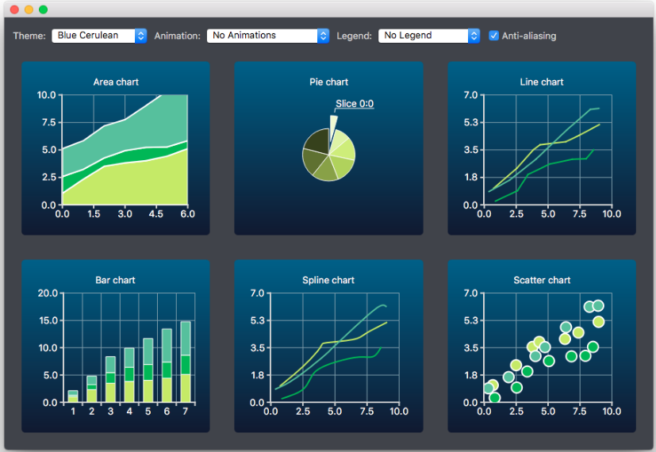

Qt图表附带以下预定义的主题:

+ Light主题，这是默认主题
+ 天蓝色主题
+ 黑暗的主题
+ 沙棕色主题
+ 自然色彩系统(NCS)蓝色主题
+ 高对比度主题
+ 冰蓝色主题
+ Qt的主题

主题可以通过改变颜色、钢笔、画笔和字体来定制。可以通过修改Qt Charts源代码添加新的主题。

注意:更改主题将覆盖先前应用于该系列的所有自定义。