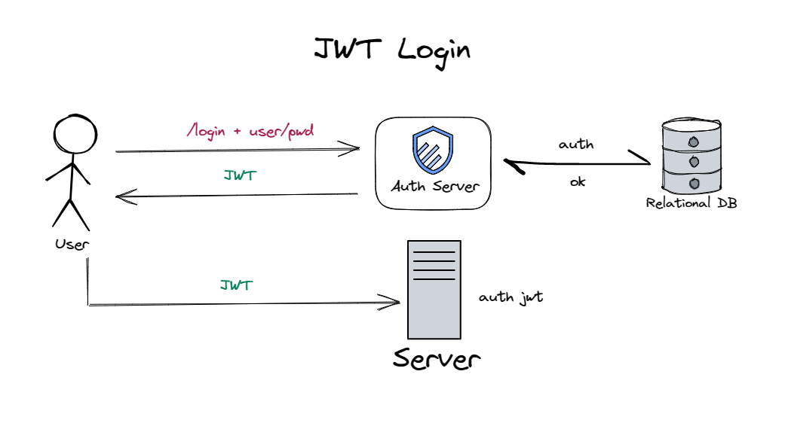
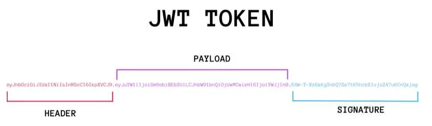

## Jwt

针对前后端分离的项目，大多是通过 token 进行身份认证来进行交互，今天将介绍一种简单的创建 token 的方式 -- Jwt。

### 定义

JSON Web Token（JWT）是一个非常轻巧的规范，是一个基于 RFC 7519 的开放[数据标准](https://so.csdn.net/so/search?q=数据标准&spm=1001.2101.3001.7020)，它定义了一种宽松且紧凑的数据组合方式。这个规范允许我们使用 JWT 在用户和服务器之间传递安全可靠的信息。



JWT中一般涵盖了用户身份信息，每次访问时，server校验信息合法性即可。

### 组成部分

一个 JWT 实际上就是一个字符串，它由三部分组成，头部(header)、载荷(payload)与签名(signature)。前两部分需要经过 Base64 编码，后一部分通过前两部分 Base64 编码后再加密而成。

三部分之间使用“.”进行连接，格式：`header.payload.signature`



#### 头部(header)

头部用于描述关于该 JWT 的最基本的信息，例如其类型以及签名所用的算法等，被表示成一个 JSON 对象。例如：

```json
{"typ":"JWT","alg":"HS256"}
```

alg：表示签名的算法，默认是 HMAC SHA256（写成 HS256）；

typ： 表示令牌（token）的类型，JWT 令牌统一写为 JWT。

经过 Base64 编码得到：`eyJ0eXAiOiJKV1QiLCJhbGciOiJIUzI1NiJ9`（第一部分 header）

[Base64在线编解码](https://base64.us/)

#### 载荷(payload)

Payload 部分也是一个 JSON 对象，用来存放实际需要传递的有效信息。

##### 标准载荷

有很多，建议使用，但不强制，对JWT信息作补充。

|标准载荷	|介绍|
|------|------|
|iss (issuer)	|签发人（谁签发的）|
|exp (expiration time)	|过期时间，必须要大于签发时间|
|sub (subject)	|主题（用来做什么）|
|aud (audience)	|受众(给谁用的)比如：http://www.xxx.com|
|nbf (Not Before)	|生效时间|
|iat (Issued At)	|签发时间|
|jti (JWT ID)	|编号，JWT 的唯一身份标识|

##### 自定义载荷

可以添加任何的信息，一般添加用户的相关信息或其他业务需要的必要信息。但不建议添加敏感信息，因为该部分在客户端可解密。

```json
{"user_id":"123456","username":"maye"}
```

将该 json 字符串进行 Base64 编码得到：`eyJ1c2VyX2lkIjoiMTIzNDU2IiwidXNlcm5hbWUiOiJtYXllIn0=`（第二部分 payload）。

#### 签名(signature)

Signature 部分是对前两部分的签名，防止数据篡改。

首先，需要指定一个密钥（secret）。这个密钥只有服务器才知道，不能泄露给用户。因为有这个密钥的存在，所以即便调用方偷偷的修改了前两部分的内容，在验证环节就会出现签名不一致的情况，所以保证了安全性。

然后，使用 Header 里面指定的签名算法（默认是 HMAC SHA256），按照下面的公式产生签名。

```cpp
signature = HS256(BASE64(header) + "." + BASE64(payload) + secret) 
```

即将`eyJ0eXAiOiJKV1QiLCJhbGciOiJIUzI1NiJ9.eyJ1c2VyX2lkIjoiMTIzNDU2IiwidXNlcm5hbWUiOiJtYXllIn0=`(header+.+payload)进行HS256算法加密得到`afd9c8eaffd57f07378a6909349b7babaa151294e8231fbff6ed7a6c397dc8b4`。

算出签名以后，把 Header、Payload、Signature 三个部分拼成一个字符串，每个部分之间用"点"（`.`）分隔，就可以返回给用户。

```cpp
eyJ0eXAiOiJKV1QiLCJhbGciOiJIUzI1NiJ9.eyJ1c2VyX2lkIjoiMTIzNDU2IiwidXNlcm5hbWUiOiJtYXllIn0=.afd9c8eaffd57f07378a6909349b7babaa151294e8231fbff6ed7a6c397dc8b4
```


